# 20230613_计算机网络总复习_20230619170636

<!-- page: 1 -->

计算机网络总复习

袁  华  hyuan@scut.edu.cn

华南理工大学计算机科学与工程学院

广东省计算机网络重点实验室

<!-- page: 2 -->

总评成绩

总评成绩构成：40%期末卷面+35%线测（平时、表现）

+15%实验+5%课堂签到+5%讨论贴

考试范围

课件ppt为纲、教材、在线测试、课堂练习和例题

SPOC网站（线上资源）

实验2~4（ip add、ip route、模式转换、路由表解读、报文解读）

参考网址：http://course.jw.scut.edu.cn/jsjwl/index.aspx

SPOC或MOOC上的题可以反复try，查漏补缺

<!-- page: 3 -->

期末考试题型

期末考试题型和构成

选择填空（40%）

判断对错（10%）

计算、综合分析题、简答（50%）

<!-- page: 4 -->

第一章

理解计算机网络的定义

了解计算机网络的硬件

了解计算机网络软件

了解计算机网络的发展历史

补：网络的基本概念

掌握两种参考模型及其比较

了解网络实例

了解计算机网络的相关标准

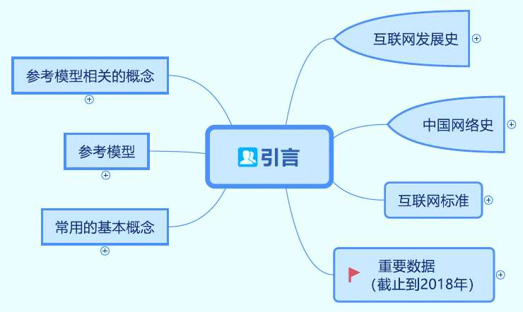

<!-- page: 5 -->

第一章（续）

掌握封装（打包）和解封装（解包）的概念

各层的名称及PDU名称

理解对等通信（虚拟通信）的内涵

了解广域网连接

理解并掌握OSI参考模型各层的特点

了解计算机网络的分类

<!-- page: 6 -->

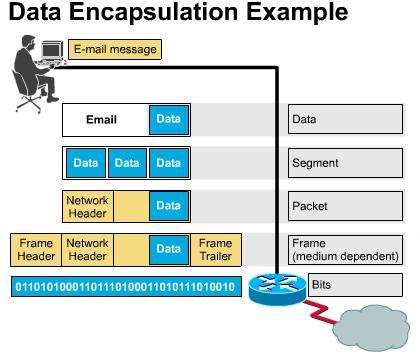

<!-- page: 7 -->

第二章的主要内容

相关的数据通信基础知识
掌握重要传输介质的特点及如何选购

有线（UTP、光纤）
通信系统实例

掌握PSTN公共电话网络及相关技术
了解移动电话系统
了解有线电视网络和ADSL
了解物理层的设备

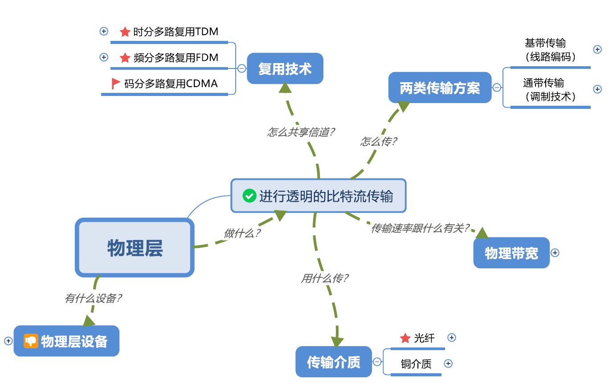

<!-- page: 8 -->

物理层的地位

最基础的一层

本书参考模型

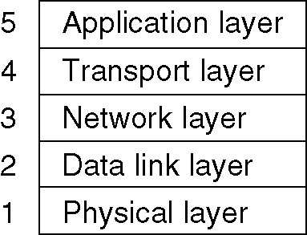

<!-- page: 9 -->

物理层的主要功能

物理层的功能

在两个网络设备之间提供透明的比特流传输。

物理层的四个重要特性

机械特性 (mechanical characteristics)

电气特性 (electrical characteristics)

功能特性 (functional characteristics)

规程特性 (procedural characteristics)

<!-- page: 10 -->

第二章（一）

了解傅立叶分析

掌握乃奎斯特定理（记住公式及使用）

掌握香农定理（记住公式及使用）

掌握重要的传输介质的特性

了解物理层设备

掌握冲突

<!-- page: 11 -->

第二章（二）

了解无线传输

了解通信卫星

了解调制解调器

掌握几种调制方法

信号星座

了解编码解码器

掌握常见的编码方法

了解电话系统

<!-- page: 12 -->

第二章（三）

掌握干线复用技术

FDM (WDM)

TDM

理解T1和E1

了解SONET/SDH

理解SONET帧构成及标准速率计算（不要求）

<!-- page: 13 -->

第二章（四）

掌握电路交换、分组交换、报文交换及其比较

了解移动通信系统

掌握CDMA原理

了解有线电视上网

掌握PSTN的构成及主要技术

<!-- page: 14 -->

信道的最大数据传输速率

乃奎斯特定理：无噪声信道

)
(
log
2
2
bps
V
H
=
最大传输速率

香农定理：有噪声信道

S
H
+
=
最大传输速率

)
)(
1(
log2
bps
N

注意：噪声用分贝表示

S
N =

)
(
log
10
10
db
N

<!-- page: 15 -->

线路编码

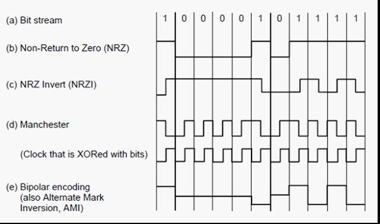

<!-- page: 16 -->

数字信号的模拟传输

调制解调器

振幅调制AM ASK

频率调制FM FSK

相位调制PM PSK

正交振幅调制QAM (图2-19)

<!-- page: 17 -->

波特率和波特率

波特率：每秒钟信号变化的次数

比特率与波特率的关系

  其中：C：比特率； B：波特率； n：调制电平数或线路的状态

数，为2的整数倍。

<!-- page: 18 -->

Modems

(a)
(b)

(a) V.32 for 9600 bps             (b) V.32 bis for 14,400 bps.

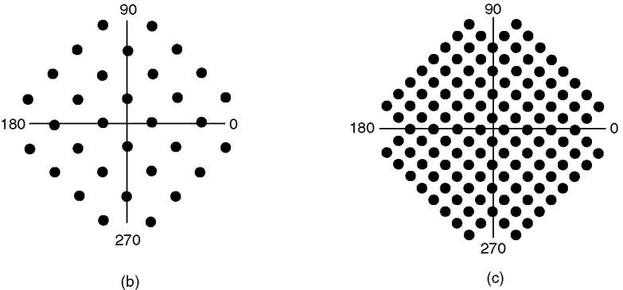

<!-- page: 19 -->

主干的复用技术

频分多路复用FDM

波分多路复用WDM

密集波分多路复用DWDM

时分多路复用TDM

同步TDM

异步TDM

<!-- page: 20 -->

OC-1基本帧构成（不要求）

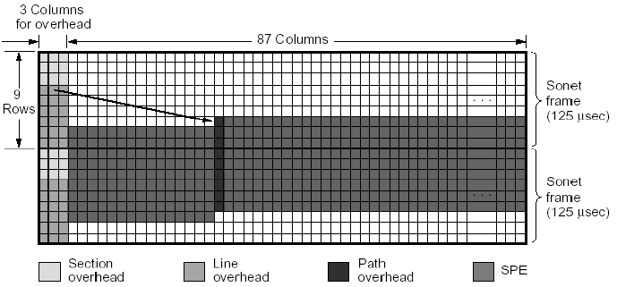

<!-- page: 21 -->

电路交换和分组交换的不同

带宽的分配形式不同

容错能力的不同（分组交换更强）

有无交换顺序的不同

运载“货物”的不同

收费方法的不同

<!-- page: 22 -->

CDMA原理

每个比特(bit)时间被分成m个短的时间片，称为时间片 (Chip)。

通常每个比特有64个或128个时间片（Chip）。

每个站点被指定一个唯一的m位的代码，称为时间片序列（Chip

sequence）。

发送“1”时，站点发送chip sequence的原码；

发送“0”时，站点发送chip sequence的反码。

<!-- page: 23 -->

CDMA原理

例如：A的时间片序列为00011011

A发送“1”时为00011011

A发送“0”时为11100100

为解释时容易理解，使用双极概念，用“+1”代替“1”，用“-1”

代替“0”

A发送“1”时为-1-1-1+1+1-1+1+1

A发送“0”时为+1+1+1-1-1+1-1-1

<!-- page: 24 -->

时间片序列的性质

正交特性：设某站的时间序列是S，内含S1…Si，另一个站

的时间序列是T，含T1…Ti

S和T有如下这些性质：（归一化内积）

<!-- page: 25 -->

实例之复用——线形相加

其中“-”表示该站未发送。

复用信号

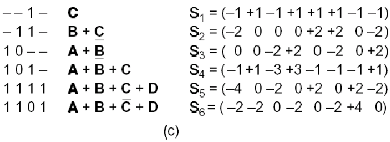

<!-- page: 26 -->

解复用原理——接收还原

运用内积规则

如收到复用后的S，欲还原C，只需求S x C即可。

   例：S = Ā+ B + C

S x C =( Ā+ B + C ) x C

= Āx C + B x C + C x C

= 0 + 0 + 1 = 1

<!-- page: 27 -->

实例之解复用——接收还原

表示发送了1

表示没有发送

表示发送了0

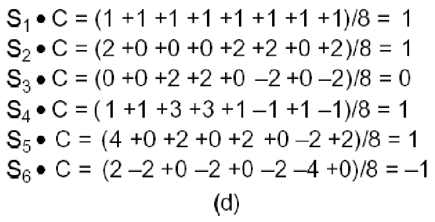

<!-- page: 28 -->

物理层设备

中继器：repeater

集线器：hub

作用：再生信号，即去噪、放大

逐渐消失：增大了冲突域，降低了性能

<!-- page: 29 -->

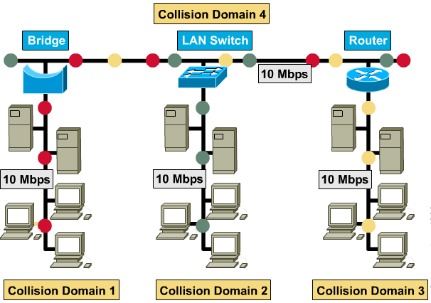

<!-- page: 30 -->

第三章思维导图

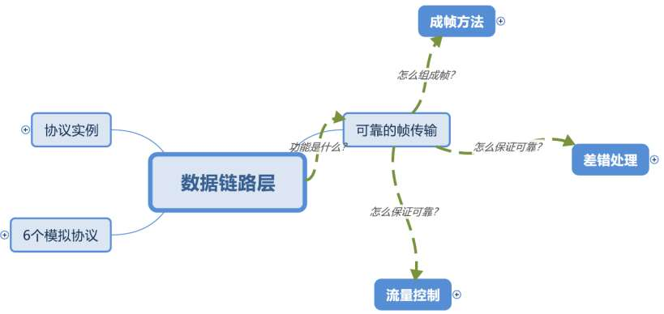

<!-- page: 31 -->

第三章

理解数据链路层功能

掌握成帧的方法

掌握重要的检错和纠错方法

海明码

循环冗余码CRC（互联网校验和）

<!-- page: 32 -->

第三章（续）

掌握6种基本的DLL协议

掌握PAR/ARQ

掌握捎带确认

掌握滑动窗口协议

发送/接收窗口的定义

窗口滑动的条件

窗口尺寸怎么确定

<!-- page: 33 -->

第三章（续）

学习Internet上的数据链路协议

了解HDLC及帧格式

掌握PPP组成

掌握ppp使用过程

了解pap和chap的特点

<!-- page: 34 -->

数据链路层的功能P157

为网络层提供服务，良好的服务接口

保证数据传输的有效、可靠：

处理传输错误：差错检测和控制

流量控制

<!-- page: 35 -->

成帧

帧的一般格式

成帧的方法

字符计数法

字节填充的标志字节法

比特填充的标志比特法

物理层编码违例法

<!-- page: 36 -->

海明距离（ Hamming Distance ）

海明距离

两个码字(codeword)的海明距离 :

   两个码字之间不同位的数目。

   如：10001001 和10110001 的海明距离为3。

异或

全部码字的海明距离

   全部码字中任意两个码字之间海明距离的最小值。

<!-- page: 37 -->

海明距离与检错和纠错的关系(2/2)

合法码字1

合法码字1

d

d+1

2d+1

d+1

合法码字2

合法码字2

合法码字2n-1

合法码字2n-1

d+1

2d+1

合法码字2n

合法码字2n

什么是编码系统的海明距离？

<!-- page: 38 -->

海明距离与检错和纠错的关系

海明距离为d+1的编码能检测出d位差错。

因为在距离为d+1的检验码中，只改变d位的值，

不可能产生另一个合法码。如奇偶校验码，海明距

离为2，能查出单个错。

 海明距离为2d+1的编码，能纠正d位差错。

因为此时，如果一个码字有d位发生差错，它仍然

跟原来的码字距离最近，可以直接恢复为该码。

<!-- page: 39 -->

纠正单比特错的冗余位下界

冗余位（校验位）：r

数据位：m

纠正单个错误需要的校验位的下届满足:

r
r
m
2
1
+
+

<!-- page: 40 -->

纠1位错的海明码

每一个码字从左到右编号，最左边为第1位

校验位和数据位

凡编号为2的乘幂的位是校验位，如1、2、4、8、16、……。

其余是数据位，如3、5、6、7、9、……。

每一个校验位设定根据：包括自己在内的一些位的集合的奇偶值

(奇数或偶数)。

<!-- page: 41 -->

如何决定每个数据位的校验位

将某一位数据位的编号展开成2的乘幂的和，那末每一项所对应的位即为该

数据位的校验位。

如：  11 = 1 + 2 + 8

29 = 1 + 4 + 8 + 16

校验位1的检验集合为所有奇数位。

校验位2的检验集合：2、3、6、7、10、11、…

校验位4的检验集合：4、5、6、7、……

校验位8的检验集合：8、9、10、11、……

<!-- page: 42 -->

海明码实例（1/3

如何确定
校验位？
7位
数据位

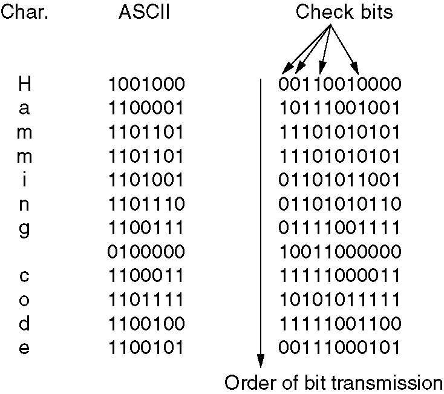

<!-- page: 43 -->

校验位的计算(m=7,r=4)

B1
B2
B3
B4
B5
B6
B7
B8
B9 B10
B11

P1
P2 D1 P3 D2 D3 D4 P4 D5
D6
D7

1=20 √
√
√
√
√
√

2=21
√
√
√
√
√
√

4=22
√
√
√
√

8=23
√
√
√
√

<!-- page: 44 -->

海明码实例之校验位计算（2/3）

B1
B2
B3
B4
B5
B6
B7
B8
B9
B10
B11

P1
P2
D1
P3
D2 D3 D4
P4
D5
D6
D7

信息码
-
-
1
-
0
0
1
-
0
0
0

检验位
0
0
-
1
-
-
-
0
-
-
-

海明码
0
0
1
1
0
0
1
0
0
0
0

使用偶校验，一个校验集合里的1的个数是偶数

<!-- page: 45 -->

海明码实例之检验位计算（3/3）

B1
B2
B3
B4
B5
B6
B7
B8
B9 B10 B11

P1
P2 D1 P3 D2 D3 D4 P4 D5
D6
D7

信息码
-
-
1
-
1
0
0
-
0
0
1

检验位
1
0
-
1
-
-
-
1
-
-
-

海明码
1
0
1
1
1
0
0
1
0
0
1

<!-- page: 46 -->

课堂练习（1/2）

原码字为：10101111，采用偶校验海明纠1位错编码，

请问编码后的码字是什么？

解答：m=8，根据                得：

r
r
m
2
)1
(

+
+

r=4， ??1?010?1111

编码后码字是： 101001001111

<!-- page: 47 -->

课堂练习（2/2）

采用上面这道题一样的编码，假设接收方收到一个码字：

1 0 0 1 1 0 0 0 1 1 0 0 (m=8,r=4），请问这个码字对还

是错？如果错，正确的码字应该是什么？

解答：计数器累加：

1+2=3，所以，第3位出错，正确码字应该为：

1 0 1 1 1 0 0 0 1 1 0 0

<!-- page: 48 -->

CRC码计算举例

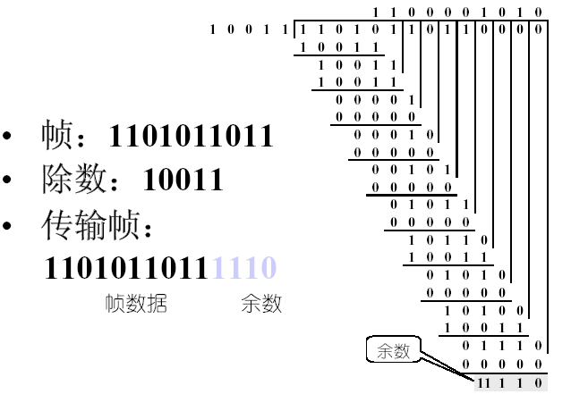

<!-- page: 49 -->

三个生成多项式国际标准

CRC-12：x12 + x11 + x3 + x2 + x1 + 1

用于字符长度为6位

CRC-16 ：x16 + x15+ x2+ 1

用于字符长度为8位

CRC-CCITT ：x16 + x12+ x5+ 1

用于字符长度为8

CRC32：

<!-- page: 50 -->

第四章思维导图

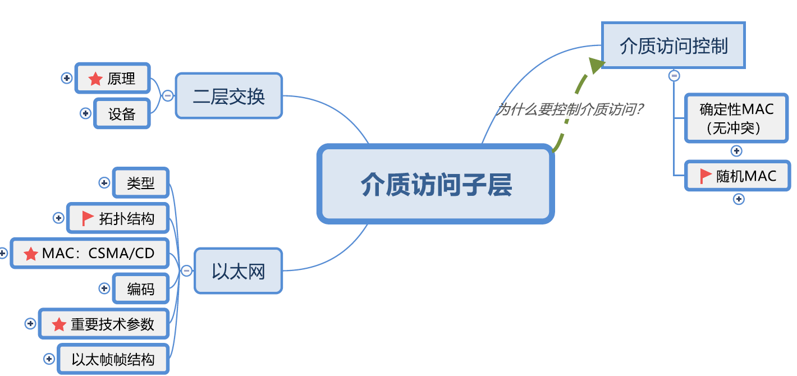

<!-- page: 51 -->

第四章

理解随机访问协议

掌握纯ALOHA协议和分隙ALOHA协议

掌握各种CSMA的特点

CSMA/CD （1持续）

了解无冲突的协议

二层实例：以太网

二层交换基本原理

L2层设备：网桥、交换机

<!-- page: 52 -->

纯ALOHA和分隙ALOHA的比较

纯ALOHA中，一旦产生新帧，就立即发送，全然不顾是否有用

户正在发送，所以发生冲突的可能伴随着发送的整个过程。

分隙ALOHA中，规定发送行为必须在时隙的开始，一旦在发送

开始时没有冲突，则该帧将成功发送

36.8

数学分析效率

18.4

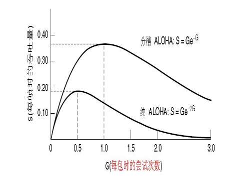

<!-- page: 53 -->

CSMA/CD

CSMA with Collision Detection

“先听后发、边发边听”

<!-- page: 54 -->

第四章（续）

了解IEEE802系列标准

掌握以太网/IEEE802.3工作原理

拓扑结构

介质访问方式及原理（二进制指数回退）

理解以太网/IEEE802.3帧格式

了解各种以太网的技术特点

<!-- page: 55 -->

IEEE以太网命名规则

10Base2（IEEE 802.3a）

–10：传输带宽

–Base：基带传输

–2（或5）：同轴电缆传输的长度

10Base-TX（IEEE 802.3X）

–T：铜制非屏蔽双绞线

–F：表示光缆

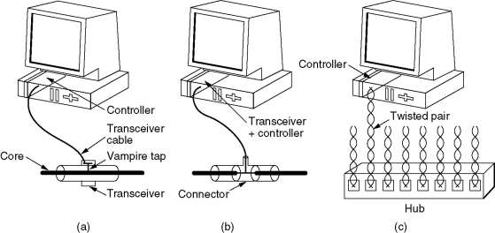

<!-- page: 56 -->

802.3帧和DIX以太帧

帧开始定界
符（SOF）

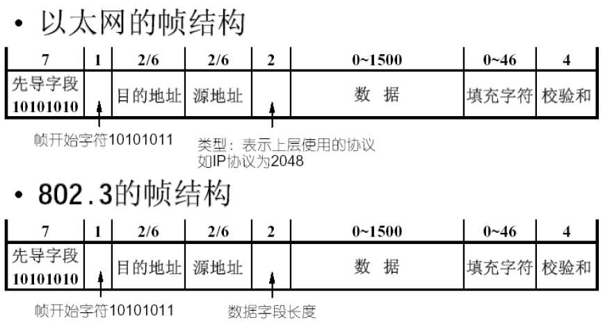

<!-- page: 57 -->

第四章（续）

了解数据链路层交换特点

了解二层设备及桥接、交换技术

掌握网桥的工作原理

掌握交换机的工作原理

理解交换机的三种交换方法及特点

了解微分段

<!-- page: 58 -->

二层交换的原理

flooding --当目的地址未知或为广播地址时，桥发送帧到除源端

口之外的每个端口

三
选
一

forwarding --对于已学到的目的地址，将直接发送帧到对应的

目的设备所在端口

filtering --如果目的地址和源地址在同一端口，桥将丢掉帧

（discarding）

learning --通过读取每个帧的源地址和对应源端口来学习连在网

段上的每个设备的地址

<!-- page: 59 -->

交换模式

存储转发：最慢，出错少

直通交换（贯穿）：最快，出错多

无分片交换：二者的折衷

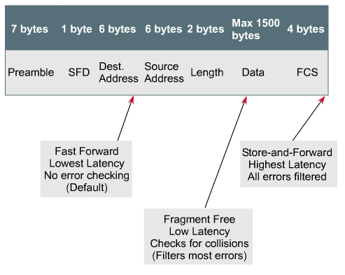

<!-- page: 60 -->

第五章 思维导图

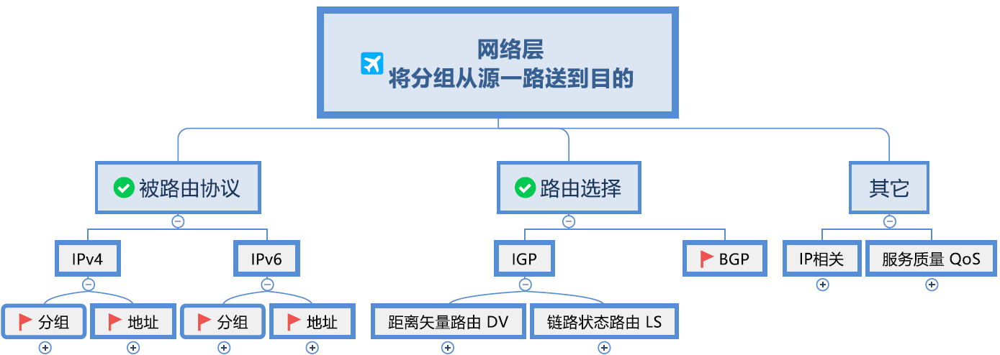

<!-- page: 61 -->

第五章

理解路由器的功能

学习理解IP协议

理解IPv4分组格式

掌握IPv4地址及其分类

掌握IPv4的保留地址空间

掌握子网及子网划分（包括VLSM）

<!-- page: 62 -->

第五章（续）

了解网络层的主要功能

理解路由算法原理

理解Dijkstra算法

掌握距离矢量路由算法：RIP

掌握链路状态路由算法：OSPF

了解多级路由、广播路由、移动路由、adhoc路由、P2P路由等

<!-- page: 63 -->

0        4          8                    16                                     31
IP数据报格式

服务
类型

数据报总长度

协议
版本

头部
长度

数据报标识号
标志
分片偏移

2
0
B

分
组
/
包
头

生存时间
用户协议
报头检验和

源站点IP地址

目的站点IP地址

数据报选项
填充
4
0

数据

<!-- page: 64 -->

分片例子

有一个数据报/分组长4000字节，分组头部的标记位DF=0。现

在该分组要穿越一个MTU=1500字节的网络，必须分片。假如IP

分组头部长20字节。问：需要几个分片？每个分片的偏移量是多

少？

4000B
1500B
1500B
1500B

<!-- page: 65 -->

解答

因为分组头部长20字节，所以，每个分片承载的数据最长为：1480

字节

每个分片最多能够承载的数据是：[1480/8]下取整*8=185*8=1480

共需要的分片数为：[（4000-20）/ 1480 ]上取整=3

第一个分片：0~184,1480B  （F1：M=1，0）

第二个分片：185~369,1480B（F2：M=1，185）

第三个分片：370~500,1020B（F3：？）

<!-- page: 66 -->

IP地址的点分十进制表示

二进制表示难于记忆

表示方法：

将32位IP地址分为4个8位组

每个8位组之间用圆点 “.” 分隔

每个8位组转化为对应的十进制数

<!-- page: 67 -->

特殊的IP地址

32位全为0：0.0.0.0  （P346）

这个主机、这个网络，短暂用作源

路由器指定的默认路由

32位全为1：255.255.255.255  Flood Broadcast

限制广播地址、本地广播

你电脑所在的网络地址

主机部分全为0，如172.16.0.0  网络地址

和广播地址是多少？

主机部分全为1，如172.16.255.255  Direct Broadcast

路由器用于直接广播

127.*.*.*  环回地址 Lookback

169.254.*.*，非正常地址

<!-- page: 68 -->

还有哪些特殊地址？

D类、E类地址

私人地址

不具备全球唯一性

但须 内网唯一

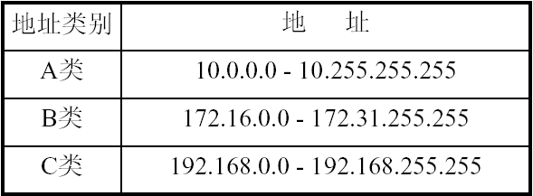

<!-- page: 69 -->

子网规划

子网规划：为了更有效地通信，需要将一个较大的网络

进行划分，如何划分就是子网规划要完成的任务。

借位规则：

从主机域的高位开始借位；

主机域至少保留 2 位。

<!-- page: 70 -->

一个需要掌握的例子

192.168.15.0/24

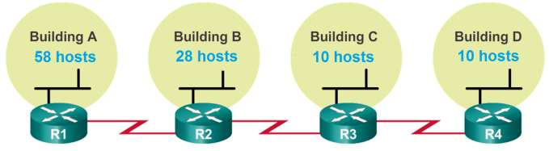

<!-- page: 71 -->

192.168.15.0/24

.XX000000
192.168.15.0/26
192.168.15.64/26 192.168.15.128/26
192.168.15.192/26

192.168.15.64/27
.XXX00000

192.168.15.96/27

.XXXX0000
192.168.15.96/28
192.168.15.112/28

子网B
28 台主机

子网C
10 台主机
子网D
10 台主机

子网A 58

台主机

<!-- page: 72 -->

（续）

192.168.15.0/26
192.168.15.64/26 192.168.15.128/26
192.168.15.192/26

.XXXXXX00
192.168.15.128/30 192.168.15.132/30
192.168.15.136/30

R1-R2 2台

R2-R3
2台主机
R3-R4
2台主机

主机

<!-- page: 73 -->

IPv6地址首选格式：冒分十六进制

如何书写一个128位的地址？

0010000000000001000001000001000000000000000000000000000000000001

0000000000000000000000000000000000000000000000000100010111111111

73

<!-- page: 74 -->

什么是链路本地地址？

只能在同一本地链路节点之间使用，

如何生成链路本地地址？FE80::/64

前64位：FE80:0:0:0

注意：这是MAC地址变的呵！

后64位：EUI-64地址

24

40

ccccccug cccccccc cccccccc

11111111 11111110 xxxxxxxx xxxxxxxx xxxxxxxx

10
64
54

1111111010
0
Interface ID

<!-- page: 75 -->

IPv6基本头（固定头）

基本头部构成

8个字段，共40字节

弹幕：为什么取消

IPv4的选项字段？

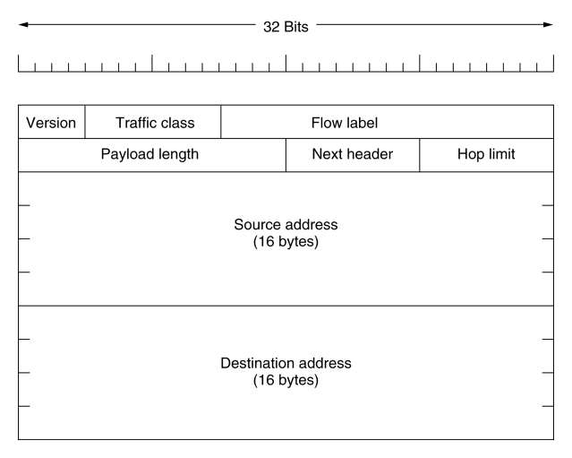

<!-- page: 76 -->

两种寻址方式的比较

适用的网络范围不同，MAC寻址只适合于小型网络；

所依赖的地址结构不同，MAC是平面地址，IP是结构化、层次化

地址，其本身携带了位置信息；

所处的OSI模型层数不同；

地址数目的限制，IP地址有一定的额度，而MAC地址无限制；

两种地址的格式不一样。

<!-- page: 77 -->

网络层的主要功能

最主要的功能是将分组从源机经选定的路由送到目的机。

尽力而为（BestEffort）

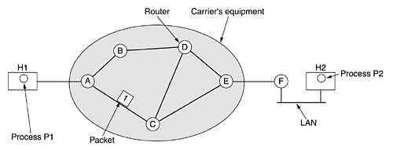

<!-- page: 78 -->

路由总览

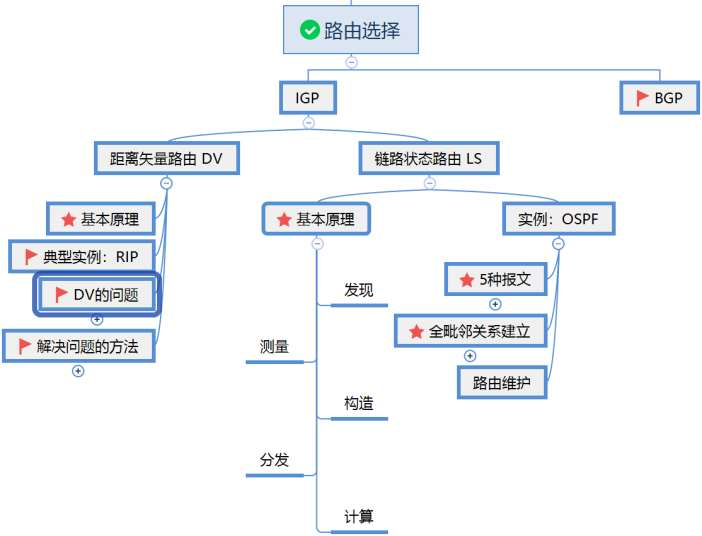

<!-- page: 79 -->

DV的工作原理 P286

每个路由器（节点）维护两个向量， Di 和 Si ，分别表示从该路

由器到所有其它路由器的距离及相应的下一跳（next hop）

在邻居路由器之间交换路由信息（矢量）

每个路由器（节点）根据收到的矢量信息，更新自己的路由表

<!-- page: 80 -->

链路状态路由（Link State）  P288

在1979年前，ARPANET采用DV路由（RIP）协议，此后，采

用了链路状态路由选择协议

目前，链路状态路由算法得到了广泛的应用

链路状态路由的主要思想包括如下5个部分：

发现它的邻居节点们，了解它们的网络地址

设置到它的每个邻居的成本度量

构造一个分组，包含它所了解到的所有信息

发送这个分组给所有其他的路由器

计算到每个路由器的最短路径

<!-- page: 81 -->

OSPF的运行步骤

建立路由器毗邻关系

选举DR和BDR

发现路由

选择最佳路由

维护路由信息

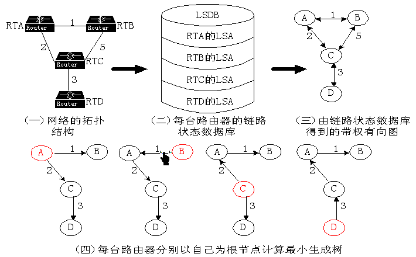

<!-- page: 82 -->

5种OSPF消息

使用的场景

使用过之后发生了什么变化

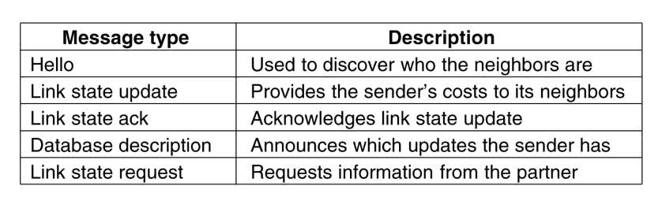

<!-- page: 83 -->

状态迁移图

<!-- page: 84 -->

第五章（续）

理解拥塞控制

理解漏桶算法

理解令牌桶算法

理解网络互联要解决的问题

<!-- page: 85 -->

令牌桶突发时间长度的计算（1/2）

C：为令牌桶的容量，ρ：为令牌到达速率，M：为最大的输出

速率，则最大的突发时间S为：

C + ρS = MS 即S = C/(M -ρ)

例：令牌桶的容量C = 250K byte，令牌到达速率ρ= 2M

byte/s，最大的输出速率M = 25M byte/s时，如令牌桶已满，

则突发时间：

S = 250K/(25M -2M) (ms)

= 250/23 (ms) 约为11 ms

<!-- page: 86 -->

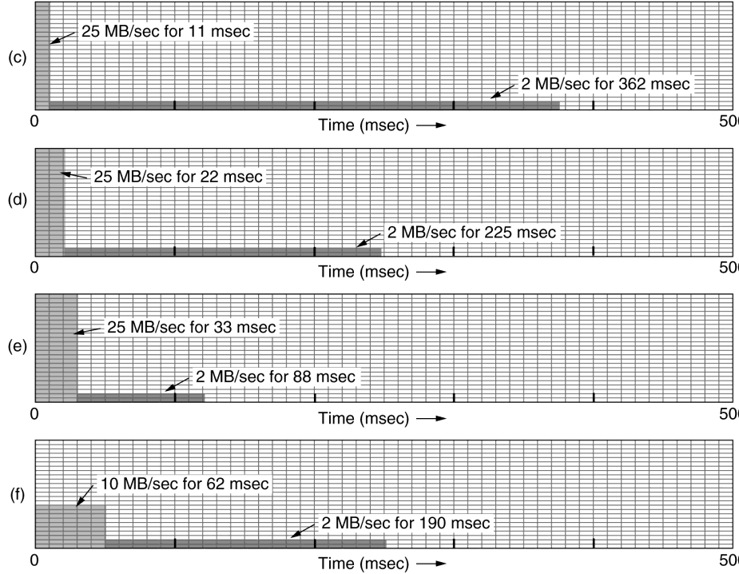

<!-- page: 87 -->

令牌桶突发时间长度的计算（2/2）

剩余的数据按令牌产生速率输出

   (1MB –25MB/s×0.011s) ÷2MB/s = 362ms

为求得更平滑的流量，可在令牌桶之后再接一个一般的漏

桶，令牌桶的输出速率即为漏桶的输入速率。

<!-- page: 88 -->

网络互联

网络互联（internet）的背景

网络互联的类型

LAN-LAN、LAN-WAN、WAN-WAN 、LAN-WAN-LAN

网络的互连必须解决不同网络的差异

<!-- page: 89 -->

路由器的基本功能

收到数据报后路由器的工作步骤

打开数据报

确定目标网络地址

根据路由表，重新打包后转发到相应的接口

上面的步骤完成了路由器的基本功能

路由选择

转发（交换）

其它功能（维护路由表、通告其他路有器等）

<!-- page: 90 -->

数据报在网络中的传送过程

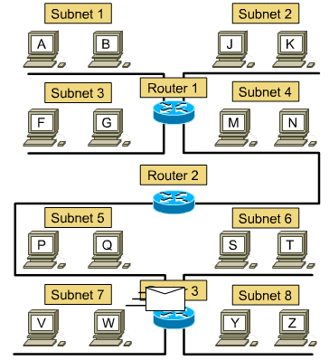

<!-- page: 91 -->

路由表 show ip route

包括目的网络地址、子网掩码、本地接口、下一跳（网

关）、计量值(跳数)等信息。

路由器除了具有与自己直接相连的网络设备的IP地址和

MAC地址，还具有其它路由器的IP地址和MAC地址。

会因为制造厂商及规格而有所差异。

<!-- page: 92 -->

第五章（续）

掌握CIDR基本思想
掌握NAT/PAT基本原理
理解ICMP及其应用

Ping（原理）
Traceroute（原理）
PMTU（原理）
掌握地址解析协议的功能和原理

ARP  （原理、子网内外、帧格式）
RARP
了解IP地址的分配方式（DHCP原理、消息）

<!-- page: 93 -->

缺省网关

当源设备需要的目的地址与自己不在同一个网络时，如果源

不知道目的MAC地址，它必须使用路由器的服务使它的数据

达到目的，当路由器在这种方式下使用时，称为缺省网关。

缺省网关是与源设备所处的网段相连的路由器接口上的IP地

址

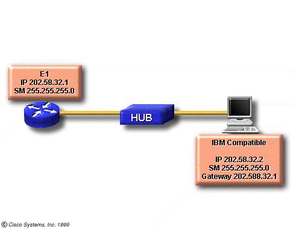

<!-- page: 94 -->

IPv4存在的危机

地址枯竭

路由表膨胀

。。。。。。

<!-- page: 95 -->

解决方法

CIDR

VLSM

DHCP

NAT/PAT

IPv6

<!-- page: 96 -->

第六章 思维导图

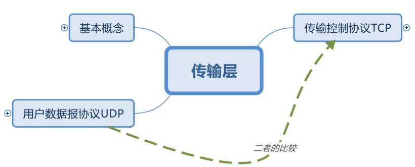

<!-- page: 97 -->

第六章

UDP (数据段segment)

比较

TCP (数据段segment)

提高可靠传输的措施 (传输策略)

肯定确认重传

窗口技术 (滑窗技术)

nagle 算法 和 clark方案

拥塞控制 (慢启动)

定时器的作用

<!-- page: 98 -->

传输层的主要功能


在该层还需对字节流进行数据分段（块）和重组


保证数据可靠传输和进行流量控制


建立端到端的通道；


从一端主机向另一端主机发送数据段


传输层使整个报文到达了该计算机上正确的进程

<!-- page: 99 -->

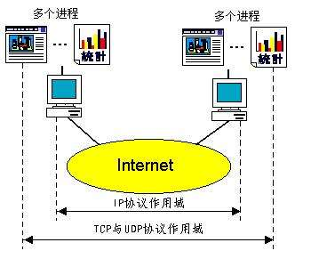

<!-- page: 100 -->

端口

端口：用来跟踪同一时间内通过网络的不同会话。

端口的指定范围：（16位，0~65535）

<1023 : 用于公共应用（保留，全局分配，用于标准服务器），IANA分配；

1024~49151 :用户端口，注册端口；

>49152 : 动态端口，私人端口

<!-- page: 101 -->

UDP 数据段头

UDP 数据段包括8字节（ 8-Byte）的头部和数据两个部分

其中的长度域表示的长度包括头部和数据总共的长度

校验和（checksum）是可选的，如果不计算校验和，则该域置为 0

UDP比IP好的地方在于它可以使用源端口和目的端口

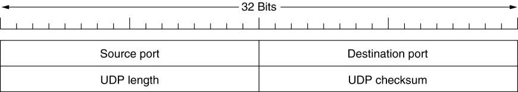

<!-- page: 102 -->

TCP 数据段（TPDU）格式

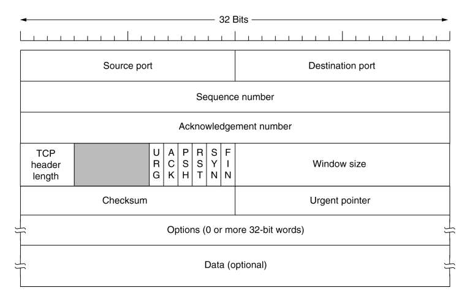

<!-- page: 103 -->

连接建立和释放

典型的连接建立

主机A
主机B
CONNECT

连接释放

Segment1
LISTEN
ACCEPT
Segment2

对称释放

非对称释放

Segment3

<!-- page: 104 -->

慢启动算法(快速重传和快速恢复)

0
5
10
15
20
25
30
35
40
45

0
2
4
6
8
10
12
14
16
18
20
22
24

优化：快速重传、快速恢复

<!-- page: 105 -->

TCP用到的4个计时器

重传计时器

Retransmission Timer

持续计时器

Persistance Timer

保活计时器

Keepalive Timer

时间等待计时器

Time-waited Timer

<!-- page: 106 -->

TCP可靠传输的保证

采用肯定确认重传

采用了面向连接的数据传输服务

做了收发双方的优化

采用了窗口技术

接收窗口

拥塞窗口  （慢启动，AIMD加增乘减）

发送窗口=min{接收窗口，拥塞窗口}

快速重传、快速恢复

<!-- page: 107 -->

为什么使用TCP

可靠传输方式

可让应用程序简单化，程序员可以不必进行错误检查、修正等工

作

<!-- page: 108 -->

为什么使用UDP

为了降低对计算机资源的需求，如DNS

应用程序本身已提供数据完整性的检查机制，勿须依赖传输层的协议来保证

应用程序传输的并非关键性的数据，如路由器周期性的路由信息交换

一对多方式，必须使用UDP（TCP限于一对一的传送），如视频传播

<!-- page: 109 -->

比较TCP和UDP

相同点：

传输层协议

采用TSAP定位应用进程

。。。。。。

不同点

可靠性

使用的场合

。。。。。。

<!-- page: 110 -->

第七章 思维导图

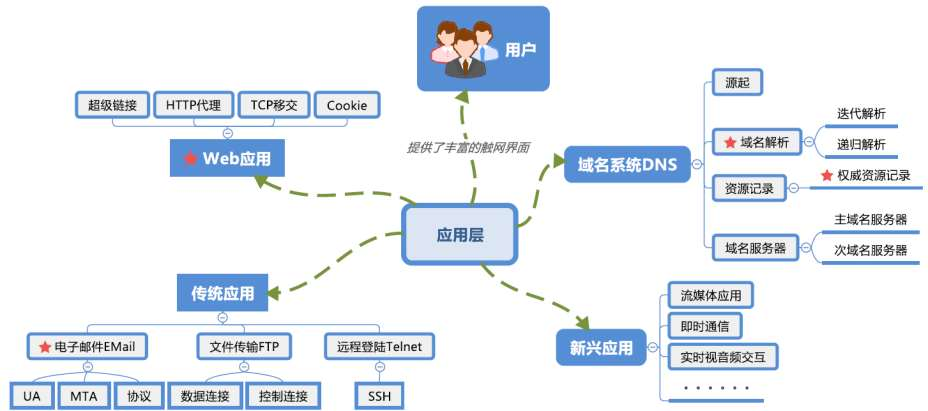

<!-- page: 111 -->

第七章

了解应用层的地位和功能

了解各种应用的特点

DNS

三大传统应用

电子邮件email

文件传输FTP

远程登录telnet

其他应用：WWW、多媒体应用

<!-- page: 112 -->

给同学们的一点建议

广泛阅读、思考、实践

专业、人文、历史、哲学、心理……

让身、心安宁！

学习的过程是辛苦的

学习是一种快乐，尤其是学习自己喜欢的东西

的时候

做一个认识/接纳自己、诚实，心自由的人！

<!-- page: 113 -->

感谢

感谢同学们!

感谢网络上的课件!

感谢网络上的各种相关文献资料!

