# （备份）20230322_第2章_物理层（2）_20230619170155.pdf.223f23df3c4329437a972d72af36495f.20230623234957753

<!-- page: 1 -->

第2章 物理层 （2）

袁华，hyuan@scut.edu.cn

华南理工大学计算机科学与工程学院

广东省计算机网络重点实验室

<!-- page: 2 -->

第二章预习情况

网工完成：75/77=97.4%

计科1完成：87/90=96.7%

2

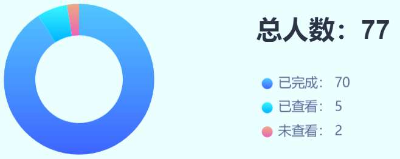

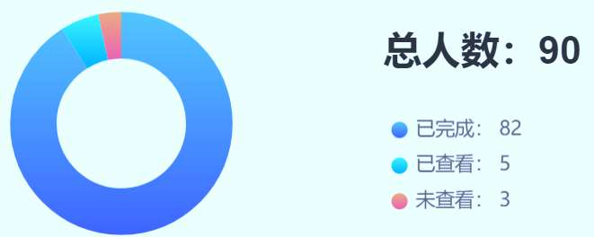

<!-- page: 3 -->

主要内容

信号传输的特点和介质的上限 （2.4）

两类传输（2.4.3）

基带传输（线路编码）

通带传输（调制、信号星座）

复用技术（2.4.4）

PSTN、蜂窝、有线电视、通信卫星 （2.5-2.8）

物理层设备、冲突和冲突域

3

<!-- page: 4 -->

1.傅立叶分析（1/2）P85

预备概念

当一个信号的所有频率成分是某一个频率的整数

倍时，该频率被称为基本频率。

信号的周期等于基本频率信号的周期。

傅立叶级数：任何周期为T的函数g(t)，都可由

（无限个）正弦和余弦函数合成：

   其中，f=1/T是基频，  和     称为正弦和余弦函数

n
a
nb

的n次谐波的振幅。

热的传播理论
Baron Jean Baptiste Joseph Fourier

1768年3月-1830年5月

4
2023/6/19

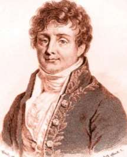

<!-- page: 5 -->

傅立叶分析（2/2）

任何周期信号的传输都可理解为以傅立叶级数的形式传递。

对任何的已知数据信号g(t)，可求得：

5
2023/6/19

<!-- page: 6 -->

有限带宽信号

谐波次数越高，频率越快！

b1

a1

The 1st
harmonic

0

0

T
-a1

T
-b1

a2

b2

The 2nd
harmonic

0

0

T
-a2

T
-b2

b3

a3

The 3rd
harmonic

0

0

T
-a3

T
-b3

6
2023/6/19

<!-- page: 7 -->

谐波越多，重构的信

号越逼真！

时域→频域

频率f、2f、3f…….

7
2023/6/19

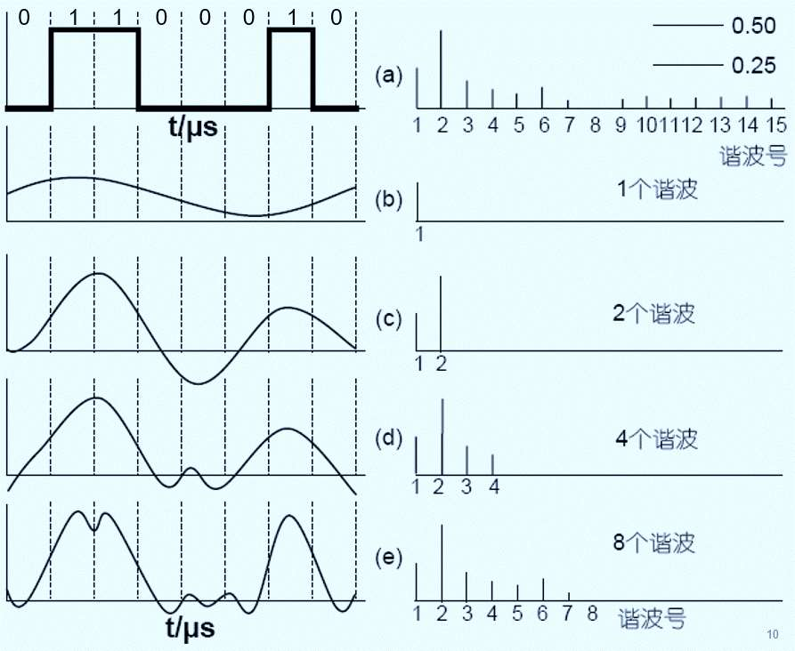

<!-- page: 8 -->

问题P85  （弹幕）

是不是可以这样说？

只要具有足够的适当的振幅、频率和相位的

an arbitrary function,
continous or with
discontinuities, defined
in a finite interval by an
arbitrarily capricious
graph can always be
expressed as a sum of
sinusoids.

正弦波，就可以构造任何一个信号。

J.B.J Fourieer

8
2023/6/19

<!-- page: 9 -->

注意P86

如每个傅立叶级数的信号分量被等量衰减，则合成后，振幅有所

衰减，基本形状不变。

但是，所有的传输设施对不同富立叶分量的衰减并不相同，因此

会导致信号变形(失真)

一般来说，从0~fc这一段频段，振幅在传输过程不会明显衰减，fc

称为截止频率。这段范围称为基带（单位：赫兹）

物理带宽：传输过程中振幅不会明显衰减的频率范围（模拟带宽）

是一种物理特性，通常取决于介质材料的构成、厚度、长度等

9
2023/6/19

<!-- page: 10 -->

物理带宽和傅里叶分析

物理带宽越宽，传输信号的频率（谐波）就越多，信号就越逼近

原始的信号

如果物理带宽很窄，传输信号的频率（谐波）就越少，信号失真

越多。

但事实上，我们更关心的是 数字带宽！

10
2023/6/19

<!-- page: 11 -->

举个例子：传输率/数据率和谐波(频率)

如果比特率是b bps，传输8bit需要的时间T 是8/b 秒，则第一

次谐波的频率（基本频率）是b/8 Hz。

N
1
2
:
n

Frequency (Hz)
b/8
2b/8
:
nb/8

nb/8fc
n fc/ (b/8)
n 8 fc/ b

能够通过的最高谐波次数是fc /(b/8) 或8fc /b，即第1、

2。。。。。 (8fc /b) 次谐波可以无衰减地通过。

11
2023/6/19

<!-- page: 12 -->

传输率、周期、谐波之间的关系P88

设定话音信道的截止频率为3000HZ

)
(
24000
),
(
8
),
(
8
个
B
n
hz
B
f
s
B
T
=
=
=

发现了什么规律?
12
2023/6/19

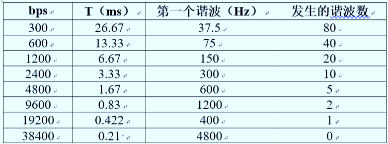

<!-- page: 13 -->

信道的最大数据传输速率P88

采用技术手段，可以提升比特率，但是否可以无限制地提高介质

的传输能力呢？

两个关于介质最大传输数据速率的经典定律

乃奎斯特定理

理想信道，无噪声信道

香农定理

有噪声信道

13
2023/6/19

<!-- page: 14 -->

乃奎斯特（Nyquist）定理 P88

1924年，奈奎斯特提出：在无噪声信道中，当带

宽为B hz，信号电平为V级，则：

   其中： V为信号的电平级数(状态数)，在二进制

中，仅为0、1两级。

奈奎斯特定理指出：以每秒高于2B次的速率对线

路采样是无意义的，因为高频分量已被滤掉，无

法再恢复。
14
2023/6/19

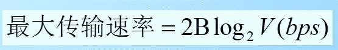

<!-- page: 15 -->

香农（Shannon）定理 P89

1948年，香农定理：在噪声信道中，带宽为B Hz，信噪比为S/N，则：

S
+
=
最大传输速率

)
)(
1(
log
B
2
bps
N

很多情况下分贝(dB) 表示信噪比：

S
=
分贝值

)
(
log
10
10
db
N

如：噪声为30dB（分贝），则信噪比为S/N=1000

这是一个理论上限

15
2023/6/19

<!-- page: 16 -->

单选题
4分

如果一条信道的带宽在 3MHz和4MHz之间，且信噪比是24分贝，

问：(1) 信道的最大传输速率是多少?

(2) 为了达到这个传输速率，信号级别需要多少级?

24Mbps、4

A

24Mbps、16

24dB=10×log10S/N
S/N≈251

B

8Mbps、4

C

8Mbps、16

D

提交

16
2023/6/19

<!-- page: 17 -->

参考解析

(1) 最大传输速度是多少?

B = 4M-3M=1MHz

S/N = 251

C = 106xlog2(1+251)≈8Mbps

(2)信号级别

C=2B log2 V

V=16

17
2023/6/19

<!-- page: 18 -->

单选题
4分

【17年考研题】若信道在无噪声情况下的极限数据传输速率不小于信

噪比为30dB条件下的极限数据传输速率，则信号状态数至少是多少？

32

A

16

B

8

C

4

D

提交
18
2023/6/19

<!-- page: 19 -->

解析：D

S
1
log
B
V
log
2B

+



）
（

2
2

1001
log
V
log
2
N





2
2




5
V
log

2




32
V

19
2023/6/19

<!-- page: 20 -->

单选题
2分

（14年考研题）下列因素中，不会影响信道数据传输速率的是哪个？

信噪比

A

频率带宽

B

信号传播速度

C

调制速率

D

提交
20
2023/6/19

<!-- page: 21 -->

传输技术1.基带传输（线路编码）P89

把数据比特直接转换成

信号的方案，信号的传

USB

输占有传输介质上从零

10Base-

到最大值之间的全部频

率

线路编码

传输效率：50%

21

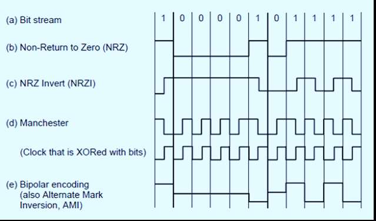

<!-- page: 22 -->

100Base-Tx
1000Base-

4B/5B、       8B/10B          P92

80％的传输效率

5B中永远不出现连续的3个零

32个组合表示16个组合，多余的组合可用作帧界

22

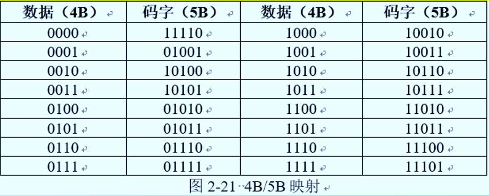

<!-- page: 23 -->

单选题
2分

使用两种编码方案对比特流01100111进行编码的结果如下图所示，

编码1和编码2分别是什么？（15考研题）

NRZ和差分曼彻斯特编码

A

NRZ和曼彻斯特编码

B

NRZI和曼彻斯特编码

C

NRZI和差分曼彻斯特编码

D

提交
23

<!-- page: 24 -->

传输技术之2.通带传输P93

通带传输：通过调节载波信号的幅值、相位或频率来运载比特的调制模式。，

即信号占据了以载波信号频率为中心的一段频带；只能在给定的频带中传输

信号。（数字比特搭载到连续载波上，数字调制）

数字调制的三种基本调制

幅移键控ASK

频移键控FSK

相移键控PSK

24

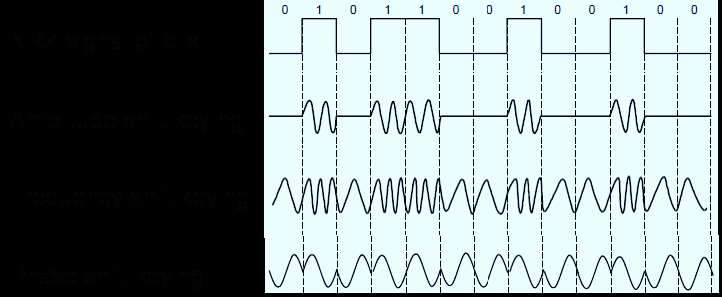

<!-- page: 25 -->

通带传输(续)

C=B*log2V

传输速率：

二进制相移键控
正交相移键控
正交振幅调制

所以，为什么需要调制呢？（弹幕）

25

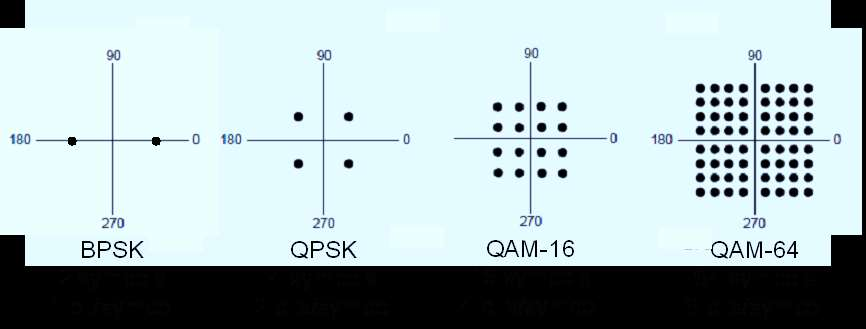

<!-- page: 26 -->

为什么要调制？

调制的目的：将信号搬运到合适的频率，提高抗干扰能力，适合传

输场景。即使用载波将待传信号变成传输的信号。

调制的4种形式：

调制提升了带宽效率！

（1）待传信号是模拟信号，载波是连续波（通常是正弦波），叫做模拟连

续波调制，模拟调制；

（2）待传信号是数字信号，载波是连续波（通常是正弦波），叫做数字连

续波调制，数字调制；

（3）待传信号是模拟信号，载波是脉冲序列，叫做模拟脉冲调制；

（4）待传信号是数字信号，载波是脉冲序列，叫做数字脉冲调制；

26

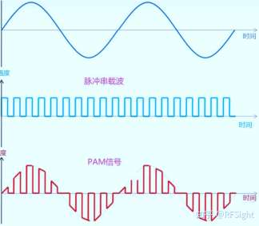

<!-- page: 27 -->

什么是码元？

码元是承载信息量的基本信号单位

在数字通信中常常用时间间隔相同的符号来表示一个二进制数字，这

样的时间间隔内的信号称为(二进制）码元

在使用时间域的波形表示数字信号时，代表不同离散值的基本波形称

为码元

波特率其实就是1秒钟能够发送的码元的个数，所以也叫码率。

（P90 符号率，也叫调制速率）

C=B*log2V

27

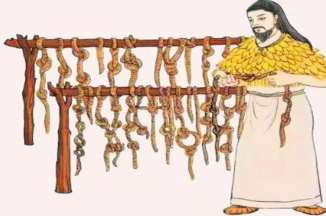

<!-- page: 28 -->

小结

调制：将信号搭载到载波中，利于搬运

调制速度：波特率、采样率、符号率、码率

有上限：不超过2倍物理带宽

数字带宽的计算

提高v，从而增加数字带宽

C=B*log2V

28

<!-- page: 29 -->

课前热身

常用的无许可微波段指的是什么？

信号的傅里叶表示有什么意义？

什么是物理带宽？受什么因素影响？

信道的最大数字带宽与物理带宽的关系用什么定理来表达？

奈奎斯特定理表明符号率（波特率、采样率、码率）由什么决定？

还记得哪些线路编码的方法？

基本调制有三种，通信系统中常用的调制方法是什么？

29

<!-- page: 30 -->

3.复用技术：为了共享介质

FDM：全时使用，只使用分给自己的频带  （每个班的固定教室）

OFDM：子带可以重叠，效率更高（MCM：多载波调制）

WDM：全时使用，只使用自己的子波

DWDM：子波更窄，排布更密

TDM：全速使用，只在自己的时隙使用    （会议室，按预定时间用）

STDM：挽救未被使用的时隙

CDMA：全时使用，互不干扰 P99

类比：参加国际会议，只听到自己懂的语言

30

<!-- page: 31 -->

单选题
2分

10个用户使用TDM 或FDM 共享8 M bps 链路，使用TDM的每个用户都要

以一个固定的顺序轮流完全占据连接1 ms (毫秒) ；当用户传输一个

3000 字节的消息时，哪个方法（TDM还是FDM）具有最低的可能延迟，该

延迟时间是多少？

TDM, 21 ms

A

TDM, 11 ms

B

FDM, 30 ms

C

两种方式的延迟相同

D

提交
31

<!-- page: 32 -->

解答分析

FDM：每个用户分得带宽8M/10 =800kbps

所以传输3000字节需要时间约：（3000*8）/800kbps=0.030s=30ms

TDM：每个用户轮发数据量为8M*1ms=8000b；发送3000B

（24000bit）需要轮3次，那么需要等待的时间为（3-1）

*10=20ms，发送剩下的8000b需要时间1ms，共需21ms。

32

<!-- page: 33 -->

DWM 和DWDM

波分多路复用：本质上跟FDM是一样的

DWDM：达到T 级

全光网络、无源、稳定可靠

单波800G，单纤60波，48T

长距离传输>1000公里

33

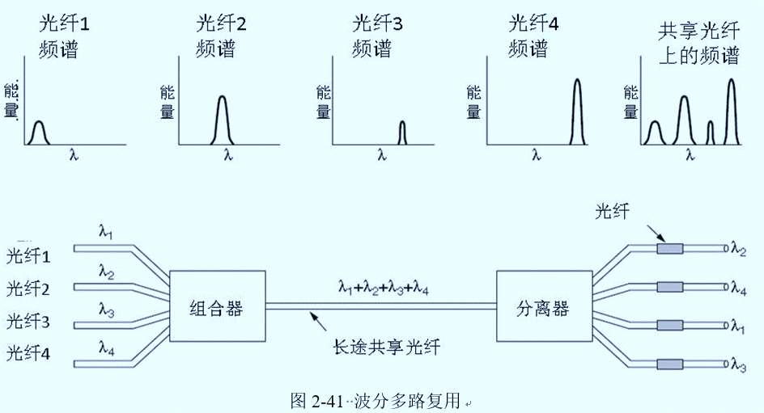

<!-- page: 34 -->

DWDM之密集（Dese）

子波越多，复用的带宽越大：单纤总带宽=单波带宽*波数

当前主要使用的是C波段，下一步会进一步采用超级C波段和L波

段，波数从80扩展到240个。

单波：100G、200G、400G、800G

34

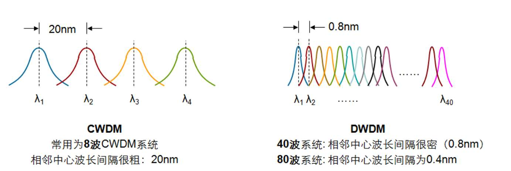

<!-- page: 35 -->

单纤增长

C波段：1530-1565nm，

35

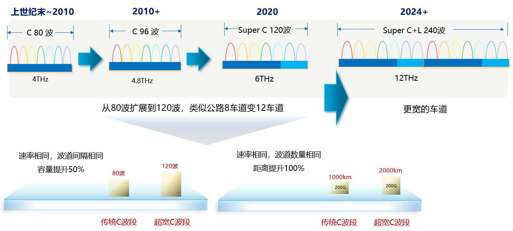

<!-- page: 36 -->

关于CDMA、OFDM的战争

二战期间，美军无偿使用

1980s，解禁，民用

高通，CDMA，3000多个专利，

垄断3G

4G/5G：LTE：OFDM

36

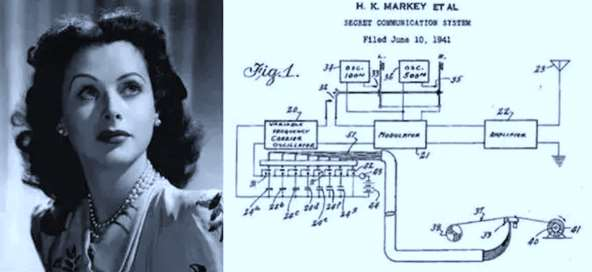

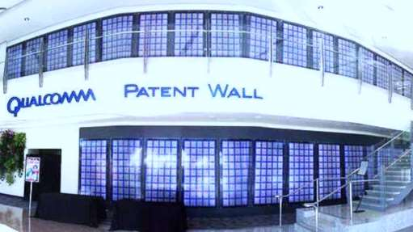

<!-- page: 37 -->

关于OFDM

跟普通FDM不同：无需保护带

子波间正交，互不干扰

https://blog.csdn.net/a493823882/article/details/80058002

37

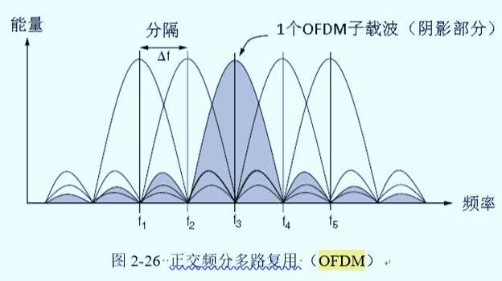

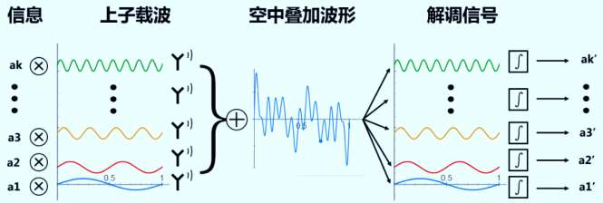

<!-- page: 38 -->

关于CDMA

受钢琴的启发而发明，是3G的基础

码分复用：CDM，Code Division Multiplexing

码分多路接入（CDMA，Code Division Multiple Access）

一个时间比特被分成m个时间间隔，称为码片。 （每个比特时间

被分成64或者128个时间间隔，即码片，教材以m=8为例）

每个站被分到唯的一个码片序列，序列间两两正交。

𝑚

S ∙T = 1

归一化内积为0！（点积）

𝑚෍

(𝑆𝑖× 𝑇𝑖)

𝑖=1

38

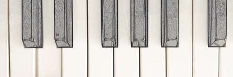

<!-- page: 39 -->

关于CDMA（续）

发送：复用

1：发送码片序列本身

0：发送码片序列的反码

复用信号：所有用户的码片序列线性叠加

收方（解复用）利用的性质

一个码片序列和它自己的归一化内积为1，一个码片序列和它反码的归一

𝑆∙𝑆= 1
𝑆∙ҧ𝑆= −1

化内积为-1

解复用：能够提取出期望的信号，同时拒绝所有其他的信号，并把这些

信号当作噪声

39

<!-- page: 40 -->

一个简单例子

A、B、C三个工作站。码片序列正交，m=4

发送方

发送1，码片序列本身

发送0，码片序列的反码

复用，线性叠加，S

接收方

解复用，接收谁就用谁的码片序列，S•A

结果为1，表明收到了一个“1”

P99教材2.4.4小节

结果为-1，表明收到了一个“0”

一个m=8的例子

结果为0，表明对方未发送
40

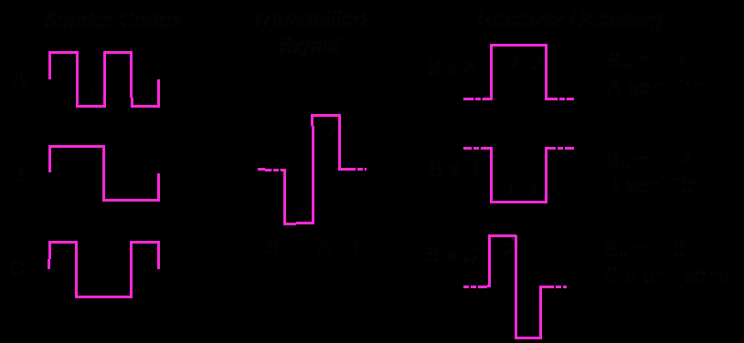

<!-- page: 41 -->

单选题
2分

假设一个CDMA系统有3个工作站，码片序列由4位构成，三个工作站A、B和C的

码片序列分别是：(1,1,1,1),(1,-1,1,-1)和(1,1,-1,-1)。如果工作站C连续收到了一

个复用信号：(2,0,2,0,0,-2,0,-2,0,2,0,2)，那么，工作站C从工作站B收到了什么

信号？（2014考研题）

000

A

010

B

110

C

111

D

提交

41

<!-- page: 42 -->

答案解析

工作站的码片序列是4位的，所以，发送1个比特的复用信号也是

4位的。现在C收到的复用信号是12位的，说明发送了3个比特。

B发送的第1个比特： （1，-1，1 ，-1）•（2，0，2，0）=1  （发了1）

B发送的第2个比特： （1，-1，1 ，-1）•（0，-2，0，-2）=1（发了1）

B发送的第3个比特： （1，-1，1 ，-1）•（0，2，0，2）=-1（发了0）

42

<!-- page: 43 -->

4.接入网络之PSTN  P102

本地回路（调制）

干线（复用、PCM）

交换局（电路交换）

43

<!-- page: 44 -->

窄带接入：电话调制解调器

44

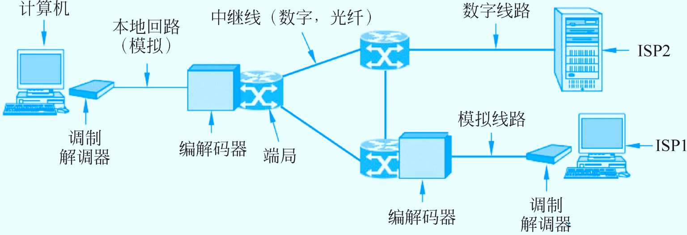

<!-- page: 45 -->

调制解调器（Modem，猫）

在本地回路上，引入一个正弦波（sine wave carrier）

来承载和传输信号：

幅度：两种不同的幅度用来表示0和1

频率：不同的频率表示不同的值

相位：不同的相位可表示不同的值 (45, 135, 225, or 315º).

调制解调器：位于计算机和PSTN最后一英里之间，用于

将计算机产生的位序列转变为载波输出，或者相反。

45

<!-- page: 46 -->

不同的基本调制方法的组合

Constellation Diagrams:

(a) QPSK.

C=B*log2V

(b) QAM-16.

(c) QAM-64.

46

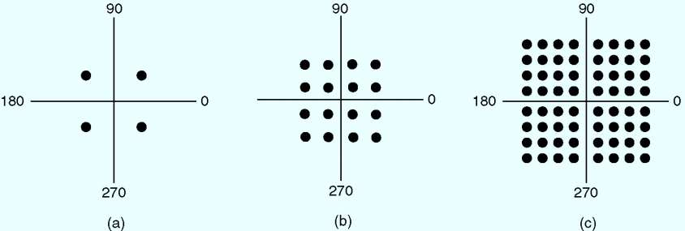

<!-- page: 47 -->

格子架编码调制（TCMP114）

为了降低高速调制错误，在每个样本中采用一些额外的位用作纠错，

剩下的位才用来传输数据，这种机制叫格子架编码调制TCM (Trellis

Coded Modulation).

在 V.32调制标准中，波特率是2400，采用了QAM-32，每码元传输

5个比特，但其中的1个比特用来做奇偶校验，所以，数据传输率只

有9600bps。

在V.32bis标准中，采用了QAM-128（27），传输速率只有

14,400 bps ，而不是16,800kbps，因为有一个比特用来纠错。

47

<!-- page: 48 -->

调制解调器（Modems，猫）

(a)
(b)

(a) V.32(2^5) for 9600 bps.

(b) V.32 bis (2^7)for 14,400 bps.

48

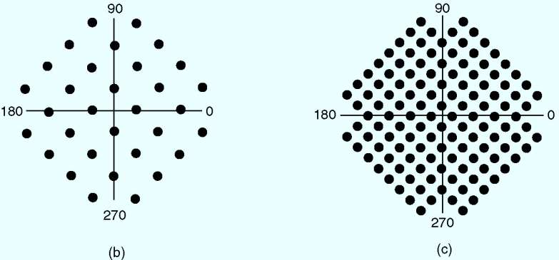

<!-- page: 49 -->

最后一英里之变迁P109-110

Modem

ISDN

宽带接入（xDSL）

FTTx：3.96亿（截止到2019年6月）

FTTB

FTTH

FTTR

49

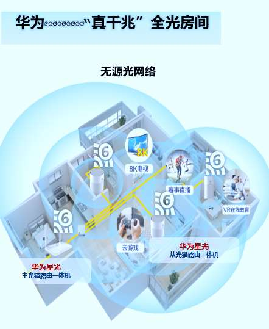

<!-- page: 50 -->

T1线路在哪里？P110

方法：PCM脉码调制

编解码器（Codec）：端局中的设备，可将模拟信号数字化（coder），或者

相反（decoder）。Codec=coder + decoder

DPCM (Differential Plus Code Modulation) is a method, which consists

of outputting the difference between the current value and the

previous one, to reduce the number of digitalized bits,

50

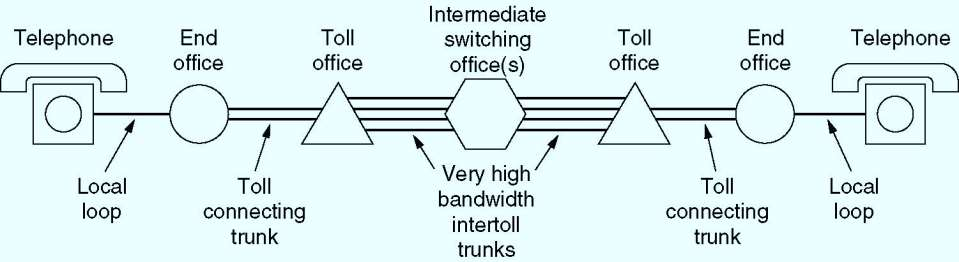

<!-- page: 51 -->

T1的开销是怎么算的？什么是T1复用帧？

端局采用了复用技术

TDM时分多路复用

51

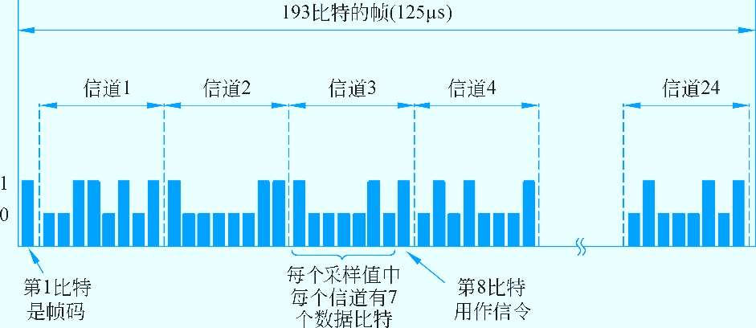

<!-- page: 52 -->

T1速率计算

脉冲编码调制PCM (Pulse Code Modulation) ：是一种将模拟信号数字化

的技术，也是一种调制技术，脉冲序列作为载波。

T1 线路可处理24路信号的复用： 24 x 8 = 192 bits + 1 bit for

framing = 193 bits/frame

话音信道的采样率是每秒8000次 ，那么传递TDM复用帧的时间间隔需

要 1/8000 sec = 125微秒

所以，T1 线路的传输速率是: 193 bits / 0.000125 seconds = 1.544

Mbps.

52

<!-- page: 53 -->

E1 P112

除了北美和日本，其它国家使用E1系列线路

E1可处理32条语音的复用 ：32 x 8 =256 bits/frame

话音信道的采样率是每秒8000次 ，那么传递TDM复用帧的时间间隔需

要 1/8000 sec = 125微秒

所以，T1 线路的传输速率是: 256 bits / 0.000125 seconds = 2.048

Mbps.

53

<!-- page: 54 -->

SONET/SDH P114

同步光网络SONET (Synchronous Optical NETwork) 是ANSI

（AMERICAN NATIONAL STANDARDS INSTITUTE: ANSI）

制定的在光介质上进行同步数据传输的标准。

同步数字序列SDH (Synchronous digital hierarchy)是ITU制定

的在光介质上进行同步数据传输的。

SONET的4个设计目标P122

不同的承运商可协同工作

需要统一美国、欧洲和日本的数字系统

提供一种复用多数字信道的方法

提供操作、管理和维护（OAM：operations, administration, and maintenance ）

54

<!-- page: 55 -->

SONET P114

Synchronous Optical Network (SONET)

标准的说明书比这本书还厚

该标准强调成帧和编码的问题

允许复用多条低速链接到一条高速链接

55

<!-- page: 56 -->

SONET/SDH

SONET 帧结构：(Synchronous Transport Signal-1)

9(行) x 90(列) = 810字节

头3列 用于系统管理信息

头9行包括各种传输开销：跨越不同链接，指定语音信道，

连接帧等的开销。

其余的87 列包括用户数据，即同步载荷封包 SPE

(Synchronous Payload Envelope)，其中的第1列又用于
路径开销。

STS-1：8000*810*8=51.85Mbps

STS-N 帧是由N个STS-1基本帧构成的

56

<!-- page: 57 -->

SONET帧结构

Two back-to-back SONET frames.

57

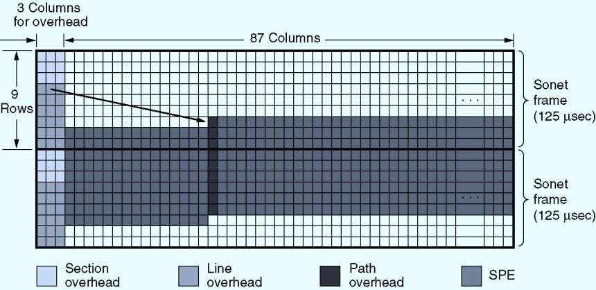

<!-- page: 58 -->

段、线路、路径

段（section）：从一台设备到另一台设备的光纤称作一段

线路（line）：两个多路复用设备之间的连接称为一条线路

路径（path）：源和目的的连接

中继器
中继器

目的多

多路
复用器

源多路
复用器

路
复用器

段
段
段
段

线路
线路

路径

58

<!-- page: 59 -->

如何计算复用后的传输速率？

P123   （Optical Carrier：OC）

例如：OC-1

总传输速率：8 x （9 x 90）x 8000 = 51.84M b/s

SPE： 8 x （9 x 87）x 8000 = 50.112M b/s

用户数据： 8 x （9 x 86）x 8000 = 49.536M b/s

59

<!-- page: 60 -->

填空题
8分

在OC-12线路中，SPE和用户数据分别是 [填空1]Mbps和 [填空2]

Mbps ？

在OC-12C线路中，SPE和用户数据又分别是 [填空3]Mbps和 [填空

4]Mbps  ？

作答
60

<!-- page: 61 -->

OC-12 参考答案

OC-12: 等于12条 OC-1复用在一起

SPE:

50.112×12=601.344

或: 8*9*87*8000*12=601.344

用户数据：

49.536x12=594.432Mbps

或: 8*9*86*8000*12=594.432

61

<!-- page: 62 -->

OC-12C 用户数据的参考答案

OC-12C: 表示复用在一起的信号都来自同一个源，这意味着路径

开销只需要一个，余下的12-1=11个路径开销的位置可用于搭载

数据，所以，它传输的用户数据比 OC-12多。

OC-12C 共有12x90=1080列，段开销和线路开销有12x3列，路径开销仅有1 列，用户数据

总共是1080-36-1=1043 列，所以用户数据是：1043x9x8x8000=600.768Mbps

或者：594.432+11x9x8x8000=600.768Mbps

62

<!-- page: 63 -->

SONET复用率  P123

SONET and SDH multiplex rates.


STS (Synchronous Transport Signal)


OC (Optical Carrier): OC-256 – 13.271 Gbps, OC-768 – 40 Gbps


Synchronous Transport Modules (STM)

63

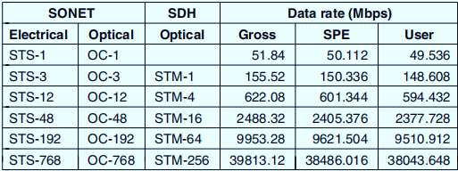

<!-- page: 64 -->

电路交换 VS. 包/分组交换

带宽的分配形式不同

容错能力的不同（分组交换更强）

有无交换顺序的不同

运载“货物”的不同

收费方法的不同

64

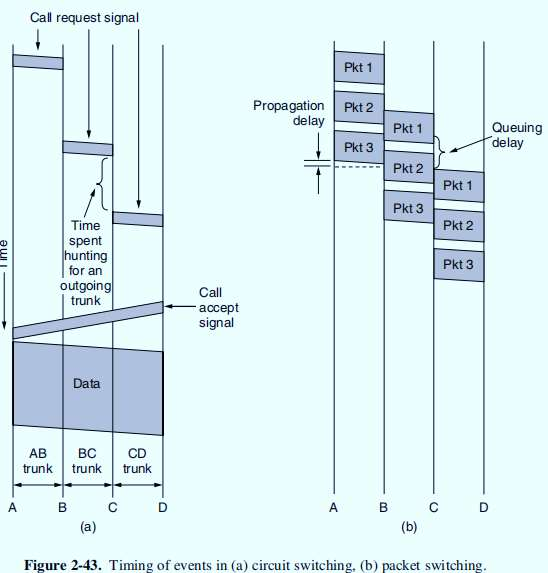

<!-- page: 65 -->

蜂窝网络：基站为核心的蜂窝P119

1G：模拟语音

2G：数字语音（TDM+FDM）

GSM：全球通

3G：语音+数据

WCDMA、CDMA2000、TD-CDMA

4G：数据包交换

IMT-A、LTE

5G、6G
65

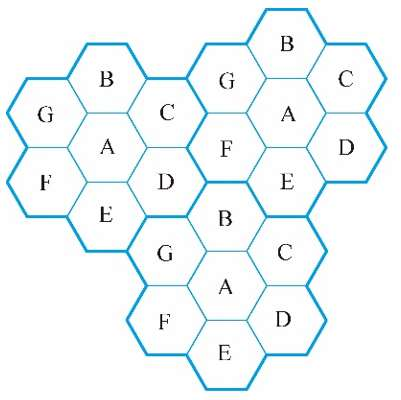

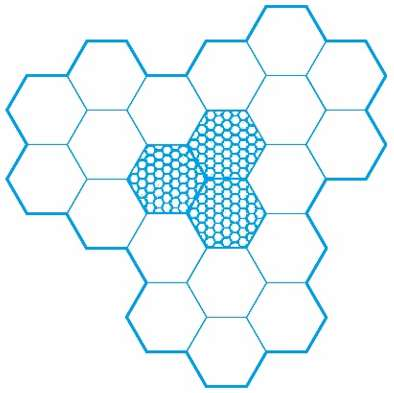

<!-- page: 66 -->

大规模MIMO技术P131

一种空分复用技术

利用了多径传播

Massive MIMO（多输入多输出）

SU-MIMO、MU-MIMO

66

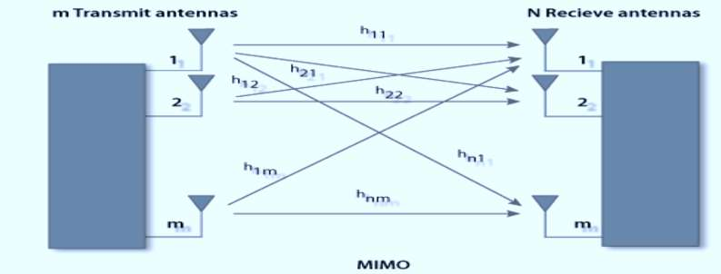

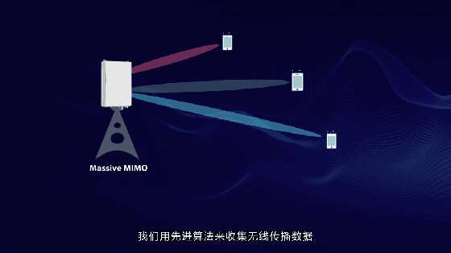

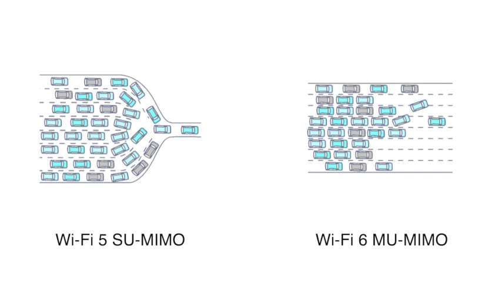

<!-- page: 67 -->

有线电视网

混合光纤网HFC

上行、下行

67

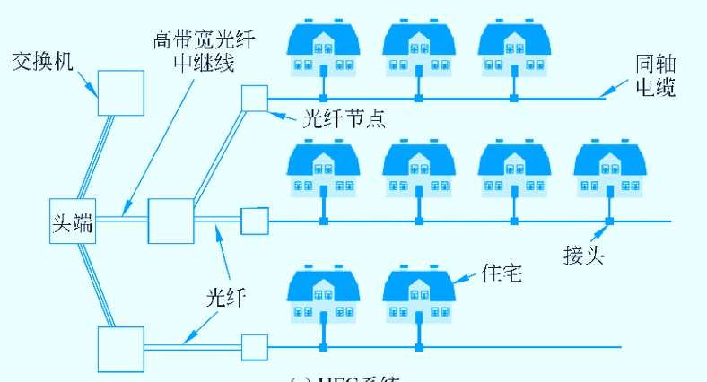

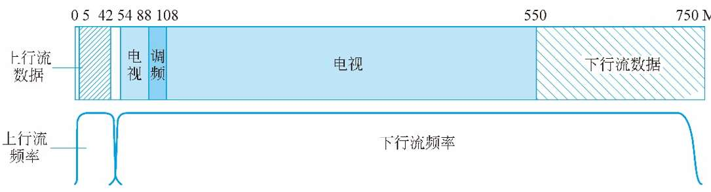

<!-- page: 68 -->

有线电视网（续）

DOCSIS

68

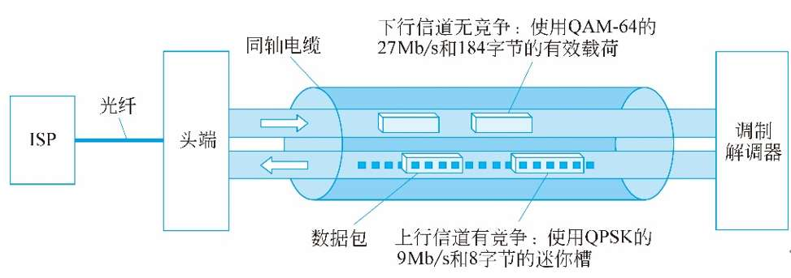

<!-- page: 69 -->

通信卫星网

中继，地面通信的补充；卫星骨干

地球同步卫星GEO

中轨道卫星MEO

GPS

低轨道卫星LEO

天通1号GEO终端

90分钟绕一圈

69

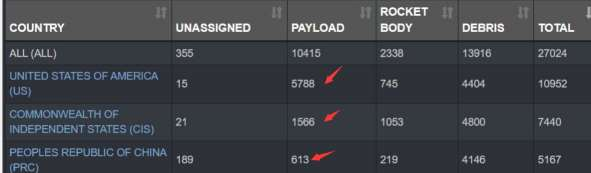

<!-- page: 70 -->

5.物理设备

无源部件

中继器（repeater）

再生信号：去噪、放大

集线器（hub）

一层的设备：傻瓜设备，增大了冲突域，降低网络性能

大 冲突域

70

<!-- page: 71 -->

全光中继器正当时

传统光纤中继：光→电→光

全光中继：掺铒放大器

1985年南安普顿大学的Daivd Payne教授

……

……

λ1 λ2
λ120
……

λ1 λ2
λ120
……

光放大器

71

<!-- page: 72 -->

预习第5题完成情况

网工：57%

计科1：70%

2023/6/19
72

<!-- page: 73 -->

单选题
2分

在一根有5 ms传播时延（时间，delay）的4Mbps链路上发送500字节

的消息，此消息从发送到传输至目的地的时延（时间）共有多少？（延

迟=传输时间+传播时延）

5ms

A

1ms

B

9ms

C

6ms

D

提交
73

<!-- page: 74 -->

注意

收方双方的延迟构成如下：

传输延迟：信息量/带宽

中间设备的延迟：进入设备到离开设

备的时间

传播延迟：传输距离/传播速度

74

<!-- page: 75 -->

单选题
2分

在一个有4ms传播延迟的5 Mbps 互联网访问链路上，传输数据的最

大数量是什么？

5000Bytes

A

2500B

B

200000bits

C

250Bytes

D

提交
75

<!-- page: 76 -->

有问题吗？

76

