# 笔记

**第一章**

1. n个分组，m段链路，总时延为[n个分组的发送时延+1个分组的发送时延*(m-1)+1段链路的传播时延*m]

2.  易错题：分组大小包含分组头

3.  发方的封装开始，收方的解封装结束。

**第二章：物理层**

1.  导引型传输媒体包括：同轴光缆、双绞线、光纤、电力线；非导引型传输媒体包括无线电波、微波、红外线、可见光。无线电波可以通过电离层反射电波，微波通信不行，会穿出地球，可以采用信号塔接力通信或者卫星通信。

2.  长距离通信用串行传输，而计算机内部（短距离）通信，比如CPU和内存，采用并行传输。

3. 信号“编码”到数字信道，“调制”到模拟信道。曼彻斯特编码针对以太网的数字基带信号的编码，进入数字信道；WiFi通过CCK、DSSS、OFDM调制将数字基带信号带入模拟信道；PCM音频信号编码可以带模拟基带信号进入数字信道；频分复用FDM技术可以把语音等模拟基带信号调制代入模拟信道。

4.码元是在使用时间域的波形表示数字信号时，代表不同离散数值的基本波形。

5. 10BaseT网卡：10:10Mb/s,Base:基带传输,T:双绞线，是以太网， 采用曼彻斯特编码，负跳变和正跳变代表0还是1可以自行假设。

6.  调制模拟信号的时候，有频率、相位和振幅三种参数可以改变，得到不同的信号表示，但是频率和相位是相关的（频率是相位的变化率），所以一般考虑相位和振幅作为参数。由此得到了正交振幅调制QAM

7.  奈氏准则规定的是理想的情况，实际情况远低于其提出的码元最高传输速率。要注意低通和带通的区别（低通是低于某个数值，带通是介于两个数值之间，参考电工学的滤波电路相关知识），一般默认低通，所以一般c  = 2W

8.  香农公式说明信噪比和频率带宽会影响信道数据传输速率，奈氏准则告诉我们调制速度会影响传输速率；也可以知道信号传播速度不影响数据传输速率。

9.  信噪比(dB) = 10*log_10(S/N)

奈奎斯特定理：2Blog_2(V): V:信号级别（电平），二进制中只有01两级

10. **（题目）**在公共电话交换网络中，端局的编解码器要将从本地回路接收的模拟信号数字化，采用了脉冲编码调制技术

11.  **（题目）**在物理层接口特性的机械特性、功能特性、过程特性、电气特性中，用于描述完成每种功能的时间发生顺序的是过程特性

12.  机械特性定义了接口形状，引脚功能定义了功能特性，电气特性定义了信号电平，**物理地址不属于物理层接口规范定义范畴，实际上它叫MAC地址，属于数据链路层的范畴。**

13.  **双绞线**的工作范围为100m，因为一般用在同一个楼层，所以被称为水平线，实际应用中通常连到交换机。**光纤**一般用石英玻璃做的，有望降低成本用塑料制作，一般用于干线（trunk/backborns），用作垂直电缆，单模光纤的纤芯内径一般是8~10μm，外径（有包层）125μm；多模光纤的内径/外径一般是62.5/125μm。

14.  **扩频**技术包括跳频扩频（FHSS）和直列扩频（DSSS）

15.  无线电传输适合长距离传输，经过电离层反射；微波通信需要中继站或卫星，存在多径衰落的问题；红外传输用于短距离，不能穿透固体物体，防窃听，安全性好。

16. NRZ:  普通的不归零编码，1为高电平，0位低电平；NRZI：反向不归零编码，1电平不变，0电平改变；曼彻斯特：1电平上或下，0电平下或上；差分曼彻斯特：0电平上或下不变，1电平上或下改变。

17. FDM:  全时复用，只使用分给自己的频带（每个班教室固定）；WDM：全时使用，只使用自己的子波；TDM：全速使用，只在自己的时隙使用（会议室，按预订时间用）；CDMA：全时使用，互不干扰（国际会议，只听到自己懂的语言）。

18.  **（题目）**10个用户，共享8Mbps链路，使用TDM的每个用户以固定顺序轮流完全占据1ms；每个用户要发送3000字节数据时，问TDM和FDM两个方法的延迟：

FDM:  每个用户分的带宽8M/10=800kbps，所以传输3000字节所需3000*8/800=30ms

TDM：每个用户轮发8M*1ms=8000b；发送3000B需要轮3000*8/8000=3次，则需要等待(3-1)*10=20ms，加上最后的8000b，需要1ms，共需21ms。

19. 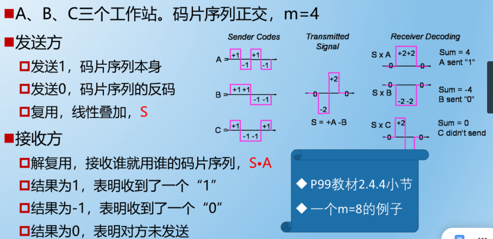

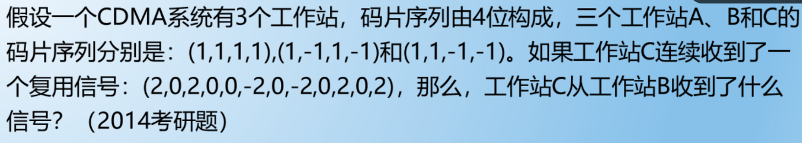

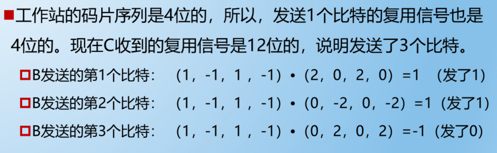

**重点：双绞线、光纤、微波传输**

**第三章：数据链路层**

1.  数据链路层有3个重要问题：**封装成帧、差错检测、可靠传输**

封装成帧是数据流在链路层需要在首尾添加帧头和帧尾，此时的数据流叫做帧

差错检测需要用检错码和检错算法，比如海明码、CRC码

尽管误码不能完全避免，但若能实现发送放发送什么，接收方就能收到什么，就成为可靠传输。

2.  除此之外还有其他问题，在使用广播信道（共享式局域网）的数据链路层时，需要对主机编址；总线上多台主机同时使用总线来传输帧时，信号会发生碰撞，以太网采用了 CSMA/CD（媒体接入控制协议）处理碰撞，802.11局域网用的是CSMA/CA（无线局域网也是用的共享）。

3.  **封装成帧：**由于物理层交付的都是比特流，那接收方的数据链路层时怎么从这一堆比特流中提取（切分）出一个个帧呢？

实际上帧头和帧尾不仅起到控制的作用，还起到定界的作用。比如PPP协议下，帧头和帧尾各包含了1字节的标志。对于以太网版本2（V2）的MAC帧，它没有帧定界标志，实际上在MAC帧传到物理层时，物理层还会添加8字节前导码，其中有1个字节定界，而且在发送的时候，帧之间有96个字节的间隔，便于接收方区分。

4.  **透明传输：**数据链路层，对上层交付的传输数据没有任何限制，就好像数据链路层不存在一样。

5.  一段数据中可能存在多个帧首尾标志（有些数据恰巧也代表帧定界标志），为了不影响定界作用，需要对中间的标志添加转义字符（ESC），有必要时还要对转义字符本身添加转移字符，以不影响数据本身的功能。比如帧首和帧尾都有01111110，而数据部分恰巧也有几段是01111110，这时可以定义一个算法：每出现5个连续的1时，在其后面添加一个0，即011111 0 10，然后再经过物理层传送到接收方，接收方用同样的算法剔除0即可（HDLC协议）。

6.  为了提高帧的传输效率，应该使数据部分长度大些，但考虑到差错控制等多种因素，数据部分有上限，即最大传送单元MTU。

7.  **差错检测（见第三章图片）**：奇偶校验（数据链路层一般不用）；CRC校验码（除法用的是模二除法）。

8.  **不可靠传输：**仅仅丢弃有误码的帧，其他什么也不做

9.  **可靠传输：**想办法实现发送端发送什么，接收端就收到什么。有线链路误码率比较低，为了减少开销，不要求链路层向上提供可靠传输服务；无限链路误码率较高，需要可靠传输服务。包括（1）停止-等待协议（2）回退N帧协议（3）选择重传协议

10.  传输差错包括比特差错，也包括**分组丢失、分组失序和分组重复**，这几个错误一般出现在更上层，因此可靠传输不局限在数据链路层。

11.  **停止-等待协议**是一种自动请求重传ARQ。**回退N帧协议**是一种连续ARQ协议，也称为滑动窗口协议，发送方窗口满足1<WT<=2^n – 1，接收方满足1<WR<=WT，当通信线路质量不好时，其信道利用率不比停止-等待协议高。**选择重传协议**是对回退N帧协议的改进，发送方窗口尺寸WT必须满足1<WT<=2^(n-1)，接收方窗口尺寸WR必须满足1<WR<=WT，跟回退N帧不同，选择重传不是累积确认的。

12.  **捎带确认**可以理解为接收方收到了数据分组，已经确认，但是为了提高信道利用率，等到自己有数据分组要发送的时候才一起发给对面。

13. PPP是数据链路层的一个协议，见《术语》和相关PPT图片，接收方采用CRC来校验。

14.  媒体接入控制方法包括静态和动态划分信道，静态划分信道有以下方法：

（1）频分复用FDM：所有用户同时占用不同的频带资源并行通信；

（2）时分复用TDM：将时间划分不同的多个时隙，每对用户只在所分配的时隙里使用线路传输数据；

（3）波分复用WDM：实质上是光的频分复用；

（4）码分复用CDM：主要用于多址接入，更常用码分多址CDMA，同样地，FDM对应的频分多址FDMA，TDM对应的时分多址TDMA。CDM的每一个用户可以在同样的时间使用同样的频带进行通信。

15.  动态划分信道的方法有随机接入和受控接入两种。

随机接入的方法有多址接入MA、载波监听CS和碰撞检测CD

由此有CSMA/CD协议。（见第三章截图）

16.  主机接受所收到的帧的条件是①帧足够长，如果不够长，会认为遭遇了碰撞从而丢弃该帧；②地址正确，帧的目的MAC地址和接收方的MAC地址相同或是广播地址；③使用CRC检查帧是否出现了误码

17.**（题目）**在一个采用CSMA/CD协议的网络中，传输介质是一根完整的电缆，传输速率为1Gbps，电缆中的信号传播速度是200000km/s。若最小数据帧长度减少800比特，则最远的两个站点之间的距离至少需要多少？

解：设最远两个站点之间的距离为d  (m)，最小帧长为  l (bit)

最小帧长 = 争用期 * 数据传输速率

即  l = (d/(200000*10^3) * 2) * 10^9 (争用期  = 2*τ，τ=最远两个站点传输所用时间=距离/传播速度)

即d  = l/10  代入800bit，得出最少减少80m

18. CSMA/CA协议不用CD协议的碰撞检测，改用CA的碰撞避免，是802.11无线局域网的协议。

19. 802.11标准还用了数据链路层确认机制（停止-等待协议）来保证数据被正确接收。

20. 802.11的MAC层标准定义了两种不同的媒体接入控制方试，包括DCF和PCF，前者使用比较多，是802.11的默认方式，每个站点用CSMA/CA协议通过争用信道来获取发送权。

21.  RTS帧和CTS帧是CSMA/CA协议的东西，源站先过DIFS时间再发送RTS给目的站，目的站经过SIFS再发送CTS给源站，发送CTS后，其他的站点都清楚了这个站被某个站占用，因此不发送帧给目的站，这时源站收到CTS后过SIFS，就会发送真正的数据帧给目的站。

22.  （**题目**）对正确接收到的数据帧进行确认的MAC协议是：

**A**. CSMA  **B**. CDMA  **C**. CSMA/CD  **D**. CSMA/CA

选D

CSMA指载波监听多址接入，不使用确认机制；

CSMA/CD指载波监听多址接入/碰撞检测，是早期共享信道以太网使用的信道访问控制协议，斌不实用确认机制；

CSMA/CA是802.11局域网采用的无线信道访问控制协议，不仅如此，还用了**停止-等待协议**，这是因为无线信道的通信质量远不如有线信道，因此无线站点每发送完一个数据帧后，要等到收到对方的确认帧后才能继续发送下一帧。

23.  （**题目**）在CDMA CSMA TDMA FDMA四种介质访问控制方法中，可能发生冲突的是哪个

答：是CSMA。其他的都是常见的物理层信道复用技术，属于静态划分信道，用于多用户共享信道，不会发生冲突。CSMA属于争用型媒体控制协议，有竞争关系，可能有碰撞。

24.  （**题目**）IEEE 802.11无线局域网的MAC协议CSMA/CA进行信道预约的方法为：

交换RTS和CTS帧。

25. MAC地址时对网络上各接口的唯一标识，而不是对网络上各设备的唯一标识。在Windows的格式为XX-XX-XX-XX-XX-XX（十六进制）。第二个X如果是奇数，那么是多播帧，否则是单播帧。

26. IP地址分为两部分，前一个部分是网络编号：标识因特网上的网络，后一个部分是主机编号：标识同一个网络上不同的主机。在网络体系的5层结构中，IP地址在网络层被封装，MAC地址在数据链路层被封装。

27.  使用集线器（HUB）的以太网逻辑上仍是一个以太网，各站共享总线资源，使用的还是CSMA/CD协议。集线器只工作在物理层，每个接口只是简单地转发比特，不进行碰撞检测（由各站的网卡检测）。不过集线器有少量的容错能力和网络管理功能，比如检测网卡不停发送帧的问题。

28.  集线器扩大碰撞域（冲突域），交换机扩大广播域，隔离冲突域。

29.  泛洪指的是交换机在帧交换表中查找目的地址时没找到，只能盲目地转发给其他机器，但是不会转发给发送端的端口。

30.  生成树协议STP用来检测网络中是否存在环路的问题要保证网络是棵树

31.  虚拟局域网VLAN是一种将局域网内的设备划分成与物理位置无关的逻辑组的技术，这些逻辑组具有某些共同的需求。

32. VLAN的实现要考虑IEEE 802.1Q帧和交换机的端口类型

交换机的端口类型有Access、Trunk、Hybrid三种，思科交换机没有Hybrid。交换机各端口的缺省（默认）VLAN ID，在思科交换机上被称为Native VLAN，即本征VLAN。在华为交换机上被叫做Port VLAN ID，即端口VLAN ID，简记为PVID。

33.  *（题目）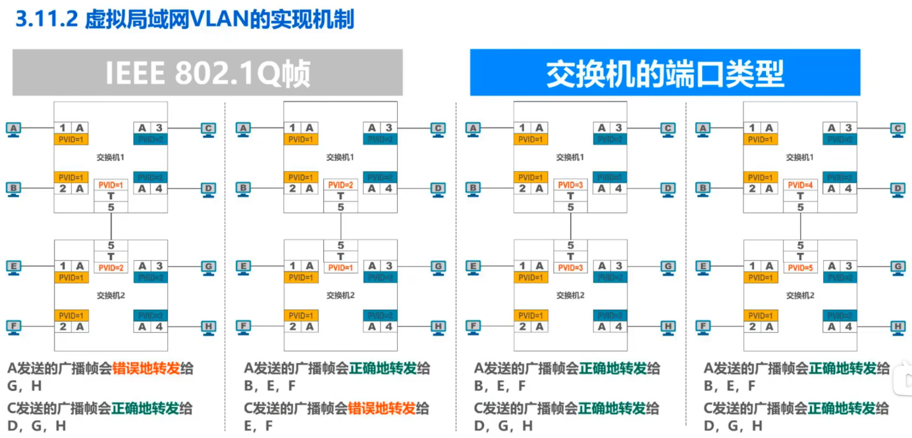

结论：互连的Trunk端口的PVID值不等，可能会造成转发错误。

34. Hybrid端口的特性和Trunk端口特性差不多，区别在于会有一个“去标签”的列表，会查看帧的VID是否在去标签的列表中，不在就直接转发，（由于主机不能识别802.1Q帧），会使得目标机器丢弃该帧；如果在去标签的列表中，就去标签再转发。

**第四章：网络层**

1.  网络层的任务包括以下：

网络层向运输层提供怎样的服务（“可靠传输”还是“不可靠传输”）

网络层寻址问题

路由选择问题

2.  IPv4地址就是给因特网（Internet）上的每一台主机（或路由器）的每一个接口分配一个在全世界范围内是唯一的**32**比特的标识符。

IPv4地址的编址方法经过了三个历史阶段：分类编址、划分子网、无分类编址。

3. ipv4用点分十进制表示方法方便用户使用，即把32位分为4个8位（无符号二进制数），分别转十进制，中间用点隔开。

4. 127.0.0.1的最后不是0，因为如果是的话就代表是一个子网，而这个应该是本地回环地址，不能以0结尾，本地回环测试地址为127.0.0.1~127.255.255.254

5.  一个网络的ipv4是145.13.0.0，划分成3个子网，可以借用16位主机号中的8位作为子网号，比如划分成145.13.0.0、145.13.1.0、145.13.2.0等

6.  （题目）已知某个网络地址为218.75.230.0，使用子网掩码255.255.255.128进行划分

二者按位与，可以知道划分出的子网数量为2^1=2，每个子网可分配的地址数量为2^(8-1)-2=126（-2是要去掉主机号为全0的网络地址和全1的广播地址）。

7.  默认子网掩码是指未划分子网时用的子网掩码，也就是说与A类地址对应255.0.0.0，B类地址对应255.255.0.0，C类地址对应255.255.255.0

8. CIDR地址块用于无分类编址的ipv4地址，网络前缀后面的所有比特取0就是这个地址块的最小地址（不代表不区分网络地址、广播地址和主机地址）

9.  给出CIDR地址块，题目会要求求出聚合A/B/C类网的数量，比如聚合C类网，就是求出在这个地址块的情况下能划分出多少个C类网，也就是2^(32-网络前缀比特数)  / 2^8(C类网的主机号位数)

10.  定长的子网掩码FLSM、变长的子网掩码VLSM

10.  题目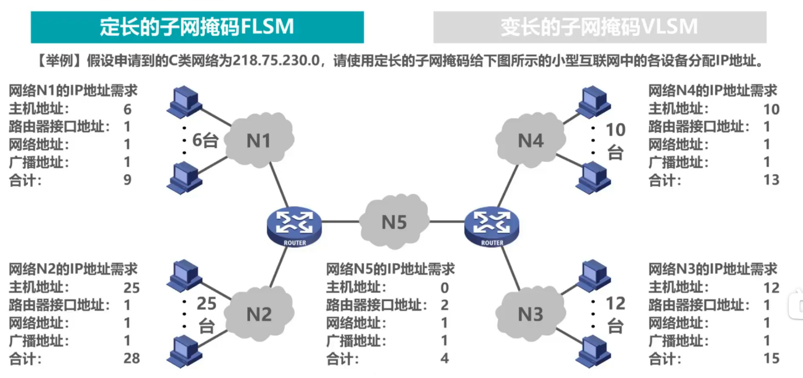

C类网络只有后面8位可以自由分配，这里有5个子网，则要抽出3位作为子网号。每个子网需要的地址数量不同。

11.  中继器和集线器工作在物理层，既不隔离冲突域也不隔离广播域；网桥和交换机（多端口网桥）工作在数据链路层，可以隔离冲突域，但不隔离广播域；路由器工作在网络层，既隔离冲突域也隔离广播域。VLAN隔离广播域和冲突域。

12.  静态路由配置可能会产生路由环路，一个是静态路由目的网络和下一跳的关系不对，错误转发；另一个是路由表聚合了不存在的网络，如果有IP数据报要转发到这个不存在的网络，就无法回收，需要设置null 0黑洞（在路由器内部）回收这种数据报；还有一种是网络故障（某条路被截断了），导致某些ip地址没法访问，这就需要把这些ip地址引导到null 0黑洞里面去。

13.  因特网采用的路由选择协议有自适应（动态路由选择）、分布式（路由器间交换路由信息）、分层次（将整个因特网划分为许多较小的自制系统AS(Autonomous System)）的特点。

14. AS分为域内路由选择和域间路由选择，分别由内部网关协议IGP和外部网关协议EGP控制（也叫内部路由协议IRP和外部路由协议ERP）

每个自制系统AS选择的网关协议互相独立，别的自治系统用RIP协议，不影响你用OSPF协议。

15. RIP  按距离远近选择传输数据的路径，默认两个相邻路由器的距离为1，可以和相邻路由器周期性交换和更新信息来知晓本AS内各网络的最短距离和下一跳地址，称为收敛。

16.  路由器根据相邻路由器进行更新的过程分别为改造和更新，类似Dijkstra算法，不同点在于距离不取二者的较小值，而是直接用别人的（因为是最新的）来更新

15.  常见的路由选择协议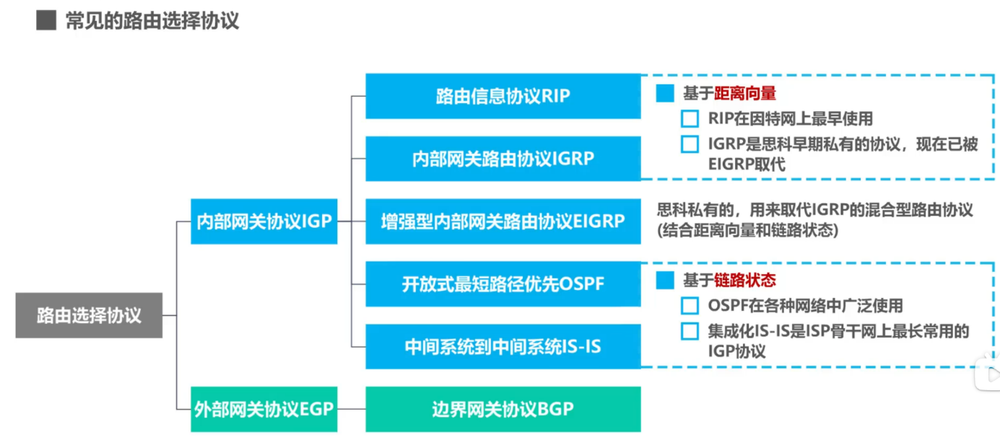

16.  路由器的基本结构如图，这里没有画出路由器左侧的输入缓冲区和输出缓冲区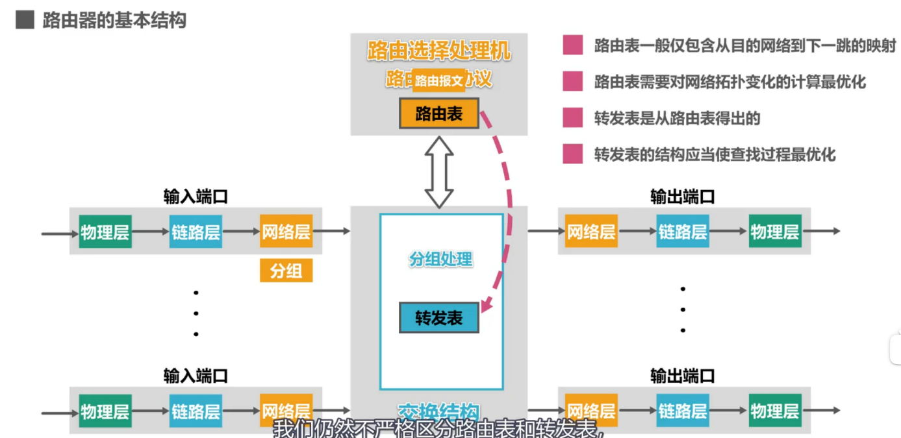

如果送交网络层的分组时普通带转发的数据分组，则根据分组首部的目的地址进行查表转发，找不到就丢弃，找得到就转发到相应端口，TTL-1。如果是路由器之间交换路由信息的路由报文，则把分组给路由选择处理机，处理机根据分组的内容更新自己的路由表……

17. RIP及其附属概念距离向量D-V(Distance-Vector)

18.  开放最短路径优先OSPF的基本工作原理。

19.  边界网关协议BGP（属于外部网关协议EGP）的工作原理（在各个自治系统间起作用）和BGP-4的四种报文，被封装在TCP报文段中进行传输

20.  补充：IP数据报首部的[区分服务]字段，在使用区分服务时会起作用，一般情况不用

21. MTU最大传输单元 在以太网中为1500字节，大于这个字节的数据载荷要分片，分片最大1480，因为还有首部20字节，加起来<=1500B

22.  补充：IP数据报生存时间段为TTL，防止回路无限转发；协议段表示协议，包括ICMP、IGMP、OSPF等；首部检验和，检测首部在传输过程中是否出现差错，比CRC简单，称为因特网检验和，每经过一个路由器都要计算检验和，但是因为IP层**本身不提供可靠传输服务**，所以这个操作很耗时，因此在IPv6中不再计算，从而更快转发。

23.  题目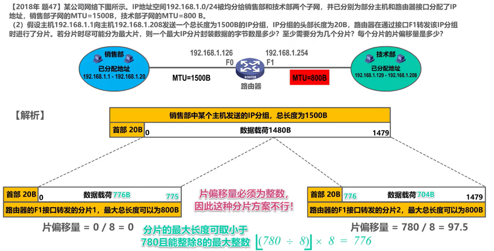

24. ICMP的5种差错报告报文：

① 终点不可达：路由器或主机不能交付数据报时，向源点发送终点不可达报文，可细分为目的网络不可达、目的主机不可达等。

② 源点抑制：路由器或主机由于拥塞而丢弃数据报时，向源点发送该报文，使源点知道应该把数据报的发送速率放慢。

③ 时间超过：TTL==0时丢弃该IP数据报并向源点发送时间超过报文。

④ 参数问题：检验和字段发现首部出现误码，丢弃并向源点发送参数问题报文。

⑤ 改变路由（重定向）：路由器发送该报文给主机，告诉主机下次应该把数据发送给另外的路由器（可通过更好的路由）。

25. ICMP询问报文有2种：

① 回送请求和回答报文：前者报文是源向目的询问，目的必须给源发送后者报文，用来测试目的站是否可达，并了解有关状态

② 时间戳请求和回答：请某个主机或路由器回答当前日期和时间，回答报文含32位，写入的整数代表1900年1月1日起到当前时刻一共有多少秒，一版用来时钟同步和测量时间。

26.    ICMP的应用：分组网间探测PING、跟踪路由traceroute

PING用来测试主机或路由器间的连通性，应用层直接用网际层的ICMP，没有通过运输层的TCP或UDP，用到了ICMP的回送请求和回答报文。

traceroute通过分别发送TTL=1、2、3、…的报文，得到时间超过报文来获取路径上的路由器。

**第五章：传输层（运输层）**

1.  物理、数据链路和网络层共同解决将主机通过异构网络互联起来所面临的问题，实现了**主机到主机的通信**。但实际上在计算机网络中进行通信的真正实体是位于**通信两端主机中的进程**，而传输层就是为运行在不同主机上的应用进程提供直接的通信服务是运输层的任务，**运输层协议又被称为端到端协议。**

2.  端口号有16位，分成三类：熟知端口号、登记端口号、短暂端口号，都只具有本地意义

3.  复用就是打包，分用就是解包

4.  重点内容：【当我输入url并回车后，发生了什么？】

如图，我们要访问Web服务器中[www.portest.com](http://www.portest.com)这个域名，而DNS服务器中有这个域名对应的IP地址。浏览器中输入域名后，PC中的DNS客户端进程会发送一个**DNS查询请求报文，**内容为【[www.portest.com对应的IP](http://www.portest.com对应的IP)地址是什么？】，使用运输层UDP协议，封装成UDP数据报，**添加UDP首部**。源端口49152是PC中DNS客户端的端口号，53是

DNS服务器端进程所使用的熟知端口号。封装成IP数据报后用以太网发送给DNS服务器，服务器解封装后通过目的端口53知道要用DNS服务器端进程解析DNS查询请求报文的内容，然后**给用户PC发送DNS响应报文**，源端口和目的端口调换。用户解封后根据目的端口49152交付给DNS客户端进程解析，解析后就知道域名的IP地址。

之后用户HTTP客户端进程**向Web服务器发送HTTP请求报文**，**用TCP协议**封装成TCP报文段，挑一个未被使用的端口号作为HTTP客户端进程，目的端口为80——HTTP服务端进程使用的端口号，封装后发送。Web服务器解封后识别出80，于是给HTTP服务器端解析，HTTP服务器端按其要求查找首页内容，然后**给用户PC发送HTTP响应报文**，包含首页内容，在运输层添加TCP首部，源端口和目的端口调换。

5.  TCP和UDP的区别：

①  UDP直接传输数据，TCP要先三次握手，再传输数据，再四次挥手；

②  UDP支持单播、多播、广播，TCP只支持单播；

③  UDP面向应用报文，TCP面向字节流；

④  UDP向上提供无连接不可靠的传输服务；TCP提供面向连接的可靠传输服务。

⑤  UDP用户数据报首部仅8字节，TCP需要流量控制、拥塞控制等，TCP报文段首部最小20字节，最大60字节。

6. TCP的流量控制，用的是滑动窗口协议（或者类似的），接收方根据本机接收缓存，通过调整接收窗口大小来控制流量（发送窗口会调整到接收窗口大小相同的）

7.  题目（TCP的流量控制）

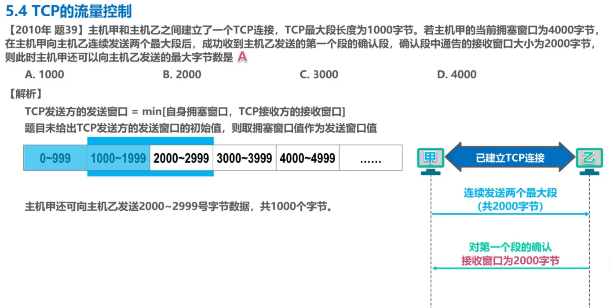

8. TCP超时重传时间的选择，使用加权平均往返时间RTT_s和RTT偏差的加权平均RTT_d。但是测量RTT时存在问题：

9.  题目

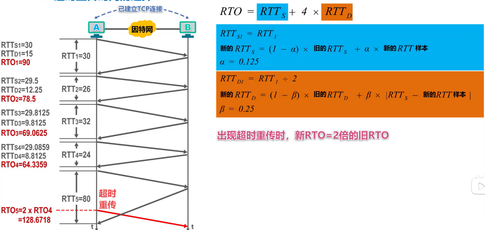

10.  三报文握手建立连接时，服务器发送针对TCP连接请求的确认时，seq可以自己指定

11. TCP报文段的首部格式。

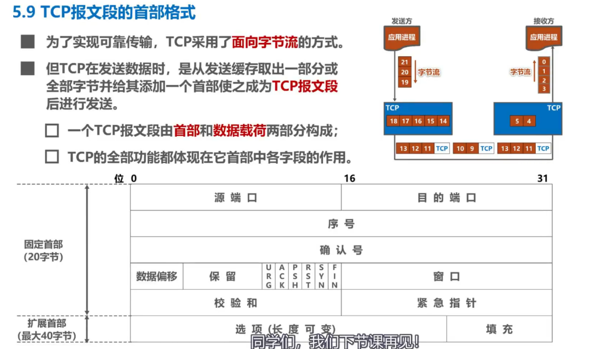

**源端口、目的端口**，很简单，不讲。

**序号和确认号，以及ACK**：**序号**的值指出本TCP报文段数据载荷的第一个字节的序号；

**确认号**的值指出**期望**收到对方下一个TCP报文段的数据载荷的第一个字节的序号，同时也是对之前收到的所有数据的确认。（若确认号=n，则表明到序号n-1为止的所有数据都被正确接收，期望收到序号=n的数据）

**ACK = 0/1**，只有=1是确认号字段才有效，否则无效。TCP规定，在连接建立后所有传送的TCP报文段都必须把ACK置1

**数据偏移**有4个bit，表示数据载荷部分的起始处距离TCP报文段的起始处有多远，以4个字节为单位。首部至少20B，则数据偏移至少为0101 (0101*4B = 5*4B = 20B)

**窗口**指出发送本报文段的一方的接收窗口，用于流量控制。

**校验和**：占16比特，检查范围包括TCP报文段的首部和数据载荷两部分，在计算校验和时，要在TCP报文段的前面加上12字节的伪首部

**同步标志位SYN** = 0/1，三次握手建立连接时用来同步序号

**终止标志位FIN**  = 0/1，四次挥手用来释放TCP连接

**推送标志位PSH**  =  0/1，接收方的TCP收到该标志位为1的报文段会**尽快上交应用进程，**而不必等到接收缓存都填满后再向上交付。

**紧急标志位URG**  = 0/1，为1时紧急指针字段有效；取值=0时紧急指针字段无效；

**紧急指针**：占16b，以B为单位，来指明紧急数据的长度。

**选项字段**：

**填充**：由于选项长度可变，因此使用填充来确保报文段首部能被4整除

期末复习查漏补缺：

1.  万维网WWW并非某种特殊的[计算机网络](https://so.csdn.net/so/search?q=%E8%AE%A1%E7%AE%97%E6%9C%BA%E7%BD%91%E7%BB%9C&spm=1001.2101.3001.7020)，而是一个大规模的、联机式的信息储藏所。包含统一资源定位符URL（格式为<协议>://<主机>:<端口>/<路径>）、超文本传送协议HTTP和万维网文档HTML。

2.  二层交换  [https://blog.csdn.net/weixin_43522969/article/details/106556785](https://blog.csdn.net/weixin_43522969/article/details/106556785)

3. ipv6  [https://zhuanlan.zhihu.com/p/382612295](https://zhuanlan.zhihu.com/p/382612295)

4.  私有IP地址的范围有：

10.0.0.0-10.255.255.255；172.16.0.0—172.31.255.255；192.168.0.0-192.168.255.255

5.  分隙ALOHA协议比纯ALOHA协议的主要改进之处在于：发送行为必须在时隙起始处，避免了在时隙中途冲突，提高了成功发送的概率或降低了冲突的危险。

6.  保留的IP地址包括：D类、E类地址、广播地址和网络地址、私人地址空间、127打头的地址

7. OSI第六层：表示层：数据的表现形式，特定功能的实现，如数据加密。

第五层：会话层：允许不同机器上的用户之间建立会话关系，如WINDOWS

8.  

9. OUI(Organizational Unique Indentifier)是MAC地址的前6个16进制位。

10.  ipv4保留地址：（结合第6条）

0.0.0.0/8  用于广播信息到当前主机

10.0.0.0/8: 10.0.0.0 – 10.255.255.255  用于私人地址

127.0.0.0/8  到本地主机的环回地址

172.16.0.0/12: 172.16.0.0 – 172.31.255.255  用于私人地址

192.168.0.0/16：私人地址

224.0.0.0/4：224.0.0.0 – 239.255.255.255  多播（组播）

240.0.0.0/4：将来使用

255.255.255.255/32：用于受限广播（子网）

ipv6:

fe80::/10：主机之间链路本地地址

11.  采用DHCP动态获取IP地址的客户机从启动到绑定IP，要经过：初始状态、选择状态、请求状态、绑定状态。

12.  公共交换电话网络通常由这些部分构成：本地回路、交换局、干线

13.  差分曼彻斯特：1就变向，0就不变向；

曼彻斯特：1向下，0向上

极性码：正负电平表示0和1

单极性码：0为正电平，1位零电平

双极性码：1为正负电平交替，0为零电平：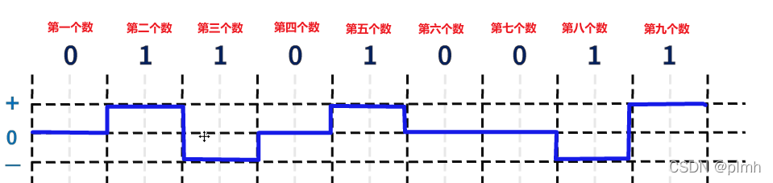

NRZI：0电平翻转，1电平不变

14.  重传计时器：2*RTT，传报文的同时会建立

持续计时器：针对接收窗口=0的情况，如果长时间为零窗口，那么持续计时器超时，发送方向接收方发送probe探测报文段

保活计时器：防止两个TCP出现长时间空闲

时间等待计时器：连接终止的时候使用。当TCP关闭连接时并不是立即关闭的，在等待期间，连接还处于过渡状态。这样就可以使重复的FIN报文段在到达终点之后被丢弃。

15.  物理层传输介质：[https://developer.aliyun.com/article/1046886](https://developer.aliyun.com/article/1046886)

传输媒体分为：导向性传输媒体和非导向性传输媒体  一.导向性传输媒体：  1．双绞线  优缺点：成本低；密度高、节省空间；安装容易；高速率；抗干扰性一般；连接距离较短。  2．同轴电缆  优缺点：抗干扰性好；接入复杂。  3．光缆  优缺点：通信容量大；传输损耗小；抗干扰性好；保密性好；体积小重量轻；需要专用设备连接  二.非导向性传输媒体  1．短波通信  优缺点：通信质量较差；速率低；  2．微波通信：又分地面微波接力通信和卫星通信  A．地面微波接力通信  优缺点：信道容量大；传输质量高；投资少；相邻站点间直视；易受天气影响；保密性差。  B．卫星通信  优缺点：通信距离远；通信容量大；传播时延大270ms。  以上是我从我们上课用的课件中摘写的，希望对你有些帮助！

16.  奈奎斯特是理想的：C_max = 2*B*log_2(V)

香农定理：C_max = B*log_2(1+S/N)

10log_10(S/N) =  分贝

17.  归零编码：

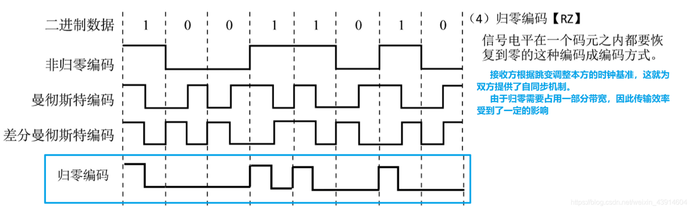

18.  PSTN：公共电话交换网。一部分是交换系统；一部分是传输系统，交换系统由电话交换机组成，而传输系统由传输设备和线缆组成。

19.  互联网校验和：

20. 6种基本DLL协议

（1）乌托邦式单工协议：弹弓，所有过程理想化，不实用；

（2）无错信道上的单工停-等协议：采用半双工的物理信道，用于防止慢的接收方被数据淹没。收方回发一个哑帧，发送方收到哑帧，表明收方允许接收数据，此时再次发送下一帧数据；

（3）有错信道上的单工停-等式协议(重传+确认)：包括滑动窗口协议、N回退协议、选择重传协议、捎带确认等；

（4）1位滑动窗口协议

（5）回退N帧协议

21.  交换方式包括存储转发、直通交换（贯穿）、无分片交换

22.

（6）选择重传协议
