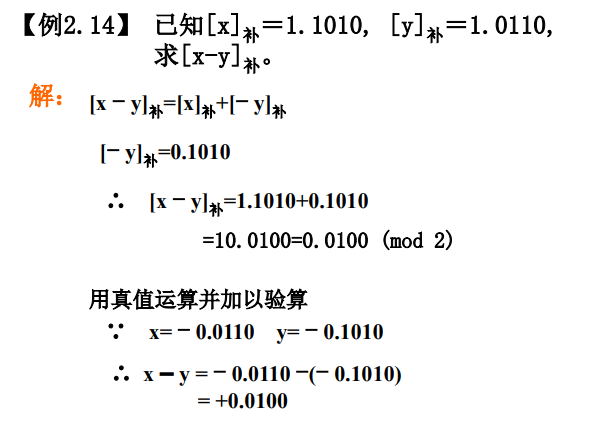
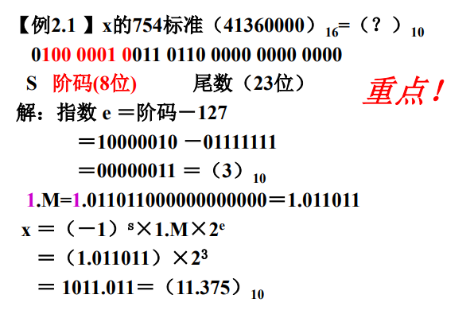
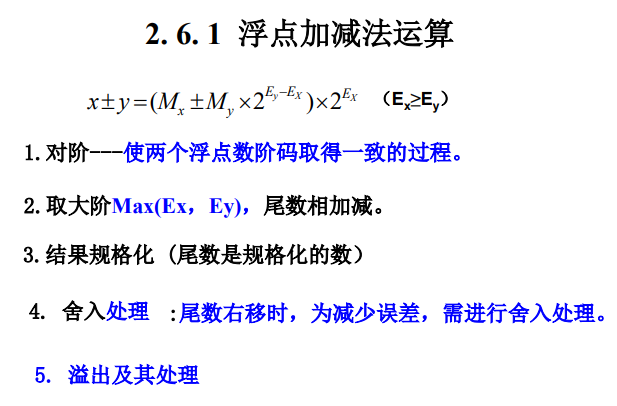
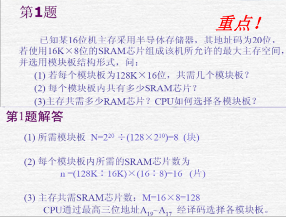
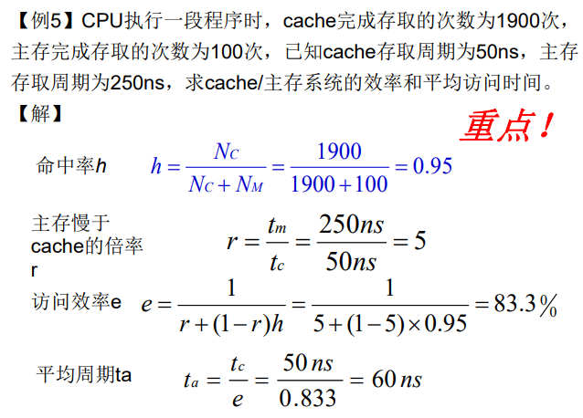
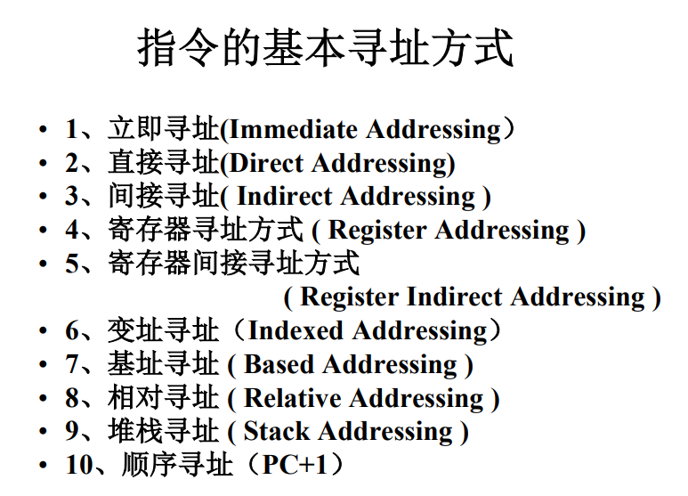
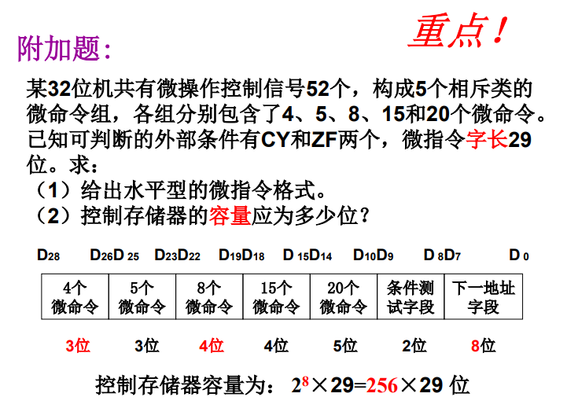
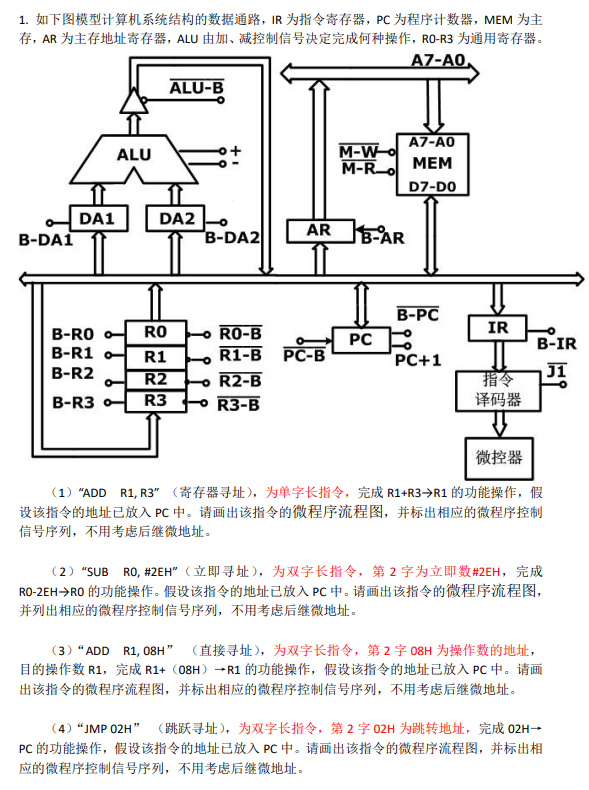
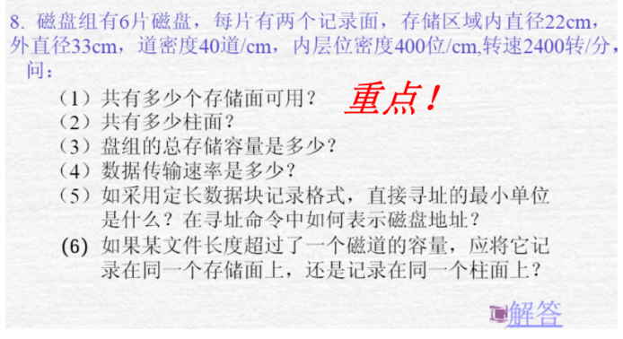

# 2022秋计组期末考大题

2022-2023学年 计组大题

第二章
<!-- question: computer-organization-004-Q1 -->

1. 补码加减法

<!-- question: computer-organization-004-Q2 -->

1. 754标准规格化

<!-- question: computer-organization-004-Q3 -->

1. 浮点加减法

第三章
<!-- question: computer-organization-004-Q4 -->

1. 存储容量扩展

****
<!-- question: computer-organization-004-Q5 -->

1. Cache命中率计算

第四章
<!-- question: computer-organization-004-Q6 -->

1. 寻址方式

第五章
<!-- question: computer-organization-004-Q7 -->

1. 微指令编码

<!-- question: computer-organization-004-Q8 -->

1. 微程序框图

第七章
<!-- question: computer-organization-004-Q9 -->

1. 磁盘计算

