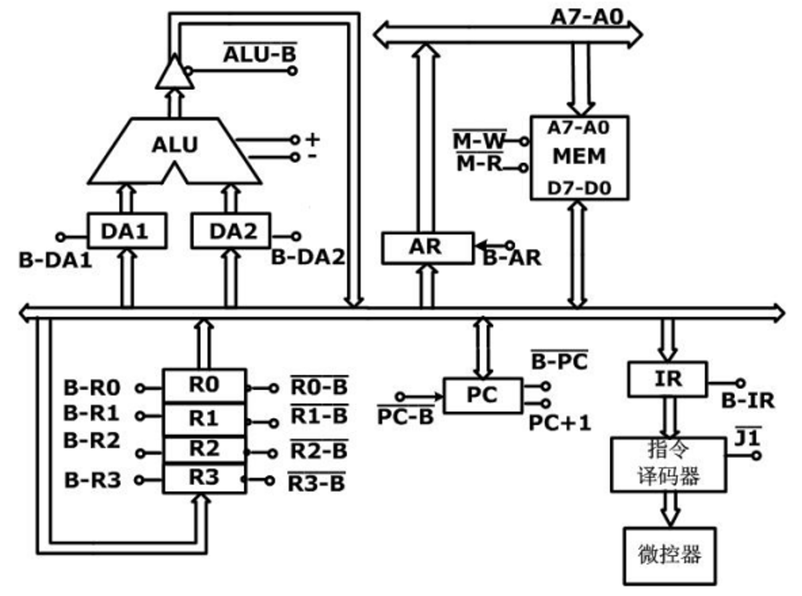

# 2024-2025 计算机组成原理与体系结构 A卷

<!-- page: 1 -->

诚信应考，考试作弊将带来严重后果！

华南理工大学本科生期末考试

《计算机组成原理与体系结构》A 卷

( 密 封 线 内 不 答 题 )
姓名
学号
学院
专业
座位号

2024-2025 学年第二学期

线
封
密

注意事项：1. 开考前请将密封线内各项信息填写清楚；

<!-- question: computer-organization-005-Q1 -->

2. 所有答案请直接答在试卷上；

<!-- question: computer-organization-005-Q2 -->

3. 考试形式：闭卷；

<!-- question: computer-organization-005-Q3 -->

4. 本试卷共5 大题，满分100 分，考试时间120 分钟；

题 号
一
二
三
四
五
总分

得 分

评阅教师请在试卷袋上评阅栏签名

<!-- question: computer-organization-005-Q4 -->

一、选择题，每题只有一个正确选项。 共20 题，每题1 分，共20 分.

<!-- question: computer-organization-005-Q5 -->

1.−2 的8 位补码格式机器数用16 进制表示为 (     )

A. 82H
B. FEH
C. 02H
D. FFH

<!-- question: computer-organization-005-Q6 -->

2.下面不同的进制数中，真值最小的是 (     )

A. (01111110)2

B. 80H

C. (177)8

D. 129

3.32 × 32 点阵的汉字字模大小为 (     )

A. 16
B. 128
C. 4
D. 1024

4.8 位定点整数原码能表示的数据范围是 (     )

A. −127 ∼+127

B. −128 ∼+127

C. −128 ∼+128

D. −127 ∼+128

<!-- question: computer-organization-005-Q7 -->

5.下面的数据中有7 位数据位，一位奇校验位，校验出错的是 (     )

A. 00010110
B. 01010101

《计算机组成原理与体系结构》试卷 第 1 页 共 7 页

<!-- page: 2 -->

C. 11110010
D. 10010111

6.16 位组内先行进位，组间串行进位的多功能ALU，需要74181，74182 的数量分别是
(     )

A. 0，4
B. 4，0
C. 1，4
D. 4，1

<!-- question: computer-organization-005-Q8 -->

7.𝑋= 10000101, 𝑌= 11001001, 𝑋𝑌 异或得到 (     )

A. 01001110

B. 10111100

C. 01001100

D. 10110011

<!-- question: computer-organization-005-Q9 -->

8.内部集成一个小容量Cache 以提高DRAM 读取速率的是 (     )

A. FPM DRAM
B. SDRAM
C. CDRAM
D. DDR RAM

<!-- question: computer-organization-005-Q10 -->

9.LOAD R0 (R1)，R1 存储的内容是内存单元的有效地址，则(R1)的寻址方式是 (     )

A. 寄存器寻址

B. 间接寻址

C. 相对寻址

D. 寄存器间接寻址

<!-- question: computer-organization-005-Q11 -->

10.下面的的设计不是基于程序的局部性原理的是 (     )

A. Cache

B. 虚拟存储器

C. 双端口存储器

D. 猝发式存取

<!-- question: computer-organization-005-Q12 -->

11.一个512K * 32 位的SRAM，地址引脚和数据引脚的数目分别是 (     )

A. 32，19
B. 19，32
C. 20，16
D. 16，20

<!-- question: computer-organization-005-Q13 -->

12.下面外设中哪个不是输入设备 (     )

A. 键盘
B. 光笔
C. 麦克风
D. 音箱

<!-- question: computer-organization-005-Q14 -->

13.关于水平型微指令和垂直型微指令的描述不正确的是 (     )

A. 水平微指令的并行性更强

B. 垂直微指令执行一条机器指令需要的时间更长

C. 一条水平微指令可以发出更多兼容的微操作

D. 用垂直微指令编写的微程序，微指令字长较长且微程序也较长

<!-- question: computer-organization-005-Q15 -->

14.一条微指令周期在时间上和哪个周期等同 (     )

《计算机组成原理与体系结构》试卷 第 2 页 共 7 页

<!-- page: 3 -->

A. T 周期

B. CPU 周期

C. 时钟周期

D. 指令周期

<!-- question: computer-organization-005-Q16 -->

15.以下哪个选项不影响Cache 的命中率 (     )

A. 块的大小

B. 映射方式

C. Cache 容量

D. 主存容量

<!-- question: computer-organization-005-Q17 -->

16.采用DMA 方式时，数据传送由哪个部件控制下完成 (     )

A. 总线控制器

B. DMA 控制器

C. 总线仲裁器

D. 中央处理器

<!-- question: computer-organization-005-Q18 -->

17.不属于CISC 指令集特点的是 (     )

A. 指令条数多

B. 通用寄存器数量多

C. 寻址方式种类多

D. 指令字长度不一致

<!-- question: computer-organization-005-Q19 -->

18.有如下两条顺序执行的指令：
<!-- question: computer-organization-005-Q20 -->

(1)ADD R3, R4;
 (R3)+(R4)→R3
<!-- question: computer-organization-005-Q21 -->

(2)MUL R4, R5;
 (R4)*(R5)→R4
 会出现哪种数据相关 (     )

A. RAW
B. WAR
C. WAW
D. RAR

<!-- question: computer-organization-005-Q22 -->

19.下面关于总线异步传输的描述，不正确的是 (     )

A. 不需要统一的时钟信号

B. 也被称为应答式通讯

C. 总线周期固定

D. 速度差异大的设备更适合异步通讯

<!-- question: computer-organization-005-Q23 -->

20.SIMD 的含义是 (     )

A. 单指令多数据流

B. 单指令单数据流

C. 多指令单数据流

D. 多指令多数据流

《计算机组成原理与体系结构》试卷 第 3 页 共 7 页

<!-- page: 4 -->

<!-- question: computer-organization-005-Q24 -->

二、填空题。每空2 分，共20 分。

<!-- question: computer-organization-005-Q25 -->

1. (本题2 分)存储器可以被分为多种分类，其中按照在计算机系统中的作用可分为主

存和
。

<!-- question: computer-organization-005-Q26 -->

2. (本题4 分)CPU 和Cache 间交换数据的单位是
，Cache 和主存间交

换数据的单位是
。

<!-- question: computer-organization-005-Q27 -->

3. (本题2 分)指令寻址的两种方式是顺序寻址和
。

<!-- question: computer-organization-005-Q28 -->

4. (本题6 分)指令系统应该具备的特点有
，
，

和兼容性。

<!-- question: computer-organization-005-Q29 -->

5. (本题6 分)CPU 的基本功能是指令控制，
，
和

。

<!-- question: computer-organization-005-Q30 -->

三、简答题。 共3 题，每题8 分，共24 分.

<!-- question: computer-organization-005-Q31 -->

1.请简要描述多体交叉存储器的结构特征和编址方式。

<!-- question: computer-organization-005-Q32 -->

2.请简要描述堆栈寻址的特征。

《计算机组成原理与体系结构》试卷 第 4 页 共 7 页

<!-- page: 5 -->

<!-- question: computer-organization-005-Q33 -->

3.单处理机的总线类型有哪些？各自连接了什么部件？

<!-- question: computer-organization-005-Q34 -->

四、计算题。 共2 题，每题10 分，共20 分.

<!-- question: computer-organization-005-Q35 -->

1.按字节编址，主存容量为512KB，Cache 容量为16KB，Cache 中一块有16 字，一个
字为32 位。

<!-- question: computer-organization-005-Q36 -->

 (1) 按直接映射方式，主存地址各字段长度是多少？
<!-- question: computer-organization-005-Q37 -->

 (2) 按四路组相联映射方式，主存地址各字段长度是多少？

《计算机组成原理与体系结构》试卷 第 5 页 共 7 页

<!-- page: 6 -->

<!-- question: computer-organization-005-Q38 -->

2.设某虚存有如下快表放在相联存储器中，其容量为8 个存储单元，问:按如下三个虚
拟地址访问主存主存的实际地址码是多少？（设地址均为16 进制）

页号
页内地址

页号
本页在主存起始地址

33
42000

1
15
0324

25
38000

2
7
0128

7
96000

3
48
0516

6
60000

4
40000

15
80000

5
50000

30
70000

<!-- question: computer-organization-005-Q39 -->

五、设计题。 共1 题，每题16 分，共16 分.

<!-- question: computer-organization-005-Q40 -->

1.如下图模型计算机系统结构的数据通路，IR 为指令寄存器，PC 为程序计数器，MEM
为主存，AR 为主存地址寄存器，ALU 由加、减控制信号决定完成何种操作，R0-R3 为
通用寄存器。
<!-- question: computer-organization-005-Q41 -->

(1)“ADD R1, R2”为单字长指令，完成 R1+R2→R1 的功能操作，假设该指令的地址
已放PC 中。请画出该指令的微程序流程图，并标出相应的微程序控制信号序列，不用
考虑后缀微地址。
<!-- question: computer-organization-005-Q42 -->

(2)“SUB R0, #6AH”为双字长指令，第2 字为立即数#6AH,完成 R0-6AH→R0 的功能
操作。假设该指令的地址已放PC 中。请画出该指令的微程序流程图，并列出相应的微
程序控制信号序列，不用考虑后缀微地址。

《计算机组成原理与体系结构》试卷 第 6 页 共 7 页

<!-- page: 7 -->

《计算机组成原理与体系结构》试卷 第 7 页 共 7 页

