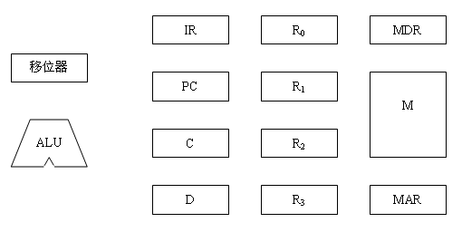
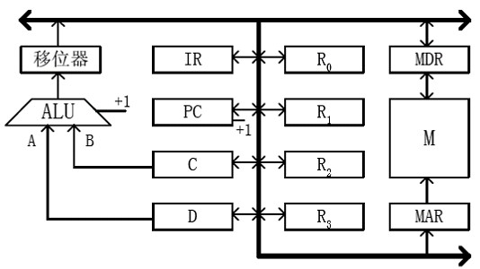
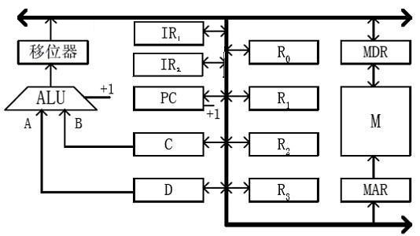
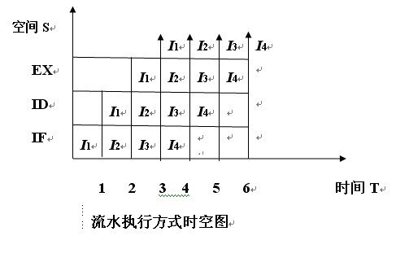
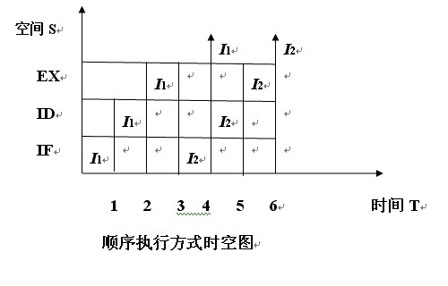

# B

本科生期末试卷（一）

蓝色标注的是有疑问的题目

一、选择题（每小题1分，共15分）

1  从器件角度看，计算机经历了五代变化。但从系统结构看，至今绝大多数计算机仍属于（    B）计算机。

A    并行       B    冯·诺依曼    C    智能        D    串行

2  某机字长32位，其中1位表示符号位。若用定点整数表示，则最小负整数为（  A ）。

A  -(231-1)        B  -(230-1)    C  -(231+1)    D  -(230+1)

3  以下有关运算器的描述，（    C）是正确的。

A    只做加法运算  B    只做算术运算

C    算术运算与逻辑运算 D    只做逻辑运算

4    EEPROM是指（ D ）。

A    读写存储器        B    只读存储器

C    闪速存储器        D    电擦除可编程只读存储器

5  常用的虚拟存储系统由（  B ）两级存储器组成，其中辅存是大容量的磁表面存储器。A cache-主存  B主存-辅存  Ccache-辅存D  通用寄存器-cache

6    RISC访内指令中，操作数的物理位置一般安排在（  	D ）。

A    栈顶和次栈顶  B    两个主存单元

C    一个主存单元和一个通用寄存器D    两个通用寄存器

7  当前的CPU由（    B）组成。

A    控制器B    控制器、运算器、cache

C    运算器、主存  D    控制器、ALU、主存

8  流水CPU是由一系列叫做“段”的处理部件组成。和具备m个并行部件的CPU相比，一个m段流水CPU的吞吐能力是（    A）。

A    具备同等水平 B    不具备同等水平

C    小于前者  D    大于前者

9  在集中式总线仲裁中，（    A）方式响应时间最快。

A    独立请求    B    计数器定时查询        C    菊花链

10    CPU中跟踪指令后继地址的寄存器是（ C ）。

A    地址寄存器        B    指令计数器

C    程序计数器    D    指令寄存器

11  从信息流的传输速度来看，（  A ）系统工作效率最低。

A    单总线    B    双总线

C    三总线        D    多总线

12  单级中断系统中，CPU一旦响应中断，立即关闭（    C）标志，以防止本次中断服务结束前同级的其他中断源产生另一次中断进行干扰。

A    中断允许        B    中断请求

C    中断屏蔽    D  DMA请求

13  安腾处理机的典型指令格式为（    C）位。

A  32位        B  64位       C  41位    D  48位

14  下面操作中应该由特权指令完成的是（B  ）。

A    设置定时器的初值  B    从用户模式切换到管理员模式

C    开定时器中断  D    关中断

15  下列各项中，不属于安腾体系结构基本特征的是（ D ）。

A    超长指令字B    显式并行指令计算

C    推断执行D    超线程

二、填空题（每小题2分，共20分）

1  字符信息是符号数据，属于处理（  非数值  ）领域的问题，国际上采用的字符系统是七单位的（ ASCII ）码。

2  按IEEE754标准，一个32位浮点数由符号位S（1位）、阶码E（8位）、尾数M（23位）三个域组成。其中阶码E的值等于指数的真值（    e）加上一个固定的偏移值（  127 ）。

3  双端口存储器和多模块交叉存储器属于并行存储器结构，其中前者采用（  空间  ）并行技术，后者采用（  时间  ）并行技术。

4  虚拟存储器分为页式、（  段 ）式、（段页    ）式三种。

5  安腾指令格式采用5个字段：除了操作码（OP）字段和推断字段外，还有3个7位的（    寄存器）字段，它们用于指定（  ）2个源操作数和1个目标操作数的地址。

6    CPU从内存取出一条指令并执行该指令的时间称为（  指令周期  ），它常用若干个（  CPU机器周期  ）来表示。

7  安腾CPU中的主要寄存器除了128个通用寄存器、128个浮点寄存器、128个应用寄存器、1个指令指针寄存器（即程序计数器）外，还有64个（  1位推断寄存器  ）和8个（ 64位分支寄存器  ）。

8  衡量总线性能的重要指标是（总线带宽    ），它定义为总线本身所能达到的最高传输速率，单位是（字节/秒 或m/s ）。

9    DMA控制器按其结构，分为（选择型    ）DMA控制器和（  多路型  ）DMA控制器。前者适用于高速设备，后者适用于慢速设备。

10    64位处理机的两种典型体系结构是（    英特尔64体系结构）和（ 安腾体系结构  ）。前者保持了与IA-32的完全兼容，后者则是一种全新的体系结构。

三、简答题（每小题8分，共16分）

1    CPU中有哪几类主要寄存器，用一句话回答其功能。

答：（1）数据缓冲寄存器（DR）：数据缓冲寄存器用来暂时存放ALU的运算结果、由数据存储器读出的一个数据字、来自外部接口的一个数据字。

（2）指令存储器（IR）：指令存储器用来保存当前正在执行的一条指令。

（3）程序计数器（PC）： 用来存放下一条指令的地址。

（4）数据地址寄存器（AR）：数据地址寄存器用来保存当前CPU所访问的数据cache存储器中（简称树村）单元的地址。

（5）通用寄存器（R0~R3）：当算术逻辑单元（ALU）执行算术或逻辑运算时，为ALU提供一个工作区。

（6）状态字寄存器（PSW）：状态字寄存器保存有算术指令和逻辑指令运算或测试结果建立的各种条件代码。

2  指令和数据都用二进制代码存放在内存中，从时空观角度回答CPU如何区分读出的代码是指令还是数据。

答：计算机可以从时间和空间两方面来区分指令和数据，在时间上，取指周期从内存中取出的是指令，而执行周期从内存取出或往内存中写入的是数据;在空间上，从内存中取出指令送控制器，而执行周期从内存从取的数据送运算器、往内存写入的数据也是来自于运算器。

四、计算题（10分）

设x=-15，y=+13，数据用补码表示，用带求补器的阵列乘法器求出乘积x×y，并用十进制数乘法进行验证。

答：设最高位为符号位，输入数据用补码表示：[x]补=10001，[y]补=01101.

乘积符号位运算  x0⊕y0=0⊕1=1

算前求补器输出为|x|=1111，|y|=1101

1  1  1  1

×                            1  1  0  1

1  1  1  1

0  0  0  0

1  1  1  1

1  1  1  1

1  1  0  0  0  0  1  1

算后求补器输出为00111101，加上符号为1，

最后得补码乘积值[x×y]补=100111101.

利用补码与真值换算公式，补码二进制数真值是：

x×y=-1×2^8+1×2^5+1×2^4+1×2^3+1×2^2+1×2^0=(-195)10

五、证明题（12分）

用定量分析方法证明多模块交叉存储器带宽大于顺序存储器带宽。

答：（1）存储器模块字长等于数据总线宽度 （2）模块存取一个字的存储周期等于T  （3）总线传送周期为r  （4）交叉存储器的交叉模块数为m  交叉存储器为了实现流水线方式存储，即每经过τ时间延迟后启动下一模块，应满足  T = mr，（1） 交叉存储器要求其模块数≥m,以保证启动某模块后经过mr时间后再次启动该模块时，它的上次存取操作已经完成。这样连续读取m个字所需要时间为  t1=T+(m–1)r= mr+mr–r=(2m–1)r (2)    故存储器带宽为W1 = 1/t1 = 1/(2m-1)r (3)  而顺序方式存储器连续读取m个字所需时间为  t2 = mT = m2×r (4)  存储器带宽为W2 = 1/t2 = 1/m2×r (5)  比较(3)和(5)式可知，交叉存储器带宽W1 >  顺序存储器带宽W2

（2）答：设模块存取一个字的存储周期为T，总线传送周期为$\tau$，存储器的交叉模块数为m，应当满足：T=m$\tau$。

其中$m=\frac {T} {\tau }$称为交叉存取度。

多模块交叉存储器连续读取m个字所需的时间为：${t}_{1}=T+(m-1)\tau$

而顺序方式存储器连续读取m个字所需的时间为：${t}_{2}=mT$

又T=m$\tau$且m>1,故有T>$\tau$.

则${t}_{1}=T+(m-1)\tau <T+(m-1)T=mT={t}_{2}$

又存储器的带宽为$W=q/t$，q不变，${t}_{1}<{t}_{2}$，则${W}_{1}>{W}_{2}$

则多模块交叉存储器的带宽大于顺序方式存储器的带宽。

六、设计题（15分）

某计算机有下图所示的功能部件，其中M为主存，指令和数据均存放在其中，MDR为主存数据寄存器，MAR为主存地址寄存器，R0～R3为通用寄存器，IR为指令寄存器，PC为程序计数器（具有自动加1功能），C、D为暂存寄存器，ALU为算术逻辑单元，移位器可左移、右移、直通传送。⑴将所有功能部件连接起来，组成完整的数据通路，并用单向或双向箭头表示信息传送方向。 ⑵画出“ADD R1，（R2）”指令周期流程图。该指令的含义是将R1中的数与（R2）指示的主存单元中的数相加，相加的结果直通传送至R1中。 ⑶若另外增加一个指令存贮器，修改数据通路，画出⑵的指令周期流程图。

答：（1）

(2)

七、分析计算题（12分）

如果一条指令的执行过程分为取指令、指令译码、指令执行三个子过程，每个子过程时间都为100ns。

⑴请分别画出指令顺序执行和流水执行方式的时空图。

⑵计算两种情况下执行n=1000条指令所需的时间。

⑶流水方式比顺序方式执行指令的速度提高了几倍？

答：（1）

（2）答：T顺=3*100ns*1000=300ms

T流=(2+1000)*100ns=100.2ms

(3)答：同样执行1000条指令，流水执行时间大约是顺序执行的1/3，即流水执行大概提高了两倍速度。
