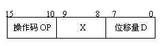

# B

本科生期末试卷（三）

**一、选择题（每小题1分，共15分）**

1  下列数中最小的数是（ C）。

A    （101001）2        B    （52）8        C    （101001）BCD        D    （233）16

2  某DRAM芯片，其存储容量为512M×8位，该芯片的地址线和数据线的数目是（  D ）。注释：512改512M

A  8，512    B  512，8    C  18，8    D  19，8

3  在下面描述的汇编语言基本概念中，不正确的表述是（ C ）。

A    对程序员的训练要求来说，需要硬件知识

B    汇编语言对机器的依赖性高

C    用汇编语言编写程序的难度比高级语言小

D    汇编语言编写的程序执行速度比高级语言慢

4  交叉存储器实质上是一种多模块存储器，它用（ A）方式执行多个独立的读写操作。

A    流水        B    资源重复        C    顺序        D    资源共享

5  寄存器间接寻址方式中，操作数在（ B ）。

A    通用寄存器        B    主存单元        C    程序计数器        D    堆栈

6  机器指令与微指令之间的关系是（ A ）。

A    用若干条微指令实现一条机器指令

B    用若干条机器指令实现一条微指令

C    用一条微指令实现一条机器指令

D    用一条机器指令实现一条微指令

7  描述多媒体CPU基本概念中，不正确的是（  C ）。

A    多媒体CPU是带有MMX技术的处理器

B  MMX是一种多媒体扩展结构

C  MMX指令集是一种多指令流多数据流的并行处理指令

D    多媒体CPU是以超标量结构为基础的CISC机器

8  在集中式总线仲裁中，（ A ）方式对电路故障最敏感。

A    菊花链        B    独立请求        C    计数器定时查询

9  流水线中造成控制相关的原因是执行（  A ）指令而引起。

A    条件转移        B    访内        C    算逻        D    无条件转移

10    PCI总线是一个高带宽且与处理器无关的标准总线。下面描述中不正确的是（ D ）。

A    采用同步定时协议        B    采用分布式仲裁策略

C    具有自动配置能力        D    适合于低成本的小系统

11  下面陈述中，不属于外围设备三个基本组成部分的是（  D ）。

A    存储介质        B    驱动装置        C    控制电路        D    计数器

12  中断处理过程中，（B  ）项是由硬件完成。

A    关中断        B    开中断        C    保存CPU现场        D    恢复CPU现场

13    IEEE1394是一种高速串行I/O标准接口。以下选项中，（ D ）项不属于IEEE1394的协议集。

A    业务层        B    链路层        C    物理层        D    串行总线管理

14  下面陈述中，（  C ）项属于存储管理部件MMU的职能。

A    分区式存储管理        B    交换技术        C    分页技术

15    64位的安腾处理机设置了四类执行单元。下面陈述中，（D  ）项不属于安腾的执行单元。

A    浮点执行单元        B    存储器执行单元

C    转移执行单元        D    定点执行单元

**二、填空题（每小题2分，共20分）**

1  定点32位字长的字，采用2的补码形式表示时，一个字所能表示的整数范围是（  -2^31到2^31-1 ）。

2    IEEE754标准规定的64位浮点数格式中，符号位为1位，阶码为11位，尾数为52位，则它能表示的最大规格化正数为（(2-2^-52)*2^(2^10-1)  ）。

3  浮点加、减法运算的步骤是（  0操作数检查  ）、（比较阶码大小并完成对阶   ）、（  尾数加减 ）、（  结果规格化  ）、（舍入处理   ）。

4  某计算机字长32位，其存储容量为64MB，若按字编址，它的存储系统的地址线至少需要（  14 ）条。
1. 一个组相联映射的Cache，有128块，每组4块，主存共有16384块，每块64个字，则主存地址共（  20 ）位，其中主存字块标记应为（ 9 ）位，组地址应为（ 5 ）位，Cache地址共（ 11 ）位。

注释：9位标记，5位组号，6位块内；Cathe地址仍不懂，书上P98说就是组号。

6    CPU从主存取出一条指令并执行该指令的时间叫（指令周期   ），它通常包含若干个（ CPU周期 ），而后者又包含若干个（  时钟周期 ）。

7  某中断系统中，每抽取一个输入数据就要中断CPU一次，中断处理程序接收取样的数据，并将其保存到主存缓冲区内。该中断处理需要X秒。另一方面，缓冲区内每存储N个数据，主程序就将其取出进行处理，这种处理需要Y秒，因此该系统可以跟踪到每秒（N/(N*X+Y)  ）次中断请求。

8  在计算机系统中，多个系统部件之间信息传送的公共通路称为（  总线  ）。就其所传送信息的性质而言，在公共通路上传送的信息包括（  地址 ）、（ 数据 ）、（  控制信息  ）。

9  在虚存系统中，通常采用页表保护、段表保护和键保护方法实现（存储    ）保护。

10  安腾体系结构采用推测技术，利用（  控制 ）推测方法和（ 数据 ）推测方法提高指令执行的并行度。

**三、简答题（每小题8分，共16分）**

1  列表比较CISC处理机和RISC处理机的特点。

| 比较内容 | CISC | RISC |
|---|---|---|
| 指令系统 | 复杂、庞大 | 简单、精简 |
| 指令数目 | 一般大于200 | 一般小于100 |
| 指令格式 | 一般大于4 | 一般小于4 |
| 寻址方式 | 一般大于4 | 一般小于4 |
| 指令字长 | 不固定 | 等长 |
| 可访存指令 | 不加限制 | 只有取数和存数 |
| 各种指令使用频率 | 相差很大 | 相差不大 |
| 各种指令执行时间 | 相差很大 | 绝大多数一个周期内完成 |
| 优化编译实现 | 很难 | 较容易 |
| 程序源代码长度 | 较短 | 较长 |
| 控制器实现方式 | 绝大多数为微程序控制 | 绝大多数为硬连线控制 |
| 软件系统开发时间 | 较短 | 较长 |

2  简要列出64位的安腾处理机体系结构的主要特点。

1.显示并行指令计算（EPIC）技术。

2.超长指令字（VLIW）技术。

3.分支推断技术

4.推测技术

5.软件流水线技术

6.寄存器堆栈技术

**四、计算题（12分）**

有两个浮点数N1=2j1×S1,N2=2j2×S2，其中阶码用4位移码、尾数用8位原码表示（含1位符号位）。设j1=(11)2,S1=(+0.0110011)2,j2=(-10)2,S2=(+0.1101101)2，求N1+N2，写出运算步骤及结果。

[j1]移码=1011 , [S1]原码=0.0110011

[j2]移码=0110 , [S2]原码=0.1101101

△e= j1-j2=[j1]补码-[j2]补码=0 101

[j2]移码=1011，[S2]原码=0.0000011

0.0110011

+ 0.0000011

= 0.0110110

最终结果

[S]原码=0.1101100

[j]移码=1010

**五、设计题（12分）**

机器字长32位，常规设计的物理存储空间≤32M，若将物理存储空间扩展到256M，请提出一种设计方案。

解决方案：

使用256/32=8个该常规存储器。

使用18条地址线，原有的15条地址线分别与8个存储器相应的15个地址线接口相连，另3条连接一个3:8译码器，8条输出线取反后分别和8个存储器的使能端相连。

**六、分析题（10分）**

某机的指令格式如下所示

X为寻址特征位：X=00：直接寻址；X=01：用变址寄存器RX1寻址；X=10：用变址寄存器RX2寻址；X=11：相对寻址

设(PC)=1234H,(RX1)=0037H,(RX2)=1122H（H代表十六进制数），请确定下列指令中的有效地址：

①4420H    ②2244H    ③1322H    ④3521H

①有效地址：0020H

②有效地址：1166H

③有效地址：1256H

④有效地址：0058H

**七、分析题（15分）**

有如下四种类型的单处理机：

①  基准标量机（每个CPU周期启动1条机器指令，并行度ILP=1）；

②  超级标量机（每个CPU周期启动3条机器指令，并行度ILP=3）；
- 超级流水机（每1/3个CPU周期启动1条机器指令，并行度ILP=3）；

④  超标量超流水机（每个CPU周期启动9条指令，并行度ILP=9）。

试画出四种类型处理机的时空图。

①

|  |  | I1 | I2 | I3 | I4 |
|---|---|---|---|---|---|
|  | I1 | I2 | I3 | I4 |  |
| I1 | I2 | I3 | I4 |  |  |

②

|  |  | I1 | I4 | I7 | I10 |
|---|---|---|---|---|---|
|  |  | I2 | I5 | I8 | I11 |
|  |  | I3 | I6 | I9 | I12 |
|  | I1 | I4 | I7 | I10 |  |
|  | I2 | I5 | I8 | I11 |  |
|  | I3 | I6 | I9 | I12 |  |
| I1 | I4 | I7 | I10 |  |  |
| I2 | I5 | I8 | I11 |  |  |
| I3 | I6 | I9 | I12 |  |  |

③

|  |  | I1 | I4 | I7 | I0 | I1 |
|---|---|---|---|---|---|---|
|  |  | I2 | I5 | I8 | I1 |  |
|  |  | I3 | I6 | I9 | I2 |  |
|  | I1 |  | I4 | I7 | I0 |  |
|  | I2 | I5 | I8 | I1 |  |  |
|  | I3 | I6 | I9 | I2 |  |  |
| I1 | I4 | I7 | I0 |  |  |  |
| I2 | I5 | I8 | I1 |  |  |  |
| I3 | I6 | I9 | I2 |  |  |  |

注释：

此表实在是不确定，属个人猜想

④

|  |  | I1 |
|---|---|---|
|  |  | I2 |
|  |  | I3 |
|  |  | I4 |
|  |  | I5 |
|  |  | I6 |
|  |  | I7 |
|  |  | I8 |
|  |  | I9 |
|  | I1 |  |
|  | I2 |  |
|  | I3 |  |
|  | I4 |  |
|  | I5 |  |
|  | I6 |  |
|  | I7 |  |
|  | I8 |  |
|  | I9 |  |
| I1 |  |  |
| I2 |  |  |
| I3 |  |  |
| I4 |  |  |
| I5 |  |  |
| I6 |  |  |
| I7 |  |  |
| I8 |  |  |
| I9 |  |  |
