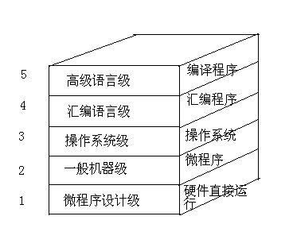
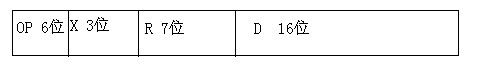
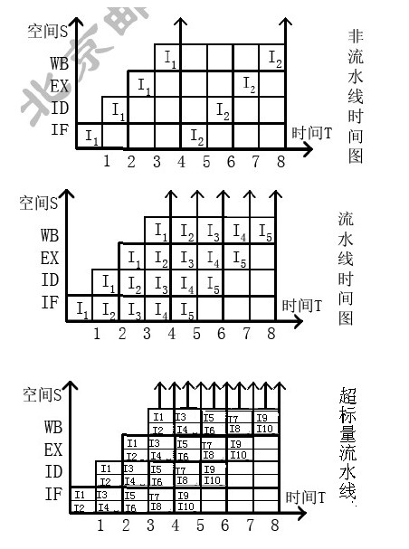
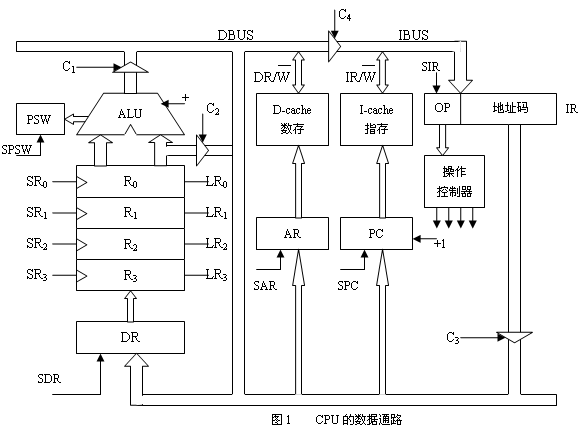
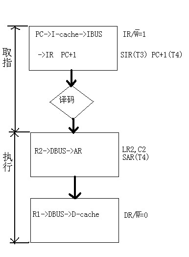

# B

本科生期末试卷（五）

一、选择题（每小题1分，共15分）

1  某机字长64位，1位符号位，63位表示尾数，若用定点整数表示，则最大正整数位（  A ）。

A  +(263-1)    B  +(264-1)    C  -(263-1)    D  -(264-1)

2  请从下面浮点运算器中的描述中选出两个描述正确的句子（A、C  ）。

A    浮点运算器可用两个松散连接的定点运算部件一阶码和尾数部件来实现。

B    阶码部件可实现加，减，乘，除四种运算。

C    阶码部件只进行阶码相加，相减和比较操作。

D    尾数部件只进行乘法和除法运算。

3  存储单元是指（  B ）。

A    存放1个二进制信息位的存储元

B    存放1个机器字的所有存储元集合

C    存放1个字节的所有存储元集合

D    存放2个字节的所有存储元集合

4  某机字长32位，存储容量1MB，若按字编址，它的寻址范围是（  D ）。

A  0—1M    B  0—512KB    C  0—56K    D  0—256KB

5  用于对某个寄存器中操作数的寻址方式为（  C ）。

A    直接        B    间接        C    寄存器直接        D    寄存器间接

6  程序控制类的指令功能是（  D ）。

A    进行算术运算和逻辑运算

B    进行主存与CPU之间的数据传送

C    进行CPU和I/O设备之间的数据传送

D    改变程序执行的顺序

7  指令周期是指（C  ）。

A  CPU从主存取出一条指令的时间

B  CPU执行一条指令的时间

C  CPU从主存取出一条指令加上执行一条指令的时间

D    时钟周期时间

8  描述当代流行总线结构中基本概念不正确的句子是（  AC ）。

A    当代流行的总线不是标准总线

B    当代总线结构中，CPU和它私有的cache一起作为一个模块与总线相连

C    系统中允许有一个这样的CPU模块

9    CRT的颜色为256色，则刷新存储器每个单元的字长是（  C ）。

A  256位        B  16位        C  8位        D  7位

10  发生中断请求的条件是（  A ）。

A    一条指令执行结束

B    一次I/O操作结束

C    机器内部发生故障

D    一次DMA操作结束

11  中断向量地址是（  B ）。

A    子程序入口地址

B    中断服务程序入口地址

C    中断服务程序入口地址指示器

D    例行程序入口地址

12    IEEE1394所以能实现数据传送的实时性，是因为（AC  ）。

A    除异步传送外，还提供同步传送方式

B    提高了时钟频率

C    除优先权仲裁外，还提供均等仲裁,紧急仲裁两种总线仲裁方式

D    能够进行热插拔

13  直接映射cache的主要优点是实现简单。这种方式的主要缺点是（  B ）。

A    它比其他cache映射方式价格更贵

B    如果使用中的2个或多个块映射到cache同一行，命中率则下降

C    它的存取时间大于其它cache映射方式

D  cache中的块数随着主存容量增大而线性增加

14  虚拟存储器中段页式存储管理方案的特性为（  D ）。

A    空间浪费大，存储共享不易，存储保护容易，不能动态连接

B    空间浪费小，存储共享容易，存储保护不易，不能动态连接

C    空间浪费大，存储共享不易，存储保护容易，能动态连接

D    空间浪费小，存储共享容易，存储保护容易，能动态连接

15  安腾处理机的指令格式中，操作数寻址采用（  B ）。

A  R-R-S型        B  R-R-R型        C  R-S-S型        D  S-S-S型

二、填空题（每小题2分，共20分）

1    IEEE6754标准规定的64位浮点数格式中，符号位为1位，阶码为11位，尾数为52位。则它所能表示的最大规格化正数为（ (2-2-52  )*21023 ）。

2  直接使用西文键盘输入汉字，进行处理，并显示打印汉字，要解决汉字的（ 输入  ）、（  内部处理  ）和（  输出  ）三种不同用途的编码。

3  数的真值变成机器码时有四种表示方法，即（  原码  ）表示法，（  补码  ）表示法，（  反码  ）表示法，（  移码  ）表示法。

4  主存储器的技术指标有（存储容量    ），（  存取时间  ），（  存储周期  ），（  存储器带宽  ）。

5    cache和主存构成了（内存储器    ），全由（  硬件  ）来实现。

6  根据通道的工作方式，通道分为（  选择  ）通道和（  多路  ）通道两种类型。

7    SCSI是（  并行  ）I/O标准接口，IEEE1394是（  串行  ）I/O标准接口。

8  某系统总线的一个存取周期最快为3个总线时钟周期，总线在一个总线周期中可以存取32位数据。如总线的时钟频率为8.33MHz，则总线的带宽是（  11.11MB/S ）。

9  操作系统是计算机硬件资源管理器，其主要管理功能有（  处理机  ）管理、（  存储  ）管理和（  设备  ）管理。

10 安腾处理机采用VLIW技术，编译器经过优化，将多条能并行执行的指令合并成一个具有（  多个操作码  ）的超长指令字，控制多个独立的（  功能部件  ）同时工作。

三、简答题（每小题8分，共16分）

1  画图说明现代计算机系统的层次结构。

2  简述水平型微指令和垂直型微指令的特点。

**水平型**微指令：**一次**能定义并执行多个**并行操作微命令的微指令**。并行操作能力强，效率高，灵活性强。

垂直型微指令：微指令中设置微操作码字段，采用微操作码编译法，由微操作码规定微指令功能。每条指令功能简单，是用较长的微程序结构来换取较短的微指令结构。

四、计算题（10分）

CPU执行一段程序时，cache完成存取的次数为2420次，主存完成的次数为80次，已知cache存储周期为40ns，主存存储周期为200ns，求cache/主存系统的效率和平均访问时间。

h = 2420/2500 = 0.968

ta = h*tc+(1-h)*tm = 45.12 ns

e =tc/ta = 88.65%

五、设计题（12分）

某机器单字长指令为32位，共有40条指令，通用寄存器有128个，主存最大寻址空间为64M。寻址方式有立即寻址、直接寻址、寄存器寻址、寄存器间接寻址、基值寻址、相对寻址六种。请设计指令格式，并做必要说明。

X=000  立即寻址 ，D字段为操作数

X=001  直接寻址 ，EA=D

X=010  寄存器寻址 ，R字段选择寄存器，该寄存器中内容为操作数

X=100  寄存器间接寻址 ，R字段选择寄存器，EA=寄存器中内容

X=101  基址寻址 ，EA=（RX）+D

X=110  相对寻址 ，EA=（PC）+D

六、证明题（12分）

一条机器指令的指令周期包括取指（IF）、译码（ID）、执行（EX）、写回（WB）四个过程段，每个过程段1个时钟周期T完成。

先段定机器指令采用以下三种方式执行：①非流水线（顺序）方式，②标量流水线方式，③超标量流水线方式。

请画出三种方式的时空图，证明流水计算机比非流水计算机具有更高的吞吐率。

8个单位时间内，非流水线计算机完成2条指令，标量流水线计算机完成5条，超标量流水线计算机完成10条。可见，流水计算机比非流水计算机具有更高的吞吐率。

七、设计题（15分）

CPU的数据通路如图1所示。运算器中R0～R3为通用寄存器，DR为数据缓冲寄存器，PSW为状态字寄存器。D-cache为数据存储器，I-cache为指令存储器，PC为程序计数器（具有加1功能），IR为指令寄存器。单线箭头信号均为微操作控制信号（电位或脉冲），如LR0表示读出R0寄存器，SR0表示写入R0寄存器。

机器指令“STO R1,(R2)”实现的功能是：将寄存器R1中的数据写入到以（R2）为地址的数存单元中。请画出该存数指令周期流程图，并在CPU周期框外写出所需的微操作控制信号。（一个CPU周期含T1～T4四个时钟信号，寄存器打入信号必须注明时钟序号）

指令周期流程图

