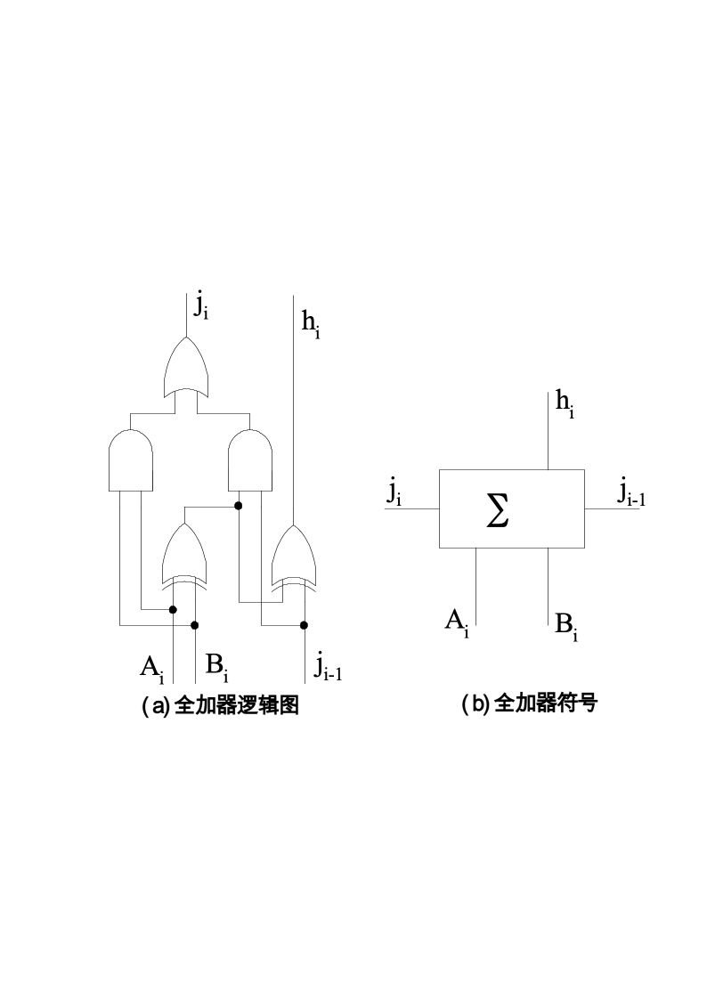

# B

本科生期末试卷（六）

一、选择题（每小题1分，共15分）

1  从器件角度看，计算机经历了五代变化。但从系统结构看，至今绝大多数计算机仍属于（ B ）计算机。10

A    并行        B    冯·诺依曼        C    智能        D    串行

2  某机字长32位，其中1位表示符号位。若用定点整数表示，则最小负整数为（ A ）。

A  -(231-1)    B  -(230-1)    C  -(231+1)    D  -(230+1)

3  以下有关运算器的描述，（ C ）是正确的。

A    只做加法运算        B    只做算术运算

C    算术运算与逻辑运算        D    只做逻辑运算

4    EEPROM是指（ D ）。

A    读写存储器        B    只读存储器

C    闪速存储器        D    电擦除可编程只读存储器

5  常用的虚拟存储系统由（ B ）两级存储器组成，其中辅存是大容量的磁表面存储器。

A  cache-主存        B    主存-辅存        C  cache-辅存        D    通用寄存器-cache

6    RISC访内指令中，操作数的物理位置一般安排在（  D ）。

A    栈顶和次栈顶

B    两个主存单元

C    一个主存单元和一个通用寄存器

D    两个通用寄存器

7  当前的CPU由（  B ）组成。

A    控制器

B    控制器、运算器、cache

C    运算器、主存

D    控制器、ALU、主存

8  流水CPU是由一系列叫做“段”的处理部件组成。和具备m个并行部件的CPU相比，一个m段流水CPU的吞吐能力是（ **A**）。

A    具备同等水平

B    不具备同等水平

C    小于前者

D    大于前者

9  在集中式总线仲裁中，（  A ）方式响应时间最快。

A    独立请求        B    计数器定时查询        C    菊花链

10    CPU中跟踪指令后继地址的寄存器是（ **B** ）。

A    地址寄存器        B    指令计数器        C    程序计数器        D    指令寄存器

11  从信息流的传输速度来看，（ **A** ）系统工作效率最低。

A    单总线        B    双总线        C    三总线        D    多总线

12  单级中断系统中，CPU一旦响应中断，立即关闭（  **C** ）标志，以防止本次中断服务结束前同级的其他中断源产生另一次中断进行干扰。

A    中断允许        B    中断请求        C    中断屏蔽        D  DMA请求

13  安腾处理机的典型指令格式为（ **C** ）位。

A  32位        B  64位        C  41位        D  48位

14  下面操作中应该由特权指令完成的是（ **B**）。

A    设置定时器的初值

B    从用户模式切换到管理员模式

C    开定时器中断

D    关中断

15  下列各项中，不属于安腾体系结构基本特征的是（**D**  ）。

A    超长指令字        B    显式并行指令计算        C    推断执行        D    超线程

二、填空题（每小题2分，共20分）

1  字符信息是符号数据，属于处理（  非数值  ）领域的问题，国际上采用的字符系统是七单位的（ ASCII ）码。

2  按IEEE754标准，一个32位浮点数由符号位S（1位）、阶码E（8位）、尾数M（23位）三个域组成。其中阶码E的值等于指数的真值（ e ）加上一个固定的偏移值（ 127 ）。

3  双端口存储器和多模块交叉存储器属于并行存储器结构，其中前者采用（  空间  ）并行技术，后者采用（  时间  ）并行技术。

4  虚拟存储器分为页式、（ 段式  ）式、（ 段页 ）式三种。

5  安腾指令格式采用5个字段：除了操作码（OP）字段和推断字段外，还有3个7位的（ 寄存器 ）字段，它们用于指定（  ）2个源操作数和1个目标操作数的地址。

6    CPU从内存取出一条指令并执行该指令的时间称为（  指令周期  ），它常用若干个（CPU周期  ）来表示。

7  安腾CPU中的主要寄存器除了128个通用寄存器、128个浮点寄存器、128个应用寄存器、1个指令指针寄存器（即程序计数器）外，还有64个（  推断寄存器 ）和8个（  分支寄存器 ）。

8  衡量总线性能的重要指标是（  总线带宽 ），它定义为总线本身所能达到的最高传输速率，单位是（兆字节每秒(MB/s)  ）。

9    DMA控制器按其结构，分为（  选择型 ）DMA控制器和（  多路型 ）DMA控制器。前者适用于高速设备，后者适用于慢速设备。

10    64位处理机的两种典型体系结构是（  英特尔64体系结构  ）和（  安腾体系结构  ）。前者保持了与IA-32的完全兼容，后者则是一种全新的体系结构。

三、简答题（每小题8分，共16分）

1  简要总结一下，采用哪几种技术手段可以加快存储系统的访问速度？

使用高级缓冲存储器cache

2  一台机器的指令系统有哪几类典型指令？列出其名称。

答：分四大类：数据处理、数据存储、数据传送、程序控制

具体有数据传送类指令、算术运算类指令、逻辑运算类指令、程序控制类指令、输入输出类指令、字符串类指令、系统控制类指令。

四、证明题（10分）

求证：[-y]补=-[y]补    (mod 2n+1)

证明：由于[x+y]补 = [x]补 + [y]被， 令x= -y，则0 = [0]被 = [-y]被 + [y]被

所以[-y]补=-[y]补

五、设计题（12分）

现给定与门、或门、异或门三种芯片，其中与门、或门的延迟时间为20ms，异或门的延迟时间为60ns。

⑴请写出一位全加器（FA）的真值表和逻辑表达式，画出FA的逻辑图。

逻辑表达式：${S}_{i}={A}_{i}\oplus {B}_{i}\oplus {C}_{i}$

			${C}_{i}=\overline {\overline {{A}_{i}}\overline {{B}_{i}}+\overline {{A}_{i}}\overline {{C}_{i}}+\overline {{B}_{i}}\overline {{C}_{i}}}$

| **A****i** | **B****i** | **C****i** | **S****i** | **C****i+1** |
|---|---|---|---|---|
| 0 | 0 | 0 | 0 | 0 |
| 0 | 0 | 1 | 1 | 0 |
| 0 | 1 | 0 | 1 | 0 |
| 0 | 1 | 1 | 0 | 1 |
| 1 | 0 | 0 | 1 | 0 |
| 1 | 0 | 1 | 0 | 1 |
| 1 | 1 | 0 | 0 | 1 |
| 1 | 1 | 1 | 1 | 1 |

FA逻辑图中Ji即Ci+1，hi即Si，Ji-1即Ci

⑵画出32位行波进位加法器/减法器的逻辑图。注：画出最低2位和最高2位（含溢出电路）

此题超出能力范围，果断放弃

⑶计算一次加法所用的总时间。

应该是按着第2题算的，所以。。。

六、计算题（12分）

某计算机的存储系统由cache、主存和磁盘构成。cache的访问时间为15ns；如果被访问的单元在主存中但不在cache中，需要用60ns的时间将其装入cache，然后再进行访问；如果被访问的单元不在主存中，则需要10ms的时间将其从磁盘中读入主存，然后再装入cache中并开始访问。若cache的命中率为90%，主存的命中率为60%，求该系统中访问一个字的平均时间。

解：15×90%+（15+60）×10%×60%+(15+60+107)×40%×10%=400021(ns)

七、计算题（15分）

假设使用100台多处理机系统获得加速比80，求原计算机程序中串行部分所占的比例是多少？

$80=\frac {1} {(1-{F}_{e})+{F}_{e}/100}$

求得并行比例Fe  = 0.9975=99.75%，串行比例1-Fe=0.25%
