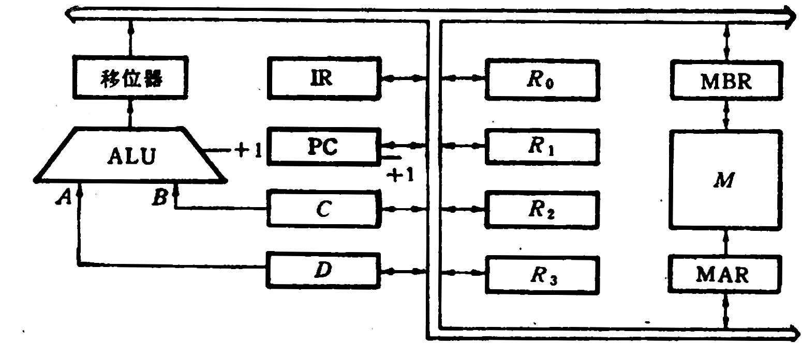
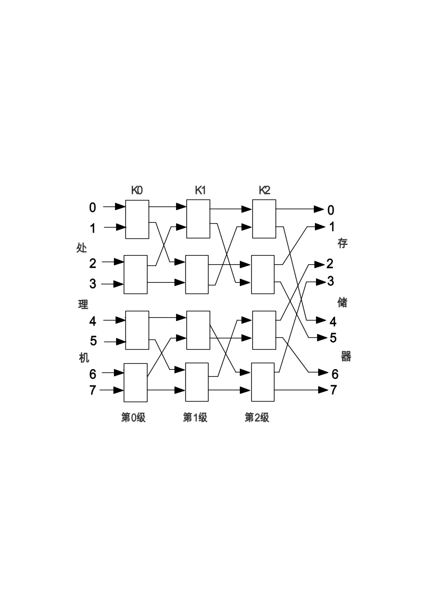

# 计组07计科原题

**三、**设x= +15, y= -13,采用补码输入，用带求补器的原码阵列乘法器求乘积x×y =  ? 并用十进制数乘法进行验证（第一套）

**四、**设存储器容量为32字，字长64位，模块数m  = 8，分别用顺序方式和交叉方式进行组织。存储周期T = 200ns,数据总线宽度为64位，总线周期τ  =  50ns  .问顺序存储器和交叉存储器的带宽各是多少？（第二套）

**六、**某计算机的数据通路如图1所示，其中M—主存，  MBR—主存数据寄存器，  MAR—主存地址寄存器，  R0-R3—通用寄存器，  IR—指令寄存器，    PC—程序计数器（具有自增能力），  C、D--暂存器，    ALU—算术逻辑单元（此处做加法器看待）， 移位器—左移、右移、直通传送。所有双向箭头表示信息可以双向传送。

请按数据通路图画出“ADD（R1），（R2）+”指令的指令周期流程图。该指令的含义是两个数进行求和操作。其中源操作地址在寄存器R1中，目的操作数寻址方式为自增型寄存器间接寻址（先取地址后加1）。

（第二套）

**九、**如图3所示，8个处理机访问8个存储器，通过三级立方体互连网络连接，采用级控方式。其中所有交换开关均为二功能（级控仪号为“0”时直通，为“1”时交换）。若级控信号为：①K0  K1  K2＝100  ②K0  K1  K2＝011，请列表说明两种情况下，对应8个处理机而实际连通的8个存储器的排列次序。

（第二套）

**四.**假设机器字长16位，主存容量为128K字节，指令字长度为16位或32位，共有128条指令，设计计算机指令格式，要求有直接、立即数、相对、基值、间接、变址六种寻址方式。

（第三套）

**四、**已知某16位机的主存采用半导体存贮器，地址码为18位，若使用8K×8位SRAM芯片组成该机所允许的最大主存空间，并选用模块板结构形式。问：

（1）若每个模板为32K×16位，共需几个模块板?

（2）每个模块内共有多少片RAM芯片?

（3）主存共需多少RAM芯片？CPU如何选择模块板？

（第20套）
