# 复习课I

<!-- slide: 1 -->

- 计算机组成原理与体系结构复习课 I

<!-- slide: 2 -->

- 考试三注意
- 1. 能写的尽量写，解答不要留空。
- 2. 做题要仔细，格式要注意，按步骤给分。
- 3. 没有过程只有答案，或者过程明显错误而答案却
- 正确的，整题没分。

<!-- slide: 3 -->

- 第一章  概论

<!-- slide: 4 -->

## Structure - Top Level

- 计算机
- 主存
- 输入输出
- 系统互连
- 外围设备
- 通讯线路
- 中央处理单元
- 计算机

<!-- slide: 5 -->

## Structure - The CPU

- Computer
- Arithmetic
- and
- Login Unit
- Control
- Unit
- Internal CPU
- Interconnection
- Cache
- CPU
- I/O
- Memory
- System
- Bus
- CPU
- 重点！

<!-- slide: 6 -->

- 计算机体系结构的发展
- 冯·诺依曼计算机的主要特点是：
- ▪ 存储程序方式，程序控制；
- ▪ 按地址访问,指令顺序执行；
- ▪ 单元定长的一维线性空间存储器；
- ▪ 使用低级机器语言，数据以二进制表示；
- ▪ 单处理机结构，以运算器为中心。
- 改进后的冯·诺依曼计算机使其从原来的以运算器为中心演变为以存储器为中心。从系统结构上讲，主要是通过各种并行处理手段提高计算机系统性能。
- 重点！

<!-- slide: 7 -->

## 计算机硬件系统

- 以存储器为中心的冯.诺依曼体系结构（又称为普林斯顿体系结构）
- 输入设备
- 输出设备
- 存储器
- 控制器
- 运算器
- 程序
- 数据
- 结果
- 数据
- 结果
- 地址
- 指令
- 控制信号
- 数据线
- 地址线
- 控制线

<!-- slide: 8 -->

## 计算机硬件系统

- 以程序和指令存储器分离的哈佛体系结构
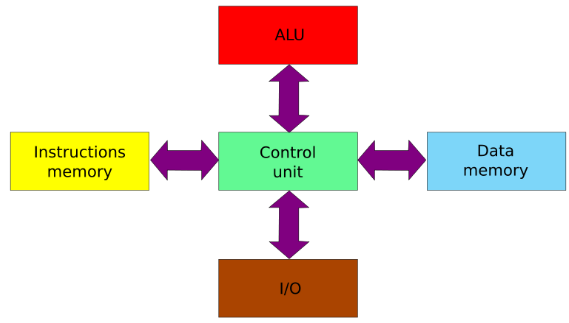

<!-- slide: 9 -->

- •••
- CPU执行时间：表示CPU执行一段程序所占用的CPU时间
- CPI：表示每条指令的周期数。即执行一条指令所需的
- 平均时钟周期数。
- MIPS：每秒百万条指令数。即单位时间内执行的指令数
- MFLOPS：每秒百万次浮点操作次数。
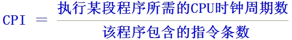

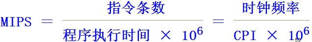
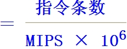
- 二、计算机硬件系统（性能指标）

<!-- slide: 10 -->

- •••
- 2012年研究生入学统考试题
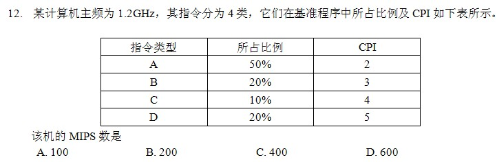
- 二、计算机硬件系统（性能指标）
- 重点！

<!-- slide: 11 -->

## 三、计算机软件系统

- <number>
- 1．系统软件
- 2、应用软件：又称为应用程序，它是用户在各自不同的应用领域根据具体的任务需要所开发编制的各种程序。
  - 如工程设计程序、数据处理程序、自动控制程序、企业管理程序、科学计算程序等等。
- 重点！

<!-- slide: 12 -->

## 1．系统软件

- <number>
- 系统软件是指管理、调度、监视和维护计算机系统软硬件资源的程序集合，使系统资源得到合理调度，确保高效率运行。
- 常用的
- 系统软件
- 2
- 5
- 3
- 4
- 1
- 操作系统
- 语言处理程序
- 数据库管理系统
- 网络管理软件
- 服务性程序
- 重点！

<!-- slide: 13 -->

## 计算机体系结构的分类

- 按指令流与数据流的不同组织方式分：
- 单指令流单数据流（SISD：Single Instruction stream Single Data stream）代表机型是单处理机。
- 单指令流多数据流（SIMD：Single Instruction stream Multiple Data stream）代表机型是向量处理机。
- 多指令流单数据流（MISD：Multiple Instruction stream Single Data stream）从未实现。
- 多指令流多数据流（MIMD：Multiple Instruction stream Multiple Data stream）代表机型是多处理机和机群系统。前者为紧耦合系统，后者为松耦合系统。

<!-- slide: 14 -->

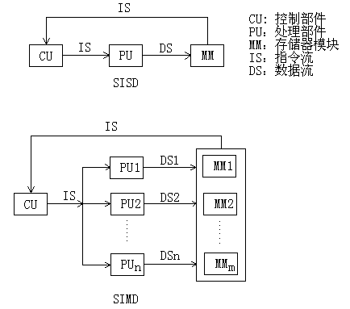
- 重点！

<!-- slide: 15 -->

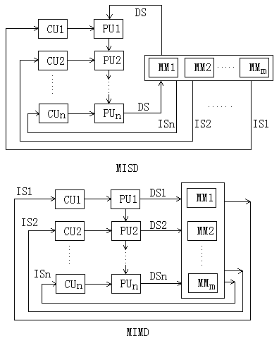

<!-- slide: 16 -->

<!-- slide: 17 -->

- 第二章  运算方法和运算器

<!-- slide: 18 -->

## 2.1  数据与文字的表示方法

- 2.1.1  数值的机器码表示
- ④ 机器数的形式：原码，补码，移码，反码
- ① 码  制： 计算机中表示数的大小和正负的方法。
- ② 机器数(机器码) ：计算机内部编码表示的数，
- ③ 真  值： 机器数原来的数值称为真值；

<!-- slide: 19 -->

## 进位计数制

- <number>
- 例1：（2345.459）10＝2×103＋ 3×102＋ 4×101＋5×100＋ 4×10-1＋ 5×10-2＋ 9×10-3
- 例2：（11011.011）2＝1×24＋ 1×23＋ 0×22＋1×21＋ 1×2-0＋ 0×2-1 ＋ 1×2-2 ＋ 1×2-3=（27.375）10
- 例3：（123.67）8＝1×82＋ 2×81＋ 3×80＋6×8-1＋ 7×8-2=（83.859375）10
- 例如：R＝10，即十进制数。它的每一位上的数码Di只能取0，1，2，……9；各个数码的权为10i，i指示数码所处的位置，个位i＝0，十位i＝1，百位i＝2，依此类推。

<!-- slide: 20 -->

## 常用的几种数制的对应关系

- <number>

| 十进制 | 二进制 | 八进制 | 十六进制 | 十进制 | 二进制 | 八进制 | 十六 进制 |
|---|---|---|---|---|---|---|---|
| 0 | 0000 | 0 | 0 | 8 | 1000 | 10 | 8 |
| 1 | 0001 | 1 | 1 | 9 | 1001 | 11 | 9 |
| 2 | 0010 | 2 | 2 | 10 | 1010 | 12 | A |
| 3 | 0011 | 3 | 3 | 11 | 1011 | 13 | B |
| 4 | 0100 | 4 | 4 | 12 | 1100 | 14 | C |
| 5 | 0101 | 5 | 5 | 13 | 1101 | 15 | D |
| 6 | 0110 | 6 | 6 | 14 | 1110 | 16 | E |
| 7 | 0111 | 7 | 7 | 15 | 1111 | 17 | F |
|  |  |  |  | 16 | 10000 | 20 | 10 |

<!-- slide: 21 -->

## 二、八、十六进制转换为十进制

- <number>
- 转换方法：加权求和
  - 例：（5AC.E6）16= 5×162＋ 10×161 ＋12×160 ＋14×16－1＋ 6×16－2 ＝（1452.8984375）10
- 十进制（Decimal）、二进制（Binary）、八进制（Octal）、十六进制（Hexadecimal）数分别用D、B、O、H来标志
- 例如：（1011）2→1011B
  - （123.45）10→123.45D→ 123.45
  - （2B.D）16 → 2B.DH → 43.812510 → 53.64O
- 重点！

<!-- slide: 22 -->

## 思考：八、十六进制如何转化为二进制？

- <number>
- 八进制→二进制：将每位八进制数展开为3位二进制数，最高位和最低位的0可以略去。
- 十六进制→二进制：将每位十六进制数展开为4位二进制数，最高位和最低位的0可以略去。
- 例：（765.23）8=（               ?              ）2
- 例：（765.23）16=  （                ?                     ）2
- 111 110 101.010 011
- 111 0110 0101.0010 0011

<!-- slide: 23 -->

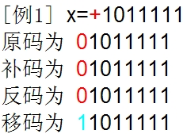
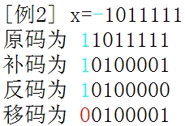
- 数值的机器码表示
- 机器数的形式：原码，补码，移码，反码 。
- 机器数： 计算机内部编码表示的数，称为机 器数(机器码)；
- 真  值： 机器数原来的数值称为真值；

<!-- slide: 24 -->

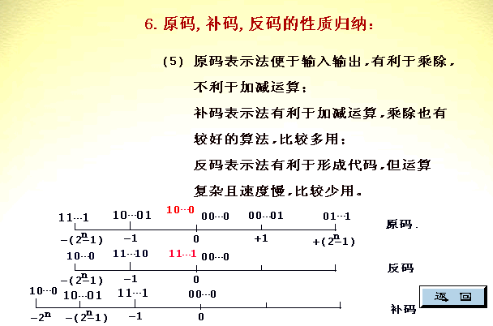
- 【例1 】以定点整数为例,用数轴形式说明原码、补码、反码表示范围和可能的数码组合
- 2.1.1  数值的机器码表示

<!-- slide: 25 -->

- ① 用n位二进制数表示整数补码(n包括一位符号)，
- 任意一个数X的补码，等于该数加上其模数M，    即   [X]补=X+M  (Mod M)
- 则:
- 补码的定义
- ② 用n位二进制表示小数的补码
- 即：  [X]补=2+X    (mod 2)
- 2、补码表示法

<!-- slide: 26 -->

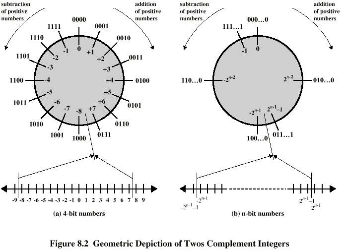
- 补码的几何描述
- 重点！

<!-- slide: 27 -->

- 【例2.3】 已知[X]补=010011011，求X=?
- 解: X =  0×28 + 1×27 +0×26 +0×25 + 1×24
- +1×23 +0×22 +1×21 +1×20
- =  155
- 【例2.4】 已知[X]补=110011011，求X=?
- 解: X = -1×28 + 1×27 +0×26 +0×25 + 1×24
- +1×23 +0×22 +1×21 +1×20
- = -256+155
- = -101
- 重点！

<!-- slide: 28 -->

## 补码的算术移位

- <number>
- 算术左移：符号位不变，高位移出，低位补0。
  - 为保证补码算术左移时不发生溢出，移位的数据最高有效位必须与符号位相同。
  - 在不发生溢出的前提下，用硬件实现补码的算术左移时，直接将数据最高有效位移入符号位，不会改变机器数的符号。
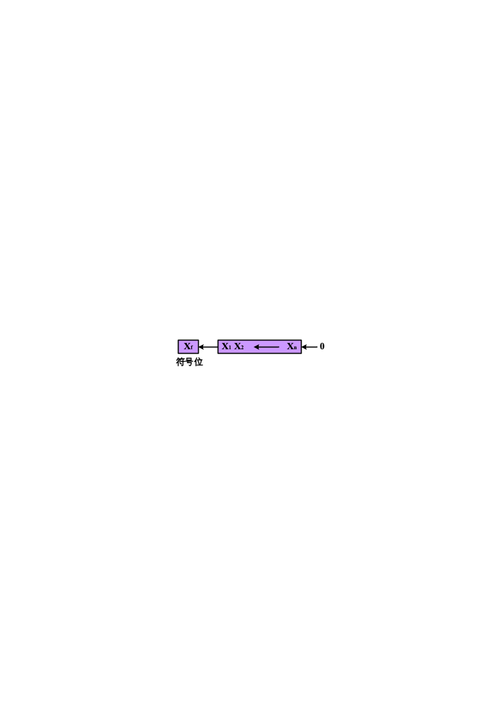
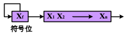
- 算术右移：符号位不变，低位移出，高位正数补0，负数补1，即高位补符号位。
- 重点！

<!-- slide: 29 -->

## 补码的算术移位举例

- <number>
- 例：设X＝0.1001,Y＝－0.0101，求
  - [X]补＝   ？
  - [2X]补＝ ？
  - [X/2]补＝？
  - [Y]补＝   ？
  - [2Y]补＝ ？
  - [Y/2]补＝？
- 0.1001
- 1.0010（溢出）
- 0.0100
- 1.1011
- 1.0110
- 1.1101
- 重点！

<!-- slide: 30 -->

## 二、汉字编码

- <number>
- 对于汉字，计算机的处理技术必须解决三个问题：汉字输入、汉字储存与交换、汉字输出，它们分别对应着汉字输入码、交换码、内码、字形码的概念。
- 1、汉字输入码
- 汉字输入码也称外码，是为了将汉字输入计算机而编制的代码，是代表某一汉字的一串键盘符号。
  - 汉字输入码种类：
    - 数字编码：如区位码、国标码、电报码等。
    - 拼音编码：如全拼码、双拼码、简拼码等。
    - 字形编码：如王码五笔、郑码、大众码等。
    - 音形编码：如表形码、钱码、智能ABC等。

<!-- slide: 31 -->

## 二、汉字编码

- <number>
- 汉字交换码是指不同的具有汉字处理功能的计算机系统之间在交换汉字信息时所使用的代码标准。
- 目前国内计算机系统所采用的标准信息处理交换码，是基于1980年制定的国家标准《信息交换用汉字编码字符集·基本集》（GB2312-80）修订的国标码。
- 该字符集共收录了6763个汉字和682个图形符号。6763个汉字按其使用频率和用途，又可分为一级常用汉字3755个，二级次常用汉字3008个。其中一级汉字按拼音字母顺序排列，二级汉字按偏旁部首排列。
- 采用两个字节对每个汉字进行编码，每个字节各取七位，这样可对128×128＝16384个字符进行编码。

<!-- slide: 32 -->

## 二、汉字编码

- <number>
- 两种典型的数字编码：
  - 区位码：是将国家标准局公布的6763个两级汉字分为94个区，每个区分94位，实际上把汉字表示成二维数组，每个汉字在数组中的下标就是区位码。例如“中”字位于54区48位，“中”字的区位码即为“5448”。
  - 国标码：将区位码加2020H，占用两个字节。例如“中”字的国标码为区位码5448的区码和位码转化为16进制，为3630H，再加2020H得国标码5650H。

<!-- slide: 33 -->

## 二、汉字编码

- <number>
- 2、汉字内码
- 汉字内码是用于汉字信息的存储、交换、检索等操作的机内代码，一般采用两个字节表示。
- 汉字可以通过不同的输入法输入，但其内码在计算机中是唯一的。
- 英文字符的机内代码是七位的ASCII码，当用一个字节表示时，最高位为“0”。为了与英文字符能相互区别，汉字机内代码中两个字节的最高位均规定为“1”。
- 机内码等于汉字国标码加上8080H。例如“中”字的机内码为D6D0H。

<!-- slide: 34 -->

## 二、汉字编码

- <number>
- 字符串
  - 由字符的ASCII码或者文字的Unicode编码组成，按顺序存放在内存或寄存器中。每个ASCII码字符占1个字节，每个Unicode编码占用2个字节

- 重点！

<!-- slide: 35 -->

## 二、汉字编码

- <number>
- 3、汉字字形码
- 汉字字形码是将汉字字形经过点阵数字化后形成的一串二进制数，用于汉字的显示和打印。
- 根据汉字输出的要求不同，点阵有以下几种：
  - 简易型汉字：16×16， 32字节/汉字
  - 普通型汉字：24×24， 72字节/汉字
  - 提高型汉字：32×32，128字节/汉字。
- 汉字字库：
- 将所有汉字的字模点阵代码
- 按内码顺序集中起来，构成
- 了汉字库。
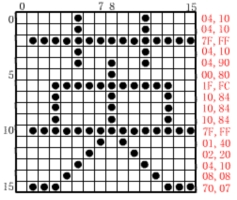
- 重点！

<!-- slide: 36 -->

- <number>
- 汉字输入码
- 汉字交换码（国标码）
- 汉字输入法程序
- 汉字字形码
- 字形检索程序
- 汉字显示
- 汉字打印
- 汉字内码
- ＋8080H
- 重点！

<!-- slide: 37 -->

## 校验码

- <number>
- 1、校验码定义：是一种具有发现某些错误或自动改正错误能力的一种数据编码方法。
- 2、校验码目的：用于检查或纠正在存取、读写和传送数据的过程中可能出现的错误。
- 3、校验码的基本思想：“冗余校验”，即通过在有效信息代码的基础上，添加一些冗余位来构成整个校验码。
- 4、校验码的构成：有效信息＋校验位（由有效信息产生的冗余位）

<!-- slide: 38 -->

## 校验码

- <number>
- 校验过程：
- 有效
- 信息
- 校验码
- 编码器
- 校
- 验
- 码
- 校验位
- 校
- 验
- 码
- 发送
- /写
- /存
- 接收
- /读
- /取
- 有
- 效
- 信
- 息
- 校
- 验
- 位
- 有
- 效
- 信
- 息
- 校
- 验
- 位
- 校验码
- 译码器
- 正确
- 错误
- 输出

<!-- slide: 39 -->

## 奇偶校验码

- <number>
- 在有效信息位的前面或者后面添加一位奇（偶）校验位就组成了奇（偶）校验码。
- 奇（偶）校验码的编码和译码在硬件上通常采用异或非门（异或门）实现。
  - 编码
    - 奇校验位的取值应该使整个奇校验码中“1”的个数为奇数，偶校验位的取值应该使整个偶校验码中“1”的个数为偶数。
    - 假设在发送端，要发送七位ASCII码（B6 B5 B4 B3 B2 B1 B0），在ASCII码前面添加一位奇校验位P奇或偶校验位P偶变为一个字节的奇偶校验码，则它们的生成表达式为

- 重点！

<!-- slide: 40 -->

## 奇偶校验码

- <number>
  - 译码
    - 在接收端，必须检验接收到的校验码信息的奇偶性，对于奇校验码，校验码中“1”的个数应该为奇数，否则出错；对于偶校验码，校验码中“1”的个数应该为偶数，否则出错。设E奇为奇校验码出错信号，E偶为偶校验码出错信号，为1出错，为0正确，
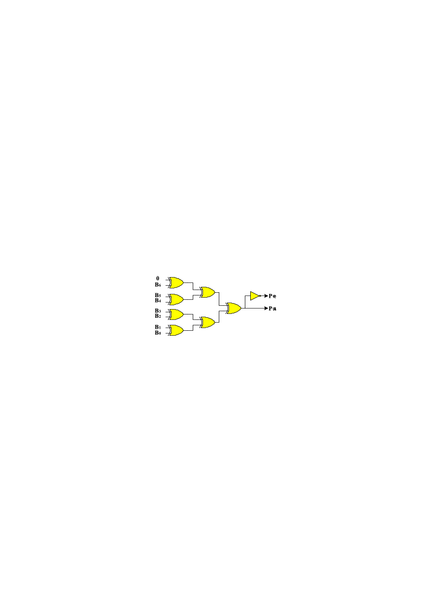
- 奇偶校验的编码电路
- 例如：
- 字符“A”的ASCII码为41H，奇校验码为C1H，偶校验码为41H。

<!-- slide: 41 -->

## 奇偶校验码

- <number>
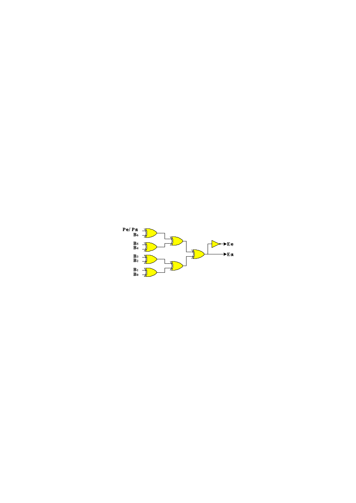
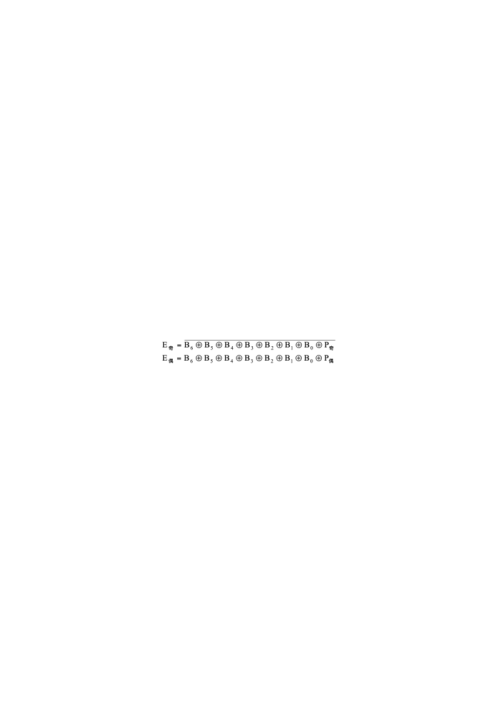
- 奇偶校验码的表达式：
- 奇偶校验的译码电路

<!-- slide: 42 -->

## 加法器进位链（74181）

- C1=Y0+X0C0
- C2=Y1+X1C1 =Y1+X1Y0 +X1X0C0
- C3=Y2+X2C2=Y2+X2Y1 +X2X1Y0 +X2X1X0C0
- C4=Y3+X3C3=Y3+X3Y2 +X3X2Y1 +X3X2X1Y0 +X3X2X1X0C0
- （2.30）
- 串行                    并行
- 令Yn= An·Bn     Xn= (An⊕Bn)
- Cn+1=Yn+XnCn
- Ci+1=Ai·Bi+(Ai⊕Bi)·Ci
- 令G= Y3+X3Y2 +X3X2Y1 +X3X2X1Y0
- 称G为4位片74181的进位发生输出。
- 令P= X3X2X1X0
- 称P为4位片74181的进位传送输出。
- Cn+4=G+PCn

<!-- slide: 43 -->

- 4．先行进位部件74182 CLA
- （1）74182 CLA进位逻辑式
- P*=P3 P2P1P0
- Cn+x=G0+P0Cn
- Cn+y=G1+P1G0+P1P0Cn
- Cn+z=G2+P2G1+P2P1G0 +P2 P1P0Cn
- G*=G3+P3G2+P3P2G1 +P3 P2P1G0
- C4=G0+P0C0
- C8=G1+P1C4=G1+P1G0+P1P0C0
- C12=G2+P2C8=G2+P2G1+P2P1G0+P2P1P0C0
- C16=G3+P3C12=G3+P3G2+P3P2G1+P3P2P1G0+P3P2P1P0C0=G*+P*C0
- 写成一般表达式

<!-- slide: 44 -->

- （2）74182 CLA与74181 ALU的配套使用
- 例子：由2片74182和8片74181组成的32位ALU
- P*
- G
- P
- C0
- G
- P
- C0
- G
- P
- C0
- G
- P
- C0
- CLA(74182)
- Cn+z
- Cn+y
- Cn+x
- G*
- P3 G3
- P2 G2
- P1 G1
- P0 G0
- P*
- G
- P
- C0
- G
- P
- C0
- G
- P
- C0
- G
- P
- C0
- CLA(74182)
- Cn+z
- Cn+y
- Cn+x
- G*
- Cout
- Cin
- 图2.22 用两个16位全先行进位逻辑级联组成的32位ALU
- 重点！

<!-- slide: 45 -->

## 2.5 定点运算器的组成与结构

- 2．计算机的基本逻辑运算
- 按位求反，即求反运算使1变0，0变1。
- 若数x= x0x1x2…xn，则                                   。
- 2. 5. 1 逻辑运算
- 1．逻辑数
- 通常用“1”表示逻辑真，用“0”表示逻辑假的非数值数据。
- （1）逻辑非（    ）运算
- 对两个数进行逻辑加，就是按位求它们的“或”，
- 若x= x0x1x2…xn，y= y0y1y2…yn，x∨y=Z= Z0Z1Z2…Zn，则     Zi=xi∨yi 　(i=0，1，2，…，n)。
- （2）逻辑加（∨或+）运算

<!-- slide: 46 -->

## 2.5.1 逻辑运算

- （3）逻辑乘（∧或 · ）运算
- 对两数进行逻辑乘，就是按位求它们的“与”。
- 若x= x0x1x2…xn，y= y0y1y2…yn，若x∧y=Z=Z0Z1Z2…Zn，
- 则Zi=xi∧yi 　(i=0，1，2，…n)。
- (4) 逻辑异（⊕）运算
- 若x= x0x1x2…xn，y= y0y1y2…yn，x⊕y=Z= Z0Z1Z2…Zn，
- 则 Zi=xi⊕yi 　(i=0，1，2，…n)。
- 对两数进行逻辑异，就是按位求它们的模2加。
- 解：   ＝0100  x∨y＝1111   x∧y＝0001   x⊕y＝1110
- 【例2.29】 设两数x=1011，y=0101，求   ，x∨y，x∧y，x⊕y。
- 2．计算机的基本逻辑运算
- 重点！

<!-- slide: 47 -->

## 2.5.1 逻辑运算

- 3．逻辑运算的特点
- ① 按位进行，各位的结果互不牵连；所以无借位，
- 进位，溢出等问题；
- ③ 每一位都可看成一个逻辑变量。 所以无符号位，
- 数值位，阶码和尾数的区分。
- ② 运算简单；

<!-- slide: 48 -->

<!-- slide: 49 -->

- 第三章   存储器

<!-- slide: 50 -->

## 计算机存储系统中的存储器分类

- <number>
- （4）按信息的可保存性分类
  - 永久记忆的存储器：又称非易失性存储器，在断电后还能保存信息（辅存、ROM）
  - 非永久记忆的存储器：又称易失性存储器，在断电后信息丢失（主存中的RAM）
- （5）按在计算机系统中的作用分类
  - 主存储器：又称内存，为主机的一部分，用于存放系统当前正在执行的数据和程序，属于临时存储器。
  - 辅助存储器：又称外存，为外部设备，用于存放暂不用的数据和程序，属于永久存储器。
- CPU
- 内存储器
- 外存储器
- 半导体存储器
- 磁/光介质存储器

<!-- slide: 51 -->

## 一、随机读写存储器RAM

- <number>
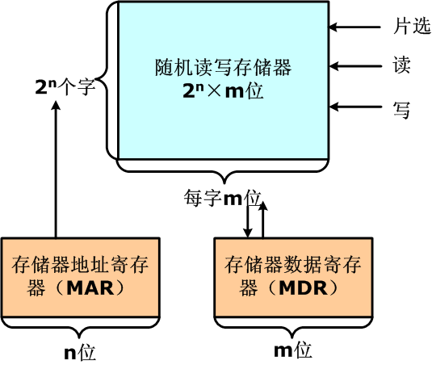

<!-- slide: 52 -->

## 2114 SRAM存储器

- <number>
- 1K×4位
- 2114
- 地址线10根
- 数据线4根
- A9～A0
- D3～D0
- CS
- WE
- 片选线
- 写使能
- 重点！

<!-- slide: 53 -->

## SRAM（静态RAM）的特点

- <number>
- 易失性存储器，CPU可以随机访问。
- 使用双稳态触发器表示0和1代码，利用半导体互锁机制存储信息，结构复杂，功耗大。
- 电源不掉电的情况下，信息稳定保持（静态），无需定时刷新。
- 存取速度快，集成度低（容量小），价格高，。
- 常用作寄存器和高速缓冲存储器Cache。
- 重点！

<!-- slide: 54 -->

## SRAM存储位元

- <number>
- “1” 状态：T1截止，T2导通
- “0”状态： T2截止，T1导通
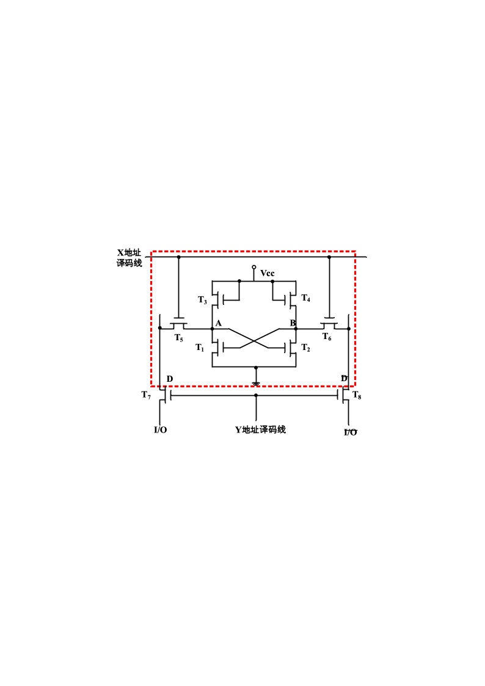
- 六管MOS静态存储器结构

<!-- slide: 55 -->

## DRAM（动态RAM）的特点

- <number>
- 易失性存储器，CPU可以随机访问。
- 使用半导体器件中分布电容上有无电荷来表示0和1代码，结构简单，功耗小。
- 电源不掉电的情况下，信息也会丢失，因此需要不断刷新。
- 存取速度慢，集成度高（容量大），价格低。
- 常用作内存储器（主存）。
- 重点！

<!-- slide: 56 -->

## DRAM存储位元

- <number>
- “1”状态：电容C上有电荷
- “0”状态：电容C上无电荷
- 再生：读出后信息可能被破坏，需要重写。
- 刷新：经过一段时间后，信息可能丢失，需要重写。
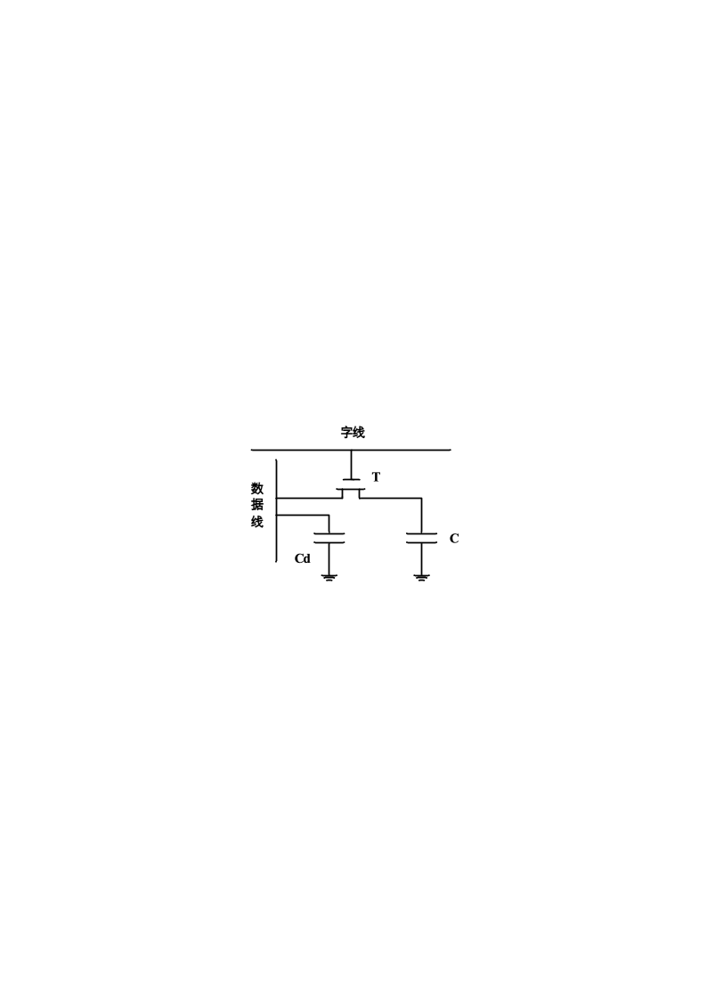
- 单管MOS动态存储器结构

<!-- slide: 57 -->

## SRAM和DRAM的对比

- <number>

| 比较内容 | SRAM | DRAM |
|---|---|---|
| 存储信息0和1的方式 | 双稳态触发器 | 极间电容上的电荷 |
| 电源不掉电时 | 信息稳定 | 信息会丢失 |
| 刷新 | 不需要 | 需要 |
| 集成度 | 低 | 高 |
| 容量 | 小 | 大 |
| 价格 | 高 | 低 |
| 速度 | 快 | 慢 |
| 适用场合 | Cache | 主存 |

<!-- slide: 58 -->

## 几种非易失性存储器的比较

- <number>

| 存储器 | 类别 | 擦除方式 | 能否单字节修改 | 写机制 |
|---|---|---|---|---|
| MROM | 只读 | 不允许 | 否 | 掩膜位写 |
| PROM | 写一次读多次 | 不允许 | 否 | 电信号 |
| EPROM | 写多次读多次 | 紫外线擦除，脱机改写 | 否 | 电信号 |
| E2PROM | 写多次读多次 | 电擦除，在线改写 | 能 | 电信号 |
| Flash Memory | 写多次读多次 | 电擦除，在线改写 | 否 | 电信号 |

- 重点！

<!-- slide: 59 -->

## 三、高性能的主存储器

- <number>
- FPM RAM， 快速页模式动态存储器
- CDRAM，带Cache的DRAM
- SDRAM (Synchronous Dynamic RAM)，也称“同步DRAM”。
- RDRAM (Rambus DRAM）
- DDR SDRAM（双倍速率SDRAM），简称DDR。

<!-- slide: 60 -->

- 1） FPM DRAM
- FPM DRAM：快速页模式动态存储器.
- 根据程序的局部性原理来实现。
- 页是指一个唯一的行地址和该行中所有的列地址确定的存储单元总和。
- 快速页模式允许在选定的行中对该行的每一个列地址进行连续的读/写操作。
- 重点！

<!-- slide: 61 -->

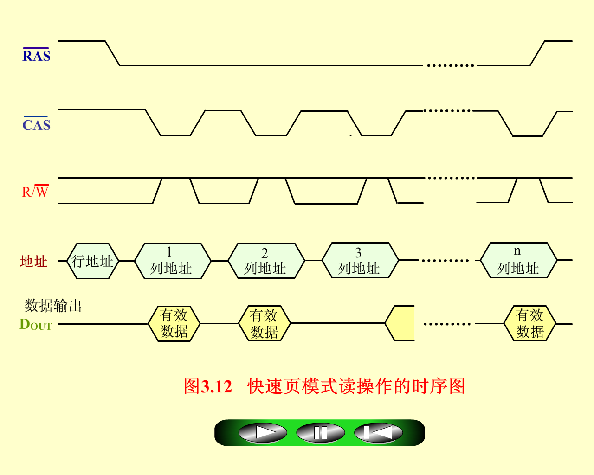

<!-- slide: 62 -->

## 比较：DRAM的读/写过程

- <number>
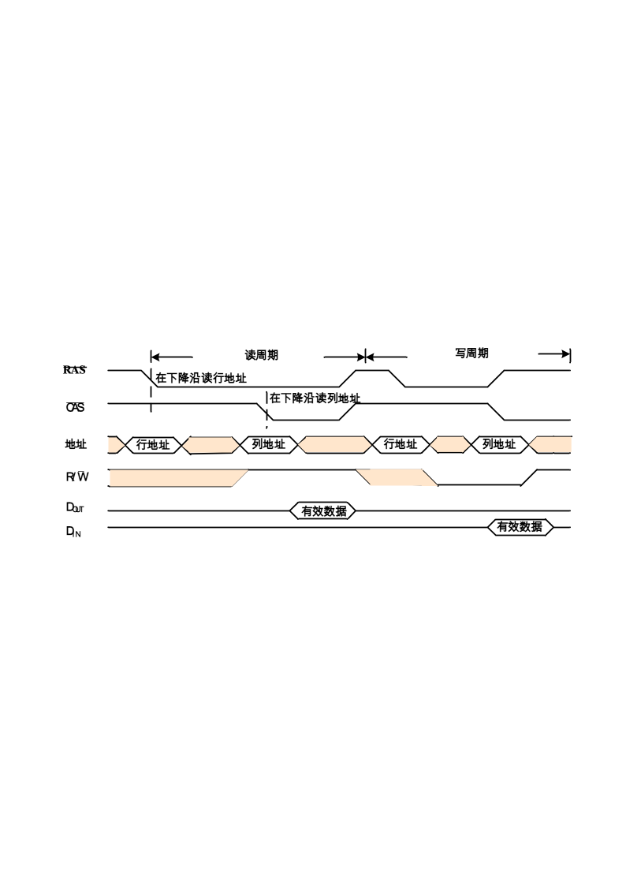

<!-- slide: 63 -->

- CDRAM：带高速缓冲存储器（cache）的动态存储器，在通常的DRAM芯片内又集成了一个小容量的SRAM，从而使DRAM芯片的性能得到显著改进。
- 如果连续的地址高11位相同，意味着属于同一行地址，那么连续变动的9位列地址就会使SRAM中相应位组连续读出，这称为猝发式读取。
- 其它优点：1）SRAM读出的同时可以对DRAM进行刷新；2）允许在写操作完成的同时启动同一行的读操作。
- 重点！

<!-- slide: 64 -->

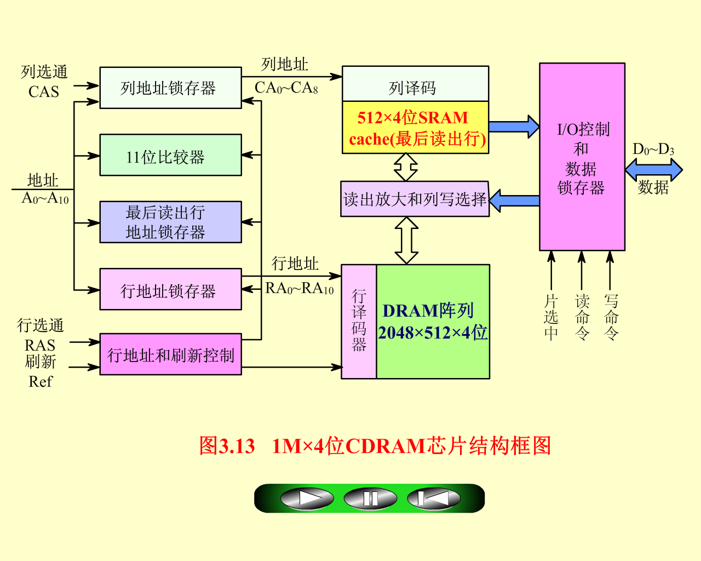

<!-- slide: 65 -->

- SDRAM：同步型动态存储器。
- 计算机系统中的CPU使用的是系统时钟，SDRAM的操作要求与系统时钟相同步.
- 在系统时钟的控制下从CPU获得地址、数据和控制信息。
- 换句话说，它与CPU的数据交换同步于外部的系统时钟信号，并且以CPU/存储器总线的最高速度运行，而不需要插入等待状态。
- SDRAM的特殊之处：
- 模式寄存器及相关控制逻辑。

<!-- slide: 66 -->

## 3.5 并行存储器

- 3.5.1 双端口存储器
- 3.5.2 多模块交叉存储器

<!-- slide: 67 -->

## 3.5.1 双端口存储器

- 定义：高速工作的存储器，同一个存储体左右两个端口各自有相互独立的读写控制电路（地址寄存器ARL、ARR和数据寄存器DRL 、DRR ）可以分别进行操作。
- 图3.28 双端口存储器框图
- ARL
- DRL
- 读写电路L
- 译码器L
- 存 储 体
- 译码器R
- DRR
- 读写电路R
- ARR
- 判别逻辑
- AB
- AB
- DB
- DB
- CB
- CB
- 重点！

<!-- slide: 68 -->

## 二、多体交叉存储器

- <number>
- 特点：通过改进主存的组织方式，在不改变存储器存取周期的情况下，提高存储器的带宽。
- 结构特点：多体交叉存储器由M个的存储体（或称存储模块）组成，每个存储体有相同的容量和存取速度，又有各自独立的地址寄存器、地址译码器、读写电路和驱动电路。
- 编址方法：交叉编址，即任何两个相邻地址的物理单元不属于同一个存储体，一般在相邻的存储体中；同一个存储体内的地址都是不连续的。
- 重点！

<!-- slide: 69 -->

## 顺序编址

- <number>
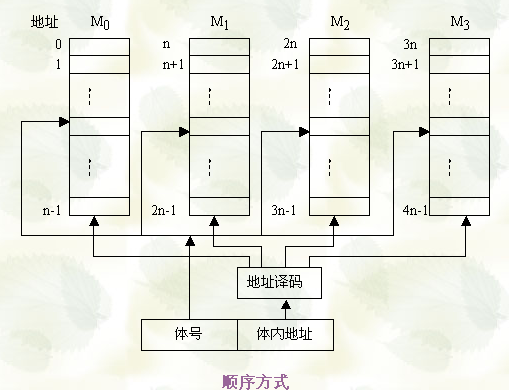

<!-- slide: 70 -->

- 模块板容量：16KB，板内地址码 A13~A0
- （1） 顺序方式
- A15A14 经译码产生选板信号。
- 特点：只需要一套电路         （AR，DR和读/写控制）
- 带宽仅为       ，T－存储周期

- 0
- 1
- 2
- …
- 16383
- 16384
- 16385
- 16386
- …
- 32767
- 32768
- 32769
- 32770
- …
- 49151
- 49152
- 49153
- 49154
- …
- 65535
- 模块号
- 15
- 14
- 13
- 0
- 数据寄存器
- DB (8位)
- 图3.29　顺序方式
- 内存地址
- M1
- M0
- M2
- M3

<!-- slide: 71 -->

## 交叉编址

- <number>
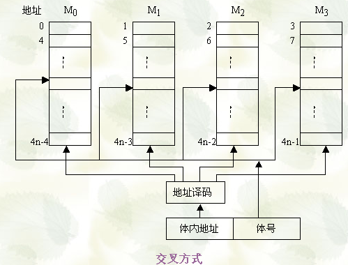

<!-- slide: 72 -->

## (2)交叉方式

- 模m交叉编址（m=2n，n为正整数）
- AMj＝m×i＋j
- 字
- AR0
- 0
- 4
- …
- 4i+0
- AR1
- 1
- 5
- …
- 4i+1
- AR2
- 2
- 6
- …
- 4i+2
- AR3
- 3
- 7
- …
- 4i+3
- 模块号
- 15
- 2
- 1
- 0
- 内存地址
- AB
- …
- …
- …
- …
- 65532
- 65533
- 65534
- 65535
- M1
- M2
- M3
- M0
- DR0
- DR1
- DR2
- DR3
- DB（8位）
- 图3.30　交叉方式
- i＝0,1…（L－1）是单模块的单元顺序号；
- j＝0,1…（m－1）是模块的编号。
- 特点：
- ①连续的存储单元依次   分布在相邻模块内。
- ②用硬件的冗余换取速度。

<!-- slide: 73 -->

- <number>
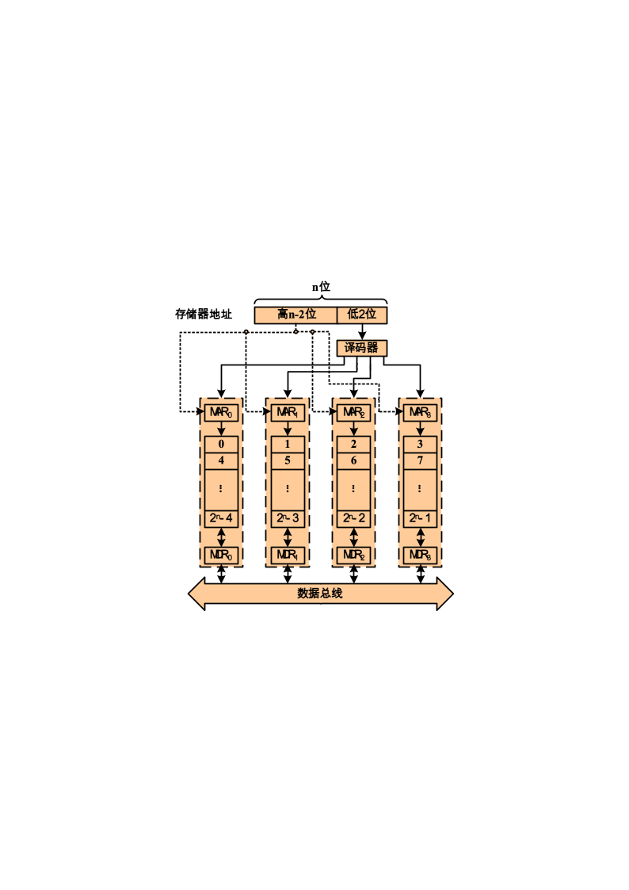
- ①由“存控”部件将CPU或IOP送来的访内地址送到相应模块的地址寄存器MARj 。
- ②启动存储器模块进行读/写。
- 工作过程：

<!-- slide: 74 -->

## 二、多体交叉存储器

- <number>
- 访问：CPU同时送出的M个地址，只要他们分属于M个存储体，访问就不会冲突；由存储器控制部件控制它们分时使用数据总线进行信息传递。
- 适合采用流水线方式并行存取，虽然每个存储体的存储周期没变，但是当CPU连续访问一个字块时，可以大大提高存储器的带宽。

<!-- slide: 75 -->

- <number>
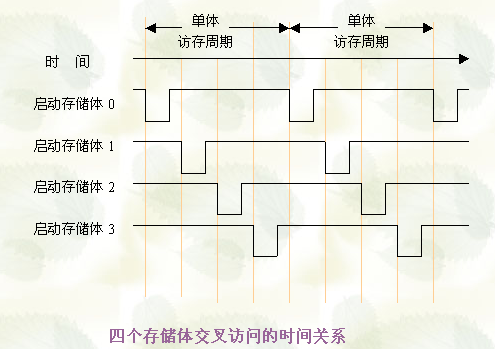

<!-- slide: 76 -->

- 3.6.1 cache基本原理
- 1.cache的功能
- cache是介于CPU和主存之间的高速缓冲存储器，存取速度比主存快。它能高速地向CPU提供指令和数据，加快程序的执行速度。它是为了解决CPU和主存之间速度不匹配而采用的一项重要技术，基于程序运行中的空间局部性和时间局部性特征。
- 辅助硬件
- CPU
- 主存MS
- Cache
- 辅存、主存与Cache的存储层次
- 辅存
- cache
- 重点！

<!-- slide: 77 -->

- 题 3-12： 判断题
- （2）访问存储器的请求是由CPU发出的
- 错误,访问存储器的请求可以由CPU或cache发出.
- （2）CPU可以直接访问所有存储器
- 错误,CPU可以直接访问主存(内存),但不能直接
- 访问辅存(外存).
- （3）cache与主存统一编址，即主存空间的某一部
- 分属于cache.
- 错误，cache独立编址，与主存空间是映射关系。

<!-- slide: 78 -->

## Cache的原理图

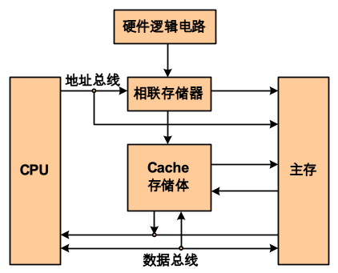
- 相联存储器：
- cache控制逻辑依据地址判断此字当前是否在 cache中：按内容指定方式 进行寻址。

<!-- slide: 79 -->

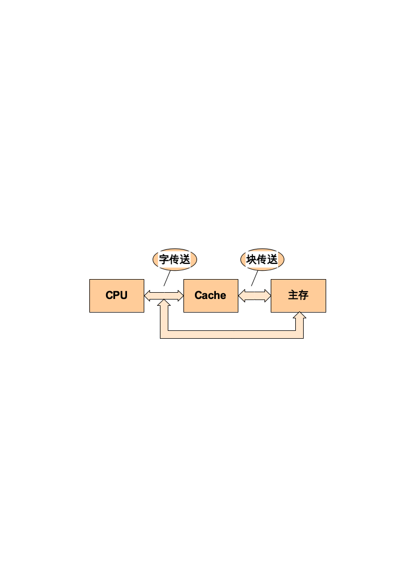
- Cache、主存与CPU的关系
- 一个块由若干定长字组成的。
- 当CPU读取主存中一个字时，便发出此字的内存地址到cache和主存。此时cache控制逻辑依据地址判断此字当前是否在 cache中：若是，此字立即传送给CPU；若非，则用主存读周期把此字从主存读出送到CPU，与此同时，把含有这个字的整个数据块从主存读出送到cache中。由始终管理cache使用情况的硬件逻辑电路来实现替换算法。
- 重点！

<!-- slide: 80 -->

<!-- slide: 81 -->

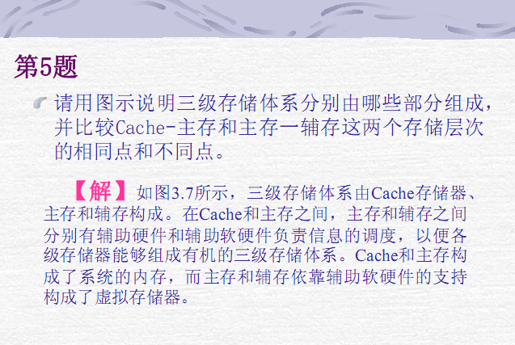

<!-- slide: 82 -->

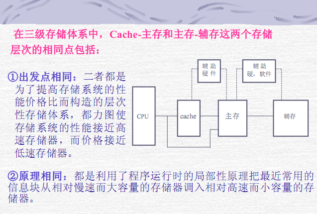
- 重点！

<!-- slide: 83 -->

- 重点！

<!-- slide: 84 -->

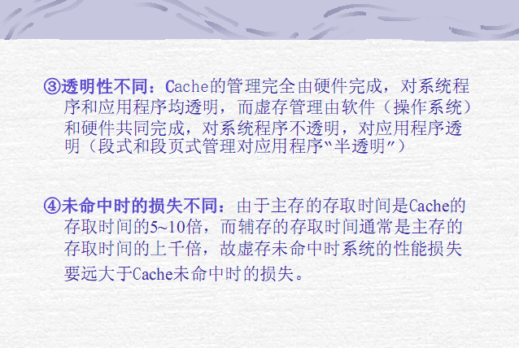

<!-- slide: 85 -->

## 3.5.2 主存与Cache的地址映射及变换

- 地址映射:
- 地址变换：
- 按某种函数（规则）把主存地址定位到Cache中。
- 信息按映射关系装入Cache后，CPU访存时，由主存地址变换成Cache地址的过程。
- 把主存和Cache划分成相同大小的若干数据块。
- Cache的一个数据块，称为“行”。
- 主存的一个数据块，称为“块”。
- cache的透明性：硬件地址变换, cache近似不存在

<!-- slide: 86 -->

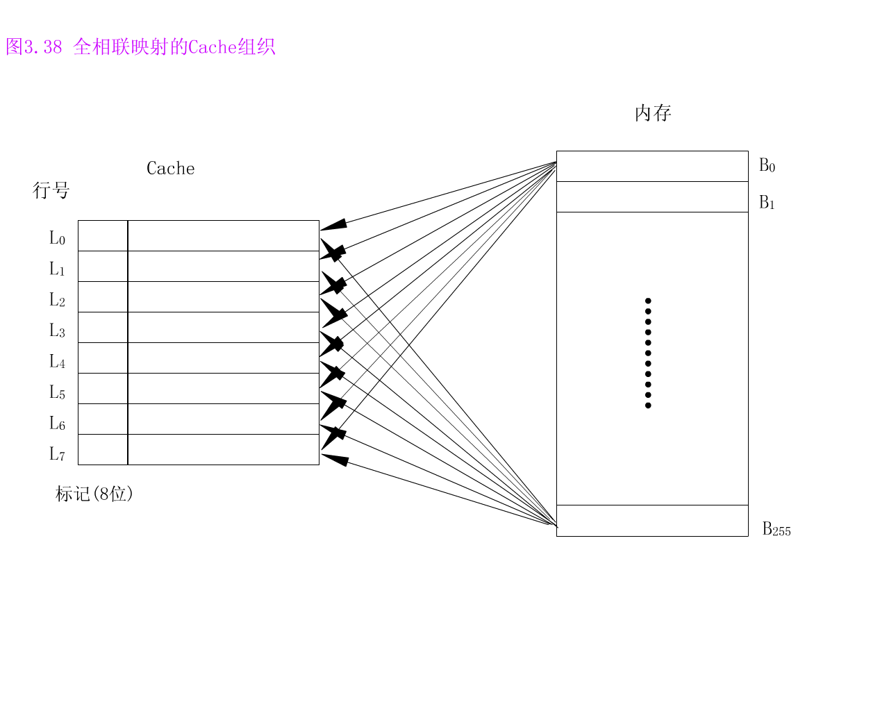
- 1.全相联映射方式
- 主存中一个块的地址与块的内容一起存于cache的行中，其中块地址存于cache行的标记部分中。

<!-- slide: 87 -->

## 全相联映射( Associative Mapping )

- <number>
- 全相联：主存中一个块的地址与块的内容一起存于cache的行中，其中块地址存于cache行的标记部分。
- 特点：是多对多的映射关系：对于主存的任何一块均可以映射到Cache的任何一行。
- 优点：机制灵活，命中率高，Cache的行利用率高。
- 缺点：速度较慢，成本较高，比较器电路难于设计和实现。
- 适合于小容量的Cache。

<!-- slide: 88 -->

## (1)  全相联映射Cache的存储格式

- (2) 全相联Cache的检索过程
- 将访存地址的块号与行标记快速比较，若块号命中，则按字地址从Cache中读取一个字；若不命中，则从主存中读取。
- 全部标记用相联存储器来实现，数据存取则用高速RAM实现。
- 块内容
- m 位块地址
- Li
- 标记
- …
- 全相联映射( Associative Mapping )

<!-- slide: 89 -->

- <number>
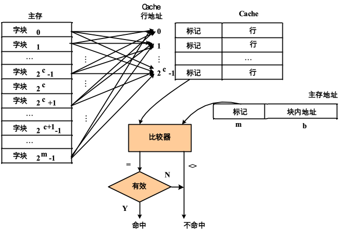

<!-- slide: 90 -->

- 非常重点！

<!-- slide: 91 -->

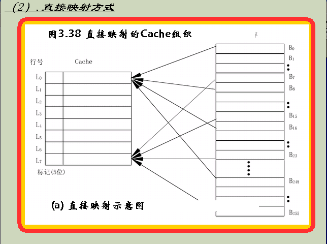
- 主存块号8位     cache行号3位
- 00010111         111

<!-- slide: 92 -->

## 直接映射( Direct  Mapping )

- <number>
- 特点：是一种多对一的映射关系，一个主存块只能拷贝到cache的一个特定行位置上去。
- 主存的第i块一定映射到Cache的第j行：
- 优点：映射方式简单，易实现。
- 缺点：机制不灵活，Cache命中率低。存在Cache有空行而不能存数据块的问题，即造成替换频繁，效率下降。
- 适合需要大容量Cache的场合（更多的行数可以减少冲突的机会）。

<!-- slide: 93 -->

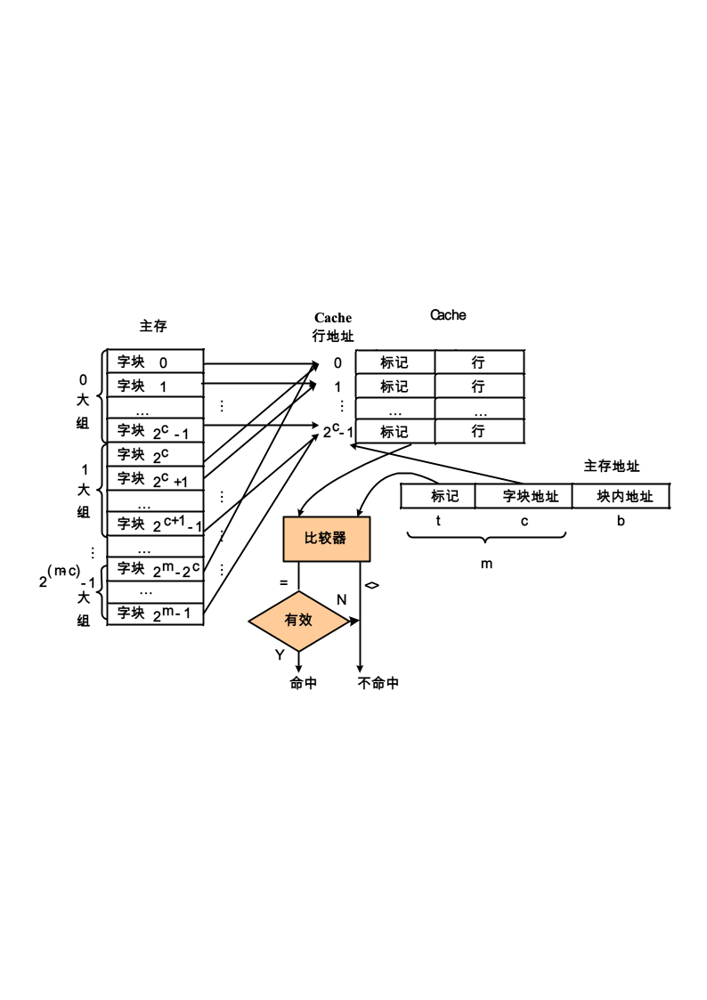
- 直接映射( Direct  Mapping )
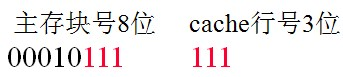

<!-- slide: 94 -->

## (1)  直接映射Cache的存储格式

- 用访存地址中的行号找到该Cache行，再用s-r位与此行的标记比较，若相符则命中，则用行内地址读取所需的字；若不相符，则从主存中读取。
- (2) 直接映射Cache的检索过程
- 块内容
- s - r
- Li
- 标记
- …
- 主存的块地址：S位
- Cache的行地址：r位
- 2、直接映射( Direct  Mapping )

<!-- slide: 95 -->

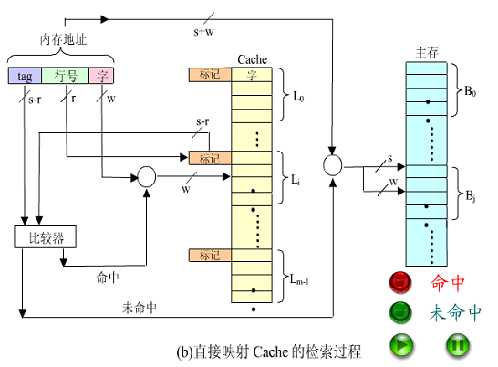
- 非常重点！

<!-- slide: 96 -->

## 3、组相联映射（普遍采用）

- B253
- (a)组相联映射示意图
- B254
- 块号
- 组号
- Cache
- 标记(6位)
- G0
- G1
- G2
- G3
- B255
- B1
- 主存
- ……
- B7
- B2
- B3
- B0
- B4
- B252
- B5
- B6
- 将Cache划分成u个组，每组v行，组内采用全相联，组间采用直接映射的方式。
- m= u×ν
- 组号   g＝j mod u
- B252
- B1
- B2
- B3
- B7
- B253
- B254
- B255
- B0
- B4
- B5
- B6

<!-- slide: 97 -->

## 组相联映射（ Set Associative Mapping ）

- <number>
- 特点：将Cache的行分成2c-r组，每组2r行。主存的字块存放到Cache中的哪个组是固定的，至于映射到该组哪一行是灵活的，即有如下函数关系：
- 其中  0≤k≤2r-1
- 优点：大大增加了映射的灵活性，主存中一块可映射到Cache 的2r块，提高了命中率。每次比较只是进行2r路比较，r 较小时，硬件开销不是很大。
- 组相联映像通常采用2路、4路和8路比较，即取r=1,r=2,r=3。

<!-- slide: 98 -->

## 组相联映射（ Set Associative Mapping ）

- B253
- (a)组相联映射示意图
- B254
- 块号
- 组号
- Cache
- 标记(6位)
- G0
- G1
- G2
- G3
- B255
- B1
- 主存
- ……
- B7
- B2
- B3
- B0
- B4
- B252
- B5
- B6
- 将Cache划分成u个组，每组v行，组内采用全相联，组间采用直接映射的方式。
- m= u×ν
- 组号   g＝j mod u
- B252
- B1
- B2
- B3
- B7
- B253
- B254
- B255
- B0
- B4
- B5
- B6
- 重点！

<!-- slide: 99 -->

## (1) Cache的存储格式

- 主存块号：S位
- d：Cache中 u 组的位数(组地址)
- 2d＝u
- (2) 组相联映射的检索过程
- 以访存地址的d位找到Cache的相应组，再用s-d位与该组v行中的所有标记同时比较，若某一行标记相符则命中，再以行内的w位地址读取相应字；若不命中，则从主存中读取。
- 块内容
- S-d
- 标记
- …
- 组相联时主存地址
- 标记      组号          块内地址

<!-- slide: 100 -->

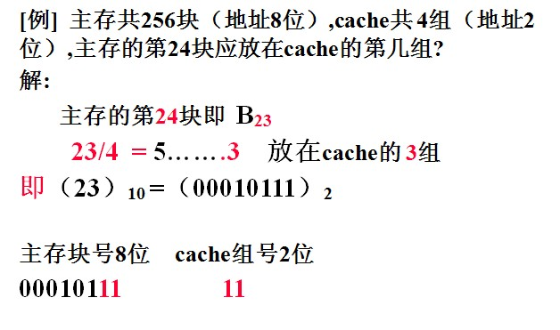

<!-- slide: 101 -->

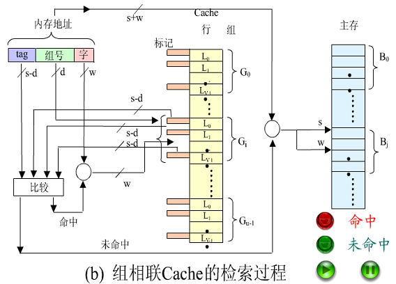
- 非常重点！

<!-- slide: 102 -->

## cache替换算法

- <number>
- 1、随机替换算法
- 2、先进先出算法（FIFO）
  - 先装入Cache的主存块，替换时先被淘汰。
  - 用FIFO队列实现。
- 3、最近最少使用算法（LRU）
  - 该算法统计哪一个Cache行是近段时间使用次数最少的Cache行，需替换时就将它替换出去。
  - LRU替换算法可以通过为每个Cache行设置一个计数器来实现LRU替换算法，Cache每命中一次，命中行的计数器被清零，其他行的计数器加1，需要替换的话，就将计数器值最大的行替换出去。
- 重点！

<!-- slide: 103 -->

- 字存储容量扩展
- 给定的芯片存储容量较小（字数少），不满足设计要求的总存储容量，此时需要用多片给定芯片来扩展字数。三组信号组中给定芯片的地址总线和数据总线公用，控制总线中R/W公用，使能端EN不公用，
- 由地址总线的高位段译码来决定片选信号。所需芯片数仍由（d=设计要求的存储器容量/选择芯片存储器容量）决定。
  - 【例3.3】利用1M×8位的DRAM芯片设计2M×8位的DRAM存储器。（课本P75   图3.10）解： 所需芯片数：d=（2M×8） / （1M×8）=2(片)设计的存储器如图3.10所示。字长位数不变，地址总线A0~A19同时连接到两片DRAM的地址输入端，地址总线最高位有A20、/A20之分：A20作为DRAM1的片选信号，/A20作为DRAM2的片选信号，这两个芯片不会同时工作。
- 重点！

<!-- slide: 104 -->

- 2、字存储容量扩展

<!-- slide: 105 -->

- 题 3-3(1)：16K*8位的DRAM芯片构成64K*32位存储器
- ，求该存储器的组成逻辑框图
- 8×16K
- D0～D31
- D0～D7
- D8～D15
- D16～D23
- D24～D31
- A0～A13
- CS3
- CS2
- CS1
- CS0
- 2:4 译码器
- CS3
- CS2
- CS1
- CS0
- A14
- A15
- 重点！

<!-- slide: 106 -->

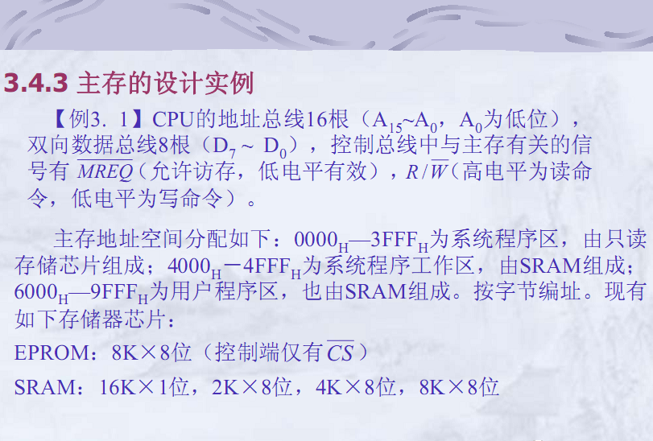

<!-- slide: 107 -->

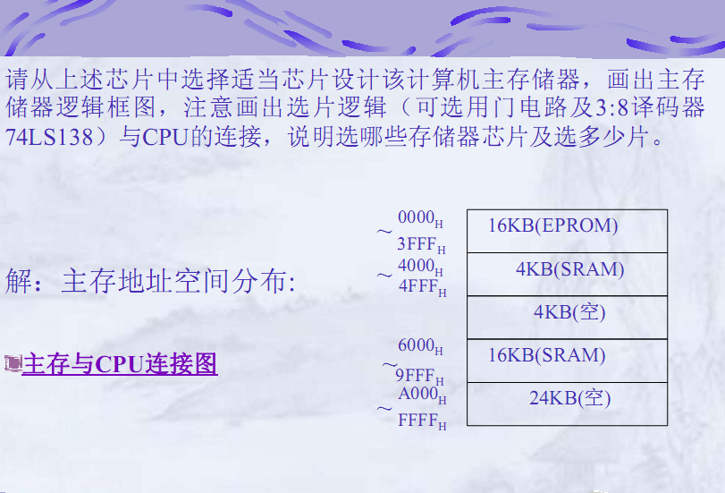
- 重点！

<!-- slide: 108 -->

- A15   A14    A13  A12        A11    A10   ….    A2    A1     A0
- 0 FFF       0        0        0       0              1         1     ….      1       1        1
- 0        0        0       1              1         1      ….     1       1        1
- 0        0        1       0              1         1      ….     1       1        1
- 3 FFF       0        0        1       1              1         1      ….     1       1        1
- 4 FFF       0        1        0       0              1         1      ….     1       1        1
- 5 FFF       0        1        0       1              1         1      ….     1       1        1
- Y0
- Y1
- Y2
- 主存地址空间分布

<!-- slide: 109 -->

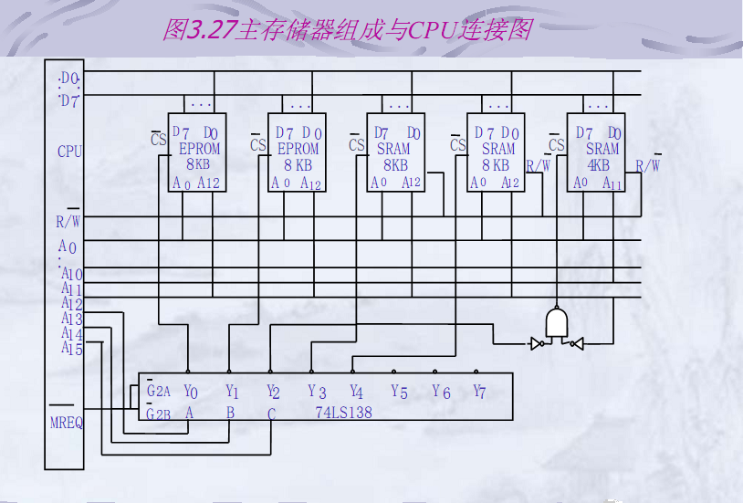

<!-- slide: 110 -->

## 3、Cache的命中率

- <number>
- 命中率指CPU访问主存数据时，命中Cache的次数，占全部访问次数的比率；失效率就指不命中Cache的次数，占全部访问次数的比率。命中率h取决于程序的行为、Cache的容量、组织方式、块大小。
- 在一个程序执行期间，设Nc表示Cache完成存取的总次数，Nm表示主存完成存取的总次数，则命中率：
- 若tc表示Cache的访问时间，tm表示主存的访问时间，则Cache/主存系统的平均访问时间ta为：

<!-- slide: 111 -->

- 设                表示主存慢于cache的倍率,  e表示访问效率，
- ta 表示平均访问周期,    则有:

- 式中                     ( r=5~10为宜)

- 为提高访问效率，命中率h越接近1越好，r值以5—10为宜，不宜太大。命中率h与程序的行为、cache的容量、组织方式、块的大小有关。

- Cache/主存系统的访问效率e:

<!-- slide: 112 -->

- 【例5】CPU执行一段程序时，cache完成存取的次数为1900次，主存完成存取的次数为100次，已知cache存取周期为50ns，主存存取周期为250ns，求cache/主存系统的效率和平均访问时间。
- 【解】

- 平均周期ta
- 访问效率e
- 命中率h
- 主存慢于cache的倍率 r
- 重点！

<!-- slide: 113 -->

- 虚实地址的变换过程（页式）
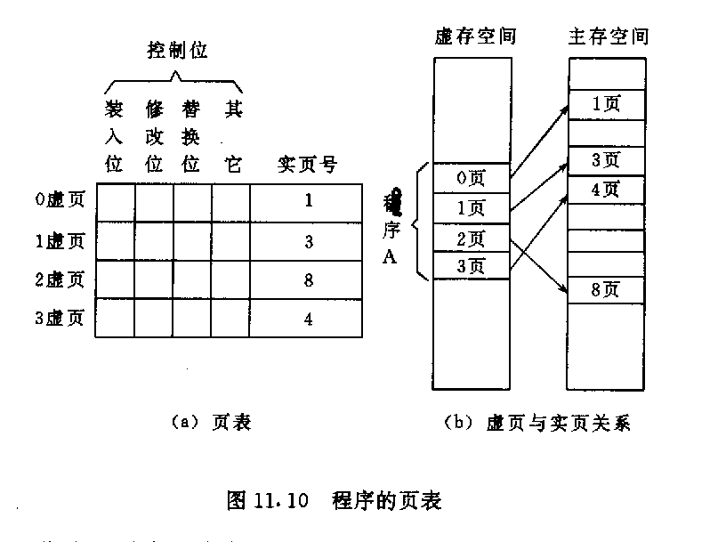

<!-- slide: 114 -->

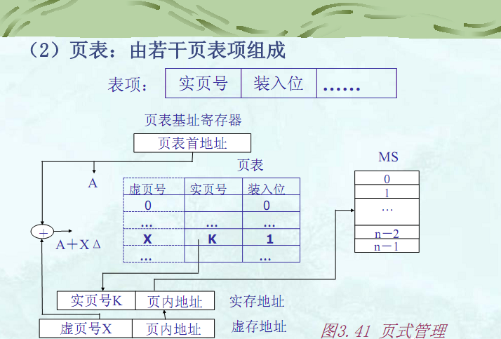

<!-- slide: 115 -->

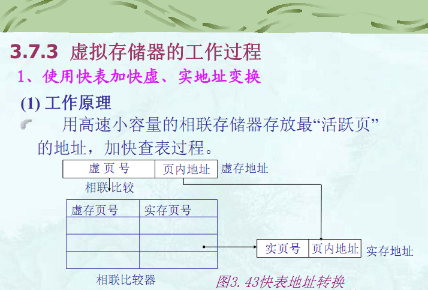

<!-- slide: 116 -->

## 转换后援缓冲器(TLB)/快表

- 由于页表通常在主存中，因而即使逻辑页已经在主存中，也至少要访问两次物理存储器才能实现一次访存，这将使虚拟存储器的存取时间加倍。为了避免对主存访问次数的增多，可以对页表本身实行二级缓存，把页表中的最活跃的部分存放在高速存储器中，组成快表。这个专用于页表缓存的高速存储部件通常称为转换后援缓冲器(TLB)。 保存在主存中的完整页表则称为慢表。

<!-- slide: 117 -->

## 转换后援缓冲器(TLB)/快表

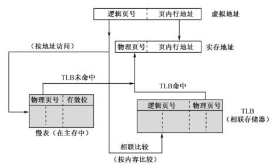

<!-- slide: 118 -->

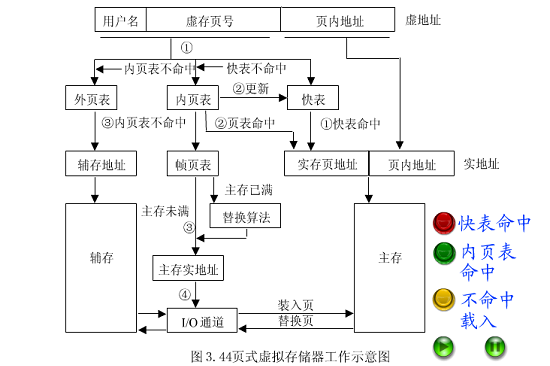
- 重点！

<!-- slide: 119 -->

- 例：设某虚存有如下快表放在相联存储器中，其容量为8个存储单元，问：按如下三个虚拟地址访问主存，主存的实际地址码是多少？（设地址均为16进制）
- 解：(1)80000H+0324H=80324H
- (2)96000H+0128H=96128H
- (3)去主存中查找
- 重点！

<!-- slide: 120 -->
