# 复习课II

<!-- slide: 1 -->

- 计算机组成原理与体系结构复习课 II

<!-- slide: 2 -->

- 第四章 指令系统

<!-- slide: 3 -->

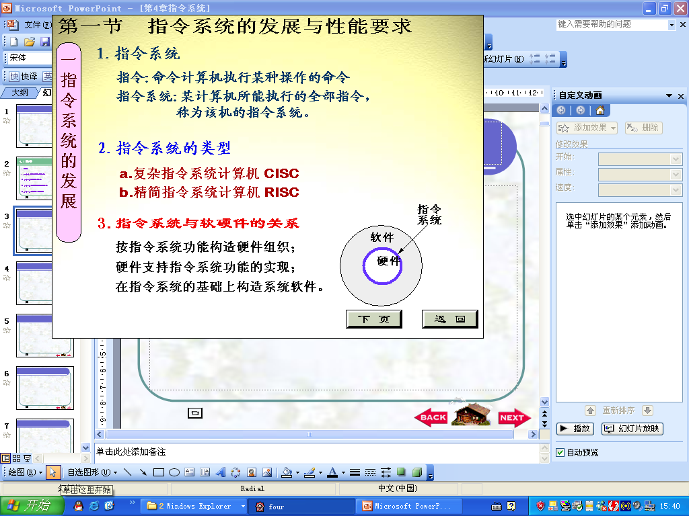
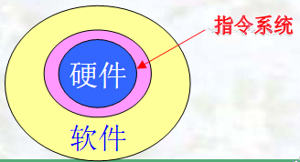
- 重点！

<!-- slide: 4 -->

## 指令系统的性能决定了计算机的基本功能，它的设计直接关系到计算机的硬件结构和用户的需要。
　      一个完善的指令系统应满足如下四方面的要求：
完备性　用汇编语言编写各种程序时，指令系统直接提供的指令足够使用。
        完备性要求指令系统丰富、功能齐全、使用方便。 

有效性　利用该指令系统所编写的程序能够高效率的运行。高效率主要表现在程序占据存储空间小、执行速度快。
       一般来说，一个功能更强、更完善的指令系统，必定有更好的有效性。

- 重点！

<!-- slide: 5 -->

## 规整性　规整性包括指令系统的对称性、匀齐性、指令格式和数据格式的一致性。
           对称性指在指令系统中所有的寄存器和存储器单元都可同等对待，所有的指令都可使用各种寻址方式；
           匀齐性是指一种操作性质的指令可以支持各种数据类型；
           指令格式和数据格式的一致性是指指令长度和数据长度有一定的关系，以方便处理和存取。

- 重点！

<!-- slide: 6 -->

- 系列机各机种之间具有相同的基本结构和共同的基本指令集，因而指令系统是兼容的，即各机种上基本软件可以通用。
- 但由于不同机种推出的时间不同，在结构和性能上有差异，做到所有软件都完全兼容是不可能的，只能做到“向上兼容”，即低档机上运行的软件可以在高档机上运行。
- 兼容性
- 重点！

<!-- slide: 7 -->

- CISC和RISC
- CISC：复杂指令集（Complex Instruction Set Computer）
- 具有大量的指令和寻址方式
- 8/2原则：80%的程序只使用20%的指令
- 大多数程序只使用少量的指令就能够运行。
- RISC：精简指令集（Reduced Instruction Set Computer)
- 在通道中只包含最有用的指令
- 确保数据通道快速执行每一条指令
- 使CPU硬件结构设计变得更为简单

<!-- slide: 8 -->

- RISC三要素：
- (1)一个有限的简单的指令集；指令长度固定，指令格式和寻址方式种类少，
- (2)CPU配备大量的通用寄存器；只有取数/存数指令访问存储器，其余指令的操作均在寄存器之间进行。
- (3)强调对指令流水线的优化。
- 重点！

<!-- slide: 9 -->

## 4.2.1  指令基本格式

- 1. 操作码OP
- 2. 地址码A

| OP | A |
|---|---|

- 操作码字段
- 操作数地址字段
- 用于指示指令的操作性质及功能。
- n≥log2N　或　N≤2n
- N—指令系统基本指令的
- 条数。
- n—OP的二进制位数。
- 指示操作数或指令的地址
- A的位数越多，在内存中访问的范围（寻址范围）越大。
- 通常还包含寻址方式码 。
- 指令基本格式

<!-- slide: 10 -->

## 三地址指令

| OP | A1 | A2 | A3 |
|---|---|---|---|

- 指令意义：
- (A1) OP (A2)  A3
- 优点：适用于需保留操作数的场合。
- 缺点：指令码长。所以只在字长较长的大、中型机中    使用，而小型、微型机中很少使用
- 4、按照地址码分类
- 重点！

<!-- slide: 11 -->

## 二地址指令

| op | A1 | A2 |
|---|---|---|

- 指令意义：
- （A1）OP（A2）→A1
- 特点
- ①指令码长度适中，使用方便。
- ②执行指令后，目的地址A1 中的操作数被运算结果所取代。
- 4、按照地址码分类

<!-- slide: 12 -->

- 按操作数的来源分  RR型、SS型和RS型三种
- RR型指令
- SS型指令
- RS型指令
- ---两个操作数均来自寄存器的指令
- ---两个操作数均来自内存的指令
- ---操作数分别来自寄存器和内存的指令
- 4、按照地址码分类
- 二地址指令

<!-- slide: 13 -->

## 一地址指令

| OP | A |
|---|---|

- 指令意义：
- ①对于单操作数指令
- OP (A)  AC
- AC——累加器
- 例如 LDA  48指令，执行(MEM)48 AC的操作。
- ②对于双操作数指令
- （AC）OP（A）→AC
- A——显地址
- AC——隐含地址，是隐含的寻址方式
- 优点：特别适用于只需一个地址的指令，指令字长度短。
- 例如：“+1”、“-1”、“求反”等指令。
- 缺点：对于两个操作数都来自内存的运算，速度慢。
- 4、按照地址码分类

<!-- slide: 14 -->

## 4、按照地址码分类

- <number>
- 零地址指令
  - 不涉及操作数：如NOP、HLT指令
  - 操作数隐含：如PUSH、POP指令

| OP |
|---|

<!-- slide: 15 -->

## 2、指令的寻址方式

- <number>
- 一、指令寻址
- 二、数据寻址

<!-- slide: 16 -->

## 2、指令的寻址方式

- 1． 什么叫寻址方式？（编址、选址、定址方式）
- 形成操作数有效地址的方式，称为操作数的寻址方式。
- 2． 术语
- 形式地址D
- 有效地址E
- —指令中给出的地址码。
- —操作数（或指令）的真实地址。

<!-- slide: 17 -->

## 2、指令的寻址方式

- 3． 对寻址方式的设计要求
- ①指令内的地址尽可能短；
- ②寻址范围尽可能大；
- ③地址能隐含在寄存器里，而且能访问整个主存空间；
- ④希望能在不改变指令的情况下改变地址的实际值；
- ⑤希望寻址方式尽可能简单；

<!-- slide: 18 -->

## 一、指令寻址

- <number>
- 1、  顺序寻址方式
  - 控制器中使用程序计数器PC来指示指令在内存中的地址。在程序顺序执行时，指令的地址码由PC自加1得出。
  - 指令在内存中按顺序存放，当顺序执行一段程序时，根据PC从存储器取出当前指令， PC自动＋1，然后执行这条指令；接着又根据PC指示从存储器取出下一条指令， PC自动＋1， 执行……。
- 2、跳跃寻址方式
  - 当程序执行转移指令时，程序不再顺序执行，而是跳转到另一个地址去执行，此时，由该条转移指令的地址码字段可以得到新指令地址，然后将其置入PC中。
- 应用：
- ① 程序转移、子程序调用、程序中断；
- ② 循环程序。

<!-- slide: 19 -->

- <number>
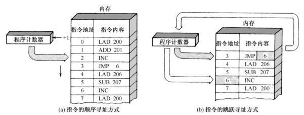
- 一、指令寻址
- 1、  顺序寻址方式
- 2、跳跃寻址方式
- 重点！

<!-- slide: 20 -->

## 二、数据寻址

- <number>
- 1、隐含寻址
- 2、立即寻址
- 3、直接寻址
- 4、间接寻址
- 5、寄存器寻址
- 6、寄存器间接寻址
- 7、偏移寻址： 变址寻址/基址寻址 /相对寻址
- 8、段寻址
- 9、堆栈寻址

<!-- slide: 21 -->

## 1、隐含寻址

- <number>

- 例如：一地址指令

| OP | A |
|---|---|

- 指令意义：
- ①对于单操作数指令
- OP (A)  AC
- AC——累加器
- 例如 LDA  48指令，执行(MEM)48 AC的操作。
- ②对于双操作数指令
- （AC）OP（A）→AC
- A——显地址
- AC——隐含地址，是隐含的寻址方式
- 重点！

<!-- slide: 22 -->

## 2、立即寻址

- <number>
- 操作数在指令的地址码字段，即：
  - DATA＝A
- 例如：
    - MOV  AL, 5
    - MOV  AX, 3064H
    - MOV  AL, ‘A’
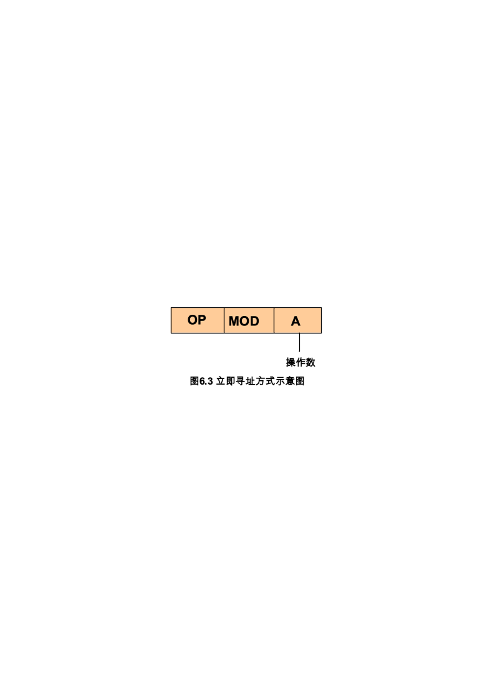
- 优点：操作数直观，速度快。
- 缺点：不便于更改，降低了程序的通用性和灵活性。

<!-- slide: 23 -->

## 3．直接寻址

- <number>
- 操作数位于存储器中，操作数所在的存储器单元的地址存放在指令的地址字段A中，即：
  - DATA＝（EA）
  - EA=A
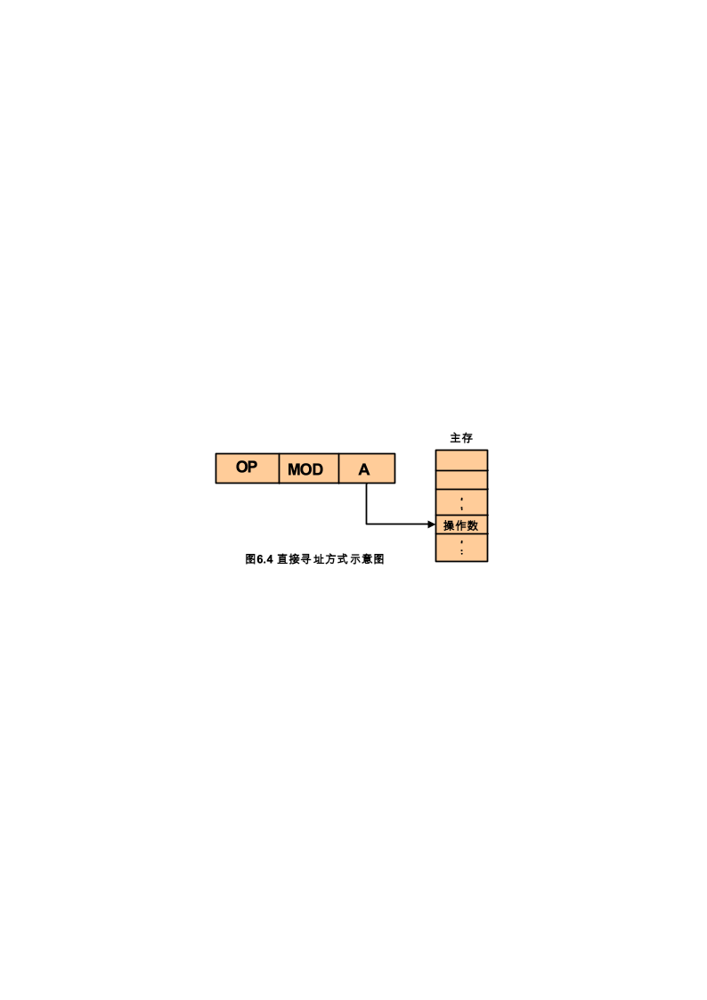
- 有效地址E＝D
- 操作数S＝(E)＝(D)

<!-- slide: 24 -->

## 4、间接寻址

- <number>
- 操作数位于存储器中，操作数所在的存储器单元地址也存放在存储器中，该存储器地址则存放在指令的地址字段中，即：
  - DATA＝（EA）
  - EA=（A）
- 即：A为操作数地址的地址
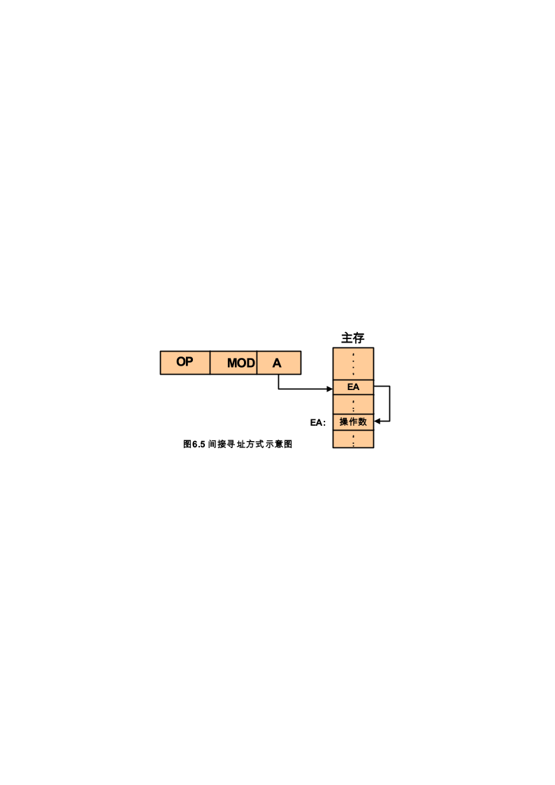
- 一次间址：E=(D)，S=(E)=((D))
- 二次间址：E=((D))，S=(E)=(((D)))
- 优点：扩大寻址范围，方便编程。
- 缺点：增加指令执行时间，可能出现无穷间址（死循环）
- 间址位MOD ：
- MOD＝0，A为直接地址
- MOD＝1，A为间接地址

<!-- slide: 25 -->

- <number>
- A
- 指令
- 存储器
- 操作数
- 直接寻址方式:
- 操作数
- 间接寻址方式:
- A
- 指令
- EA
- EA：

<!-- slide: 26 -->

## 5、寄存器寻址

- <number>
- 操作数位于寄存器中，操作数所在的寄存器编号存放在指令的地址字段A中，即：
  - DATA＝（Ri）
  - MOV  AX, BX
  - MOV  AL, BH
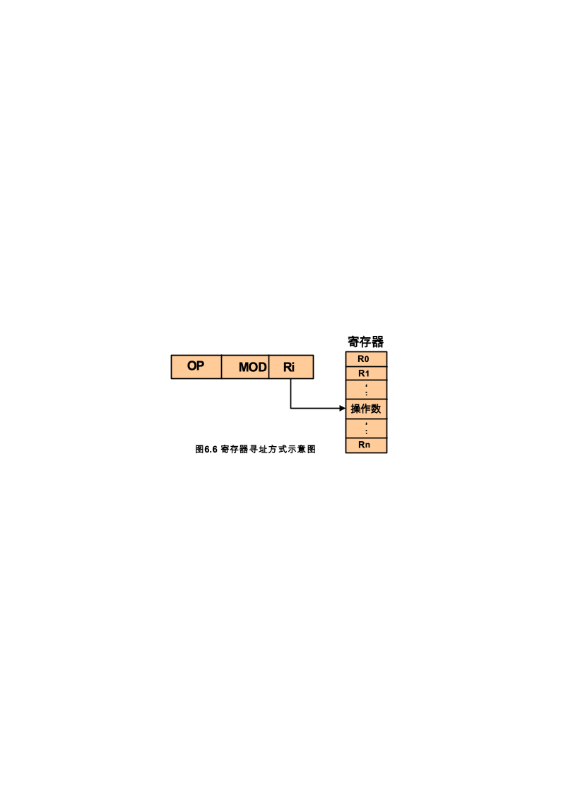

<!-- slide: 27 -->

## 6、寄存器间接寻址

- <number>
- 操作数位于存储器中，操作数所在的存储器地址存放在寄存器中，而该寄存器编号存放在指令的地址字段A中，即：
  - DATA＝（EA）
  - EA＝（Ri ）
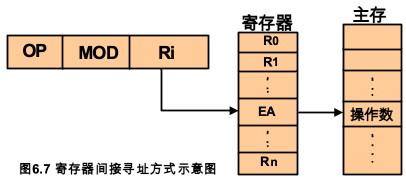

<!-- slide: 28 -->

- <number>
- 寄存器号
- 指令
- 操作数
- 寄存器堆
- 寄存器寻址：
- 寄存器号
- 指令
- 寄存器堆
- EA
- 寄存器间接寻址：
- 操作数
- 存储器
- 重点！

<!-- slide: 29 -->

- ① 压缩指令字的长度，有效解决指令码长度短与内存容量
- 大的矛盾；
- ②加快指令执行速度，如RR型指令；
- ③可扩大寻址范围
- 例: 8个寄存器，只需3位地址，若寄存器字长16位，
- 则@R可寻址216=64K
- ④寻址方式多，编程更灵活。
- 寄存器间接寻址的特点

<!-- slide: 30 -->

## 7、偏移寻址：变址寻址

- <number>
- 操作数位于存储器中，操作数所在的存储器地址EA由变址寄存器RI和指令的地址字段A指出：
  - DATA＝（EA）
  - EA＝（RI ）＋A
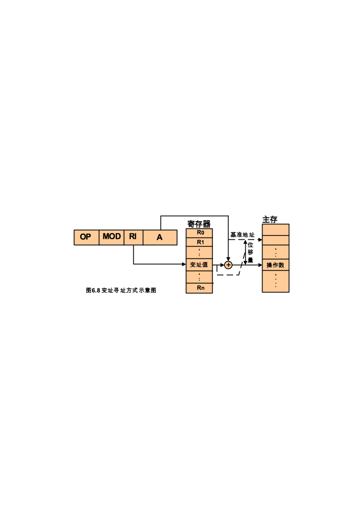

<!-- slide: 31 -->

## 7、偏移寻址：基址寻址

- <number>
- 操作数位于存储器中，操作数所在的存储器地址EA由基址寄存器Rb和指令的地址字段A指出：
  - DATA＝（EA）
  - EA＝（Rb ）＋A

- 基值寻址与变址寻址的不同之处：
- 变址寻址在于实现程序块的规律变化。
- 基址寻址可以扩大寻址范围（整个主存范围）。

<!-- slide: 32 -->

## 7、偏移寻址：相对寻址

- <number>
- 操作数位于存储器中，操作数所在的存储器地址EA由程序计数器PC和指令的地址字段A指出：
  - DATA＝（EA）
  - EA＝（PC ）＋A
  - A通常称作相对偏移量DISP。
  - 相对寻址主要用于转移指令，执行之后，程序将转移到（PC）＋偏移量为地址的指令去执行。
  - 偏移量可正、可负，通常用补码表示，即可相对PC值向后或向前转移。

<!-- slide: 33 -->

## 8、段寻址

- 将段寄存器的基地址左移4位与16位偏移量相加形成20位内存物理地址的寻址方式。
- +
- 存储器物理地址
- 19
- 0000
- 段寄存器
- 15
- 0
- 0
- 图4.7　段寻址方式
- 逻辑地址
- 15
- 0
- Pentium机的实地址模式

<!-- slide: 34 -->

## 9、堆栈寻址

- <number>
- 操作数位于存储器中，操作数所在的存储器地址EA由堆栈指针寄存器SP隐含指出，通常用于堆栈指令。
- 堆栈是由若干个连续主存单元组成的先进后出（first in last out，即FILO）存储区，第一个放入堆栈的数据存放在栈底，最近放入的数据存放在栈顶。栈底是固定不变的，而栈顶是随着数据的入栈和出栈在时刻变化。栈顶的地址由堆栈指针SP指明。
- 一般计算机中，堆栈从高地址向低地址扩展，即栈底的地址总是大于或等于栈顶的地址，称为上推堆栈；也有少数计算机相反，称为下推堆栈。
- 堆栈寻址主要用来暂存中断和子程序调用时现场数据及返回地址。
- 重点！

<!-- slide: 35 -->

## 堆栈的结构

- <number>
- 存储器
- 堆栈段
- 栈底
- SP
- 栈顶
- 堆栈的操作：压入（PUSH）和弹出（POP），对应PUSH和POP指令，假设数据字长为1B
  - 压入指令 PUSH Ri：将Ri寄存器内容压入堆栈。其操作是：
    - （SP）－1→SP，(Ri) →（SP）
  - 弹出指令POP Ri：从堆栈中弹出1个数据送Ri寄存器，其操作是：
    - ((SP)) → Ri  ，(SP)＋1→SP
  - 其中(SP)表示堆栈指针SP的内容；((SP))表示SP所指的栈顶的内容。

<!-- slide: 36 -->

<!-- slide: 37 -->

## 1、按照功能分类

- 1．数据传送指令
- 存数取数指令，传送指令，成组传送，字节交换，清累加器AC,堆栈指令等。
- 功能：M ↔M、R ↔ R、M ↔ R
- 2.   算术逻辑运算指令
- 功能：实现数据信息的加工，代码的转换、判断等。
- ①. 算术运算指令
- 定/浮点加减乘除、求补、算术移位、比较等。
- ② 逻辑运算指令
- ‾‾、∧、∨、⊕、逻辑移位、装配、拆卸等。
- 重点！

<!-- slide: 38 -->

## 1、按照功能分类

- 3. 程序控制指令
- 功能：控制指令的转向
- 包括：无条件转移，条件转移，调用，返回，中断返回等指令。
- 4.  I/O指令
- 功能：
- ① 控制外设的动作；
- ② 测试外设的工作状态；
- ③ 实现外设与主机间的数据交换。
- 5. 其他指令
- PSW的置位、复位，测试指令，堆栈指令，特权指令，停机指令，控制台指令等。
- 重点！

<!-- slide: 39 -->

## 5． 二地址指令按操作数的来源分

- RR型、SS型和RS型三种
- RR型指令
- SS型指令
- RS型指令
- ---两个操作数均来自寄存器的指令
- ---两个操作数均来自内存的指令
- ---操作数分别来自寄存器和内存的指令
- 4.2.2 地址码格式

<!-- slide: 40 -->

## 例：

| OP | A1 | A2 | A3 |
|---|---|---|---|

| 0000 0001 : 1110 | A1 A1 : A1 | A2 A2 : A2 | A3 A3 : A3 |
|---|---|---|---|

- 4位操作码,15条三地址指令

| 1111 1111 : 1111 | 0000 0001 : 1110 | A2 A2 : A2 | A3 A3 : A3 |
|---|---|---|---|

- 8位操作码,15条二地址指令

| 1111 1111 : 1111 | 1111 1111 : 1111 | 0000 0001 : 1110 | A3 A3 : A3 |
|---|---|---|---|

- 12位操作码,15条一地址指令

| 1111 1111 : 1111 | 1111 1111 : 1111 | 1111 1111 : 1111 | 0000 0001 : 1111 |
|---|---|---|---|

- 16位操作码
- 操作码扩展技术

<!-- slide: 41 -->

- 第4章   典型习题与解答

<!-- slide: 42 -->

- 第4章   典型例题

<!-- slide: 43 -->

## 【题4-5】指令格式结构如下所示，试分析指令格式及 
         寻址方式的特点。

| OP | 寻址方式 | 寄存器 | 寻址方式 | 寄存器 |
|---|---|---|---|---|

| 15              12 | 11              9 | 8               6 | 5             3 | 2                0 |
|---|---|---|---|---|

- 答:
- ① 所示指令是单字长二地址指令。
- ② 操作码字段OP有4位，可以指定24＝16条指令。
- 第4章   习题讲解
- ③ 寻址方式有23＝8种，可以是RR、RS或SS型指令。

<!-- slide: 44 -->

- [题4-8]  某机字长为32位，主存容量为1M，单字长指令，有50种操作码，采用寄存器寻址、寄存器间接寻址、立即、直接等寻址方式。CPU中有PC、IR、AR、DR和32个通用寄存器。问：   （1）指令格式如何安排？（2）能否增加其它寻址方式？
- 第4章   习题讲解
- （1）解：
- ① 50种操作码，则字段OP必须有6位，可以指定26＝64条指令。
- ② 32个通用寄存器，则寄存器标志必须有5位，可以指定25＝32个寄存器。
- ③ 至少4种寻址方式，则寻址标志必须有2位，可以指定22＝4种寻址方式。

<!-- slide: 45 -->

- 单字长二地址指令：

| OP | 寻址方式 | 寄存器 | 位移量D |
|---|---|---|---|

| 31              26 | 25        24 | 23              19 | 18                      0 |
|---|---|---|---|

- 单字长单地址指令：

| OP | 寻址方式 | 源寄存器 | 目的寄存器 | 位移量D |
|---|---|---|---|---|

| 31              26 | 25        24 | 23          19 | 18            14 | 13              0 |
|---|---|---|---|---|

- （2）解：可以增加其他寻址方式，寻址标志位扩充到2位以上，
- 位移量D在14位以下。原因如下：
- ② 寄存器字长32位，可以寻址空间232＝4GB；可以满足题目的要求
- ① 主存容量1M，要求寻址空间220＝1MB。

<!-- slide: 46 -->

- 寄存器号
- 指令
- 操作数
- 寄存器堆
- 寄存器寻址方式：
- 寄存器号
- 指令
- 寄存器堆
- EA
- 寄存器间接寻址方式：
- 操作数
- 存储器

- 第4章   习题讲解

<!-- slide: 47 -->

- [题4-9]  CPU中有16个32位通用寄存器，设计一种能容纳64种操作的指令系统。如果采用通用寄存器作基址寄存器，则RS型指令的最大存储空间是多少？
- 第4章   习题讲解
- 解：
- ① 64种操作码，则字段OP必须有6位，可以指定26＝64条指令。
- ② 16个通用寄存器，则寄存器标志必须有4位，可以指定24＝16个寄存器。
- ③ 题目要求基址寻址，而且是RS型指令，所以肯定是单字长二地址指令

<!-- slide: 48 -->

- 单字长二地址指令：
- ① 寄存器字长32位，可以寻址空间232B；
- ③ 所以最大寻址空间232+218＝4G+256KB。

| OP | 源寄存器 | 目的寄存器 | 位移量D |
|---|---|---|---|

| 31              26 | 25        22 | 21              18 | 17                      0 |
|---|---|---|---|

- ② 位移量D字长18位，可以寻址空间218B；

<!-- slide: 49 -->

- 第五章 CPU

<!-- slide: 50 -->

- CPU器的功能和组成
- 中央处理器
- 通常简称CPU（Central Process Unit）。
- 一旦把程序装入内存储器，就可以由计算机来自动完成取出指令和执行指令的任务。专门用来完成此项工作的计算机部件称为中央处理器。
- CPU的基本部分由运算器、cache和控制器三大部分组成。
- 重点！

<!-- slide: 51 -->

## Structure - The CPU

- Computer
- Arithmetic
- and
- Login Unit
- Control
- Unit
- Internal CPU
- Interconnection
- Cache
- CPU
- I/O
- Memory
- System
- Bus
- CPU
- 重点！

<!-- slide: 52 -->

- CPU的基本功能：
- ★ 指令控制
- 程序的顺序控制称为指令控制。由于程序是一个指令序列，这些指令的相互顺序不能任意颠倒，必须严格按程序规定的顺序进行。
- ★ 操作控制
- 一条指令的功能往往是由若干个操作信号的组合来实现的，因此，CPU管理并产生由内存取出的每条指令的操作信号，把各种操作信号送往相应的部件，从而控制这些部件按指令的要求进行动作。
- 重点！

<!-- slide: 53 -->

- CPU的基本功能：
- ★ 时间控制
- 对各种操作实施时间上的定时称为时间控制。在计算机中，各种指令的操作信号以及一条指令的整个执行过程都受到时间的严格定时。
- ★ 数据加工
- 数据加工就是对数据进行算术运算和逻辑运算处理。
- 重点！

<!-- slide: 54 -->

## 指令周期

- <number>
- 指令周期：是指计算机从内存取出一条指令并完成该指令的执行所需要的时间。
  - 不同指令的指令周期是不相同的，与指令复杂程度有关。
  - 一个指令周期可能由若干个机器周期组成。
- 机器周期：又称为CPU周期/时钟周期（节拍电位） ，一般规定为CPU从内存中读取一条指令字所需要的最短时间。
  - 机器周期可以是定长或变化的，由操作控制器决定。
  - 一个机器周期的功能需要多个时钟周期完成。
- 节拍周期：又称为T周期（节拍脉冲） ，是指CPU执行一个微操作命令（即控制信号）的最小时间单位，也即T周期。 一般机器周期与CPU的主频直接相关。
- 重点！

<!-- slide: 55 -->

## 指令周期

- 1．基本概念
- （1） 指令周期—取出并执行一条指令所需的时间
- 通常指令周期的长短与指令的复杂程度有关。
- （2） CPU周期（机器周期）—内存中读取一个指令字的最短时间，指令周期常用若干个CPU周期数来表示
- （3） 时钟周期（节拍脉冲）—处理操作的最基本单位（由硬件的时钟频率决定） ， CPU 周期包括若干个时钟周期。
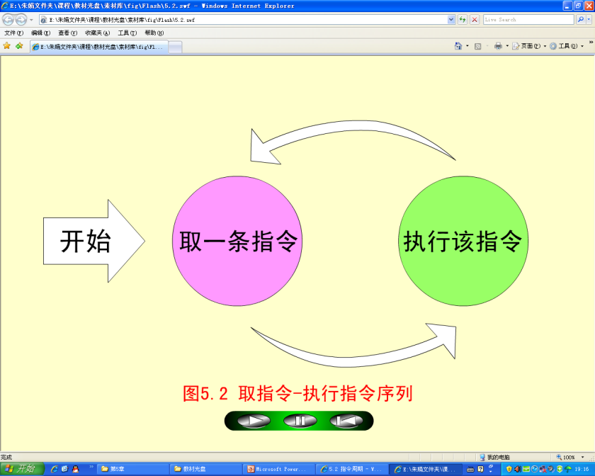

<!-- slide: 56 -->

## 指令周期、机器周期、时钟周期的关系

- <number>
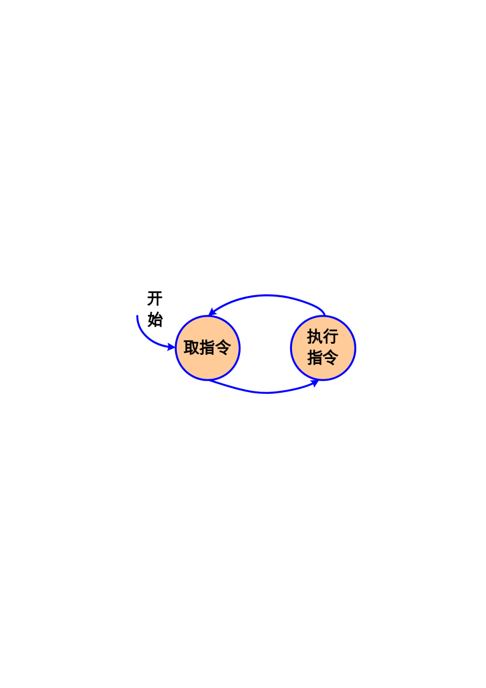
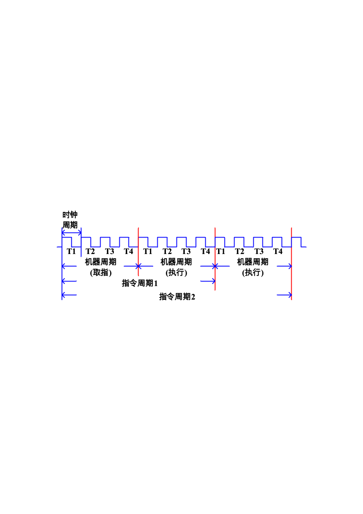

- 重点！

<!-- slide: 57 -->

- 用方框图语言表示指令周期
- 在进行计算机设计时，可以采用方框图语言来表示一条指令的指令周期。
- 方框 代表一个CPU周期，方框中的内容表示数据通路的操作或某种控制操作。
- 菱形 通常用来表示某种判别或测试，不过时间上它依附于紧接它的前面一个方框的CPU周期，而不单独占用一个CPU周期。
- 我们把前面的五条典型指令加以归纳，用方框图语言表示的指令周期。

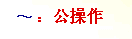

<!-- slide: 58 -->

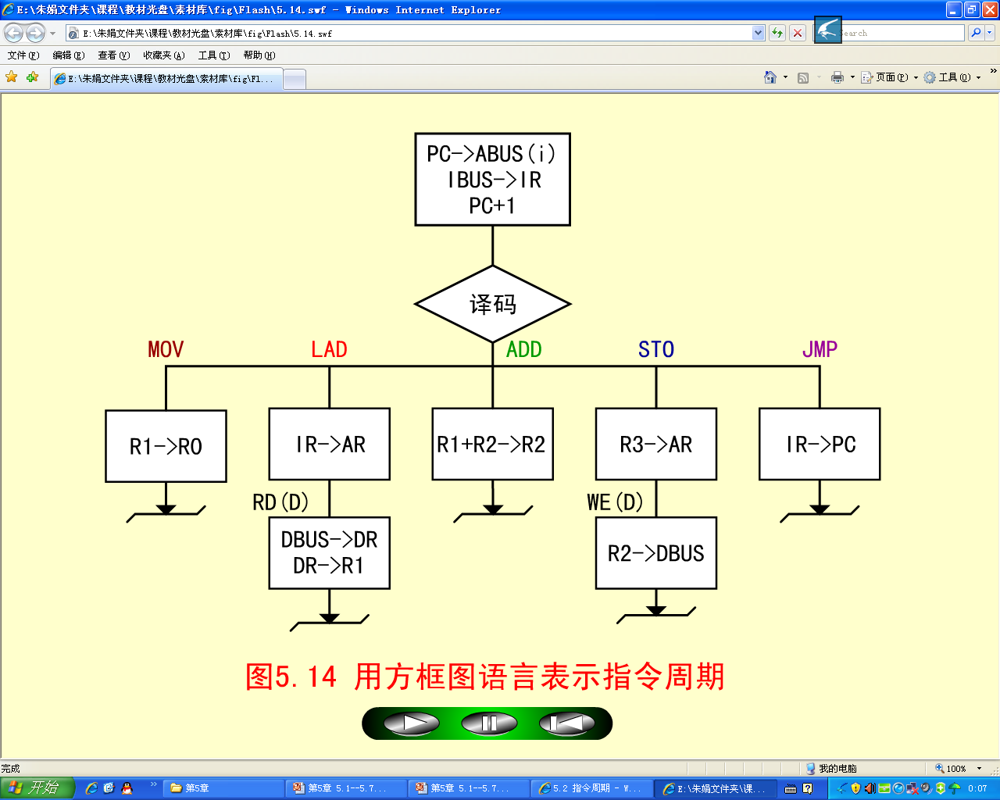
- 重点！

<!-- slide: 59 -->

- <number>
- 十进制加法指令
- 功能：实现两个BCD码十进制加法运算。
- 算法：      两个一位BCD码之和。
- 大于9时，和数必须加6修正，并产生十进制进位。
- 不大于9时，和数不必修正，且无十进制数的进位。
- 举例： “十进制加法”指令

<!-- slide: 60 -->

- <number>
- 000 000 000  000  11111
- 10
- 0000
- 第二条微指令的二进制编码是
- 010 100 100 100 00000
- 00
- 1001
- 第三条微指令的二进制编码是
- 010 001 001 100 00000
- 01
- 0000
- 第四条微指令的二进制编码是
- 010 001 001 001 00000
- 00
- 0000
- 第一条微指令的二进制编码是
- PC→AR→ABUS
- IBUS→IR，PC+1
- P1
- (R1)＋(R2)→R2
- (R2)＋(R3)→R2
- P2
- (R2)－(R3)→R2
- 0000
- 0000
- RD
- 1010
- 1001
- 0000
- 0000
- 0001
- Cy＝0
- Cy＝1
- 图5.29十进制加法微程序流程图

<!-- slide: 61 -->

- CPU周期与微指令周期
- 微指令周期 = 取出微指令的时间 + 执行该条微指令的时间
- CPU周期 = 执行微指令的时间+取出下一条微指令的时间
- 微指令周期：指从控存中取出并执行一条微指令所需要的时间，一般与一个CPU周期相当。
- （指令周期、CPU周期、节拍周期的关系？）
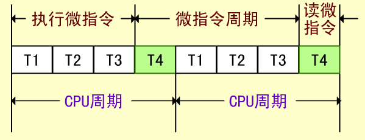
- 重点！

<!-- slide: 62 -->

## 微指令格式的类型

- <number>
- 不同的计算机有不同的微指令格式，但一般分为水平型微指令和垂直型微指令两种类型。
- （1）水平型微指令
  - 微指令字采用长格式，也就是控制字段采用直接控制法和字段直接编码法，使一条微指令能控制数据通路中多个功能部件并行操作。
  - 水平型微指令的优点是：一条微指令可同时发送多个微命令，微指令执行效率高，速度快，较灵活，并行操作能力强；水平型微指令构成的微程序较短。它的主要缺点是：微指令字长较长，明显地增加了控制存储器的横向容量。
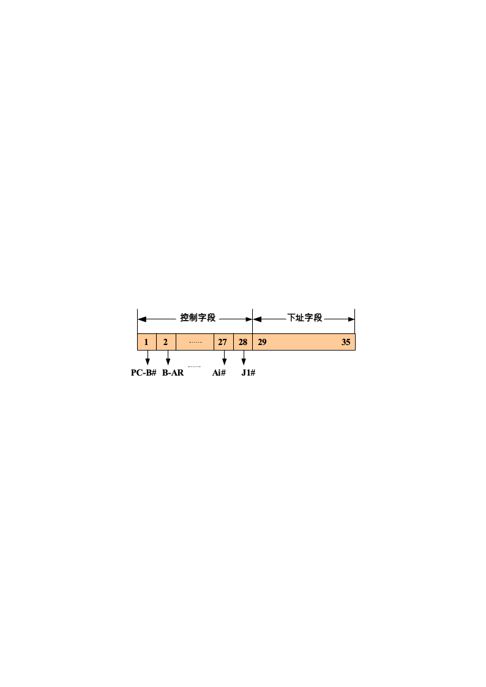

<!-- slide: 63 -->

## （三）微指令格式的类型

- <number>
- （2）垂直型微指令
  - 控制字段采用完全编码的方法，将一套微命令代码化构成微指令。就像计算机机器指令一样，它由微操作码、源地址和目标地址以及其他附带信息构成
  - 垂直型微指令和机器指令一样分成多种类型的微指令，所有微指令构成一个微指令系统。
  - 主要特点：微指令字采用短格式，每条微指令只能控制一二个微操作，并行控制能力差。但由于微指令和机器指令格式相类似，对于用户来说，垂直型微指令比较直观，容易掌握和便于使用。微指令字短，减少了横向控制存储器的容量；但微程序长，影响了执行的速度。
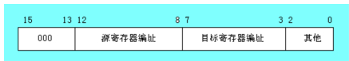
- 重点！

<!-- slide: 64 -->

- CPU中的主要寄存器
- 在CPU中至少要有六类寄存器。 这些寄存器用来暂存一个计算机字。根据需要，可以扩充其数目。下面详细介绍这些寄存器的功能与结构。
- 1.数据缓冲寄存器（DR）
- 2.指令寄存器（IR）
- 3.程序计数器（PC）
- 4.地址寄存器（AR）
- 5.累加寄存器（AC）
- 6.状态条件寄存器（PSW）
- 重点！ 分别保存什么 信息

<!-- slide: 65 -->

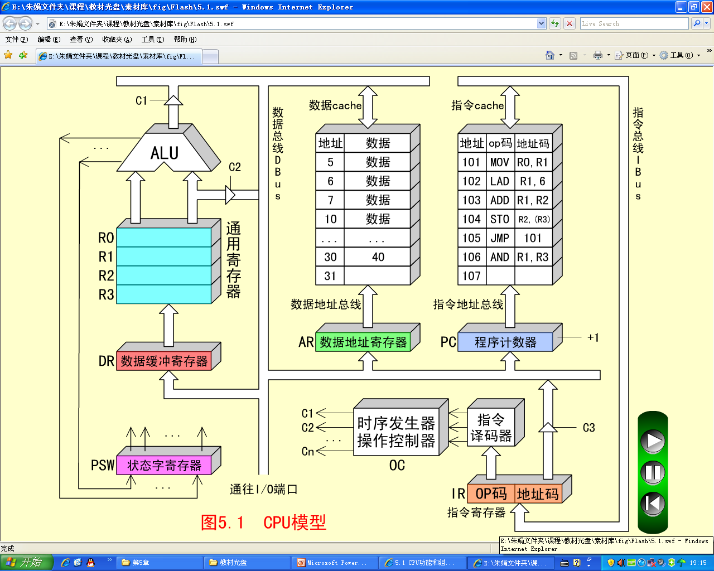

<!-- slide: 66 -->

- 1.数据缓冲寄存器（DR）
- 数据缓冲寄存器用来暂时存放由内存读出的一条指令或一个数据字；反之，当向内存存入一条指令或一个数据字时，暂时将它们存放在数据缓冲寄存器中
- 缓冲寄存器的作用是 ：
- (1)作为CPU和内存、外部设备之间信息传送的中转站(2)补偿CPU和内存/外围设备之间操作速度上的差别
- (3)在单累加器结构的运算器中，数据缓冲寄存器还可兼作为操作数寄存器。

<!-- slide: 67 -->

- 2.指令寄存器（IR）
- 指令寄存器用来存放当前执行的指令
- 当取出一条指令时，
- 指令总线：从cache→指令寄存器IR
- 指令寄存器中的操作码字段：
- 从指令寄存器IR →指令译码器→操作控制器
- 指令译码器:对操作码进行测试，以便识别所要求的操作。
- 操作控制器:发出具体操作的特定信号,控制各个部件的操作。

<!-- slide: 68 -->

- 3.程序计数器（PC）
- 程序计数器用来存放下一条将要执行指令的地址
- 程序计数器的结构应当具有寄存信息和计数两种功能。
- ⑴在程序开始执行前，必须将它的起始地址，即程序的第一条指  令所在的内存单元地址送入PC，因此PC的内容即是从内存提取的第一条指令的地址。
- ⑵当执行指令时，CPU将自动修改PC的内容，以便使其保持的总是将要执行的下一条指令的地址。由于大多数指令都是按顺序来执行的，所以修改的过程通常只是简单的对PC加1。
- ⑶当遇到转移指令如JMP指令时，那么后继指令的地址（即PC的内容)必须从指令的地址段取得。在这种情况下，下一条从内存取出的指令将由转移指令来规定，而不是像通常一样按顺序来取得。

<!-- slide: 69 -->

- 4.数据地址寄存器（AR）
- 数据地址寄存器用来保存当前CPU所访问的内存单元的地址。由于在内存和CPU之间存在着操作速度上的差别，所以必须使用地址寄存器来保持地址信息，直到内存的读/写操作完成为止 。
- 数据地址寄存器的结构和数据缓冲寄存器、指令寄存器一样，通常使用单纯的寄存器结构。信息的存入一般采用电位-脉冲方式，即电位输入端对应数据信息位，脉冲输入端对应控制信号，在控制信号作用下，瞬时地将信息打入寄存器。

<!-- slide: 70 -->

- 5.累加寄存器（AC）
- 累加寄存器AC通常简称为累加器，它是一个通用寄存器。其功能是：当运算器的算术逻辑单元ALU)执行算术或逻辑运算时，为ALU提供一个工作区。累加寄存器暂时存放ALU运算的结果信息。显然，运算器中至少要有一个累加寄存器。
- 目前CPU中的累加寄存器，多达16个，32个，甚至更多。当使用多个累加器时，就变成通用寄存器堆结构，其中任何一个可存放源操作数，也可存放结果操作数。在这种情况下，需要在指令格式中对寄存器号加以编址。

<!-- slide: 71 -->

- 6.状态条件寄存器（PSW）
- 状态条件寄存器保存由算术指令和逻辑指令运行或测试的结果建立的各种条件码内容。如运算结果进位标志(C)，运算结果溢出标志(V)，运算结果为零标志(Z)，运算结果为负标志(N)等等。这些标志位通常分别由 1位触发器保存。
- 除此之外，状态条件寄存器还保存中断和系统工作状态等信息，以便使CPU和系统能及时了解机器运行状态和程序运行状态。因此，状态条件寄存器是一个由各种状态条件标志拼凑而成的寄存器。
- 重点！

<!-- slide: 72 -->

## 4.  超标量流水线

- 4.2.1 超标量流水线
- 标量流水线：在每个时钟周期只发射一条指令，并要求每个时钟周期只从流水线流出一条指令的结果。
- 超标量流水线：是指在每个时钟周期向流水线发射多条指令，并能从流水线流出多个结果。

<!-- slide: 73 -->

## 例：三发射超标量流水线

- 重点！

<!-- slide: 74 -->

## 5.超流水线技术

- 超流水线：把一般完成一条指令的流水线段再细分成更多的流水线段。这样原时钟周期的几分之一的时间间隔就可以发射一条指令，并从流水线流出一个结果。

<!-- slide: 75 -->

- 流水线相关：
- 是指邻近指令之间由于某种关系，出现了不能同时被流水操作的现象。
- 流水线的相关会造成流水线的断流，影响整个流水线的效率。
- 资源相关
- 数据相关
- 变址转移
- 中断
- 控制相关（全局性相关）
- （局部性相关）
- 造成流水线相关的原因

<!-- slide: 76 -->

- 局部性相关：资源相关
- 在同一机器时钟周期内争用同一个功能部件所发生的冲突。

| 时钟 指令 | 1 | 2 | 3 | 4 | 5 |
|---|---|---|---|---|---|
| I1 | 取指 | 译码 | 取数 | 执行 |  |
| I2 |  | 取指 | 译码 | 取数 | 执行 |
| I3 |  |  | 取指 | 译码 | 取数 |

- 在时钟3发生争用内存的问题—资源相关。
- 解决方法：
- ① 将取指操作推迟一个时钟进行；
- ② 增设一个存储器，将指令和数据分开存放；
- ③ 采用双端口存储器。

<!-- slide: 77 -->

- 局部性相关：数据相关
- 在程序中，一条指令的执行需等前一条指令执行完后才能进行，则有数据相关。
- 例：
- 取数
- 译码
- 取指
- ADD
- 执行
- 取数
- 译码
- 取指
- SUB
- 4
- 3
- 2
- 1
- 时钟
- 指令
- 解决方法：
- ① 推迟ADD指令的取数操作；
- ② 采用数据旁路（内部向
- 前）技术，直接把结果
- 送给下一条指令。

<!-- slide: 78 -->

- 全局性相关：控制相关
- 由条件转移指令或中断引起的。
- 解决方法：
- ① 延迟转移法：基本思想是“先执行再转移”，即让紧跟在转移指令之后已经进入流水线的与转移无关的指令继续执行，等待转移条件形成。
- ② 转移预测法：依据指令过去的行为来预测将来的行为，选择出现概率较高的分支进行指令预取。

<!-- slide: 79 -->

- 【例4】 流水线中有三类数据相关冲突：
- 写后读相关；读后写相关；写后写相关。
- 判断以下三组指令各存在哪种类型的数据相关。
- (1) I1: 　ADD R1，R2，R3 ；　　(R2) + (R3)->R1
- I2: 　SUB R4，R1，R5 ； 　　(R1) - (R5)->R4
- (2) I3: 　STA M(x)，R3 ；  R3)->M(x)，M(x)是存储器单元  I4: 　ADD R3，R4，R5 ；　　　(R4)+(R5)->R3
- (3) I5: 　MUL R3，R1，R2 ；　　　(R1)×(R2)->R3
- I6:　 ADD R3，R4，R5 ；　　　(R4) + (R5)->R3

<!-- slide: 80 -->

- (1) I1: 　ADD R1，R2，R3 ；　　(R2) + (R3)->R1
- I2: 　SUB R4，R1，R5 ； 　　(R1) - (R5)->R4
- 第(1)组指令中，I1指令运算结果应先写入R1，然后在I2指令中读出R1内容。由于I2指令进入流水线，变成I2指令在I1指令写入R1前就读出R1内容，发生RAW（写后读）相关。
- 重点！

<!-- slide: 81 -->

- (2) I3: 　STA M(x)，R3; （R3)->M(x)，M(x)是存储器单元
- I4:    ADD R3，R4，R5;        (R4)+(R5)->R3
- 第(2)组指令中，I3指令应先读出R3内容并存入存储单元M(x)，然后在I4指令中将运算结果写入R3。但由于I4指令进入流水线，变成I4指令在I3指令读出R3内容前就写入R3，发生WAR（读后写）相关。
- 重点！

<!-- slide: 82 -->

- (3)  I5:   MUL R3，R1，R2 ；　(R1)×(R2)->R3
- I6:　ADD R3，R4，R5 ；　(R4) + (R5)->R3
- 
- 第(3)组指令中，如果I6指令的加法运算完成时间早于I5指令的乘法运算时间，变成指令I6在指令I5写入R3前就写入R3，导致R3的内容错误，发生WAW(写后写）相关 。
- 重点！

<!-- slide: 83 -->

<!-- slide: 84 -->

## 微程序设计举例

- 微程序设计步骤：
- 根据数据通路，写出每条指令的执行过程，画出微程序流程图。
- 写出每条微指令所发出的微操作控制信号。
- 按照微指令格式，编写每条微指令的代码。
- 对照指令的执行流程图，分配微指令的地址
- 将写好的微指令按分配好的微地址装入控制存储器。
- 非常重点！

<!-- slide: 85 -->

- (1)“ADD R2，R0”指令是一条加法指令，参与运算的两个数放在寄存器R2和R0中，“ADD R2，R0”指令的详细指令周期流程图如图(a)所示，图的右边部分标注了每一个机器周期中用到的微操作控制信号序列。
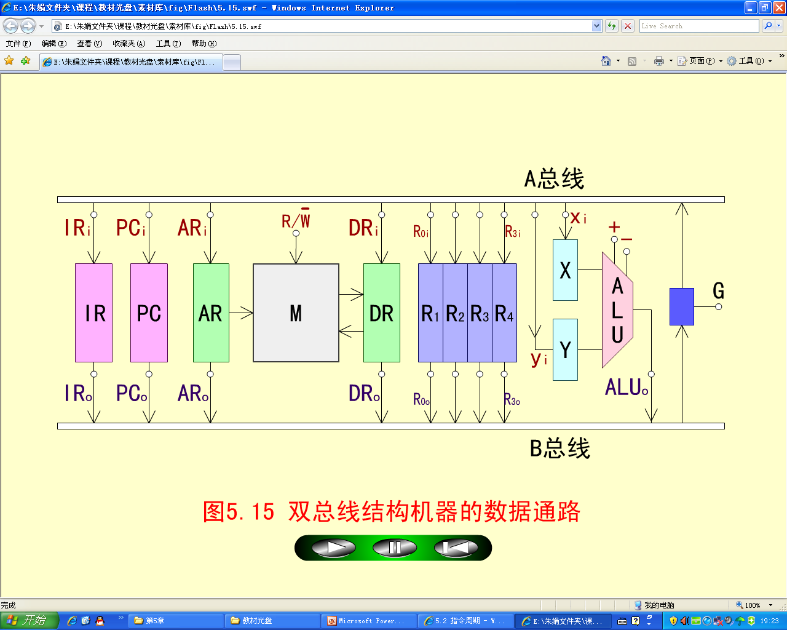
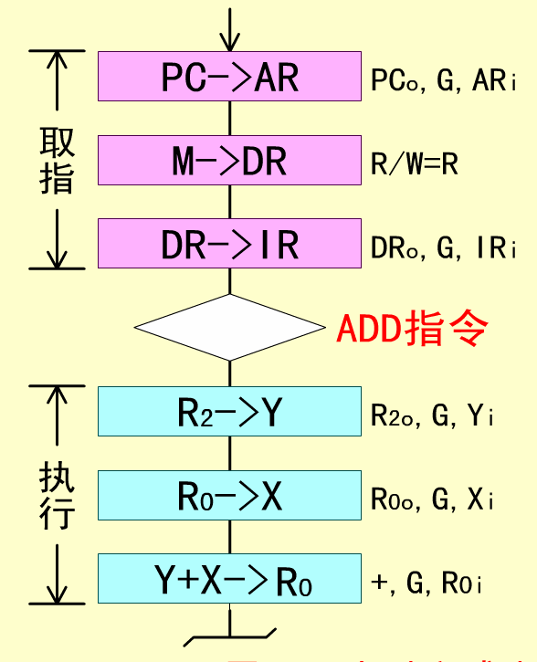

<!-- slide: 86 -->

## 假设存放在存储器中的二条指令内容为：

- <number>

| 地址 | 机器码 | 助记符 | 功能 |
|---|---|---|---|
| 04H | 0101 0000 | ADD R0, 06H | (R0)+06HR0 |
| 05H | 0000 0110（立即数） |  |  |
| 06H | 1000 0000 | JMP 04H | 04HPC |
| 07H | 0000 0100（转移地址） |  |  |

<!-- slide: 87 -->

## 1、指令执行过程

- <number>
- ADD R0, 06H
- 取指令：
  - M1 (送存储器地址)：PCAR, PC+1
  - M2 (读存储器，指令译码)：	MEM IR,J1#
- 执行指令：
  - M3（取源操作数－送地址）：PCAR, PC+1
  - M4（取源操作数－读）：MEM DA1
  - M5（取目的操作数）： R0DA2
  - M6（计算并置结果）：DA1+DA2Rd

<!-- slide: 88 -->

## 1、指令执行过程

- <number>
- JMP ADDR
- 取指令：
  - M1 (送存储器地址)：PCAR, PC+1
  - M2 (读存储器,指令译码)：RAMIR, J1#
- 执行指令：
  - M4（取操作数－送地址）：PCAR, PC+1
  - M5（取操作数－读）：RAM PC
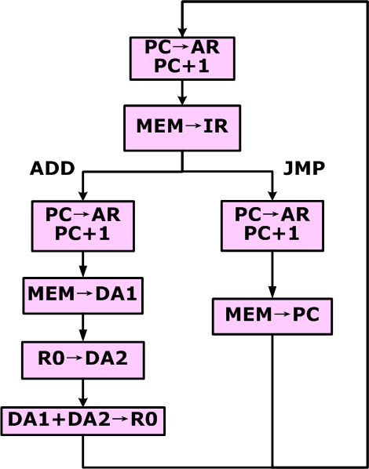

<!-- slide: 89 -->

## 2、指令执行时产生的微操作序列

- <number>

|  | 序号 | 功能 | 发送控制信号 |
|---|---|---|---|
| 取指令 | （1） | PC→AR,PC+1 | PC-B#,B-AR,PC+1, |
|  | （2） | MEM→IR | M-R#,B-IR,J1# |
| ADD | （1） | PC→AR,PC+1 | PC-B#,B-AR,PC+1, |
|  | （2） | MEM→DA1 | M-R#,B-DA1 |
|  | （3） | R0→DA2 | R0-B#,B-DA2 |
|  | （4） | DA1+DA2→R0 | S3~S0,M,Ci=100101,ALU-B#,B-R0 |
| JMP | （1） | PC→AR,PC+1 | PC-B#,B-AR,PC+1, |
|  | （2） | MEM→PC | M-R#,B-PC# |

<!-- slide: 90 -->

## 第6章 总线

<!-- slide: 91 -->

## 6.1.1 总线的分类、特性与标准化

- （1）片内总线
- CPU芯片内部连接运算器、控制器和cache等部件之间的总线。
- 总线是构成计算机系统的互联机构，是多个系统功能部件之间进行数据传送的公共通路。
- 2、单处理器系统的总线类型
- 1、什么叫总线？
- 特点：速度极高。
- 6.1 总线的概念和结构形态
- 重点！

<!-- slide: 92 -->

## （2）系统总线

- CPU同计算机系统的其他高速功能部件，如存储器、通道等互连的总线。包括地址、数据和控制信号线，电源线等。
- 多台计算机之间，或计算机与外存和I/O设备之间的连接总线。一般包括数据线和控制线。
- （3）I/O总线
- 特点：同步并行传输，速度较快。
- 特点：速度较低。
- 重点！

<!-- slide: 93 -->

## 总线信息的传送方式

- 数据从低位开始逐位依次传送的方式。
- 1、串行传送
- 串行传送方式的特点：
- 只需一根传输线，成本低，适合远距离的传送，但速度慢。
- 2、并行传送
- 数据的各位通过各自的传输线同时传送的方式。
- 特点：速度快，但需更多的传输线，适用于近距离部件间       的数据传送。
- 注意：系统总线必须采用并行传送（时间考虑）
- P191  图6.6(a) 串行传送
- P191  图6.6(b) 并行传送

<!-- slide: 94 -->

## 6.4  总线的定时和数据传送模式

- (1)总线上信息传送过程的五个阶段：
- 请求总线→总线仲裁→寻址→信息传送→状态返回。
- (2)定时
- 事件出现在总线上的时序关系。
- (3)常用的定时方式：
- 同步定时
- 异步定时
- 1、概述
- 6.4.1  总线的定时

<!-- slide: 95 -->

- 同步定时
- 总线上的所有模块都在总线公共时钟信号的协调下工作。
- 所有事件都出现在时针信号的前沿，大多数事件只占据单一
- 时钟周期。
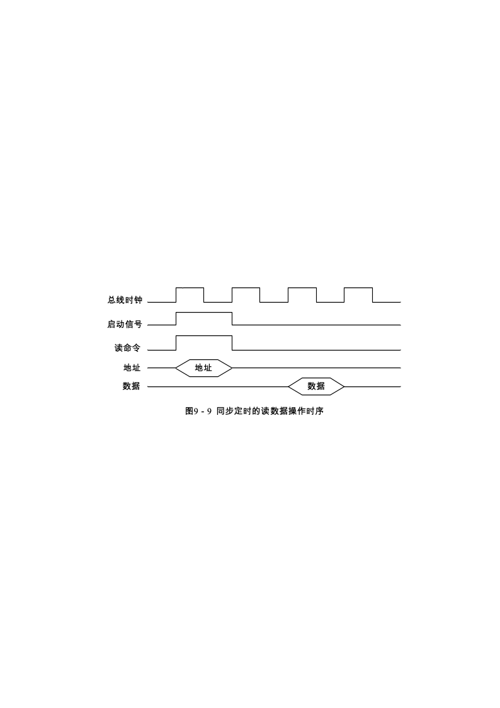

<!-- slide: 96 -->

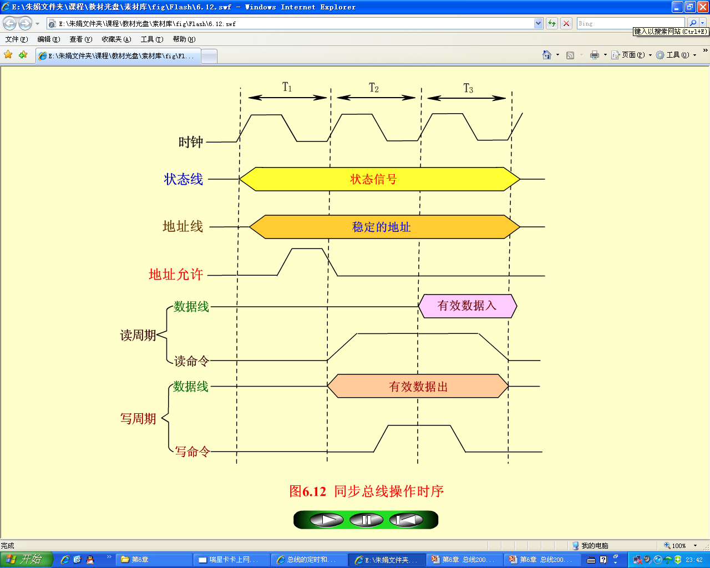

<!-- slide: 97 -->

## 异步定时

- 后一事件出现在总线上的时刻取决于前一事件的出现，即建立在应-答式或互锁机制的基础上。
- 特点：无公共时钟信号，可变长度的总线周期。
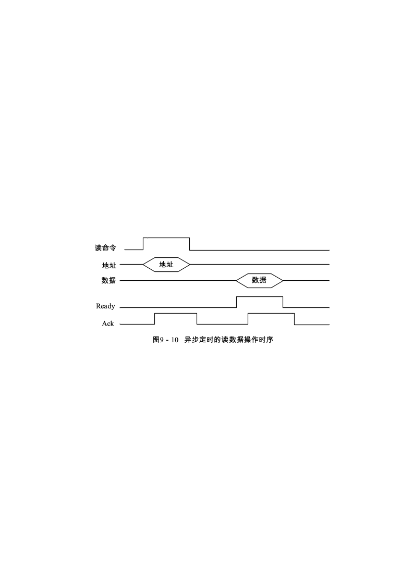
- 重点！

<!-- slide: 98 -->

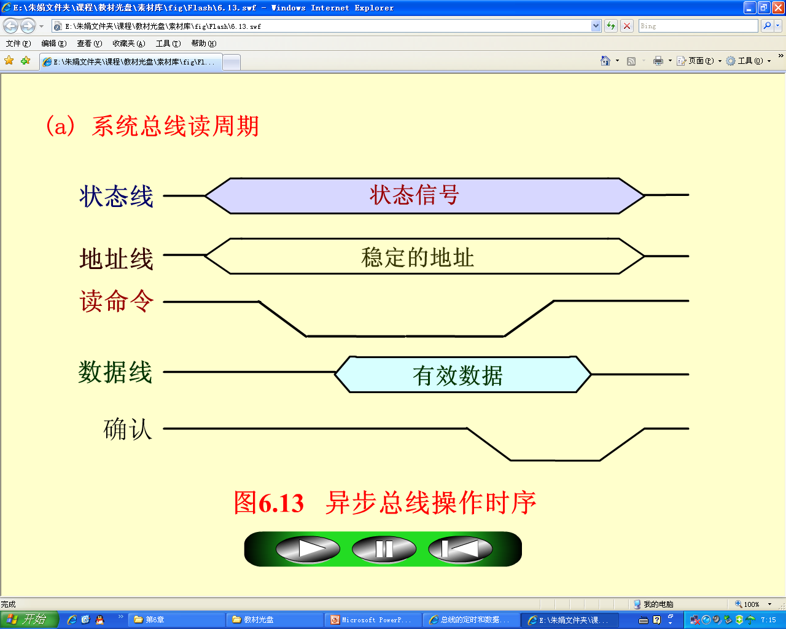

<!-- slide: 99 -->

## 【题20】

- 某系统总线在一个总线周期中并行传送8个字节的数据，假设一个总线周期等于一个总线时钟周期，总线时钟频率为70MHZ，求总线带宽是多少？
- 【解】
- 设总线带宽用Dr表示，总线时钟周期用            表示，一个总线周期传送的数据量用D表示，根据定义可得

<!-- slide: 100 -->

## UART总线时序

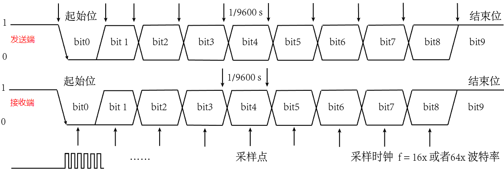
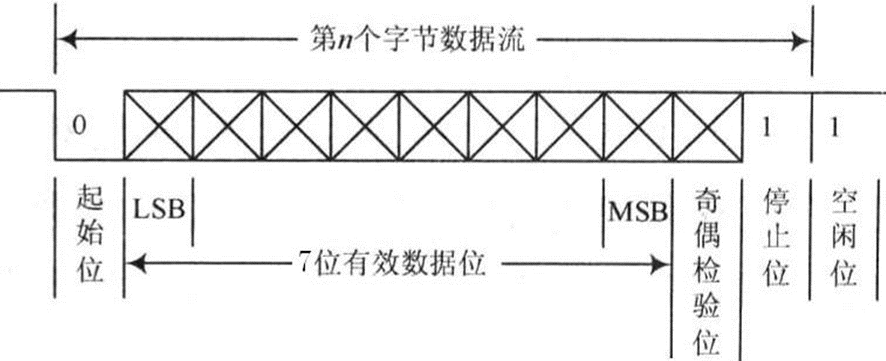
- 起始位：先发出一个逻辑”0”信号，表示传输字符的开始 数据位：可以是5~8位逻辑”0”或”1”；如ASCII码（7位），扩展BCD码（8位）；小端传输，即LSB先发，MSB后发校验位：加上这一位后，数据中“1”的位数为偶数(偶校验)或奇数(奇校验)停止位：它是一个字符数据的结束标志。可以是1位、1.5位、2位的高电平（用于双方同步，停止位时间间隔越长，容错能力越强）
- 空闲位：处于逻辑“1”状态，表示当前线路上没有数据传送
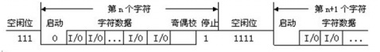
- 异步串行接口
- 重点！

<!-- slide: 101 -->

<!-- slide: 102 -->

## 第七章 外存与I/O设备

- <number>

<!-- slide: 103 -->

| 外部设备的组成与分类（P207-208） |  |
|---|---|
|  | 外部设备组成：  存储介质、驱动装置和控制电路  外部设备分类：  输入设备、输出设备、外存设备、数据通信设备、过程控制设备。 |

<!-- slide: 104 -->

## 外围设备的分类

- <number>
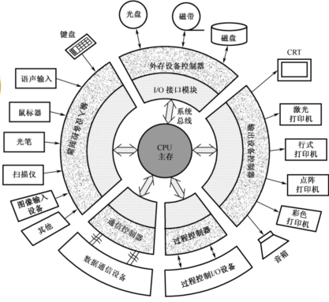
- 重点！

<!-- slide: 105 -->

<!-- slide: 106 -->

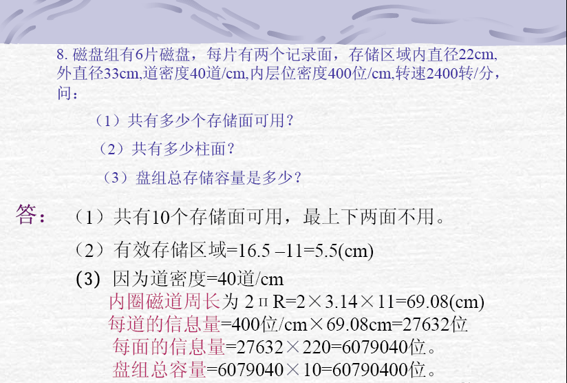
- 重点！

<!-- slide: 107 -->

<!-- slide: 108 -->

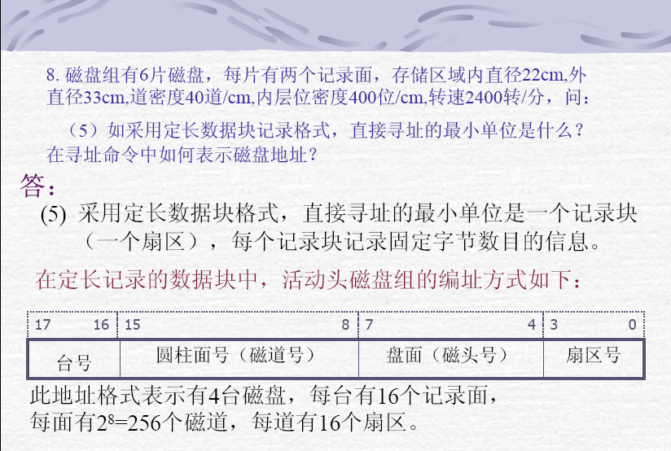

<!-- slide: 109 -->

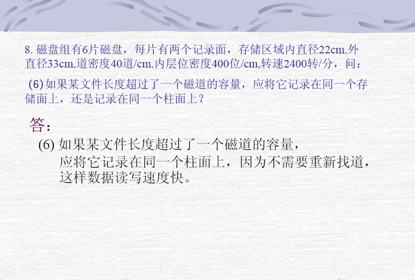
- 重点！

<!-- slide: 110 -->

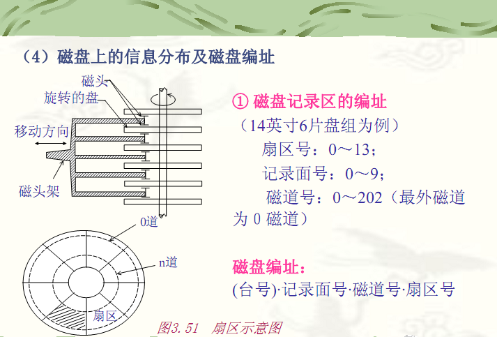

<!-- slide: 111 -->

## 1、硬磁盘存储器

- <number>
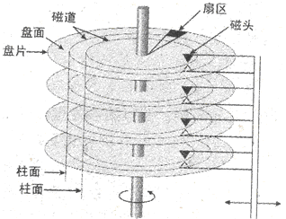
- 柱面由一组盘片的同一磁道在纵向上所形成的同心圆构成。
- 每一个记录面上均有一个磁头，所有记录面上的磁头均固定在步进电机上。
- 重点！

<!-- slide: 112 -->

<!-- slide: 113 -->

- 第八章    输入/输出系统

<!-- slide: 114 -->

## 单级程序中断处理过程

- （1）中断源的中断请求
- (中断响应周期)
- （2）中断响应
- （3）中断服务程序
- 【单中断】
- 中断返回
- 开中断
- 中断处理事件
- 保护现场
- 恢复现场
- 重点！

<!-- slide: 115 -->

- Y
- N
- Y
- Y
- N
- 当前指令执行周期
- DMA周期
- 发中断应答INTA接收中断向量VA
- 中断处理程序实体
- 设置新的中断范围
- 保护寄存器
- 开中断
- 恢复寄存器
- 关中断(0→IF)
- PC,PSW入栈
- 中断返回
- (恢复PSW,PC)
- 下条指令取指周期
- 取中断处理程序入口地址送入PC,
- 有不可屏蔽中断?
- 有可屏蔽中断?
- CPU允许中断IF=1?
- 有DMA请求?
- 中断响应
- 周期
- 硬件完成
- 软件完成
- N
- N
- 【多级中断】

<!-- slide: 116 -->

- 2.DMA的概念
- DMA方式是一种在I/O数据交换过程完全由硬件(DMA控制器)实现外设与内存直接交换信息的工作方式。
- 在这种方式下，DMA控制器从CPU完全接管对总线的控制，数据交换不经过CPU，而直接在内存与外设之间进行。由于CPU根本不参加传送操作，因此省略了CPU取指令、取数和送数等操作。在数据传送过程中，也不需要像中断方式那样执行现场保存、现场恢复等工作。内存地址的修改、传送字个数的计数也直接由硬件完成，而不是用软件实现。
- 在这种方式下，数据传送前的准备工作，以及传送结束后的处理工作都是由CPU软件完成。由硬件线路直接实现的DMA控制器仅负责数据传送。
- 重点！

<!-- slide: 117 -->

- 2．DMA数据传送过程
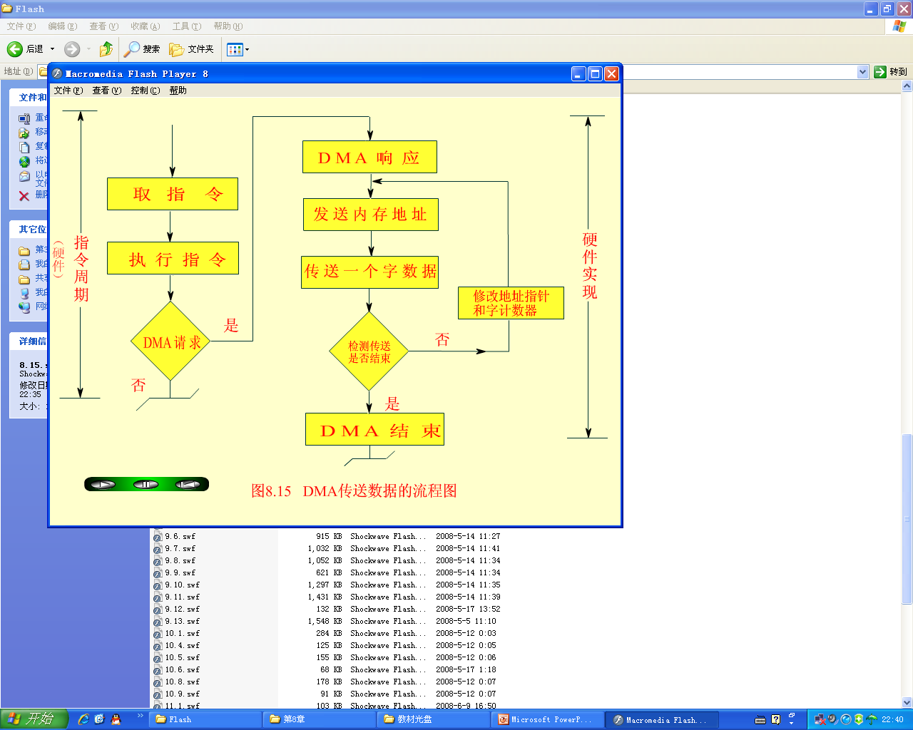

<!-- slide: 118 -->

<!-- slide: 119 -->

## 比较：

- 通道：可以实现对外设的统一管理和外设与内存之间的数据传送，大大提高了CPU的工作效率，一般用在服务器上。
- DMA：数据传送速率很高，传送速率仅受到内存访问时间的限制。需要更多硬件，适用于内存与高速外设之间大批数据交换的场合。
- 中断：一般适用于随机出现的服务，一旦提出要求应立即执行，节省CPU时间开销。

<!-- slide: 120 -->

<!-- slide: 121 -->

- 第九章 并行组织与结构

<!-- slide: 122 -->

- 9.3  并行计算机的分类
- 访存模型                       结构模型
- *可扩展性分析：
- UMA可扩展性较差，其他较好。
- 影响因素—互连网络、组装、访问带宽与延时等。
- MIMD
- 多处理机
- (单地址空间)
- 多计算机
- (多地址空间)
- 分布式存储器
- (NUMA)
- 集中式存储器
- (UMA)
- COMA
- CC-NUMA
- NCC-NUMA
- 松耦合多计算机
- (NORMA)
- 紧耦合多计算机
- (NORMA)
- PVP
- SMP
- DSM
- COW
- MPP
- SC-NUMA
- SC-NUMA：software-coherent NUMA
- SIMD

<!-- slide: 123 -->

- •••
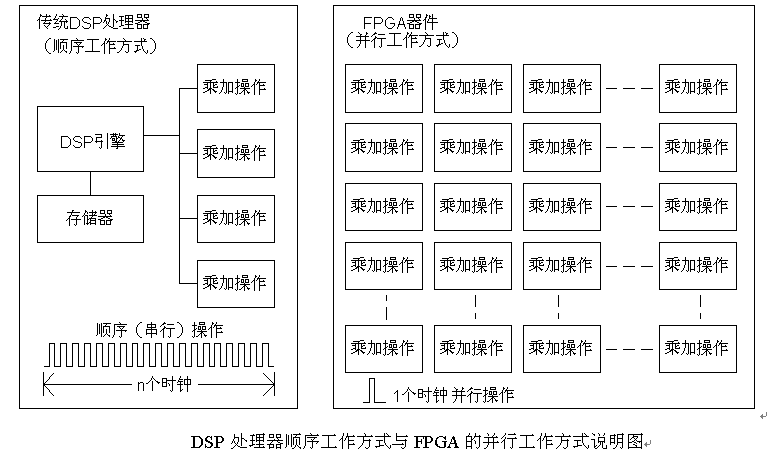
- SIMD: 向量处理器

<!-- slide: 124 -->

- •••
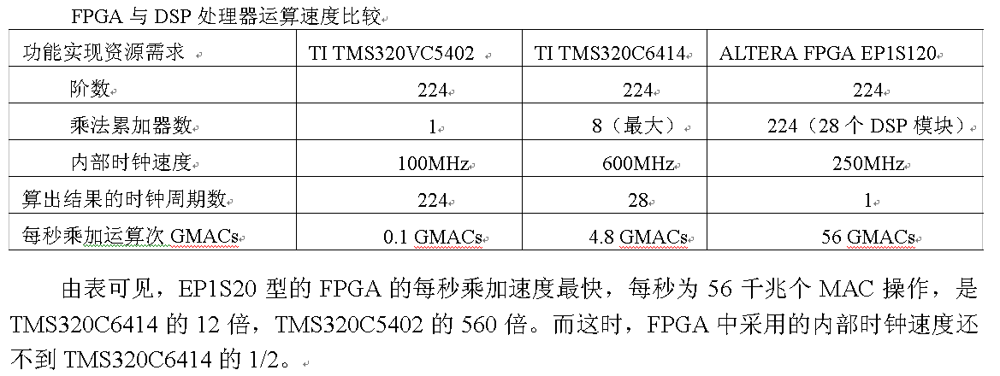
- SIMD: 向量处理器

<!-- slide: 125 -->

- 共享存储多处理机
- *结构特点：
- 紧耦合(通过MEM总线互连)MIMD系统；
- 所有存储器构成单一地址空间。
- *访存特点：
- 处理机可直接访问所有存储器，且访问时间均相同；
- 各节点间通过共享变量方式实现通信。
- PM互连网络
- ···
- P1/C1
- 注：P--处理机(带CU)
- PE—处理单元(不带CU)
- C--高速缓存
- SM--共享存储器
- D--I/O设备
- D1
- P2/C2
- Pn/Cn
- SM1
- ···
- SM2
- SMm
- PIO互连网络
- Dd
- ···

<!-- slide: 126 -->

- 并行向量处理机(PVP)
- *定义：由多个向量处理器(VP)构成的能够并行处理多个向量的向量多处理机，又称多向量机。
- 互连网络(纵横交叉开关)
- …
- VP
- VP
- VP
- …
- SM
- SM
- SM
- 并行向量处理机PVP
- *特点：属MIMD类型机；
- 每个VP按地址可访问所有共享存储器。
- *节点互连：
- 能够同时实现任意节点间互连；
- 一般采用交叉开关实现(n入到达任意n出)。

<!-- slide: 127 -->

- 对称多处理机(SMP)
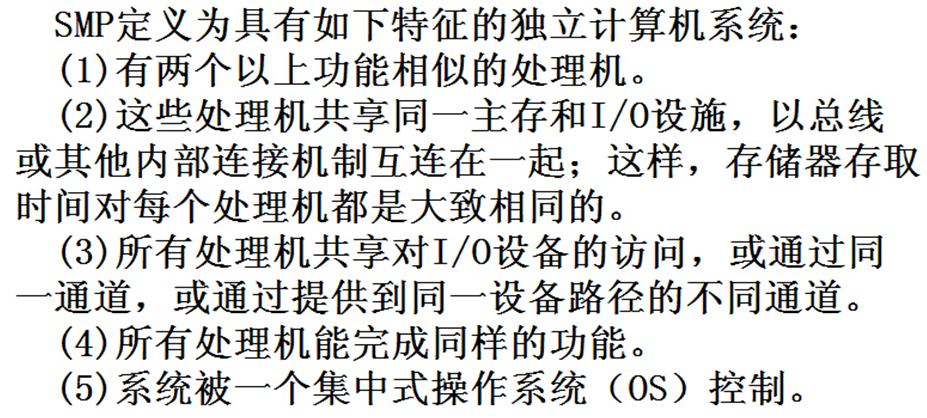
- 重点！

<!-- slide: 128 -->

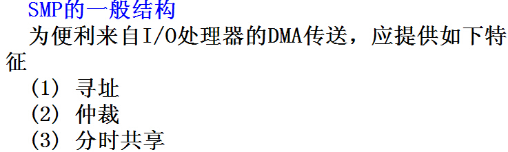
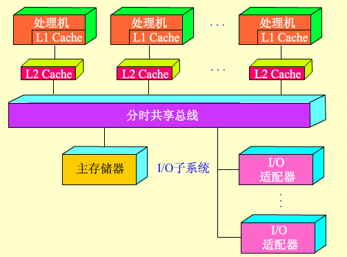

<!-- slide: 129 -->

- 分布存储多处理机
- *节点：由处理器、存储器和I/O设备组成的计算机。
- *结构特点：
- 松耦合(通过I/O总线互连)MIMD系统；
- 所有存储器构成多个地址空间。
- *访存特点：处理机只能直接访问本地局部存储器；
- 各节点间通过消息传递方式实现通信。
- 互连网络
- ···
- 注：LM--局部存储器；NIC--网络接口电路
- LM1
- NIC1
- P1 /C1
- MB
- 节点1
- 节点n
- 互连网络
- ···
- 节点n
- LM1
- NIC1
- P1 /C1
- MB
- 节点1
- Bridge1
- IOB

<!-- slide: 130 -->

- 分布共享存储多处理机(DSM)
- *结构特点：
- 根据互连方式，分为紧耦合和松耦合MIMD系统；
- 所有存储器构成单一地址空间(硬件或软件实现)。
- *访存特点：
- 处理机可直接访问所有存储器，但访问时间不相同；
- 各节点间通过共享变量方式实现通信。
- 互连网络
- ···
- 注：M--硬件或软件全局编址的存储器
- M1
- NIC1
- P1 /C1
- MB
- 节点1
- 节点n
- 互连网络
- ···
- 节点n
- M1
- NIC1
- P1 /C1
- MB
- 节点1
- Bridge1
- IOB

<!-- slide: 131 -->

- *结构比较：
- 纵横交叉开关
- ···
- VP
- 并行向量处理机PVP
- VP
- VP
- ···
- SM
- SM
- SM
- 总线或纵横交叉开关
- ···
- P/C
- 对称多处理机SMP
- P/C
- P/C
- ···
- SM
- SM
- SM
- 分布共享存储器多处理机DSM
- 定制网络
- ···
- MB
- P/C
- LM
- NIC
- DIR
- MB
- P/C
- LM
- NIC
- DIR
- 大规模并行处理机MPP
- MB
- P/C
- LM
- NIC
- 定制网络
- ···
- MB
- P/C
- LM
- NIC
- 工作站机群COW
- 商品化网络(以太网、ATM等)
- MB
- P/C
- LM
- NIC
- Bridge
- LD
- IOB
- ···
- MB
- P/C
- LM
- NIC
- Bridge
- LD
- IOB

<!-- slide: 132 -->

| 属性 | SIMD | PVP | SMP | MPP | DSM | COW |
|---|---|---|---|---|---|---|
| 同构性 | SIMD | MIMD | MIMD | MIMD | MIMD | MIMD |
| 同步性 | 指令级 同步 | 异步 或松同步 | 异步 或松同步 | 异步 或松同步 | 异步 或松同步 | 异步 或松同步 |
| 通信机制 | 数据并行 | 共享变量 | 共享变量 | 消息传递 | 共享变量 | 消息传递 |
| 地址空间 | 单空间 | 单空间 | 单空间 | 多空间 | 单空间 | 多空间 |
| 访存模型 | UMA | UMA | UMA | NORMA | NUMA | NORMA |
| 互连网络 | 定制 | 交叉开关 | 总线或 交叉开关 | 定制 | 定制 | 商用 |

- *结构模型特性比较：
- *可扩展性分析：
- PVP、SMP相对较差，其他较好。
- 影响因素—互连网络、访问带宽与延迟、组装技术等。

<!-- slide: 133 -->

- 谢谢！
