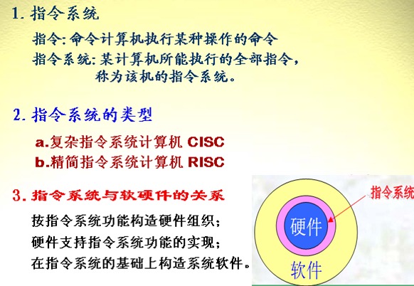
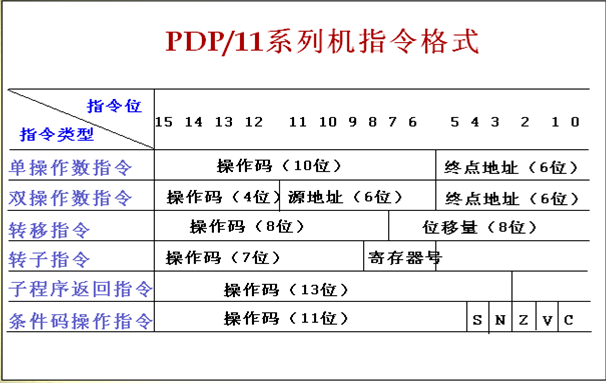
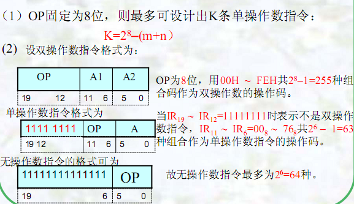
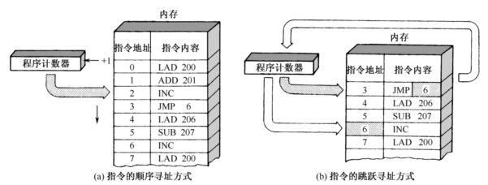

# 第4章习题解答

<!-- slide: 1 -->

- 第 4 章  习题讲解
- P137   习题  5、6、8、9 题

<!-- slide: 2 -->

<!-- slide: 3 -->

- •••
- 计算机系统的层次结构（软件）
- 微指令直接由硬件执行。
- 由微程序解释机器指
- 令系统，属硬件级。
- 由操作系统程序实现。
- 由汇编程序支持执行。
- 由高级语言编译程序
- 支持执行。
- 第5层
- 编译程序
- 高级语言层
- 第4层
- 汇编程序
- 汇编语言层
- 第3层
- 操作系统
- 操作系统层
- 第2层
- 微程序
- 机器语言层
- 第1层
- 微指令直接由硬件执行
- 微程序设计层
- 逻辑电路

<!-- slide: 4 -->

## 指令系统的发展演变

- CISC：复杂指令集（Complex Instruction Set Computer）
- 具有大量的指令和寻址方式（更接近高级程序语言）
- 80/20原则：80%的程序只使用20%的指令
- 大多数程序只使用少量的指令就能够运行。
- RISC：精简指令集（Reduced Instruction Set Computer)
- 在数据通道中只包含最有用的指令
- 确保数据通道快速执行每一条指令
- 使CPU硬件结构设计变得更为简单

<!-- slide: 5 -->

## 指令系统的发展演变

- <number>
- “复杂指令系统计算机”，简称CISC（Complex Instruction Set Computer）
  - 指令格式不固定，寻址方式丰富，功能复杂
  - 一些比较简单的指令，在程序中仅占指令系统中指令总数的20%，但出现的频率却占80%；占指令总数20%的最复杂的指令，却占用了控制存储器容量的80%，且使用频率却不高。

<!-- slide: 6 -->

## 精简指令系统计算机（Reduced Instruction Set Computer，简称RISC）

RISC体系结构的三个要素：
 一个有限的简单指令集。
 CPU配备大量的通用寄存器。
 强调指令流水线的优化。

- 指令系统的发展演变

<!-- slide: 7 -->

## （1） 指令系统设计时选择一些使用频率较高的简单指令，且选择一些很有用但不复杂的指令。
（2） 指令长度固定，指令格式种类少，寻址方式种类少。
（3） 只有取数/存数指令访问存储器，其余指令的操作都在寄存器之间进行。

- RISC的特点
- 指令系统的发展演变

<!-- slide: 8 -->

## （4） 采用流水线技术。超级标量及超级流水线技术，增加了指令执行的并行度，使得一条指令的平均指令执行时间小于一个机器周期。
（5） CPU中通用寄存器数量相当多，可以减少访存次数。
（6） 以硬布线控制逻辑为主，不用或少用微码控制。
（7） 采用优化的编译程序，力求有效地支持高级语言程序。

- <number>
- RISC的特点
- 指令系统的发展演变

<!-- slide: 9 -->

## 一、指令的基本格式

- <number>
- 指令是由操作码和地址码两部分组成的:

| 操作码字段（OP） | 地址码字段（A） |
|---|---|

- 操作码：用来指明该指令所要完成的操作，如加法、减法、传送、移位、转移等等。
  - 位数反映了机器的操作种类，也即机器允许的指令条数，如果操作码有n位二进制数,则最多可表示2n种指令。
- 地址码：用来寻找运算所需要的操作数（源操作数和目的操作数）。
  - 地址码包括：源操作数地址、目的操作数地址和下一条指令的地址。通常还包含寻址方式码 。
  - A的位数越多，在内存中访问的范围（寻址范围）越大。
  - 地址含义：主存的地址、寄存器地址或者I/O设备地址。

<!-- slide: 10 -->

## 二、指令分类

- <number>
- 按照功能分类
- 按照操作码分类
- 按照指令字长分类
- 按照地址码分类
- 操作码扩展技术

<!-- slide: 11 -->

## 1、按照功能分类

- 1．数据传送指令
- 存数取数指令，传送指令，成组传送，字节交换，清累加器AC,堆栈指令等。
- 功能：M ↔M、R ↔ R、M ↔ R
- 2. 算术逻辑运算指令
- 功能：实现数据信息的加工，代码的转换、判断等。
- ①. 算术运算指令
- 定/浮点加减乘除、求补、算术移位、比较等。
- ② 逻辑运算指令
- ‾‾、∧、∨、⊕、逻辑移位、装配、拆卸等。

<!-- slide: 12 -->

## 1、按照功能分类

- 3. 程序控制指令
- 功能：控制指令的转向
- 包括：无条件转移，条件转移，调用，返回，
- 中断返回等指令。
- 4.I/O指令
- 功能：
- ① 控制外设的动作；
- ② 测试外设的工作状态；
- ③ 实现外设与主机间的数据交换。
- 5.其他指令
- PSW的置位、复位，测试指令，堆栈指令，特权指令，停机指令，控制台指令等。

<!-- slide: 13 -->

- 单字长指令：

| OP |
|---|

- 双字长指令：

| OP |  |
|---|---|

- 三字长指令：

| OP |  |
|---|---|

- 是一种可变字长形式
- IBM370指令格式
- 操作数地址
- 操作数地址1
- 操作数地址2
- 2、按照操作码分类

<!-- slide: 14 -->

- 2、按照操作码分类

<!-- slide: 15 -->

## 例：

| OP | A1 | A2 | A3 |
|---|---|---|---|

| 0000 0001 : 1110 | A1 A1 : A1 | A2 A2 : A2 | A3 A3 : A3 |
|---|---|---|---|

- 4位操作码,15条三地址指令

| 1111 1111 : 1111 | 0000 0001 : 1110 | A2 A2 : A2 | A3 A3 : A3 |
|---|---|---|---|

- 8位操作码,15条二地址指令

| 1111 1111 : 1111 | 1111 1111 : 1111 | 0000 0001 : 1110 | A3 A3 : A3 |
|---|---|---|---|

- 12位操作码,15条一地址指令

| 1111 1111 : 1111 | 1111 1111 : 1111 | 1111 1111 : 1111 | 0000 0001 : 1111 |
|---|---|---|---|

- 16位操作码
- 操作码扩展技术

<!-- slide: 16 -->

- 第4章   典型习题与解答

<!-- slide: 17 -->

- 第4章   典型例题

<!-- slide: 18 -->

## 三地址指令

| OP | A1 | A2 | A3 |
|---|---|---|---|

- 指令意义：
- (A1) OP (A2)  A3
- 优点：适用于需保留操作数的场合。
- 缺点：指令码长。所以只在字长较长的大、中型机中    使用，而小型、微型机中很少使用
- 4、按照地址码分类

<!-- slide: 19 -->

## 二地址指令

| op | A1 | A2 |
|---|---|---|

- 指令意义：
- （A1）OP（A2）→A1
- 特点
- ①指令码长度适中，使用方便。
- ②执行指令后，目的地址A1 中的操作数被运算结果所取代。
- 4、按照地址码分类

<!-- slide: 20 -->

- 按操作数的来源分  RR型、SS型和RS型三种
- RR型指令
- SS型指令
- RS型指令
- ---两个操作数均来自寄存器的指令
- ---两个操作数均来自内存的指令
- ---操作数分别来自寄存器和内存的指令
- 4、按照地址码分类
- 二地址指令

<!-- slide: 21 -->

## 一地址指令

| OP | A |
|---|---|

- 指令意义：
- ①对于单操作数指令
- OP (A)  AC
- AC——累加器
- 例如 LDA  48指令，执行(MEM)48 AC的操作。
- ②对于双操作数指令
- （AC）OP（A）→AC
- A——显地址
- AC——隐含地址，是隐含的寻址方式
- 优点：特别适用于只需一个地址的指令，指令字长度短。
- 例如：“+1”、“-1”、“求反”等指令。
- 缺点：对于两个操作数都来自内存的运算，速度慢。
- 4、按照地址码分类

<!-- slide: 22 -->

## 4、按照地址码分类

- <number>
- 零地址指令
  - 不涉及操作数：如NOP、HLT指令
  - 操作数隐含：如PUSH、POP指令

| OP |
|---|

<!-- slide: 23 -->

## 【题4-5】指令格式结构如下所示，试分析指令格式及 
         寻址方式的特点。

| OP | 寻址方式 | 寄存器 | 寻址方式 | 寄存器 |
|---|---|---|---|---|

| 15              12 | 11              9 | 8               6 | 5             3 | 2                0 |
|---|---|---|---|---|

- 答:
- ① 所示指令是单字长二地址指令。
- ② 操作码字段OP有4位，可以指定24＝16条指令。
- 第4章   习题讲解
- ③ 寻址方式有23＝8种，可以是RR、RS或SS型指令。

<!-- slide: 24 -->

## 2、指令的寻址方式

- 1． 什么叫寻址方式？（编址、选址、定址方式）
- 形成操作数地址或指令地址的方法方式。
- 2． 术语
- 形式地址D
- 有效地址E
- —指令中给出的地址码。
- —操作数（或指令）的真实地址。

<!-- slide: 25 -->

## 一、指令寻址

- 1、  顺序寻址方式
  - 控制器中使用程序计数器PC来指示指令在内存中的地址。在程序顺序执行时，指令的地址码由PC自加1得出。
  - 指令在内存中按顺序存放，当顺序执行一段程序时，根据PC从存储器取出当前指令， PC自动＋1，然后执行这条指令；接着又根据PC指示从存储器取出下一条指令， PC自动＋1， 执行……。
- 2、跳跃寻址方式
  - 当程序执行转移指令时，程序不再顺序执行，而是跳转到另一个地址去执行，此时，由该条转移指令的地址码字段可以得到新指令地址，然后将其置入PC中。
- 应用：
- ① 程序转移、子程序调用、程序中断；
- ② 循环程序。

<!-- slide: 26 -->

- <number>

- 一、指令寻址
- 1、  顺序寻址方式
- 2、跳跃寻址方式

<!-- slide: 27 -->

## 二、数据寻址

- <number>
- 1、隐含寻址
- 2、立即寻址
- 3、直接寻址
- 4、间接寻址
- 5、寄存器寻址
- 6、寄存器间接寻址
- 7、偏移寻址： 变址寻址/基址寻址 /相对寻址
- 8、段寻址
- 9、堆栈寻址

<!-- slide: 28 -->

- 【题4-6 】 R为变址寄存器， R1为基址寄存器，PC为程序计数器

| OP | I | X | D |
|---|---|---|---|

- 寻址方式
- I
- X
- 有效地址E
- （1）
- 0
- 00
- E＝D
- （2）
- 0
- 01
- E＝（PC）±D
- （3）
- 0
- 10
- E＝（R）±D
- （4）
- 0
- 11
- E＝（R1）±D
- （5）
- 1
- 00
- E＝（D）
- （6）
- 1
- 11
- E＝（（R1）±D ）
- D=0
- 解：
- （1）直接寻址
- （2）相对寻址
- （3）变址寻址
- （4）基址寻址
- （5）间接寻址
- （6）寄存器二次间址
- 第4章   习题讲解

<!-- slide: 29 -->

- [题4-8]  某机字长为32位，主存容量为1M，单字长指令，有50种操作码，采用寄存器寻址、寄存器间接寻址、立即、直接等寻址方式。CPU中有PC、IR、AR、DR和16个通用寄存器。问：   （1）指令格式如何安排？（2）能否增加其它寻址方式？
- 第4章   习题讲解
- （1）解：
- ① 50种操作码，则字段OP必须有6位，可以指定26＝64条指令。
- ② 16个通用寄存器，则寄存器标志必须有4位，可以指定24＝16个寄存器。
- ③ 至少4种寻址方式，则寻址标志必须有2位，可以指定22＝4种寻址方式。

<!-- slide: 30 -->

- 单字长二地址指令：

| OP | 寻址方式 | 寄存器 | 位移量D |
|---|---|---|---|

| 31              26 | 25        24 | 23              20 | 19                      0 |
|---|---|---|---|

- 单字长单地址指令：

| OP | 寻址方式 | 源寄存器 | 目的寄存器 | 位移量D |
|---|---|---|---|---|

| 31              26 | 25        24 | 23          20 | 19            16 | 15              0 |
|---|---|---|---|---|

- （2）解：可以增加其他寻址方式，寻址标志位扩充到2位以上，原因如下：
- ② 寄存器字长32位，可以寻址空间232＝4GB；可以满足题目的要求
- ① 主存容量1M，要求寻址空间220＝1MB。

<!-- slide: 31 -->

- 寄存器号
- 指令
- 操作数
- 寄存器堆
- 寄存器寻址方式：
- 寄存器号
- 指令
- 寄存器堆
- EA
- 寄存器间接寻址方式：
- 操作数
- 存储器

- 第4章   习题讲解

<!-- slide: 32 -->

- [题4-9]  CPU中有16个32位通用寄存器，设计一种能容纳64种操作的指令系统。如果采用通用寄存器作基址寄存器，则RS型指令的最大存储空间是多少？
- 第4章   习题讲解
- 解：
- ① 64种操作码，则字段OP必须有6位，可以指定26＝64条指令。
- ② 16个通用寄存器，则寄存器标志必须有4位，可以指定24＝16个寄存器。
- ③ 题目要求基址寻址，而且是RS型指令，所以肯定是单字长二地址指令

<!-- slide: 33 -->

- 单字长二地址指令：
- ① 寄存器字长32位，可以寻址空间232B；
- ③ 所以最大寻址空间232+218＝4G+256K B。

| OP | 源寄存器 | 目的寄存器 | 位移量D |
|---|---|---|---|

| 31              26 | 25        22 | 21              18 | 17                      0 |
|---|---|---|---|

- ② 位移量D字长18位，可以寻址空间218B；

<!-- slide: 34 -->

## 指令系统 举例

- <number>
- 不用专门的MOD字段指出寻址方式，寻址方式由指令码定义。

| 0000 | ** | Rd |
|---|---|---|
| DATA |  |  |

| 0001 | Rs | ** |
|---|---|---|
| Addr |  |  |

| 0100 | ** | Rd |
|---|---|---|
| Addr |  |  |

- 1.  MOV1  #DATA , Rd ;
- DATARd
- 2. MOV2  Rs, [Addr];
- (Rs)Addr
- 3. ADD  [Addr], Rd;
- (Addr)+(Rd)Rd

<!-- slide: 35 -->

## 4.   IN Rd,[Addr];
      (Port Addr)Rd

- <number>

| 11 | 0000 | Rd |
|---|---|---|
| Port Addr |  |  |

- 5.   OUT [Addr],Rs;
- (Rs) Port Addr

| 11 | 0001 | Rs |
|---|---|---|
| Port Addr |  |  |

- 7. HLT

| 11 | 0011 | ** |
|---|---|---|

- 6.   Jmp [Addr];
- (Addr) PC

| 11 | 0010 | ** |
|---|---|---|
| Addr |  |  |

- 8. DEC Rd；(Rd)-1 Rd

| 11 | 0100 | Rd |
|---|---|---|

- JZ  Addr；FZ=1,则AddrPC; 否则结束

| 11 | 0101 | Rd |
|---|---|---|

- 9. INC Rd；(Rd)+1 Rd

| 11 | 0110 | ** |
|---|---|---|
| Addr |  |  |

<!-- slide: 36 -->

- <number>

| 程序 | 功能 | 汇编结果 (M地址：机器指令) |
|---|---|---|
| MOV1 #04H,R1 | 04HR1 | 00H:00000001 |
|  |  | 01H:00000100 |
| MOV2 R1, [11H] | (R1)11H | 02H:00010100 |
|  |  | 03H:00010001 |
| IN [01H], R1 | (INPUT DEVICE)R1 | 04H:11000001 |
|  |  | 05H:00000001 |
| MOV2 R1, [10H] | (R1)10H | 06H:00010100 |
|  |  | 07H:00010000 |
| IN [01H], R1 | (INPUT DEVICE)(R1) | 08H:11000001 |
|  |  | 09H:00000001 |
| ADD [10H], R1 | (10H)+(R1)R1 | 0AH:00100001 |
|  |  | 0BH:00010000 |
| OUT R1, [02H] | (R1)OUTPUT DEVICE | 0CH:11000101 |
|  |  | 0DH:00000010 |
| JMP [11H] | (11H)PC | 0EH:11001000 |
|  |  | 0FH:00010001 |

<!-- slide: 37 -->

## 课堂练习

- <number>
- 设某8位计算机指令格式如下：

| OP（4位） | SR（2位） | DR（2位） |
|---|---|---|
| A DDR/ DATA / DISP |  |  |

- 其中， SR为源寄存器号， DR为目的寄存器号，指令第二字为地址、数据或偏移量。
- 注意：除了HALT指令为单字指令外，其他指令均为双字指令；

<!-- slide: 38 -->

## 下面是该模型机的指令系统的一部分：

- <number>

| 指令助记符 | 功能 | OP |
|---|---|---|
| MOV1	DR,DATA | DATA→DR | 0000 |
| MOV2	[ADDR],SR | SR→ADDR | 0001 |
| ADD DR,[[ADDR]] | （DR）＋（（ADDR））→DR | 1000 |
| SUB DR,[SI+ADDR] | （DR）－（（SI）+ADDR）→DR | 1001 |
| JMP	    DISP | （PC）＋DISP→PC | 1100 |
| …… | …… | …… |
| HALT | 停机 | 1111 |

<!-- slide: 39 -->

## 内存地址的部分单元内容如下：

- <number>

| 单元地址 | 内容 | 单元地址 | 内容 | 单元地址 | 内容 |
|---|---|---|---|---|---|
| 10H | 80H | 20H | 01H | 24H | 91H |
| 11H | 90H | 21H | 23H | 25H | 01H |
| 12H | 10H | 22H | 81H | 26H | F0H |
| 13H | 11H | 23H | 12H | 27H | 20H |

- 若（PC）＝20H，变址寄存器（SI）＝10H，则此时启动程序执行，问执行了几条指令程序停止？写出每条指令的助记符、寻址方式、EA、操作数和执行结果。

<!-- slide: 40 -->

## 内存地址的部分单元内容如下：

- <number>

| 单元地址 | 指令码 | 助记符 | 寻址方式 | EA | 操作数 | 执行结果 |
|---|---|---|---|---|---|---|
| 20H | 01H | MOV1 R1,23H | 立即数 | ―― | 23H | （R1）＝23H |
| 21H | 23H |  |  |  |  |  |
| 22H | 81H | ADD R1, [[12H]] | 间接寻址 | （12H）＝10H | （10H）＝80H | （R1）＝23H＋80H＝0A3H |
| 23H | 12H |  |  |  |  |  |
| 24H | 91H | SUB R1, [SI+01H] | 变址寻址 | （SI）+01H＝11H | （11H）＝90H | （R1）＝0A3H－90H＝13H |
| 25H | 01H |  |  |  |  |  |
| 26H | F0H | HALT | ―― | ―― | ―― | ―― |
