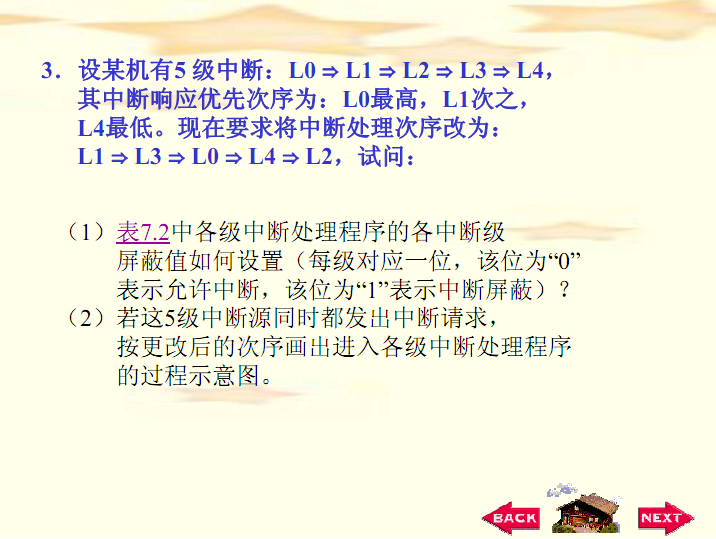
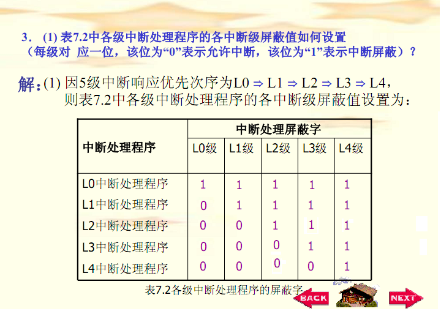
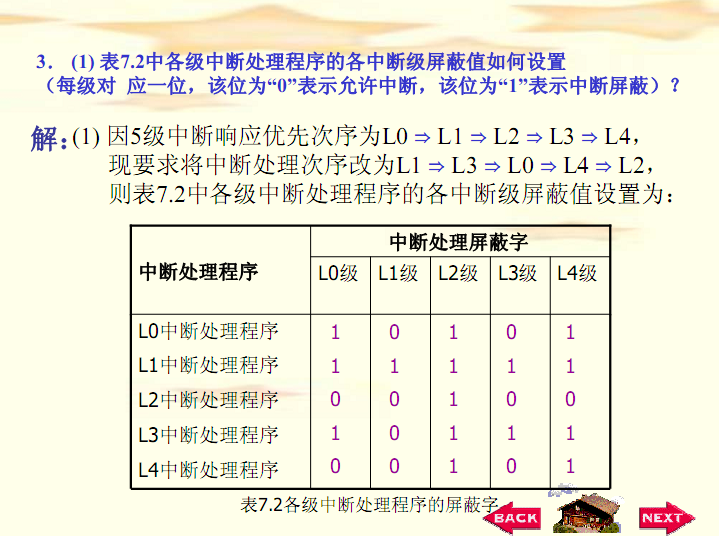
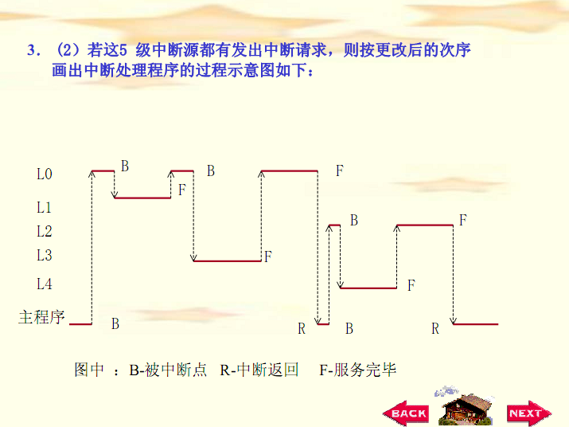
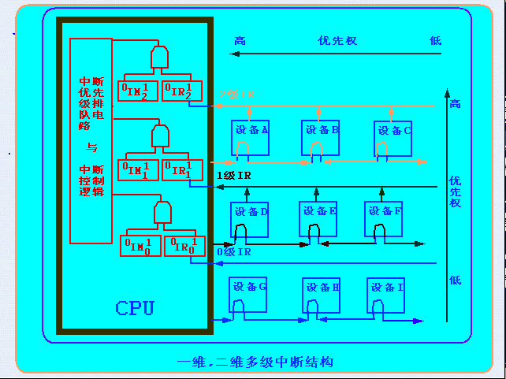

# 第8章 习题讲解

<!-- slide: 1 -->

- 第八章    习题讲解

<!-- slide: 2 -->

- 作业:
- 第 8、 9、 11、12、16题
- 附加题：
- CPU响应中断应具备哪些条件？画出中断处理过程流程图。

<!-- slide: 3 -->

<!-- slide: 4 -->

<!-- slide: 5 -->

<!-- slide: 6 -->

<!-- slide: 7 -->

- 【题11】课本  图8.9

<!-- slide: 8 -->

- 【例1】请问：
- (1)在中断情况下，CPU和设备的优先级如何考虑?请按降序排列各设备的中断优先级。
- (2)若CPU现执行设备E的中断服务程序，IM2，IM1，IM0的状态是什么?如果CPU执行设 备H的中断服务程序，IM2，IM1，IM0的状态又是什么?
- (3)每一级的IM能否对某个优先级的个别设备单独进行屏蔽?如果不能，采取什么办法可达到目的?
- (4)假如设备C一提出中断请求，CPU立即进行响应，如何调整才能满足此要求?

<!-- slide: 9 -->

- (1)在中断情况下，CPU的优先级最低。各设备的优先次序是：A→B→C→ D→E→F→G→H→I→CPU。
- (2)执行设备E的中断服务程序时，IM2 IM1 IM0=011；
- 执行设备H的中断服务程序时，IM2 IM1 IM0=001。
- (3)每一级的IM标志不能对某个优先级的个别设备进行单独屏蔽。可将接口中的EI(中断允许)标志清“0”，它禁止设备发出中断请求。
- (4)要使设备C的中断请求及时得到响应，可将设备C从第2级取出来，单独放在第3级上，使第3级的优先级最高，即令IM3=0即可。

<!-- slide: 10 -->

## 题16

- 通道：可以实现对外设的统一管理和外设与内存之间的数据传送，大大提高了CPU的工作效率。
- DMA：数据传送速率很高，传送速率仅受到内存访问时间的限制。需要更多硬件，适用于内存与高速外设之间大批数据交换的场合。
- 中断：一般适用于随机出现的服务，一旦提出要求应立即执行，节省CPU时间开销。

<!-- slide: 11 -->

## 附加题：响应中断的条件

- （1）在CPU内部“中断屏蔽”触发器为“0”（即不屏蔽）；
- （2）外设有中断请求时，“中断请求”触发器为“1”，保持中断请求信号；
- （3）外设（接口）的“中断允许”触发器必须为“1”，把外设中断请求送至CPU；
- （4）CPU现行指令的最后一个状态周期结束

<!-- slide: 12 -->

## 程序中断处理过程

- （1）中断源的中断请求
- (中断响应周期)
- （2）中断响应
- （3）中断处理
- （4）中断返回

<!-- slide: 13 -->

- Y
- N
- Y
- Y
- N
- 当前指令执行周期
- DMA周期
- 发中断应答INTA接收中断向量VA
- 中断处理程序实体
- 设置新的中断范围
- 保护寄存器
- 开中断
- 恢复寄存器
- 关中断(0→IF)
- PC,PSW入栈
- 中断返回
- (恢复PSW,PC)
- 下条指令取指周期
- 取中断处理程序入口地址送入PC,
- 有不可屏蔽中断?
- 有可屏蔽中断?
- CPU允许中断IF=1?
- 有DMA请求?
- 中断响应
- 周期
- 硬件完成
- 软件完成
- N
- N
