# 第三章 习题课

<!-- slide: 1 -->

- 第三章   习题讲解
- P111   习题  3、7 题
- P113  习题 22、 24题  (虚拟存储器)

<!-- slide: 2 -->

## 1、位扩展

- <number>
- 要点：
- （1）芯片的地址线A、读写控制信号WE#、片选信号CS#分别连在一起；
- （2）芯片的数据线D分别对应于所搭建的存储器的高若干位和低若干位。
- 复习:   存储器容量的扩充

<!-- slide: 3 -->

## 1MB RAM

- 8
- I/O
- ……
- A0
- D0
- 7
- I/O
- 6
- I/O
- 5
- I/O
- 4
- I/O
- 3
- I/O
- 2
- I/O
- 1
- 1Mⅹ1
- I/O
- 中  央
- 处理器
- (CPU)
- 数据总线
- 地址总线
- D7
- A19
- WE
- 1）字长位数扩展

<!-- slide: 4 -->

## 2、字扩展

- <number>
- 要求：
- 用1K×８位的SRAM芯片     2K×8位的SRAM存储器
- 复习:   存储器容量的扩充

<!-- slide: 5 -->

## 2、字扩展

- <number>
- 分析地址：
  - A10用于选择芯片
  - A9~A0用于选择芯片内的某一存储单元

<!-- slide: 6 -->

## 2、字扩展

- <number>
- 容量= 211× 8位
- 举例验证:
  - 读地址为 0的存储单元的内容
  - 读地址为 10 … 0 的存储单元 的内容

<!-- slide: 7 -->

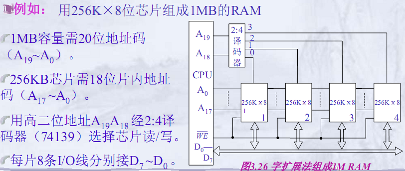
- 2）字存储容量扩展

<!-- slide: 8 -->

- 题 3-3(1)：16K*8位的DRAM芯片构成64K*32位存储器
- ，求该存储器的组成逻辑框图
- 8×16K
- D0～D31
- D0～D7
- D8～D15
- D16～D23
- D24～D31
- A0～A13
- CS3
- CS2
- CS1
- CS0
- 2:4 译码器
- CS3
- CS2
- CS1
- CS0
- A14
- A15

<!-- slide: 9 -->

- 解：
- 16K*8位的DRAM芯片中，存储电路由128行×128列的存储矩阵组成。
- 隐含条件: 单元刷新间隔是2ms。
- 题 3-3(2)：设存储器读/写周期为0.5μs, CPU在1μs内至少要访问一次，求刷新方式?
- 集中式刷新
- 分散式刷新
- 异步式刷新

<!-- slide: 10 -->

## 在2ms单元刷新间隔时间内，集中对128行刷新一遍，所需时间128×500ns=64μs，其余时间则用于访问操作。
在内部刷新时间（64μs）内，不允许访存，这段时间被称为死时间。

- 集中式刷新

<!-- slide: 11 -->

## 在任何一个存储周期内，分为访存和刷新两个子周期。
访存时间内，供CPU和其他主设备访问。
在刷新时间内，对DRAM的某一行刷新。
存储周期为存储器存储周期的两倍，即500ns×2＝1μs
刷新周期缩短，为128× 1 μs ＝128 μs。在2ms的单元刷新间隔时间内，对DRAM刷新了2ms÷128μs遍。

- 分散式刷新

<!-- slide: 12 -->

## 异步刷新采取折中的办法，在2ms内分散地把各行刷新一遍。
避免了分散式刷新中不必要的多次刷新，提高了整机速度；同时又解决了集中式刷新中“死区”时间过长的问题。
刷新信号的周期为2ms/128=15.625μs。让刷新电路每隔15μs产生一个刷新信号，刷新一行。

- 异步式刷新

<!-- slide: 13 -->

- 题 3-7：ROM区域0000H~3FFFH,8K*8位的RAM芯片构成40K*16位的RAM存储区,起始地址6000H,RAM芯片有/CS和/WE控制线，CPU地址总线A15~A0，数据总线D15~D0，控制信号/R/W和/MREQ（访存），求：
- （1）地址译码方案
- ROM
- 空
- RAM1
- RAM2
- RAM3
- RAM4
- RAM5
- 0000H
- 4000H
- 6000H
- 8000H
- A000H
- C000H
- E000H
- FFFFH
- 解： RAM1~5分别由2片8K*8位的
- RAM芯片并联而成.

<!-- slide: 14 -->

- 题 3-7 求：（2）逻辑连接图
- 3:8 译码器
- Y0
- A13
- A15
- ROM
- A14
- Y2
- Y3
- Y4
- Y5
- Y6
- Y1
- Y7
- RAM1
- RAM2
- RAM3
- RAM4
- RAM5
- CPU
- RAM1
- RAM2
- RAM3
- RAM4
- RAM5
- A0～A12
- D0～D15
- D0～D7
- D8～D15
- CS
- MREQ
- MREQ
- WE
- R/W
- A13
- A14
- A15
- CS
- EN
- A13

<!-- slide: 15 -->

## 三、存储器的层次结构

- <number>
- 访问速度越来越快
- 存储容量越来越大，每位的价格越来越便宜

<!-- slide: 16 -->

- <number>
- 存储器的主要性能特性比较

| 存储器 层次 | 通用 寄存器 | Cache | 主 存储器 | 磁盘 存储器 | 脱机 存储器 |
|---|---|---|---|---|---|
| 存储周期 | <10ns | 10～60 ns | 60～300ns | 10～30 ms | 2～20 min |
| 存储容量 | <512B | 8KB～2MB | 32MB～1GB | 1GB～1TB | 5GB～10TB |
| 价格 | 很高 | 较高 | 高 | 较低 | 低 |
| 材料工艺 | ECL | SRAM | DRAM | 磁表面 | 磁、光等 |

- ms（毫秒），μs（微秒），ns（毫微秒）
- 1s=1000ms，1ms=1000 μs

<!-- slide: 17 -->

## 1、Cache的特点

- <number>
- Cache是指位于CPU和主存之间的一个高速小容量的存储器，一般由SRAM构成。
- Cache功能：用于弥补CPU和主存之间的速度差异，提高CPU访问主存的平均速度。
- 设置Cache的理论基础，是程序访问的局部性原理: CPU执行程序所使用的存储单元是相对集中或小批簇聚于相邻单元中。
- Cache的内容是主存部分内容的副本，Cache的功能均由硬件实现，对程序员是透明的。
- 辅助硬件
- CPU
- 主存MS
- Cache
- 外存
- cache

<!-- slide: 18 -->

<!-- slide: 19 -->

<!-- slide: 20 -->

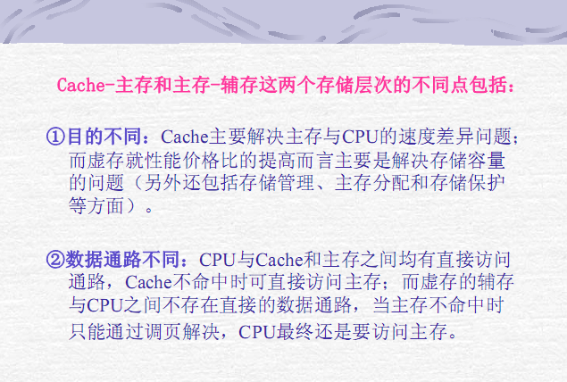

<!-- slide: 21 -->

<!-- slide: 22 -->

## 题22

- 被访问字在cache中概率：0.9
- 不在cache中在主存中的概率：(1-0.9)*0.6=0.06
- 不在cache也不在主存的概率：1-0.9-0.06=0.04
- 故该系统中访问一个字的平均时间：
- 15*0.9+(15+60)*0.06+(15+60+10M)*0.04
- = 400021 ns

<!-- slide: 23 -->

## 3、Cache的命中率

- <number>
- 命中率指CPU访问主存数据时，命中Cache的次数，占全部访问次数的比率；失效率就指不命中Cache的次数，占全部访问次数的比率。命中率h取决于程序的行为、Cache的容量、组织方式、块大小。
- 在一个程序执行期间，设Nc表示Cache完成存取的总次数，Nm表示主存完成存取的总次数，则命中率：
- 若tc表示Cache的访问时间，tm表示主存的访问时间，则Cache/主存系统的平均访问时间ta为：

<!-- slide: 24 -->

- 设                表示主存慢于cache的倍率,  e表示访问效率，
- ta 表示平均访问周期,    则有:
- 式中                     ( r=5~10为宜)
- 为提高访问效率，命中率h越接近1越好，r值以5—10为宜，不宜太大。命中率h与程序的行为、cache的容量、组织方式、块的大小有关。
- Cache/主存系统的访问效率e:

<!-- slide: 25 -->

- 【例5】CPU执行一段程序时，cache完成存取的次数为1900次，主存完成存取的次数为100次，已知cache存取周期为50ns，主存存取周期为250ns，求cache/主存系统的效率和平均访问时间。
- 【解】
- 平均周期ta
- 访问效率e
- 命中率h
- 主存慢于cache的倍率 r

<!-- slide: 26 -->

## Cache的原理图

- <number>

<!-- slide: 27 -->

## 二、主存与Cache的地址映射方式

- <number>
- 讨论的问题：如何根据主存地址，判断Cache有无命中并变换为Cache的地址，以便执行读写。有三种地址映射方式：
  - 1、全相联映射
  - 2、直接映射
  - 3、组相联映射
- 讨论前提：Cache的数据块称为行，主存的数据块称为块，行与块是等长的；主存容量为2m块，Cache容量为2c行，每个字块中含2b字。

<!-- slide: 28 -->

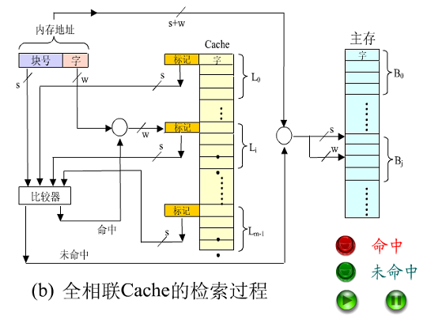

<!-- slide: 29 -->

<!-- slide: 30 -->

<!-- slide: 31 -->

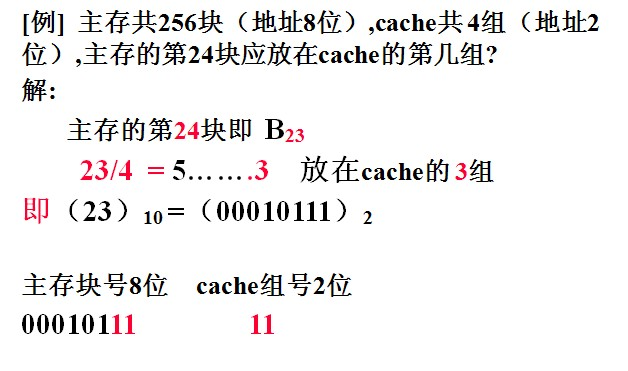

<!-- slide: 32 -->

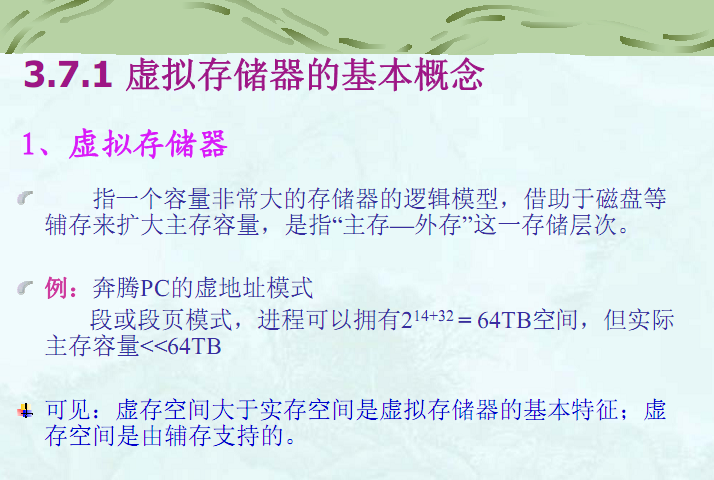

<!-- slide: 33 -->

- 虚实地址的变换过程（段式）
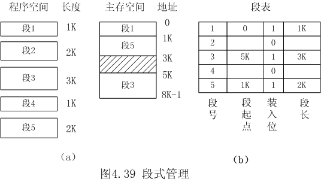

<!-- slide: 34 -->

- 虚实地址的变换过程（页式）

<!-- slide: 35 -->

- 虚实地址的变换过程（段页式）
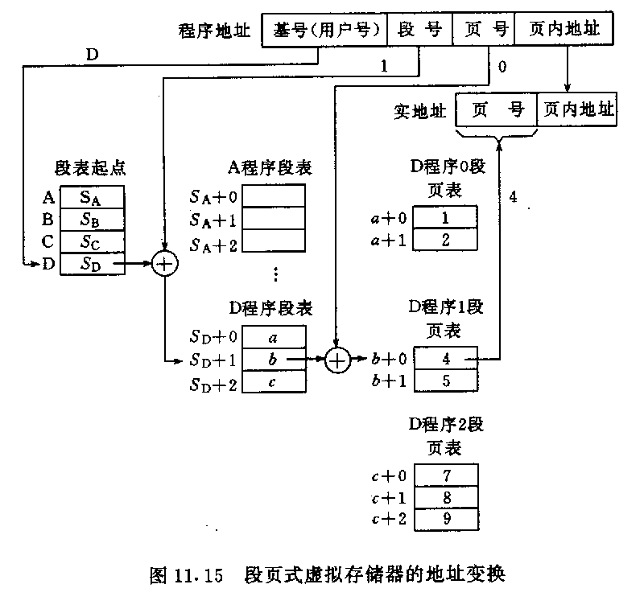

<!-- slide: 36 -->

<!-- slide: 37 -->

<!-- slide: 38 -->

## 转换后援缓冲器(TLB)/快表

- 由于页表通常在主存中，因而即使逻辑页已经在主存中，也至少要访问两次物理存储器才能实现一次访存，这将使虚拟存储器的存取时间加倍。为了避免对主存访问次数的增多，可以对页表本身实行二级缓存，把页表中的最活跃的部分存放在高速存储器中，组成快表。这个专用于页表缓存的高速存储部件通常称为转换后援缓冲器(TLB)。 保存在主存中的完整页表则称为慢表。

<!-- slide: 39 -->

## 转换后援缓冲器(TLB)/快表

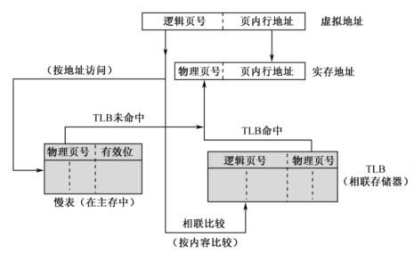

<!-- slide: 40 -->

<!-- slide: 41 -->

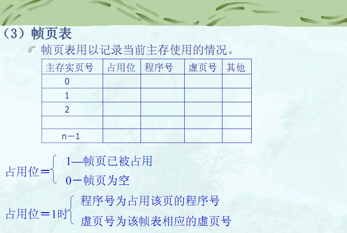

<!-- slide: 42 -->

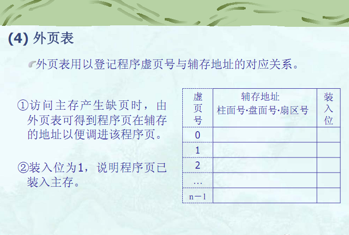

<!-- slide: 43 -->

<!-- slide: 44 -->

## 虚地址长度：5+10=15位
实地址长度：14位（16KB）
虚地址 0AC5(H)=   00010 1011000101
   虚页2，对应实页4，对应的实地址：
         0100 1011000101 即12C5(H)
虚地址 1AC5(H)= 00110 1011000101
   虚页6，无对应实页，发生页面中断：

- 题24

<!-- slide: 45 -->

## 高速存储器

- <number>
- 解决问题：弥补CPU与主存速度上的差异。
- 从存储器角度，解决问题的有效途径：
  - 主存采用更高速的技术来缩短存储器的读出时间，或加长存储器的字长；
  - 在CPU和主存之间加入一个高速缓冲存储器（Cache），以缩短读出时间；
  - 采用并行操作的多端口存储器；
  - 在每个存储器周期中存取几个字（多体交叉存储）。
- 空间并行：双端口存储器
- 时间并行：多体交叉存储器

<!-- slide: 46 -->

- 同一个存储体具有两套相互独立的读写控制电路，地址寄存器ARL、ARR和数据寄存器DRL、DRR。
- 图3.28 双端口存储器框图
- ARL
- DRL
- 读写电路L
- 译码器L
- 存 储 体
- 译码器R
- DRR
- 读写电路R
- ARR
- 判别逻辑
- AB
- AB
- DB
- DB
- CB
- CB
- 一、双端口存储器

<!-- slide: 47 -->

## 二、多体交叉存储器

- 模块板容量：16KB，板内地址码 A13~A0
- （1） 顺序方式
- A15A14 经译码产生选板信号。
- 特点：只需要一套电路         （AR，DR和读/写控制）
- 带宽仅为       ，T－存储周期
- 0
- 1
- 2
- …
- 16383
- 16384
- 16385
- 16386
- …
- 32767
- 32768
- 32769
- 32770
- …
- 49151
- 49152
- 49153
- 49154
- …
- 65535
- 模块号
- 15
- 14
- 13
- 0
- 数据寄存器
- DB (8位)
- 图3.29　顺序方式
- 内存地址
- M1
- M0
- M2
- M3

<!-- slide: 48 -->

## (2)交叉方式

- 模m交叉编址（m=2n，n为正整数）
- AMj＝m×i＋j
- 字
- AR0
- 0
- 4
- …
- 4i+0
- AR1
- 1
- 5
- …
- 4i+1
- AR2
- 2
- 6
- …
- 4i+2
- AR3
- 3
- 7
- …
- 4i+3
- 模块号
- 15
- 2
- 1
- 0
- 内存地址
- AB
- …
- …
- …
- …
- 65532
- 65533
- 65534
- 65535
- M1
- M2
- M3
- M0
- DR0
- DR1
- DR2
- DR3
- DB（8位）
- 图3.30　交叉方式
- i＝0,1…（L－1）是单模块的单元顺序号；
- j＝0,1…（m－1）是模块的编号。
- 特点：
- ①连续的存储单元依次   分布在相邻模块内。
- ②用硬件的冗余换取速度。
- 二、多体交叉存储器

<!-- slide: 49 -->

## 3、多模块存储器工作的时间关系

- (1) 等间隔时间启动
- 式中：T——存储周期
- 称为交叉存取度
- 交叉存储器要求模块数必须大于或等于m,确保再次启动某模块时,前次操作已完成.
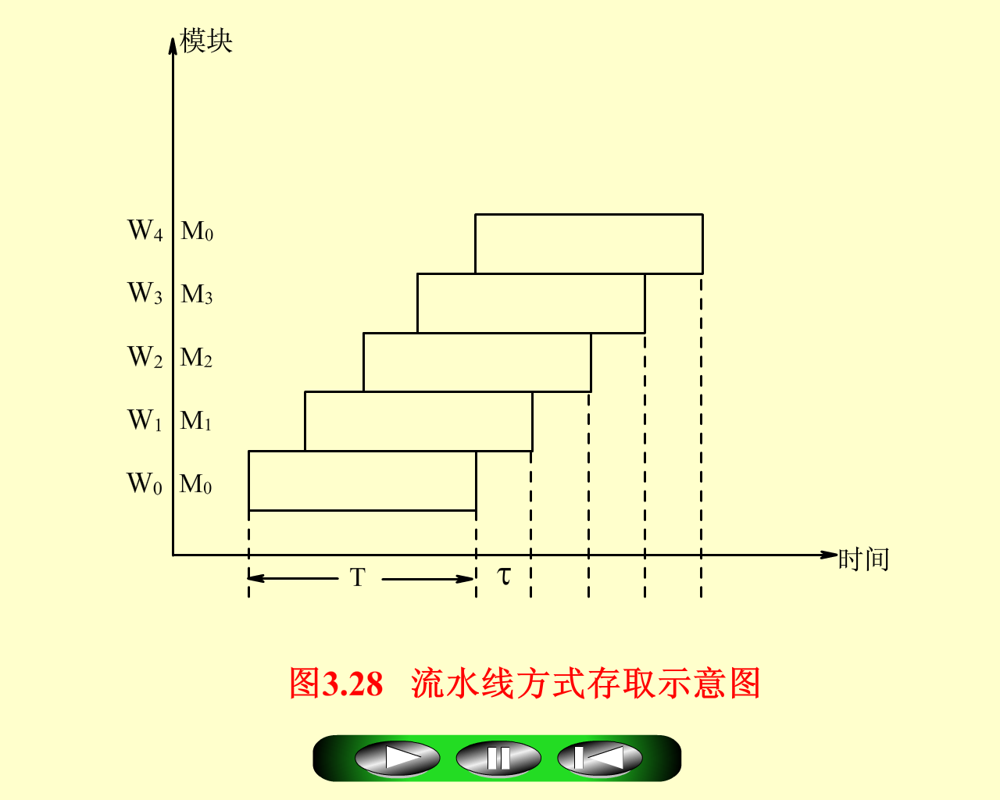

<!-- slide: 50 -->

## (2)理想情况下，交叉存储器读取m个字所需时间

- 顺序方式： t2 ＝
- 其中，T 为存储周期， τ 总线传送周期。
- 由于t1< t2 ,交叉存储器的带宽确实大大提高了。.

<!-- slide: 51 -->

## 【解】顺序存储器和交叉存储器连续读出m=4个字的信息总量：
            q＝64位×4＝256位	                   
     ① 顺序方式和交叉方式读出4个字所需时间分别是
           t1 ＝mT=4×200＝800（ns）
	      t2 ＝T+(m－1) τ ＝200＋3×50＝350（ns）

- ② 顺序方式和交叉方式的带宽分别是
- B1 ＝q/ t1 ＝256÷（800×10－9）＝32×107 （位/秒）
- B2 ＝q/ t2 ＝256÷（350×10－9）＝73×107 （位/秒）
- 【例】 设存储器容量为32字，字长64位，模块数m=4，分别用顺序方式和交叉方式进行组织。存储周期=200ns，数据总线宽度为64位，总线传送周期  τ =50ns。问顺序存储器和交叉存储器的带宽各是多少?
