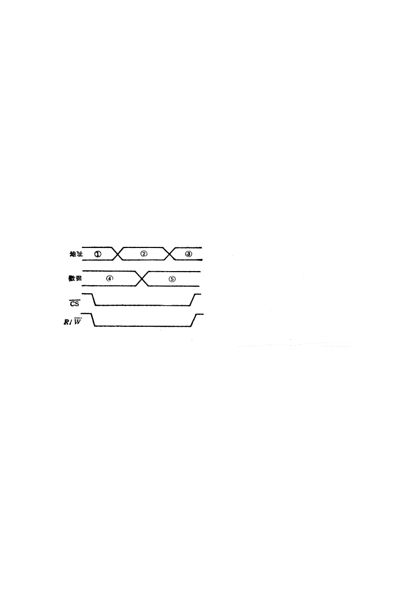
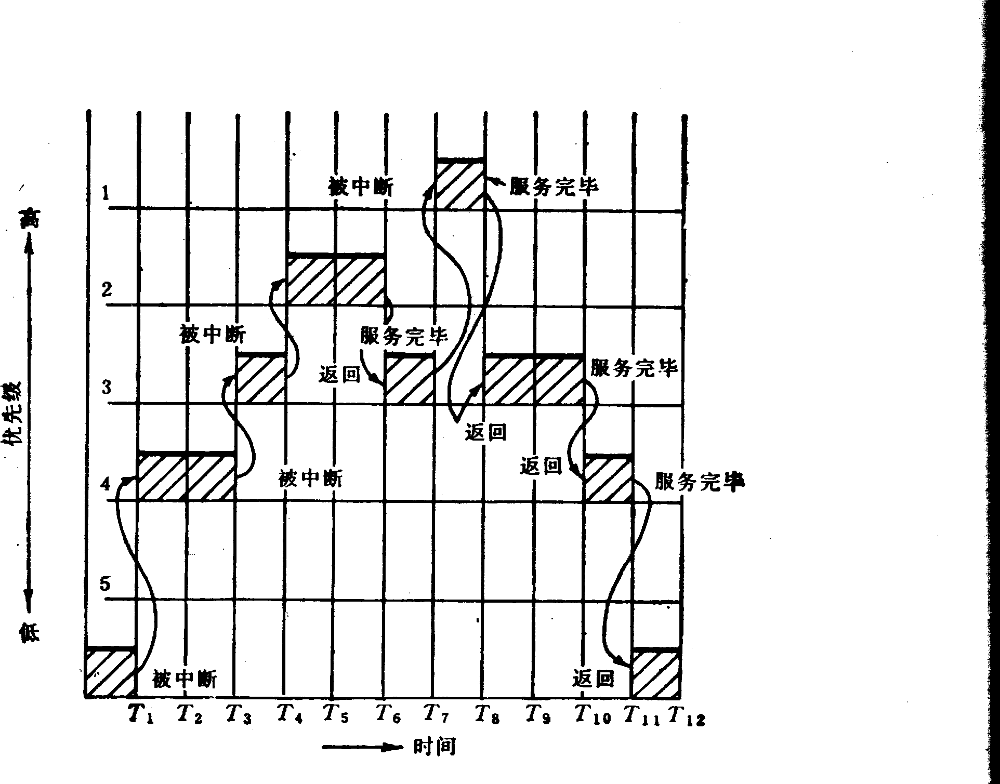
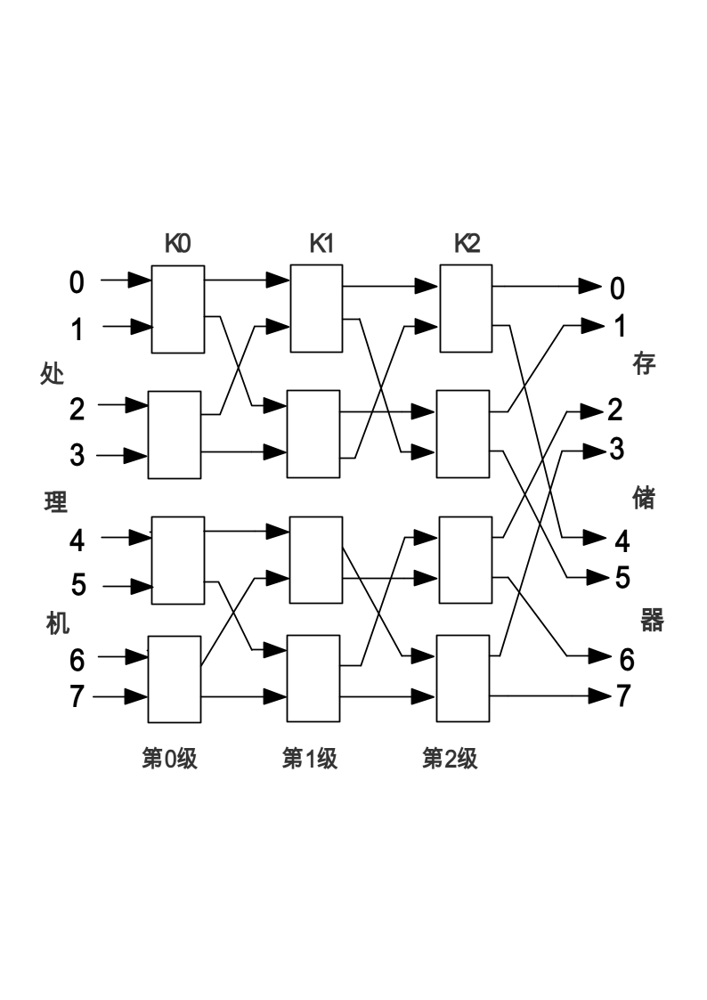

# 题

**本科生期末试卷十五**

**一、** **选择题**

1． 下列数中最大的数为______。

A.（10010101）2          B.（227）8

C.（96）8                      D.（143）5

2． 设  32位浮点数中，符号位为1位，阶码为8位，尾数位为23位，则它所能表示的最大规格化正数为______。

A．+（2  –  2-23）×2+127                  B．[1+（1  –  2-23）]×2+127

C．+（2  –  223）×2+255                    D．2+127  -223

3． 四片74181ALU和一片74182CLA器件相配合，具有如下进位传送功能______。

A.行波进位          B.组内先行进位，组间先行进位

C.组内先行进位，组间行波进位       D.组内行波进位，组间先行进位

4． 某计算机字长32位，其存储容量为8MB，若按字编址，它的寻址范围是______。

A. 1M     B. 4MB     C.4M     D.  2MB

5． 以下四种类型的半导体存储器中，以传输同样多的字为比较条件，则读出数据传

输率最高的是______。

A.DRAM    B.SRAM     C.闪速存储器    D.EPROM

6． 位操作类指令的功能是______。

A.对CPU内部通用寄存器或主存某一单元任一位进行状态检测（0或1）

B.对CPU内部通用寄存器或主存某一单元任一位进行状态强置（0或1）

C.对CPU内部通用寄存器或主存某一单元任一位进行状态检测或强置

D.进行移位操作

7． 操作控制器的功能是______。

A.产生时序信号    B.从主存取出一条指令    C.完成指令操作的译码

D.从主存取出指令，完成指令操作码译码，并产生有关的操作控制信号，以解释执行该指令

8． 采用串行接口进行七位ASCⅡ码传送，带有一位奇偶校验位为1位起始位和1位停止位，当波特率为9600波特时，字符传送速率为______。

A.960    B.873    C.1371   D.480

9．  3.5英寸软盘记录方式采用____________。

A.单面双密度     B.双面双密度

C.双面高密度     D.双面单密度

10．在以下四种类型的MIMD计算机中，只有______不能采用商品化的通用微处理机

来构成并行处理系统。

A. SMP     B. PVP      C. MPP      D. DSM

**二、** **填空题**

1． Cache是一种A______存储器，是为了解决CPU和主存之间B______不匹配而采用的一项重要的硬件技术。现发展为C______体系。

2． 一个较完善的指令系统应包含A______类指令，B______类指令，C______类指令，程序控制类指令，I/O类指令，字符串类指令，系统控制类指令。

3． 并行处理技术已经成为计算机发展的主流。它可贯穿于信息加工的各个步骤和阶段概括起来，主要有三种形式：A______并行；B______并行；C______并行。

4． 为了解决多个A______同时竞争总线，B______必须具有C______部件。

5． 磁表面存储器主要技术指标有：A______，B______，C______和数据传输速率。

6．按多处理机的组成结构来分，它有如下四种类型A______ B______ C______和D______。

**三、**设[X]补=01111，[Y]补=11101，用带求补器的补码阵列乘法器求出乘积

X·Y=？并用十进制数乘法验证。

**四、**指令格式如下所示。OP为操作码字段，试分析指令格式的特点。

31    26            22         18  17         16  15            0

**五、**如图1（A）是某SRAM的写入时序图，其中R/$\overline {W}$是读写命令控制线，R/$\overline {W}$线为低电平时，存贮器按给定地址把数据线上的数据写入存贮器。请指出图中写入时

**图1**

序的错误，并画出正确的写入时序图。

**六、**如图2是从实时角度观察到的中断嵌套。试问，这个中断系统可以实

**图2**

行几重？并分析图中的中断过程。

**七、**证明：一个m段流水线处理器和具有m个并行部件的处理器一样具有同等水平的吞吐能力。

**八、**软盘驱动器使用双面双密度软盘，每面有80道，每道15扇区，每个扇区存储512B。已知磁盘转速为360转/分，假设找道时间为10-40ms，今写入38040B，平均需要多少时间？最长时间是多少？

**九、**如图所示，8个处理机访问8个存储器，通过三级立方体互连网络连接，采用级控方式。其中所有交换开关均为二功能（级控仪号为“0”时直通，为“1”时交换）。若级控信号为：①K0  K1  K2＝101  ②K0  K1  K2＝110，请列表说明两种情况下，对应8个处理机而实际连通的8个存储器的排列次序。

三级立方体互连网络

十机动题
