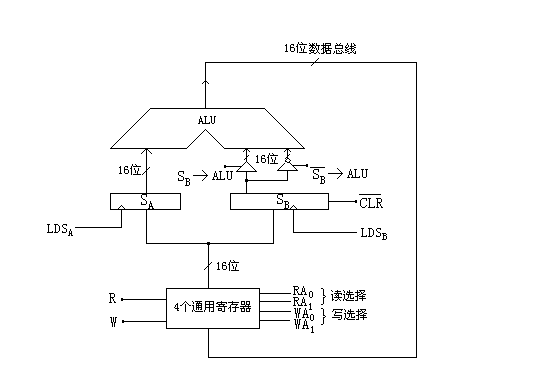

# 题

**本科生期末试卷 十九**
- 选择题
  - 六七十年代，在美国的______州，出现了一个地名叫硅谷。该地主要工业是______它也是______的发源地。

A  马萨诸塞 ，硅矿产地，通用计算机

B  加利福尼亚，微电子工业，通用计算机

C加利福尼亚，硅生产基地，小型计算机和微处理机

D加利福尼亚，微电子工业，微处理机
  - 若浮点数用补码表示，则判断运算结果是否为规格化数的方法是______。

A  阶符与数符相同为规格化数

B  阶符与数符相异为规格化数

C  数符与尾数小数点后第一位数字相异为规格化数

D数符与尾数小数点后第一位数字相同为规格化数
  - 定点16位字长的字，采用2的补码形式表示时,一个字所能表示的整数范围是______。

A -215  ~  +（215    -1）            B -（215  –1）~ +（215  –1）

C -（215  + 1）~  +215                    D -215    ~  +215
  - 某SRAM芯片，存储容量为64K×16位，该芯片的地址线和数据线数目为______。

A  64，16    B 16，64   C  64，8  D 16，16  。
  - 交叉存贮器实质上是一种______存贮器，它能_____执行______独立的读写操作。

A  模块式，并行，多个                    B  模块式串行，多个

C  整体式，并行，一个                    D  整体式，串行，多个
  - 用某个寄存器中操作数的寻址方式称为______寻址。

A  直接        B  间接        C      寄存器直接        D  寄存器间接
  - 流水CPU  是由一系列叫做“段”的处理线路所组成，和具有m个并行部件的CPU相比，一个  m段流水CPU______。

A  具备同等水平的吞吐能力            B不具备同等水平的吞吐能力

C  吞吐能力大于前者的吞吐能力    D吞吐能力小于前者的吞吐能力
  - 描述PCI总线中基本概念不正确的句子是______。

A  HOST  总线不仅连接主存，还可以连接多个CPU

B   PCI  总线体系中有三种桥，它们都是PCI  设备

C  以桥连接实现的PCI总线结构不允许许多条总线并行工作

D  桥的作用可使所有的存取都按CPU  的需要出现在总线上
  - 计算机的外围设备是指______。

A  输入/输出设备                                B  外存储器

C  远程通信设备                 D  除了CPU  和内存以外的其它设备

10.CRAY X-MP向量处理机采用了______个CPU。

A. 1    B. 4       C. 8      D.16

二.  填空题

1  为了运算器的A. _____，采用了B. _____进位，C. _____乘除法和流水线等并行措施。

2  相联存储器不按地址而是按A. ______访问的存储器，在cache中用来存放B. ______，在虚拟存储器中用来存放C. ______。

3  硬布线控制器的设计方法是：先画出A. ______流程图，再利用B. ______写出综合逻辑表达式，然后用C. ______等器件实现。

4  磁表面存储器主要技术指标有A.______，B. ______，C. ______，和数据传输率。

5  DMA  控制器按其A. ______结构，分为B. ______型和C. ______型两种。

6.  Origin2000系统是A______系统，采用B ______微处理器。Cache一致性采用C______协议。
- 求证：[X]补+ [ Y ]补    = [ X  + Y ]补                  （mod  2）
- 某计算机字长32位，有16个通用寄存器，主存容量为1M字，采用单字长二地址指令，共有64条指令，试采用四种寻址方式（寄存器、直接、变址、相对）设计指令格式。
- 如图1表示使用快表（页表）的虚实地址转换条件，快表存放在相联存贮器中，其中容量为8个存贮单元。问：
1. 当CPU  按虚拟地址1去访问主存时，主存的实地址码是多少？
1. 当CPU  按虚拟地址2去访问主存时，主存的实地址码是多少？
1. 当CPU  按虚拟地址3去访问主存时，主存的实地址码是多少？

<table>
<tr><td>页号</td><td>该页在主存中的起始地址</td><td>虚拟地址   页号   页内地址</td></tr>
<tr><td>33 25 7 6 4 15 5 30</td><td>42000 38000 96000 60000 40000 80000 50000 70000</td><td>1 2 3</td><td>15</td><td>0324</td><td></td></tr>
<tr><td></td><td></td><td></td><td></td><td></td></tr>
<tr><td></td><td></td><td></td><td>7</td><td>0128</td><td></td></tr>
<tr><td></td><td></td><td></td><td></td><td></td></tr>
<tr><td></td><td></td><td></td><td>48</td><td>0516</td><td></td></tr>
<tr><td></td><td></td><td></td><td></td><td></td></tr>
</table>

图1
- 假设某计算机的运算器框图如图2所示，其中ALU为16位的加法器，SA  、SB为16位暂存器，4个通用寄存器由D触发器组成，Q端输出，

其读写控制如下表所示：

读控制                                 写控制

<table>
<tr><td>R0</td><td>RA0</td><td>RA1</td><td>选择</td><td></td><td>W</td><td>WA0</td><td>WA1</td><td>选择</td></tr>
<tr><td>1 1 1 1 0</td><td>0 0 1 1 x</td><td>0 1 0 1 x</td><td>R0 R1 R2 R3 不读出</td><td></td><td>1 1 1 1 0</td><td>0 0 1 1 x</td><td>0 1 0 1 x</td><td>R0 R1 R2 R3 不写入</td></tr>
</table>

要求：（1）设计微指令格式。

（2）画出ADD，SUB两条指令微程序流程图。
- 画出单机系统中采用的三种总线结构。
- 试推导磁盘存贮器读写一块信息所需总时间的公式。

图2

**九**假设使用50台多处理机系统获得加速比40，求原计算程序中串行部分所占的比例是多少？

十 机动题
