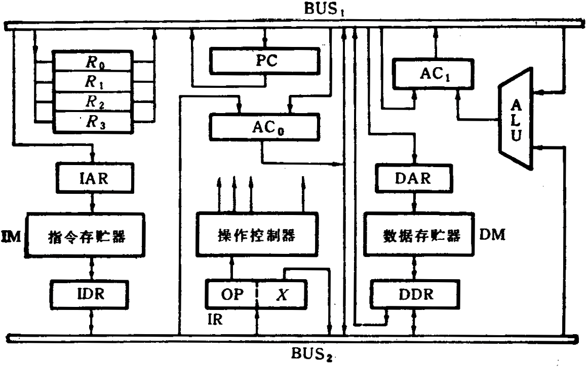
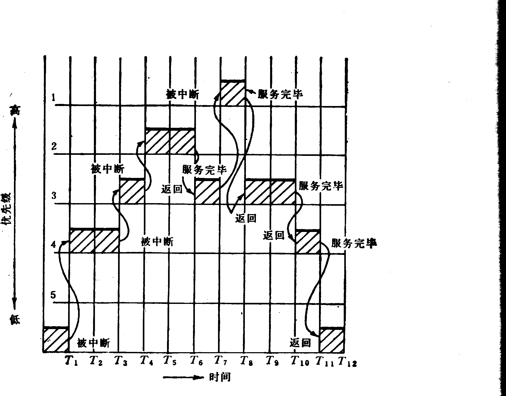

# 题

**本科生期末试卷** **三**
- **选择题**
1. 冯·诺依曼机工作的基本方式的特点是______。

A    多指令流单数据流

B    按地址访问并顺序执行指令

C    堆栈操作

D    存贮器按内容选择地址
1. 在机器数______中，零的表示形式是唯一的。

A    原码     B    补码     C    移码     D    反码
1. 在定点二进制运算器中，减法运算一般通过______来实现。

A    原码运算的二进制减法器

B    补码运算的二进制减法器

C    原码运算的十进制加法器

D    补码运算的二进制加法器

4. 某计算机字长32位，其存储容量为4MB，若按半字编址，它的寻址范围是______。

A  4MB    B  2MB    C  2M    D  1M
1. 主存贮器和CPU之间增加cache的目的是______。

A    解决CPU和主存之间的速度匹配问题

B    扩大主存贮器容量

C    扩大CPU中通用寄存器的数量

D    既扩大主存贮器容量，又扩大CPU中通用寄存器的数量
1. 单地址指令中为了完成两个数的算术运算，除地址码指明的一个操作数外，另一个常需采用______。

A    堆栈寻址方式        B    立即寻址方式        C    隐含寻址方式        D    间接寻址方式
1. 同步控制是______。

A    只适用于CPU控制的方式

B    只适用于外围设备控制的方式

C    由统一时序信号控制的方式

D    所有指令执行时间都相同的方式

8．描述  PCI  总线中基本概念不正确的句子是______。
- PCI  总线是一个与处理器无关的高速外围总线
- PCI总线的基本传输机制是猝发式传送

C. PCI  设备一定是主设备

D.  系统中只允许有一条PCI总线
1. CRT的分辨率为1024×1024像素，像素的颜色数为256，则刷新存储器的容量为______。

A  512KB      B  1MB      C  256KB      D  2MB

10．从处理数据的角度看，不存在并行性的是______。

A.字串位串            B.  字串位并        C.  字并位串          D.  字并位并
- **填空题**
1. 数的真值变成机器码可采用A.  ______表示法，B.  ______表示法，C.______表示法，移

码表示法。
1. 形成指令地址的方式，称为A.______方式，有B. ______寻址和C. ______寻址。

3.    CPU从A. ______取出一条指令并执行这条指令的时间和称为B. ______。由于各种指

令的操作功能不同，各种指令的指令周期是C. ______。
1. 微型机的标准总线从16位的A. ______总线，发展到32位的B. ______总线和C.

______总线，又进一步发展到64位的PCI总线。

5．并行性是计算机系统具有可以同时进行A______的特性，它包括B______性与C______性两种含义。

**三.**已知  x = - 0.01111    ，y = +0.11001，

求  [ x ]补    ，[ -x ]补    ，[ y ]补    ，[ -y ]补    ，x + y =  ？ ，x  –  y =  ？

**四.**假设机器字长16位，主存容量为128K字节，指令字长度为16位或32位，共有128条指令，设计计算机指令格式，要求有直接、立即数、相对、基值、间接、变址六种寻址方式。

**五.**某机字长32位，常规设计的存储空间≤32M  ，若将存储空间扩至256M，请提出一种可能方案。
- 图1所示的处理机逻辑框图中，有两条独立的总线和两个独立的存贮器。已知指令存贮器IM最大容量为16384字（字长18位），数据存贮器DM最大容量是65536字（字长16位）。各寄存器均有“打入”（Rin）和“送出”（Rout）控制命令，但图中未标出。

图1

设处理机指令格式为：

17              10 9               0

| OP | X |
|---|---|

加法指令可写为“ADD X（R1）”。其功能是（AC0）  +  （（Ri）  +  X）→AC1，其中（（Ri）+ X）部分通过寻址方式指向数据存贮器，现取Ri为R1。试画出ADD指令从取指令开始到执行结束的操作序列图，写明基本操作步骤和相应的微操作控制信号。

**七.** （9分）总线的一次信息传送过程大致分哪几个阶段？若采用同步定时协议，请画出

读数据的时序图来说明。

**八.**图2是从实时角度观察到的中断嵌套。试问，这个中断系统可以实行几重

中断？并分析图2的中断过程。

图2

**九.** Amdahl定律给出加快某部件执行速度所获得的系统性能加速比${S}_{P}$的公式为

${S}_{P}=\frac {1} {(1-{F}_{e})+{F}_{e}/{S}_{e}}$

1）参数${F}_{e}$、$(1-{F}_{e})$、${S}_{e}$、${S}_{P}$的数值大小如何理解？

2）假设系统某部件的处理速度提高10倍，但该部件的原处理时间仅为整个运行时间的45%，问采用加快措施后能使整个系统的性能提高多少？

**十.** 机动题
