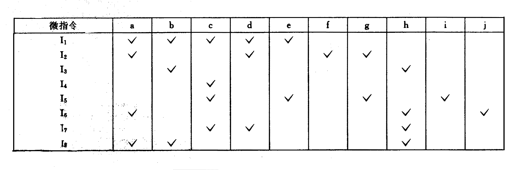
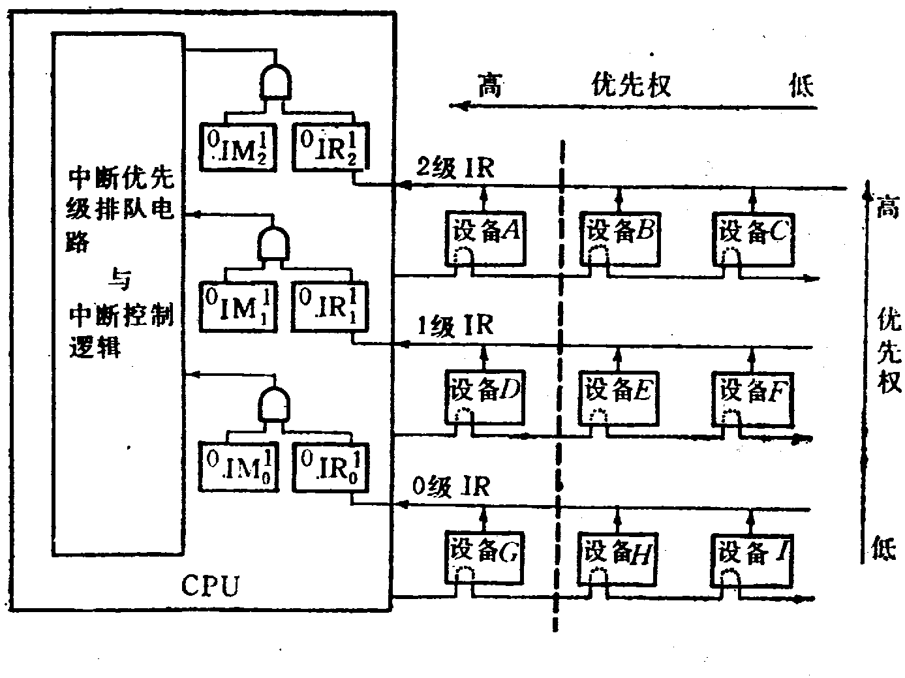
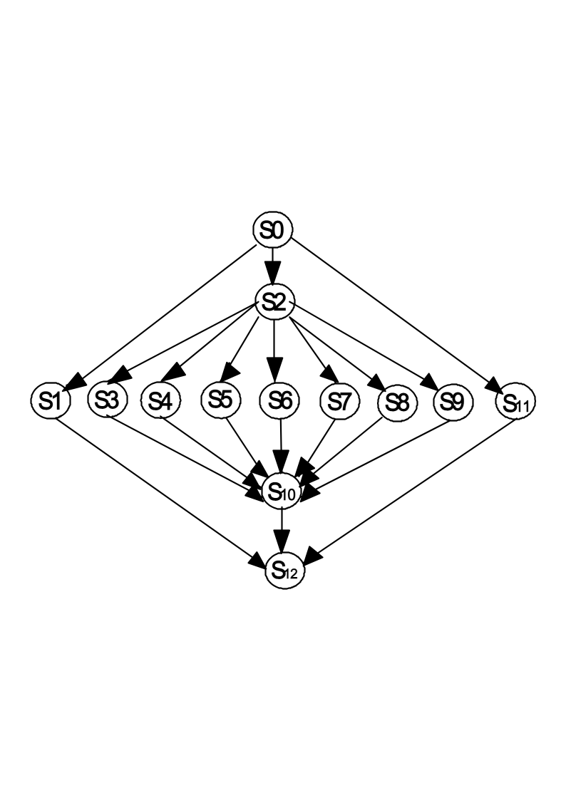

# 题

**本科生期末试卷** **四**

**一． 选择题**

1.  现代计算机内部一般采用二进制形式，我国历史上的______即反映了二值逻辑的思想，它最早记载在______上，距今已有约______千年。

A.  八卦图、论衡、二

B.  算筹、周脾算经、二

C.  算筹、九章算术、一

D.八卦图、周易、三

2. 8位定点字长的字，采用2的补码表示时，一个字所能表示的整数范围是______。

A .–128 ~ +127   B.  –127 ~  +127  C.    –129 ~ +128   D.-128 ~ +128

3.下面浮点运算器的描述中正确的句子是：______。

A.  浮点运算器可用阶码部件和尾数部件实现

B.  阶码部件可实现加、减、乘、除四种运算

C.  阶码部件只进行阶码相加、相减和比较操作

D.  尾数部件只进行乘法和减法运算

4.  某计算机字长16位，它的存贮容量是64KB，若按字编址，那么它的寻址范围是______

A. 64K    B. 32K  C. 64KB  D. 32 KB

5.  双端口存储器在______情况下会发生读/写冲突。

A.  左端口与右端口的地址码不同

B.  左端口与右端口的地址码相同

C.  左端口与右端口的数据码不同

D.  左端口与右端口的数据码相同

6.  寄存器间接寻址方式中，操作数处在______。

A.  通用寄存器        B.  主存单元    C.  程序计数器    D.  堆栈

7.  微程序控制器中，机器指令与微指令的关系是______。

A.  每一条机器指令由一条微指令来执行

B.  每一条机器指令由一段微指令编写的微程序来解释执行

C. 每一条机器指令组成的程序可由一条微指令来执行

D.  一条微指令由若干条机器指令组成

8.  描述  PCI  总线中基本概念正确的句子是______。

A. PCI  总线是一个与处理器无关的高速外围总线

B. PCI总线的基本传输机制是猝发式传送

C. PCI  设备一定是主设备

D.  系统中只允许有一条PCI总线

9. 一张3.5寸软盘的存储容量为______MB，每个扇区存储的固定数据是______。

A.  1.44MB  ，512B   B. 1MB，1024B  C .2MB，  256B  D .1.44MB，512KB

10. 从执行程序的角度看，并行性等级最高的是______。

A.  指令内部并行                                              B.指令级并行

C.作业或程序级并行                                    D.任务级或过程级并行

**二 填空题**

1.  2000年超级计算机浮点最高运算速度达到每秒A.______次。我国的B. ______号计算机的运算速度达到C. ______次，使我国成为美国、日本后第三个拥有高速计算机的国家。

2.  一个定点数由A.  ______和B.  ______两部分组成。根据小数点位置不同，定点数有C.  ______和纯整数之分。

3.对存储器的要求是A.  ______，B.  ______，C.  ______。为了解决这三方面的矛盾

计算机采用多级存储体系结构。

4.当今的CPU  芯片除了包括定点运算器和控制器外，还包括A.  ______，B.  ______

运算器和C.  ______管理等部件。

5.  计算机系统中,可以采用两类并行方法,一类是A______方面的并行性,  二类是B______方面的并行性。

**三.** 设[x]补 =x0.x1x2…xn 。 求证：x = -x0  +$\sum _{i=1} ^{n}$xi2-i

**四.**已知X=-0.01111，Y=+0.11001，求[X]补，[-X]补，[Y]补，[-Y]补，X+Y=？，X-Y=？

**五.**以知cache  命中率  H=0.98，主存比cache  慢4倍，以知主存存取周期为200ns，求cache/主存的效率和平均访问时间。

**六**．某计算机有8条微指令I1—I8，每条微指令所包含的微命令控制信号见下表所示，a—j  分别对应10种不同性质的微命令信号。假设一条微指令的控制字段仅限8位，请安排微指令的控制字段格式。

**七**．参见图，这是一个二维中断系统，请问：
1. 在中断情况下，CPU和设备的优先级如何考虑？请按降序排列各设备的中断优先级。
1. 若CPU现执行设备B的中断服务程序，IM0,IM1,IM2的状态是什么？如果CPU的执行设备D的中断服务程序，IM0,IM1,IM2的状态又是什么？
1. 每一级的IM能否对某个优先级的个别设备单独进行屏蔽？如果不能，采取什么方法可达到目的？
1. 若设备C一提出中断请求，CPU立即进行响应，如何调整才能满足此要求？

**八**． 磁盘、磁带、打印机三个设备同时工作。磁盘以20μs的间隔发DMA请求，磁带以30μs的间隔发DMA请求，打印机以120μs的间隔发DMA请求，假设DMA控制器每完成一次DMA传输所需时间为2μs，画出多路DMA控制器工作时空图。

**九**．请用块结构语言语言Cobegin-Coend写出图中所示嵌套并行算法优先关系图的程序。

嵌套并行算法优先关系图

**十**．机动题
