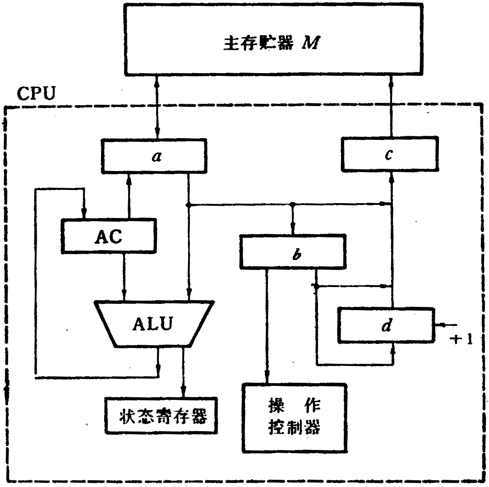

# 题

**本科生期末试卷九**
- **选择题**
1. 八位微型计算机中乘除法大多数用______实现。

A    软件        B    硬件          C    固件          D    专用片子
1. 在机器数______中，零的表示是唯一的。

A    原码     B    补码     C    移码     D    反码
1. 某SRAM芯片，其容量为512×8位，除电源和接地端外，该芯片引出线的最小数目应是______。

A  23     B  25     C  50     D  19
1. 某机字长32位，存储容量64MB，若按字编址，它的寻址范围是______。

A  8M    B  16MB    C  16MB    D 8MB
1. 采用虚拟存贮器的主要目的是______。

A    提高主存贮器的存取速度 ；

B    扩大主存贮器的存贮空间，并能进行自动管理和调度 ；

C    提高外存贮器的存取速度 ；

D    扩大外存贮器的存贮空间 ；
1. 算术右移指令执行的操作是______。

A    符号位填0，并顺次右移1位，最低位移至进位标志位 ；

B    符号位不变，并顺次右移1位，最低位移至进位标志位 ；

C    进位标志位移至符号位，顺次右移1位，最低位移至进位标志位 ；

D    符号位填1，并顺次右移1位，最低位移至进位标志位 ；
1. 微程序控制器中，机器指令与微指令的关系是______。

A    每一条机器指令由一条微指令来执行 ；

B    每一条机器指令由一段用微指令编成的微程序来解释执行 ；

C    一段机器指令组成的程序可由一条微指令来执行 ；

D    一条微指令由若干条机器指令组成 ；
1. 同步传输之所以比异步传输具有较高的传输频率是因为同步传输______。

A    不需要应答信号 ；

B    总线长度较短 ；

C    用一个公共时钟信号进行同步 ；

D    各部件存取时间较为接近 ；

9．向量处理机不宜采用______结构。

A.  寄存器-寄存器B.  寄存器-存储器C.  存储器-存储器

10.CPU响应中断时，进入“中断周期”，采用硬件方法保护并更新程序计数器PC内容，而不是由软件完成，主要是为了_______。

A    能进入中断处理程序，并能正确返回源程序 ；

B    节省主存空间 ；

C    提高处理机速度 ；

D    易于编制中断处理程序 ；

二**．填空题**
1. 多媒体CPU是带有A.______技术的处理器。它是一种B._______技术，特别适合于

C.______处理。

2．总线定时是总线系统的核心问题之一。为了同步主方、从方的操作，必须制订A.______。

通常采用B.______定时和C.______定时两种方式。

3．通道与CPU分时使用A.______，实现了B.______内部数据处理和C.______并行工作。

4．2000年超级计算机最高运算速度达到A.______次。我国的B.______号计算机的运算速

度达到 3840亿次，使我国成为C.______之后，第三个拥有高速计算机的国家。

5．常用的动态互连网络有三种形式，即A______网络  B______网络C______网络
- 已知：x= 0.1011，y = - 0.0101，求 ：[  $\frac {1} {2}$x]补，[  $\frac {1} {4}$  x]补，[ - x ]补，[$\frac {1} {2}$y]补，[$\frac {1} {4}$y]补，[ - y ]补  ，x + y = ?,  x – y = ?
- 用16K  ×  1位的DRAM芯片构成64K  × 8位的存储器。要求：
1. 画出该芯片组成的存储器逻辑框图。
1. 设存储器读  /  写周期均为0.5μs，CPU在1μs内至少要访存一次。试问采用哪种刷新方式比较合理？两次刷新的最大时间间隔是多少？对全部存储单元刷新一遍，所需实际刷新时间是多少？
- 指令格式如下所示，OP为操作码字段，试分析指令格式的特点。

15      10       7             4 3              0
- CPU结构如图1所示，其中有一个累加寄存器AC，一个状态条件寄存器，各部分之间的连线表示数据通路，箭头表示信息传送方向。
1. 标明图中四个寄存器的名称。
1. 简述指令从主存取到控制器的数据通路。
1. 简述数据在运算器和主存之间进行存  /  取访问的数据通路。

**图1**
- 试推导磁盘存贮器读写一块信息所需总时间的公式。
- 如图2所示的系统中断机构是采用单级优先中断结构，设备A连接于最高优先级，设备B次之，设备C又次之。要求CPU在执行完当前指令时转而对中断请求进行服务，现假设：TDC为查询链中每个设备的延迟时间，TA、TB、TC分别为设备A、B、C的服务程序所需的执行时间，TS、TR为保存现场和恢复现场所需时间。

试问：在此环境下，此系统在什么情况下达到中断饱和？即在确保请求服务的三个设备都不会丢失信息的条件下，允许出现中断的极限频率有多高？注意，“中断允许”机构在确认一个新中断之前，先要让即将被中断的程序的一条指令指令执行完毕。

图2

九．设有K(=4)段指令流水线，它们是取指令、译码、指令执行、存回结果，分别用S1、S2  、S3、S4过程段表示，各段延迟时间均为Δt。
1. 续输入n条指令，画出指令流水线的时空图。标出执行第一条指令和执行后续各条指令的时间。

2）推导流水线的吞吐率P的表达式。它定义为单位时间中指令流水线输出的指令数。

十．机动题
