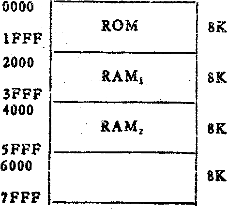
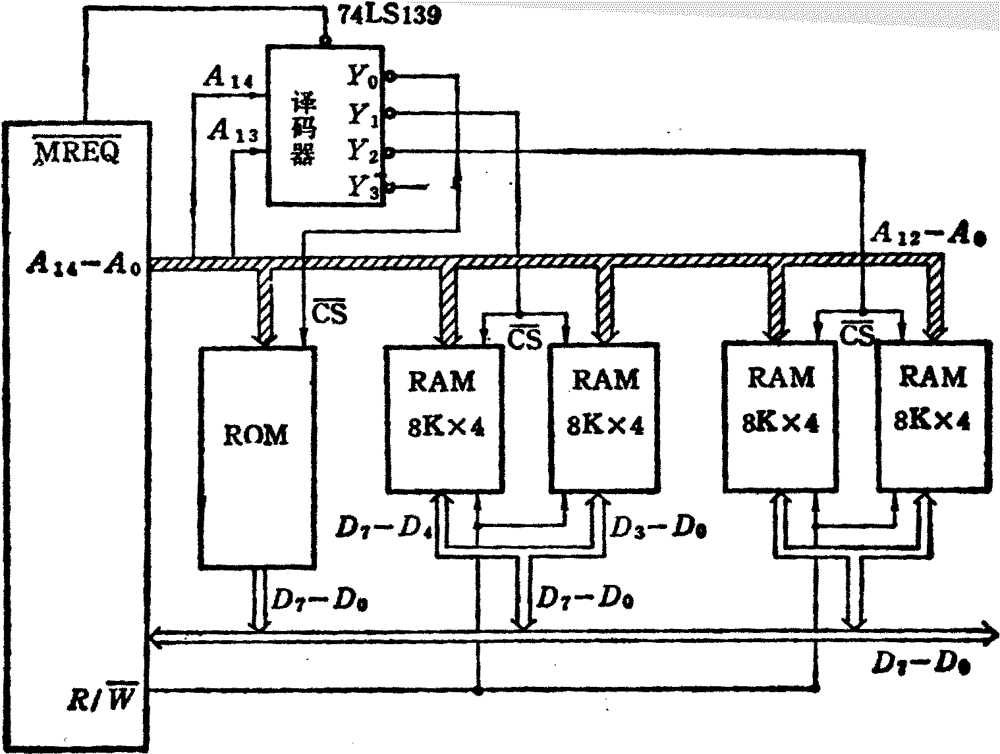
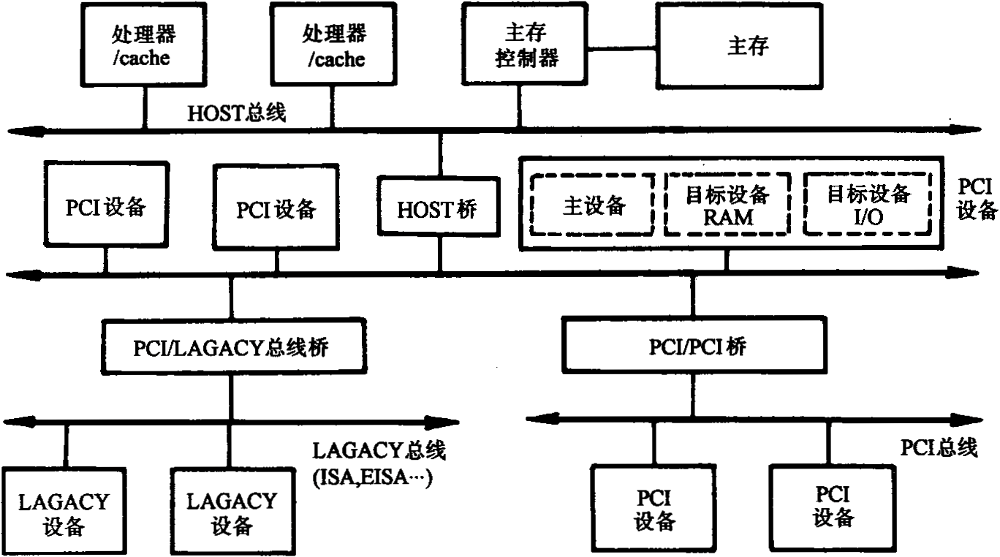
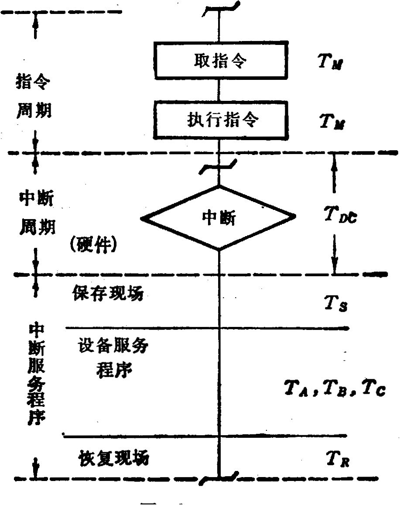

# 答案

**本科生期末试卷一答案**
- **选择题**

1．B   2．D       3．B        4．D    5．C

6．C   7．D   8．A,B  9．A,B,C      10．B
- **填空题**

1.  A.（58）10

2．A．高速缓冲      B．主存      C．速度

3．  A．Cache   B．浮点      C．存储

4．  A．位置      B．集中式      C．分布式

5.   A.多        B.一      C.高速

6.  A.  二进制代码    B.操作码    C.地址码

7．  A．停止CPU访问内存    B． 周期挪用      C．DMA和CPU交替访内

8． A.向量  B.标量  C.硬件

**三、**解：设最高位为符号位，输入数据为[x]原 = 01111    [y]原 = 11101

因符号位单独考虑，尾数算前求补器输出值为：|x|  = 1111,    |y|  = 1101

乘积符号位运算：    x0  ⊕y0    = 0⊕1 =1

尾数部分运算：                            1   1   1   1

×      1   1   0   1

1   1   1   1

0  0   0   0

1   1   1   1

1   1   1   1

1  1   0  0  0  0  1  1

经算后求补器输出，加上乘积符号位，得原码乘积值[x×y]  原 = 111000011

换算成二进制真值  x×y = (-11000011)2 = (-195)10

十进制数乘法验证：x×y = 15×(-13) = -195

**四、**解 ：存储器地址空间分布如图2所示，分三组，每组8K×16位。

由此可得存储器方案要点如下：
1. 组内地址 ：A12  ——A0 （A0为低位）；
1. 组号译码使用2  ：4  译码器；
1. RAM1  ，RAM  2 各用两片SRAM芯片位进行并联连接，其中一片组成高8位，另一片组成低8位。
1. 用  MREQ  作为2  ：4译码器使能控制端，该信号低电平（有效）时，译码器工作。
1. CPU的R / W  信 号与SRAM的WE端连接，当R / W = 1时存储器执行读操作， 当R / W = 0时，存储器执行写操作。如图3

**图2**

**图3**

**五、**①在流水处理器中，一个具有k级过程段的流水线处理n个任务时，需要的时钟周期数为

T2＝k+(n-1)                                ⑴

其中k个时钟周期处理第1个任务。K个周期后，流水线被填满，剩余的（n-1）个任务只需（n-1）个时钟周期就可完成。

②当用非流水处理器来处理这n个任务时，因串行方式工作，所需的时钟周期数为

T1＝n×k                                    ⑵

由此得k级流水线处理器的加速比为

Ck  =T1/T2＝n×k/[k+(n-1)]                     ⑶

当n》k时，Ck→k。这就是说，理论上k级流水线处理器几乎可以提高k位速度，因而比流水处理器具有更高的吞吐率。

**六、解：**PCI总线结构框图如图4示：

**图4**

PCI总线有三种桥，即HOST / PCI桥（简称HOST桥），PCI / PCI桥，PCI / LAGACY桥。

在PCI总线体系结构中，桥起着重要作用：
1. 它连接两条总线，使总线间相互通信。
1. 桥是一个总线转换部件，可以把一条总线的地址空间映射到另一条总线的地址空间上，从而使系统中任意一个总线主设备都能看到同样的一份地址表。
1. 利用桥可以实现总线间的猝发式传送。

**七、**解：假设主存工作周期为TM，执行一条指令的时间也设为TM  。则中断处理过程和各时间段如图5所示。当三个设备同时发出中断请求时，依次处理设备A、B、C的时间如下：

tA  = 2TM  + TDC  + TS  + TA  + TR

tB  = 2TM  + TDC  + TS  + TB  + TR

tC  = 2TM  + TDC  + TS  + TC  + TR

达到中断饱和的时间为：  T =  tA +  tB +  tC      中断极限频率为：f  = 1 / T

**图5**

**八、**解：扇区总数  = 60  ×  60  × 75 = 270000（扇区）

模式1存放计算机程序和数据，其存储容量为

270000 × 2048 / 1024 / 1024 = 527MB

模式2存放声音、图象等多媒体数据，其存储容量为

270000 × 2336 / 1024 / 1024 = 601MB

**九、**解：1）由Amdahl定律可知：

S＝$\frac {1} {(1-F)+F/20}$=$\frac {20} {20-19\times F}$

2)由上式，S＝4，代入表达式

4＝$\frac {20} {20-19\times F}$

故    F＝15/19=0.79=79%
