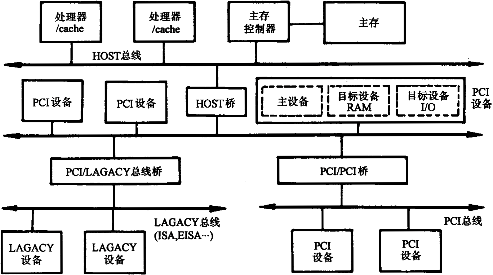
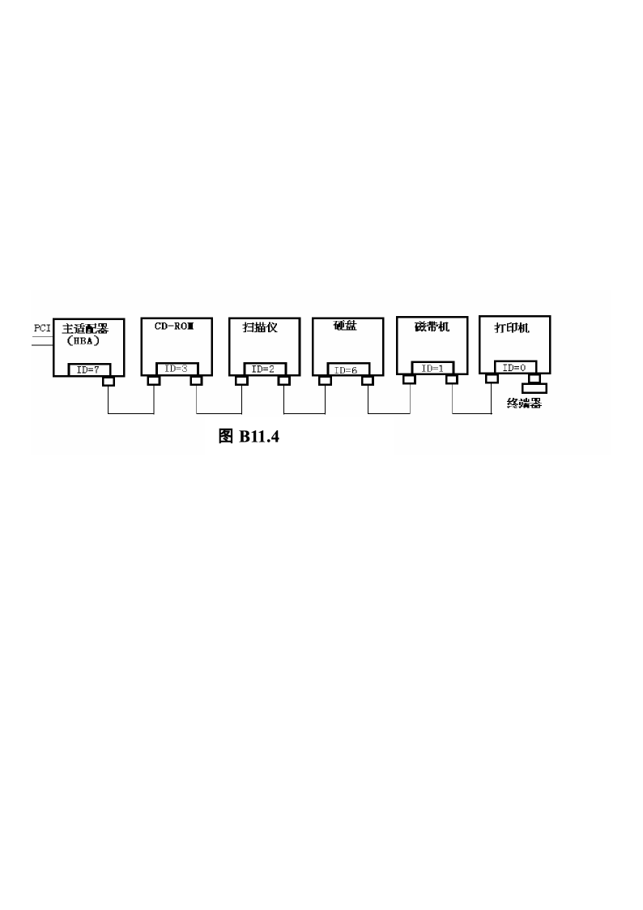
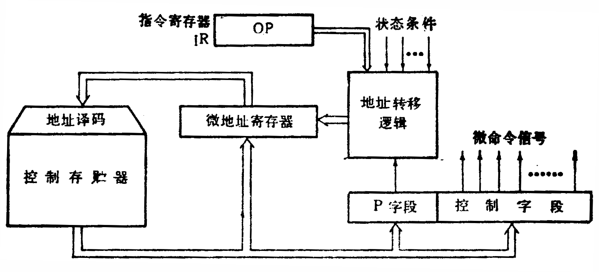
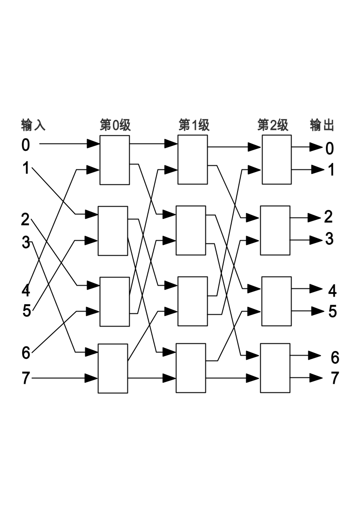

# 答案

**本科生期末试卷十一答案**
- **选择题**

1．A   2．C   3．B         4．A   5．A

6．C   7．C   8．C、D      9．A   10．B

**二．填空题**

1．A．符号位S   B．真值e    C． 偏移值

2．A．内容      B．行地址表  C．段表、页表和快表

3．A．刷新      B．显示      C．ROM BIOS

4．A．页式      B．段式      C．段页式

5．A．指令周期      B．机器周期      C．时钟周期

6．A.  向量  B.  标量  C.硬件

**三、**由移码定义有[x]移=2n + x   2n  > x  $$ -2n  ,同时由补码的定义[y]补=2n+1+y

[x]移+[y]补=2n + x+2n+1+y

=2n+1+(2n+(x+y))

即  [x+y]移  = [x]移+[y]补    (mod 2n+1)

**四、**解：因为X+Y=2Ex×（Sx+Sy） （Ex=Ey），所以求X+Y要经过对阶、尾数求和及规格化等步骤。
1. 对阶：

△J=Ex－EY=（-10）2－（+10）2=（-100）2 所以Ex<EY，则Sx右移4位，Ex+(100)2=(10)2=EY。SX右移四位后SX=0.00001001，经过舍入后SX=0001，经过对阶、舍入后，X=2（10）2×（0.0001）2
1. 尾数求和：  SX+SY
1. 0001（SX）

+ 0.  1011（SY）

0.  1100 (SX+SY)

结果为规格化数。所以：

X+Y=2（10）2×（SX+SY）=2（10）2（0.1100）2=（11.00）2

**五．**用多体交叉存取方案，即将主存分成8个相互独立、容量相同的模块M0，M1，M2…，M7，每个模块32M×32位。它们各自具备一套地址寄存器、数据缓冲器，各自以等同的方式与CPU传递信息，其组成如图

**图2**

**六、**解：PCI总线结构框图如下所示：

              **图3**

PCI总线有三种桥，即HOST / PCI桥（简称HOST桥），PCI / PCI桥，PCI / LAGACY桥。在PCI总线体系结构中，桥起着重要作用：
1. 它连接两条总线，使总线间相互通信。
1. 桥是一个总线转换部件，可以把一条总线的地址空间映射到另一条总线的地址空间上，从而使系统中任意一个总线主设备都能看到同样的一份地址表。
1. 利用桥可以实现总线间的猝发式传送。

**七、**解：SCSI接口的特点有以下几方面：

①SCSI接口总线由八条数据线、一条奇偶校验线，9条控制线组成。

②总线时钟频率为5MHZ，其中异步传输率为2.5MB/S,同步传输数据传输率为5MB/S

③SCSI接口总线以菊花链的方式最多连接8台设备。

④每台SCSI设备都有自己的唯一的设备号ID0—ID7 。

⑤由于SCSI设备是智能设备，对SCSI总线以至主机屏蔽了实际外设的固有物理属性，各个SCSI设备之间可以用一套标准的命令来进行数据传送，也为设备的升级或系统的系列化提供了灵活的处理手段。

⑥各个设备之间是对等的关系，而不是从属。

2） 配置图如下：

**八、**解：（1）假设判别测试字段中每一位为一个判别标志，那么由于有4个转移条件，         故该字段为4位，（如采用字段译码只需3位），下地址字段为9位，因为控制容量为512单元，微命令字段是（  48  –  4  -  9  ）= 35  位。

（2）对应上述微指令格式的微程序控制器逻辑框图B11.5所示：其中微地址寄存器对应下地址字段，P字段即为判别测试字段，控制字段即为微命令子段，后两部分组成微指令寄存器。地址转移逻辑的输入是指令寄存器OP码，各状态条件以及判别测试字段所给的判别标志（某一位为1），其输出修改微地址寄存器的适当位数，从而实现微程序的分支转移。

                   图5

**九．**解：1)

2）一个n输入的Omega网络需要（${log}_{2}n$.）级2×2开头。n=16时，需要${log}_{2}16$=4级。

每级需要（n/2）个开头模块。n=16时，16/2=8个。

网络共需  [（n${log}_{2}n$.）/2    ]  个开关。n=16时，需32个开关模块。

每个模块采用单元控制方式，它有直送、交叉、上播、下播四种传送路径。
