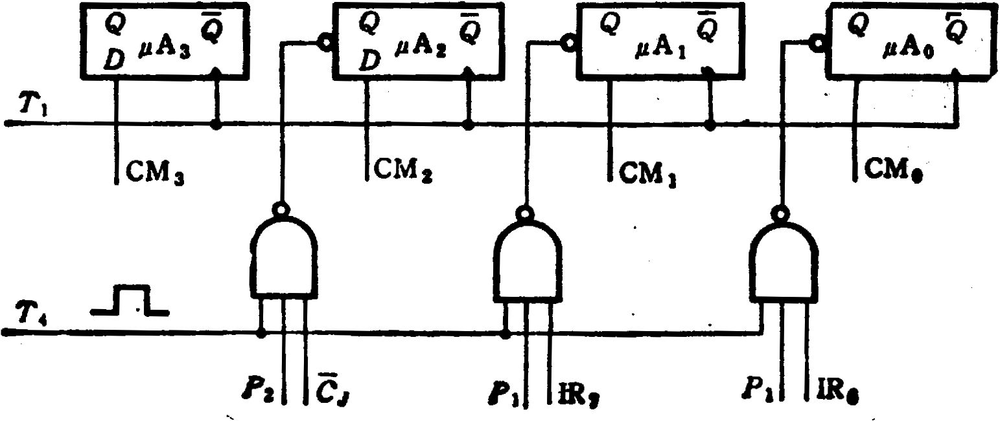

# 答案

**本科生期末试卷十四答案**

**一、选择题**

1．C   2．C       3．B     4．B   5．C

6．B   7．A C D   8．A C   9．B   10．C

**二、填空题**

1．A．内存      B．外存      C．内存

2．A．高速性      B．先行    C．  阵列

3．A．瞬间启动      B．存储器      C．固态盘

4．A．指令周期      B．布尔代数      C．门电路和触发器

5．A．指令寄存器IR   B．程序计数器PC   C．内存地址寄存器AR

6.  A. MIMD B.  任务或作业  C.  指令

**三、**解：浮点乘法规则：

N1×N2=(2j1×S1)×(2j2×S2)=2(j1+j2)×(S1×S2)
1. 阶码求和：j1+j2=0
1. 尾数相乘：符号位单独处理，积的符号位=0⊕0=0

0.1001

×0.1011

1001

1001

0000

1001

0.  011 00011
1. 尾数规格化、舍入（尾数4位）

N1×N2=(+0.01100011)2=(+0.1100)2×2(-01)2

**四、**解 ：命中率  H = Ne  /  （NC  + Nm） = 3800 / (3800  + 200) = 0.95

主存慢于cache的倍率  ：r = tm  / tc  = 250ns / 50ns = 5

访问效率  ：e = 1 / [r + (1 – r)H] = 1 / [5 + (1 – 5)×0.95] = 83.3%

平均访问时间  ：ta  = tc  / e = 50ns / 0.833 = 60ns

**五、**解：指令格式与寻址方式特点如下：
1. 二地址指令，用于访问存储器。操作码字段可指定64种操作。
1. RS型指令，一个操作数在通用寄存器（共16个），另一个操作数在主存中。
1. 有效地址可通过变址寻址求得，即有效地址等于变址寄存器（共16个）内容加上位移量。

**六、**解：从流程图B14.1看出，P（1）处微程序出现四个分支，对应四个微地址。为此用OP码修改微地址寄存器的最后两个触发器即可。在P（2）处微程序出现2路分支，对应两个微地址，此时的测试条件是进位触发器Cj的状态。为此用Cj修改μA2即可。转移逻辑表达式如下：

μA0=P1·T4·IR6,

μA1=P1·T4·IR7,

μA2=P2·T4·Cj。由此可画出微地址转移逻辑。如图3所示。

**图3**

**七、**解：当扫描仪和打印机同时产生一个事件时，IRQ上的请求是扫描仪发的。因为这种链路排队的设备只有当其IEI高时，才能发出中断请求，并且该设备有中断请求时其IEO为低，因此其后的设备就不可能发出中断请求信号。但是若扫描仪接口中的屏蔽触发器被置位即被屏蔽，则IEO上的请求信号将是打印机发出的。

**八、**解：2400转  /  分  = 40转  /  秒

平均等待时间为：1 / 40  ×  0.5 = 12.5（ms）

磁盘存取时间为：60  ms  + 12.5ms = 72.5ms

数据传播率：  Dr	  =  r N , N =  96K bit , r =  40转  /  秒

Dr = r N  =  40  ×  96K = 3840K (bit/s)

**九、**解：

1）如果用单处理机采用串行方法来完成，则需要进行N-1 =7次加法。现采用阵列处理机的8个处理器求和，假定每个处理器已事先分配有一个向量元素。下图画出8个处理器（PE）上采用递归折叠方法求累加和的过程。

初始值        第一步           第二步               第三步

PE0   A0                       A0+A1                      A0+A1+A2+A3             A0+A1+A2+A3+A4+A5+A6+A7

PE1   A1

PE2   A2                       A2+A3

PE3   A3

PE4   A4                       A4+A5                      A4+A5+A6+A7

PE5   A5

PE6   A6                       A6+A7

PE7   A7

2) N个向量元素在N个处理器上并行求累加和需要log2N次传送操作和加法操作；而单处理机计算需要N-1次加法操作 设传送操作时间为t1,加法操作时间为t2，则加速比S为：

$$
S=\frac {(N-1){t}_{2}} {({log}_{2}N)\times ({t}_{1}+{t}_{2})}
$$
