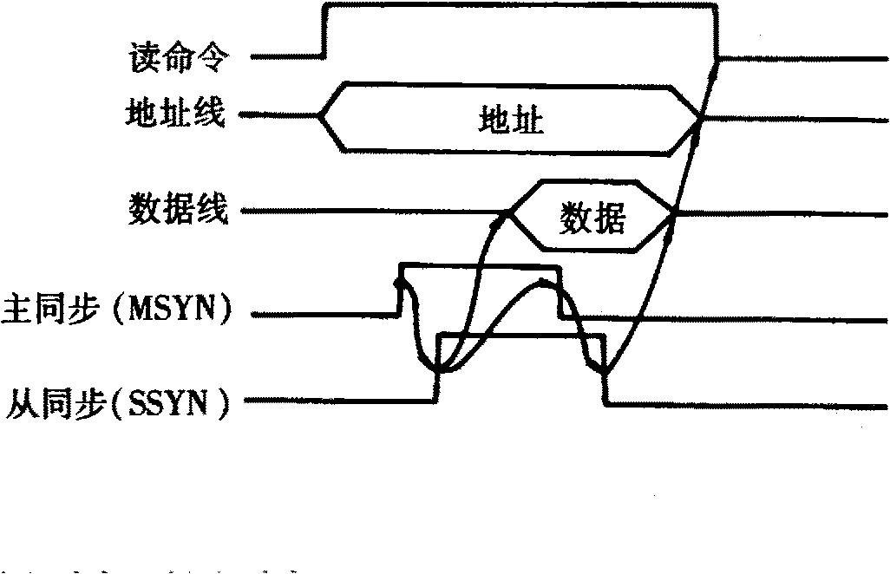
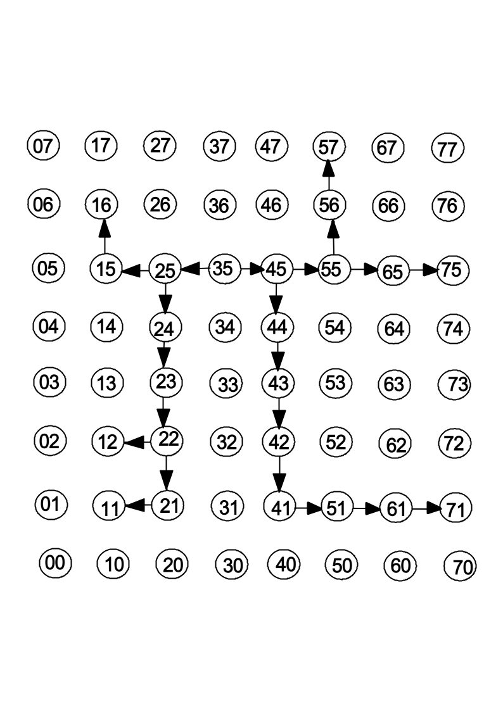

# 答案

**本科生期末试卷十六答案**
- **选择题**

1．B    2．A       3．C   4．A   5．B

6．B    7．A B C   8．C   9．A   10．D

**二．填空题**

1．A ．存储保护      B．存储区域        C．访问方式

2．A．指令条数少      B．指令长度固定    C． 指令格式和寻址方式

3．A．时间并行性      B．经济而实用      C．高性能

4．A．总线带宽      B．传输速率      C．264MB/S

5．A．存储      B．记录      C．结构

6.  A. MIMD B.  任务或作业  C.  指令

**三．**解：（1）最大正数        0   11 111 111   111 111 111 111 111 111 111 11

X=[1+(1-2-23)]×2127

（2）最小正数          0  00 000 000   000 000 000 000 000 000 000 00

X=1.0×2-128

（3）最大负数          1   00 000 000    000 000 000 000 000 000 000 00

X= -1.0×2-128

（4）最小负数          1   11 111 111   111 111 111 111 111 111 111 11

X=-[1+(1-2-23)]×2127

**四．**  解：[X]原=1.01111   [X]补=1.10001    $\therefore$$$[-X]补=0.01111

[Y]原=0.11001   [Y]补=0.11001    $\therefore$    [-Y]补=1.00111

[X]补   11.10001

+   [Y]补   00.11001

[X+Y]补   00.01010

$\therefore$	X+Y=+0.01010

[X]补   11.10001

+   [-Y]补  11.00111

[X-Y]补   10.11000

因为符号位相异，所以结果发生溢出。

**五．**解：
1. cache的命中率H=$\frac {Nc} {Nc+Nm}$=$\frac {4500-340} {4500}$=0.92
1. CPU访存的平均时间Ta=H·Tc+(1-H)Tm=0.92×45+(1-0.92)×200=57.4ns
1. Cache-主存系统的效率e=$\frac {Tc} {Ta}$=$\frac {45} {57.4}$=0.78=78%

**六．**解：从流程图看出，P（1）处微程序出现四个分支，对应四个微地址。为此用OP码修改微地址寄存器的最后两个触发器即可。在P（2）处微程序出现2路分支，对应两个微地址，此时的测试条件是进位触发器Cj的状态。为此用$\overline {C}$j修改μA2即可。转移逻辑表达式如下：

μA0=P1·T4·IR6,

μA1=P1·T4·IR7,

μA2=P2·T4·$\overline {C}$j。

由此可画出微地址转移逻辑。如图B16.2所示。

                                                         **图B16.3**

**七．**答：分五个阶段：请求总线，总线仲裁，寻址（目的地址），信息传送，状态返回（或错误报告）。

**图B16。4**

CPU发出读命令信号和存储器地址信号，经一段时延，待信号稳定后，它启动主同步（MSYN）信号，这个信号引发存储器以从同步（SSYN）信号予以响应，并将数据放到数据线上。这个SSYN信号使CPU读数据，然后撤消（MSYN）信号，MSYN信号的撤消又使SSYN信号撤消，最后地址线、数据线上不再有有效信息，于是读数据总线周期结束。

**八．**解：
1. 在中断情况下，CPU的优先级最低。各设备优先级次序是：A-B-C-D-E-F-G-H-I-CPU
1. 执行设备B的中断服务程序时IM0IM1IM2=111；执行设备D的中断服务程序时IM0IM1IM2=011。
1. 每一级的IM标志不能对某优先级的个别设备进行单独屏蔽。可将接口中的BI（中断允许）标志清“0”，它禁止设备发出中断请求。
1. 要使C的中断请求及时得到响应，可将C从第二级取出，单独放在第三级上，使第三级的优先级最高，即令IM3=0即可 。

**九．**解：源结点到每个目标结点的距离最短的选播路径如图所示，其中通道数为22，距离为8。

