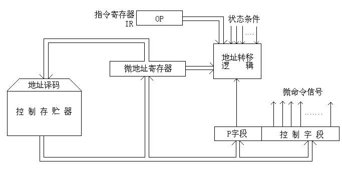
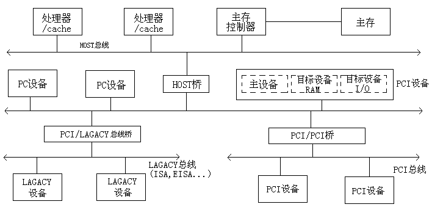
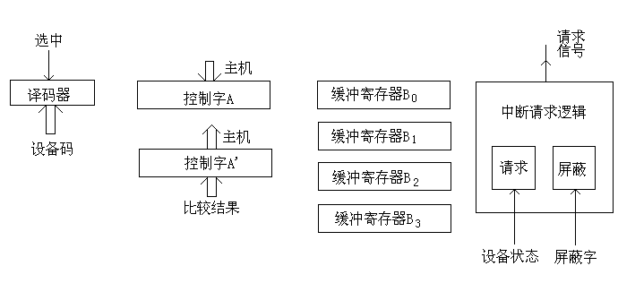

# 答案

**本科生期末试卷十八答案**
- **选择题**

1.  D    2.  B       3.  C    4.  B     5.  C

6.  C    7.  A、D   8.  C     9.  A    10.  B C
- **填空题**
1. A.程序    B.地址    C.冯·诺依曼
1. A.浮点    B.指数    C.对阶
1. A. 瞬时启动    B.存储器    C.固态盘
1. A.软件    B.操作控制    C.灵活性
1. A.总线带宽    B.传输速率    C.264MB / S

6.A.  可写数据共享  B. I/O活动  C.进程迁移
- 解：（1）定点原码整数表示：

最大正数：

数值  =  （231 –  1）10

最小负数：

数值  =  -（231 –  1）10

（2）定点原码小数表示：

最大正数值  =  （1  –  2-31 ）10

最小负数值  =  -（1  –  2-31  ）10
- 解：信息总量：  q = 64位  ×4 =256位

顺序存储器和交叉存储器读出4个字的时间分别是：

t2  = m T = 4×200ns =8×10 –7  (s)

t1  = T + (m – 1)τ  = 200 + 3×50 = 3.5  ×10 –7  (s)

顺序存储器带宽是：

W1  =  q  /  t2  = 32  ×107 （位/ S）

交叉存储器带宽是：

W2  = q /  t1  = 73  ×107 （位/ S）
- 解：（1）操作码字段为6位，可指定  26  = 64种操作，即64条指令。

（2）单字长（32）二地址指令。

（3）一个操作数在源寄存器（共16个），另一个操作数在存储器中（由变址寄

存器内容  +  偏移量决定），所以是RS型指令。

（4）这种指令结构用于访问存储器。
- 解：（1）假设判别测试字段中每一位为一个判别标志，那么由于有4个转移条件，         故该字段为4位（如采用字段译码只需3位），下地址字段为9位，因此控制存储器容量为512个单元，微命令字段是（  48  –  4  -  9  ）= 35  位。

（2）对应上述微指令格式的微程序控制器逻辑框图如B1.2如下：其中微地址寄存器对应下地址字段，P字段即为判别测试字段，控制字段即为微命令子段，后两部分组成微指令寄存器。地址转移逻辑的输入是指令寄存器OP码，各状态条件以及判别测试字段所给的判别标志（某一位为1），转移逻辑输出修改微地址寄存器的适当位数，从而实现微程序的分支转移。

图2
- 解：PCI总线结构框图如图3所示：

图3

PCI总线有三种桥，即HOST / PCI桥（简称HOST桥），PCI / PCI桥，PCI / LAGACY桥。在PCI总线体系结构中，桥起着重要作用：
1. 它连接两条总线，使总线间相互通信。
1. 桥是一个总线转换部件，可以把一条总线的地址空间映射到另一条总线的地址空间上，从而使系统中任意一个总线主设备都能看到同样的一份地址表。
1. 利用桥可以实现总线间的猝发式传送。
- 解：数据采集接口方案设计如图B1.4所示。

现结合两种工作方式说明上述部件的工作。
1. 定期巡检方式

主机定期以输出指令DOA、设备码；（或传送指令）送出控制字到A寄存器，其中用四位分别指定选中的缓冲寄存器（四个B寄存器分别与四个采集器相应）。然后，主机以输入指令DIA、设备码；（或传送指令）取走数据。
1. 中断方式

      比较结果形成状态字A' ，共8位，每二位表示一个采集器状态：00  正常 ，01  过低 ，10  过高。有任一处不正常（A' 中有一位以上为“1”）都将通过中断请求逻辑（内含请求触发器、屏蔽触发器）发出中断请求。中断响应后，服务程序以DIA、设备码；或传送指令）取走状态字。可判明有几处采集数据越限、是过高或过低，从而转入相应处理。

图4

九．解：

1）${F}_{e}$表示执行某个任务的总时间中改进部分的时间所占的百分比，${F}_{e}$〈1。

（1-F）表示不可改进部分，总是小于1；

当${F}_{e}$=0，即没有改进部分时，${S}_{P}$=1；

当${F}_{e}$<>0，即有改进部分时，${S}_{P}$>1；

${S}_{e}$表示改进部分比没有采用改进措施前性能提高的倍数。

当${S}_{e}$→∞时，${S}_{e}$=1/（1-${F}_{e}$）

2）根据题意      ${F}_{e}$=0.45,      ${S}_{e}$=10,  代入公式得

${S}_{P}=\frac {1} {(1-{F}_{e})+{F}_{e}/{S}_{e}}$=$\frac {1} {0.55+0.45/10}$=1.68

十．
