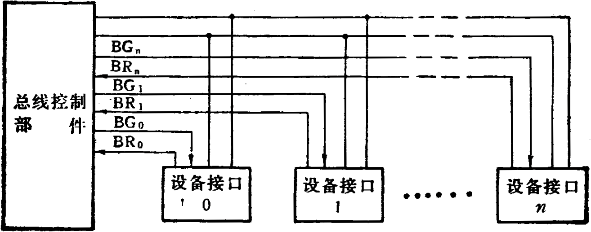
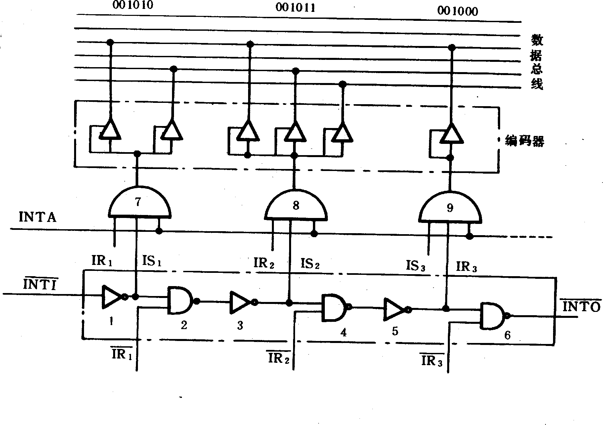

# 答案

**本科生期末试卷五答案**
- **选择题**

1．  B     2. D     3. B      4. B           5. B

6．  D     7. A     8. A      9.B     10. A  、B  、C
- **填空题**。

1.A.高速缓冲   B.速度   C.指令cache与数据cache
1. 2. A.指令条数少  B.指令长度固定   C.指令格式和寻址方式

3.A.时间  B.空间  C.时间  +  空间并行

4.A.存储    B.记录    C.结构

5.A.时间并行性    B.经济而实用    C.高性能。

**三．**解 ：命中率  H = Ne  /  （NC  + Nm） = 3800 / (3800  + 200) = 0.95

主存慢于cache的倍率 ：r = tm  / tc =  250ns / 50ns = 5

访问效率 ：e = 1 / [r + (1 – r)H] = 1 / [5 + (1 – 5)×0.95] = 83.3%

平均访问时间 ：ta  = tc  / e  =  50ns / 0.833 = 60ns

**四．**解 ：（1）串行进位方式：

C1  = G1  + P1  C0             其中：  G1  = A1  B1 ，P1  = A1⊕B1

C2  = G2  + P2  C1                                G2  = A2  B2 ，P2  = A2⊕B2

C3  = G3  + P3  C2                                    G3  = A3  B3  ,  P3  = A3⊕B3

C4  = G4 + P4 C3                                        G4  = A4  B4  ,  P4  = A4⊕B4

(2) 并行进位方式：

C1  = G1  + P1  C0

C2  = G2  + P2  G1  + P2  P1  C0

C3 = G3  + P3  G2  + P3  P2  G1  + P3  P2  P1  C0

C4  =  G4 + P4  G3  + P4 P3  G2  + P4P3  P2  G1  + P4  P3  P2  P1  C0

其中  G1—G4 ，P1—P4 表达式与串行进位方式相同。

**五．**解：根据图1中已知，ROM1的空间地址为0000H——3FFFH，ROM2的地址空                               间地址为4000H——7FFFH，RAM1的地址空间为C000H——DFFFH，RAM2的地址空间为E000H——FFFFH。

对应上述空间，地址码最高4位A15——A12状态如下：

0000——0011  ROM1

0100——0111  ROM2

1100——1101  RAM1

1110——1111  RAM2

2  ：4译码器对A15A14两位进行译码，产生四路输出，其中 ：y0  = 00  对应ROM1      ， y1  = 01对应ROM2   ，y3  = 11  对应  RAM1和RAM2。然后用A13区分是RAM1（A13  = 0）

还是RAM2（A13  = 1），此处采用部分译码。

由此，两组端子的连接方法如下：

1——6，  2——5，  3——7，  8——12，  11——14，  9———13

**六．**解： 采用水平微指令格式，且直接控制方式，顺序控制字段假设4位，其中一位判别测试位：

2位          2位                2位                            3位                        1位            3位

←——————————直接控制———————————→ ←——顺序控制

当P = 0时，直接用μAR1——μAR3形成下一个微地址。

当P = 1时，对μAR3进行修改后形成下一个微地址。

**七．**解 ：有三种方式：链式查询方式、计数器定时查询方式、独立请求方式。

独立请求方式结构图如图2：

**图2**

**八．**解：令中断向量001010为A设备，001011为B设备，001000为C设备，三个设备的判优识别，逻辑图如图3：

**图3**

**九．**解：设加速比Sp，可加速部分的比例Fe，理论加速比Se，根据Amdahl定律有：

$$
{S}_{P}=\frac {1} {(1-{F}_{e})+{F}_{e}/{S}_{e}}
$$

为简单化，假设程序只在两种模式下运行：①使用所有处理机的并行程模式；②只用一台处理机的串行模式。又假设并行模式下的理论加速比Se即为多处理机的台数，加速部分的比例Fe即并行部分所占的比例， 已知Sp＝40;        Se＝50,代入上式有：

40＝$\frac {1} {(1-{F}_{e})+{F}_{e}/50}$

求得并行部分所占比例      Fe＝99.49％    串行部分所占比例  1－Fe＝0.51％

**十．**
