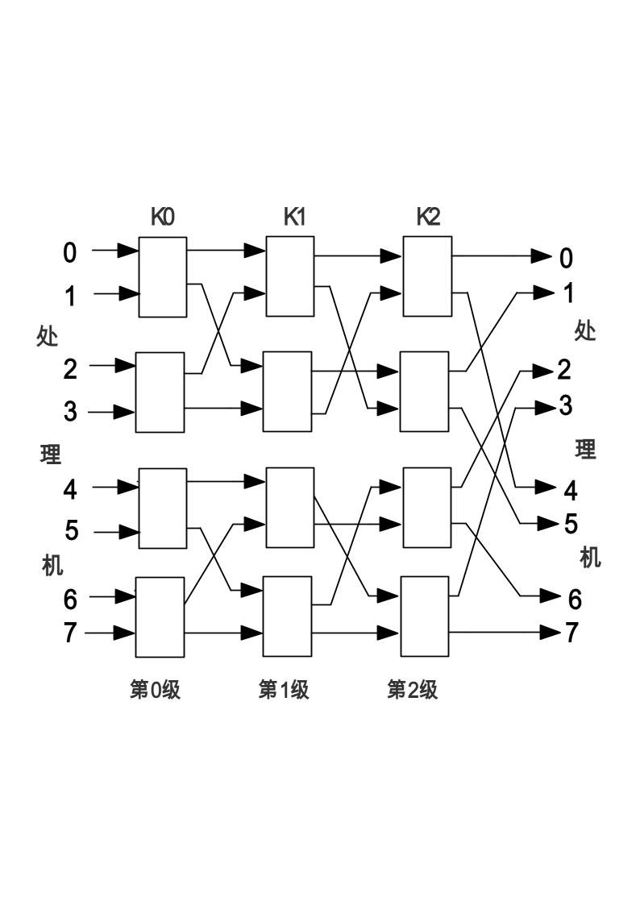

# 答案

**本科生期末试卷七答案**
- 选择题

1．C    2.  B    3．B    4．C    5．C

6．B    7．B    8．D    9．C    10．C
- 填空题

1.A.寻址方式  B.操作数有效  C.二地址指令

2.A.并行   B.空间并行  C.时间并行

3.A.指令操作码    B.时序  C.状态条件

4.A.结构    B.CPU      C.技术

5.  A.  高速开关  B.  拓扑  C.控制
- 因为        [x]补 + [y]补 = [x + y]补

所以    [y]补    = [x + y]补  - [x]补                                  ①

又    [x-y]补  =  [x+（-y）]补  = [x]补  + [-y]补

所以        [-y]补= [x-y]补  - [x]补                              ②

将①和②相加，得

[y]补  + [-y]补  =  [x + y]补+ [x  -  y]补- [x]补- [x]补

=  [x + y  +  x - y]补- [x]补- [x]补

=  [x + x]补- [x]补- [x]补 =  0

所以        [-y]补 = -[y]补

四．解：① 命中率 H = Nc/（Nc+Nm） = 5000/（5000+2000）=5000/5200=0.96

②  主存慢于cache的倍率  R = Tm/Tc=160ns/40ns=4

访问效率：

ｅ＝　１／［ｒ＋（１－ｒ）Ｈ］＝１／［４+（１－４）×０.９６］

＝８９.３℅

③　　平均访问时间  Ｔａ＝Ｔｃ／ｅ＝４０／０.８９３＝４５nｓ

五．解：（1）双字长二地址指令，用于访问存储器。

（2）操作码字段OP为6位，可以指定26  = 64种操作。

（3）一个操作数在源寄存器（共16个），另一个操作数在存储器中（由基值寄存器

和位移量决定），所以是RS型指令。

六．解：当24个控制信号全部用微指令产生时，可采用字段译码法进行编码控制，采用的微指令格式如下（其中目地操作数字段与打入信号段可结合并公用，后者加上节拍脉冲控制即可）。

3位                3位                  5位                    4位                  3位        2位

X

目的操作数  源操作数     运算操作      移动操作  直接控制  判别  下址字段

编码表如下：

| 目的操作数字段 | 源操作数字段 | 运算操作字段 | 移位门字段 | 直接控制字段 |
|---|---|---|---|---|
| 001  a,  LDR0 010  b,  LDR1 011  c,  LDR2 100  d,  LDR3 | 001  e 010  f 011  g 100  h | MS0S1S2S3 | L, R, S, N | i,  j,  +1 |

七.  解：可指定16种，实际给出12种。

存储器读  /  写总线周期以猝发式传送为基本机制，一次猝发式传送总线周期通常由一个地址周期和一个或几个数据周期组成。存储器读  /  写周期的解释，取决于PCI总线上的存储器控制器是否支持存储器  / **cache**之间的PCI传输协议。如果支持，则存储器读  /  写一般是通过**cache**来进行；否则，是以数据非缓存方式来传输。
- 解：
1. 是调频制（FM）；
1. 是改进调频制（MFM）；
1. 是调相制（PE）；
1. 是调频制（FM）；
1. 是不归零制（NRZ）；
1. 是“见1就翻制”（NRZ1）。
- 解：1)

2）输入4号处理机与输出2号处理机相连

十．
