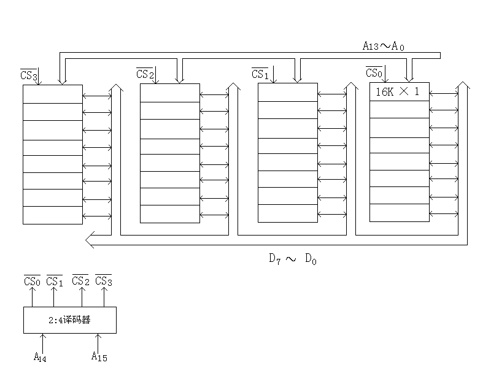
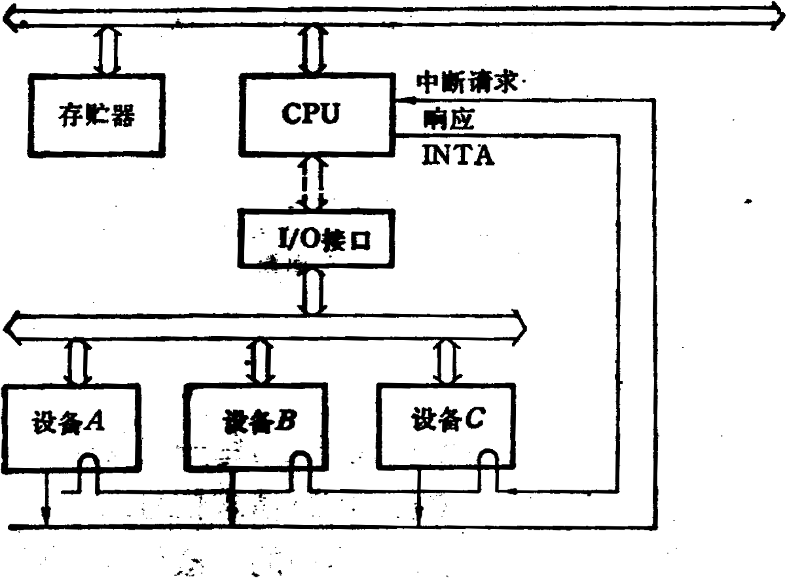
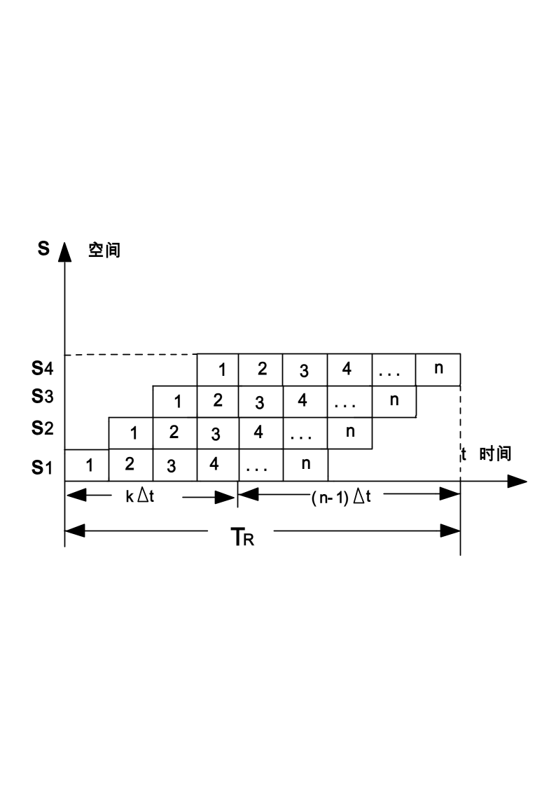

# 答案

**本科生期末试卷九答案**
- **选择题**

1．A    2.  B     3. D    4. C    5. B

6. B    7. B     8. B、D  9. B   10. A
- **填空题**

1．A.MMX     B.多媒体扩展结构    C.图象数据

2．A.定时协议   B.同步   C.异步

3．A.内存    B.CPU      C.I / O

4．A.10000亿   B.神威   C.美国、日本

5．A.  总线  B.  多机互连  C.交叉开关

**三.** 解：  [ x ]补 =  0.1011              ，    [ y ]补 = 1.1011

[$\frac {1} {2}$x ]补 = 0.01011      ，      [$\frac {1} {2}$y  ]补 = 1.11011

[$\frac {1} {4}$x ]补 =  0.001011  ，[$\frac {1} {4}$ y  ]补 =  1.111011

[ - x ]补 =  1.0101        ，  [ -  y  ]补 =0.0101

[ x ]补 =    00.1011                     [ x ]补 = 00.1011

+ [ - y ]补 =00.0101                 +      [ y ]补 = 11.1011

| 01.0000                             00.0110 符号位相异 x  – y溢出                                  x+y=0.0110 |
|---|

**四.** 解：（1）根据题意，存储器总量为64KB，故地址线总需16位。现使用16K×1位的动态RAM芯片，共需32片。芯片本身地址线占14位，所以采用位并联与地址串联相结合的方法来组成整个存储器，其组成逻辑框图如图3，其中使用一片2  ：4译码器。

（2）根据已知条件，CPU在1μs内至少需要访存一次，所以整个存储器的平均读/  写周期与单个存储器片的读  /  写周期相差不多，应采用异步刷新比较合理。

对动态MOS存储器来讲，两次刷新的最大时间间隔是2μs。RAM芯片读/  写周期为0.5μs，

假设16K ×1位的RAM芯片由128 × 128矩阵存储元构成，刷新时只对128行进行异步方式刷新，则刷新间隔为2m /  128 = 15.6μs，可取刷新信号周期15μs。

                                  **图** **3**

**五.** 解：（1）双字长二地址指令，用于访问存储器。

（2）操作码字段OP为6位，可以指定26  = 64种操作。

（3）一个操作数在源寄存器（共16个），另一个操作数在存储器中（由基值寄存器

和位移量决定），所以是RS型指令。

**六.** 解：
1. a为数据缓冲寄存器  DR  ，b为指令寄存器  IR  ，c为主存地址寄存器，d为程序计数器PC。
1. 主存  M →缓冲寄存器  DR →指令寄存器  IR →操作控制器。

(3)存储器读 ：M →DR →ALU →AC

存储器写 ：AC →DR →M

**七.** 解：设读写一块信息所需总时间为T，平均找到时间为Ts，平均等待时间为TL，读写一块信息的传输时间为Tm，则：T=Ts＋TL＋Tm。

假设磁盘以每秒r的转速率旋转，每条磁道容量为N个字，则数据传输率=rN个字/秒。

又假设每块的字数为n，因而一旦读写头定位在该块始端，就能在Tm≈（n / rN）秒的时间中传输完毕。

TL是磁盘旋转半周的时间，TL=（1/2r）秒，由此可得：

T=Ts＋1/2r＋n/rN  秒

**八.** 解：

假设主存工作周期为TM，执行一条指令的时间也设为TM  。则中断处理过程和各时间段如图4所示。当三个设备同时发出中断请求时，依次处理设备A、B、C的时间如下：

tA  = 2TM  +  3TDC  + TS  + TA  + TR

tB  = 2TM  +  2TDC  + TS  + TB  + TR

tC  = 2TM  + TDC  + TS  + TC  + TR

达到中断饱和的时间为：  T =  tA +  tB +  tC      中断极限频率为：f  = 1 / T

**图** **4**

**九.** 解：1）n条指令进入流水线的时空图如下：

2）从流程图可以看出，用k个时钟周期完成第1条指令，其余n-1完成个时钟周期完成n-1条指令，n条指令所需的总时间Tk为：

Tk=（k+n-1）×Δt

P=$\frac {n} {{T}_{k}}$=  $\frac {n} {(k+n-1)\times \Delta t}$

**十.**
