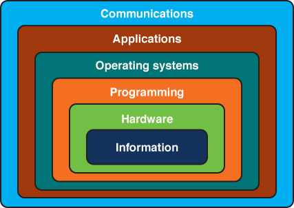
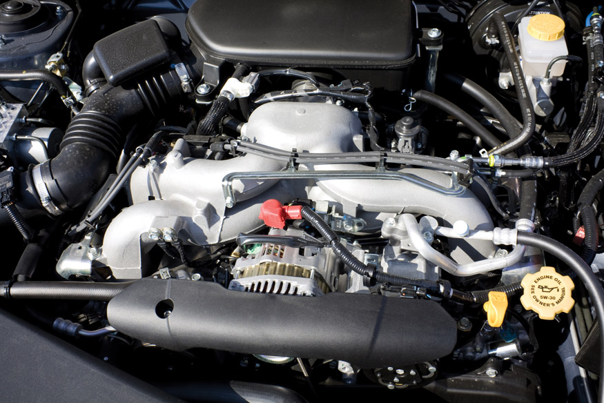
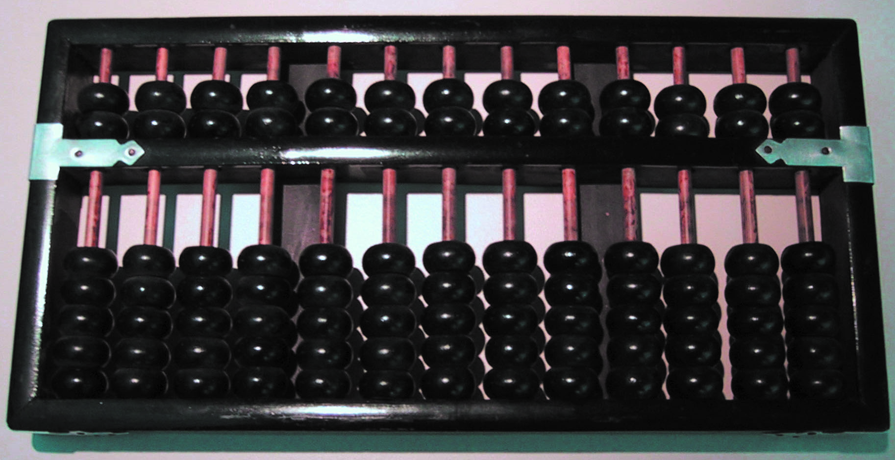
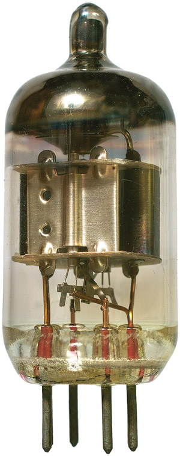
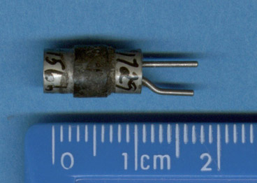
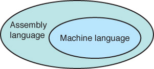
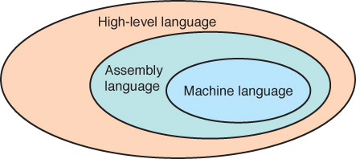
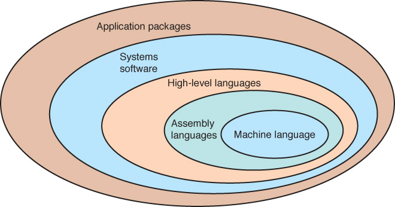

# 第1章

<!-- slide: 1 -->

## The Big Picture

- Chapter 1

<!-- slide: 2 -->

## Chapter Goals

- Describe the layers of a computer system
- Describe the concept of abstraction and its relationship to computing
- Describe the history of computer hardware and software
- Describe the changing role of the computer user
- Distinguish between systems programmers and applications programmers
- Distinguish between computing as a tool and computing as a discipline
- <number>
- 25

<!-- slide: 3 -->

## Computing Systems

- <number>
- 2
- Computing systems are dynamic!
- computer hardware ,software, data which interact to solve the problem.
- What is the difference between hardware and software?

<!-- slide: 4 -->

## Computing Systems

- <number>
- 3
- Hardware  The physical elements of a computing system (printer, circuit boards, wires, keyboard…)
- Software  The programs that provide the instructions for a computer to execute

<!-- slide: 5 -->

## Layers of a Computing System

- <number>
- 4

<!-- slide: 6 -->

## Abstraction

- <number>
- 5
- Abstraction  A mental model that removes complex details
- This is a key concept.  Abstraction will reappear throughout the text – be sure you understand it!

<!-- slide: 7 -->

## Internal View

- <number>

<!-- slide: 8 -->

## Abstract View

- <number>

<!-- slide: 9 -->

## History

- <number>

<!-- slide: 10 -->

## Early History of Computing

- <number>
- 6
- Abacus
- An early device to record numeric values
- Blaise Pascal
- Mechanical device to add, subtract, divide & multiply
- Joseph Jacquard
- Jacquard’s Loom, the punched card
- Charles Babbage
- Analytical Engine

<!-- slide: 11 -->

## Early History of Computing

- <number>
- 7
- Ada Lovelace
- First Programmer, the loop
- Alan Turing
- Turing Machine, Artificial Intelligence Testing
- Harvard Mark I, ENIAC, UNIVAC I
- Early computers launch new era in mathematics, physics, engineering and economics

<!-- slide: 12 -->

## First Generation Hardware (1951-1959)

- <number>
- 8
- Vacuum Tubes
- Large, not very reliable, generated a lot of heat
- Magnetic Drum
- Memory device that rotated under a read/write head
- Card Readers  Magnetic Tape Drives
- Sequential auxiliary storage devices

<!-- slide: 13 -->

## Second Generation Hardware (1959-1965)

- <number>
- 9
- Transistor
- Replaced vacuum tube, fast, small, durable, cheap
- Magnetic Cores
- Replaced magnetic drums, information available instantly
- Magnetic Disks
- Replaced magnetic tape, data can be accessed directly

<!-- slide: 14 -->

## Third Generation Hardware (1965-1971)

- <number>
- 10
- Integrated Circuits
- Replaced circuit boards, smaller, cheaper, faster, more reliable
- Transistors
- Now used for memory construction
- Terminal
- An input/output device with a  keyboard and screen

<!-- slide: 15 -->

## Fourth Generation Hardware (1971-?)

- <number>
- 11
- Large-scale Integration
- Great advances in chip technology
- PCs, the Commercial Market, Workstations
- Personal Computers and Workstations emerge
- New companies emerge: Apple, Sun, Dell …
- Laptops, Tablet Computers, and Smart Phones
- Everyone has his/her own portable computer

<!-- slide: 16 -->

## Parallel Computing and Networking

- <number>
- 12
- Parallel Computing
- Computers rely on interconnected central processing and/or memory units that increase processing speed
- Networking
- Ethernet connects small computers to share resources
- File servers connect PCs in the late 1980s
- ARPANET and LANs  Internet

<!-- slide: 17 -->

## First Generation Software (1951-1959)

- <number>
- 13
- Machine Language
- Computer programs written in binary (1s and 0s)
- Assembly Languages and Translators
- Programs written using mnemonics, which were translated into machine language
- Programmer Changes
- Programmers divide into two groups: application programmers and systems programmers

<!-- slide: 18 -->

## Assembly/Machine

- <number>

- Systems programmers
- write the assembler
- (translator)
- Applications programmers
- use assembly language to
- solve problems

<!-- slide: 19 -->

## Second Generation Software (1959-1965)

- <number>
- 14
- High-level Languages
- English-like statements made programming easier:
- Fortran, COBOL, Lisp

- Systems
- programmers
- write translators for
- high-level languages
- Application
- programmers
- use high-level
- languages to
- solve problems

<!-- slide: 20 -->

## Third Generation Software (1965-1971)

- Systems Software
- Utility programs
- Language translators
- Operating system, which decides which programs 	to run and when
- Separation between Users and Hardware
- Computer programmers write programs to be used by general public (i.e., nonprogrammers)
- <number>
- 15

<!-- slide: 21 -->

## Third Generation Software (1965-1971)

- <number>
- 16

<!-- slide: 22 -->

## Fourth Generation Software (1971-1989)

- <number>
- 17
- Structured Programming
- Pascal
- C++
- New Application Software for Users
- Spreadsheets
- Word processors
- Database management systems

<!-- slide: 23 -->

## Fifth Generation Software (1990- present)

- <number>
- 18
- Microsoft
- Windows operating system and other Microsoft application programs dominate the market
- Object-Oriented Design
- Based on a hierarchy of data objects (i.e. Java)
- World Wide Web
- Allows easy global communication through the Internet
- New Users
- Today’s user needs no computer knowledge

<!-- slide: 24 -->

## Computing as a Tool

- <number>
- Programmer / User
- Applications Programmer
- (uses tools)
- User with No
- Computer Background
- Systems Programmer
- (builds tools)
- Domain-Specific Programs

<!-- slide: 25 -->

## Computing as a Discipline

- What can be (efficiently) automated?
- Four Necessary Skills
    - Algorithmic Thinking
    - Representation
    - Programming
    - Design
- <number>
- 21

<!-- slide: 26 -->

## Computing as a Discipline

- <number>
- Is Computer Science a mathematical,  scientific, or engineering discipline?
- 22
- What do you think?

<!-- slide: 27 -->

## Examples of Systems Areas

- Algorithms and Data Structures
- Programming Languages
- Architecture
- Operating Systems
- Software Engineering
- Human-Computer Communication
- <number>
- 23

<!-- slide: 28 -->

## Examples of Application Areas

- Numerical and Symbolic Computation
- Databases and Information Retrieval
- Intelligent Systems
- Graphics and Visual Computing
- Net-Centric Computing
- Computational Science
- <number>
- 24

<!-- slide: 29 -->

## 作业

- <number>

- 通过网络进行信息检索，写一篇400字以内
- 关于我国计算机硬件和软件发展历史的文章。
- 提交：http://1024.se.scut.edu.cn
- 截止时间：10.4晚上。
