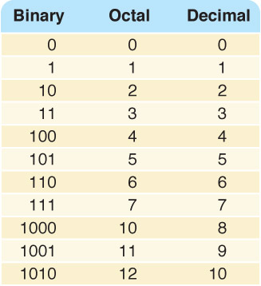
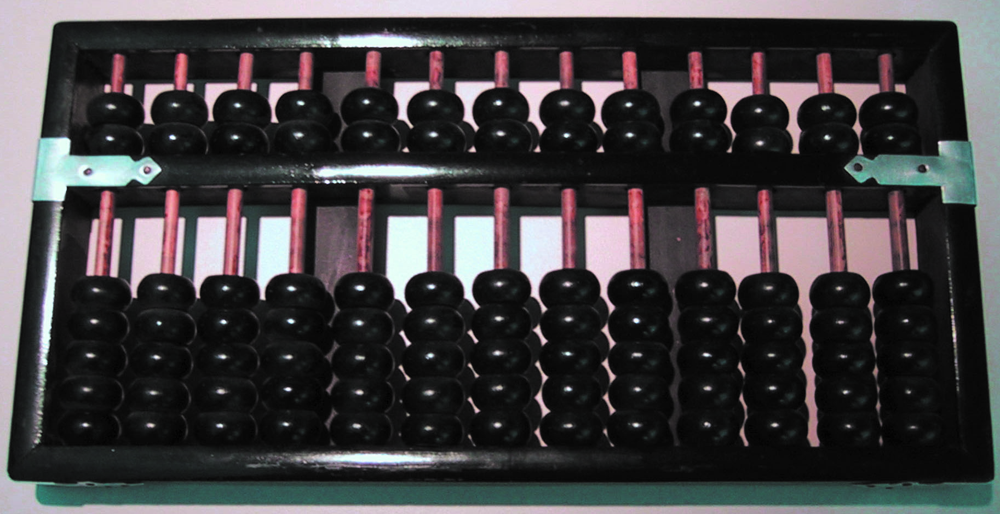
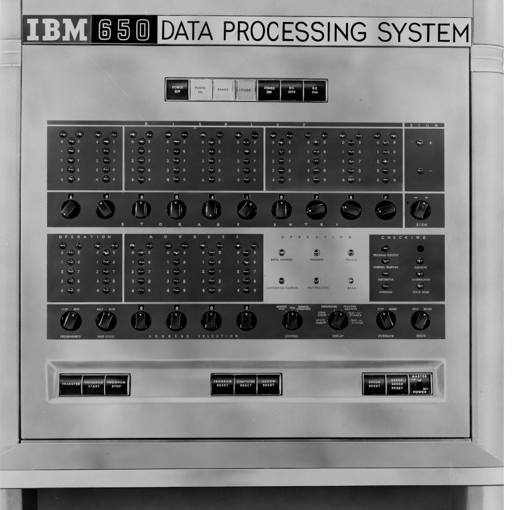

# 第2章

<!-- slide: 1 -->

## Chapter 2

- Binary Values and Number Systems

<!-- slide: 2 -->

## Chapter Goals

- <number>
- 6
- 24
- Distinguish among categories of numbers
- Describe positional notation
- Convert numbers in other bases to base 10
- Convert base-10 numbers to numbers in other bases
- Describe the relationship between bases 2, 8, and 16
- Explain the importance to computing of bases that are powers of 2

<!-- slide: 3 -->

## Numbers

- <number>
- 2
- Natural Numbers
- Zero and any number obtained by repeatedly adding one to it.
- Examples:   100, 0, 45645, 32
- Negative Numbers
- A value less than 0, with a – sign
- Examples:  -24,  -1, -45645, -32

<!-- slide: 4 -->

## Numbers

- <number>
- 3
- Integers
- A natural number, a negative number, zero
- Examples:   249, 0, - 45645, - 32
- Rational Numbers
- An integer or the quotient of two integers
- Examples:  -249,  -1, 0, 3/7, -2/5

<!-- slide: 5 -->

## Natural Numbers

- <number>
- 4
- How many ones are there in 642?
- 600 + 40 + 2 ?
- Or is it
- 384 + 32 + 2 ?
- Or maybe…
- 1536 + 64 + 2 ?

<!-- slide: 6 -->

## Natural Numbers

- <number>
- 5
- Aha!
- 642  is 600 + 40 + 2 in BASE 10
- The base of a number determines the number of digits and the value of digit positions

<!-- slide: 7 -->

## Positional Notation

- <number>
- 6
- Continuing with our example…
- 642 in base 10 positional notation is:
- 6 x 102 =  6 x 100   = 600
- + 4 x 101  =   4 x 10    = 40
- + 2 x 10º  =    2 x 1     = 2      = 642 in base 10
- This number is in
- base 10
- The power indicates
- the position of
- the number

<!-- slide: 8 -->

## Positional Notation

- <number>
- 7
- dn * Rn-1 + dn-1 * Rn-2 + ... + d2 * R + d1
- As a formula:
- 642 is   63 * 102 +  42 * 10 +  21
- R is the base
- of the number
- n is the number of
- digits in the number
- d is the digit in the
- ith position
- in the number

<!-- slide: 9 -->

## Positional Notation

- <number>
- 6
- 8
- What if 642 has the base of 13?
- 642 in base 13 is equivalent to 1068
- in base 10
- + 6 x 132  =  6 x 169   = 1014
- + 4 x 131  =   4 x 13    = 52
- + 2 x 13º  =    2 x 1     =   2
- =  1068 in base 10

<!-- slide: 10 -->

## Binary

- <number>
- 9
- Decimal is base 10 and has 10 digits: 		0,1,2,3,4,5,6,7,8,9
- Binary is base 2 and has 2 digits:
- 0,1
- For a number to exist in a given base, it can only  contain the digits in that base, which range from 0 up to (but not including) the base.
- What bases can these numbers be in? 122, 198, 178, G1A4

<!-- slide: 11 -->

## Bases Higher than 10

- <number>
- 10
- How are digits in bases higher than 10 represented?
- With distinct symbols for 10 and above.
- Base 16 has 16 digits:
- 0,1,2,3,4,5,6,7,8,9,A,B,C,D,E, and F

<!-- slide: 12 -->

## Converting Octal to Decimal

- <number>
- What is the decimal equivalent of the octal number 642?
- 6 x 82  =  6 x 64   = 384
- + 4 x 81  =  4 x  8   = 32
- + 2 x 8º  =   2 x 1   = 2
- = 418 in base 10
- 11

<!-- slide: 13 -->

## Converting Hexadecimal to Decimal

- <number>
- What is the decimal equivalent of the hexadecimal number DEF?
- D x 162  =  13 x 256 = 3328
- + E x 161  =  14 x  16  = 224
- + F x 16º  =  15 x 1     = 15
- = 3567 in base 10
- Remember, the digits in base 16 are 0,1,2,3,4,5,6,7,8,9,A,B,C,D,E,F

<!-- slide: 14 -->

## Converting Binary to Decimal

- <number>
- What is the decimal equivalent of the binary number 1101110?
- 1 x 26  =  1 x 64  = 64
- + 1 x 25  =  1 x 32  = 32
- + 0 x 24  =  0 x 16  = 0
- + 1 x 23  =  1 x 8    = 8
- + 1 x 22  =  1 x 4    = 4
- + 1 x 21  =  1 x 2    = 2
- + 0 x 2º  =  0 x 1    = 0
- = 110 in base 10
- 13

<!-- slide: 15 -->

## Arithmetic in Binary

- <number>
- Remember that there are only 2 digits in binary, 0 and 1
- 1 + 1 is 0 with a carry
- Carry Values
- 1 1 1 1 1 1
- 1 0 1 0 1 1 1
- +1 0 0 1 0 1 1
- 1 0 1 0 0 0 1 0
- 14

<!-- slide: 16 -->

## Subtracting Binary Numbers

- <number>
- Remember borrowing?  Apply that concept here:
- 1 2
- 2 0 2
- 1 0 1 0 1 1 1
- -   1 1 1 0 1 1
- 0 0 1 1 1 0 0
- 15

<!-- slide: 17 -->

## Counting in Binary/Octal/Decimal

- <number>

<!-- slide: 18 -->

## Converting Binary to Octal

- <number>
- Mark groups of three (from right)
- Convert each group
- 10101011	     10  101  011
- 2    5     3
- 10101011 is 253 in base 8
- 17

<!-- slide: 19 -->

## Converting Binary to Hexadecimal

- <number>
- Mark groups of four (from right)
- Convert each group
- 10101011	     1010  1011
- A      B
- 10101011 is AB in base 16
- 18

<!-- slide: 20 -->

## Converting Decimal to Octal

- <number>
- We can use the calculate tools!
- http://fclass.vaniercollege.qc.ca/web/mathematics/real/Calculators/BaseConv_calc_1.htm

<!-- slide: 21 -->

## Abacus

- <number>

> 备注：Insert picture of an abacus

<!-- slide: 22 -->

## Converting Decimal to Other Bases

- <number>
- While (the quotient is not zero)
  - Divide the decimal number by the new base
  - Make the remainder the next digit to the left in the answer
  - Replace the original decimal number with the quotient
- Algorithm for converting number in base 10 to other bases
- 19

<!-- slide: 23 -->

## Converting Decimal to Octal

- <number>
- What is 1988 (base 10) in base 8?
- Try it!

<!-- slide: 24 -->

## Converting Decimal to Octal

- <number>
- 248	         31  	     3              0
- 8  1988	   8  248        8  31          8  3
- 16            24              24              0
- 38	         08	      7             3
- 32	           8
- 68	           0
- 64
- 4
- Answer is : 3 7 0 4

<!-- slide: 25 -->

## Converting Decimal to Hexadecimal

- <number>
- What is 3567 (base 10) in base 16?
- Try it!
- 20

<!-- slide: 26 -->

## Converting Decimal to Hexadecimal

- <number>
- 222	        13                   0
- 16  3567 	16  222           16  13
- 32                   16                      0
- 36		        62	        13
- 32		        48
- 47	        14
- 32
- 15
- D E F
- 21

<!-- slide: 27 -->

## Binary Numbers and Computers

- <number>
- Computers have storage units called binary digits or bits
- Low Voltage = 0
- High Voltage = 1           all bits have 0 or 1
- 22

<!-- slide: 28 -->

## Binary and Computers

- <number>
- Byte
- 8 bits
- The number of bits in a word determines the word length of the computer, but it is usually a multiple of 8
  - 32-bit machines
  - 64-bit machines etc.
- 23

<!-- slide: 29 -->

- <number>

<!-- slide: 30 -->

## Ethical Issues

- <number>
- Tenth Strand
  - What is a knowledge Unit?
  - How many units did the ImpactCS project recommend?
  - How many units did Curricula 2001 recommend?
  - How were these similar/different?

<!-- slide: 31 -->

## Who am I?

- <number>
- Can you tell the
- person sitting
- next to you three
- things about me?

<!-- slide: 32 -->

## 作业

- <number>

- P48:
- 23.a 23.b 23.c 28.a  29.b 31.b 32.c 33.a
