# 第4章

<!-- slide: 1 -->

## Chapter 4

- Gates and Circuits

<!-- slide: 2 -->

## Chapter Goals

- <number>
- Identify the basic gates and describe the behavior of each
- Describe how gates are implemented using transistors
- Combine basic gates into circuits
- Describe the behavior of a gate or circuit using Boolean expressions, truth tables, and logic diagrams

<!-- slide: 3 -->

## Chapter Goals

- <number>
- Compare and contrast a half adder and a full adder
- Describe how a multiplexer works
- Explain how an S-R latch operates
- Describe the characteristics of the four generations of integrated circuits

<!-- slide: 4 -->

## Computers and Electricity

- <number>
- Gate
- A device that performs a basic operation on
- electrical signals
- Circuits
- Gates combined to perform more
- complicated tasks

<!-- slide: 5 -->

## Computers and Electricity

- <number>
- How do we describe the behavior of gates and circuits?
- Boolean expressions
- Uses Boolean algebra, a mathematical notation for expressing two-valued logic
- Logic diagrams
- A graphical representation of a circuit; each gate has its
- own symbol
- Truth tables
- A table showing all possible input values and the associated
- output values

<!-- slide: 6 -->

## Gates

- <number>
- Six types of gates
  - NOT
  - AND
  - OR
  - XOR
  - NAND
  - NOR
- Typically, logic diagrams are black and white with gates distinguished only by their shape
- We use color for emphasis (and fun)

<!-- slide: 7 -->

## NOT Gate

- <number>
- A NOT gate accepts one input signal (0 or 1) and returns the opposite signal as output
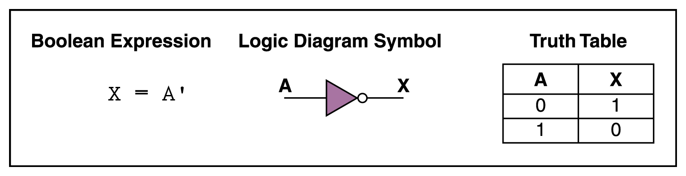
- Figure 4.1  Various representations of a NOT gate

<!-- slide: 8 -->

## AND Gate

- <number>
- An AND gate accepts two input signals
- If both are 1, the output is 1; otherwise,
- the output is 0
- Figure 4.2  Various representations of an AND gate
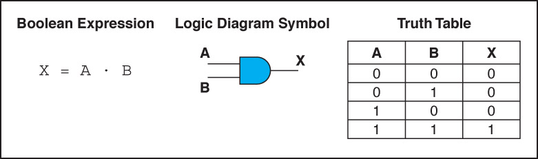

<!-- slide: 9 -->

## OR Gate

- <number>
- An OR gate accepts two input signals
- If both are 0, the output is 0; otherwise,
- the output is 1
- Figure 4.3  Various representations of an OR gate
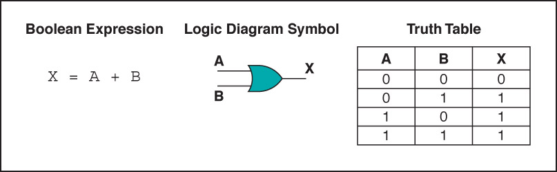

<!-- slide: 10 -->

## XOR Gate

- <number>
- Figure 4.4  Various representations of an XOR gate
- An XOR gate accepts two input signals
- If both are the same, the output is 0; otherwise,
- the output is 1
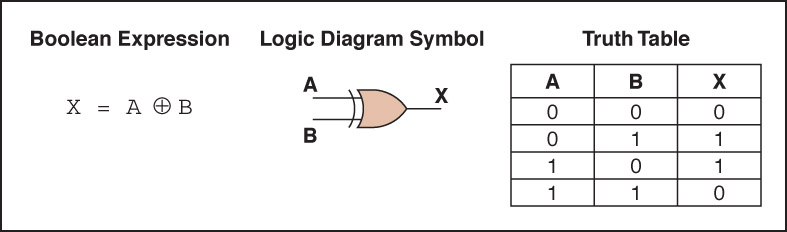

<!-- slide: 11 -->

## XOR Gate

- <number>
- Note the difference between the XOR gate and the OR gate; they differ only in one input situation
- When both input signals are 1, the OR gate produces a 1 and the XOR produces a 0
- XOR is called the exclusive OR

<!-- slide: 12 -->

## NAND Gate

- The NAND gate accepts two input signals
- If both are 1, the output is 0; otherwise,
- the output is 1
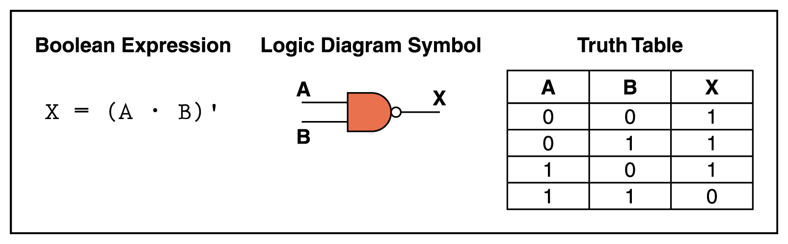
- Figure 4.5  Various representations of a NAND gate

<!-- slide: 13 -->

## NOR Gate

- <number>
- Figure 4.6  Various representations of a NOR gate
- The NOR gate accepts two input signals
- If both are 0, the output is 1; otherwise,
- the output is 0
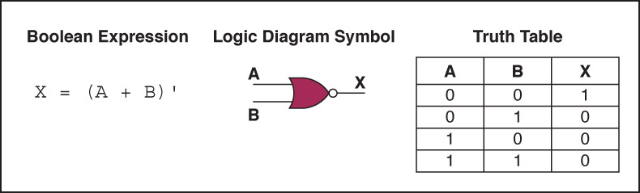

<!-- slide: 14 -->

## Review of Gate Processing

- <number>
- A NOT gate inverts its single input
- An AND gate produces 1 if both input values are 1
- An OR gate produces 0 if both input values are 0
- An XOR gate produces 0 if input values are the same
- A NAND gate produces 0 if both inputs are 1
- A NOR gate produces a 1 if both inputs are 0

<!-- slide: 15 -->

## Gates with More Inputs

- <number>
- Gates can be designed to accept three or more input values
- A three-input AND gate, for example, produces an output of 1 only if all input values are 1
- Figure 4.7  Various representations of a three-input AND gate
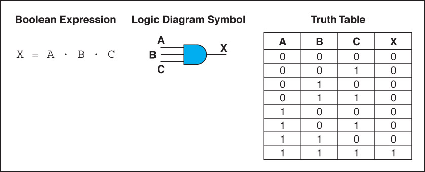

<!-- slide: 16 -->

## Constructing Gates

- <number>
- Transistor
- A device that acts either as a wire that conducts electricity or as a resistor that blocks the flow of electricity, depending on the voltage level of an input signal
- A transistor has no moving parts, yet acts like a switch
- It is made of a semiconductor material, which is neither a particularly good conductor of electricity nor a particularly good insulator

<!-- slide: 17 -->

## Constructing Gates

- <number>
- A transistor has three terminals
  - A source
  - A base
  - An emitter, typically connected to a ground wire
- If the electrical signal is grounded, it is allowed to flow through an alternative route to the ground (literally) where it can do no harm
- Figure 4.8  The connections of a transistor
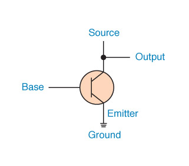

<!-- slide: 18 -->

## Constructing Gates

- <number>
- The easiest gates to create are the NOT, NAND, and NOR gates
- Figure 4.9  Constructing gates using transistors
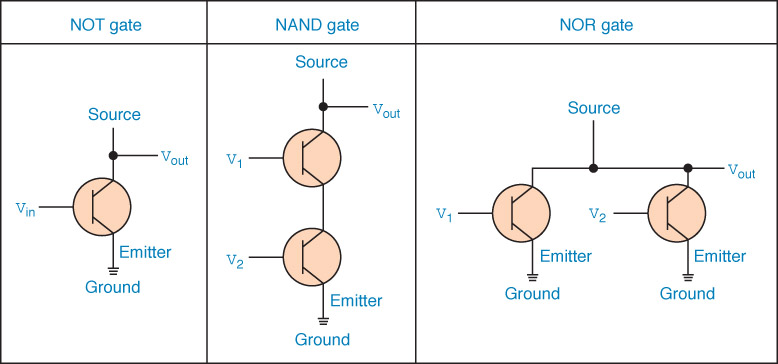

<!-- slide: 19 -->

## Circuits

- <number>
- Combinational circuit
- The input values explicitly determine the output
- Sequential circuit
- The output is a function of the input values and the existing state of the circuit
- We describe the circuit operations using
  - Boolean expressions
  - Logic diagrams
  - Truth tables
- Are you surprised?

<!-- slide: 20 -->

## Combinational Circuits

- <number>
- Gates are combined into circuits by using the output of one gate as the input for another
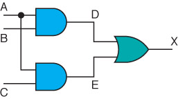

<!-- slide: 21 -->

## Combinational Circuits

- <number>
- Three inputs require eight rows to describe all possible input combinations
- This same circuit using a Boolean expression is (AB + AC)
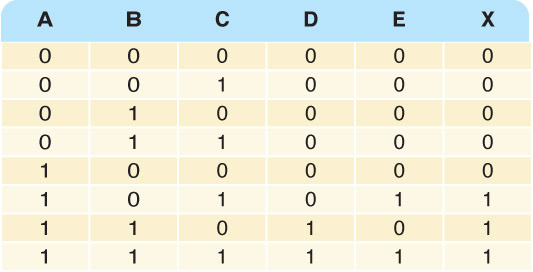

<!-- slide: 22 -->

## Combinational Circuits

- <number>
- Consider the following Boolean expression A(B + C)
- Does this truth table look familiar?
- Compare it with previous table
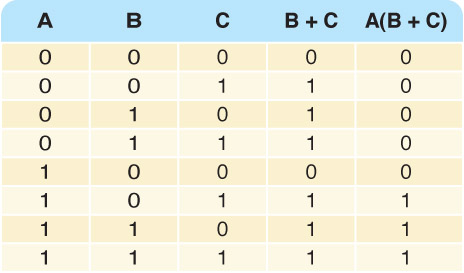
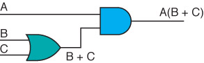

<!-- slide: 23 -->

## Combinational Circuits

- <number>
- Circuit equivalence
- Two circuits that produce the same output for identical input
- Boolean algebra allows us to apply provable mathematical principles to help design circuits
- A(B + C) = AB + BC (distributive law) so circuits must be equivalent

<!-- slide: 24 -->

## Properties of Boolean Algebra

- <number>
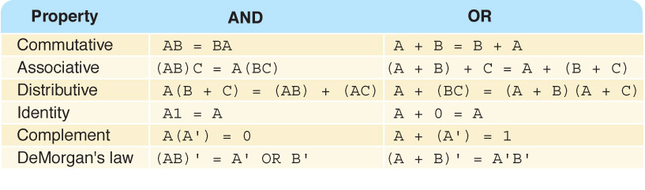

<!-- slide: 25 -->

## Adders

- <number>
- At the digital logic level, addition is performed in binary
- Addition operations are carried out by special circuits called, appropriately, adders

<!-- slide: 26 -->

## Adders

- <number>
- The result of adding two binary digits could produce a carry value
- Recall that 1 + 1 = 10 in base two
- Half adder
- A circuit that computes the sum of two bits and produces the correct carry bit
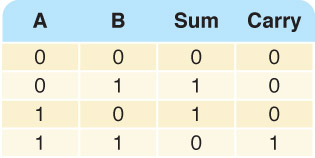
- Truth table

<!-- slide: 27 -->

## Adders

- <number>
- Circuit diagram representing a half adder
- Boolean expressions
- sum = A  B
- carry = AB
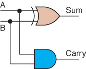

<!-- slide: 28 -->

## Adders

- <number>
- Full adder
- A circuit that takes the carry-in value into account
- Figure 4.10  A full adder
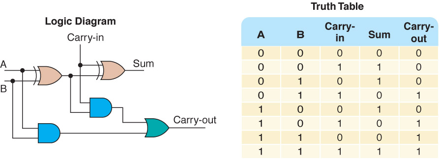

<!-- slide: 29 -->

## Multiplexers

- <number>
- Multiplexer
- A circuit that uses a few input control signals to determine which of several output data lines is routed to its output

<!-- slide: 30 -->

## Multiplexers

- <number>
- The control lines S0, S1, and S2 determine which of eight other input lines
- (D0 … D7)
- are routed to the output (F)
- Figure 4.11  A block diagram of a multiplexer with three select control lines
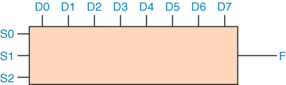
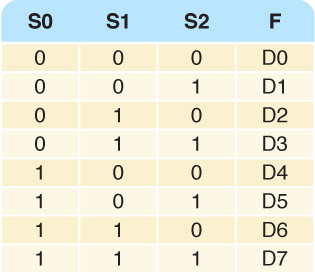

<!-- slide: 31 -->

## Circuits as Memory

- <number>
- Digital circuits can be used to store information
- These circuits form a sequential circuit, because the output of the circuit is also used as input to the circuit

<!-- slide: 32 -->

## Circuits as Memory

- <number>
- An S-R latch stores a single binary digit (1 or 0)
- There are several ways an S-R latch circuit can be designed using various kinds of gates
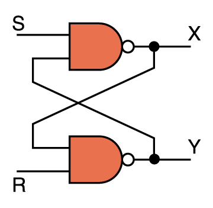
- Figure 4.12  An S-R latch

<!-- slide: 33 -->

## Circuits as Memory

- <number>
- The design of this circuit guarantees that the two outputs X and Y are always complements of each other
- The value of X at any point in time is considered to be the current state of the circuit
- Therefore, if X is 1, the circuit is storing a 1; if X is 0, the circuit is storing a 0

- Figure 4.12  An S-R latch

<!-- slide: 34 -->

## Integrated Circuits

- <number>
- Integrated circuit (also called a chip)
- A piece of silicon on which multiple gates have been embedded
- Silicon pieces are mounted on a plastic or ceramic package with pins along the edges that can be soldered onto circuit boards or inserted into appropriate sockets

<!-- slide: 35 -->

## Integrated Circuits

- <number>
- Integrated circuits (IC) are classified by the number of gates contained in them
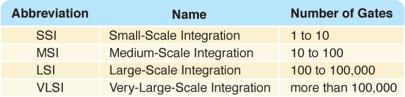

<!-- slide: 36 -->

## Integrated Circuits

- <number>
- Figure 4.13  An SSI chip contains independent NAND gates
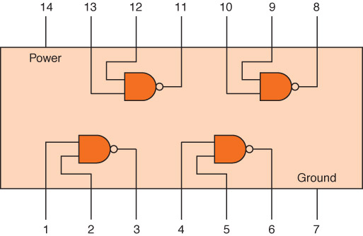

<!-- slide: 37 -->

## CPU Chips

- <number>
- The most important integrated circuit in any computer is the Central Processing Unit, or CPU
- Each CPU chip has a large number of pins through which essentially all communication in a computer system occurs

<!-- slide: 38 -->

## 作业

- <number>

- 1:P114 39 43 P115 60
- 2:思政小论文：通过 Internet进行信息检索，
- 写一篇综述介绍我国半导体技术发展的历史
- 和现状，然后和国外的现状进行对比分析，
- 结合目前中美贸易战中华为公司事件阐述你
- 的应对方法。
