# 第5章

<!-- slide: 1 -->

## Chapter 5

- Computing Components

<!-- slide: 2 -->

## Chapter Goals

  - Read an ad for a computer and understand the jargon
  - List the components and their function in a von Neumann machine
  - Describe the fetch-decode-execute cycle of the von Neumann machine
  - Describe how computer memory is organized and accessed
- <number>

<!-- slide: 3 -->

## Chapter Goals

- <number>
- Name and describe different auxiliary storage devices
- Define three alternative parallel computer configurations
- Explain the concept of embedded systems and give examples from your own home

<!-- slide: 4 -->

## Computer Components

- <number>
- Consider the following ad:
- Insatavialion 640 Laptop
- Exceptional Performance and Portability
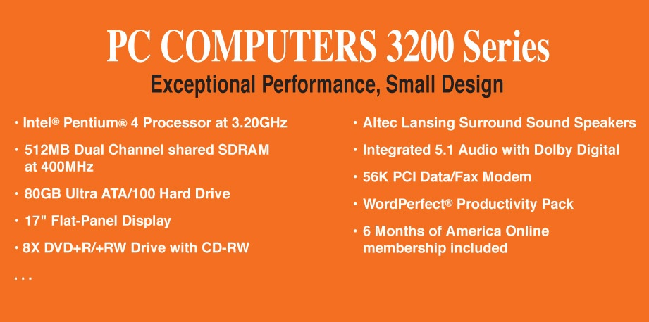
- • Intel® Core™ 2 Duo (2.66GHz/1066Mhz
- FSB/6MB cache)
- • 15.6” High Definition (1080p) LED
- Backlit LCD Display (1366 x 768)
- • 512MB ATI Mobility Radeon Graphics
- • Built-in 2.0MP Web Camera
- • 4GB Shared Dual Channel DDR2 at
- 800MHz
- • 500GB SATA Hard Drive at 5400RPM
- • 8X Slot Load DL DVD+/- RW Drive
- • 802.11 a/g/n and Bluetooth 3.0
- • 85 WHr Lithium Ion Battery
- • (2) USB 2.0, HDMI, 15-pin VGA, Ethernet
- 10/100/1000, IEEE 1394 Firewire, Express
- Card, Audio line-in, line-out, mic-in
- • 14.8W X 1.2H X 10.1D, 5.6 lbs
- • Microsoft0® Windows 7® Professional
- • Microsoft® Office Home and Student
- 2007
- • 36-Month subscription to McAfee
- Security Center Anti-virus

<!-- slide: 5 -->

## Computer Components

- <number>
- What does all this jargon mean?
- Intel® Core™ 2 Duo (2.66GHz/1066Mhz
- FSB/6MB cache)
- 4GB Shared Dual Channel DDR2 at 800 MHz
- 500 GB SATA Hard Drive at 5400RPM
- 15.6” High Definition (1080p) LED Backlit
- LCD Display (1366 x 768)
- 8X Slot Load DL DVD+/- RW Drive
- 14.8”W X 1.2”H X10.1” D, 5.6 lbs.
- Be patient!
- If you don't
- know now, you
- should know
- shortly

<!-- slide: 6 -->

## Computer Components (continued)

- 512 MB ATI Mobility Radeon Graphics
- 85 WHr Lithium Ion Battery
- (2) USB 2.0, HDMI, 15-Pin VGA, Ethernet 10/100/1000 IEEE 1394 Firewire, Express Card, Audio line-in, line-out, mic-in
- Microsoft® Windows 7® Professional
- Microsoft® Office Home and Student 2007
- 36-Month subscription to McAfee Security Center Anti-virus
- <number>

<!-- slide: 7 -->

## Sizes in Perspective

- <number>
- Admiral Grace Murray Hopper
  - A coil of wire nearly 1,000 feet long
    - Distance traveled by an electron along the wire in the space of a microsecond
  - A short piece of wire
    - In the space of a nanosecond
  - A bag containing grains of pepper
    - In the space of a picosecond

<!-- slide: 8 -->

## Sizes in Perspective

- <number>
- What is a hertz?

<!-- slide: 9 -->

## Sizes in Perspective

- <number>
- Intel Processor
- speed 2.66 GHz
- SDRAM
- size 4GB
- speed 800 MHz
- 500GB SATA at 5400 RPM
- Transfer rate 300MB per second
- Flat screen dot pitch .28mm
- To which do these
- apply?
- Bigger is better
- Faster is better
- Smaller is better

<!-- slide: 10 -->

## Stored-Program Concept

- <number>
- Figure 5.1  The von Neumann architecture

<!-- slide: 11 -->

## Memory

- Memory
- A collection of cells,
- each with a unique
- physical address; both
- addresses and
- contents are in
- binary
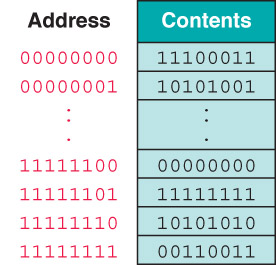
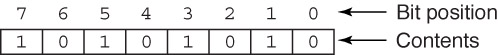

<!-- slide: 12 -->

## Arithmetic/Logic Unit

- <number>
- Performs basic arithmetic operations such as adding
- Performs logical operations such as AND, OR, and NOT
- Most modern ALUs have a small amount of special storage units called registers

<!-- slide: 13 -->

## Input/Output Units

- <number>
- Input Unit
- A device through which data and programs from
- the outside world are entered into the computer;
- Can you name three?
- Output unit
- A device through which results stored in the
- computer memory are made available to the
- outside world
- Can you name two?

<!-- slide: 14 -->

## Control Unit

- <number>
- Control unit
- The organizing force in the computer
- Instruction register (IR)
- Contains the instruction that is being executed
- Program counter (PC)
- Contains the address of the next instruction to be
- executed
- Central Processing Unit (CPU)
- ALU and the control unit called the Central Processing Unit, or CPU

<!-- slide: 15 -->

## Flow of Information

- <number>
- Bus
- A set of wires that connect all major sections
- Figure 5.2  Data flow through a von Neumann architecture
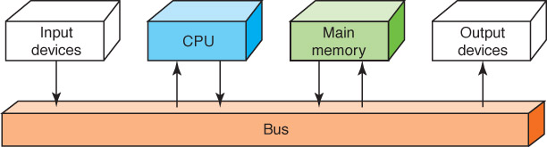

<!-- slide: 16 -->

## The Fetch-Execute Cycle

- <number>
- Fetch the next instruction
- Decode the instruction
- Get data if needed
- Execute the instruction
- Why is it called a cycle?

<!-- slide: 17 -->

## The Fetch-Execute Cycle

- <number>
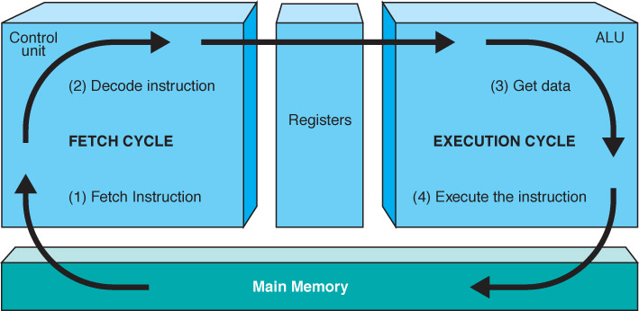
- Figure 5.3  The Fetch-Execute Cycle

<!-- slide: 18 -->

## RAM and ROM

- <number>
- Random Access Memory (RAM)
- Memory in which each location can be accessed and changed
- Read Only Memory (ROM)
- Memory in which each location can be accessed but not changed
- RAM is volatile, ROM is not
- What does volatile mean?

<!-- slide: 19 -->

## Secondary Storage Devices

- <number>
- Why is it necessary to have secondary storage devices?
- Can you name some of these devices?

<!-- slide: 20 -->

## Magnetic Tape

- The first truly mass auxiliary storage device was the magnetic tape drive
- Tape drives have a
- major problem; can
- you describe it?
- Figure 5.4  A magnetic tape
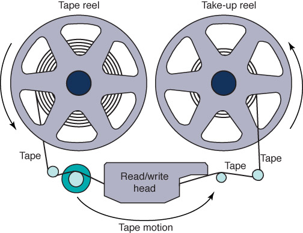

<!-- slide: 21 -->

## Magnetic Disks

- Figure 5.5  The organization of a magnetic disk
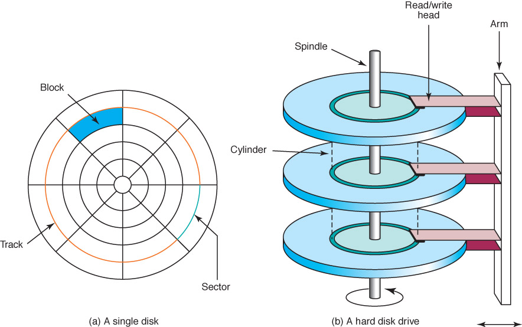

<!-- slide: 22 -->

## Magnetic Disks

- <number>
- History
- Floppy disks (Why "floppy"?)
- 1970. 8" in diameter "
- late 1970, 5 1/2"
- now, 3 1/2"
- Zip drives
- Tracks near center are more densely packed								Why?

<!-- slide: 23 -->

## Magnetic Disks

- <number>
- Seek time
- Time it takes for read/write head to be over right track
- Latency
- Time it takes for sector to be in position
- Access time
- Can you define it?

<!-- slide: 24 -->

- 10.18

<!-- slide: 25 -->

## Compact Disks

- <number>
- CD
- A compact disk that uses a laser to read information stored optically on a plastic disk; data is evenly distributed around track
- CD-ROM read-only memory
- CD-DA digital audio
- CD-WORM write once, read many
- RW or RAM both read from and written to
- DVD
- Digital Versatile Disk, used  for storing audio and video

<!-- slide: 26 -->

## Flash Drives

- <number>
- Flash Memory
- Nonvolatile
- Can be erased and rewritten

<!-- slide: 27 -->

## Touch Screens

- <number>
- Touch screen
- A computer monitor that can respond to the user, touching the screen with a stylus or finger
- There are three types
  - Resistive
  - Capacitive
  - Infrared
  - Surface acoustic wave (SAW)

<!-- slide: 28 -->

## Touch Screens

- <number>
- Figure 5.7
- A touch screen
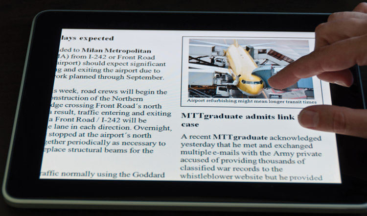

<!-- slide: 29 -->

## Touch Screens

- <number>
- Resistive touch screen
- A screen made up of two layers of electrically conductive material
  - One layer has vertical lines, the other has horizontal lines
  - When the top layer is pressed, it comes in contact with the second layer which allows electrical current to flow
  - The specific vertical and horizontal lines that make contact dictate the location on the screen that was touched

<!-- slide: 30 -->

## Touch Screens

- <number>
- Capacitive touch screen
- A screen made up of a laminate applied over a glass screen
  - Laminate conducts electricity in all directions; a very small current is applied equally on the four corners
  - When the screen is touched, current flows to the finger or stylus
  - The location of the touch on the screen is determined by comparing how strong the flow of electricity is from each corner

<!-- slide: 31 -->

## Touch Screens

- <number>
- Infrared touch screen
- A screen with crisscrossing horizontal and vertical beams of infrared light
  - Sensors on opposite sides of the screen detect the beams
  - When the user breaks the beams by touching the screen, the location of the break can be determined

<!-- slide: 32 -->

## Touch Screens

- <number>
- Surface acoustic wave (SAW)
- A screen  with crisscrossing high frequency sound waves across the horizontal and vertical axes
  - When a finger touches the surface, corresponding sensors detect the interruption and determine location of the touch

<!-- slide: 33 -->

## Synchronous processing

- <number>
- One approach to parallelism is to have multiple processors apply the same program to multiple data sets
- Figure 5.8  Processors in a synchronous computing environment
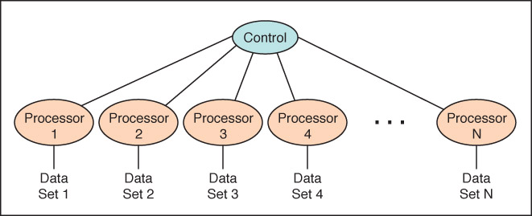

<!-- slide: 34 -->

## Pipelining

- <number>
- Arranges processors in tandem, where each processor contributes one part to an overall computation
- Figure 5.9  Processors in a pipeline
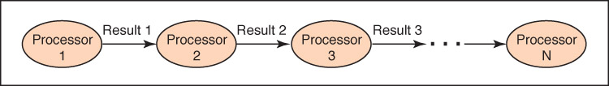

<!-- slide: 35 -->

## Shared MemoryParallel Processor

- <number>
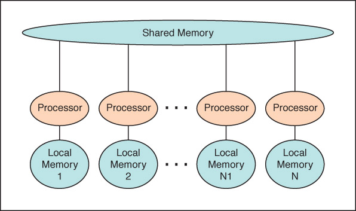
- Communicate through shared memory
- Figure 5.10  Shared memory configuration of processors

<!-- slide: 36 -->

## Embedded Systems

- <number>
- Embedded systems
- Computers that are dedicated to perform
- a narrow range of functions as part of a
- larger system
- Empty your pockets or backpacks.
- How many embedded systems do you 			have?

<!-- slide: 37 -->

## 思政：中国超级计算机

- <number>
- 国防科技大学计算机研究所——银河系列
- 中科院计算技术研究所—曙光系列
- 国家并行计算机工程技术中心——神威系列

<!-- slide: 38 -->

## 作业

- <number>

- 1:P146 30 32 37 38 39 P147 62
- 2:思政小论文：通过 Internet进行信息检索，
- 写一篇综述介绍我国高性能计算机体系架构的发展。
