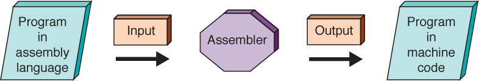
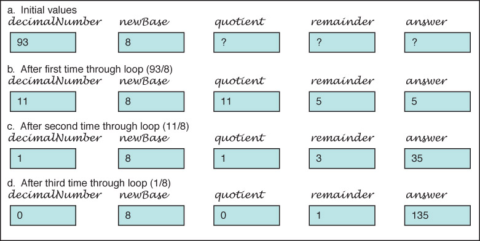

# 第6章

<!-- slide: 1 -->

## Low-Level Programming Languages and Pseudocode

- Chapter 6

<!-- slide: 2 -->

## Chapter Goals

- <number>
- List the operations that a computer can perform
- Distinguish between machine language and assembly language
- Describe the pseudocode constructs used in expressing an algorithm

<!-- slide: 3 -->

## Chapter Goals

- <number>
- Use pseudocode to express an algorithm
- Describe two approaches to testing
- Design and implement a test plan for a  simple assembly-language program

<!-- slide: 4 -->

## Computer Operations

- <number>
- Computer
- A programmable electronic device that can store, retrieve, and process data
- Data and instructions to manipulate the data are logically the same and can be stored in the same place
- What operations can a computer execute?

<!-- slide: 5 -->

## Machine Language

- <number>
- Machine language
- The language made up of binary coded instructions built into the hardware of a particular computer and used directly by the computer
- Why would anyone choose to use machine language?
- (Hint: they had no choice. Why?)
- Why would anyone choose to use machine language?
- (Hint: they had no choice.  Why?)

<!-- slide: 6 -->

## Machine Language

- <number>
- Characteristics of machine language:
  - Every processor type has its own set of specific machine instructions
  - The relationship between the processor and the instructions it can carry out is completely integrated
  - Each machine-language instruction does only one very low-level task

<!-- slide: 7 -->

## Assembly Language

- <number>
- Assembly language
- A language that uses mnemonic codes to represent machine-language instructions
- Assembler
- A program  that reads each of the instructions in mnemonic form and translates it into the machine-language equivalent

<!-- slide: 8 -->

## Pep/8 Assembly Language

- <number>
- Remember
- the
- difference
- between
- immediate
- and
- direct
- addressing?
- i : immediate
- d: direct

<!-- slide: 9 -->

## Assembly Process

- <number>

<!-- slide: 10 -->

## Pseudocode

- <number>
- Pseudocode
- A mixture of English and formatting to make the steps in an algorithm explicit
- Algorithm to Convert base-10 number to other bases
- While (the quotient is not zero)
- Divide the decimal number by the new base
- Make the remainder the next digit to the left in the answer
- Replace the original decimal number with the quotient

<!-- slide: 11 -->

## Developing an Algorithm

- <number>
- Two methodologies used to develop computer solutions to a problem
  - Top-down design focuses on the tasks to be done
  - Object-oriented design focuses on the data involved in the solution
- But first, let's look at a way to express algorithms: pseudocode

<!-- slide: 12 -->

## Pseudocode

- <number>
- Pseudocode
- A way of expressing algorithms that uses a mixture of English phrases and indention to make the steps in the solution explicit
- There are no grammar rules in pseudocode
- Pseudocode is not case sensitive

<!-- slide: 13 -->

## Following Pseudocode

- <number>
- What is 93 in base 8?
- 93/8 gives 11 remainder 5
- 11/8 gives 1 remainder 3
- 1/ 8 gives 0 remainder 1
- answer       1 3 5
- While (the quotient is not zero)
- Divide the decimal number by the new base
- Make the remainder the next digit to the left in the answer
- Replace the original decimal number with

<!-- slide: 14 -->

## Following Pseudocode

- <number>

- Easier way to organize solution

<!-- slide: 15 -->

## Pseudocode for Complete Computer Solution

- <number>
- Write "Enter the new base"
- Read newBase
- Write "Enter the number to be converted"
- Read decimalNumber
- Set quotient to 1
- WHILE (quotient is not zero)
- Set quotient to decimalNumber DIV newBase
- Set remainder to decimalNumber REM newBase
- Make the remainder the next digit to the left in the answer
- Set decimalNumber to quotient
- Write "The answer is "
- Write answer

<!-- slide: 16 -->

## 10.25

<!-- slide: 17 -->

## Pseudocode Functionality

- <number>
- Variables
- Names of places to store values
- quotient, decimalNumber, newBase
- Assignment
- Storing the value of an expression into a
- variable
- Set quotient to 64
- quotient <-- 64
- quotient <-- 6 * 10 + 4

<!-- slide: 18 -->

## Pseudocode Functionality

- <number>
- Output
- Printing a value on  an output device
- Write, Print
- Input
- Getting values from the outside word and storing them into variables
- Get, Read

<!-- slide: 19 -->

## Pseudocode Functionality

- <number>
- Repetition
- Repeating a series of statements
- Set count to 1
- WHILE ( count < 10)
- Write "Enter an integer number"
- Read aNumber
- Write "You entered " + aNumber
- Set count to count + 1
- How many values were read?

<!-- slide: 20 -->

## Pseudocode Functionality

- <number>
- Selection
- Making a choice to execute or skip a statement (or group of statements)
- Read number
- IF (number < 0)
- Write number + " is less than zero."
- or
- Write "Enter a positive number."
- Read number
- IF(number < 0)
- Write number + " is less than zero."
- Write "You didn't follow instructions."

<!-- slide: 21 -->

## Pseudocode Functionality

- <number>
- Selection
- Choose to execute one statement (or group of statements) or another statement (or group of statements)
- IF ( age < 12 )
- Write "Pay children's rate"
- Write "You get a free box of popcorn"
- ELSE IF ( age < 65 )
- Write "Pay regular rate"
- ELSE
- Write "Pay senior citizens rate"

<!-- slide: 22 -->

## Pseudocode Example

- <number>
- Problem: Read in pairs of positive numbers and print each pair in order.
- WHILE (not done)
- Write "Enter two values separated by blanks"
- Read number1
- Read number2
- Print them in order

<!-- slide: 23 -->

## Pseudocode Example

- <number>
- How do we know when to stop?
- Let the user tell us how many
- Print them in order?
- If first number is smaller
- print first, then second
- If first number if larger
- print second, then first

<!-- slide: 24 -->

## Pseudocode Example

- <number>
- Write "How many pairs of values are to be entered?"
- Read numberOfPairs
- Set numberRead to 0
- WHILE (numberRead < numberOfPairs)
- Write "Enter two values separated by a blank; press return"
- Read number1
- Read number2
- IF(number1 < number2)
- Print number1 + " " + number2
- ELSE
- Print number2 + " " number1
- Increment numberRead

<!-- slide: 25 -->

## Walk Through

- <number>
- Data		Fill in values during each iteration
- 3			numberRead	number1		number2
- 55 70
- 2 1
- 33 33
- numberOfPairs
- What is the output?

<!-- slide: 26 -->

## Translating Pseudocode

- <number>
- To What?
- Assembly language
- Very detailed and time consuming
- High-level language
- Easy as you'll see in Chapter 9

<!-- slide: 27 -->

## Testing

- <number>
- Test plan
- A document that specifies how many times and with what data the program must be run in order to thoroughly test it
- Code coverage (clear-box testing)
- An approach that designs test cases by looking at
- the code
- Data coverage (black-box testing)
- An approach that designs test cases by looking at the allowable data values

<!-- slide: 28 -->

## Testing

- <number>
- Test plan implementation
- Using the test cases outlined in the test plan to verify that the program outputs the predicted results

<!-- slide: 29 -->

## Important Threads

- Operations of a Computer
- Computer can store, retrieve, and process data
- Computer’s Machine Language
- A set of instructions the machine’s hardware is built to recognize and execute
- Machine-language Programs
- Written by entering a series of these instructions in binary form
- <number>

<!-- slide: 30 -->

## Important Threads

- Pseudocode
- Shorthand-type language people use to express algorithms
- Testing Programs
- All programs must be tested; code coverage testing and data coverage (black-box testing) are two common approaches
- <number>

<!-- slide: 31 -->

## 作业

- <number>

- 1:P192 55
