# 第7章

<!-- slide: 1 -->

## Chapter 7

- Problem Solving and Algorithms

> 备注：Change cover and background

<!-- slide: 2 -->

## Chapter Goals

- <number>
- Describe the computer problem-solving process and relate it to Polya’s How to Solve It list
- Distinguish between a simple type and a composite type
- Describe two composite data-structuring mechanisms
- Recognize a recursive problem and write a recursive algorithm to solve it
- Distinguish between an unsorted array and a sorted array
- Distinguish between a selection sort and an insertion sort

<!-- slide: 3 -->

## Chapter Goals

- <number>
- Apply the selection sort, the bubble sort to an array of items by hand
- Apply the binary search algorithm
- Demonstrate an understanding of the algorithms in this chapter by hand-simulating them with a sequence of items

<!-- slide: 4 -->

## Problem Solving

- <number>
- Problem solving
- The act of finding a solution to a perplexing, distressing, vexing, or unsettled question
- How do you define problem solving?

<!-- slide: 5 -->

## Problem Solving

- <number>
- How to Solve It: A New Aspect of Mathematical Method by George Polya
- "How to solve it list" written within the context of mathematical problems
- But list is quite general
- We can use it to solve computer
- related problems!

<!-- slide: 6 -->

## Problem Solving

- <number>
- How do you solve problems?
- Understand the problem
- Devise a plan
- Carry out the plan
- Look back

<!-- slide: 7 -->

## Strategies

- <number>
- Ask questions!
  - What do I know about the problem?
  - What is the information that I have to process in order the find the solution?
  - What does the solution look like?
  - What sort of special cases exist?
  - How will I recognize that I have found the solution?

<!-- slide: 8 -->

## Strategies

- <number>
- Ask questions! Never reinvent the wheel!
- Similar problems come up again and again in different guises
- A good programmer recognizes a task or subtask that has been solved before and plugs in the solution
- Can you think of two similar problems?

<!-- slide: 9 -->

## Strategies

- <number>
- Divide and Conquer!
- Break up a large problem into smaller units and solve each smaller problem
  - Applies the concept of abstraction
  - The divide-and-conquer approach can be applied over and over again until each subtask is manageable

<!-- slide: 10 -->

## Computer Problem-Solving

- <number>
- Analysis and Specification Phase
- Analyze
- Specification
- Algorithm Development Phase
- Develop algorithm
- Test algorithm
- Implementation Phase
- Code algorithm
- Test algorithm
- Maintenance Phase
- Use
- Maintain
- Can you
- name
- a recurring
- theme?

<!-- slide: 11 -->

## Phase Interactions

- <number>
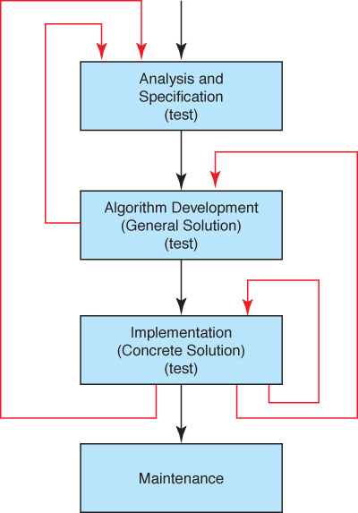
- Should we
- add another
- arrow?
- (What happens
- if the problem
- is revised?)

<!-- slide: 12 -->

## Algorithms

- <number>
- Algorithm
- A set of unambiguous instructions for solving a problem or subproblem in a finite amount of time using a finite amount of data
- Abstract Step
- An algorithmic step containing unspecified details
- Concrete Step
- An algorithm step in which all details are specified

<!-- slide: 13 -->

## Developing an Algorithm

- <number>
- Two methodologies used to develop computer solutions to a problem
  - Top-down design focuses on the tasks to be done
  - Object-oriented design focuses on the data involved in the solution (We will discuss this design in Ch. 9)

<!-- slide: 14 -->

## Summary of Methodology

- <number>
- Analyze the Problem
  - Understand the problem!!
  - Develop a plan of attack
- List the Main Tasks (becomes Main Module)
  - Restate problem as a list of tasks (modules)
  - Give each task a name
- Write the Remaining Modules
  - Restate each abstract module as a list of tasks
  - Give each task a name
- Re-sequence and Revise as Necessary
  - Process ends when all steps (modules) are concrete

<!-- slide: 15 -->

## Top-Down Design

- <number>
- Process continues for as many levels as it takes to make every step concrete
- Name of (sub)problem at one level becomes a module at next lower level
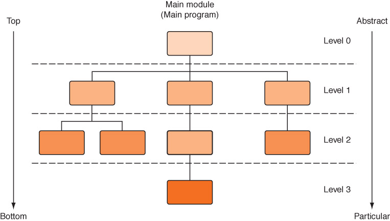

<!-- slide: 16 -->

## Control Structures

- <number>
- Control structure
- An instruction that determines the order in which other instructions in a program are executed
- Can you name the ones we defined in the functionality of pseudocode?

<!-- slide: 17 -->

## Selection Statements

- <number>
- Flow of control of if statement
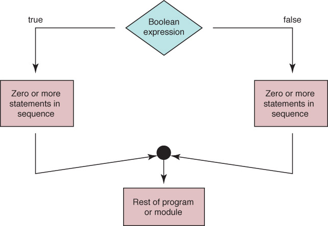

<!-- slide: 18 -->

## Algorithm with Selection

- <number>
- Problem: Write the appropriate dress for a given temperature.
- Write "Enter  temperature"
- Read temperature
- Determine Dress
- Which statements are concrete?
- Which statements are abstract?

<!-- slide: 19 -->

## Algorithm with Selection

- <number>
- IF (temperature > 90)
- Write “Texas weather: wear shorts”
- ELSE IF (temperature > 70)
- Write “Ideal weather: short sleeves are fine”
- ELSE IF (temperature > 50)
- Write “A little chilly: wear a light jacket”
- ELSE IF (temperature > 32)
- Write “Philadelphia weather: wear a heavy coat”
- ELSE
- Write “Stay inside”
- Determine Dress

<!-- slide: 20 -->

## Looping Statements

- <number>
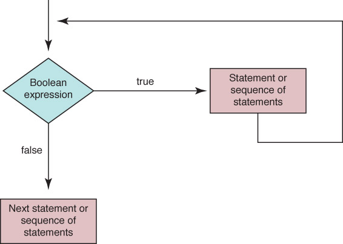
- Flow of control of while statement

<!-- slide: 21 -->

## Looping Statements

- <number>
- Set sum to 0
- Set count to 1
- While (count <= limit)
- Read number
- Set sum to sum + number
- Increment count
- Write "Sum is " + sum
- Why is it
- called a
- count-controlled
- loop?
- A count-controlled loop

<!-- slide: 22 -->

## Looping Statements

- <number>
- Set sum to 0
- Set allPositive to true
- WHILE (allPositive)
- Read number
- IF (number > 0)
- Set sum to sum + number
- ELSE
- Set allPositive to false
- Write "Sum is " + sum
- Why is it
- called an
- event-controlled
- loop?
- What is the
- event?
- An event-controlled loop

<!-- slide: 23 -->

## Looping Statements

- <number>
- Read in square
- Calculate the square root
- Write out square and the square root
- Calculate Square Root
- Are there any abstract steps?

<!-- slide: 24 -->

## Looping Statements

- <number>
- Set epsilon to 1
- WHILE  (epsilon > 0.001)
- Calculate new guess
- Set epsilon to abs(square - guess * guess)
- Are there any abstract steps?
- Calculate Square Root

<!-- slide: 25 -->

## Looping Statements

- <number>
- Set newGuess to
- (guess + (square/guess)) / 2.0
- Are there any abstract steps?
- Calculate New Guess

<!-- slide: 26 -->

## Looping Statements

- <number>
- Read in square
- Set guess to square/4
- Set epsilon to 1
- WHILE  (epsilon > 0.001)
- Calculate new guess
- Set epsilon to abs(square - guess * guess)
- Write out square and the guess

<!-- slide: 27 -->

## Composite Data Types

- <number>
- Records
- A named heterogeneous collection of items in which individual items are accessed by name. For example, we could bundle name, age and hourly wage items into a record named Employee
- Arrays
- A named homogeneous collection of items in which an individual item is accessed by its position (index) within the collection

<!-- slide: 28 -->

## Composite Data Types

- Employee
- name
- age
- hourly/Wage
- Following algorithm, stores values into the fields of record:
- Employee employee         // Declare and Employee variable
- Set employee.name to “Frank Jones”
- Set employee.age to 32
- Set employee.hourlyWage to 27.50
- <number>

<!-- slide: 29 -->

## Composite Data Types

- <number>
- numbers[0]
- numbers[4]
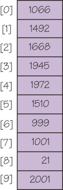

<!-- slide: 30 -->

## Arrays

- As data is being read into an array, a counter is updated so that we always know how many data items were stored
- If the array is called list, we are working with
- list[0] to list[length-1]	or
- list[0]..list[length-1]
- <number>

<!-- slide: 31 -->

## An Unsorted Array

- <number>
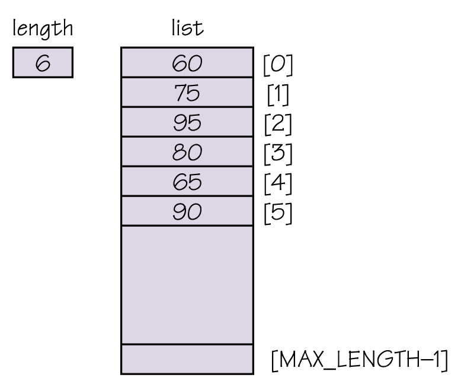
- data[0]...data[length-1]
- is of interest

<!-- slide: 32 -->

## Composite Data Types

- <number>
- integer data[20]
- Write “How many values?”
- Read length
- Set index to 0
- WHILE (index < length)
- Read data[index]
- Set index to index + 1
- Fill array numbers with limit values

<!-- slide: 33 -->

## Sequential Search of an Unsorted Array

- A sequential search examines each item in turn and compares it to the one we are searching.
- If it matches, we have found the item. If not, we look at the next item in the array.
- We stop either when we have found the item or when we have looked at all the items and not found a match
- Thus, a loop with two ending conditions
- <number>

<!-- slide: 34 -->

## Sequential Search Algorithm

- Set Position to 0
- Set found to FALSE
- WHILE (position < length AND NOT found )
- IF (numbers [position] equals searchitem)
- Set Found to TRUE
- ELSE
- Set position to position + 1
- <number>

<!-- slide: 35 -->

## Booleans

- <number>
- Boolean Operators
- A Boolean variable is a location in memory that can contain either true or false
- Boolean operator AND returns TRUE if both operands are true and FALSE otherwise
- Boolean operator OR returns TRUE if either operand is true and FALSE otherwise
- Boolean operator NOT returns TRUE if its operand is false and FALSE if its operand is true

<!-- slide: 36 -->

## Sorted Arrays

- <number>
- The values stored in an array have unique keys of a type for which the relational operators are defined
- Sorting rearranges the elements into either ascending or descending order within the array
- A sorted array is one in which the elements are in order

<!-- slide: 37 -->

## Sequential Search in a Sorted Array

- If items in an array are sorted, we can stop looking when we pass the place where the item would be it were present in the array
- <number>
- Is this better?

<!-- slide: 38 -->

## A Sorted Array

- <number>
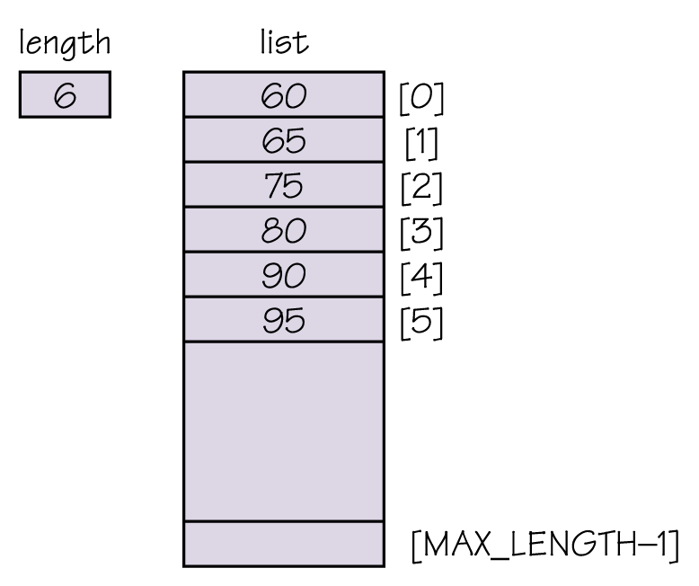
- A sorted array of
- integers

<!-- slide: 39 -->

## A Sorted Array

- <number>
- Read in array of values
- Write “Enter value for which to search”
- Read searchItem
- Set found to TRUE if searchItem is there
- IF (found)
- Write “Item is found”
- ELSE
- Write “Item is not found”

<!-- slide: 40 -->

## A Sorted Array

- <number>
- Set found to TRUE if searchItem is there
- Set index to 0
- Set found to FALSE
- WHILE (index < length AND NOT found)
- IF (data[index] equals searchItem)
- Set found to TRUE
- ELSE IF (data[index] > searchItem)
- Set index to length
- ELSE
- Set index to index + 1

<!-- slide: 41 -->

## Binary Search

- <number>
- Sequential search
- Search begins at the beginning of the list and continues until the item is found or the entire list has been searched
- Binary search (list must be sorted)
- Search begins at the middle and finds the item or eliminates half of the unexamined items; process is repeated on the half where the item might be
- Say that again…

<!-- slide: 42 -->

## Binary Search

- <number>
- Set first to 0
- Set last to length-1
- Set found to FALSE
- WHILE (first <= last AND NOT found)
- Set middle to (first + last)/ 2
- IF (item equals data[middle]))
- Set found to TRUE
- ELSE
- IF (item < data[middle])
- Set last to middle – 1
- ELSE
- Set first to middle + 1
- RETURN found

<!-- slide: 43 -->

## Binary Search

- <number>
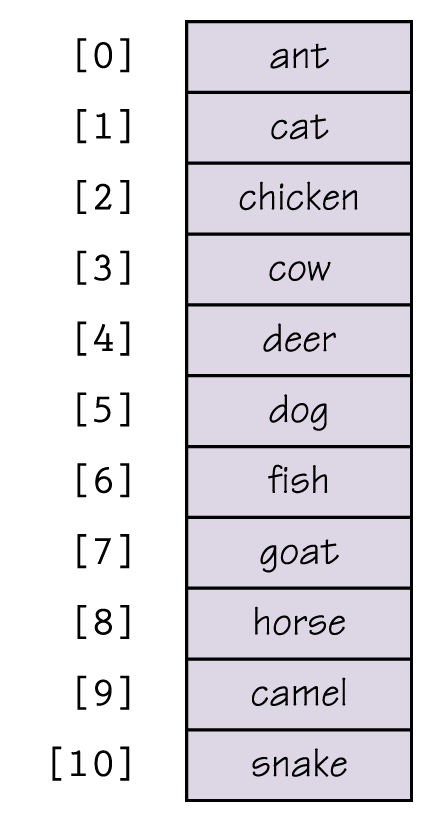
- Figure 7.10  Trace of the binary search

<!-- slide: 44 -->

## Binary Search

- <number>
- Table 7.1 Average Number of Comparisons
- Is a binary search
- always better?

<!-- slide: 45 -->

## Sorting

- <number>
- Sorting
- Arranging items in a collection so that there is an ordering on one (or more) of the fields in the items
- Sort Key
- The field (or fields) on which the ordering is based
- Sorting algorithms
- Algorithms that order the items in the collection based on the sort key
- Why is sorting important?

<!-- slide: 46 -->

## Selection Sort

- <number>
- Given a list of names, put them in alphabetical order
  - Find the name that comes first in the alphabet, and write it on a second sheet of paper
  - Cross out the name off the original list
  - Continue this cycle until all the names on the original list have been crossed out and written onto the second list, at which point the second list contains the same items but in sorted order

<!-- slide: 47 -->

## Selection Sort

- <number>
- A slight adjustment to this manual approach does away with the need to duplicate space
  - As you cross a name off the original list, a free space opens up
  - Instead of writing the value found on a second list, exchange it with the value currently in the position where the crossed-off item should go

<!-- slide: 48 -->

## Selection Sort

- <number>
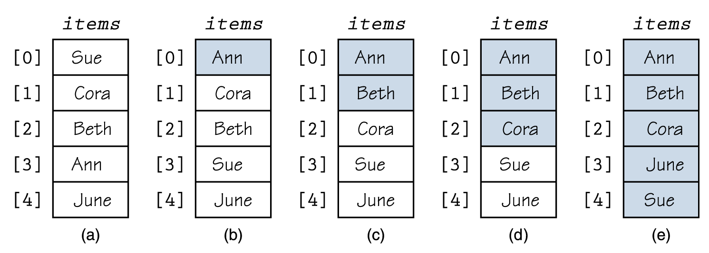
- Figure 7.11  Example of a selection sort (sorted elements are shaded)

<!-- slide: 49 -->

## Selection Sort

- <number>
- Selection Sort
- Set firstUnsorted to 0
- WHILE (not sorted yet)
- Find smallest unsorted item
- Swap firstUnsorted item with the smallest
- Set firstUnsorted to firstUnsorted + 1
- Not sorted yet
- current < length – 1

<!-- slide: 50 -->

## Selection Sort

- <number>
- Find smallest unsorted item
- Set indexOfSmallest to firstUnsorted
- Set index to firstUnsorted + 1
- WHILE (index <= length – 1)
- IF (data[index] < data[indexOfSmallest])
- Set indexOfSmallest to index
- Set index to index + 1
- Set index to indexOfSmallest

<!-- slide: 51 -->

## Selection Sort

- <number>
- Swap firstUnsorted with smallest
- Set tempItem to data[firstUnsorted]
- Set data[firstUnsorted] to data[indexOfSmallest]
- Set data[indexOfSmallest] to tempItem

<!-- slide: 52 -->

## Bubble Sort

- <number>
- Bubble Sort uses the same strategy:
- Find the next item
- Put it into its proper place
- But uses a different scheme for finding the next item
- Starting with the last list element, compare successive pairs of elements, swapping whenever the bottom element of the pair is smaller than the one above it

<!-- slide: 53 -->

## Bubble Sort

- <number>

<!-- slide: 54 -->

## Bubble Sort

- <number>
- Bubble sort is very slow!
- Can you see a way to make it faster?
- Under what circumstances is bubble
- sort fast?

<!-- slide: 55 -->

## Bubble Sort

- <number>
- Bubble Sort
- Set firstUnsorted to 0
- Set index to firstUnsorted + 1
- Set swap to TRUE
- WHILE (index < length AND swap)
- Set swap to FALSE
- “Bubble up” the smallest item in unsorted part
- Set firstUnsorted to firstUnsorted + 1

<!-- slide: 56 -->

## Bubble Sort

- <number>
- Bubble up
- Set index to length – 1
- WHILE (index > firstUnsorted + 1)
- IF (data[index] < data[index – 1])
- Swap data[index] and data[index – 1]
- Set swap to TRUE
- Set index to index - 1

<!-- slide: 57 -->

## Subprogram Statements

- <number>
- We can give a section of code a name and use that name as a statement in another part of the program
- When the name is encountered, the processing in the other part of the program halts while the named code is executed
- Remember?

<!-- slide: 58 -->

## Subprogram Statements

- <number>
- What if the subprogram needs data from the calling unit?
- Parameters
- Identifiers listed in parentheses beside the subprogram declaration; sometimes called formal parameters
- Arguments
- Identifiers listed in parentheses on the subprogram call; sometimes called actual parameters

<!-- slide: 59 -->

## Subprogram Statements

- <number>
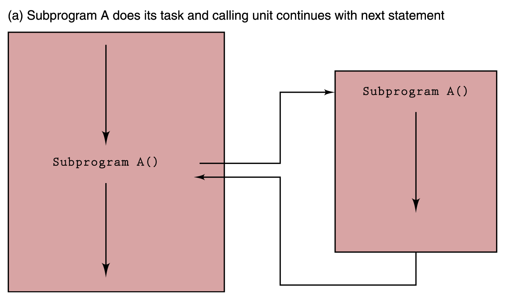
- Figure 7.14  Subprogram flow of control

<!-- slide: 60 -->

## Subprogram Statements

- <number>
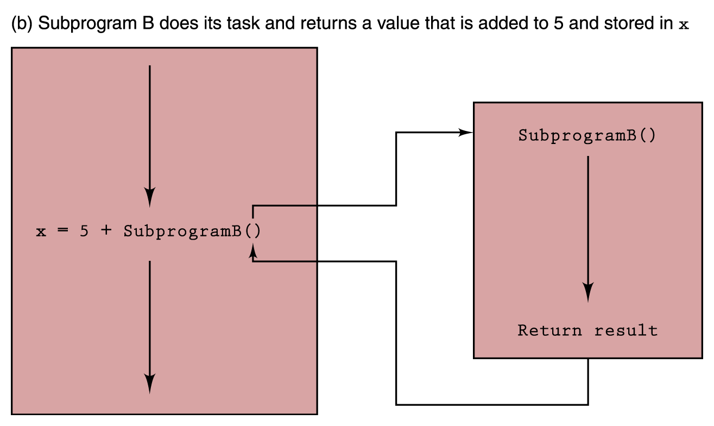

<!-- slide: 61 -->

## Recursion

- <number>
- Recursion
- The ability of a subprogram to call itself
- Base case
- The case to which we have an answer
- General case
- The case that expresses the solution in terms of a call to itself with a smaller version of the problem

<!-- slide: 62 -->

## Recursion

- <number>
- For example, the factorial of a number is defined as the number times the product of all the numbers between itself and 0:
- N! = N * (N  1)!
- Base case
- Factorial(0) = 1 (0! is 1)
- General Case
- Factorial(N) = N * Factorial(N-1)

<!-- slide: 63 -->

## Recursion

- <number>
- Write “Enter n”
- Read n
- Set result to Factorial(n)
- Write result + “ is the factorial of “ + n
- Factorial(n)
- IF (n equals 0)
- RETURN 1
- ELSE
- RETURN n * Factorial(n-1)

<!-- slide: 64 -->

## Recursion

- <number>
- BinarySearch (first, last)
- IF (first > last)
- RETURN FALSE
- ELSE
- Set middle to (first + last)/ 2
- IF (item equals data[middle])
- RETURN TRUE
- ELSE
- IF (item < data[middle])
- BinarySearch (first, middle – 1)
- ELSE
- BinarySearch (middle + 1, last

<!-- slide: 65 -->

## Important Threads

- <number>
- Information Hiding
- The practice of hiding the details of a module with the goal of controlling access to it
- Abstraction
- A model of a complex system that includes only the details essential to the viewer
- Information Hiding and Abstraction are two sides of the same coin

<!-- slide: 66 -->

## Important Threads

- <number>
  - Data abstraction
  - Separation of the logical view of data from their implementation
  - Procedural abstraction
  - Separation of the logical view of actions from their implementation
  - Control abstraction
  - Separation of the logical view of a control structure from its implementation

<!-- slide: 67 -->

## 作业

- <number>

- 用伪码语言设计和描述顺序查询，二分查询，
- 选择排序，冒泡排序算法。
