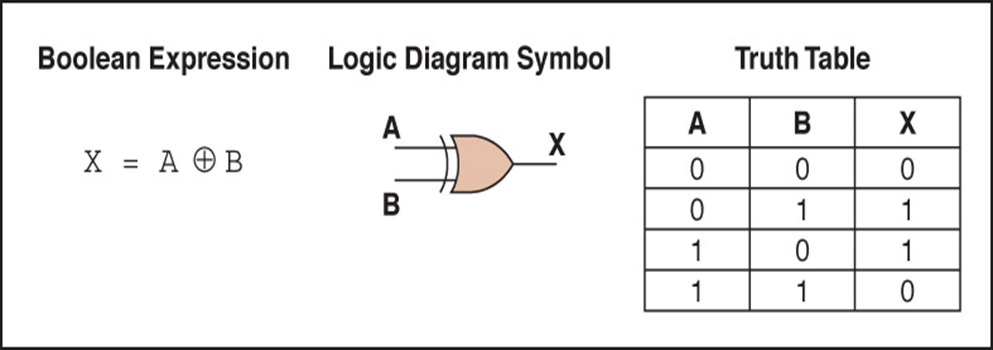
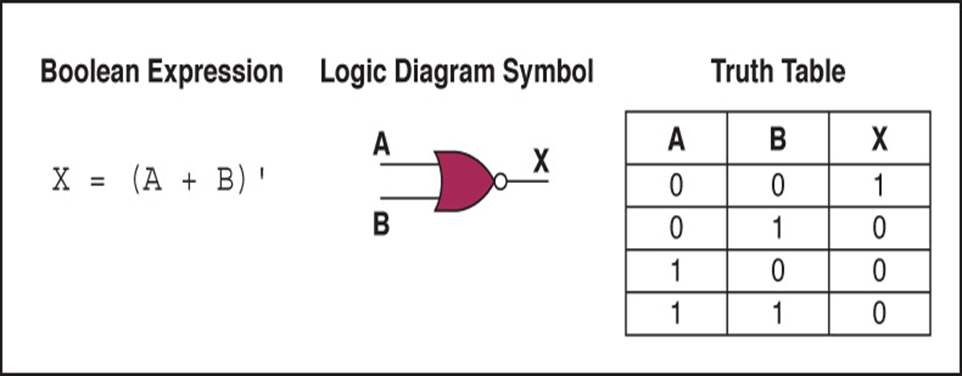
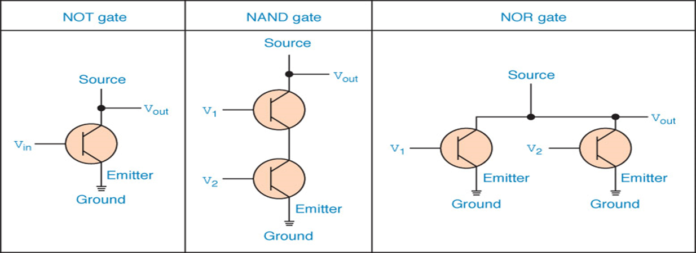
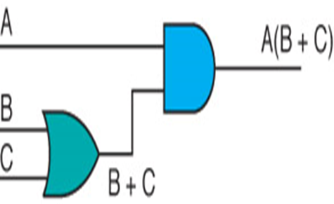
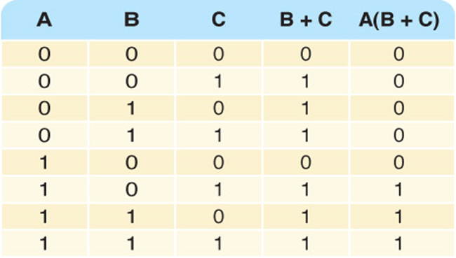
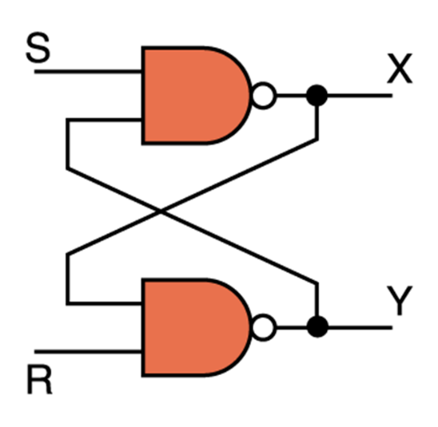
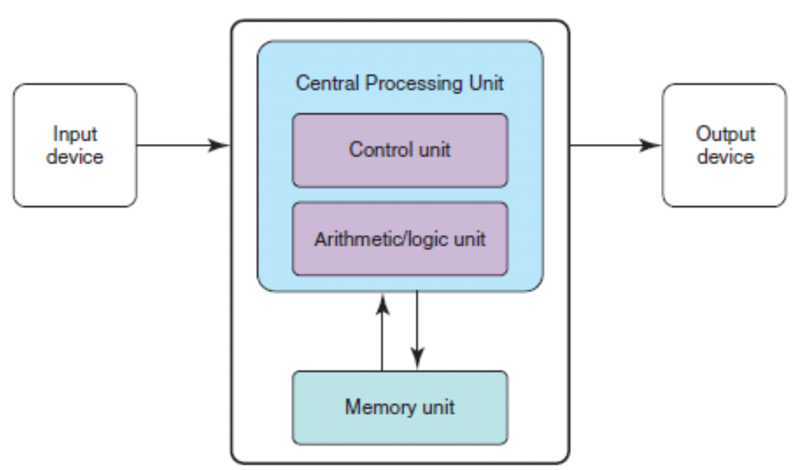

# 计算机科学概论

**Chapter 1（概念）**

Computer system: Computer hardware, software, data which  interact  to solve the problem.

Hardware: The  physical  elements of a computing system (printer, circuit boards, wires, keyboard…)【物理】

Software:  The programs that provide the  instructions  for a computer to execute.【指令集合】

Abstraction(抽象):  A mental model  that removes complex details.【心理模型】

**Chapter 2（概念、进制转换）**

Integers(整数):  A natural number,  a negative of a natural number, zero

Rational Numbers(有理数): An integer or the  quotient(商) of two integers.

Base(基数): It determines the number of digits and the value of  digit positions(使用的数字量和数位位置的值).

Positional notation(位置记数法):(数字连续排列的表示系统，每个位置都有位值，数字为每个数字乘以位值的乘积之和)

进制转换：Binary(二进制) Decimal(十进制) Octal(八进制) Hexadecimal(十六进制)

In base n = n进制(以n为基数)（XX 进制 places)[保留小数点后几位]

十进制转二进制小数：0.XXX（X=0,1),小数×2，有一提出一，无一0补位。

**Chapter 3（概念、补码、数据压缩）**

多媒体压缩及压缩算法：
1. 算法分为无损、有损两种
1. 图像：二皆有之
1. 音频：有损（MP3 AAC）
1. 视频：有损（VP9 AV1）
1. 文本：无损（UTF-8，ASCII）
1. 三维模型：有损（STL OBJ）
1. 总之就是文本和部分图片无损。

Compression ratio(压缩比): (压缩数据的大小除以原始数据的大小).

Complement(补码): Ten’s complement(十进制补码) Two’s complement(二进制补码)

e.g.1-49表示1~49 50-99表示-50~-1  0表示0

e.g.01111111表示127

10000000表示-128

补码->十进位：即首数为0直接算，首数为1后调换再-1.

Overflow(溢出):  如八位二进制补码若要表示128则溢出,需扩充一位或只表示正数

Scientific notation(科学计数法): e.g.0.12000 -> 12000E-5

ASCII: 0->48 A->65 a->97

Text compression:
1. Keyword encoding（关键字编码）：quickly
1. Run-length encoding（游程编码）

e.g. Original text

bbbbbbbbjjjkllqqqqqq+++++

Encoded text

*b8jjjkll*q6*+5

长度为1、2、3的不必压缩,*字符数字空格都算空间。
1. Huffman encoding（霍夫曼编码）

原字母一般都为8字节，将对应字母编码

Color(RGB)-Red, Green, Blue

Hi-color:16bits-3bytes

True-color:24bits-3bytes

**Chapter 4（概念、门电路及其表达式）**

Gate

Circuits(电路)

Tools to describe:
- Boolean Expressions(布尔表达式)

（与离散数学不一样的是：与是AND点乘 ； ‘是NOT否 ； 或是OR+ ; XOR是非兼容或非/兼容或非 ；NAND是与或）
- Logic diagrams(逻辑图)
- Truth tables(真值表)

Types  of gate:

Transistor(晶体管):  半导体材料制成、可做导线可做电阻、相当于开关

Combinational Circuits(组合电路):  即类似于分配律等将电路布尔表达式和真值表写出

****

注：AND门的乘号可省略

Half-adder(半加法器):产生两位之和并产生正确进位（2输入位，2输出位sum=A非兼容非或B；carry=A且B）

Full-adder(全加法器):在半加法器的基础上考虑进位输入的电路，即较半加法器多一项Carry-in。（3输入位，2输出位）

Circuits as memory(存储器电路)-Sequential circuits(时序电路)-输出也用作输入

S-R latch(S-R锁存器)

工作原理:X和Y始终相互补充，X被认作电路状态值，X为1电路存储1，为0存储0

CPU：最重要的集成电路

第一代（SSI）：1950～1960少于10个晶体管

第二代（MSI）：1960～1970几十到几百个晶体管

第三代（LSI）：1970成千上万晶体管，可以集成更多组件

第四代（VLSI）：1980以后：可以集成上亿的晶体管，尺寸不断缩小

**Chapter 5（概念）**

The von Neumann architecture(冯诺依曼结构)

Memory  unit(内存单元):存放数据指令

logic unit(算术逻辑单元):对数据执行算术和逻辑运算、register（寄存器）

Control unit(控制单元):担当舞台监督、确保其它部件参与

指令寄存器(IR)  程序计数器(PC)  中央处理器(CPU)

Input device(输入设备):将数据从外部转移到计算机中

Output device(输出设备):将数据结果从计算机中转移到外部

RAM(随机存取存储器)-内容可更改，易失性

ROM(只读存储器)-内容不可更改，稳定

辅助存储设备：磁带、磁盘、CD、DVD、触摸屏

并行体系结构：

同步计算环境、流水线模式、共享内存……

**Chapter 6** **（概念）**

Computer【功能】可编程、可存储、检索、处理数据

Machine language(机器语言):由硬件中直接使用的二进制编码指令组成

Assembly language(汇编语言):用助记码表示特定的机器语言指令

Pseudocode(伪码):表示算法的速记性语言（无语法规则、不区分大小写）

测试程序的两种方法：
- Code coverage(代码覆盖)【明箱测试】
- Data coverage(数据覆盖)【暗箱测试】-记忆：dark-data

**Chapter 7（伪码的具体使用）**

Sorted array(排序数组)
- 顺序查询

Set Position to 0

Set found to FALSE

WHILE (position < length AND NOT found )

IF (numbers [position] equals searchitem)

Set Found to TRUE

ELSE

Set position to position + 1
- 累加查询

Set sum to 0

Set allPositive to true

WHILE (allPositive)

Read number

IF (number > 0)

Set sum to sum + number

ELSE

Set allPositive to false

Write "Sum is " + sum
- 二分查询(Binary Search)

Set first to 0

Set last to length-1

Set found to FALSE

WHILE (first <= last AND NOT found)

Set middle to (first + last)/ 2

IF (item equals data[middle]))

Set found to TRUE

ELSE

IF (item < data[middle])

Set last to middle – 1

ELSE

Set first to middle + 1

RETURN found
- 选择排序(Selection Sort)

Set firstUnsorted to 0

WHILE (not sorted yet)

Find smallest unsorted item

Swap firstUnsorted item with the smallest

Set firstUnsorted to firstUnsorted + 1

Not sorted yet

current < length – 1

Find smallest unsorted item

Set indexOfSmallest to firstUnsorted

Set index to firstUnsorted + 1

WHILE (index <= length – 1)

IF (data[index] < data[indexOfSmallest])

Set indexOfSmallest to index

Set index to index + 1

Set index to indexOfSmallest

Swap firstUnsorted with smallest

Set tempItem to data[firstUnsorted]

Set data[firstUnsorted] to data[indexOfSmallest]

Set data[indexOfSmallest] to tempItem
- 冒泡排序(Bubble Sort)

Set firstUnsorted to 0

Set index to firstUnsorted + 1

Set swap to TRUE

WHILE (index < length AND swap)

Set swap to FALSE

“Bubble up” the smallest item in unsorted part

Set firstUnsorted to firstUnsorted + 1

Bubble up

Set index to length – 1

WHILE (index > firstUnsorted + 1)

IF (data[index] < data[index – 1])

Swap data[index] and data[index – 1]

Set swap to TRUE

Set index to index – 1

一些语句:WHILE  循环、Set  to  定义赋值、IF ELSE  条件语句、Read 读取输入

Write 输出 、AND=&&、  OR=||、  NOT=！
