# 数值分析（电子版教材-仅供学生参考-勿对外分享）

<!-- page: 1 -->

２１世纪计算机科学与技术系列教材（本科）

数值分析

主　编　韩国强
副主编　林伟健　陈大正

华南理工大学出版社

· 广州·

<!-- page: 2 -->

图书在版编目（ＣＩＰ）数据

数值分析／韩国强主编．—广州：华南理工大学出版社，２００５畅３

（２１世纪计算机科学与技术系列教材（本科））

ＩＳＢＮ７＿５６２３＿２１８２＿５

Ⅰ畅数…　Ⅱ畅韩…　Ⅲ畅数值计算－高等学校－教材　Ⅳ畅Ｏ２４１

中国版本图书馆ＣＩＰ数据核字（２００４）第１３６３２６号

总发行：华南理工大学出版社（广州五山华南理工大学１７号楼，邮编５１０６４０）

　　　　　发行部电话：０２０－８７１１３４８７　８７１１１０４８（传真）

　　　　　Ｅｍａｉｌ：ｓｃｕｔ２０２＠ｓｃｕｔ．ｅｄｕ．ｃｎ　　　　ｈｔｔｐ：／／ｗｗｗ．ｓｃｕｔｐｒｅｓｓ．ｃｏｍ

责任编辑：欧建岸（ｏｕｊａ２＠１６３．ｃｏｍ）

印刷者：湛江日报社印刷厂

开　　本：７８７×９６０　１／１６　印张：１３　字数：２６２千

版　　次：２００５年３月第１版第１次印刷

印　　数：１—３０００册

定　　价：２１畅５０元

版权所有　盗版必究

<!-- page: 3 -->

前　言

在科学技术特别是计算机科学技术的发展过程中，遇到了大量的数值计算问

题．数值分析就是研究解决这些数值计算问题的学科，也是一门实用性很强，内容

丰富，有自身理论体系的课程．

根据多年从事枟数值分析枠教学的经验，按照学生学习的认知规律，我们精心

构造了本教材的体系．在叙述本课程的内容时，采用由简单到复杂，由特殊到一般

的叙述方法．在介绍数值分析基础理论的同时，也给出了数值计算的实例．为了方

便学生在计算机上进行一些数值计算实验，我们对每一种数值计算方法都给出了

算法描述．

本书分为９章．第１章介绍了数值计算中误差分析的基本理论，目的在于告诫

读者在进行数值计算时要重视误差分析．第２章介绍了代数插值的理论和方法．第

３章介绍了最小二乘法和一些数据拟合法．第４章介绍了数值积分的常用方法．第

５章介绍了解线性代数方程组的直接法和对方程组求解的误差分析理论基础知

识．第６章介绍了解线性代数方程组的迭代法．第７章介绍了解非线性代数方程和

非线性代数方程组的方法．第８章介绍了矩阵的特征值和特征向量的一些求法．第

９章介绍了常微分方程初值问题的数值解法．本书讲授的课时大约为５６学时，实

验时数为８学时．

我们希望读者在学习本课程时，不仅要注意掌握各种数值计算方法的基本思

想、推导过程、人工计算过程和在计算机上如何实现，而且也要重视误差分析、收敛

性的判别和稳定性分析的基本理论．为了更好地掌握本课程的内容，应做一定数量

的数值计算和理论分析的练习，还应在计算机上进行一些数值计算实验．

本书由华南理工大学计算机科学与工程学院副院长、博士生导师韩国强教授

主编，由华南理工大学林伟健副教授和中山大学陈大正副教授任副主编．第１～４

章由林伟健编写，第５～６章由韩国强编写，第７～９章由陈大正编写．

本书可以作为高等学校本科生数值分析或计算方法课程教材，也可以作为研

究生教材和教师、工程技术人员参考书．

在本书编写的过程中，得到华南理工大学出版社和广东省计算机学会的大力

支持，在此表示感谢．

限于时间和编者的水平，书中难免有不妥之处，敬请同行专家和读者批评指

正．

编著者
２００５年２月

<!-- page: 4 -->

目　　录

１　误　差
（　）
………………………………………………………………………

　１畅１　误差的来源
（　）
……………………………………………………………

　１畅２　误差、误差限和有效数字
（　）
………………………………………………

　１畅３　相对误差和相对误差限
（　）
………………………………………………

　１畅４　数值运算中的误差估计
（　）
………………………………………………

　１畅５　数值计算中应注意的一些问题
（　）
………………………………………

２　代数插值与数值微分
（　）
………………………………………………………

　２畅１　线性插值与二次插值
（　）
…………………………………………………

２畅１畅１　线性插值
（　）
…………………………………………………………

２畅１畅２　二次插值
（　）
…………………………………………………………

　２畅２　n 次插值的Ｌａｇｒａｎｇｅ形式和Ｎｅｗｔｏｎ形式
（　）
……………………………

２畅２畅１　n 次插值函数的Ｌａｇｒａｇｅｎ形式
（　）
……………………………………

２畅２畅２　n 次插值函数的Ｎｅｗｔｏｎ形式
（　）
……………………………………

　２畅３　分段线性插值
（　）
…………………………………………………………

　２畅４　Ｈｅｒｍｉｔｅ插值
（　）
……………………………………………………………

２畅４畅１　三次Ｈｅｒｍｉｔｅ插值
（　）
…………………………………………………

２畅４畅２　２n ＋１次Ｈｅｒｍｉｔｅ插值
（　）
……………………………………………

　２畅５　三次样条插值
（　）
…………………………………………………………

　２畅６　数值微分
（　）
………………………………………………………………

２畅６畅１　使用n 次插值函数求导数
（　）
………………………………………

２畅６畅２　使用三次样条插值函数求导数
（　）
…………………………………

３　数据拟合
（　）
……………………………………………………………………

　３畅１　单变量数据拟合及最小二乘法
（　）
………………………………………

　３畅２　多变量数据拟合
（　）
………………………………………………………

　３畅３　非线性数据线性化
（　）
……………………………………………………

　３畅４　正交多项式拟合
（　）
………………………………………………………

４　数值积分
（　）
……………………………………………………………………

<!-- page: 5 -->

２
数值分析

　４畅１　梯形求积公式、抛物线求积公式和Ｎｅｗｔｏｎ－Ｃｏｔｅｓ求积公式
（　）
………

４畅１畅１　梯形求积公式
（　）
……………………………………………………

４畅１畅２　Ｓｉｍｐｓｏｎ求积公式
（　）
…………………………………………………

４畅１畅３　Ｎｅｗｔｏｎ－Ｃｏｔｅｓ求积公式
（　）
…………………………………………

　４畅２　求积公式的代数精确度
（　）
………………………………………………

　４畅３　梯形求积公式和Ｓｉｍｐｓｏｎ求积公式的误差估计
（　）
………………………

　４畅４　复化求积公式
（　）
…………………………………………………………

４畅４畅１　复化梯形求积公式及其误差估计
（　）
………………………………

４畅４畅２　复化Ｓｉｍｐｓｏｎ求积公式及其误差估计
（　）
……………………………

　４畅５　自动选取步长梯形法
（　）
…………………………………………………

　４畅６　数值方法中的加速收敛技巧———Ｒｉｃｈａｒｄｓｏｎ外推算法
（　）
………………

　４畅７　Ｒｏｍｂｅｒｇ求积法
（　）
…………………………………………………………

４畅７畅１　Ｒｏｍｂｅｒｇ序列的推导
（　）
………………………………………………

４畅７畅２　Ｒｏｍｂｅｒｇ求积法的计算过程
（　）
………………………………………

　４畅８　Ｇａｕｓｓ型求积公式
（　）
………………………………………………………

４畅８畅１　Ｇａｕｓｓ－Ｌｅｇｅｎｄｒｅ（勒让得）求积公式
（　）
……………………………

４畅８畅２　Ｇａｕｓｓ－Ｌｅｇｕｅｒｒｅ（拉盖尔）求积公式
（　）
……………………………

４畅８畅３　Ｇａｕｓｓ－Ｈｅｒｍｉｔｅ求积公式
（　）
…………………………………………

５　解线性代数方程组的直接法
（　）
………………………………………………

　５畅１　高斯消去法
（　）
……………………………………………………………

５畅１畅１　顺序高斯消去法
（　）
…………………………………………………

５畅１畅２　列主元高斯消去法
（　）
………………………………………………

５畅１畅３　全主元高斯消去法
（　）
………………………………………………

　５畅２　ＬＵ分解法
（　）
………………………………………………………………

５畅２畅１　直接ＬＵ分解法
（　）
……………………………………………………

５畅２畅２　列主元ＬＵ分解法
（　）
…………………………………………………

　５畅３　对称正定矩阵的平方根法和ＬＤＬ

Ｔ分解法
（　）
……………………………

　５畅　向量与矩阵范数
（　）
………………………………………………………

4
4

５畅畅１　向量范数
（　）
…………………………………………………………

５畅畅２　矩阵范数
（　）
…………………………………………………………

4
4
4
4

５畅畅３　谱半径
（　）
……………………………………………………………

５畅畅４　方程右端误差对解的影响
（　）
………………………………………

５畅畅５　系数矩阵误差对解的影响
（　）
………………………………………

<!-- page: 6 -->

３
目　　录

６　解线性代数方程组的迭代法
（　）
………………………………………………

　６畅１　几种常用的迭代格式
（　）
…………………………………………………

６畅１畅１　简单迭代法（Ｊａｃｏｂｉ迭代）
（　）
………………………………………

６畅１畅２　Ｓｅｉｄｅｌ迭代法
（　）
………………………………………………………

６畅１畅３　松弛法（ＳＯＲ迭代）
（　）
………………………………………………

　６畅２　迭代法收敛性理论
（　）
……………………………………………………

６畅２畅１　三种迭代法迭代矩阵的谱半径与系数矩阵A 的关系
（　）
…………

７　非线性方程和非性方程组的数值解
（　）
………………………………………

　７畅１　对分法
（　）
…………………………………………………………………

　７畅２　迭代法
（　）
…………………………………………………………………

７畅２畅１　迭代法
（　）
……………………………………………………………

７畅２畅２　迭代法的几何意义
（　）
………………………………………………

７畅２畅３　迭代法收敛条件
（　）
…………………………………………………

７畅２畅４　迭代法的加速
（　）
……………………………………………………

　７畅３　牛顿（Newton）法
（　）
………………………………………………………

　７畅３畅１　牛顿公式
（　）
…………………………………………………………

７畅３畅２　牛顿法的收敛速度
（　）
………………………………………………

　７畅４　割线法
（　）
…………………………………………………………………

　７畅５　解非线性方程组的迭代法和牛顿法
（　）
…………………………………

７畅５畅１　迭代法
（　）
……………………………………………………………

７畅５畅２　牛顿法
（　）
……………………………………………………………

８　矩阵特征值和特征向量的数值解法
（　）
………………………………………

　８畅１　幂法
（　）
……………………………………………………………………

８畅１畅１　幂法概述
（　）
…………………………………………………………

８畅１畅２　幂法的几点说明
（　）
…………………………………………………

　８畅２　反幂法
（　）
…………………………………………………………………

８畅２畅１　反幂法概述
（　）
………………………………………………………

８畅２畅２　原点平移加速
（　）
……………………………………………………

８畅２畅３　求已知特征值的特征向量

　８畅３　雅可比（Jacobi）方法
（　）
…………………………………………………

８畅３畅１　平面旋转矩阵
（　）
……………………………………………………

８畅３畅２　雅可比方法
（　）
………………………………………………………

８畅３畅３　过关雅可比方法

<!-- page: 7 -->

４
数值分析

　８畅４　QR 算法
（　）
…………………………………………………………………

８畅４畅１　豪斯豪德尔（Householder）矩阵
（　）
…………………………………

８畅４畅２　化一般矩阵为拟上三角矩阵
（　）
……………………………………

８畅４畅３　矩阵的正交三角分解
（　）
……………………………………………

８畅４畅４　QR 算法
（　）
……………………………………………………………

８畅４畅５　QR 算法的收敛性
（　）
…………………………………………………

９　常微分方程初值问题的数值解法
（　）
…………………………………………

　９畅１　欧拉（Euler）法
（　）
…………………………………………………………

９畅１畅１　欧拉法的导出
（　）
……………………………………………………

９畅１畅２　欧拉隐式公式和欧拉中点公式
（　）
…………………………………

９畅１畅３　局部截断误差和方法的阶
（　）
………………………………………

９畅１畅４　梯形公式及其预报校正法
（　）
………………………………………

　９畅２　龙格－库塔（Runge －Kutta）法
（　）
………………………………………

９畅２畅１　二阶R －K 法
（　）
……………………………………………………

９畅２畅２　四阶R －K 法
（　）
……………………………………………………

　９畅３　线性多步法
（　）
……………………………………………………………

９畅３畅１　用待定系数法构造线性多步法
（　）
……………………………………

９畅３畅２　用数值积分法构造线性多步法公式
（　）
……………………………

<!-- page: 8 -->

１　误　差

１畅１　误差的来源

科学研究、科学实验和工程技术中的实际问题经常要用数学工具解决，而用数

学工具解决实际问题往往会产生误差．按误差产生的原因可以把误差分为四种：模

型误差、观测误差、方法误差和舍入误差．

在使用数学工具解决实际问题的过程中，往往需要通过分析问题，抓住主要矛

盾，抛开次要因素，建立起量与量之间的数学模型．数学模型是关于部分现实世界

和为一种特殊目的而作的一个抽象的、简化的结构．它是近似的，必然会带来误差，

这种误差称为模型误差．

在数学模型中通常包含一些观测数据，这些数据受观测仪器精度的限制，误差

在所难免，这种误差称为观测误差．

建立了数学模型之后，还要用数学方法求解数学模型．一般来说，数学模型是

比较复杂的，不容易求出它的准确解，需要运用一套行之有效的近似方法来求解．

用近似方法得到的解与数学模型的准确解之间必然存在误差，这种误差称为方法

误差，有时也称为截断误差．

有些数要用无穷多位小数来表示，例如π，２，１

３，但只能保留有限位小数进行

运算，也会产生误差，这种误差称为舍入误差．

本书只讨论方法误差和舍入误差．

１畅２　误差、误差限和有效数字

１畅２畅０畅１　误差

定义1畅1　设准确值x 的近似值为x

倡，则近似值与准确值之间的差称为误差．

倡，即

这个误差通常记为e

倡＝x

倡－x
（１畅１）

e

有时也记为e（x

倡）．误差有时也称为绝对误差．

从（１畅１）式可以看到，误差可能是正值，也可能是负值．当误差为正值时，说明

近似值偏大，称为强近似；当误差为负值时，说明近似值偏小，称为弱近似．

<!-- page: 9 -->

２
数值分析

１畅２畅０畅２　误差限

一般情况下，准确值x 是未知的，所以误差e

倡的准确值求不出来．但有时可以

根据具体测量或计算估计出误差的绝对值不可能超过某个正数，这个正数通常称

为误差限．

定义1畅2　若e

倡
＝x

倡－x ≤ε

倡，则ε

倡的误差限．近似值x

倡称为近似值x

倡

的误差限也记为ε（x

倡）．

倡－x ≤ε

倡，所以x

倡－ε

倡≤x≤x

倡＋ε

倡，即x∈［x

倡－ε

倡，x

倡＋ε

倡］，也可

由于x

以表示为x ＝x

倡±ε

倡．因此，在日常生活中，通常用x ＝x

倡±ε

倡表示准确值x 所在

倡的近似程度．

的范围和近似值x

例1 －1　设用米尺测量某物体的长度，测得其长度为８３５ｍｍ．试求出该物体

实际长度的范围．

解　设该物体的实际长度为x．由米尺的精度可知，近似值x

倡与准确值x 之差

的绝对值不会超过半个毫米，即有

倡－x
＝８３５－x ≤１

２ｍｍ

x

亦即８３４畅５ｍｍ≤x≤８３５畅５ｍｍ或x ＝８３５±０畅５ｍｍ．

１畅２畅０畅３　有效数字

在引入有效数字的定义前，先看一下对数值进行四舍五入以后有什么规律．

当一个数值有很多位小数时，常常按四舍五入的原则取有限位来表示．

例如π＝３畅１４１５９２６５…

取３位数字得x

倡
３＝３畅１４：

倡
３＝x

倡
３－π≈－０畅００１６

e

取５位数字得x

倡
５＝３畅１４１６：

倡
５＝x

倡
５－π≈０畅０００００７

e

取６位数字得x

倡
６＝３畅１４１５９：

倡
６＝x

倡
６－π≈０畅０００００２６

e

下面分析一下近似值的误差，看看能否发现有规律的东西．

３畅１４－π ≈０畅００１６＜０畅００５＝１

２×１０

－２

同理，可以得到

３畅１４１６－π ＜１

２×１０

－４

３畅１４１５９－π ＜１

２×１０

－５

从上面三个式子发现：π这个数经过四舍五入之后所得到的近似值，它的误差

<!-- page: 10 -->

３
１　误　　差

限是它末位的半个单位．

可以证明：对任何数值经过四舍五入之后所得到的近似值，它的误差限是它末

位的半个单位．

在数值分析中，为了更好地描述近似值的这种性质，特别引入了有效数字的定

义．

定义1畅3　若近似值x

倡的误差限为该值的某一位的半个单位，且从该位开始

倡的第一位非０数字共有n 位，则称近似值x

倡具有n 位有效数字．

往左数到x

例如，x

倡
３＝３畅１４具有３位有效数字．这是因为

３畅１４－π ＜１

２×１０

－２

即，近似值x

倡
３＝３畅１４与准确值π的误差限为小数点后第二位的半个单位，且从小

数点第二位开始往左数到第一位非０数字“３”共有３位．

同理，x

倡
５＝３畅１４１６具有５位有效数字，x

倡
６＝３畅１４１５９具有６位有效数字．

一般地，有这样的规律：凡是经过四舍五入得到的近似值，它的有效数字位等

于从该近似值的末位开始往左数起到第一位非０数字的位数．

例如，对０畅０４５６７８小数点后第五位进行四舍五入后得０畅０４５７，而从末位开

始往左数到第一位非０数字共有３位，故０畅０４５７具有３位有效数字．

又如，对８畅０００５的小数点后第三位进行四舍五入得到８畅００，而从末位开始往

左数到第一位非０数字共有３位，故８畅００有３位有效数字．

例1 －2　若π的近似值为π

倡＝３畅１４１５，则π

倡有多少位有效数字？

解　因为

３畅１４１５－３畅１４１５９２６５…
＝０畅００００９２６５… ＜０畅０００５＝１

２×１０

－３

所以，近似值π

倡＝３畅１４１５的误差限为该值小数点后第三位的半个单位．由有效

数字的定义可知，π

倡具有４位有效数字．

顺便指出，通常认为准确值具有无穷多位有效数字．

１畅２畅０畅４　有效数字与误差限的关系

从上面的例子可以粗略地知道，有效数字与误差限一样，也可以表达近似值的

近似程度．那么，它们之间有没有关系？

倡为准确值x 的近似值，且将x

倡表示为

设x

倡＝±０畅α
１α
２…αm ×１０

p

x

p 为整数；α
１，α
２，…，αm 为０～９之间的数字，且α
１≠０，若有

倡－x ≤１

２×１０

p －n
（１畅２）

x

倡具有n 位有效数字．

则近似值x

<!-- page: 11 -->

４
数值分析

实际上，可以把这段话看成有效数字的一个等价定义．按照这个定义，如果知

道近似值的误差限，就可以知道它有多少位有效数字；反过来，如果知道近似值有

多少位有效数字，就可以知道它的误差限是多少．

例1 －3　假设x

倡＝０畅００１２３４５是准确值x 的具有５位有效数字的近似值，

则它的误差限为多少？

解　因为

倡＝０畅００１２３４５＝０畅１２３４５×１０

－２

x

由此得到p ＝－２．所以有

倡－x ≤１

－２－５＝１

２×１０

２×１０

－７

x

倡的误差限为１

２×１０

－７．

即x

例1 －4　利用有效数字与误差限的关系求解例１－２．

解　由于

３畅１４１５－π ＝０畅００００９２６５… ＜０畅０００５＝１

２×１０

－３

从而得到p －n ＝－３．而

３畅１４１５＝０畅３１４１５×１０

１痴p ＝１

因此n ＝４．即３畅１４１５有４位有效数字．

１畅３　相对误差和相对误差限

１畅３畅０畅１　相对误差

误差和误差限在某些时候还不能完全反映近似值的近似程度．例如，某工厂有

两个工人Ａ和Ｂ，工人Ａ每生产１０００个零件就有一个次品，工人Ｂ每生产２０００

个零件也有一个次品．所以，这两个工人的误差都是１．那能不能说明这两个工人

的技术水平一样高？显然是不能的，这是因为不能只看到次品的多少，还要看次品

率．这两个工人的次品率分别为

Ａ：
１０００－９９９

１０００
＝１

１０００

Ｂ：
２０００－１９９９

２０００
＝１

２０００

工人Ｂ的次品率比工人Ａ的次品率低，说明工人Ｂ的技术水平高些．这启发我们

在某些时候除了要看误差有多少外，还要考虑误差与准确值的比值的大小．误差与

准确值的比值通常称为相对误差．

<!-- page: 12 -->

５
１　误　　差

倡－x

倡
ｒ＝x

定义1畅4　若记e

x
，则e

倡的相对误差．近似值x

倡
ｒ称为x

倡的相对误差

有时也记为eｒ（x

倡）．

在实际计算中，准确值x 一般是不知道的，分母中的x 通常用近似值x

倡代替，

即相对误差也定义为

倡－x

倡
ｒ＝x

倡
（１畅３）

e

x

１畅３畅０畅２　相对误差限

从相对误差的定义可以看到，由于准确值x 一般是无法求出来的，所以不能直

接计算相对误差的值．但有时近似值x

倡的误差限可以求出来，从而可以利用误差

限来定义相对误差限．

对（１畅３）式两边取绝对值后得

倡－x

倡
≤ε

倡

倡
ｒ
＝x

e

倡

x

x

故相对误差限的定义如下．

倡
ｒ＝ε

倡

定义1畅5　若记ε

倡，则ε

倡的相对误差限．近似值x

倡
ｒ称为近似值x

倡的

x

相对误差限有时也记为ε ｒ（x

倡）．

１畅３畅０畅３　相对误差限与有效数字的关系

相对误差限是利用误差限来定义的，而误差限与有效数字有一定关系，所以相

对误差限也与有效数字有一定关系．

p 具有n 位有效数字（n≤m），则

定理1畅1　若近似数x

倡＝±０畅α１α２…αm ×１０

其相对误差限为

倡
ｒ＝ε

倡≤１

倡

ε

２α１×１０

－（n －１）
（１畅４）

x

证明　据题意，x

倡具有n 位有效数字，所以按有效数字的等价定义有

倡－x ≤１

２×１０

p －n

x

１
２×１０

p －n

倡－x

倡
ｒ
＝x

倡
≤

倡
＝ε

倡
ｒ

从而
e

x

x

另一方面，对x

倡求绝对值得

倡
＝±０畅α
１α
２…αn ×１０

p
＝α
１畅α２…αn ×１０

p －１

x

＝（α
１＋０畅α
２…αn）×１０

p －１≥α
１×１０

p －１

１
２×１０

１
２×１０

p －n

p －n

p －１＝１

于是
ε

倡
ｒ＝

倡
≤

２α
１×１０

－（n －１）

α
１×１０

x

<!-- page: 13 -->

６
数值分析

从这个定理可以看到，有效数字位越多，相对误差限就会越小．因此，在计算过

程中应该尽量避免有效数字的损失．

如果已知近似值的有效数字位，可以使用公式（１畅４）求出它的相对误差限．

例1 －5　已知用ｅ

倡＝２畅７１８来表示ｅ＝２畅７１８２…具有４位有效数字，求ｅ

倡的

相对误差限．

解　因为n ＝４，由公式（１畅４）得

倡
ｒ≤１

－（４－１）＝１

ε

２×２×１０

４×１０

－３

倡
ｒ＝１

倡的相对误差限为ε

４×１０

－３．

所以ｅ

定理1畅2　若近似数x

倡＝±０畅α１α２…αm ×１０

p，且相对误差限满足关系式

倡
ｒ≤
１
２（α１＋１）×１０

ε

－（n －１）

倡具有n 位有效数字．

则x

证明　据有效数字的等价定义，要证明x

倡具有n 位有效数字，只需证明

倡－x ≤１

２×１０

p －n即可．

x

倡
＝±０畅α
１α２…αm ×１０

p
＝α
１畅α２…αm ×１０

p －１

因为
x

＝（α
１＋０畅α２…αm ）×１０

p －１≤（α
１＋１）×１０

p －１

倡－x
x

倡
ε

倡
x

倡

倡－x
＝x

倡
≤x

倡
＝｜x

倡｜ε

倡
ｒ

所以
x

x

倡
×
１
２（α
１＋１）×１０

－（n －１）≤１

≤x

２×１０

p －n

倡具有n 位有效数字．

从而证得x

１畅４　数值运算中的误差估计

在计算一元函数f（x）的值时，若用近似值x

倡代替准确值x 进行计算，则

f（x）的值必定存在误差．

函数f（x）在x

倡附近按泰勒公式展开得

倡）＋f″（ξ）

f（x）＝f（x

倡）＋f′（x

倡）（x －x

（x －x

倡）

２

２！

ξ在x 和x

倡之间．从而有

倡）＋f″（ξ）

f（x）－f（x

倡）＝f′（x

倡）（x －x

（x －x

倡）

２
（１畅５）

２！

因为（x －x

倡）相对其它量是一个高阶小量，舍去右边第二项得

<!-- page: 14 -->

７
１　误　　差

f（x）－f（x

倡）≈f′（x

倡）（x －x

倡）
（１畅６）

即f（x

倡）的绝对误差

e（f（x

倡））≈f′（x

倡）e（x

倡）

由（１畅６）式可以得到f（x

倡）的相对误差

倡））≈f′（x

倡）

eｒ（f（x

e（x

倡）
（１畅７）

f（x

倡）

对（１畅５）式两边取绝对值得

倡）＋f″（ξ）

倡）
＝f′（x

倡）（x －x

（x －x

倡）

f（x）－f（x

２

２！

≈f′（x

倡）（x －x

倡）≤f′（x

倡）ε（x

倡）

故f（x

倡）的误差限

ε（f（x

倡））≈f′（x

倡）ε（x

倡）
（１畅８）

而f（x

倡）的相对误差限

f′（x

倡）

ε ｒ（f（x

倡））≈

ε（x

倡）
（１畅９）

f（x

倡）

例1 －6　在计算球的体积时，为了使相对误差限为１％，问测量半径r 允许的

相对误差限为多少？

解　计算球的体积公式为

V ＝f（r）＝４

３πr

３

倡，半径r 的近似值为r

倡，则由（１畅９）式得到相对误差限估

设体积V 的近似值为V

计式为

f′（r

倡）

εｒ（V

倡）≈

ε（r

倡）

f（r

倡）

＝３εｒ（r

倡）≤１％

倡）≤１

从而有ε ｒ（r

３００．

这说明，测量半径r 时允许的相对误差限为１

３００．

在计算二元函数f（x，y）的值时，如果用近似值x

倡代替准确值x，用近似值y

倡

代替准确值y 进行计算，则f（x，y）的值也必然存在误差．

利用二元函数泰勒公式可以得到如下两个数的和、差、积与商的误差估计式：

<!-- page: 15 -->

８
数值分析

e（x

倡±y

倡）≈e（x

倡）±e（y

倡）

e（x

倡· y

倡）≈y

倡e（x

倡）＋x

倡e（y

倡）

倡

倡≈１

倡

e x

倡）－x

倡e（x

２e（y

倡）　（y

倡≠０）

（y

倡）

y

y

ε（x

倡±y

倡）≤ε（x

倡）＋ε（y

倡）

ε（x

倡）≤y

倡ε（x

倡）＋x

倡ε（y

倡）

倡y

倡ε（x

倡）＋x

倡ε（y

倡）

倡≤y

倡

ε x

２
　（y

倡≠０）

y

（y

倡）

倡

倡）＋
y

倡

倡）≈
x

eｒ（x

倡＋y

倡eｒ（x

倡eｒ（y

倡）

倡＋y

x

倡＋y

x

倡

倡）－
y

倡

倡）≈
x

eｒ（x

倡－y

倡eｒ（x

倡eｒ（y

倡）

倡－y

x

倡－y

x

eｒ（x

倡）≈eｒ（x

倡）＋eｒ（y

倡）

倡y

倡

eｒx

倡≈eｒ（x

倡）－eｒ（y

倡）　（y

倡≠０）

y

倡）≤ε ｒ（x

倡）＋ε ｒ（y

倡）

ε ｒ（x

倡±y

倡±y

倡

x

ε ｒ（x

倡）≤εｒ（x

倡）＋εｒ（y

倡）

倡y

倡

ε ｒx

倡≤εｒ（x

倡）＋εｒ（y

倡）　（y

倡≠０）

y

例1 －7　假定某长方形运动场的长为x，宽为y，并实地测得其长x

倡＝１００畅３０

ｍ，宽y

倡＝８０畅５０ｍ．若x

倡的误差限都是０畅００５ｍ，试求其面积S 的近似值S

倡和y

倡

的误差限和相对误差限．

解　据题意，S ＝xy，x －x

倡≤０畅００５ｍ，y －y

倡≤０畅００５ｍ．由两个数的积的

误差限估计式得

ε（S

倡）＝ε（x

倡）≤y

倡ε（x

倡）＋x

倡ε（y

倡）

倡y

＝８０畅５０×０畅００５＋１００畅３０×０畅００５＝０畅９０４０

由两个数的积的相对误差限估计式得

ε ｒ（S

倡）＝ε ｒ（x

倡）≤εｒ（x

倡）＋ε ｒ（y

倡）

倡y

＝０畅００５

１００畅３０＋０畅００５

８０畅５０≈０畅０００１１

假设多元函数y ＝f（x１，x２，…，xn），y 的近似值为y

倡，x１，x２，…，xn 的近似值分

倡
１，x

倡
２，…，x

倡
n ，则由多元函数泰勒展开式可以得到

别为x

<!-- page: 16 -->

９
１　误　　差

抄f（x

倡
１，x

倡
n ）
抄xi

倡
２，…，x

n

倡）≈∑

e（y

e（x

倡
i ）

i ＝１

抄f（x

倡
１，x

倡
n ）
抄xi

倡
２，…，x

n

倡）≈∑

eｒ（y

e（x

倡
i ）
y

倡

i ＝１

抄f（x

倡
１，x

倡
n ）
抄xi

倡
２，…，x

n

倡）≈∑

ε（y

ε（x

倡
i ）

i ＝１

抄f（x

倡
１，x

倡
n ）
抄xi

倡
２，…，x

n

倡）≤∑

εｒ（y

ε（x

倡
i ）
y

倡

i ＝１

１畅５　数值计算中应注意的一些问题

在利用计算机进行编程计算时，不要以为使用的计算公式或算法对了，编写的

程序没有语法错误，就一定会得到正确的计算结果．因为在数值计算中几乎每一步

计算都存在误差，有时由于某一步计算的误差很大，有可能造成计算结果错误；或

者虽然每一步计算的误差不是很大，但由于误差会传播，会积累，也有可能造成计

算结果严重不可靠．

在数值计算中，为了得到正确的计算结果，需要注意下面几个问题．

１畅５畅０畅１　避免两个相近的数相减

由１畅４节可知

倡）≤ε ｒ（x

倡）＋ε ｒ（y

倡）

ε ｒ（x

倡－y

倡－y

倡

x

从上式可以看到，如果两个相近的数相减，则x

倡－y

倡较小，相对误差限就会较

大，故有效数字位会大大减少．

因此，当遇到两个相近的数相减时，参与运算的数应当多保留几位有效数字，

或者变换原来的公式以避免这种情况的发生．

例1 －8　给定f（x）＝１－ｃｏｓx，若使用计算器取４位有效数字计算f（２°），应

如何变换公式使有效数字位增加？

解　使用计算器计算取４位有效数字得ｃｏｓ２°≈０畅９９９４，从而

f（２°）＝１－ｃｏｓ２°≈０畅０００６

２x

由于
f（x）＝１－ｃｏｓx ＝２ｓｉｎ

２

使用计算器取４位有效数字得ｓｉｎ１°＝０畅０１７４５，所以有

f（２°）＝２ｓｉｎ

２１°≈０畅０００６０９０

若使用计算机计算，有

f（２°）＝１－ｃｏｓ２°≈０畅０００６０９１７３

<!-- page: 17 -->

０
１
数值分析

这说明变换公式后能使有效数字位由１位增加到３位．

１畅５畅０畅２　要防止小数被大数“吃掉”而使有效数字位损失

在数值计算中，如果两个参与计算的数相差太大，则小数有可能被大数“ 吃

掉”而使有效数字位损失，从而影响计算结果的可靠性．

例1 －9　求一元二次方程ax

２＋bx ＋c ＝０的根．

解　求一元二次方程的根可以使用公式

x１＝－b ＋
b

２－４ac
２a
　　x２＝－b －
b

２－４ac
２a

但是，如果b

２远远大于４ac ，则在计算机上计算有可能有

２－４ac ＝b

b

２“吃掉”４ac，从而使两个求根公式之一出现两个相近的数相减，使x１或x２损失有

b

效数字位，从而使计算结果出现错误．

例如，在只有７位有效数字的计算机系统上使用求根公式解方程

２－（１０

８＋１）x ＋１０

８＝０

x

得到的两个根为x１＝１０

８，x２＝０．但x２显然不是方程的根．

为避免这种错误的发生，可以修改求根公式为

x１＝－b －ｓｉｇｎ（b）
b

２－４ac
２a
　　x２＝c

ax１

其中函数ｓｉｇｎ（b）用来求b 的符号．

按新的求根公式解方程

２－（１０

８＋１）x ＋１０

８＝０

x

得方程的两个准确根为x１＝１０

８，x２＝１．

１畅５畅０畅３　要注意减少运算的次数

对于一个计算问题，如果能减少运算次数，不仅能减少计算时间，提高运行速

度，而且还可以减少误差的积累，提高计算结果准确性．

例1 －10　计算n 次多项式

n ＋an －１x

pn（x）＝anx

n －１＋… ＋a１x ＋a０

的值．

k 后，再进行求和，就要进行

解　假如按公式直接计算每一项a kx

n ＋（n －１）＋… ＋２＋１＝n（n ＋１）

２

次乘法和n 次加法计算．如果把原式改写为

pn（x）＝x（x…（x（anx ＋an －１）＋an －２）＋… ＋a１）＋a０

则计算n 次多项式的算法可以是

<!-- page: 18 -->

１
１
１　误　　差

mn ＝an

mk ＝xmk ＋１＋ak　（k ＝n －１，n －２，…，１，０）

pn（x）＝m０
则计算n 次多项式的值只需n 次乘法和n 次加法．

这个算法就是著名的秦九韶算法．

１畅５畅０畅４　避免做除数绝对值远远小于被除数绝对值的除法

很显然，用绝对值较小的数去除绝对值较大的数，得到的数一定会较大，有可

能会产生溢出错误．如果不溢出，也有可能使舍入误差严重增大，导致最后结果不

可靠．

例1 －11　求解方程组

０畅０００３x１＋３x２＝２畅０００１

x１＋x２＝１

在计算过程中，按四舍五入原则取小数点后４位进行计算．

解　容易验证，方程组的准确解为x１＝１

３，x２＝２

３．为求方程组的解，把第一个

方程乘上－１／０畅０００３后加到第二个方程得

－９９９９x２＝－６６６６

从而解得x２＝０畅６６６６…≈０畅６６６７．把x２代入第一个方程求得x１＝０．

这说明，在计算过程中，若按四舍五入原则取小数点后４位进行计算，用消元

法得到的近似解与准确解相差较大．这是因为用较小的数作除数，使得在消元的过

程中，方程组的一些元素的绝对值严重增长，增大了舍入误差的量级，在计算x 时

产生了较大的舍入误差，从而造成计算结果错误．

１畅５畅０畅５　要选择数值稳定的计算公式

定义1畅6　一种数值方法，若原始数据有误差，而在计算的过程中，由于舍入

误差的传播，使得近似计算结果与准确值相差很大，则称这种数值方法是不稳定

的．否则，在计算的过程中，若舍入误差得到控制，近似计算结果能逼近准确值，则

称这种数值方法是稳定的．

例1 －12　给定In ＝∫

１

x －１ｄx，试问用递推公式In ＝１－nIn －１（n ＝１，２，…）

nｅ

０x

采用正向递推和逆向递推求In 的值是否稳定？

解　设In 的近似值为I

倡
n ，则

倡
n ＝１－nI

倡
n －１

I

从而有
In －I

倡
n ＝－n（In －１－I

倡
n －１）

对上式两边取绝对值得

In －I

倡
n
＝n In －１－I

倡
n －１
＝n（n －１）In －２－I

倡
n －２
＝… ＝n！I０－I

倡
０

<!-- page: 19 -->

２
１
数值分析

由此可知，按递推公式In ＝１－nIn －１（n ＝１，２，…）采用正向递推求In 的值时，

误差传播逐步增大，In 与I

倡
０的误差的n！倍．这说明，按给定的递

倡
n 的误差是I０与I

推公式采用正向递推计算In 的值是不稳定的．

由递推公式In ＝１－nIn －１（n ＝１，２，…）有

In －１＝１

n （１－In）

倡
n ，则In －１的近似值

若已知In 的近似值为I

倡
n －１＝１

n （１－I

倡
n ）

I

将上两式相减得

倡
n －１＝－１

In －１－I

n （In －I

倡
n ）

对上式两边取绝对值得

倡
n －１
＝１

In －１－I

n
In －I

倡
n

这说明，按递推公式In ＝１－nIn －１（n ＝１，２，…）采用逆向递推求In 的值时，误差传

播逐步减少．因此，按给定的递推公式采用逆向递推计算In 的值是稳定的．

从例１－１２可以看到，不稳定的数值方法会使误差变得越来越大．在实践中，

应当注意误差分析，避免使用不稳定的数值方法．

练习与思考

１畅下列各数是按四舍五入原则得到的近似值．它们各自有多少位有效数字？

它们的误差限和相对误差限为多少？

（１）１２３畅４５；　　（２）０畅８３５００；　　（３）０畅０１５；　　（４）１０畅００８

２畅已知近似数x

倡的相对误差限为０畅５％，问x

倡至少有多少位有效数字？

３畅给出某个正方形的边长约为１００ｃｍ，当边长的误差不超过多少厘米时，才

能保证其面积的误差不超过１ｃｍ

２？

４畅在真空中，自由落体运动距离s 与时间t 的函数关系为

s ＝１

２

２gt

其中g 为重力加速度．假定g 是准确的，而t 的测量有±０畅１ｓ的误差．试证明：当

时间增加时，距离的误差增加，而相对误差却减少．

５畅假设准确值x 和y 的近似值为x

倡＝１畅００４８和y

倡＝０畅２５３，它们是经过四

倡

倡和x

舍五入得到的．求x

倡＋y

倡，x

倡－y

倡，x

倡×y

倡的误差限和相对误差限．

y

<!-- page: 20 -->

３
１
１　误　　差

６畅下面各数x１＝１畅２１，x２＝０畅０５，x３＝１０畅３８０是按四舍五入原则得到的近似

值．试估计x１＋x２＋x３和x１x２x３的相对误差限．

７畅设有一个长方形的水池，经测量得知它的长为５０ｍ，宽为２５ｍ，深为２０ｍ，

它们的误差限都为０畅０１ｍ．求该水池容积近似值的误差、误差限、相对误差和相对

误差限．

８畅已知求三角形面积公式为

S ＝１

２abｓｉｎc

其中c 为弧度，０＜c ＜π

２．而且假定测量a，b，c 时的误差分别为e（a

倡），e（b

倡）和

e（c

倡）．证明：三角形面积的误差e（S

倡）满足

e（S

倡）
S
≤e（a

倡）
a
＋e（b

倡）
b
＋e（c

倡）
c

９畅给定如下公式，应如何变换公式使有效数字位增加？

（１）１－ｃｏｓx

ｓｉｎx
　（x 接近于０）　　　　　（２）
１＋x －x　（x 充分大）

（３）ｌｇx －ｌｇy　（x 接近于y）

１０畅假定yn 满足递推关系

yn ＝１０yn －１－１（n ＝１，２，…）

如果取y０＝２≈１畅４１，试问用该递推公式求yn 的值是否稳定？要求写出详细根

据．

<!-- page: 21 -->

２　代数插值与数值微分

在工程技术中，经常会遇到只给定一个函数表，要求根据该函数表求出某些点

上函数值的问题．

例如，某气象台经过气象探测得到高度与大气压的一些数据，这些数据如表

２－１所示．

表２－１　高度与大气压的探测数据

表２－２　函数表

x（高度）
０
１畅５
２畅５
３
４畅８

x
x０
x１
…
xn

y ＝f（x）（大气压）
１
０畅９
０畅８５
０畅７
０畅６７

y ＝f（x）
y０
y１
…
yn

表２－１表示了高度与大气压的函数关系．从这个表可以知道，当高度为０时，

大气压为１；当高度为１畅５时，大气压为０畅９……当高度为４畅８时，大气压为０畅６７．

但是，实际问题往往不仅仅要求出给定高度的大气压，而且还要求出任意高度的大

气压，比如高度为２畅７时的大气压．

上面提出的问题意思是说，给定一个函数的函数表（如表２－２所示），如何求

出任意点的函数值．解决这个问题的其中一个办法是：根据表２－２按某些条件构

造出一个函数φ（x）来近似代替f（x）．如果能构造函数φ（x）近似代替f（x），那么

倡，就可以求出φ（x

倡），用φ（x

倡）近似代替f（x

倡）．现在的问

只要给出任何一个点x

题是，φ（x）选取什么样的函数．φ（x）的选取可以是多种多样的，它可以是代数多项

式，也可以是三角多项式，还可以是有理分式．但是，为了便于计算函数值和研究函

数的性质，一般选取代数多项式pn（x）作为φ（x）．构造代数多项式pn（x）来近似代

替f（x），称为代数插值．

本章主要讨论代数插值和函数的求导问题．

２畅１　线性插值与二次插值

２畅１畅１　线性插值

线性插值是代数插值中最简单的一种情形．它的提法是：

给定y ＝f（x）的函数表（如表２－３所示），构造函数p１（x）满足条件：

①p１（x）是一个不超过一次的代数多项式；

②p１（x０）＝y０，p１（x１）＝y１．

<!-- page: 22 -->

５
１
２　代数插值与数值微分

其中，x０和x１称为插值节点；f（x）称为被插值

表２－３　线性插值函数表

函数；p１（x）称为线性插值函数；条件①和②称

x
x０
x１

为插值条件．

y ＝f（x）
y０
y１

线性插值的目的是构造p１（x）来近似代替

f（x）．当求某一点x

倡的函数值f（x

倡）时，可以用

p１（x

倡）来近似代替f（x

倡）．

因为p１（x）满足插值条件②，所以线性插值

的几何意义是用过（x０，y０）和（x１，y１）两点的直

线y ＝p１（x）来近似代替曲线y ＝f （x），如图

２－１所示．

由初等几何知识可知，过两点的直线存在且

惟一．因此，p１（x）存在且惟一．

线性插值函数p１（x）有两种形式：Ｌａｇｒａｎｇｅ

图２－１　线性插值的几何意义

（拉格朗日）形式和Ｎｅｗｔｏｎ（牛顿）形式．

２畅１畅１畅１　线性插值函数的Ｌａｇｒａｎｇｅ形式

由直线方程的两点式可以直接得到

p１（x）＝x －x１

x０－x１y０＋x －x０

x１－x０y１
（２畅１）

p１（x）称为Ｌａｇｒａｎｇｅ型线性插值函数；式（２畅１）称为Ｌａｇｒａｎｇｅ型线性插值公式．

可以看到，p１（x）实际上是两个线性函数x －x１

x０－x１和x －x０

x１－x０的线性组合．如果把这

两个线性函数分别记为l０（x）和l１（x），则有

p１（x）＝l０（x）y０＋l１（x）y１
其中l０（x）和l１（x）称为一次插值基函数，

表２－４　l０（x）和l１（x）在节点处的取值

它们在插值节点处的取值参见表２－４．

节点
x０
x１

函数值

２畅１畅１畅２　线性插值函数的Ｎｅｗｔｏｎ形式

函数

由于Ｎｅｗｔｏｎ形式的线性插值函数与一

l０（x）
１
０

阶差商有关，所以在推导Ｎｅｗｔｏｎ形式的线

l１（x）
０
１

性插值函数之前，先引入一阶差商的定义．

定义2畅1　若记f（xi，xj）＝f（xi）－f（xj）

xi －xj
，则称f（xi，xj）为函数f（x）在节点xi

和xj 处的一阶差商，其中xi 与xj 互异．

特别地，当i ＝０和i ＝１时，有

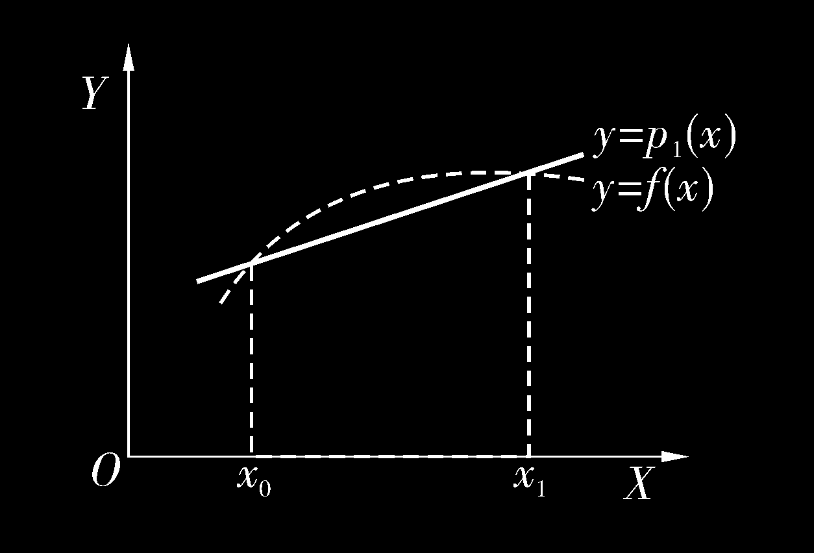

<!-- page: 23 -->

６
１
数值分析

f（x０，x１）＝f（x０）－f（x１）

x０－x１
从一阶差商的定义可以看到

f（xi，xj）＝f（xi）－f（xj）

xi －xj
＝f（xj）－f（xi）

xj －xi
＝f（xj，xi）

这就是说，一阶差商的值与节点的排列顺序无关．这种性质称为对称性．

特别地，当i ＝０和j ＝１时，有

f（x０，x１）＝f（x１，x０）

已知p１（x）＝a ＋bx 是一个直线方程且满足p１（x０）＝y０和p１（x１）＝y１，即它经

过（x０，y０）和（x１，y１）两点．按点斜式直线方程y －y０＝k（x －x０），其中k 为斜率，有

p１（x）＝y０＋y１－y０

x１－x０（x －x０）

＝f（x０）＋f（x１）－f（x０）

x１－x０
（x －x０）

＝f（x０）＋f（x０，x１）（x －x０）
（２畅２）

式（２畅２）称为Ｎｅｗｔｏｎ型线性插值公式，对应的p１（x）称为Ｎｅｗｔｏｎ型线性插值函

数．

从上面的讨论可以知道，线性插值函数p１（x）有两种形式，尽管形式不同，但

实质都一样，都是代表同一条直线，如图２－１所示．

前面已介绍过，线性插值是按插值条件构造插值函数p１（x）来近似代替f（x）．

很显然，p１（x）与f（x）之间必然存在误差，那么它们之间的误差为多少？

定理2畅1　设p１（x）是过（x０，y０）和（x１，y１）两点的线性插值函数，［a，b］是包

含［x０，x１］的任一区间，并设f（x）∈C

１［a，b］，f″（x）在［a，b］上存在，则对任意给定

的x∈［a，b］，总存在一点ξ∈（a，b），使得

R（x）＝f（x）－p１（x）＝f″（ξ）

２！（x －x０）（x －x１）
（２畅３）

其中ξ依赖于x．

证　对任一固定的x，引入辅助函数φ（t）．要求φ（x０）＝φ（x１）＝φ（x）＝０，不

妨把φ（t）表示为

φ（t）＝f（t）－p１（t）－k（t －x０）（t －x１）
（２畅４）

其中k 为待定常数．

显然，φ（x０）＝φ（x１）＝０．

要使φ（x）＝０，由（２畅４）式得

φ（x）＝f（x）－p１（x）－k（x －x０）（x －x１）＝０

即
R（x）－k（x －x０）（x －x１）＝０

<!-- page: 24 -->

７
１
２　代数插值与数值微分

由此得到
k ＝
R（x）
（x －x０）（x －x１）

因而
φ（t）＝f（t）－p１（t）－
R（x）
（x －x０）（x －x１）（t －x０）（t －x１）

有３个零点：x０，x１和x．

对于φ（t）的３个零点x０，x１和x，它们可以构成两个子区间．由Ｒｏｌｌｅ（洛尔）定

理（若f（t）在［a，b］上连续，在（a，b）上可导，且有f（a）＝f（b），则在（a，b）内至少

有一点c，使f′（c）＝０）可知φ′（t）在每个子区间上至少存在一个零点，φ′（t）在［a，

b］上至少有两个零点，可记为ξ
１和ξ
２，即有φ′（ξ
１）＝０和φ′（ξ
２）＝０．同理，φ″（t）

在（ξ
１，ξ
２）上至少有一个零点，可记为ξ，即有φ″（ξ）＝０．

对φ（t）求二次微商，得

φ″（t）＝f″（t）－p″
１（t）－２！
R（x）
（x －x０）（x －x１）

由于p１（t）是t 的一次多项式，所以有p″
１（t）＝０．于是得到

φ″（t）＝f″（t）－２！
R（x）
（x －x０）（x －x１）
（２畅５）

把t ＝ξ代入（２畅５）式，并注意到φ″（ξ）＝０，得

φ″（ξ）＝f″（ξ）－２！
R（x）
（x －x０）（x －x１）＝０

移项后有

R（x）＝f″（ξ）

２！（x －x０）（x －x１）
（２畅６）

R（x）就是f（x）与p１（x）的误差，称为线性插值余项．

对于线性插值余项，还可以进一步证明

R（x）≤（x１－x０）

２

８
ｍａｘ
x０≤x≤x１f″（x）
（２畅７）

（２畅７）式的证明留给读者作为习题．

　　例2 －1　给定如表２－５所示的函数表，用

表２－５　函数表

Ｌａｇｒａｎｇｅ型线性插值公式求ｌｎ１１畅７５的近似值，

x
１１
１２

并估计误差．

y ＝ｌｎx
２畅３９７９
２畅４８４９

解　根据Ｌａｇｒａｎｇｅ型线性插值公式（２畅１），

有

p１（x）＝（x －１２）

（１１－１２）×２畅３９７９＋（x －１１）

（１２－１１）×２畅４８４９

则
p１（１１畅７５）＝１１畅７５－１２

１１－１２
×２畅３９７９＋１１畅７５－１１

１２－１１
×２畅４８４９＝２畅４６３２

从而得到ｌｎ１１畅７５≈２畅４６３２．又因为

<!-- page: 25 -->

８
１
数值分析

f（x）－p１（x）＝f″（ξ）

２！（x －x０）（x －x１）

＝－１

２（x －１１）（x －１２）

２ξ

其中ξ∈［１１，１２］．所以

f（x）－p１（x）
＝１

２（x －１１）（x －１２）

２ξ

≤１

１
ξ

２
（x －１１）（x －１２）

２
ｍａｘ
ξ∈［１１，１２］

＝
１
２×１１

２（x －１１）（x －１２）

于是
ｌｎ１１畅７５－p１（１１畅７５）≤
１
２×１１

２（１１畅７５－１１）（１１畅７５－１２）

≈０畅０００７７４８

２畅１畅２　二次插值

　　二次插值的提法是：

表２－６　二次插值函数表

给定函数表（如表２－６所示），构造函数

x
x０
x１
x２

p２（x）满足条件：

y ＝f（x）
y０
y１
y２

①p２（x）是一个不超过二次的代数多项式；

②p２（x０）＝y０，p２（x１）＝y１和p２（x２）＝y２．

其中x０，x１和x２称为插值节点；f（x）称为被插值函数；p２（x）称为二次插值函数；条

件①和②称为插值条件．

二次插值的目的是构造p２（x）来近似代替f（x）．当求某一点x

倡的函数值

f（x

倡）时，可以用p２（x

倡）来近似代替f（x

倡）．

根据二次插值的提法，p２（x）是一个不超过二次的代数多项式，所以不妨假设

p２（x）＝a０＋a１x ＋a２x

２

其中a０，a１和a２为待定常数．

为了确定这三个待定常数，可以利用插值条件②得到三个等式，把它们联立起

来组成方程组

p２（x０）＝a０＋a１x０＋a２x

２
０＝y０

p２（x１）＝a０＋a１x１＋a２x

２
１＝y１

（２畅８）

p２（x２）＝a０＋a１x２＋a２x

２
２＝y２

方程组（２畅８）的系数行列式为

<!-- page: 26 -->

９
１
２　代数插值与数值微分

１　x０　x

２
０

１　x１　x

＝（x１－x０）（x２－x０）（x２－x１）

２
１

１　x２　x

２
２

所以，只要x０，x１和x２互不相等，方程组的解即a０，a１和a２存在且惟一，这样

就可以构造出惟一的p２（x）．

与线性插值函数一样，二次插值函数p２（x）也有两种形式：Ｌａｇｒａｎｇｅ形式和

Ｎｅｗｔｏｎ形式．

２畅１畅２畅１　二次插值函数的Ｌａｇｒａｎｇｅ形式

　　设p２（x）＝l０（x）y０＋l１（x）y１＋

表２－７　l０（x），l１（x）和l２（x）在节点处的取值

l２（x）y２，其中l０（x），l１（x）和l２（x）

节点
x０
x１
x２

函数值

为不超过二次的代数多项式，且满足

函数

表２－７．

l０（x）
１
０
０

容易验证，p２（x）满足插值条件

l１（x）
０
１
０

①和②．因此，只要找到满足表２－７

l２（x）
０
０
１

的l０（x），l１（x）和l２（x），就可以构造

出p２（x）．下面根据表２－７来构造

l０（x），l１（x）和l２（x）．

首先构造l０（x）．据表２－７，l０（x１）＝０和l０（x２）＝０，所以l０（x）必有因子（x －

x１）（x －x２）．又因l０（x）为不超过二次的代数多项式，而（x －x１）（x －x２）已是一个

二次代数多项式，故l０（x）只可能有一个常数因子，从而有

l０（x）＝A（x －x１）（x －x２）

其中A 为待定常数．

为了确定待定常数A，利用l０（x０）＝１得

l０（x０）＝A（x０－x１）（x０－x２）＝１

由此推得
A ＝
１
（x０－x１）（x０－x２）

因此
l０（x）＝（x －x１）（x －x２）

（x０－x１）（x０－x２）

用同样的方法可以求得

l１（x）＝（x －x０）（x －x２）

（x１－x０）（x１－x２）

l２（x）＝（x －x０）（x －x１）

（x２－x０）（x２－x１）

因此

　p２（x）＝（x －x１）（x －x２）

（x０－x１）（x０－x２）y０＋（x －x０）（x －x２）

（x１－x０）（x１－x２）y１＋（x －x０）（x －x１）

（x２－x０）（x２－x１）y２
（２畅９）

<!-- page: 27 -->

０
２
数值分析

其中l０（x），l１（x）和l２（x）称为二次插值基函数；p２（x）称为Ｌａｇｒａｎｇｅ型二次插值函

数；（２畅９）式称为Ｌａｇｒａｎｇｅ型二次插值公式．

２畅１畅２畅２　二次插值函数的Ｎｅｗｔｏｎ形式

由于Ｎｅｗｔｏｎ形式的二次插值函数与二阶差商有关，所以在推导Ｎｅｗｔｏｎ形式

的二次插值函数之前，先引入二阶差商的定义．

定义2畅2　若记f（xi，xj，xk ）＝f（xi，xj）－f（xj，xk）

xi －xk
，则称f（xi，xj，xk ）为函数f

（x）在节点xi，xj 和xk 处的二阶差商，其中xi，xj 和xk 互异．

特别地，当i ＝０，j ＝１和k ＝２时，有

f（x０，x１，x２）＝f（x０，x１）－f（x１，x２）

x０－x２
与一阶差商一样，二阶差商也具有对称性．也就是说，在求二阶差商时，无论

xi，xj 和xk 如何排列，它们的值都是一样的．

因为p２（x）为不超过二次代数多项式，所以为了构造上的方便，可以假设

p２（x）＝A ＋B（x －x０）＋C（x －x０）（x －x１）
（２畅１０）

其中A，B 和C 为待定常数．

确定三个待定常数A，B 和C，需要利用插值条件②．

由插值条件p２（x０）＝y０得

A ＝y０＝f（x０）

由插值条件p２（x１）＝y１得

A ＋B（x１－x０）＝f（x０）＋B（x１－x０）＝y１＝f（x１）

故
B ＝f（x１）－f（x０）

x１－x０
＝f（x１，x０）＝f（x０，x１）

由插值条件p２（x２）＝y２得

　A ＋B（x２－x０）＋C（x２－x０）（x２－x１）

＝f（x０）＋f（x０，x１）（x２－x０）＋C（x２－x０）（x２－x１）＝y２＝f（x２）

从而有
C ＝
f（x２）－f（x０）
（x２－x０）（x２－x１）－f（x０，x１）

x２－x１

＝f（x２，x０）－f（x０，x１）

x２－x１
＝f（x０，x１，x２）

于是，由（２畅１０）式得

　　p２（x）＝f（x０）＋f（x０，x１）（x －x０）＋f（x０，x１，x２）（x －x０）（x －x１）
（２畅１１）

可以验证，p２（x）满足插值条件①和②，它是一个二次插值函数．p２（x）称为

Ｎｅｗｔｏｎ型二次插值函数，（２畅１１）式称为Ｎｅｗｔｏｎ型二次插值公式．

<!-- page: 28 -->

１
２
２　代数插值与数值微分

　　二次插值也称为抛物线插值．抛物线插值的几

何意义是用抛物线来代替曲线y ＝f（x），如图２－２

所示．

定理2畅2　设p２（x）是过（x０，y０），（x１，y１）和

（x２，y２）三点的二次插值函数，［a，b］是包含x０，x１，

x２的任一区间，并设f（x）∈C

２［a，b］，f碶（x）在［a，

b］上存在，则对任意给定的x∈［a，b］，总存在一点

图２－２　抛物线插值的几何意义

ξ∈（a，b），使得

R（x）＝f（x）－p２（x）＝f碶（ξ）

３！（x －x０）（x －x１）（x －x２）
（２畅１２）

其中ξ依赖于x．

证　对任一固定的x，引入辅助函数φ（t）．要使φ（x０）＝φ（x１）＝φ（x２）＝

φ（x）＝０，不妨把φ（t）表示为

φ（t）＝f（t）－p２（t）－k（t －x０）（t －x１）（t －x２）
（２畅１３）

其中k 为待定常数．

显然，φ（x０）＝φ（x１）＝φ（x２）＝０．

要使φ（x）＝０，由（２畅１３）式得

φ（x）＝f（x）－p２（x）－k（x －x０）（x －x１）（x －x２）＝０

即
R（x）－k（x －x０）（x －x１）（x －x２）＝０

由此得到

k ＝
R（x）
（x －x０）（x －x１）（x －x２）

因此

φ（t）＝f（t）－p２（t）－
R（x）
（x －x０）（x －x１）（x －x２）（t －x０）（t －x１）（t －x２）

有４个零点：x０，x１，x２和x．

φ（t）的４个零点x０，x１，x２和x 可以构成３个子区间．由Ｒｏｌｌｅ定理可知

φ′（t）在［a，b］上至少有３个零点，可记为ξ
１，ξ
２和ξ
３．由ξ
１，ξ
２和ξ
３又可以构成两

个子区间，故φ″（t）在［a，b］上至少有２个零点，可记为η１和η２……φ碶（t）在（η１，

η２）上至少有１个零点，把这个零点记为ξ，即有φ碶（ξ）＝０．

现对φ（t）求三次微商．由于p２（t）是t 的二次多项式，所以求三次微商后，它

的值为０．于是

φ碶（t）＝f碶（t）－３！
R（x）
（x －x０）（x －x１）（x －x２）
（２畅１４）

把ξ代入（２畅１４）式并移项后得

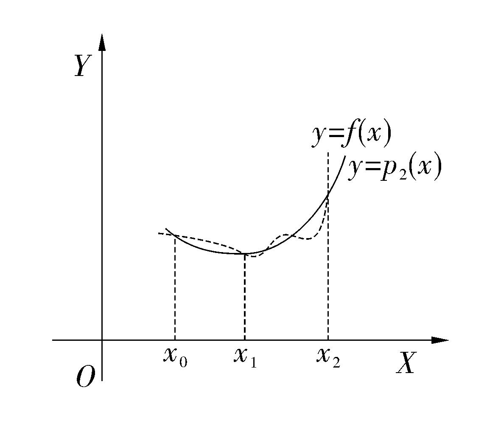

<!-- page: 29 -->

２
２
数值分析

R（x）＝f碶（ξ）

（x －x０）（x －x１）（x －x２）

３！

　　例2 －2 　给定如表２－８所示函数

表２－８　函数表

表，试用Ｎｅｗｔｏｎ型二次插值公式求

x
１１
１２
１３

ｌｎ１１畅７５的近似值，并估计误差．

y ＝ｌｎx
２畅３９７９
２畅４８４９
２畅５６４９

解　根据Ｎｅｗｔｏｎ型二次插值公式

（２畅８）有

p２（x）＝f（１１）＋f（１１，１２）（x －１１）＋f（１１，１２，１３）（x －１１）（x －１２）

而　　　　　　　f（１１）＝２畅３９７９

f（１１，１２）＝f（１１）－f（１２）

＝０畅０８７

１１－１２

f（１１，１２，１３）＝f（１１，１２）－f（１２，１３）

＝－０畅００３５

１１－１３

从而得到

p２（x）＝２畅３９７９＋０畅０８７（x －１１）－０畅００３５（x －１１）（x －１２）

p２（１１畅７５）＝２畅４６３７５

于是得到ｌｎ１１畅７５≈２畅４６３７５．又因为

f（x）－p２（x）＝f碶（ξ）

（x －x０）（x －x１）（x －x２）

３！

则
ｌｎx －p２（x）＝１

３（x －１１）（x －１２）（x －１３）

３ξ

其中ξ∈［１１，１３］．

对上式两边取绝对值得

ｌｎx －p２（x）
＝１

３（x －１１）（x －１２）（x －１３）

３ξ

≤１

１
ξ

３
（x －１１）（x －１２）（x －１３）

３
ｍａｘ
ξ∈［１１，１３］

＝
１
３×１１

３（x －１１）（x －１２）（x －１３）

于是　ｌｎ１１畅７５－p２（１１畅７５）≤
１
３×１１

３（１１畅７５－１１）（１１畅７５－１２）（１１畅７５－１３）

≈０畅００００５８７

２畅２　n 次插值的Ｌａｇｒａｎｇｅ形式和Ｎｅｗｔｏｎ形式

２畅１节介绍了线性插值和二次插值，从这两种插值可以推广到n 次插值．n 次

<!-- page: 30 -->

３
２
２　代数插值与数值微分

插值的提法是：给定y ＝f（x）的函数表（如表２－２所示），构造函数pn （x）满足条

件：

①pn（x）是一个不超过n 次的代数多项式；

②pn（xi）＝yi（i ＝０，１，…，n）．

其中xi 称为插值节点；f（x）称为被插值函数；pn（x）称为n 次插值函数．

n 次插值的目的是构造pn （x）来近似代替f（x）．当求某一点x

倡的函数值

f（x

倡）时，可以用pn（x

倡）来近似代替f（x

倡）．

由于pn（x）是一个不超过n 次的代数多项式，所以不妨假设

pn（x）＝a０＋a１x ＋a２x

２＋… ＋anx

n

其中a０，a１，…，an 为待定常数．

为了确定a０，a１，…，an，可以利用插值条件②得到n ＋１个等式，把它们联立起

来组成方程组

pn（x０）＝a０＋a１x０＋a２x

２
０＋… ＋anx

n
０＝y０

pn（x１）＝a０＋a１x１＋a２x

２
１＋… ＋anx

n
１＝y１

（２畅１５）

　　　

pn（xn）＝a０＋a１xn ＋a２x

２
n ＋… ＋anx

n
n ＝yn

方程组（２畅１５）的系数行列式为

１
x０
x

２
０
…
x

n
０

１
x１
x

２
１
…
x

n
１






１
xn
x

２
n
…
x

n
n

这是著名的Ｖａｎｄｅｒｍｏｎｄｅ（范德蒙）行列式，可以用归纳法证明它的值为

　（x１－x０）（x２－x０）…（xn －x０）（x２－x１）（x３－x１）…（xn －x１）…（xn －xn －１）

＝∏

０≤j ＜i≤n （xi －xj）

由于x０，x１，…，xn 互不相等，所以Ｖａｕｄｅｒｍｏｎｄｅ行列式的值不为０，从而方程

组的解a０，a１，…，an 存在且惟一．因此，pn（x）存在且惟一．

n 次插值函数pn（x）有两种形式：Ｌａｇｒａｎｇｅ形式和Ｎｅｗｔｏｎ形式．

２畅２畅１　n 次插值函数的Ｌａｇｒａｎｇｅ形式

设
pn（x）＝l０（x）y０＋l１（x）y１＋… ＋ln（x）yn

其中l０（x），l１（x），…，ln（x）为不超过n 次的代数多项式，且满足表２－９．

<!-- page: 31 -->

４
２
数值分析

表２－９　l０（x），l１（x），…，ln（x）在节点处的取值

节点
x０
x１
…
xn

函数值

函数

l０（x）
１
０
…
０

l１（x）
０
１
…
０






ln（x）
０
０
…
１

容易验证，pn（x）满足插值条件①和②．因此，只要找到满足表２－９的l０（x），l１
（x），…，ln（x），那么就可构造出pn （x）．下面根据表２－９构造l０（x），l１（x），…，ln
（x）．

首先构造l０（x）．根据表２－９，l０（xi）＝０（i ＝１，２，…，n），所以l０（x）必有因子

（x －x１）（x －x２）…（x －xn）．又因l０（x）为不超过n 次的代数多项式，而（x －x１）（x

－x２）…（x －xn）已是一个n 次代数多项式，故l０（x）只能还有一个常数因子，从而

得到

l０（x）＝A（x －x１）（x －x２）…（x －xn）

其中A 为待定常数．

为了确定A，利用l０（x０）＝１

l０（x０）＝A（x０－x１）（x０－x２）…（x０－xn）＝１

得

A ＝
１
（x０－x１）（x０－x２）…（x０－xn）

于是推得
l０（x）＝（x －x１）（x －x２）…（x －xn）

（x０－x１）（x０－x２）…（x０－xn）

用同样的方法可以求得

l１（x）＝（x －x０）（x －x２）…（x －xn）

（x１－x０）（x１－x２）…（x１－xn）



ln（x）＝（x －x０）（x －x１）…（x －xn －１）

（xn －x０）（xn －x１）…（xn －xn －１）

分析一下函数l０（x），l１（x），…，ln（x），就会发现它们的变化是有规律的，可以

把它们写成统一形式

li（x）＝（x －x０）…（x －xi －１）（x －xi ＋１）…（x －xn）

（xi －x０）…（xi －xi －１）（xi －xi ＋１）…（xi －xn）　（i ＝０，１，…，n）

l０（x），l１（x），…，ln （x）称为插值基函数．由于它们是不超过n 次的代数多项

<!-- page: 32 -->

５
２
２　代数插值与数值微分

式，所以它们又称为n 次插值基函数．有了这n ＋１个n 次插值基函数后，就得到了

满足插值条件的Ｌａｇｒａｎｇｅ型n 次插值函数．

n

pn（x）＝∑

i ＝０li（x）yi

（x －x０）…（x －xi －１）（x －xi ＋１）…（x －xn）
（xi －x０）…（xi －xi －１）（xi －xi ＋１）…（xi －xn）yi
（２畅１６）

n

＝∑

i ＝０

（２畅１６）式称为Ｌａｇｒａｎｇｅ型n 次插值公式．特别地，当n ＝１时，（２畅１６）式就是

Ｌａｇｒａｎｇｅ型线性插值公式；当n ＝２时，（２畅１６）式就是Ｌａｇｒａｎｇｅ型二次插值公式．

（２畅１６）式还可以写成另一种形式

ω（x）
（x －xi）ω′（xi）yi
（２畅１７）

n

pn（x）＝∑

i ＝０

其中
ω（x）＝（x －x０）（x －x１）…（x －xn）

ω′（xi）＝（xi －x０）…（xi －xi －１）（xi －xi ＋１）…（xi －xn）

对（２畅１７）式，可以验证它的正确性．Ｌａｇｒａｎｇｅ型n 次插值函数的这种形式在数

值分析的理论推导方面经常用到．

　　Ｌａｇｒａｎｇｅ型n 次插值算法

　　①读入插值节点xi，yi（i ＝０，１，…n）和点xx．

②yy ＝０．

③对i ＝０，１，…，n 做如下工作

　　t ＝１

　　对k ＝０，１，…，i －１，i ＋１，…，n 做

　　t ＝t倡xx －xk

xi －xk

　　yy ＝yy ＋t倡yi．

④输出点xx 相应的函数近似值yy．

２畅２畅２　n 次插值函数的Ｎｅｗｔｏｎ形式

２畅１节引入了一阶差商和二阶差商的定义，在此引入三阶差商的定义．

定义2畅3　若记f（xi，xj，xk，xl）＝f（xi，xj，xk）－f（xj，xk，xl）

xi －xl
，则f（xi，xj，xk，xl）称

为函数f（x）在节点xi，xj，xk 和xl 处的三阶差商．其中xi，xj，xk 和xl 互异．

定义2畅4　一般地，n 阶差商的定义为

f（xi０，xi１，…，xin －１）－f（xi１，xi２，…，xin）

f（xi０，xi１，…，xi n）＝

xi０－xin

<!-- page: 33 -->

６
２
数值分析

特别地，当i０＝０，i１＝１，…，in ＝n 时，有

f（x０，x１，…，xn）＝f（x０，x１，…，xn －１）－f（x１，x２，…，xn）

x０－xn
从差商的定义出发，用归纳法可以证明

f（xi）
ω′
k（xi）
（２畅１８）

k

f（x０，x１，…，xk）＝∑

i ＝０

其中ω′
k（xi）＝（xi －x０）…（xi －xi －１）（xi －xi ＋１）…（xi －xk），k ＝１，２，…，n．

由（２畅１８）式可知，无论x０，x１，…，xn 如何排列，它们的值都是一样的．也就是

说，n 阶差商具有对称性．

由一阶差商定义，有

f（x，x０）＝f（x）－f（x０）

x －x０

从而得到
f（x）＝f（x０）＋f（x，x０）（x －x０）

由二阶差商定义，有

f（x，x０，x１）＝f（x，x０）－f（x０，x１）

x －x１

可以得到
f（x，x０）＝f（x０，x１）＋f（x，x０，x１）（x －x１）

同样可以得到

f（x，x０，x１）＝f（x０，x１，x２）＋f（x，x０，x１，x２）（x －x２）

　　　

f（x，x０，x１，…，xn －２）＝f（x０，x１，x２，…，xn －１）＋f（x，x０，x１，…，xn －１）（x －xn －１）
f（x，x０，x１，…，xn －１）＝f（x０，x１，x２，…，xn）＋f（x，x０，x１，…，xn）（x －xn）

把以上各式由下而上逐步回代可得

f（x）＝f（x０）＋f（x０，x１）（x －x０）＋f（x０，x１，x２）（x －x０）（x －x１）＋… ＋

　f（x０，x１，…，xn）（x －x０）（x －x１）…（x －xn －１）＋

　f（x０，x１，…，xn，x）（x －x０）（x －x１）…（x －xn）

＝Nn（x）＋Rn（x）
（２畅１９）

其中
Rn（x）＝f（x０，x１，…，xn，x）（x －x０）（x －x１）…（x －xn）

Nn（x）＝f（x０）＋f（x０，x１）（x －x０）＋f（x０，x１，x２）（x －x０）（x －x１）＋… ＋

f（x０，x１，…，xn）（x －x０）（x －x１）…（x －xn －１）
（２畅２０）

因为Nn（x）是一个不超过n 次的代数多项式，并且可以证明

Nn（xi）＝f（xi）　（i ＝０，１，…，n）

故Nn（x）满足插值条件①和②，也是一个n 次插值函数．这个n 次插值函数称为

Ｎｅｗｔｏｎ型n 次插值函数；（２畅２０）式称为Ｎｅｗｔｏｎ型n 次插值公式．

从（２畅２０）式可以看到，当n ＝１时，（２畅２０）式就是Ｎｅｗｔｏｎ型线性插值公式；当

<!-- page: 34 -->

７
２
２　代数插值与数值微分

n ＝２时，（２畅２０）式就是Ｎｅｗｔｏｎ型二次插值公式．

在实际问题中，为了得到Ｎｅｗｔｏｎ型n 次插值函数，通常需要构造一个差商表

（如表２－１０所示），然后按照差商表写出Ｎｅｗｔｏｎ型n 次插值函数．

表２－１０　差商表

xi
yi ＝f（xi）
f（xi，xj）
f（xi，xj，xk）
…
f（x０，x１，…，xn）

x０
y０
x１
y１
f（x０，x１）

x２
y２
f（x１，x２）
f（x０，x１，x２）

x３
y３
f（x２，x３）
f（x１，x２，x３）





…
xn －１
yn －１
f（xn －２，xn －１）
f（xn －３，xn －２，xn －１）

xn
yn
f（xn －１，xn）
f（xn －２，xn －１，xn）
f（x０，x１，…，xn）

　　例2 －3　已知函数表如表２－１１所示．求Ｎｅｗｔｏｎ型n 次插值函数Nn （x），并

计算f（０畅６）的近似值．

表２－１１　函数表

x
０畅４
０畅５５
０畅６５
０畅８
０畅９

y ＝f（x）
０畅４１０７５
０畅５７８１５
０畅６９６７５
０畅８８８１１
１畅０２６５２

解　先作差商表如表２－１２所示：

表２－１２　例２－３差商表

xi
yi ＝f（xi）
f（xi，xj）
f（xi，xj，xk）
f（xi，xj，xk，xl）
f（x０，x１，…，x４）

０畅４

０畅４１０７５

０畅５５

０畅５７８１５

１畅１１６

０畅６５

０畅６９６７５

１畅１８６

０畅２８

０畅８

０畅８８８１１

１畅２７５７３

０畅３５８９２

０畅１９７３

０畅９

１畅０２６５２

１畅３８４１

０畅４３３４８

０畅２１３０３
０畅０３１４６

根据（２畅１６）式和差商表可以得到

　　N４（x）＝f（x０）＋f（x０，x１）（x －x０）＋

　f（x０，x１，x２）（x －x０）（x －x１）＋

　f（x０，x１，x２，x３）（x －x０）（x －x１）（x －x２）＋

　f（x０，x１，x２，x３，x４）（x －x０）（x －x１）（x －x２）（x －x３）

＝０畅４１０７５＋１畅１１６（x －０畅４）＋０畅２８（x －０畅４）（x －０畅５５）＋

　０畅１９７３（x －０畅４）（x －０畅５５）（x －０畅６５）＋

<!-- page: 35 -->

８
２
数值分析

　０畅０３１４６（x －０畅４）（x －０畅５５）（x －０畅６５）（x －０畅８）

于是
f（０畅６）≈N４（０畅６）＝０畅６３６６５

下面推导Ｎｅｗｔｏｎ型n 次插值在计算机上实现的计算格式，并给出在计算机上

实现的算法．

设　　　　ωk ＝（x －x０）（x －x１）…（x －xk －１）　（k ＝１，２，…，n）

ω０＝１

N０（x）＝y０＝f（x０）

V０，k ＝yk ＝f（xk）　（k ＝０，１，…，n）

Vi ＋１，k ＝Vi，i －Vi，k

xi －xk 　（k ＝１，２，…，n；i ＝０，１，…，k －１）

则有
ωk ＝（x －xk －１）ωk －１　（k ＝１，２，…，n）
（２畅２１）

Vk，k ＝f（x０，x１，…，xk）　（k ＝１，２，…，n）
（２畅２２）

由（２畅２１）式和（２畅２２）式可以得到

Nk（x）＝Nk －１（x）＋ωkVk，k　（k ＝１，２，…，n）

综合上述各式得到Ｎｅｗｔｏｎ型n 次插值的计算格式为

ω０＝１

N０（x）＝y０＝f（x０）

Vi ＋１，k ＝Vi，i －Vi，k

xi －xk 　（k ＝１，２，…，n；i ＝０，１，…，k －１）

ωk ＝（x －xk －１）ωk －１　（k ＝１，２，…，n）

Nk（x）＝Nk －１（x）＋ωkVk，k　（k ＝１，２，…，n）

　　Ｎｅｗｔｏｎ型n 次插值算法

　　①读入插值节点xi，yi（i ＝０，１，…，n）和点xx．

②ω＝１，V０＝y０，yy ＝y０．

③对k ＝１，２，…，n 做如下工作：

　　Vk ＝yk

　　对i ＝０，１，…，k －１做

　　Vk ＝Vi －Vk

xi －xk

　　ω＝ω倡（xx －xk －１）

　　yy ＝yy ＋ω倡Vk

④输出插值点xx 相应的函数近似值yy．

其中ω，yy 和Vk 分别用来存放ωk，Nk（x）和Vi ＋１，k的值．

类似于定理２畅２，可以证明如下定理．

<!-- page: 36 -->

９
２
２　代数插值与数值微分

定理2畅3　设pn（x）是过（xi，yi）（i ＝０，１，…，n）的n 次插值函数，［a，b］是包

n ［a，b］，f

含x０，x１，…，xn 的任一区间，并设f（x）∈C

（n ＋１）（x）在［a，b］上存在，则对

任意给定的x∈［a，b］，总存在一点ξ∈（a，b），使得

（n ＋１）（ξ）
（n ＋１）！（x －x０）（x －x１）…（x －xn）
（２畅２３）

R（x）＝f（x）－pn（x）＝p

其中ξ依赖于x．

２畅３　分段线性插值

n 次插值是根据给定的y ＝f（x）函数表构造代数多项式pn （x），pn （x）为n 次

插值函数，用pn（x）近似代替f（x）．为了表明pn （x）是一个代数多项式，有时亦称

pn（x）为n 次插值多项式．按这种说法，根据给定两个节点的函数表构造出来的插

值多项式是一次的，根据给定三个节点的函数表构造出来的插值多项式是两次的，

…，根据给定n ＋１个节点的函数表构造出来的插值多项式是n 次的．

由此可见，对于n 次插值，随着插值节点的增加，插值多项式的次数也会增加．

也许有些读者认为，插值多项式的次数越高，插值多项式pn（x）与f（x）的误差就会

越少．这种想法是片面的．

例2 －4　给定函数

f（x）＝
１
１＋２５x

２　（－１≤x≤１）

取等距插值节点xi ＝－１＋１

５i（i ＝０，１，…，１０），试建立插值多项式p１０（x），并考察

p１０（x）与f（x）的误差情况．

解　由Ｌａｇｒａｎｇｅ型n 次插值公式得到

１０

p１０（x）＝∑

i ＝０f（xi）li（x）

其中

xi ＝－１＋１

５i　（i ＝０，１，…，n）

f（xi）＝
１
１＋２５x

　（i ＝０，１，…，n）

２
i

li（x）＝（x －x０）…（x －xi －１）（x －xi ＋１）…（x －x１０）

（xi －x０）…（xi －xi －１）（xi －xi ＋１）…（xi －x１０）　（i ＝０，１，…，n）

画出函数f（x）＝
１
１＋２５x

２和y ＝p１０（x）的图形，如图２－３所示．从图上可以看

到，在原点附近p１０（x）能较好地逼近f（x），但在其他地方p１０（x）与f（x）的误差较

<!-- page: 37 -->

０
３
数值分析

大，越靠近两个端点－１和１误差就越大，还出

现激烈振荡现象．采用高次插值发生的这种现象

称为Ｒｕｎｇｅ（龙格）现象．

还可以证明，用pn （x）逼近f（x）＝
１
１＋２５x

２，

当n→∞时，pn（x）只能在｜x ｜＜０畅７２…内收敛，而

在这个区间外是发散的．

从例２－４可以得出如下结论：高次插值多

图２－３　函数f（x）＝
１
１＋２５x

项式并不一定能很好地近似代替被插值函数．因

２

此，在实际进行插值的时候，如果给定的插值节

和y ＝p１０（x）的图形

点很多，通常把插值区间分为若干段，然后在每

个分段上使用低次插值多项式来近似代替f（x），即在每个分段上采用低次插值．这

种做法称为分段插值．

如果在每个分段上使用不超过一次的代数多项式来近似代替被插值函数

y ＝f（x），则这种插值称为分段线性插值．

分段线性插值的提法是：根据给定函数y ＝f（x）的函数表（如表２－２所示），

构造函数p（x）满足条件：

①p（x）在［xi，xi ＋１］（i ＝０，１，…，n －１）上为不超过一次的代数多项式；

②p（xi）＝yi（i ＝０，１，…，n）．

其中p（x）称为分段线性插值函数．

分段线性插值的目的是分段构造p（x）来近似代替f（x）．当要求某一点x

倡的

函数值f（x

倡）时，可以用p（x

倡）近似代替f（x

倡）．

根据分段线性插值的条件，可以把p（x）直接构造出来：

x －x１
x０－x１y０＋x －x０

x１－x０y１　（x０≤x≤x１）

x －x２
x１－x２y１＋x －x１

x２－x１y２　（x１＜x≤x２）

p（x）＝

（２畅２４）

　　　　

x －xn
xn －１－xnyn －１＋x －xn －１

xn －xn －１yn　（xn －１＜x≤xn）

分段线性插值函数也可以由插值基函数组合而成．设l０（x），l１（x），…，ln （x）

为不超过n 次的代数多项式，且满足表２－１３．容易验证下面函数满足表２－１３．

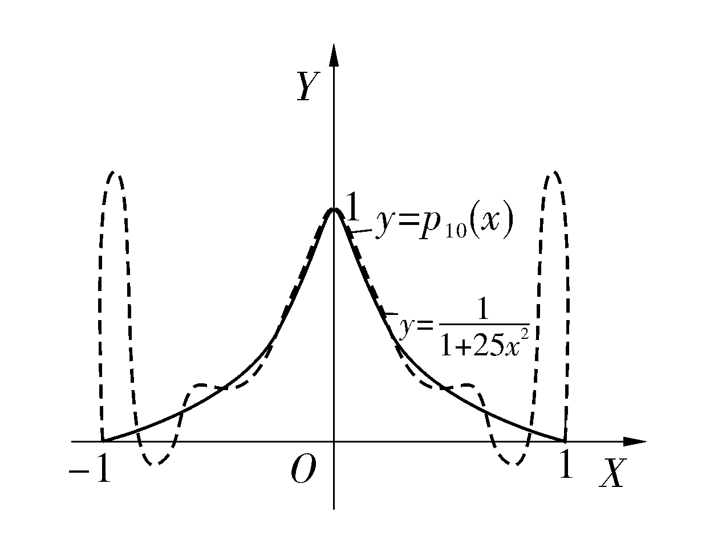

<!-- page: 38 -->

１
３
２　代数插值与数值微分

表２－１３　l０（x），l１（x），…，ln（x）在节点处的取值

节点
x０
x１
…
xn

函数值

函数

l０（x）
１
０
…
０

l１（x）
０
１
…
０






ln（x）
０
０
…
１

x －x１
x０－x１
（x０≤x≤x１）

l０（x）＝

０
（x１＜x≤xn）

x －xi －１
xi －xi －１
（xi －１≤x≤xi）

x －xi ＋１
xi －xi ＋１
（xi ＜x≤xi ＋１）

l１（x）＝

０
［a，b］－［xi －１，xi ＋１］　（i ＝１，２，…，n －１）

　　

x －xn －１
xn －xn －１
（xn －１≤x≤xn）

ln（x）＝

０
（x０≤x ＜xn －１）

l０（x），l１（x），…，ln（x）通常称为分段线性插值基函数，由这些分段线性插值基函数

可以得到分段线性插值函数的另一种形式

n

p（x）＝∑

i ＝０yili（x）

分段线性插值的几何意义是用一条折线y ＝p（x）来近似代替曲线y ＝f（x）．

例2 －5　给定函数y ＝f（x）的函数表如表２－１４所示，试用分段线性插值法

求y ＝f（x）在x ＝－０畅９处的近似值．

表２－１４　函数表

x
－１
－０畅８
－０畅６
－０畅４
０

y ＝f（x）
０畅０３８４６
０畅０５８８２
０畅１
０畅２
０畅５

<!-- page: 39 -->

２
３
数值分析

　　解

x ＋０畅８

－０畅２×０畅０３８４６＋x ＋１

０畅２×０畅０５８８２
（　－１≤x≤－０畅８）

x ＋０畅６

－０畅２×０畅０５８８２＋x ＋０畅８

０畅２
×０畅１
（－０畅８＜x≤－０畅６）

p（x）＝

x ＋０畅４

－０畅２×０畅１＋x ＋０畅６

０畅２
×０畅２
（－０畅６＜x≤－０畅４）

x
－０畅４×０畅２＋x ＋０畅４

０畅４
×０畅５
（－０畅４＜x≤０）

f（－０畅９）≈p（－０畅９）＝０畅０４８６４

　　分段线性插值算法

　　①读入插值节点xi，yi（i ＝０，１，…，n）和点xx．

②对i ＝１，２，…，n 做：

　　如果xx ＜xi 则

　　yy ＝xx －xi

xi －１－xiyi －１＋xx －xi －１

xi －xi －１yi

　　输出点xx 相应的函数近似值yy

　　转到③

③结束．

定理2畅4　设给定如表２－２所示的y ＝f （x）的函数表，令a ＝x０，b ＝xn，

f（x）∈C

１［a，b］，f″（x）在［a，b］上存在，p（x）是f（x）的分段线性插值函数，则有

２

R（x）
＝f（x）－p（x）≤h

８M
（２畅２５）

其中h ＝ｍａｘ

０≤i≤n －１xi ＋１－xi ；M ＝ｍａｘ

a≤x≤b f″（x）．

证　因为p（x）在每个小区间［xi，xi ＋１］（i ＝０，１，…，n －１）上都是线性函数，所

以由（２畅７）式可知，在［xi，xi ＋１］上有

R（x）≤（xi ＋１－xi）

２

８
ｍａｘ
x i≤x≤x i ＋１f″（x）

ｍａｘ
０≤i≤n －１xi ＋１－xi

２

≤

８
ｍａｘ
a≤x≤b f″（x）

若记h ＝ｍａｘ

０≤i≤n －１xi ＋１－xi ；M ＝ｍａｘ

a≤x≤b f″（x），则有

２

R（x）
＝f（x）－p（x）≤h

８M

<!-- page: 40 -->

３
３
２　代数插值与数值微分

２畅４　Ｈｅｒｍｉｔｅ插值

在某些实际问题中，为了保证插值函数更好地逼近被插值函数f（x），不仅要

求插值函数在插值节点上的值与被插值函数f（x）在插值节点上的值相等，而且还

要求插值函数在插值节点上的导数值与被插值函数f（x）在插值节点上的导数值

相等．解决这样的问题需要用到Ｈｅｒｍｉｔｅ插值．

２畅４畅１　三次Ｈｅｒｍｉｔｅ插值

　　三次Ｈｅｒｍｉｔｅ插值的提法是：

表２－１５　三次Ｈｅｒｍｉｔｅ插值函数表

根据给定的y ＝f（x）的函数表（如表

x
x０
x１

２－１５所示），构造函数H（x）满足条件：

y ＝f（x）
y０
y１

①H（x）为不超过三次的代数多项式；

y′＝f′（x）
m０
m１

②H（x０）＝y０，H（x１）＝y１；H′（x０）＝m０
和H′（x１）＝m１．

其中H（x）称为三次Ｈｅｒｍｉｔｅ插值函数．

三次Ｈｅｒｍｉｔｅ插值的目的是构造H（x）来近似代替f（x）．当求某一点x

倡的函

数值f（x

倡）时，可以用H（x

倡）近似代替f（x

倡）．

设
H（x）＝y０h０（x）＋y１h１（x）＋m０H０（x）＋m１H１（x）

其中h０（x），h１（x），H０（x）和H１（x）为不超过三次的代数多项式，且满足表２－１６．

表２－１６　h０（x），h１（x），H０（x）和H１（x）在节点处的取值

函数值
导数值

x０
x１
x０
x１

h０（x）
１
０
０
０

h１（x）
０
１
０
０

H０（x）
０
０
１
０

H１（x）
０
０
０
１

容易验证，H（x）就是满足插值条件①和②的Ｈｅｒｍｉｔｅ插值函数．下面要把

h０（x），h１（x），H０（x）和H１（x）构造出来．

先构造h０（x）．从表２－１６可以看出，当x ＝x１时，函数h０（x）的值为０，同时函

数h０（x）的导数也为０，所以它必有因子（x －x１）

２．另外，h０（x）是一个不超过三次

的代数多项式，从而h０（x）可以表示为

<!-- page: 41 -->

４
３
数值分析

h０（x）＝［a ＋b（x －x０）］
x －x１
x０－x１

２

其中a 和b 为待定常数．

由h０（x０）＝１得a ＝１．

为了确定b，对h０（x）求微商，得

h′
０（x）＝b
x －x１
x０－x１

＋［１＋b（x －x０）］×２× x －x１

２

×
１
x０－x１

x０－x１

再由h′
０（x０）＝０得到b ＝
２
x１－x０．

于是

h０（x）＝１＋２x －x０

x －x１
x０－x１

２

（２畅２６）

x１－x０

用同样方法可以求得

h１（x）＝１＋２x －x１

x －x０
x１－x０

２

（２畅２７）

x０－x１

再构造H０（x）．从表２－１６可以看到，H０（x）在x０处的函数值为０，在x１上不

仅函数值为０，而且微商也为０，所以它必有因子（x －x０）（x －x１）

２．又因它是一个

不超过三次的代数多项式，而（x －x０）（x －x１）

２已是一个三次代数多项式，从而H０
（x）可以表示为

H０（x）＝c（x －x０）
x －x１
x０－x１

２

其中c 为待定常数．

为了确定c，对H０（x）求微商得

＋２（x －x０）
x －x１
（x０－x１）

H′
０（x）＝c
x －x１
x０－x１

２

２

由H′
０（x０）＝１，得到c ＝１．于是

H０（x）＝（x －x０）
x －x１
x０－x１

２

（２畅２８）

用同样的方法可求得

H１（x）＝（x －x１）
x －x０
x１－x０

２

（２畅２９）

因此

H（x）＝y０h０（x）＋y１h１（x）＋m０H０（x）＋m１H１（x）

＝１＋２x －x０

x －x１
x０－x１

y０＋１＋２x －x１

x －x０
x１－x０

２

２

y１＋

x１－x０

x０－x１

<!-- page: 42 -->

５
３
２　代数插值与数值微分

　（x －x０）
x －x１
x０－x１

m０＋（x －x１）
x －x０
x１－x０

２

２

m１
（２畅３０）

（２畅３０）式也称为三次Ｈｅｒｍｉｔｅ插值公式．

　　例2 －6　给定函数y ＝f（x）的函数表如表

表２－１７　函数表

２－１７所示。构造一个三次Ｈｅｒｍｉｔｅ插值函数，

x
０
１

并求出f
１
２
的近似值．

y ＝f（x）
０
１

解　由（２畅２６）式、（２畅２７）式、（２畅２８）式和

y′＝f′（x）
３
９

（２畅２９）式得到

h０（x）＝（１＋２x）（x －１）

２

h１（x）＝［１－２（x －１）］x

２

H０（x）＝x（x －１）

２

H１（x）＝（x －１）x

２

从而由（２畅３０）式得

H（x）＝y０h０（x）＋y１h１（x）＋m０H０（x）＋m１H１（x）

＝［１－２（x －１）］x

２＋３x（x －１）

２＋９（x －１）x

２

因此
f
１
２
≈H
１
２
＝－１

４

定理2畅5　设H（x）是f（x）的三次Ｈｅｒｍｉｔｅ插值函数，［a，b］是包含x０，x１的任

一区间，并设f（x）∈C

３［a，b］，f

（４）（x）在［a，b］上存在，则对任意给定的x∈［a，b］，

总存在一点ξ∈（a，b），使得

（４）（ξ）

R（x）＝f（x）－H（x）＝f

４！
（x －x０）

２（x －x１）

２
（２畅３１）

其中ξ依赖于x．

证　设x 是［a，b］中的任一固定数，若x ＝xi（i ＝０，１），则（２畅３１）式成立．下面

考虑x 不是插值节点的情况．

引入辅助函数

φ（t）＝f（t）－H（t）－
R（x）
（x －x０）

２（t －x０）

２（t －x１）

２

２（x －x１）

易知φ（t）在［a，b］上具有四阶连续导数，并有x０，x１和x ３个不同零点，其中x０，x１
为二重零点．因此φ′（t）在φ（t）的每两个零点间至少存在一个零点，记这两个零点

为η０，η１，从而φ′（t）在［a，b］上至少有４个零点x０，x１，η０，η１．故φ″（t）在［a，b］上

至少有３个零点．按此类推，φ

（４）（t）在［a，b］上至少有一个零点，把该零点记为ξ，

即有φ

（４）（ξ）＝０．

对φ（t）求４次微商，并注意到H（t）为不超过三次的代数多项式，故

<!-- page: 43 -->

６
３
数值分析

（４）（t）－４！
R（x）
（x －x０）

φ

（４）（t）＝f

２（x －x１）

２

把ξ代入上式，并注意到φ

（４）（ξ）＝０，移项后得

（４）（ξ）

R（x）＝f

４！
（x －x０）

２（x －x１）

２

２畅４畅２　２n ＋１次Ｈｅｒｍｉｔｅ插值

２n ＋１次Ｈｅｒｍｉｔｅ插值的提法是：

给定y ＝f（x）的函数表（如表２－１８所示），构造函数H（x）满足条件：

①H（x）为不超过２n ＋１次的代数多项式；

②H（xi）＝yi，H′（xi）＝mi　（i ＝０，１，…，n）．

表２－１８　２n ＋１次Ｈｅｒｍｉｔｅ插值函数表

x
x０
x１
…
xn

y ＝f（x）
y０
y１
…
yn

y′＝f′（x）
m０
m１
…
mn

H（x）称为２n ＋１次Ｈｅｒｍｉｔｅ插值函数．

２n ＋１次Ｈｅｒｍｉｔｅ插值的目的是构造H（x）来近似代替f（x）．当求某一点x

倡的

函数值f（x

倡）时，可以用H（x

倡）近似代替f（x

倡）．

n

设
H（x）＝∑

i ＝０［yihi（x）＋miHi（x）］

i ＝０，１，…，n．其中hi （x）和Hi （x）为不超过２n ＋１次的代数多项式，且满足表

２－１９．

表２－１９　hi（x）和Hi（x）的取值

函数值
导数值

x０
x１
…
xn
x０
x１
…
xn

h０（x）
１
０
…
０
０
０
…
０

h１（x）
０
１
…
０
０
０
…
０









hn（x）
０
０
…
１
０
０
…
０

H０（x）
０
０
…
０
１
０
…
０

H１（x）
０
０
…
０
０
１
…
０









Hn（x）
０
０
…
０
０
０
…
１

<!-- page: 44 -->

７
３
２　代数插值与数值微分

容易验证，H（x）满足插值的两个条件，即H（x）就是一个２n ＋１次Ｈｅｒｍｉｔｅ插

值函数．下面构造hi（x）和Hi（x）．

先构造h０（x）．因为h０（xi）＝h′
０（xi）＝０，所以h０（x）必有因子［（x －x１）（x －

x２）…（x －xn）］

２．又因h０（x）为不超过２n ＋１次的代数多项式，故h０（x）可以表示

为

h０（x）＝（ax ＋b）l

２
０（x）

其中a 和b 为待定常数；l０（x）＝（x －x１）（x －x２）…（x －xn）

（x０－x１）（x０－x２）…（x０－xn）．

又因h０（x０）＝１，故有ax０＋b ＝１，即b ＝１－ax０．

对h０（x）求一阶导数得

h′
０（x）＝al

２
０（x）＋２（ax ＋b）l０（x）l′
０（x）

由h′
０（x０）＝０，故有

h′
０（x０）＝a ＋２l′
０（x０）＝０

从而得到

a ＝－２l′
０（x０）

b ＝１＋２x０l′
０（x０）

h０（x）＝１－２（x －x０）l′
０（x０）l

２
０（x）

为求l′
０（x０），对l０（x）两边取对数得

ｌｎ［l０（x）］＝ｌｎ（x －x１）＋ｌｎ（x －x２）＋… ＋ｌｎ（x －xn）－

［ｌｎ（x０－x１）＋ｌｎ（x０－x２）＋… ＋ｌｎ（x０－xn）］

对上式两边求导数得

１
l０（x）l′
０（x）＝∑

１
x －xj

n

j ＝１

１
x －xj

n

从而有
l′
０（x）＝l０（x）∑

j ＝１

１
x０－xj
于是得到

n

由此推得
l′
０（x０）＝∑

j ＝１

１
x０－xj
l

n

h０（x）＝１－２（x －x０）∑

２
０（x）
（２畅３２）

j ＝１

用同样的方法可以得到

１
xi －xj
l

n

hi（x）＝１－２（x －xi）∑

２
i （x）　（i ＝１，２，…，n）
（２畅３３）

j ＝１
j≠i

再来构造Hi（x），i ＝０，１，…，n．先构造H０（x）．因为H０（x０）＝０和H０（xi）＝H′
０

（xi）＝０（i ＝１，２，…，n），所以H０（x）必有因子（x －x０）［（x －x１）…（x －xn）］

２．又因

<!-- page: 45 -->

８
３
数值分析

H０（x）为不超过２n ＋１次的代数多项式，故H０（x）可以表示为

H０（x）＝a（x －x０）l

２
０（x）

其中a 为待定常数．

对H０（x）求一阶导数得

H′
０（x）＝a［l

２
０（x）＋２（x －x０）l０（x）l′
０（x）］

由H′
０（x０）＝１得a ＝１．于是得到

H０（x）＝（x －x０）l

２
０（x）
（２畅３４）

用同样的方法可以得到

Hi（x）＝（x －xi）l

２
i （x）　（i ＝１，２，…，n）
（２畅３５）

因此，２n ＋１次Ｈｅｒｍｉｔｅ插值函数为

n

　　H（x）＝∑

i ＝０［yihi（x）＋miHi（x）］

n

１
xi －xj
l

n

i ＝０
yi １－２（x －xi）∑

＝∑

２
i （x）
（２畅３６）

２
i （x）＋mi（x －xi）l

j ＝１
j≠i

类似于定理２畅５，可以证明如下定理．

定理2畅6　设给定如表２－１８所示的函数表，H（x）是２n ＋１次Ｈｅｒｍｉｔｅ插值函

数，［a，b］是包含x０，x１，…，xn 的任一区间，并设f（x）∈C

２n ＋１［a，b］，f

（２n ＋２）（x）在［a，

b］上存在，则对任意给定的x∈［a，b］，总存在一点ξ∈（a，b），使得

（２n ＋２）（ξ）
（２n ＋２）！ω

R（x）＝f（x）－H（x）＝f

２（x）
（２畅３７）

其中ξ依赖于x，ω（x）＝（x －x０）（x －x１）…（x －xn）．

分段三次Ｈｅｒｍｉｔｅ插值

在２畅３中介绍的分段线性插值函数在节点处的导数是不连续的．如果除了给

定被插值函数在节点处的函数值外，还给出被插值函数在节点处的导数值，要想构

造一个在节点处的导数也连续的插值函数可以使用分段三次Ｈｅｒｍｉｔｅ插值．

分段三次Ｈｅｒｍｉｔｅ插值的提法是：

给定函数y ＝f（x）的函数表（如表２－１２所示），构造函数q（x）满足条件：

①q（x）在［xi，xi ＋１］（i ＝０，１，…，n －１）上为三次代数多项式：

②q（xi）＝yi（i ＝０，１，…，n）；

③q（x）∈C

１［a，b］，其中a ＝x０，b ＝xn．

其中q（x）称为分段三次Ｈｅｒｍｉｔｅ插值函数．

根据分段三次Ｈｅｒｍｉｔｅ插值条件和三次Ｈｅｒｍｉｔｅ插值公式（２畅３０），可以把q（x）

直接构造出来．在区间［xi，xi ＋１］上有

<!-- page: 46 -->

９
３
２　代数插值与数值微分

q（x）＝１＋２
x －xi
xi ＋１－xi

x －xi ＋１
xi －xi ＋１

yi ＋１＋２x －xi ＋１

x －xi
xi ＋１－xi

２

２

yi ＋１＋

xi －xi ＋１

（x －xi）
x －xi ＋１
xi －xi ＋１

mi ＋（x －xi ＋１）
x －xi
xi ＋１－xi

２

２

mi ＋１
（２畅３８）

分段三次Ｈｅｒｍｉｔｅ插值函数q（x）也可以由插值基函数组合而成．若在插值区

间［a，b］上定义一组分段三次Ｈｅｒｍｉｔｅ插值基函数hi（x）和Hi（x）（i ＝０，１，…，n），

则由（２畅３８）式得

n

q（x）＝∑

i ＝０［yihi（x）＋miHi（x）］
（２畅３９）

其中hi（x）和Hi（x）分别为：

１＋２x －x０

x －x１
x０－x１

２

（x０≤x≤x１）

x１－x０

h０（x）＝

０
（x１＜x≤xn）

１＋２
x －xi
xi －１－xi

x －xi －１
xi －xi －１

２

（xi －１≤x≤xi）

hi（x）＝

１＋２
x －xi
xi ＋１－xi

x －xi ＋１
xi －xi ＋１

２

（xi ＜x≤xi ＋１）

０
［a，b］－［xi －１－xi ＋１］

（i ＝１，２，…，n －１）

１＋２
x －xn
xn －１－xn

x －xn －１
xn －xn －１

２

（xn －１≤x≤xn）

hn（x）＝

０
（x０≤x ＜xn －１）

（x －x０）
x －x１
x０－x１

２

（x０≤x≤x１）

H０（x）＝

０
（x１＜x≤xn）

（x －xi）
x －xi －１
xi －xi －１

２

（xi －１≤x≤xi）

Hi（x）＝

（x －xi）
x －xi ＋１
xi －xi ＋１

２

（xi ＜x≤xi ＋１）

０
［a，b］－［xi －１－xi ＋１］

（i ＝１，２，…，n －１）

（x －xn）
x －xn －１
xn －xn －１

２

（xn －１≤x≤xn）

Hn（x）＝

０
（x０≤x ＜xn －１）

<!-- page: 47 -->

０
４
数值分析

　　分段三次Ｈｅｒｍｉｔｅ插值算法

　　①读入插值节点xi，函数值yi，导数值mi（i ＝０，１，…，n）和点xx

②对i ＝０，１，…，n －１，如果xx ＜xi ＋１，则

　　yy ＝１＋２xx －xi

xx －xi ＋１

yi ＋１＋２xx －xi ＋１

xx －xi
xi ＋１－xi

２

２

yi ＋１＋

xi ＋１－xi

xi －xi ＋１

xi －xi ＋１

　　　　（xx －xi）xx －xi ＋１

mi ＋（xx －xi ＋１）
xx －xi
xi ＋１－xi

２

２

mi ＋１

xi －xi ＋１

　输出点xx 相应的函数近似值yy．转到③

③结束

定理
2畅7　设给定如表
２－１３
所示的函数表，令a ＝x０，b ＝xn，f（x）∈C

３

［a，b］，f

（４）（x）在［a，b］上存在，q（x）是f（x）的分段三次Ｈｅｒｍｉｔｅ插值函数，则有

４

R（x）
＝f（x）－q（x）≤h

３８４M
（２畅４０）

其中h ＝ｍａｘ

０≤i≤n －１xi ＋１－xi ，M ＝ｍａｘ

（４）（x）．

a≤x≤b f

证明　由于q（x）在每个小区间［xi，xi ＋１］（i ＝０，１，…，n －１）上都是三次Ｈｅｒ唱

ｍｉｔｅ插值函数，所以由（２畅３１）式可知，在［xi，xi ＋１］（i ＝０，１，…，n －１）上有

（４）（ξ
i）
４！
（x －xi）

R（x）＝f（x）－q（x）＝f

２（x －xi ＋１）

２

其中ξ
i 依赖于x，且xi ＜ξ
i ＜xi ＋１．

２
＝（xi ＋１－xi）

４

因为
ｍａｘ
x i≤x≤x i ＋１（x －xi）

２（x －xi ＋１）

１６

故
ｍａｘ
x i≤x≤x i ＋１R（x）≤（xi ＋１－xi）

４

（４）（x）

３８４
ｍａｘ
x i≤x≤x i ＋１f

若记h ＝ｍａｘ

０≤i≤n －１xi ＋１－xi ，M ＝ｍａｘ

（４）（x），则在［a，b］上有

a≤x≤b f

４

R（x）
＝f（x）－q（x）≤h

３８４M

２畅　三次样条插值

5

前面已经介绍过怎样根据给定函数表的节点构造插值多项式．当函数表的节

点很多时，构造出来的是一个高次插值多项式，而高次插值多项式与被插值函数

f（x）的误差有时比较大．为了减少误差，可以采用分段插值．但分段插值也有缺点，

那就是插值函数在节点处不够光滑．例如，分段线性插值函数只保证在节点处连

续，它的导数在节点处就不连续了．又如，分段三次Ｈｅｒｍｉｔｅ插值也只有一阶导数

<!-- page: 48 -->

１
４
２　代数插值与数值微分

连续，二阶导数就不连续了，而往往实际问题中有时很难给出导数条件．但在一些

实际问题中，不仅要求构造的插值函数在节点处连续，一阶导数在节点处连续，而

且还要求插值函数在节点处二阶导数也连续．换句话说，就是要求提高插值函数在

节点处的光滑度，同时减少对节点处导数的要求．为了提高插值函数在节点处的光

滑度，可以采用样条插值．

样条插值需要用到样条函数．什么叫样条函数？这要从工程中的样条曲线谈

起．在工程实践中，比如造船、造飞机等，绘图员为了在钢板或铝板上将一些点连结

成一条光滑曲线，往往用细长的木条把这些点连接起来．对这条光滑曲线进行数学

模拟就得到一个函数，由于这个函数与木条有联系，而木条又称为样条，所以该函

数称为样条函数．

样条函数有一次、二次、三次或更高次的样条函数．三次样条函数是一个分段

代数多项式，在每一个分段上它是一个不超过三次的代数多项式，它在节点上连

续，其一阶导数和二阶导数在节点上也连续．因而，三次样条函数属于C

２［a，b］，这

是三次样条函数的一个突出优点．由于有这样的优点，三次样条函数在实际中得到

广泛的应用．三次样条函数用在插值中就产生了一种插值方法，这种方法称为三次

样条插值．

三次样条插值的提法是：

给定y ＝f（x）的函数表（如表２－２所示），构造函数s（x）满足条件：

①在［xi，xi ＋１］（i ＝０，１，…，n －１）上为不超过三次的代数多项式；

②s（xi）＝yi（i ＝０，１，…，n）；

③s（x）∈C

２［a，b］，其中a ＝x０，b ＝xn．

其中s（x）称为三次样条插值函数．

下面讨论如何构造三次样条插值函数s（x）．

设s（x）在点xi（i ＝０，１，…，n）处的微商为mi（i ＝０，１，…，n），则s（x）在每个小

区间［xi，xi ＋１］上有

s（xi）＝yi　　s′（xi）＝mi　　　　s（xi ＋１）＝yi ＋１　　s′（xi ＋１）＝mi ＋１
从而s（x）在区间［xi，xi ＋１］上满足三次Ｈｅｒｍｉｔｅ插值的两个条件．按照三次Ｈｅｒｍｉｔｅ

插值公式，在区间［xi，xi ＋１］上有

s（x）＝１＋２
x －xi
xi ＋１－xi

x －xi ＋１
xi －xi ＋１

yi ＋１＋２x －xi ＋１

x －xi
xi ＋１－xi

２

２

yi ＋１＋

xi －xi ＋１

（x －xi）
x －xi ＋１
xi －xi ＋１

mi ＋（x －xi ＋１）
x －xi
xi ＋１－xi

２

２

mi ＋１
（２畅４１）

在（２畅４１）式中，mi 是未知的．为了求mi，可以利用插值条件③，也就是利用

s（x）在xi（i ＝０，１，…，n）上具有连续的二阶微商的性质．

首先，令hi ＝xi ＋１－xi，由（２畅４１）式得到

<!-- page: 49 -->

２
４
数值分析

（x －xi ＋１）

（x －xi）

s（x）＝１＋２x －xi

yi ＋１－２x －xi ＋１

２

２

yi ＋１＋

２
i

２
i

hi

hi

h

h

（x －xi）（x －xi ＋１）

mi ＋（x －xi ＋１）（x －xi）

２

２

mi ＋１
（２畅４２）

２
i

２
i

h

h

从而在［xi，xi ＋１］上有

s″（x）＝６

－１２

（xi ＋１－x）yi ＋６

－１２

（x －xi）yi ＋１＋

２
i

３
i

２
i

３
i

h

h

h

h

２
hi －６

（xi ＋１－x）mi －２

h i －６

（x －xi）mi ＋１
（２畅４３）

２
i

２
i

h

h

分别把（２畅４２）式和（２畅４３）式中的下标i ＋１改为i，i 改为i －１，则在区间

［xi －１，xi］上有

（x －xi）

（x －xi －１）

s（x）＝１＋２x －xi －１

yi －１＋１－２x －xi

２

２

yi ＋

２
i －１

２
i －１

hi －１

hi －１

h

h

（x －xi －１）（x －xi）

mi －１＋（x －xi）（x －xi －１）

２

２

mi
（２畅４４）

２
i －１

２
i －１

h

h

s″（x）＝
６
h

－１２

（xi －x）yi －１＋
６
h

－１２

（x －xi －１）yi ＋

２
i －１

３
i －１

２
i －１

３
i －１

h

h

２
hi －１－６

（xi －x）mi －１－
２
hi －１－６

（x －xi －１）mi
（２畅４５）

２
i －１

２
i －１

h

h

由（２畅４３）式和（２畅４５）式，当i ＝１，２，…，n －１时，有

＋
i ）＝－６

yi ＋６

yi ＋１－４

hi mi －２

　　　s″（x

hi mi ＋１
（２畅４６）

２
i

２
i

h

h

－
i ）＝６

yi －１－６

yi ＋２

hi －１mi －１＋４

　　　s″（x

hi －１mi
（２畅４７）

２
i －１

２
i －１

h

h

因为s（x）在xi 上具有连续的二阶微商，所以s″（x

－
i ）＝s″（x

＋
i ），即

６
h

yi －１－６

yi ＋２

hi －１mi －１＋４

hi －１mi ＝－６

yi ＋６

yi ＋１－４

h i mi －２

hi mi ＋１

２
i －１

２
i －１

２
i

２
i

h

h

h

将上式整理后得

hi －１＋２hi －１＋hi

hi
＝３yi －yi －１

＋yi ＋１－yi

mi －１

hi －１hi mi ＋mi ＋１

２
i －１

２
i

h

h

上式两边乘hi －１hi

hi －１＋hi得

hi
hi －１＋himi －１＋２mi ＋hi －１

hi －１＋himi ＋１＝３
hi
（hi －１＋hi）hi －１（yi －yi －１）＋

hi －１
（hi －１＋hi）hi（yi ＋１－yi）

<!-- page: 50 -->

３
４
２　代数插值与数值微分

令αi ＝hi －１

hi －１＋hi，上式变为

（１－αi）mi －１＋２mi ＋αimi ＋１＝３１－αi

hi －１（yi －yi －１）＋αi

hi （yi ＋１－yi）

再令β
i ＝３１－αi

hi －１（yi －yi －１）＋αi

hi （yi ＋１－yi），由上式得

（１－αi）mi －１＋２mi ＋αimi ＋１＝β
i　（i ＝１，２，…，n －１）

分别令i ＝１，２，…，n －１，得到由n －１个等式组成的方程组：

（１－α
１）m０＋２m１＋α
１m２
＝β
１

（１－α
２）m１＋２m２＋α
２m３
＝β
２

（２畅４８）



（１－αn －１）mn －２＋２mn －１＋αn －１mn ＝β
n －１

这是一个含有n ＋１个未知数和n －１个方程的线性方程组，因而方程组有无

穷多个解．

为了得到惟一解，需要根据具体情况补充两个附加条件，从而消去两个未知数

或补充两个方程．通常选取边界条件作为附加条件，而边界条件一般有如下两种情

形：

（１）已知被插值函数y ＝f （x）在两个端点x０和xn 处的微商值，即给定

f′（x０）＝m０和f′（xn）＝mn，相应要求s（x０）＝m０和s（xn ）＝mn，再把m０和mn 代入

方程组（２畅４８），方程组（２畅４８）就变成只有n －１个未知数了．

（２）已知被插值函数y ＝f（x）在两个端点x０和xn 处的二阶微商值为０，即给

定f″（x０）＝０和f″（xn）＝０，相应要求s″（x０）＝０和s″（xn）＝０．

由（２畅４６）式得

＋
０）＝－６

y０＋６

y１－４

h０m０－２

s″（x

h０m１＝０

２
０

２
０

h

h

整理后得

２m０＋m１＝３

h０（y１－y０）
（２畅４９）

由（２畅４７）式得

－
n ）＝６

yn －１－６

yn ＋２

hn －１mn －１＋４

s″（x

hn －１mn ＝０

２
n －１

２
n －１

h

h

整理后得

mn －１＋２mn ＝３yn －yn －１

hn －１
（２畅５０）

把方程（２畅４９）、方程（２畅５０）和方程组（２畅４８）联立起来，就得到一个有n ＋１个

<!-- page: 51 -->

４
４
数值分析

未知数和n ＋１个方程的线性代数方程组．

从前面的讨论可知，补充了边界条件之后就可以求线性代数方程组的解m０，

m１，…，mn 了．将m０，m１，…，mn 代入s（x）的各个子区间上的表达式（２畅４１）就可以

得到三次样条插值函数s（x）．

为了便于在计算机上实现三次样条插值，把由上述两种边界条件推得的方程

组写成统一形式：

２m０
＋α
０m１
＝β
０

（１－α
１）m０
＋２m１＋α
１m２
＝β
１

（２畅５１）

（１－α２）m１
＋２m２＋α
２m３
＝β
２

（１－αn －１）mn －２＋２mn －１＋αn －１mn ＝β
n －１



（１－αn）mn －１
＋２mn ＝β
n

其中，对第一种边界条件：α
０＝０，β
０＝２m０，αn ＝１，β
n ＝２mn；而对第二种边界条件：

h０（y１－y０），αn ＝０，β
n ＝３yn －yn －１

α０＝１，β
０＝３

hn －１
．

可以看到，方程组（２畅５１）所对应的系数矩阵强对角占优．而强对角占优的矩

阵必定非奇异．因此，方程组（２畅５１）的解存在且惟一．

方程组（２畅５１）是一个三对角方程组，可以推出求m０，m１，…，mn 的计算公式．

从方程组（２畅５１）的第一个方程得

m０＝－α
０
２m１＋β
０
２

令a０＝－α０

２，b０＝β
０
２，则有

m０＝a０m１＋b０
把m０代入方程组（２畅５１）的第二个方程，整理后得

m１＝－
α１
２＋（１－α
１）a０m２＋β
１－（１－α
１）b０
２＋（１－α
１）a０

令a１＝－
α
１
２＋（１－α
１）a０，b１＝β
１－（１－α１）b０
２＋（１－α
１）a０，则有

m１＝a１m２＋b１
把m１代入方程组（２畅５１）的第三个方程，整理后得

m２＝－
α２
２＋（１－α
２）a１m３＋β
２－（１－α
２）b１
２＋（１－α
２）a１

令a２＝－
α
２
２＋（１－α
２）a１，b２＝β
２－（１－α２）b１
２＋（１－α
２）a１，则有

m２＝a２m３＋b２
……

<!-- page: 52 -->

５
４
２　代数插值与数值微分

依此类推，最后把mn －１代入第n ＋１个方程并整理后得

mn －１＝a n －１mn ＋bn －１

其中，an －１＝－
αn －１
２＋（１－αn －１）an －２；bn －１＝β
n －１－（１－αn －１）bn －２
２＋（１－αn －１）an －２
．

把上面式子归纳起来得到递推关系式

mi ＝aimi ＋１＋bi　（i ＝０，１，…，n －１）

其中，a０＝－α
０
２；b０＝β
０
２；ai ＝－
αi
２＋（１－αi）ai －１；bi ＝β
i －（１－αi）bi －１
２＋（１－αi）ai －１．

从递推关系式可以得到

mn －１＝an －１mn ＋bn －１

mn －２＝an －２mn －１＋bn －２

　　

m０＝a０m１＋b０

很显然，只要求出mn，就能求出mn －１；求出mn －１，就能求出mn －２……依此类推，就

能求得mn －３，…，m１，m０．

为了求出mn，把mn －１＝an －１mn ＋bn －１代入方程组（２畅５１）最后一个方程得

（１－αn）（an －１mn ＋bn －１）＋２mn ＝β
n

从而得到

mn ＝β
n －（１－αn）bn －１
２＋（１－αn）an －１＝bn

令mn ＋１＝０，由mn ＝anmn ＋１＋bn 得

mi ＝aimi ＋１＋bi　（i ＝０，１，…，n）
（２畅５２）

其中，a０＝－α
０
２；b０＝β
０
２；ai ＝－
αi
２＋（１－αi）ai －１；bi ＝β
i －（１－αi）bi －１
２＋（１－αi）ai －１．

因此，求方程组（２畅５１）的解可以归结为求递推公式（２畅５２）的值．这种方法通

常称为追赶法．

　　三次样条插值算法

　　①读入插值节点xi，yi（i ＝０，１，…，n）和点xx．

②对i ＝０，１，…，n －１计算hi ＝xi ＋１－xi．

③计算αi 和β
i（i ＝０，１，…，n）．

　　对第一种边界条件：

　　　α０＝０　　β
０＝２m０

　　　αn ＝１　　β
n ＝２mn

<!-- page: 53 -->

６
４
数值分析

　　　　对第二种边界条件：

　　　α０＝１　　β
０＝３

h０（y１－y０）

　　　αn ＝０　　β
n ＝３

hn －１（yn －yn －１）

　　对i ＝１，２，…，n －１，做

　　　αi ＝hi －１

hi －１＋hi

　　　β
i ＝３１－αi

hi －１（yi －yi －１）＋αi

hi （yi ＋１－yi）

④计算ai 和bi（i ＝０，１，…，n）．

　　a０＝－α０

２　　b０＝β
０
２

　　对i ＝１，２，…，n，做

　　　ai ＝－
αi
２＋（１－αi）ai －１

　　　bi ＝β
i －（１－αi）bi －１
２＋（１－αi）ai －１

⑤计算mi（i ＝０，１，…，n ＋１）．

　　mn ＋１＝０

　　对i ＝n，n －１，…，０，做

　　　mi ＝aimi ＋１＋bi

⑥判别点xx 所在的区间［xi，xi ＋１］（i ＝０，１，…，n －１），然后由（２畅４１）式求出s（x）的值

并输出．

例2 －7　给定函数表（见表２－２０）和边界条件s″（x０）＝０，s″（xn ）＝０，求三次

样条插值函数s（x），并求f（３）的近似值．

表２－２０　函数表

x
１
２
４
５

y ＝f（x）
１
３
４
２

解　由hi ＝xi ＋１－xi（i ＝０，１，２）得h０＝１，h１＝２，h２＝１；由αi ＝hi －１

hi －１＋hi （i ＝１，

３；由β
i ＝３１－αi

hi －１（yi －yi －１）＋αi

２）得α１＝１

３，α
２＝２

h i （yi ＋１－yi）　（i ＝１，２）

得β
１＝９

２，β
２＝－７

２．

<!-- page: 54 -->

７
４
２　代数插值与数值微分

h０（y１－y０）＝６，α
３＝０，β
３＝３y３－y２

而α０＝１，β
０＝３

h２
＝－６，由方程组（２畅５１）得

到

２m０
＋α
０m１
　＝β
０

（１－α
１）m０
＋２m１
＋α１m２
＝β
１

（１－α
２）m１
＋２m２＋α２m３＝β
２

（１－α
３）m２
＋２m３＝β
３

把α０，α
１，α
２，α
３，β
０，β
１，β
２和β
３代入上面的方程组得

２m０
＋m１
＝６

２
３m０＋２m１＋１

３m２
＝９

２

１
３m１
＋２m２＋２

３m３＝－７

２

m２
＋２m３＝－６

解这个方程组得m０＝１７

８，m１＝７

４，m２＝－５

４，m３＝－１９

８．

于是，由（２畅４１）式可以得到三次样条插值函数

－１

３＋３

２＋７

４x －１
（１≤x≤２）

８x

８x

－１

３＋３

２＋７

４x －１
（２＜x≤４）

s（x）＝

８x

８x

３
８x

３－４５

２＋１０３

４x －３３
（４＜x≤５）

８x

从而得到f（３）≈s（３）＝４畅２５．

对三次样条插值来说，被插值函数f（x）与三次样条插值函数s（x）的误差估计

的讨论是比较复杂的．为方便误差估计的讨论，给出如下定理，证明从略．

定理2畅8　设给定如表２－２所示的函数表，s（x）是满足第一种边界条件的三

次样条插值函数，［a，b］是包含x０，x１，…，xn 的任一区间，并设f（x）∈C

４［a，b］，则

对任意给定的x∈［a，b］，有误差估计式

（k）（x）－s

（k）（x）≤ck ｍａｘ

（４）（x）h

４－k　（k ＝０，１，２）
（２畅５３）

ｍａｘ
a≤x≤b f

a≤x≤b f

其中，c０＝５

３８４；c１＝１

２４；c２＝１

８和h ＝ｍａｘ

０≤i≤n －１xi ＋１－xi ．

２畅　数值微分

6

在微积分中，函数的导数是由极限来定义的，而且还推导出很多函数求导公

<!-- page: 55 -->

８
４
数值分析

式．若对由表达式表示的函数求导数，使用函数求导公式容易把导数求出来．但若

函数用函数表格表示，就不能用函数求导公式求函数导数，这时只能使用近似方法

求函数导数．

若函数f（x）用函数表格表示，则使用近似方法求f（x）的导数称为数值微分．

常用的数值微分方法是使用插值函数．

２畅７畅１　使用n 次插值函数求导数

在代数插值理论中，对于给定函数f（x）如表２－２所示的数据表，可以构造一

个n 次插值函数pn（x）来近似代替f（x），即有

f（x）≈pn（x）

对上式两边求导得

f′（x）≈p′
n（x）

由定理２畅３可知，f（x）与pn（x）的误差估计式为

（n ＋１）（ξ）
（n ＋１）！ω（x）

R（x）＝f（x）－pn（x）＝f

其中，ξ∈［a，b］；ω（x）＝（x －x０）（x －x１）…（x －xn）．

对上式两边求导得f′（x）与p′
n（x）的误差估计式为

（n ＋１）（ξ）
（n ＋１）！ω′（x）＋ω（x）

ｄ
ｄxf

　R′（x）＝f′（x）－p′
n（x）＝f

（n ＋１）（ξ）
（２畅５４）

（n ＋１）！

在（２畅５４）式中，由于ξ是x 的未知函数，所以无法对ｄ

（n ＋１）（ξ）作进一步的估

ｄxf

计．如果只考虑节点xk 处的导数，并注意到ω（xk）＝０，则

（n ＋１）（ξ）
（n ＋１）！ω′（xk）
（２畅５５）

R′（xk）＝f′（xk）－p′
n（xk）＝f

由于上述原因，下面只讨论节点xk 处的导数．为了简单起见，假定给出的节点

是等距的，并把这个距离记为h．

２畅７畅１畅１　两点公式

根据给定的两点（x０，y０）、（x１，y１）可以构造一个线性插值函数

p１（x）＝x －x１

x０－x１y０＋x －x０

x１－x０y１

近似代替f（x）．

对上式两边求导数，并注意到h ＝x１－x０，则得

p′
１（x）＝１

h （y１－y０）

从而有下面求导公式

<!-- page: 56 -->

９
４
２　代数插值与数值微分

p′
１（x０）＝１

h （y１－y０）

p′
１（x１）＝１

h （y１－y０）

并有如下误差估计式

R′（x０）＝f′（x０）－p′
１（x０）＝f″（ξ
０）
２！
（x０－x１）＝－h

２f″（ξ
０）　（x０＜ξ
０＜x１）

R′（x１）＝f′（x１）－p′
１（x１）＝f″（ξ
１）
２！
（x１－x０）＝h

２f″（ξ
１）　（x０＜ξ
１＜x１）

２畅７畅１畅２　三点公式

对于给定函数f（x）如表２－５所示的数据表，可以构造一个二次插值函数

p２（x）＝（x －x１）（x －x２）

（x０－x１）（x０－x２）y０＋（x －x０）（x －x２）

（x１－x０）（x１－x２）y１＋（x －x０）（x －x１）

（x２－x０）（x２－x１）y２

近似代替f（x）．

对上式两边求导得

p′
２（x）＝
２x －x１－x２
（x０－x１）（x０－x２）y０＋
２x －x０－x２
（x１－x０）（x１－x２）y１＋
２x －x０－x１
（x２－x０）（x２－x１）y２

从而得到下面求导公式

p′
２（x０）＝１

２h（－３y０＋４y１－y２）

p′
２（x１）＝１

２h（－y０＋y２）

p′
２（x２）＝１

２h（y０－４y１＋３y２）

并有如下误差估计式

R′（x０）＝f′（x０）－p′
２（x０）＝f碶（ξ
０）
３
h

２　（x０＜ξ
０＜x２）

R′（x１）＝f′（x１）－p′
２（x１）＝－f碶（ξ
１）
６
h

２　（x０＜ξ
１＜x２）

R′（x２）＝f′（x２）－p′
２（x２）＝f碶（ξ
２）
３
h

２　（x０＜ξ
２＜x２）

从上面的数值微分公式及其误差估计式来看，似乎h 越小精度越高，但在实际

计算中并不是那么简单．在实际计算中，截断误差只是误差的一部分，还有舍入误

差，而数值微分对舍入误差比较敏感，有时候它会随着h 的减小而增大．因此，在使

用n 次插值函数求导数时，要注意对误差进行分析．

<!-- page: 57 -->

０
５
数值分析

２畅７畅２　使用三次样条插值函数求导数

从前面的介绍可以知道，使用n 次插值函数求导不便于计算非节点处的导数

值，也不能保证有较小的误差．这时最好使用三次样条插值函数求导数．

由三次样条插值知道，可以构造出函数s（x）来近似代替f（x），即有

f（x）≈s（x）
（２畅５６）

而s（x）在区间［xi，xi ＋１］（i ＝０，１，…，n －１）上的表达式为

（x －xi ＋１）

（x －xi）

s（x）＝１＋２x －xi

yi ＋１－２x －xi ＋１

２

２

yi ＋１＋

２
i

２
i

hi

hi

h

h

（x －xi）（x －xi ＋１）

mi ＋（x －xi ＋１）（x －xi）

２

２

mi ＋１

２
i

２
i

h

h

对s（x）求导得

１
hi （x －xi ＋１）

s′（x）＝６

２＋（x －xi ＋１）yi ＋

２
i

h

（x －xi）－１

６
h

hi （x －xi）

２yi ＋１＋

２
i

３
hi （x －xi ＋１）

１
h i

２＋２（x －xi ＋１）mi －

１
h i ２（x －xi）－３

hi （x －xi）

２mi ＋１
（２畅５７）

对（２畅５６）式两边求导就得到近似公式

f′（x）≈s′（x）

若只求函数f（x）在节点xi（i ＝０，１，…，n）处的导数，则由f′（xi）＝mi 可直接

得到．

如果要求二阶导数f″（x），则可对（２畅５７）式两边求导得到

１＋２

１－２

s″（x）＝６

hi （x －xi ＋１）yi ＋６

hi （x －xi）yi ＋１＋

２
i

２
i

h

h

３
hi （x －xi ＋１）

hi １－３

１
hi

２＋１mi －２

hi （x －xi）mi ＋１

此时，又得到近似公式

f″（x）≈s″（x）

三次样条插值函数s（x）作为函数f（x）的近似函数，不仅函数值比较接近，而

且导数值也比较接近，当h ＝ｍａｘ

０≤i≤n －１xi ＋１－xi →０时，s（x），s′（x），s″（x）分别收敛

于f（x），f′（x），f″（x）．但也有缺点，要解方程组，而当h 较小时，解方程组的运算量

往往较大．

<!-- page: 58 -->

１
５
２　代数插值与数值微分

练习与思考

１畅给定函数y ＝ｓｉｎx 的函数表如表２－２１所示，请分别用Ｌａｇｒａｎｇｅ和Ｎｅｗｔｏｎ

插值公式求出y ＝ｓｉｎx 在x ＝１畅７５处的函数近似值，并进行误差估计．

<!-- page: 59 -->

２
５
数值分析

表２－２１　函数表

x
１畅７４
１畅７６
１畅７８

y ＝ｓｉｎx
０畅９８５７
０畅９８２２
０畅９７８２

２畅由线性插值的误差估计式（２畅３），进一步证明：

R（x）≤（x１－x０）

２

８
ｍａｘ
x０≤x≤x１f″（x）

３畅给定函数y ＝f（x）的函数表如表２－２２所示，分别用Ｌａｇｒａｎｇｅ插值和Ｎｅｗ唱

ｔｏｎ插值构造三次插值多项式，并写出插值余项．

表２－２２　函数表

x
１
２
４
６

y ＝f（x）
４
１
０
１

４畅假设x０，x１，…，xn 是互不相等的插值节点，li （x）（i ＝０，１，…，n）为

Ｌａｇｒａｎｇｅ插值基函数，证明：

n

（１）∑

k
i li（x）＝x

k　（k ＝０，１，…，n）；

i ＝０x

n

（２）∑

i ＝０（xi －x）

kli（x）＝０　（k ＝１，２，…，n）．

５畅证明n 阶差商具有如下性质：

（１）若F（x）＝cf（x），则

F（x０，x１，…，xn）＝cf（x０，x１，…，xn）；

（２）若F（x）＝f（x）＋g（x），则

F（x０，x１，…，xn）＝f（x０，x１，…，xn）＋g（x０，x１，…，xn）

６畅给定函数表如表２－２３所示，求分段线性插值函数p（x），并求f（２畅５）的近

似值．

表２－２３　函数表

x
０
１
３
５

y ＝f（x）
２
３
５
２

７畅给定函数y ＝f（x）的函数表如表２－２４所示，请构造一个三次Ｈｅｒｍｉｔｅ插值

函数，并求出f（１畅５）的近似值．

<!-- page: 60 -->

３
５
２　代数插值与数值微分

表２－２４　函数表

x
１
２

y ＝f（x）
２
３

y′＝f′（x）
１
－１

８畅求一个次数不高于４次的代数多项式p（x），使它满足条件：p（０）＝p′（０）

＝０；p（１）＝p′（１）＝１和p（２）＝１．

９畅给定函数y ＝f（x）的函数表（表２－２５）和边界条件s″（７５）＝０，s″（８０）＝０，

求三次样条插值函数s（x），并求f（７８畅３）的近似值．

表２－２５　函数表

x
７５
７６
７７
７８
７９
８０

y ＝f（x）
２畅７６８
２畅８３３
２畅９０３
２畅９７９
３畅０６２
３畅１５３

１０畅给定函数y ＝f（x）的函数表如表２－２６所示，边界条件s′（０畅２５）＝１，

s′（０畅５３）＝０畅６８６８，求三次样条插值函数s（x），并求f（０畅３５）的近似值．

表２－２６　函数表

x
０畅２５
０畅３
０畅３９
０畅４５
０畅５３

y ＝f（x）
０畅５
０畅５４７７
０畅６２４５
０畅６７０８
０畅７２８

x 的数据表如表２－２７所示，试用两点和三点数值微分公式

１１畅已知函数y ＝ｅ

计算该函数在x ＝２畅７处的一阶和二阶导数．

表２－２７　函数表

x
２畅５
２畅６
２畅７
２畅８
２畅９

x
１２畅１８
１３畅４６
１４畅８８
１６畅４４
１８畅１７

y ＝ｅ

１２畅已知函数y ＝f（x）的函数表和边界条件与第１０题相同，试使用三次样条

插值函数求y ＝f（x）在x ＝０畅３５处的一阶和二阶导数．

<!-- page: 61 -->

３　数据拟合

代数插值是根据给定的数据表（也称为函数表），按某些条件构造一个代数多

项式pn（x）近似代替函数f（x），所要求的条件中有一个条件是pn（xi）＝yi（i ＝０，１，

…，n），即要求函数pn（x）经过点（xi，yi）．但是，由于数据表中给定的数据xi 和yi
是从实验或测量中得到的，难免有些误差，而且有个别点的误差可能比较大．用代

数插值所得到的插值多项式pn（x）因为要经过点（xi，yi），所以必然保留原来数据

的一切误差．这是我们所不希望的．为了避免这种情况的发生，可以使用数据拟合

法．

３畅１　单变量数据拟合及最小二乘法

若给定的数据表表示的是一个量与另一个量的关系，则可以使用单变量数据

拟合法寻找一个近似函数代替函数f（x）．

单变量数据拟合法的一般过程是：先根据给定函数y ＝f（x）的数据表（如表

３－１所示），用几何描点法或凭经验选择一个近似函数F（x），以反映数据表中数

据的一般趋势，然后使用最小二乘法确定F（x）中的未知参数，从而得到f（x）的近

似函数F（x）．

表３－１　y ＝f（x）的数据表

x
x１
x２
…
xn

y ＝f（x）
y１
y２
…
yn

通常F（x）称为拟合函数，f（x）称为被拟合函数．

从单变量数据拟合法的一般过程可以看到，在使用数据拟合法求拟合函数

F（x）时，要用到最小二乘法．那么，什么是最小二乘法呢？

与插值法的目的一样，单变量数据拟合法也是要寻找一个近似函数F（x）来近

似代替f（x）．但它与插值法又有些不同，它不要求近似函数F（x）一定经过点（xi，

yi）．很自然，人们总是希望能找到一个最好的函数来近似代替f（x）．现在的问题

是，什么是“最好” 的函数？“ 最好” 的函数以什么标准来衡量？为了讨论这个问

题，需要引入偏差的定义．

定义3畅1　若记δi ＝f（xi）－F（xi），i ＝１，２，…，n，则称δi 为f（x）与F（x）在xi
处的偏差．

<!-- page: 62 -->

５
５
３　数据拟合

一般情况下，使用单变量数据拟合法能找到一个近似函数F（x），使它与f（x）

的偏差δi 的平方和最小，即使

n

n

∑

２
i ＝∑

i ＝１δ

i ＝１
f（xi）－F（xi）

２

最小．能使偏差δi 的平方和最小的函数就是“最好”的函数．因此，可以以偏差δi 的

平方和最小作为原则选择近似函数F（x）．

定义3畅2　以“偏差的平方和最小”为原则选择近似函数的方法称为最小二乘

法．

下面介绍一个呈线性关系的数据拟合的例子．

例3 －1　已知一组实验数据如表３－２所示，试用单变量数据拟合法求其拟

合函数．

表３－２　例３－１数据表

x
－１
０
１
２
３
４
５
６

y ＝f（x）
１０
９
７
５
４
３
０
－１

解　按照单变量数据拟合法的一般过

程，根据给定的数据表（表３－２），用几何描

点法或凭经验选择近似函数，以反映数据表

中数据的一般趋势。这里，用几何描点法选

择近似函数，而用几何描点法选择近似函数

要画出数据表中数据的散点图，散点图如图３

－１所示．

从图３－１可以看到，点（xi，yi）（i ＝１，２，

…，８）在一条直线附近，这些点基本满足直线

图３－１　例３－１数据散点图

方程．因此，可以选择线性函数来拟合这些数

据，即可以选取

　　　　　　　F（x）＝a ＋bx

作为f（x）的近似函数．其中a 和b 为待定参数．

拟合函数选定之后，还要确定拟合函数中的待定参数．确定拟合函数中的待定

参数最常用的方法是最小二乘法。

先求出被拟合函数f（x）与拟合函数F（x）的偏差：

δi ＝f（xi）－F（xi）＝yi －a －bxi　（i ＝１，２，…，８）

按照最小二乘法，要使偏差的平方和最小，即需选择a 和b，使

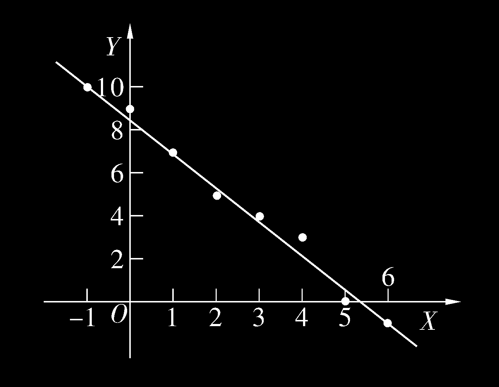

<!-- page: 63 -->

６
５
数值分析

８

８

∑

２
i ＝∑

i ＝１δ

i ＝１（yi －a －bxi）

２
（３畅１）

最小．

显然，（３畅１）右边是关于未知参数a 和b 的函数，所以可设

８

８

∑

２
i ＝∑

i ＝１δ

i ＝１（yi －a －bxi）

２＝φ（a，b）

这样一来，选择a 和b 使偏差的平方和最小的问题就转化成选择a 和b 使二元函

数φ（a，b）最小的问题．而选择a 和b 使二元函数φ（a，b）最小的问题实际上就是

求二元函数φ（a，b）的极小值．根据求多元函数极小值的方法，先对φ（a，b）分别求

关于a 和b 的偏导数，得

抄φ（a，b）

８

＝－２∑

i ＝１（yi －a －bxi）
（３畅２）

抄a

抄φ（a，b）

８

＝－２∑

i ＝１（yi －a －bxi）xi
（３畅３）

抄b

令（３畅２）式和（３畅３）式等于０，整理后得

８

８

８a ＋∑

i ＝１xi b ＝∑

i ＝１yi
（３畅４）

８

８

８

∑

i ＝１xi a ＋∑

２
i b ＝∑

i ＝１xiyi
（３畅５）

i ＝１x

把（３畅４）式和（３畅５）式联立起来，就得到含有两个未知参数a 和b 的有两个方

程的线性代数方程组．它通常称为正规方程组．

把xi 和yi 代入正规方程组得

８a ＋２０b ＝３７

２０a ＋９２b ＝２５
（３畅６）

解方程组（３畅６）得a ＝８畅６４２９，b ＝－１畅６０７１．

于是，拟合函数

y ＝８畅６４２９－１畅６０７１x

通过这个具体的例子，可以把单变量数据拟合法的一般步骤归纳如下：

①按给定数据表画出散点图；

②分析散点图，确定近似函数F（x）的类型，以反映给定数据的一般趋势；

③用最小二乘法确定近似函数F（x）的未知参数，从而得到最小二乘拟合函数

F（x）．

仿照例３－１的求解过程，不难得到如下定理．

定理3畅1　给定y ＝f（x）的数据表（表３－１），若点（xi，yi）（i ＝１，２，…，n）大体

上满足线性函数，即最小二乘拟合函数为

F（x）＝a ＋bx

<!-- page: 64 -->

７
５
３　数据拟合

则待定参数a 和b 是正规方程组

n

n

i ＝１xi b ＝∑

na ＋∑

i ＝１yi

（３畅７）

n

n

n

２
i b ＝∑

∑

i ＝１xi a ＋∑

i ＝１xiyi

i ＝１x

的解。

　　单变量线性拟合法算法

　　①读入数据xi 和yi（i ＝１，２，…，n）．

②计算

n

n

n

n

　　　　s１＝∑

i ＝１xi　　s２＝∑

i ＝１yi　　s３＝∑

２
i 　　s４＝∑

i ＝１x

i ＝１xiyi

③解正规方程组

na ＋s１b ＝s２

s１a ＋s３b ＝s４

　即按下列公式求a 和b：

　　　　a ＝s２s３－s１s４

　　b ＝ns４－s１s２

ns３－s

ns３－s

２
１

２
１

④输出a 和b．

３畅２　多变量数据拟合

在实际问题中，很多问题反映的不是一个量与一个量的关系，而是一个量与若

干个量的关系．具体来说，是一个量由若干个量确定．这就是所谓的多元函数问题．

在数学上，这若干个量通常称为自变量，而由这些自变量确定的量通常称为因变

量．若假设这些自变量为x１，x２，…，xk，因变量为y，则每经过一次实验或测量就会

得到一组数据x１，x２，…，xk，y，而经过n 次实验或测量就会得到n 组数据，由这n

组数据构成的数据表如表３－３所示．

表３－３　多变量拟合数据表

实验或
测量次数
x１
x２
…
xk
y ＝f（x１，x２，…，xk）

１
x１１
x１２
…
x１k
y１
２
x２１
x２２
…
x２k
y２






n
xn１
xn２
…
xnk
yn

<!-- page: 65 -->

８
５
数值分析

　　根据表３－３，希望能找到一个函数来近似表达这些量的关系．要做到这一点，

可以采用多变量数据拟合法．

多变量数据拟合法的一般过程是：先根据表３－３选择变量y 与变量x１，x２，

…，xk 的一个近似函数F（x１，x２，…，xk）以反映y 与变量x１，x２，…，xk 的函数关系，
然后使用最小二乘法确定近似函数F（x１，x２，…，xk ）中的未知参数，从而得到F

（x１，x２，…，xk）．

通常F（x１，x２，…，xk）称为拟合函数，y ＝f（x１，x２，…，xk）称为被拟合函数．

从多变量数据拟合法的一般过程可以看出，若使用这种方法求拟合函数，需根

据表３－３选择一个近似函数F（x１，x２，…，xk）．这是多变量数据拟合的关键．这与

两个变量的情况不同，两个变量的情况可以使用几何描点法画出散点图辅助选择

近似函数．但对多变量的情况，一般来说，作图是困难的，通常是凭经验或根据实际

问题的物理背景和一些专业知识来找．

为了说明多变量数据拟合的一般过程，现在讨论一种特殊情况．假定表３－３

中的数据呈线性关系，这时选择线性函数

F（x１，x２，…，xk）＝a０＋a１x１＋a２x２＋… ＋akxk
（３畅８）

来近似表达y 与变量x１，x２，…，xk 的函数关系，其中a０，a１，…，ak 为待定参数．

按数据拟合的方法，要确定这些参数，需使用最小二乘法．现在使用最小二乘

法来确定待定参数a０，a１，…，ak．

先把xm１，xm２，…，xmk（m ＝１，２，…，n）代入（３畅８）式得

F（xm１，xm２，…，xmk）＝a０＋a１xm１＋a２xm２＋… ＋akxmk
则F（x１，x２，…，xk）与y ＝f（x１，x２，…，xk）在xm１，xm２，…，xmk处的偏差为

δm ＝ym －F（xm１，xm２，…，xmk）

＝ym －a０－a１xm１－a２xm２－… －akxmk
偏差的平方和为

n

n

∑

２
m ＝∑

２
记为

m ＝１δ

m ＝１（ym －a０－a１xm１－a２xm２－… －akxmk）

φ（a０，a１，…，ak）

n

n

根据最小二乘法，要选择近似函数使∑

２
m 最小，而∑

m ＝１δ

m ＝１δ

２
m 是关于a０，a１，…，

ak 的函数，所以可以转化为选择a０，a１，…，ak 使φ（a０，a１，…，ak）最小．实际上就是

求φ（a０，a１，…，ak）的极小值．

根据多元函数求极小值的方法，对φ（a０，a１，…，ak）分别求关于a０，a１，…，ak
的偏导数并令其等于０，得

抄φ

n

＝－２∑

m ＝１（ym －a０－a１xm１－a２xm２－… －a kxmk）＝０

抄a０

抄φ

n

＝－２∑

m ＝１（ym －a０－a１xm１－a２xm２－… －a kxmk）xm１＝０

抄a１

<!-- page: 66 -->

９
５
３　数据拟合

抄φ

n

＝－２∑

m ＝１（ym －a０－a１xm１－a２xm２－… －a kxmk）xm２＝０

抄a２

　

抄φ

n

＝－２∑

m ＝１（ym －a０－a１xm１－a２xm２－… －akxmk）xmk ＝０

抄ak

整理化简后联立起来得方程组（３畅９）：

n

n

n

n

na０
＋a１∑

m ＝１xm１
＋a２∑

m ＝１xm２
＋… ＋ak∑

m ＝１xmk
＝∑

m ＝１ym

n

n

n

n

n

a０∑

m ＝１xm１xm１＋a１∑

m ＝１xm１
＋a２∑

m ＝１xm２xm１＋… ＋ak∑

m ＝１xmkxm１＝∑

m ＝１ym xm１

n

n

n

n

n

a０∑

m ＝１xm２
＋a１∑

m ＝１xm１xm２＋a２∑

m ＝１xm２xm２＋… ＋ak∑

m ＝１xmkxm２＝∑

m ＝１ym xm２

n

n

n

n

n

a０∑

m ＝１xmk
＋a１∑

m ＝１xm１xmk ＋a２∑

m ＝１xm２xmk ＋… ＋ak∑

m ＝１xmkxmk ＝∑

m ＝１ym xmk

方程组（３畅９）是一个含有k ＋１个方程和k ＋１个未知数的线性代数方程组，也称为

正规方程组．解这个方程组就能得到a０，a１，…，ak．

综上所述，得到如下定理．

定理3畅2　给定y ＝f（x１，x２，…，xk）的数据表（表３－３），若数据表中的数据呈

线性关系，这时选取线性函数

F（x１，x２，…，xk）＝a０＋a１x１＋a２x２＋… ＋akxk
作为y 与变量x１，x２，…，xk 的最小二乘拟合函数，则待定参数a０，a１，…，ak 是正规

方程组（３畅９）的解．

可以证明：当n ＞k 时，正规方程组（３畅９）有惟一解．

例3 －2　已知一组测量数据如表３－４所示，求其线性拟合函数．

表３－４　例３－２数据表

测量次数
x１
x２
y ＝f（x１，x２）

１
１
１
７

２
１
２
９

３
２
１
１０

４
２
２
１１

５
２
３
１２

解　据题意，选择线性函数

F（x１，x２）＝a０＋a１x１＋a２x２（a０，a１，a２为待定参数）

<!-- page: 67 -->

０
６
数值分析

拟合给定数据表中的数据．

由定理３畅２得到正规方程组

５

５

５

na０
＋a１∑

m ＝１xm１
＋a２∑

m ＝１xm２
＝∑

m ＝１ym

５

５

５

５

a０∑

m ＝１xm１＋a１∑

m ＝１xm１xm１＋a２∑

m ＝１xm２xm１＝∑

（３畅１０）

m ＝１ym xm１

５

５

５

５

a０∑

m ＝１xm２＋a１∑

m ＝１xm１xm２＋a２∑

m ＝１xm２xm２＝∑

m ＝１ym xm２

５

５

５

５

５

５

而∑

m ＝１xm１＝８，∑

m ＝１xm２＝９，∑

m ＝１xm１xm１＝１４，∑

m ＝１xm１xm２＝∑

m ＝１xm２xm１＝１５，∑

m ＝１xm２

５

５

５

xm２＝１９，∑

m ＝１ym ＝４９，∑

m ＝１ym xm１＝８２，∑

m ＝１ym xm２＝９３，把它们代入正规方程组

（３畅１０）得

５a０＋８a１
＋９a２＝４９

８a０＋１４a１＋１５a２＝８２

９a０＋１５a１＋１９a２＝９３

解方程组得a０＝３畅８，a１＝２畅４，a２＝１畅２．

于是，所求的拟合函数为

y ＝F（x１，x２）＝３畅８＋２畅４x１＋１畅２x２

　　多变量线性拟合法算法

　　①输入数据xmi和ym（m ＝１，２，…，n；i ＝１，２，…，k）．

②计算正规方程组的系数：

n

n

　　　　l００＝n　　l０i ＝li０＝∑

m ＝１xmi （i ＝１，２，…，k）　　g０＝∑

m ＝１ym

n

n

　　　　lij ＝∑

m ＝１xmixmj （i，j ＝１，２，…，k）　　gi ＝∑

m ＝１ymxmi （i ＝１，２，…，k）

③解正规方程组

l００a０＋l０１a１＋… ＋l０kak ＝g０

l１０a０＋l１１a１＋… ＋l１kak ＝g１



lk０a０＋lk１a１＋… ＋lkkak ＝gk

　求出a０，a１，…，ak．

④输出a０，a１，…，ak．

<!-- page: 68 -->

１
６
３　数据拟合

３畅３　非线性数据线性化

本章介绍的例３－１和例３－２都是线性拟合的例子．在这两个例子中，数据与

数据之间的关系呈线性关系．如果数据与数据之间的关系呈线性关系，则可以按这

两个例子所介绍的方法求拟合函数；否则，就不能直接使用这两个例子所介绍的方

法求拟合函数．但是，在这类问题中有一些问题，经过数据与数据之间的变换之后

能得到线性关系，这时就可以直接使用前面介绍过的方法．

例3 －3　某炼钢厂出钢时用的钢包（用来装钢水的容器）是用特殊耐火材料

制成的，在使用过程中，由于钢水及炉渣对包衬耐火材料的侵蚀，使其容量随着使

用次数的增多而增大．为了找出使用次数x 与容量y 之间的函数关系，工程技术人

员做了１５次测试，测试数据如表３－５所示．试用数据拟合法找出使用次数x 与容

量y 之间的函数关系．

表３－５　例３－３数据表

使用次数

容量

使用次数

容量

使用次数

容量

i

i

i

xi

yi

xi

yi

xi

yi

１
２
６畅４２
６
７
１０畅００
１１
１２
１０畅６０

２
３
８畅２０
７
８
９畅９３
１２
１３
１０畅８０

３
４
９畅５８
８
９
９畅９９
１３
１４
１０畅６０

４
５
９畅５０
９
１０
１０畅４９
１４
１５
１０畅９０

５
６
９畅７０
１０
１１
１０畅５９
１５
１６
１０畅７６

解　为了找出使用次数x 和容量y 之

间的函数关系，先画出散点图如图３－２所

示．

按照图３－２中散点的趋势，凭直观可

以画出一条近似曲线，使这些点或者落在

这条曲线上，或者落在曲线的两侧．而这条

近似曲线大致上像一条双曲线，因而可以

把使用次数x 与容量y 之间的关系近似表

示为

图３－２　例３－３数据散点图

１

y ＝a ＋b １

x

这是双曲线方程的一种形式，其中a 和b 为待定参数．

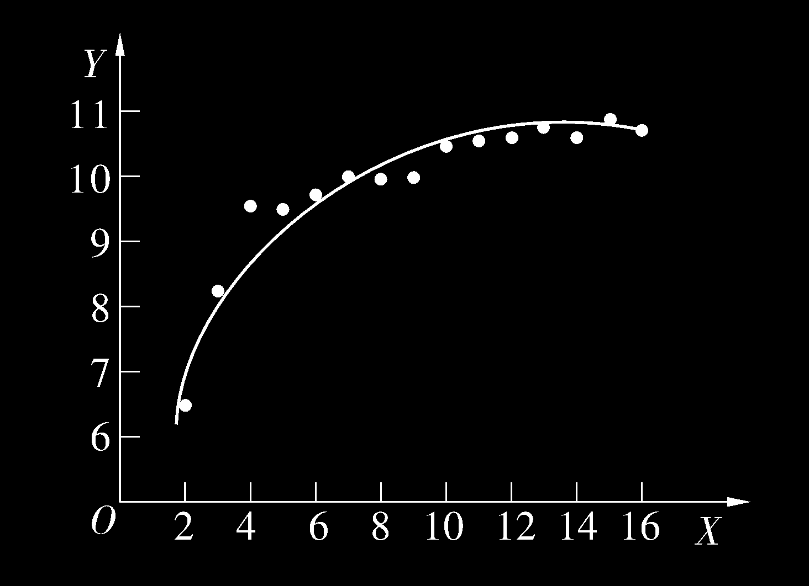

<!-- page: 69 -->

２
６
数值分析

为了确定待定参数a 和b，可以直接采用最小二乘法．但这样得出的方程组为

非线性方程组，而非线性方程组一般是比较难求解的．

令X ＝１

x 和Y ＝１

y ，得到Y ＝a ＋bX．这是一个线性函数，现取它作为拟合函数．

由关系式X ＝１

x 和Y ＝１

y 得到Xi ＝１

xi （i ＝１，２，…，１５）和Yi ＝１

yi （i ＝１，２，…，

１５），从而得到一个新的数据表，如表３－６所示．

表３－６　例３－３新数据表

i
xi
yi
Xi ＝１

xi
Yi ＝１

yi
i
xi
yi
Xi ＝１

xi
Yi ＝１

yi

１
２
６畅４２
０畅５０００
０畅１５５８
９
１０１０畅４９
０畅１０００
０畅０９５３

２
３
８畅２０
０畅３３３３
０畅１２２０
１０
１１１０畅５９
０畅０９０９
０畅０９４４

３
４
９畅５８
０畅２５００
０畅１０４４
１１
１２１０畅６０
０畅０８３３
０畅０９４３

４
５
９畅５０
０畅２０００
０畅１０５３
１２
１３１０畅８０
０畅０７６９
０畅０９２６

５
６
９畅７０
０畅１６６７
０畅１０３１
１３
１４１０畅６０
０畅０７１４
０畅０９４３

６
７
１０畅００
０畅１４２９
０畅１０００
１４
１５１０畅９０
０畅０６６７
０畅０９１７

７
８
９畅９３
０畅１２５０
０畅１００７
１５
１６１０畅７６
０畅０６２５
０畅０９２９

８
９
９畅９９
０畅１１１１
０畅１００１

有了新数据表和选定的拟合函数，就可以按最小二乘法确定待定参数a 和b．

由定理３畅１得到正规方程组

１５

１５

i ＝１Xi b ＝∑

１５a ＋∑

i ＝１Yi

（３畅１１）

１５

１５

１５

２
i b ＝∑

∑

i ＝１Xi a ＋∑

i ＝１XiYi

i ＝１X

１５

１５

１５

１５

而∑

i ＝１Xi≈２畅３８０７，∑

i ＝１Yi≈１畅５４６９，∑

２
i ≈０畅５８４２，∑

i ＝１XiYi ≈０畅２７２７．把它

i ＝１X

们代入正规方程组（３畅１１）得

１５a ＋２畅３８０７b ＝１畅５４６９

２畅３８０７a ＋０畅５８４２b ＝０畅２７２７

解方程组得a≈０畅０８２４，b≈０畅１３１８．故

Y ＝０畅０８２４＋０畅１３１８X

即有
１

y ＝０畅０８２４＋０畅１３１８１

x

<!-- page: 70 -->

３
６
３　数据拟合

于是，拟合函数

y ＝
x
０畅０８２４x ＋０畅１３１８
例3 －4　已知一组数据如表３－７所示，求一个经验函数，形如y ＝aｅ

bx （a，b

为常数），使它与表３－７中的数据相拟合．

表３－７　例３－４数据表

x
０
１
２
３
４

y ＝f（x）
１畅５
２畅５
３畅５
５
７畅５

bx．所以，表３－７的
拟合函数为y ＝aｅ

解　据题意，表３－７中的数据大体上满足函数关系y ＝aｅ

bx 转换为线

bx．为了便于确定a 和b，可以通过变量变换把y ＝aｅ

性函数，然后用最小二乘法来确定a 和b．

先对y ＝aｅ

bx两边取自然对数得

ｌｎy ＝ｌｎa ＋bx

令Y ＝ｌｎy，A ＝ｌｎa，B ＝b 和X ＝x，则有

Y ＝A ＋BX

这是一个线性函数，取它作为拟合函数．

由Y ＝ｌｎy 和X ＝x 得到Yi ＝ｌｎyi 和Xi ＝xi，从而得到新的数据表，如表３－８所

示．

表３－８　例３－４新数据表

i
xi
yi
Xi
Yi ＝ｌｎyi

１
０
１畅５
０
０畅４０５４６５

２
１
２畅５
１
０畅９１６２９１

３
２
３畅５
２
１畅２５２７６３

４
３
５畅０
３
１畅６０９４３８

５
４
７畅５
４
２畅０１４９０３

有了拟合函数，又有了新的数据表，就可以使用最小二乘法确定a 和b．由定

理３畅１得到正规方程组

５

５

i ＝１Xi B ＝∑

５A ＋∑

i ＝１Yi

（３畅１２）

５

５

５

２
i B ＝∑

∑

i ＝１Xi A ＋∑

i ＝１XiYi

i ＝１X

５

５

５

５

而∑

i ＝１Xi ＝１０，∑

i ＝１Yi ≈６畅１９８８６，∑

２
i ＝３０，∑

i ＝１XiYi ≈１６畅３０９７４３，把它们代入

i ＝１X

<!-- page: 71 -->

４
６
数值分析

正规方程组（３畅１２）得

５A ＋１０B ＝６畅１９８８６

１０A ＋３０B ＝１６畅３０９７４３

解上述方程组得A≈０畅４５７３６７，B≈０畅３９１２０２３．又由A ＝ｌｎa 得a≈１畅５７９９１０，b

＝B≈０畅３９１２０２３．

于是，所求的拟合函数为

y ＝１畅５７９９１０ｅ

０畅３９１２０２３x

在实践中，有时要进行多项式拟合．多项式拟合也可以采用非线性数据线性化

的方法．

设有两个量z 和y 基本满足m 次多项式函数，经过实验或测量得到数据表（表

３－９），从而可以把

y ＝a０＋a１z ＋a２z

２＋… ＋am z

m
（３畅１３）

作为给定数据的拟合函数，其中a０，a１，…，am 为待定参数．

表３－９　多项式拟合数据表

z
z１
z２
…
zn

y ＝f（z）
y１
y２
…
yn

m ，则由（３畅１３）式有

令x１＝z，x２＝z

２，…，xm ＝z

记为

y ＝a０＋a１x１＋a２x２＋… ＋am xm

F（x１，x２，…，xm ）

使它变成多变量线性拟合．

在数据拟合法中，当选定拟合函数后，非线性拟合函数能否线性化是首先要考

虑的问题．为了方便读者对非线性拟合函数进行线性化，表３－１０中给出了常用非

线性拟合函数线性化的方法．

表３－１０　常用非线性拟合函数线性化的方法

非线性拟合函数的形式
对非线性拟合函数线性化

为Y ＝A ＋BX
需做的变换

y ＝a ＋bｌｎx
y ＝a ＋bｌｎx
X ＝ｌｎx，Y ＝y

A ＝a，B ＝b

bx
ｌｎy ＝ｌｎa ＋bx
X ＝x，Y ＝ｌｎy

y ＝aｅ

A ＝ｌｎa，B ＝b

X ＝１

x ，Y ＝y

x
y ＝a ＋b １

y ＝a ＋b

x

A ＝a，B ＝b

<!-- page: 72 -->

５
６
３　数据拟合

续上表

非线性拟合函数的形式
对非线性拟合函数线性化

为Y ＝A ＋BX
需做的变换

X ＝１

x ，Y ＝１

１

y ＝b ＋a １

y ＝x

y

a ＋bx

x

A ＝b，B ＝a

－１

２＝a ＋bx
X ＝x，Y ＝y

２

－１

y ＝（a ＋bx）

－２
y

A ＝a，B ＝b

x ＝ｌｎa －bx
X ＝x，Y ＝ｌｎy

－bx
ｌｎy

y ＝axｅ

x

A ＝ｌｎa，B ＝－b

bx
ｌｎ
１
y －１＝ｌｎa ＋bx
X ＝x，Y ＝ｌｎ
１

y －１

y ＝
１
１＋aｅ

A ＝ｌｎa，B ＝b

３畅４　正交多项式拟合

多项式拟合的做法是：先把多项式拟合函数变成多变量拟合函数，然后按照多

变量拟合法求出多项式的系数a０，a１，…，am ．在多变量拟合法中，要解一个正规方

程组．理论上可以证明该正规方程组有惟一解，但当多项式的次数比较高时，正规

方程组就会变成病态方程组．所谓病态方程组，就是如果方程组Ax ＝b 中的系数

矩阵A 和常数项b 有微小变化，就会引起方程组的解很大变化，则方程组Ax ＝b

就是一个病态方程组．为了克服这个缺点，把多项式拟合函数取为

倡＝Ψm （x）＝a０p０（x）＋a１p１（x）＋… ＋a m pm （x）
（３畅１４）

y

m

＝∑

k ＝０akpk（x）

其中a０，a１，…，am 为待定参数，pk（x）（k ＝０，１，…，m）是k 次多项式．

很显然，y

倡＝Ψm （x）是一个m 次多项式函数．

把xi 代入（３畅１４）式得到yi 的近似值y

倡
i ，则y

倡
i
与yi 就可能产生偏差．记y

倡
i

与yi 的偏差为δi，有

m

倡
i
＝yi －∑

δi ＝yi －y

k ＝０akpk（xi）　（i ＝１，２，…，n）

为了求得a０，a１，…，am ，按最小二乘法选择a０，a１，…，am 使误差δi 的平方和最

n

小，即选择a０，a１，…，am，使∑

i ＝１δ

２
i 最小．由于从实验或测量中得到的数据的精度

<!-- page: 73 -->

６
６
数值分析

不同，通常在每一个δi 的前面乘上一个表示数据精度的权数αi．即要使

n

n

n

∑

２＝∑

２
i ＝∑

i ＝１（αiδi）

i ＝１α

２
i δ

i ＝１ωiδ

２
i

最小．其中ωi ＝α

２
i 称为权因子．而

n

n

m

∑

２
i ＝∑

i ＝１ωi
yi －∑

２
记为

i ＝１ωiδ

k ＝０akpk（xi）

φ（a０，a１，…，am ）

n

因此，可以把选择a０，a１，…，am 使∑

i ＝１ωiδ

２
i 最小的问题转化为求函数φ（a０，

a１，…，am ）极小值的问题．按多元函数求极小值的方法，对函数φ（a０，a１，…，am ）分

别求关于a０，a１，…，am 的导数，令其为０并联立起来得到方程组

　抄φ

n

m

＝－２∑

i ＝１ωi
yi －∑

k ＝０akpk（xi）pj（xi）＝０　（j ＝０，１，…，m）
（３畅１５）

抄aj

将方程组（３畅１５）整理后得

i ＝１ωi ∑

n

m

n

∑

k ＝０akpk（xi）pj（xi）
－∑

i ＝１ωi yipj（xi）＝０

即

m

n

n

k ＝０ak ∑

∑

i ＝１ωipk（xi）pj（xi）
＝∑

i ＝１ωi yipj（xi）
（３畅１６）

n

n

令cjk ＝∑

i ＝１ωipk（xi）pj（xi），bj ＝∑

i ＝１ωi yipj（xi），则方程组（３畅１６）可以写成

m

∑

k ＝０cjkak ＝bj
（３畅１７）

方程组（３畅１７）也称为正规方程组．

显然，如果能找到pk（x）满足下列关系式：

n

cjk ＝∑

i ＝１ωipj（xi）pk（xi）＝０　（j≠k）
（３畅１８）

n

cjj ＝∑

i ＝１ωipj（xi）

２＞０　（j，k ＝０，１，…，m）
（３畅１９）

则正规方程组（３畅１７）变为

ckkak ＝bk
（３畅２０）

由（３畅２０）式可以求出

ak ＝bk

ckk
（３畅２１）

定义3畅3　满足（３畅１８）式和（３畅１９）式的多项式pk （x）（k ＝０，１，…，m）通常称

为正交多项式簇，确切地说，称为对数据xi 和对应的权数ωi 的正交多项式簇．

<!-- page: 74 -->

７
６
３　数据拟合

　　常用的正交多项式簇有一些，在这里只介绍一个常用的等距节点正交多项式

簇．

假设给定一组n ＋１个等距节点ξ
i（i ＝０，１，…，n），它们的间隔为h，选取权数

ωi ＝１，引入变换

x ＝ξ－ξ
０
h

则ξ
i 变为xi ＝i 等n ＋１个整数等距节点．

构造多项式

m ＋k

k m

m

（k）

x

pm，n（x）＝∑

k ＝０（－１）

　k

（k）

n

k

（k）＝x（x －１）…（x －k ＋１）且x

（０）＝１．可以证明，pm，n（x）是在xi ＝i 等n ＋１个

其中x

整数等距节点上权数ωi ＝１的正交多项式簇，其前６个多项式为

p０，n（x）＝１

p１，n（x）＝１－２x

n

n ＋６x（x －１）

p２，n ＝１－６x

n（n －１）

n ＋３０x（x －１）

n（n －１）－２０x（x －１）（x －２）

p３，n ＝１－１２x

n（n －１）（n －２）

n ＋９０x（x －１）

n（n －１）－１４０x（x －１）（x －２）

n（n －１）（n －２）＋７０x（x －１）（x －２）（x －３）

p４，n ＝１－２０x

n（n －１）（n －２）（n －３）

n ＋２１０x（x －１）

n（n －１）－５６０x（x －１）（x －２）

n（n －１（n －２）＋６３０x（x －１）（x －２）（x －３）

p５，n ＝１－３０x

n（n －１）（n －２）（n －３）＋

２５２x（x －１）（x －２）（x －３）（x －４）

n（n －１）（n －２）（n －３）（n －４）

练习与思考

１畅求方程组

x１＋２x２＝１

x１
＋x２＝０

x１
－x２＝１

的最小二乘解．

２畅给定数据表如表３－１１所示，求形如y ＝a ＋bx

２的拟合函数．

<!-- page: 75 -->

８
６
数值分析

表３－１１　数据表

x
１９
２５
３１
３８
４４

y
１９
３２畅３
４９
７３畅３
９７畅８

３畅用最小二乘法求一个形如y ＝１

a ＋bx的经验公式，使之与如下数据（表３－

１２）相拟合．

表３－１２　数据表

x
１
１畅４
１畅８
２畅２
２畅６

y
０畅９３１
０畅４７３
０畅２９７
０畅２２４
０畅１６８

４畅在某个低温过程中，函数y 依赖于温度θ（℃）的测试数据如表３－１３所示，

而且已知经验公式是y ＝aθ ＋bθ

２，试用最小二乘法确定a 和b．

表３－１３　数据表

θ
１
２
３
４

y
０畅８
１畅５
１畅８
２

５畅给定数据表如表３－１４所示，试用三次多项式拟合表中的数据．

表３－１４　数据表

x
－２
－１
０
１
２

y
－０畅１
０畅１
０畅４
０畅９
１畅６

６畅在某一化学反应里，据实验得到分解生成物的浓度与时间的数据如表

３－１５所示，试使用正交多项式拟合法构造一个５次多项式求y 的近似值．

表３－１５　数据表

时间t（ｍｉｎ）
０
５
１０
１５
２０
２５
３０
３５
４０
４５
５０

－４）
０
１畅２７
２畅１６
２畅８６
３畅４４
３畅８７
４畅１５
４畅３７
４畅５１
４畅６０
４畅６６

浓度y（×１０

<!-- page: 76 -->

４　数值积分

在微积分中，计算连续函数f（x）在区间［a，b］上的积分通常采用求原函数的

方法．也就是说，利用积分的基本公式

∫

b

a f（x）ｄx ＝F（b）－F（a）
（４畅１）

计算定积分的值．这里的F（x）为被积函数f（x）的原函数．但有时f（x）的原函数无

法用初等函数来表示．例如，积分∫

x ｄx 和∫

－x２ｄx 中的被积函数ｓｉｎx

ｓｉｎx

１

１

－x２的

０ｅ

x 和ｅ

０

原函数就不能用初等函数表示出来．

在实际中，有些函数是用函数表来表示的，对这种被积函数的积分也不能通过

求原函数的方法求得．

另外，计算机只能进行四则运算和逻辑运算，不能进行求原函数的运算，所以

在计算机上也无法实现这种方法．

这说明用求原函数的方法求定积分的值有很大的局限性，有必要学习求定积

分的近似方法．下面介绍一些求定积分的近似方法．

４畅１　梯形求积公式、Ｓｉｍｐｓｏｎ求积公式和Ｎｅｗｔｏｎ－

Ｃｏｔｅｓ求积公式

　　根据代数插值法，对于任一被积函数f （x），都可以构造一个插值多项式

p（x）近似代替它，即有

f（x）≈p（x）
（４畅２）

对（４畅２）式两边求积分得

∫

af（x）ｄx ≈∫

b

b

ap（x）ｄx

而p（x）是一个代数多项式，它的定积分容易计算．

可以根据这种想法构造出几个近似求积公式．

４畅１畅１　梯形求积公式

由代数插值法知道，可以以a 和b 作为插值节点构造一个插值多项式

p１（x）＝x －b

a －bf（a）＋x －a

b －af（b）

<!-- page: 77 -->

０
７
数值分析

近似代替f（x），即有

f（x）≈p１（x）
（４畅３）

对（４畅３）式两边求积分得

　　　　　　　　∫

af（x）ｄx ≈∫

b

b

ap１（x）ｄx

＝∫

x －b
a －bf（a）＋x －a

b

b －af（b）ｄx

a

＝b －a

２
［f（a）＋f（b）］
（４畅４）

（４畅４）式是一个计算定积分的近似公

式，又称为梯形求积公式．它的几何意义如

图４－１所示．

从图４－１可以看到，梯形求积公式的

几何意义是用梯形区域的面积来代替曲边

梯形区域的面积．

４畅１畅２　Ｓｉｍｐｓｏｎ求积公式

图４－１　梯形求积公式的几何意义

把积分区间［a，b］二等分，得到三个分

点a，a ＋b

２
和b．根据代数插值法，可以以这三个分点作为插值节点，构造一个插值

多项式

x －a ＋b

２
（x －b）

f a ＋b

f（a）＋
（x －a）（x －b）
a ＋b

　p２（x）＝

２
＋

a －a ＋b

２
－a
a ＋b

２
－b

２
（a －b）

（x －a）x －a ＋b

２

f（b）

（b －a）b －a ＋b

２

近似代替f（x），即有

f（x）≈p２（x）
（４畅５）

对（４畅５）式两边求积分得

　　∫

af（x）ｄx ≈∫

b

b

ap２（x）ｄx

x －a ＋b

２
（x －b）

＝∫

f（a）＋
（x －a）（x －b）
a ＋b

f a ＋b

b

a －a ＋b

２
－a
a ＋b

２

２
（a －b）

２
－b

a

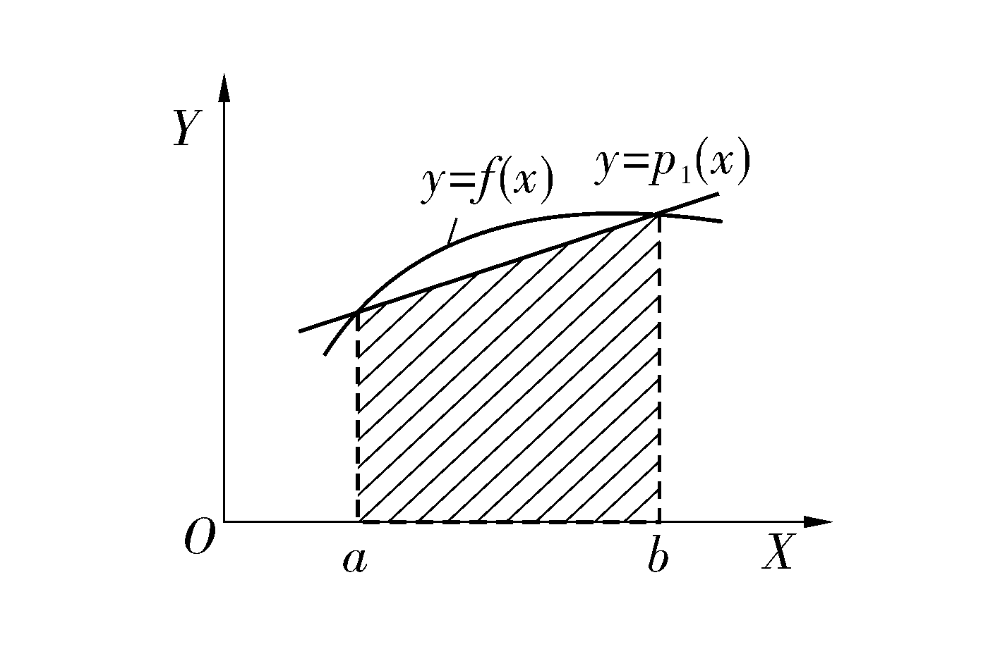

<!-- page: 78 -->

１
７
４　数值积分

（x －a）x －a ＋b

２

　＋

f（b）ｄx

（b －a）b －a ＋b

２

＝b －a

６
f（a）＋４f a ＋b

２
＋f（b）
（４畅６）

（４畅６）式也是一个计算定积分的近似公

式，又称为Ｓｉｍｐｓｏｎ或抛物线求积公式．它的

几何意义如图４－２所示．

４畅１畅３　Ｎｅｗｔｏｎ－Ｃｏｔｅｓ求积公式

把积分区间［a，b］n 等分，得到n ＋１个

分点，其分点记为xi ＝a ＋ih（i ＝０，１，…，n），

其中h ＝b －a

n
．由代数插值法知道，可以以这

图４－２　Ｓｉｍｐｓｏｎ求积公式的几何意义

n ＋１个分点作为插值节点，构造一个插值多

项式

ω（x）
（x －xi）ω′（xi）f（xi）

n

pn（x）＝∑

i ＝０

近似代替f（x），其中ω（x）＝（x －x０）（x －x１）…（x －xn）．即有

f（x）≈pn（x）
（４畅７）

对（４畅７）式两边求积分得

∫

af（x）ｄx ≈∫

apn（x）ｄx ＝∫

ω（x）
（x －xi）ω′（xi）f（xi）ｄx

b

b

b

a

i ＝０∫

ω（x）
（x －xi）ω′（xi）ｄxf（xi）

n

b

＝∑

a

n

＝∑

i ＝０Aif（xi）
（４畅８）

其中Ai ＝∫

ω（x）
（x －xi）ω′（xi）ｄx．

b

a

现在的问题是如何求Ai．为了求Ai，作变换x ＝a ＋th，从而得

ω（x）＝ω（a ＋th）＝（a ＋th －x０）（a ＋th －x１）…（a ＋th －xn）

＝h

n ＋１t（t －１）…（t －n）

x －xi ＝a ＋th －（a ＋ih）＝（t －i）h

ω′（xi）＝（xi －x０）（xi －x１）…（xi －xi －１）（xi －xi ＋１）…（xi －xn）

＝ih（i －１）h…h（－h）（－２h）…［－（n －i）］h

＝（－１）

ni！（n －i）！

n －ih

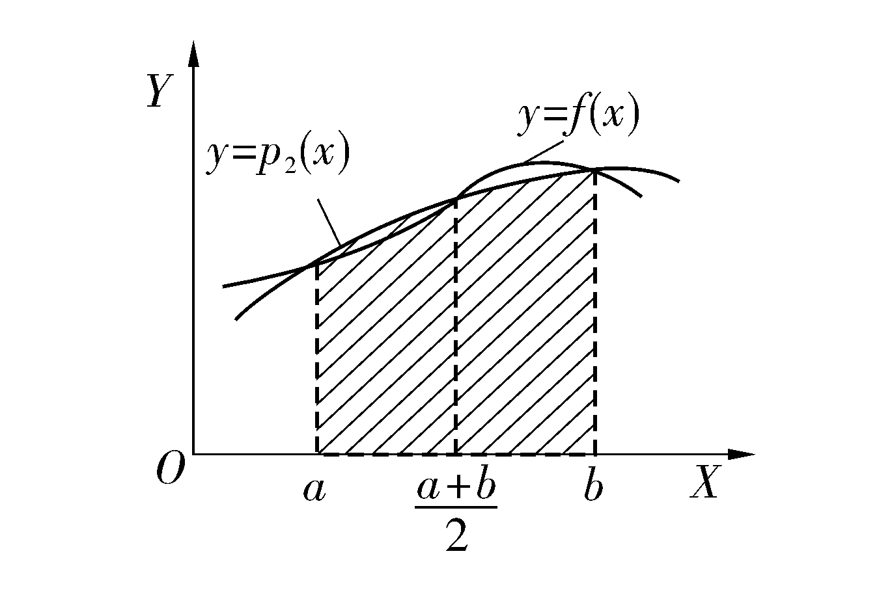

<!-- page: 79 -->

２
７
数值分析

于是　　　Ai ＝∫

ω（x）
（x －xi）ω′（xi）ｄx

b

a

n －i（b －a）
n· i！（n －i）∫

x ＝a ＋th（－１）

t（t －１）…（t －n）

n

t －i
ｄt

０

n· i！（n －i）∫

（n）
i
＝
（－１）

t（t －１）…（t －n）

n －i

n

t －i
ｄt

若记
c

０

则有Ai ＝（b －a）c

（n）
i
，从而

∫

af（x）ｄx ≈∫

n

apn（x）ｄx ＝∑

b

b

i ＝０（b －a）c

（n）
i
f（xi）
（４畅９）

（４畅９）式称为Ｎｅｗｔｏｎ－Ｃｏｔｅｓ（牛顿－柯特斯）公式，c

（n）
i
称为Ｎｅｗｔｏｎ－Ｃｏｔｅｓ系

数．

可以看出，c

（n）
i
仅依赖于n 和i，也就是说仅依赖于n 和xi，而不依赖于被积函

数f（x）和积分区间［a，b］．而n 和i 都是整数，从而c

（n）
i
是一个常数，这个常数可以

预先计算出来构成Ｎｅｗｔｏｎ－Ｃｏｔｅｓ系数表．在计算时，可以查Ｎｅｗｔｏｎ－Ｃｏｔｅｓ系数表

得到Ｎｅｗｔｏｎ－Ｃｏｔｅｓ系数c

（n）
i
，而不用求积分．

n 从１到６取值的Ｎｅｗｔｏｎ－Ｃｏｔｅｓ系数见表４－１．

表４－１　n 从１到６的Ｎｅｗｔｏｎ－Ｃｏｔｅｓ系数表

（n）
０
c

（n）
１
c

（n）
２
c

（n）
３
c

（n）
４
c

（n）
５
c

（n）
６

n
c

１
１
２

１
２

２
１
６

４
６

１
６

３
１
８

３
８

３
８

１
８

４
７
９０

１６
４５

２
１５

１６
４５

７
９０

５
１９
２８８

２５
９６

２５
１４４

２５
１４４

２５
９６

１９
２８８

６
４１
８４０

９
３５

９
２８０

３４
１０５

９
２８０

９
３５

４１
８４０

例4 －1　用梯形求积公式、Ｓｉｍｐｓｏｎ求积公式和Ｎｅｗｔｏｎ－Ｃｏｔｅｓ求积公式（取n

＝４）计算定积分∫

１

０．５
xｄx．

解　①用梯形求积公式：

∫

０．５
xｄx ≈０．５

１

２（
０．５＋１）≈０．４２６８

　　　　②用Ｓｉｍｐｓｏｎ求积公式：

<!-- page: 80 -->

３
７
４　数值积分

∫

０．５
xｄx ≈０．５

１

６（
０．５＋４
０．７５＋１）≈０．４３０９

　　　　③用Ｎｅｗｔｏｎ－Ｃｏｔｅｓ求积公式：

　　∫

n

a f（x）ｄx ≈（b －a）∑

b

（n）
i
f（xi）

i ＝０c

　　∫

４

１

０．５
xｄx ≈０．５∑

（４）
i
xi

i ＝０c

＝０．５
７
９０
０．５＋１６

４５
０．６２５＋２

１５
０．７５＋

１６
４５
０．８７５＋７

９０
１
≈０畅４３１０

４畅２　求积公式的代数精确度

定义4畅1　对一般求积近似公式，如果当f（x）为任意一个次数不高于n 次的

代数多项式时，积分近似公式

∫

m

a f（x）ｄx ≈∑

b

k ＝０Akf（xk）
（４畅１０）

精确成立，而当f（x）为n ＋１次代数多项式时不精确成立，则称该积分近似公式具

有n 次代数精确度．

从代数精确度的定义可知，求积近似公式的精确度越高，就会有越多的f（x）

使求积近似公式精确成立．

由于任何一个求积近似公式都可以写成（４畅１０）式的形式，从而可以使用代数

精确度的定义来证明求积公式具有多少次代数精确度．

定理4畅1　梯形求积公式具有一次代数精确度．

证明　①证明当f（x）为任意一个不超过一次代数多项式时，梯形求积公式精

确成立．

在推导梯形求积公式时，以a 和b 作为插值节点构造出p１（x），用p１（x）近似

代替f（x），即有

f（x）≈p１（x）

根据插值的误差估计式有

f（x）－p１（x）＝f″（ξ）

２！（x －a）（x －b）
（４畅１１）

对（４畅１１）式从a 到b 求积分得

∫

a f（x）ｄx －∫

a p１（x）ｄx ＝∫

f″（ξ）

b

b

b

２！（x －a）（x －b）ｄx

a

<!-- page: 81 -->

４
７
数值分析

即

　∫

［f（a）＋f（b）］＝∫

a f（x）ｄx －b －a

f″（ξ）

b

b

２！（x －a）（x －b）ｄx
（４畅１２）

２

a

显然，当f（x）为不超过一次代数多项式时，f″（ξ）＝０．所以

∫

a f（x）ｄx ＝b －a

b

２
［f（a）＋f（b）］

也就是说，当f（x）为不超过一次代数多项式时，梯形求积公式精确成立．

②证明当f（x）为二次代数多项式时，梯形求积公式不精确成立．

因为当f（x）＝x

２时，有

∫

a f（x）ｄx ＝∫

３－a

３

２ｄx ＝b

b

b

a x

３

b －a

２
［f（a）＋f（b）］＝b －a

２
（a

２＋b

２）

所以当f（x）＝x

２时，

∫

a f（x）ｄx ≠b －a

b

２
［f（a）＋f（b）］

由此推出，当f（x）为二次代数多项式时

∫

a f（x）ｄx ≠b －a

b

２
［f（a）＋f（b）］

　　因此，梯形求积公式具有一次代数精确度．

从定理４畅１可知，当被积函数为不超过一次代数多项式时，用梯形求积公式求

积分是没有误差的．

定理4畅2　Ｎｅｗｔｏｎ－Ｃｏｔｅｓ求积公式至少具有n 次代数精确度．当n 为偶数时，

代数精确度至少为n ＋１次．

证明　①证明Ｎｅｗｔｏｎ－Ｃｏｔｅｓ求积公式至少具有n 次代数精确度．

在推导Ｎｅｗｔｏｎ－Ｃｏｔｅｓ求积公式时，以x０，x１，…，xn 为插值节点构造插值多项

式pn（x），用pn（x）代替f（x），即f（x）≈pn（x）．根据插值的误差估计式有

（n ＋１）（ξ）

f（x）－pn（x）＝f

ω（x）
（４畅１３）

（n ＋１）！

其中ω（x）＝（x －x０）（x －x１）…（x －xn）．对（４畅１３）式两边从a 到b 求积分得

∫

a f（x）ｄx －∫

a pn（x）ｄx ＝∫

（n ＋１）（ξ）

f

b

b

b

ω（x）ｄx

（n ＋１）！

a

由（４畅９）式得

∫

（n）
i
f（xi）＝∫

（n ＋１）（ξ）

f

n

a f（x）ｄx －∑

b

b

i ＝０（b －a）c

ω（x）ｄx
（４畅１４）

（n ＋１）！

a

显然，当f（x）为任意不超过n 次代数多项式时，f

（n ＋１）（ξ）＝０．所以

<!-- page: 82 -->

５
７
４　数值积分

∫

n

a f（x）ｄx ＝∑

b

i ＝０（b －a）c

（n）
i
f（xi）

这说明，Ｎｅｗｔｏｎ－Ｃｏｔｅｓ求积公式至少具有n 次代数精确度．

②证明当n 为偶数时，Ｎｅｗｔｏｎ－Ｃｏｔｅｓ求积公式的代数精确度至少为n ＋１次．

n ＋１

设f（x）为n ＋１次代数多项式，则可令f（x）＝∑

k，其中n 为偶数，从而有

k ＝０bkx

n ＋bn ＋１x

（n ＋１）（x）＝（b０＋b１x ＋… ＋bnx

n ＋１）

（n ＋１）＝bn ＋１（n ＋１）！

f

（n ＋１）（ξ）＝bn ＋１（n ＋１）！

故
f

再据（４畅１４）式有

∫

（n）
i
f（xi）＝∫

（n ＋１）（ξ）

f

n

a f（x）ｄx －∑

b

b

i ＝０（b －a）c

ω（x）ｄx

（n ＋１）！

a

＝bn ＋１∫

b

a ω（x）ｄx

＝bn ＋１∫

b

a （x －x０）（x －x１）…（x －xn）ｄx

n ＋２∫

x ＝a ＋th bn ＋１h

n

０t（t －１）（t －２）…（t －n）ｄt

因为n 为偶数，可令n ＝２k，k ＝１，２，…．此时，

∫

n

０t（t －１）（t －２）…（t －n）ｄt

＝∫

２k

０t（t －１）…（t －k）［t －（k ＋１）］…［t －（２k －１）］（t －２k）ｄt

u ＝t －k ∫

k

－k（u ＋k）（u ＋k －１）…u（u －１）…（u －k ＋１）（u －k）ｄu

令H（u）＝（u ＋k）（u ＋k －１）…u（u －１）…（u －k ＋１）（u －k），则有H（－u）＝－H

（u），即H（u）为奇函数．于是

∫

n

０t（t －１）（t －２）…（t －n）ｄt ＝０

所以，当f（x）为n ＋１次代数多项式，且n 为偶数时，有

∫

n

a f（x）ｄx ＝∑

b

i ＝０（b －a）c

（n）
i
f（xi）

　　这说明，当n 为偶数时，Ｎｅｗｔｏｎ－Ｃｏｔｅｓ求积公式的代数精确度至少为n ＋１

次．

从定理４畅２可知，当被积函数为不超过n 次代数多项式时，用Ｎｅｗｔｏｎ－Ｃｏｔｅｓ

求积公式求积分是没有误差的．

定理4畅3　Ｓｉｍｐｓｏｎ求积公式的代数精确度为３．

证明　由定理４畅２知，Ｓｉｍｐｓｏｎ求积公式的代数精确度至少为３次．

<!-- page: 83 -->

６
７
数值分析

现取f（x）＝x

４，则由（４畅１）式有

∫

a f（x）ｄx ＝∫

５－a

５

４ｄx ＝b

b

b

a x

５

而
b －a

２
＋f（b）
＝b －a

６
f（a）＋４f a ＋b

４＋４a ＋b

４

＋b

４

６
a

２

从而
∫

a f（x）ｄx ≠b －a

６
f（a）＋４f a ＋b

b

２
＋f（b）

　　由此推知，当f（x）为４次代数多项式时

∫

a f（x）ｄx ≠b －a

６
f（a）＋４f a ＋b

b

２
＋f（b）

　　这说明，当f（x）为４次代数多项式时，Ｓｉｍｐｓｏｎ求积公式不能精确成立．因此，

Ｓｉｍｐｓｏｎ求积公式的代数精确度为３．

从定理４畅３可知，当被积函数为不超过３次代数多项式时，用Ｓｉｍｐｓｏｎ求积公

式求积分是没有误差的．

４畅３　梯形求积公式和Ｓｉｍｐｓｏｎ求积公式的误差估计

定理4畅4　若f（x）∈C

２［a，b］，则梯形求积公式有误差估计
∫

a f（x）ｄx －b －a

２
［f（a）＋f（b）］＝－（b －a）

３

b

１２
f″（η）
（４畅１５）

其中a≤η≤b．

证明　据（４畅１２）式

∫

２
［f（a）＋f（b）］＝∫

f″（ξ）

a f（x）ｄx －b －a

b

b

（x －a）（x －b）ｄx

２

a

　　因为ξ依赖于x，所以f″（ξ）是x 的函数．根据题意f″（ξ）在［a，b］上连续，而

（x －a）（x －b）在［a，b］上小于０，从而由积分中值定理可知在［a，b］上存在一点

η，使

∫

（x －a）（x －b）ｄx ＝f″（η）∫

f″（ξ）

b

b

a （x －a）（x －b）ｄx

２

a

＝－（b －a）

３

１２
f″（η）

于是，得到梯形求积公式的误差估计为

∫

a f（x）ｄx －b －a

２
［f（a）＋f（b）］＝－（b －a）

３

b

１２
f″（η）

其中a≤η≤b．

<!-- page: 84 -->

７
７
４　数值积分

定理4畅5　若f（x）∈C

４［a，b］，则Ｓｉｍｐｓｏｎ求积公式有误差估计

　∫

６
f（a）＋４f a ＋b

a f（x）ｄx －b －a

２
＋f（b）
＝－（b －a）

５

b

（４）（η）
（４畅１６）

２８８０f

其中a≤η≤b．

证明　首先考虑构造一个三次插值多项式p３（x）满足条件：p３（a）＝f（a），

p３（b）＝f（b），p３a ＋b

２
＝f a ＋b

２
和p′
３a ＋b

２
＝f′a ＋b

２
．可以证明，满足上

述条件的p３（x）与f（x）的误差为

（４）（ξ）

f（x）－p３（x）＝f

（x －a）x －a ＋b

２

（x －b）
　（４畅１７）

２

４！

其中a≤ξ≤b．

对（４畅１７）式两边求积分得

∫

a f（x）ｄx －∫

４！∫

a p３（x）ｄx ＝１

（４）（ξ）（x －a）x －a ＋b

２

b

b

b

（x －b）ｄx

a f

２

又因p３（x）为三次代数多项式，而Ｓｉｍｐｓｏｎ求积公式的代数精确度为３，所以有

∫

a p３（x）ｄx ＝b －a

６
p３（a）＋４p３a ＋b

b

２
＋p３（b）

＝b －a

６
f（a）＋４f a ＋b

２
＋f（b）

从而有

∫

６
f（a）＋４f a ＋b

a f（x）ｄx －b －a

b

２
＋f（b）

４！∫

（４）（ξ）（x －a）x －a ＋b

　　＝１

２

b

（x －b）ｄx

a f

２

（４）（ξ）在［a，b］上连续，而（x －a）x －a ＋b

２

据题设，f

（x －b）≤０，由积分中值

２

定理可知，在［a，b］中存在一点η，使

∫

（４）（ξ）（x －a）x －a ＋b

２

b

（x －b）ｄx

a f

２

（４）（η）∫

a （x －a）x －a ＋b

２

b

　　＝f

（x －b）ｄx

２

　　＝－（b －a）

５

（４）（η）

１２０
f

因此

∫

a f（x）ｄx －b －a

６
f（a）＋４f a ＋b

b

２
＋f（b）

<!-- page: 85 -->

８
７
数值分析

４！
－（b －a）

　　＝１

５

（４）（η）

１２０
f

　　＝－（b －a）

５

（４）（η）

２８８０f

４畅４　复化求积公式

在４畅１节中介绍了梯形求积公式、Ｓｉｍｐｓｏｎ求积公式和Ｎｅｗｔｏｎ－Ｃｏｔｅｓ求积公

式．从梯形求积公式和Ｓｉｍｐｓｏｎ求积公式的几何意义来看，使用它们求积分会产生

较大的误差，而使用Ｎｅｗｔｏｎ－Ｃｏｔｅｓ公式似乎当n 越大，计算出来的结果与积分准

确值的误差就会越小．但事实并非如此，可以证明，当n→∞时，并非对所有的

f（x），都有

∫

n

a f（x）ｄx －∑

b

i ＝０（b －a）c

（n）
i
f（xi）→０

这说明Ｎｅｗｔｏｎ－Ｃｏｔｅｓ求积公式的收敛性对某些被积函数f（x）得不到保证．另一

方面，还可以证明当n≥８时，Ｎｅｗｔｏｎ－Ｃｏｔｅｓ求积公式的稳定性也得不到保证．

基于上述两个原因，在实际使用Ｎｅｗｔｏｎ－Ｃｏｔｅｓ求积公式计算定积分时，不能

通过盲目加大n 以达到提高精度的目的．

为了提高积分近似公式的精度，可以使用复化公式．本节介绍两个复化公式：

一个是复化梯形求积公式，另一个是复化Ｓｉｍｐｓｏｎ求积公式．

４畅４畅１　复化梯形求积公式及其误差估计

把积分区间［a，b］n 等分，得到n ＋１个分点x０，x１，…，xk，…，xn，其中xk ＝a ＋

kh；k ＝０，１，…，n；h ＝（b －a）／n，使用这些分点把［a，b］分为n 个小区间［x０，x１］，

［x１，x２］，…，［xn －１，xn］．据定积分的性质和梯形求积公式（４畅４）得

∫

a f（x）ｄx ＝∫

f（x）ｄx ＋∫

f（x）ｄx ＋… ＋∫

b

x１

x２

xn

f（x）ｄx

x０

x１

x n－１

k ＝０∫

n －１

＝∑

xk ＋１

f（x）ｄx

x k

xk ＋１－xk

n －１

≈∑

２
［f（xk）＋f（xk ＋１）］

k ＝０

n －１

＝h

２∑

k ＝０［f（xk）＋f（xk ＋１）］

n －１

＝h

２
f（a）＋f（b）＋２∑

k ＝０f（a ＋kh）
（４畅１８）

（４畅１８）式称为复化梯形求积公式，记为Tn，其中n 表示等分数．

<!-- page: 86 -->

９
７
４　数值积分

　　使用复化梯形公式求积分算法

　　①输入a，b 和n．

②h ＝b －a

n ．

③ｓｕｍ＝０．

　对k ＝１，２，…，n －１，做

　ｓｕｍ＝ｓｕｍ＋f（a ＋kh）

④T ＝h

２［f（a）＋f（b）＋２倡ｓｕｍ］

⑤输出T．

定理4畅6　若f（x）∈C

２［a，b］，则对复化梯形求积公式Tn，有
∫

a f（x）ｄx －Tn ＝－b －a

b

２f″（η）
（４畅１９）

１２h

其中h ＝b －a

n
，a≤η≤b．

证明　把积分区间［a，b］n 等分，得到分点x０，x１，…，xn，使用这些分点把［a，

b］分为n 个小区间［x０，x１］，［x１，x２］，…，［xn －１，xn ］，在这些小区间上直接使用梯

形求积公式的误差估计式（４畅１５），得

∫

k ＝０∫

n －１

a f（x）ｄx －Tn ＝∑

b

f（x）ｄx －h

xk＋１

２
f（xk）＋f（xk ＋１）

x k

n －１

３

＝－h

１２∑

k ＝０f″（ηk）

其中xk≤ηk≤xk ＋１．

由题设可知，f″（x）在［a，b］上连续，根据连续函数的性质可知，在［a，b］中存

在一点η，使

n －１

１
n ∑

k ＝０f″（ηk）＝f″（η）

因此，得到复化梯形求积公式的误差估计为

∫

１２f″（η）＝－b －a

３

a f（x）ｄx －Tn ＝－nh

b

２f″（η）

１２h

　　当使用复化梯形求积公式求积分时，有时可以使用它们的误差估计式判断n

应取多大才能满足给定的精度要求．换句话说，就是要把积分区间［a，b］划分多少

等分才能满足给定精度要求．

例4 －2　计算积分∫

１

xｄx 的近似值，要求保证有５位有效数字．若用复化梯

０ｅ

形求积公式计算，n 应取多少？

<!-- page: 87 -->

０
８
数值分析

解　据复化梯形求积公式的误差估计式（４畅１９），有

∫

xｄx －Tn ＝－１

１

０ｅ

２ｅ

η

１２n

其中０≤η≤１．对上式两边取绝对值得

∫

η ≤
１
１２n

xｄx －Tn
＝１

１

２ｅ

２ｅ

０ｅ

１２n

　　按题目要求，选择n 使得用复化梯形求积公式计算该积分时具有５位有效数

字．据题意和有效数字的定义，即须选择n 满足

１
１２n

２ｅ≤１

２×１０

p －５

其中p 由∫

１

xｄx 的准确值确定．

０ｅ

显然，

∫

１

xｄx ＝ｅ

１－ｅ

０＝０畅１７１８… ＝０．１７１８… ×１０

０ｅ

１

从而得p ＝１．故须选择n 满足

１
１２n

２ｅ≤１

２×１０

－４

n ≥
ｅ×１０

４

６
≈６７．３０８８

η ≤１

因此，只要取n ＝６８就有
１
１２n

２×１０

－４，Tn 就具有５位有效数字．

２ｅ

定理4畅7　积分近似值Tn 与T２n有如下关系：

T２n ＝１

n

k ＝１f a ＋（２k －１）b －a

２
Tn ＋h∑

２n
（４畅２０）

其中h ＝b －a

n
．

证明　把区间［a，b］２n 等分，实际上是在将区间［a，b］n 等分的基础上，对每

个小区间［xk，xk ＋１］再平分一次，亦即在每个小区间［xk，xk ＋１］上插入一个中点．记

２＝a ＋k ＋１

２＝xk ＋h

２，则xk ＋１

２
h，k ＝０，１，…，n －１，从而有

这个中点为xk ＋１

∫

k ＝０∫

k ＝０∫

f（x）ｄx ＋∫

n －１

n －１

a f（x）ｄx ＝∑

f（x）ｄx ＝∑

b

xk＋１

x

xk＋１

k＋１

f（x）ｄx

２

xk

xk

x

k＋１

２

－xk

xk ＋１－x

x

n －１

≈∑

k ＋１

k ＋１

＋

２
f（xk）＋f x

＋f xk ＋１

２

２
２
f x

k ＝０

k ＋１

k ＋１

２

２

<!-- page: 88 -->

１
８
４　数值积分

n －１

＝h

４∑

k ＝０
f（xk）＋２f x

＋f（xk ＋１）

k ＋１

２

＝１

n －１

２
Tn ＋h∑

k ＝０f x

k ＋１

２

＝１

n

k ＝１f a ＋k －１＋１

２
Tn ＋h∑

２
h

＝１

n

k ＝１f a ＋２k －１b －a

２
Tn ＋h∑

２n

从而得到

T２n ＝１

n

k ＝１f a ＋（２k －１）b －a

２
Tn ＋h∑

２n

４畅４畅２　复化Ｓｉｍｐｓｏｎ求积公式及其误差估计

把积分区间［a，b］n 等分，n 为偶数，不妨设n ＝２m（m ＝１，２，…），则分点为

x０，x１，…，x２m ．其中xk ＝a ＋kh；k ＝０，１，…，２m；h ＝（b －a）／n．使用这些分点把［a，

b］分为m 个小区间［x０，x２］，［x２，x４］，…，［x２（m －１），x２m ］．在每个小区间［x２（k －１），

x２k］（k ＝１，２，…，m）上采用Ｓｉｍｐｓｏｎ求积公式（４畅６）得

∫

f（x）ｄx ＝∫

x２k

x２k

f（x）ｄx

x２（k－１）

x２k －２

≈x２k －x２k －２

６
f（x２k －２）＋４f（２k －１）＋f（x２k）

＝h

３
f（x２k －２）＋４f（x２k －１）＋f（x２k）

从而有

∫

a f（x）ｄx ＝∫

f（x）ｄx ＋∫

f（x）ｄx ＋… ＋∫

b

x２

x４

x２m

f（x）ｄx

x０

x２

x２（m－１）

k ＝１∫

m

m

h
３
f（x２k －２）＋４f（x２k －１）＋f（x２k）

＝∑

f（x）ｄx ≈∑

x２k

x２（k －１）

k ＝１

＝h

m

m

m

３
f（x０）＋∑

k ＝２f（x２k －２）＋４∑

k ＝１f（x２k －１）＋∑

k ＝１f（x２k）＋f（x２m ）

m －１

m

＝h

３
f（a）＋f（b）＋４∑

k ＝１f（x２k －１）＋２∑

k ＝１f（x２k）
（４畅２１）

（４畅２１）式称为复化Ｓｉｍｐｓｏｎ求积公式或复化抛物线求积公式，记为Sn，其中n 为等

分数．

定理4畅8　若f（x）∈C

４［a，b］，则对复化Ｓｉｍｐｓｏｎ求积公式Sn 有

<!-- page: 89 -->

２
８
数值分析

∫

a f（x）ｄx －Sn ＝－b －a

b

２８８０（２h）

（４）（η）
（４畅２２）

４f

其中h ＝b －a

n
；a≤η≤b．

证明　把积分区间［a，b］n 等分，其中n ＝２m（m ＝１，２，…），则分点为x０，x１，

…，x２m ．这些分点把［a，b］分为m 个小区间［x０，x２］，［x２，x４］，…，［x２（m －１），x２m ］，

在每个小区间［x２（k －１），x２k］（k ＝１，２，…，m）上采用Ｓｉｍｐｓｏｎ求积公式的误差估计

式（４畅１６）得

∫

k ＝１∫

m

x２（k －１）f（x）ｄx －x２k －x２k－２

a f（x）ｄx －Sn ＝∑

b

x２k

３
f（x２k－２）＋４f（x２k－１）＋f（x２k）

m

＝－（２h）

５

２８８０∑

（４）（ηk）

k ＝１f

其中x２k －２≤ηk≤x２k．

由题设可知f″（x）在［a，b］上连续，根据连续函数的性质，在［a，b］中存在一点

η，使

１
m ∑

m

（４）（ηk）＝f

（４）（η）

k ＝１f

因此，得到复化Ｓｉｍｐｓｏｎ求积公式的误差估计式

∫

a f（x）ｄx －Sn ＝－b －a

b

２８８０（２h）

（４）（η）

４f

　　使用复化Ｓｉｍｐｓｏｎ公式求积分算法

　　①输入a，b 和n．

②计算h ＝b －a

n ．

③S１＝０，S２＝０

　对k ＝１，２，…，m，做

　　S１＝S１＋f（a ＋（２倡k －１）倡h）

　对k ＝１，２，…，m －１，做

　　S２＝S２＋f（a ＋２倡k倡h）

④计算S ＝h

３（f（a）＋f（b）＋４倡S１＋２倡S２）．

⑤输出S．

４畅５　自动选取步长梯形法

在４畅４节介绍了复化梯形求积公式。使用复化梯形求积公式求积分的近似值

<!-- page: 90 -->

３
８
４　数值积分

是一种比较有效的方法．但是，在使用复化梯形求积公式求积分之前必须选定n．

对复化梯形求积公式的误差估计式（４畅１９）的两边求绝对值得

　∫

a f（x）ｄx －Tn
＝b －a

２f″（η）≤b －a

b

a≤x≤b f″（x）
（４畅２３）

２ｍａｘ

１２h

１２h

从（４畅２３）式可以看到，如果n 取得太大，虽然能使复化梯形求积公式与积分精确

值的误差变得很小，但会导致计算量的增加．如果n 取得太小，复化梯形求积公式

与积分精确值的误差就会很大，从而使复化梯形求积公式的精度难以保证．因此，

假如给定一个精度，那如何选择n 使积分近似值满足精度要求？为了避免盲目选

取n，可以使用自动选取步长梯形法．

自动选取步长梯形法需要反复使用公式（４畅２０）：

T２n ＝１

n

k ＝１f a ＋（２k －１）b －a

２
Tn ＋h∑

２n

根据复化梯形求积公式的误差估计式（４畅１９）得

∫

a f（x）ｄx －Tn ＝－b －a

b

２f″（ηn）　（a ≤ηn ≤b）

１２h

和
∫

a f（x）ｄx －T２n ＝－b －a

１２（h

b

２）

２f″（η２n）　（a ≤η２n ≤b）

将上两式相减得

T２n －Tn ＝－b －a

２

h
２

４f″（ηn）－f″（η２n）

１２

当f″（x）在［a，b］上连续，并假设n 充分大时f″（ηn）≈f″（η２n），则有

１
３（T２n －Tn）≈∫

b

a f（x）ｄx －T２n

因此，假如给定一个精度ε，要求∫

b

a f（x）ｄx －T２n
＜ε，则可以用T２n －Tn
＜３ε 近

似判断T２n是否满足精度要求．

自动选取步长梯形法的计算步骤为：

①先用梯形求积公式（４畅４）计算出积分的第一次近似值

T１＝b －a

２
［f（a）＋f（b）］

　　②把积分区间［a，b］２等分，并用（４畅２０）式求出积分的第二次近似值

１

T２＝１

k ＝１f a ＋（２k －１）b －a

２
T１＋（b －a）∑

２

２＋b －a

＝T１

２
f a ＋b －a

２

然后判别T２－T１
＜３ε 是否成立，若成立，则计算停止，T２作为积分近似值；否则，

进行下一步．

<!-- page: 91 -->

４
８
数值分析

③把积分区间［a，b］４等分，并用（４畅２０）式求出积分的第三次近似值

２

T４＝１

２
T２＋b －a

k ＝１f a ＋（２k －１）b －a

２∑

４

２

＝T２

２＋b －a

k ＝１f a ＋（２k －１）b －a

４∑

４

然后判别T４－T２
＜３ε 是否成立，若成立，则计算停止，T４作为积分近似值；否则，

进行下一步．

④把积分区间［a，b］８等分，并用（４畅２０）式求出积分的第四次近似值

２

T８＝１

２
T４＋b －a

k ＝１f a ＋（２k －１）b －a

４∑

８

４

＝T４

２＋b －a

k ＝１f a ＋（２k －１）b －a

８∑

８

然后判别T８－T４
＜３ε 是否成立，若成立，则计算停止，T８作为积分近似值；否则，

要进行下一步．

……

按这样一直做下去，直到T２n －Tn
＜３ε 成立为止．T２n 即为满足精度ε 的积分

近似值．

　　自动选取步长梯形法算法

　　①输入a，b 和ε．

②计算h ＝b －a

２，T１＝（f（a）＋f（b））×h，n ＝１

③计算T０＝T１，S ＝０（T０表示前次积分近似值，T１表示后次积分近似值）．

④对k ＝１，２，…，n，计算

　　S ＝S ＋f a ＋（２k －１）×h

n

⑤T１＝T０

２＋S ×h

n

⑥若T１－T０
＜３ε，则输出T１的值，结束计算．否则，n ＝２n，返回③．

４畅６　数值方法中的加速收敛技巧———Ｒｉｃｈａｒｄｓｏｎ外推

算法

　　Ｒｉｃｈａｒｄｓｏｎ（李查逊）外推算法在数值分析中有很多应用，如用在数值积分上

就产生一种新的数值积分方法———Ｒｏｍｂｅｒｇ（龙贝格）求积法．Ｒｏｍｂｅｒｇ求积法在下

一节介绍，本节介绍Ｒｉｃｈａｒｄｓｏｎ外推算法．

倡，这个量可以是函数、微分和积分等，现用一个以步长h 为变

假设有一个量F

<!-- page: 92 -->

５
８
４　数值积分

量的函数F０（h）近似代替它，并设F

倡与h 无关，且给定F

倡与F０（h）的误差估计为

p k ＋…
（４畅２５）

倡－F０（h）＝a１h

p１＋a２h

p２＋… ＋akh

F

其中０＜p１＜p２＜… ＜pk ＜…；ak≠０（k ＝１，２，…）是与h 无关的常数．

从误差估计式（４畅２５）可以看到，当h 适当小时，第一项a１h

p１的绝对值远比后

面的项的绝对值大．而第一项中的h

p１是最主要的，它对误差的影响最大，通常称为

倡与函数F０（h）的误差的阶．显然，当h 适当小时，误差的阶h

p１中的幂p１越大，

F

倡与函数F０（h）的误差的绝对值就会越小．能否从函数F０（h）出发构造一个新的

F

倡，使F

倡与函数F０（h）的误差的

倡与这个函数的误差的阶的幂比F

函数近似代替F

阶的幂更高一些？答案是肯定的．

为了构造出一个新函数F２（h）近似代替F

倡，使F

倡与这个函数的误差的阶的

倡与函数F０（h）的误差的阶的幂更高一些，可以采用下面的做法．

幂比F

首先把（４畅２５）式中的h 用qh 代替，得

p k ＋…
（４畅２６）

　　F

倡－F０（qh）＝a１（qh）

p１＋a２（qh）

p２＋… ＋ak（qh）

其中q 为常数，并满足１－q

p１≠０．再用q

p１乘（４畅２５）式两边，得

p k ＋…
（４畅２７）

　　q

倡－q

p１F０（h）＝a１（qh）

p１＋a２q

p２＋… ＋akq

p１F

p１h

p１h

（４畅２６）式减（４畅２７）式并整理后得

（１－q

p１）F

倡－［F０（qh）－q

p１F０（h）］

p k －q

p k ＋…
（４畅２８）

＝a２（q

p２－q

p１）h

p２＋a３（q

p３－q

p１）h

p３＋… ＋ak（q

p１）h

用１－q

p１除（４畅２８）式两边得

倡－F０（qh）－q

p１F０（h）

F

１－q

p１

p k －q

＝a２（q

p２－q

p１
＋a３（q

p１）h

p３－q

p１
＋… ＋ak（q

p１）h

p１）h

p２

p３

p k

p１
＋…
（４畅２９）

１－q

１－q

１－q

p k －q

若记F１（h）＝F０（qh）－q

p１F０（h）

（１）
k
＝ak（q

p１）

p１
，k ＝２，３，…，则由（４畅２９）式

p１
和a

１－q

１－q

有

p k ＋…
（４畅３０）

倡－F１（h）＝a

p２＋a

p３＋… ＋a

（１）
２
h

（１）
３
h

（１）
k
h

F

（１）
k
是与h 无关的常数．

其中a

从（４畅３０）式可以看到，若用函数F１（h）近似代替F

倡，则F

倡与F１（h）的误差的

p２．而p２＞p１，因此，只要h 适当小，F

倡与F１（h）的误差的绝对值比F

倡与F０
（h）的误差的绝对值要小些．

阶为h

有了F１（h）以后，再从这个函数出发，构造出一个新函数F２（h）近似代替F

倡，

倡与函数F１（h）的误差的阶的幂更高一些．

倡与这个函数的误差的阶的幂比F

使F

具体做法与前面的做法类似．

<!-- page: 93 -->

６
８
数值分析

p k ＋…
（４畅３１）

倡－F２（h）＝a

p３＋a

p４＋… ＋a

（２）
３
h

（２）
４
h

（２）
k
h

F

p k －q

p２）

p２F１（h）

其中F２（h）＝F１（qh）－q

（１）
k
（q

（２）
k
＝a

p２
，a

p２
（k ＝３，４，…）是与h 无关的

１－q

１－q

常数．

从（４畅３１）式可以看到，若用函数F２（h）近似代替F

倡，则F

倡与F２（h）的误差的

p３，而p３＞p２．因此，只要h 适当小，F

倡与F２（h）的误差的绝对值比F

倡与F１
（h）的误差的绝对值又要小些．

阶为h

依此类推，就可以构造出一系列的函数F０（h），F１（h），F２（h），…．当h 适当小

时，F

倡与这些函数的误差的绝对值一个比一个小．这些函数的一般形式为

Fm （h）＝Fm －１（qh）－q

p mFm －１（h）

p m
　（m ＝１，２，…）
（４畅３２）

１－q

其中q 为常数，并满足１－q

p m≠０．

（４畅３２）式称为Ｒｉｃｈａｒｄｓｏｎ外推算法．用归纳法可以证明：

倡－Fm （h）＝a

p m＋１＋a

p m ＋２＋…

（m）
m ＋１h

（m）
m ＋２h

F

p k －q

（m －１）
k
（q

p m）

（m）
k
＝a

其中，a

p m
（k ＝m ＋１，m ＋２，…），是与h 无关的常数．

１－q

４畅７　Ｒｏｍｂｅｒｇ求积法

Ｒｏｍｂｅｒｇ求积法是应用Ｒｉｃｈａｒｄｓｏｎ外推算法的一个典型例子．在介绍Ｒｏｍｂｅｒｇ

求积法的具体计算过程之前，先介绍一下Ｒｏｍｂｅｒｇ求积法的理论基础，推导一个求

积分近似值的Ｒｏｍｂｅｒｇ序列．

４畅７畅１　Ｒｏｍｂｅｒｇ序列的推导

４畅４节已经证明，（４畅１９）式是复化梯形求积公式误差估计式的一种形式．

还可以证明复化梯形求积公式的另一个误差估计式

∫

b

af（x）ｄx －Tn ＝a２h

２＋a４h

４＋a６h

６＋…
（４畅３３）

其中h ＝b －a

n
，a２，a４，a６，…都是与步长h 无关的常数．

从误差估计（４畅３３）式和（４畅２５）式可以看到，p１＝２，p２＝４，p３＝６，…，复化梯形

２．

求积公式与积分准确值的误差的阶为h

由复化梯形求积公式（４畅１８）可知

n －１

Tn ＝h

２
f（a）＋f（b）＋２∑

k ＝１f（a ＋kh）
＝T０（h）

<!-- page: 94 -->

７
８
４　数值积分

　　把积分区间［a，b］２n 等分，并且采用复化梯形公式得

２n －１

T２n ＝h

２
f（a）＋f（b）＋２∑

k ＝１f a ＋k h

２
＝T０
h
２
（４畅３４）

２

２替代Tn 中的h 得到的，所以可以记为T０
h
２
．

（４畅３４）式实际上就是用h

再把积分区间［a，b］４n 等分，并且采用复化梯形公式得

４n －１

k ＝１f a ＋k h

２
＝T０
h
２

T４n ＝h

３
f（a）＋f（b）＋２∑

２
（４畅３５）

２

２

２替代Tn 中的h 得到的，所以可以记为T０
h
２

（４畅３５）式实际上就是用h

２．

２

按此类推，就能得到一个函数序列

T０（h），T０
h
２
，T０
h
２

２，…
（４畅３６）

可以证明，函数序列（４畅３６）收敛于积分的准确值．根据误差估计式（４畅３３），这个函

２．

数序列中的每一个函数与积分准确值的误差的阶为h

按照Ｒｉｃｈａｒｄｓｏｎ外推算法，可以从这个函数序列出发构造一个新的函数序列，

使新的函数序列收敛于积分准确值的速度比函数序列（４畅３６）收敛于积分准确值

的速度更快些．具体做法为：

取m ＝１和q ＝１

２代入Ｒｉｃｈａｒｄｓｏｎ外推公式（４畅３２），把F 改为T，并注意到p１

＝２就得到一个新函数

T０
h
２
－１

２T０（h）

２

T１（h）＝

（４畅３７）

１－１

２

２

对（４畅３７）式用h

２替代h，得

２
－１

T０
h
２

２T０
h
２

２

T１
h
２
＝

１－１

２

２

再用h

２替代h，得

２

３
－１

T０
h
２

２T０
h
２

２

２

T１
h
２

２
＝

１－１

２

２

<!-- page: 95 -->

８
８
数值分析

如此类推，就可以得到一个新的函数序列

T１（h），T１
h
２
，T１
h
２

２，…
（４畅３８）

可以证明，函数序列（４畅３８）收敛于积分的准确值．由Ｒｉｃｈａｒｄｓｏｎ外推算法可

知，这些函数与积分准确值的误差的阶为h

４．所以，当h 适当小时，该函数序列收

敛于积分准确值的速度比函数序列（４畅３６）收敛于积分准确值的速度要快些．

取m ＝２和q ＝１

２代入Ｒｉｃｈａｒｄｓｏｎ外推公式（４畅３２），把F 改为T，并注意到p２

＝４，仿照前面的方法，又可以得到一个新的函数序列

T２（h），T２
h
２
，T２
h
２

２，…
（４畅３９）

可以证明，函数序列（４畅３９）收敛于积分的准确值．由Ｒｉｃｈａｒｄｓｏｎ外推算法可

知，这些函数与积分准确值的误差的阶为h

６．所以，当h 适当小时，该函数序列收

敛于积分准确值的速度比（４畅３６）和（４畅３８）两个函数序列收敛于积分准确值的速

度要快些．

这样，不断地运用Ｒｉｃｈａｒｄｓｏｎ外推算法就得到一系列的函数序列：

T０（h），T０
h
２
，T０
h
２

２，…

T１（h），T１
h
２
，T１
h
２

２，…

T２（h），T２
h
２
，T２
h
２

２，…

（４畅４０）

　　　　　

Tm （h），Tm
h
２
，Tm
h
２

２，…

　　　　　

函数序列表（４畅４０）的函数计算可以归纳为统一公式

k ＋１
－１

Tm －１
h
２

２mTm －１
h
２

mTm －１
h
２

k ＋１
－Tm －１
h
２

４

２

k

Tm
h
２

k

m －１
（４畅４１）

k
＝

＝

１－１

４

２

２m

其中，T０（h）＝Tn，T０
h
２
＝T２n，T０
h
２

２
＝T４n，…；m ＝１，２，…；k ＝０，１，…．

可以证明，函数序列表（４畅４０）中的每一行都收敛于积分的准确值．实际上，还

可以证明函数序列

T０（h），T１（h），…，Tm （h），…
（４畅４２）

也收敛于积分准确值．函数序列（４畅４２）称为Ｒｏｍｂｅｒｇ序列，使用该函数序列求积

<!-- page: 96 -->

９
８
４　数值积分

分的方法称为Ｒｏｍｂｅｒｇ求积法．

４畅７畅２　Ｒｏｍｂｅｒｇ求积法的计算过程

Ｒｏｍｂｅｒｇ求积法的计算过程如下：

①Tn ＝T０（h）

②T２n ＝T０
h
２
　　③T１（h）

④T４n ＝T０
h
２

２
⑤T１
h
２
⑥T２（h）

⑦T８n ＝T０
h
２

３
⑧T１
h
２

２
⑨T２
h
２
　　⑩T３（h）

　　

按这样做下去，直到Tm （h）－Tm －１（h）
＜ε 为止．

需说明的是，在开始计算时，要先取定n，通常取n ＝１．也要先取定ε，ε 取得越

小，积分近似值就越接近于积分准确值．

例4 －3　使用Ｒｏｍｂｅｒｇ求积法计算积分∫

４
１＋x

１

２ｄx 的值（给定ε ＝０畅０１，且取

０

n ＝１）．

解　①T１＝T０（h）＝１－０

２
×（４＋２）＝３

T１＋
４

②T２＝T０
h
２
＝１

２
＝３畅１

１＋１

２

２

４T０
h
２
－T０（h）

③T１（h）＝

３
＝３畅１３３３３３３

T１（h）－T０（h）
＝０．１３３３３３＞０．０１

进行下一步．

T２＋
４

２＋
４

２
＝１

④T４＝T０
h
２

２
＝３．１３１１８

１＋１

１＋３

２

４

４

４T０
h
２

２
－T０
h
２
３
＝３．１４１５７３

⑤T１
h
２
＝

２T１
h
２
－T１（h）

４

⑥T２（h）＝

２－１
＝３．１４２１２

４

<!-- page: 97 -->

０
９
数值分析

此时
T２（h）－T１（h）
＝０．００８７９＜０．０１

成立，计算停止，T１（h）作为满足精度要求的积分近似值．

前面介绍的是人工计算过程，那么，如何在计算机上实现Ｒｏｍｂｅｒｇ求积法？为

了便于介绍在计算机上如何实现Ｒｏｍｂｅｒｇ求积法，把Tm
h
２

（k）
m ，则相应的

k 记为T

Ｒｏｍｂｅｒｇ求积法的计算过程如下所示：

①T

（０）
０

②T

（１）
０
　　③T

（０）
１

④T

（２）
０
⑤T

（１）
１
⑥T

（０）
２

⑦T

（３）
０
⑧T

（２）
１
⑨T

（１）
２
　　⑩T

（０）
３
　　　　　　　　

按这样做下去，直到T

（０）
m
－T

（０）
m －１
＜ε 成立为止．

由于在编写程序时，T

（k）
m
的值要存放起来，所以需使用一个二维数组T，即用

数组元素T（m，k）来存放T

（k）
m
的值．

　　Ｒｏｍｂｅｒｇ求积法算法

　　①输入a，b 和ε．

②计算T

（０）
０
：

　　T（０，０）＝b －a

２［f（a）＋f（b）］

③k ＝１（其中k 用来记录把积分区间［a，b］２等分的次数）．

④按复化梯形公式计算T

（k）
０
：

２k－１

　　T（０，k）＝１

T（０，k －１）＋b －a

i ＝１f（a ＋（２i －１）×b －a

k ）

k－１∑

２

２

２

⑤计算第k ＋１行元素T

（k －m）
m
：

T（m，k －m）＝４

mT（m －１，k －m ＋１）－T（m －１，k －m）

m －１
　（m ＝１，２，…，k）

４

⑥精度控制．

对指定的精度ε，若T（k，０）－T（k －１，０）
＜ε，即T

（０）
k
－T

（０）
k －１
＜ε，则终止计

算，并取T（k，０）即T

（０）
k
作为满足精度要求的积分近似值；否则，k ＝k ＋１，转回④继

续计算．

４畅８　Ｇａｕｓｓ型求积公式

考虑定积分

∫

b

aρ（x）f（x）ｄx

<!-- page: 98 -->

１
９
４　数值积分

其中ρ（x）为区间［a ，b］上的权函数．

以n 个不等距的节点x１，x２，…，xi，…，xn，xi∈［a，b］作为插值节点，根据代数

插值的理论

k ＝１f（xk）
ωn（x）
（x －xk）ω′
n（xk）＋f（x，x１，x２，…，xn）ωn（x）
（４畅４３）

n

　　f（x）＝∑

其中ωn（x）＝（x －x１）（x －x２）…（x －xn）．

将（４畅４３）式两边乘以权函数ρ（x）并积分得
∫

a ρ（x）f（x）ｄx ＝∫

k ＝１f（xk）
ωn（x）
（x －xk）ω′
n（xk）ｄx ＋

n

b

b

aρ（x）∑

∫

b

aρ（x）f（x，x１，x２，…，xn）ωn（x）ｄx

k ＝１f（xk）∫

ρ（x）ωn（x）
（x －xk）ω′
n（xk）ｄx ＋

n

＝∑

b

a

∫

b

aρ（x）f（x，x１，x２，…，xn）ωn（x）ｄx
（４畅４４）

令
Ak ＝∫

ρ（x）ωn（x）
（x －xk）ω′
n（xk）ｄx

b

a

R［f］＝∫

b

aρ（x）f（x，x１，x２，…，xn）ωn（x）ｄx

则有
∫

n

aρ（x）f（x）ｄx ＝∑

b

k ＝１Akf（xk）＋R［f］

舍去余项R［f］就得到积分近似计算公式

∫

n

aρ（x）f（x）ｄx ≈∑

b

k ＝１Akf（xk）
（４畅４５）

因为当f（x）为不超过n －１次代数多项式时，f（x，x１，x２，…，xn）＝０，从而推得

R［f］＝∫

b

aρ（x）f（x，x１，x２，…，xn）ωn（x）ｄx ＝０

因此，公式（４畅４５）具有n －１次代数精确度．下面对给定的f（x），寻找xk 和Ak 使得

求积公式（４畅４５）从n －１次代数精确度提高到２n －１次．

定理4畅9　若对任何一个不超过n －１次的代数多项式q（x），有

∫

b

aρ（x）q（x）ωn（x）ｄx ＝０
（４畅４６）

则求积公式（４畅４５）具有２n －１次代数精确度．

证明　设f（x）是次数不高于２n －１次的多项式，用ωn （x）除f（x），若记q（x）

为商，r（x）为余式，则有

f（x）＝ωn（x）q（x）＋r（x）
（４畅４７）

其中q（x）和r（x）都是不超过n －１次的代数多项式．用ρ（x）乘（４畅４７）式两边，并

<!-- page: 99 -->

２
９
数值分析

求积分得

∫

aρ（x）f（x）ｄx ＝∫

aρ（x）q（x）ωn（x）ｄx ＋∫

b

b

b

aρ（x）r（x）ｄx

又因为
∫

b

aρ（x）q（x）ωn（x）ｄx ＝０

再根据（４畅４４）式得

∫

n

aρ（x）r（x）ｄx ＝∑

b

k ＝１Akr（xk）

故
∫

n

aρ（x）f（x）ｄx ＝∑

b

k ＝１Akr（xk）

再因为
f（xk）＝ωn（xk）q（xk）＋r（xk）＝r（xk）

于是
∫

n

b

aρ（x）f（x）ｄx ＝∑

k ＝１Akf（xk）

这说明了当f（x）为不超过２n －１次代数多项式时，求积公式（４畅４５）准确成立．

还需证明求积公式（４畅４５）对f（x）为２n 次代数多项式时是不准确成立的．为

此，令f（x）＝ω

２
n（x）．显然，它是２n 次多项式，且有

∫

b

aρ（x）ω

２
n（x）ｄx ＞０

而另一方面，如果求积公式（４畅４５）对f（x）＝ω

２
n（x）准确成立，就有
∫

n

２
n（x）ｄx ＝∑

b

aρ（x）ω

k ＝１Akω

２
n（xk）＝０

这个矛盾说明，当f（x）为２n 次多项式时，求积公式（４畅４５）是不准确成立的．

因此，根据代数精确度的定义，求积公式（４畅４５）的代数精确度可达到２n －１次．

这个事实说明，只要选取xk 满足（４畅４６）并取

Ak ＝∫

ρ（x）ωn（x）
（x －xk）ω′
n（xk）ｄx

b

a

则求积公式（４畅４５）的代数精确度可以从n －１次提高到２n －１次．

（４畅４６）式表明，n 次代数多项式ωn （x）和不超过n －１次代数多项式q（x）在

区间［a，b］上对权函数ρ（x）正交．根据正交条件可以解出x１，x２，…，xn．

下面考虑n ＝２和ρ（x）＝１的情形．不失一般性，把积分区间［a，b］取成

［－１，１］．这是因为利用变换

x ＝a ＋b

２
＋b －a

２
t

总可以把积分区间［a，b］变成［－１，１］，即有

∫

２∫

af（x）ｄx ＝b －a

１

b

－１g（t）ｄt

其中g（t）＝f a ＋b

２
＋b －a

２
t ．

<!-- page: 100 -->

３
９
４　数值积分

现在的问题是如何选取x１和x２，使

∫

１

－１f（x）ｄx ≈A１f（x１）＋A２f（x２）

对f（x）为三次代数多项式时准确成立．

按正交条件有

∫

１

－１（x －x１）（x －x２）ｄx ＝０

∫

１

－１x（x －x１）（x －x２）ｄx ＝０

　　从上面两式得x１＋x２＝０和x１x２＝－１

３，从而得到x２＝－x１＝－１

．而

３

A１＝∫

x －x２
x１－x２ｄx ＝１

１

－１

A２＝∫

x －x１
x２－x１ｄx ＝１

１

－１

于是
∫

－１f（x）ｄx ≈f
－１

３
＋f
１

１

３

这个求积公式具有三次代数精确度，称为n ＝２时的高斯求积公式．

定义4畅2　一般地，把按正交条件（４畅４６）求出的节点xk 和按公式（４畅４４）计算

出的系数Ak 组成的求积公式（４畅４５）称为Ｇａｕｓｓ（高斯）型求积公式．而节点xk 称

为Ｇａｕｓｓ点．

Ｇａｕｓｓ型求积公式的优点是代数精确度高，但节点和系数的计算比较麻烦．而

利用区间［a，b］上关于非负权函数ρ（x）的正交多项式簇的性质可知，正交多项式

簇的n 个零点就是Ｇａｕｓｓ求积公式的n 个节点．为此，前人对某些特定的权函数与

正交多项式事先计算出它们对应的Ｇａｕｓｓ点和系数表，在计算时可以直接查表得

到求积公式．下面给出几种常用的Ｇａｕｓｓ型求积公式，即给出它们的Ｇａｕｓｓ点和相

应的系数．

４畅８畅１　Ｇａｕｓｓ－Ｌｅｇｅｎｄｒｅ（勒让得）求积公式

首先，引入Ｌｅｇｅｎｄｒｅ多项式定义．Ｌｅｇｅｎｄｒｅ多项式为

Ln（x）＝１

n

d

n （x

２－１）

n

２

nn！

dx

其中L０（x）＝１．

容易验证，Ln（x）是在区间［a，b］上关于权函数ρ（x）＝１的正交多项式簇．这

是因为

∫

－１－∫

n －１

１

n －１

k d

１

１

k d

n

k －１d

n －１（x

２－１）

n（x

２－１）

nｄx ＝x

n －１（x

２－１）

nｄx

n

－１x

－１kx

dx

dx

dx

<!-- page: 101 -->

４
９
数值分析

　　　　＝－∫

n －１

１

k －１d

n －１（x

２－１）

nｄx

－１kx

dx

kk！∫

n －k

１

d

　　　　＝… ＝（－１）

n －k（x

２－１）

nｄx ＝０　（k ＝０，１，…，n）

dx

－１

因此，根据正交多项式簇的性质，Ln （x）的n 个零点就是Ｇａｕｓｓ唱Ｌｅｇｅｎｄｒｅ求积

公式的n 个节点．

直接按公式（４畅４４）可以算出Ak，但这样计算比较复杂．考虑到

f（x）＝ωn（x）ω′
n（x）
x －xk
是２n －２次的代数多项式，而且

０
（j≠k）

f（xj）＝

［ω′
n（xj）］

２
（j ＝k）

于是
∫

－１f（x）ｄx ＝∫

ω′
n（x）ω

２
n（x）
x －xk
ｄx

１

１

－１

n

＝∑

j ＝１Ajf（xj）＝Ak［ω′
n（xk）］

２

另一方面，由分部积分法得
∫

ωn（x）ω′
n（x）
x －xk
ｄx ＝∫

ωn（x）

１

１

x －xk ｄ（ωn（x））

－１

－１

－∫

′ｄx

＝ω

２
n （x）
x －xk

１

－１ωn（x）ωn（x）

１

x －xk

－１

＝２

１－x

２
k

２＝２

从而有
Ak［ω′
n（xk）］

１－x

２
k

解得
Ak ＝
２
（１－x

２
k ）（ω′
n（xk））

２

当n ＝１，２，３，４，５时，Ｇａｕｓｓ－Ｌｅｇｅｎｄｒｅ求积公式的节点xk 和系数Ak 见表４－２．

表４－２　Ｇａｕｓｓ－Ｌｅｇｅｎｄｒｅ求积公式节点xk 和系数Ak

n
xk
Ak
１
０
２
２
±０．５７７３５０３
１

３
±０．７７４５９６７＝０
０．５５５５５５６
０．８８８８８８９

４
±０．８６１１３６３
±０．３３９９８１０

０．３４７８５４８
０．６５２１４５１

０．２３６９２６８
０．４７８６２８７
０．５６８８８８９

５
±０．９０６１７９８
±０．５３８４６９３＝０

<!-- page: 102 -->

５
９
４　数值积分

　　例4 －4　使用两点的Ｇａｕｓｓ－Ｌｅｇｅｎｄｒｅ求积公式计算积分∫

π
２

０ｓｉｎtｄt ．

t ＝π（x ＋１）

解
∫

４
π
４∫

π
２

－１ｓｉｎπ（x ＋１）

１

０ｓｉｎtｄt

４
ｄx

查表得x１＝０．５７７３５０３，x２＝－０．５７７３５０３，A１＝A２＝１，而

ｓｉｎπ（x１＋１）

４
≈０．３２５８９　　ｓｉｎπ（x２＋１）

４
≈０．９４５４１

故
∫

４∫

π
２

０ｓｉｎtｄt ＝π

－１ｓｉｎπ（x ＋１）

１

４
ｄx

≈π

４（０．３２５８９＋０．９４５４１）≈０．９９８４７５８

４畅８畅２　Ｇａｕｓｓ－Ｌｅｇｕｅｒｒｅ（拉盖尔）求积公式

所谓Ｌｅｇｕｅｒｒｅ多项式为

x d

n

Ln（x）＝ｅ

n（ｅ

n）

－xx

dx

它是在区间［０，∞）上关于权函数ρ（x）＝ｅ

－x的正交多项式簇．而求积公式
∫

n

∞

－xf（x）ｄx ≈∑

k ＝１Akf（xk）

０ｅ

称为Ｇａｕｓｓ－Ｌｅｇｕｅｒｒｅ求积公式．其中xk 是Ｌｅｇｕｅｒｒｅ多项式的零点；系数Ak 由下式

计算：

Ak ＝
（n！）

２

xk［L′
n（xk）］

２

当n ＝１，２，３，４，５时，Ｇａｕｓｓ－Ｌｅｇｕｅｒｒｅ求积公式的节点xk 和系数Ak 见表

４－３．

表４－３　Ｇａｕｓｓ－Ｌｅｇｕｅｒｒｅ求积公式节点xk 和系数Ak

n
xk
Ak

１
１
１

２
０畅５８５７８６４

０畅８５３５５３４

３畅４１４２１３６

０畅１４６４４６６

０畅４１５７７４６

０畅７１１０９３０

３

２畅２９４２８０４

０畅２７８５１７７

６畅２８９９４５１

０畅０１０３８９３

<!-- page: 103 -->

６
９
数值分析

续上表

n
xk
Ak

０畅３２２５４７７

０畅６０３１５４１

１畅７４５７６１１

０畅３５７４１８７

４

４畅５３６６２０３

０畅０３８８８７９

９畅３９５０７０９

０畅０００５３９３

０畅２６３５６０３

０畅５２１７５５６

１畅４１３４０３１

０畅３９８６６６８

５

３畅５９６４２５８

０畅０７５９４２４

７畅０８５８１００

０畅００３６１１８

１２畅６４０８０１

０畅００００２３４

例4 －5　使用Ｇａｕｓｓ－Ｌｅｇｕｅｒｒｅ求积公式计算积分∫

∞

－xｓｉｎxｄx ．

０ｅ

解　取n ＝２，查表得x１＝０畅５８５７８６４，x２＝３畅４１４２１３６，A１＝０畅８５３５５３４，A２＝

０畅１４６４４６６．故

∫

∞

－xｓｉｎxｄx ≈０．８５３５５３４ｓｉｎ（０．５８５７８６４）＋０．１４６４４６６ｓｉｎ（３．４１４２１３６）

０ｅ

≈０．４３２４５９４

４畅８畅３　Ｇａｕｓｓ－Ｈｅｒｍｉｔｅ求积公式

Ｈｅｒｍｉｔｅ多项式为

x２d

n

－x２）

Hn（x）＝（－１）

n（ｅ

nｅ

dx

－x２的正交多项式簇．而求积公式
∫

它是在区间（－∞，＋∞）上关于权函数ρ（x）＝ｅ

n

∞

－x２f（x）ｄx ≈∑

k ＝１Akf（xk）

０ｅ

称为Ｇａｕｓｓ－Ｈｅｒｍｉｔｅ求积公式．其中xk 是Ｈｅｒｍｉｔｅ多项式的零点；系数Ak 由下式

计算：

Ak ＝２

n ＋１n！
π
［H′
n（xk）］

２

当n ＝１，２，３，４，５时，Ｇａｕｓｓ－Ｈｅｒｍｉｔｅ求积公式的节点xk 和系数Ak 见表４－４．

<!-- page: 104 -->

７
９
４　数值积分

表４－４　Ｇａｕｓｓ－Ｈｅｒｍｉｔｅ求积公式节点xk 和系数Ak

n
xk
Ak

１
０
１畅７７２４５３９

２
±０畅７０７１０６８
０畅８８６２２６９

３
±１畅２２４７４４９

０畅２９５４０９０

０

１畅１８１６３５９

４
±１畅６５０６８０１

０畅０８１３１２８

±０畅５２４６４７６

０畅８０４９１４１

±２畅０２０１８２９

０畅０１９９５３２

５

±０畅９５８５７２５

０畅３９３６１９３

０

０畅９４５３０８７

例4 －6　使用Ｇａｕｓｓ－Ｈｅｒｍｉｔｅ求积公式计算积分∫

∞

－x２ｓｉｎ

２xｄx ．

－∞ｅ

解　取n ＝２，查表得x１＝０畅７０７１０６８，x２＝－０畅７０７１０６８，A１＝A２＝０畅８８６２２６９．故
∫

∞

－x２ｓｉｎ

２xｄx ≈（ｓｉｎ

２（０．７０７１０６８）＋ｓｉｎ

２（－０．７０７１０６８））×０．８８６２２６９

－∞ｅ

≈０．７４８０２５４

定理4畅10　设f（x）∈C

２n［a，b］，则Ｇａｕｓｓ求积公式的误差估计式为

　　　　∫

（２n）！∫

（２n）（η）

k ＝１Akf（xk）＝f

n

aρ（x）f（x）ｄx －∑

b

b

aρ（x）ω

２
n（x）ｄx
（４畅４８）

其中a≤η≤b．

证明　由Ｈｅｒｍｉｔｅ插值得知，在节点x１，x２，…，xn 上２n －１次Ｈｅｒｍｉｔｅ插值多

项式H２n －１（x）与f（x）误差估计为

（２n）（ξ）

f（x）－H２n －１（x）＝f

ω

２
n（x）dx

（２n）！

其中a≤ξ≤b．即

（２n）（ξ）
（２n）！ω

f（x）＝H２n －１（x）＋f

２
n（x）dx

对上式两边乘ρ（x），并从a 到b 积分得

∫

aρ（x）f（x）ｄx ＝∫

aρ（x）H２n －１（x）ｄx ＋
１
（２n）！∫

b

b

b

aρ（x）f

（２n）（ξ）ω

２
n（x）ｄx

因为Ｇａｕｓｓ求积公式对２n －１次多项式精确成立，即有

∫

n

n

aρ（x）H２n －１（x）ｄx ＝∑

k ＝１AkH２n －１（xk）＝∑

b

k ＝１Akf（xk）

<!-- page: 105 -->

８
９
数值分析

从而得到

∫

k ＝１Akf（xk）＝
１
（２n）！∫

n

aρ（x）f（x）ｄx －∑

b

b

（２n）（ξ）ρ（x）ω

２
n（x）ｄx

af

由于ρ（x）ω

２
n（x）＞０，f

（２n）（x）在［a，b］上连续，所以由积分中值定理得

１
（２n）！∫

（２n）！∫

（２n）（η）

２
n（x）ｄx ＝f

b

b

（２n）（ξ）ρ（x）ω

aρ（x）ω

２
n（x）ｄx

af

其中a≤η≤b．于是

∫

（２n）！∫

（２n）（η）

k ＝１Akf（xk）＝f

n

aρ（x）f（x）ｄx －∑

b

b

aρ（x）ω

２
n（x）ｄx

练习与思考

１畅分别使用梯形求积公式和Ｓｉｍｐｓｏｎ求积公式计算积分∫

１
x

２

ｄx 的近似值，并

１ｅ

进行误差估计．

２畅使用Ｎｅｗｔｏｎ－Ｃｏｔｅｓ求积公式计算积分∫

９

１
xｄx 的近似值（取n ＝４）．

３畅若f″（x）＜０，证明使用梯形公式计算积分∫

b

af（x）ｄx 所得到的值比准确值

小，并说明其几何意义．

４畅证明求积近似公式

∫

－２f（x）ｄx ＝１

２

３［８f（－１）－４f（０）＋８f（１）］

具有３次代数精确度．

５畅分别使用复化梯形求积公式和复化Ｓｉｍｐｓｏｎ求积公式计算积分∫

π

０ｓｉｎxｄx 的

近似值，取n ＝８．与精确值比较，它们各有多少位有效数字？

６畅计算积分∫

１

xｄx 的近似值，要求保证有５位有效数字．若用复化Ｓｉｍｐｓｏｎ求

０ｅ

积公式计算，n 应取多少？

７畅使用自动选取步长梯形法计算积分∫

２
１＋t

１

２ｄt 的近似值．（给定ε ＝０畅０１）

０

８畅使用Ｒｏｍｂｅｒｇ求积法计算积分∫

９

１
xｄx 的近似值．（给定ε ＝０畅０１，且取n ＝

１）

９畅试确定x１，x２，A１，A２，使求积公式

<!-- page: 106 -->

９
９
４　数值积分

∫

１

０f（x）ｄx ≈A１f（x１）＋A２f（x２）

成为Ｇａｕｓｓ求积公式．

１０畅使用两点的Ｇａｕｓｓ－Ｌｅｇｅｎｄｒｅ求积公式计算积分∫

π

xｃｏｓxｄx 的近似值．

０ｅ

<!-- page: 107 -->

５　解线性代数方程组的直接法

在自然科学和工程技术中，许多问题的解决常常归结为线性代数方程组的求

解．例如，电学中的网络问题、船体放样中三次样条求解问题、求解非线性方程组问

题、常微分方程及偏微分方程数值求解问题等，都可归结为求解线性代数方程组．

有关线性代数方程组解的存在惟一性及解的结构等理论问题，线性代数已作了详

细讨论．本书只介绍线性代数方程组的两类求解方法：直接法和迭代法．

直接法是指经过有限步计算后求得方程组精确解的方法．本章研究的对象是

n 阶线性代数方程组：

a１１x１＋a１２x２＋… ＋a１nxn ＝b１

a２１x１＋a２２x２＋… ＋a２nxn ＝b２

（５畅１）

　　　　　　　　　　　

an１x１＋an２x２＋… ＋annxn ＝bn

若用矩阵和向量的记号来表示，方程组（５畅１）可写成

AX ＝b
（５畅２）

其中，A ＝（aij）是n ×n 系数矩阵；X ＝｛xi｝是n 维向量，为所求的解；b ＝｛bi｝，b 称

为方程组（５畅１）的右端项．

若A 是非奇异矩阵，则方程组有惟一解．记D ＝ｄｅｔA，应用Ｃｒａｍｅｒ法则可得

xi ＝Di

D 　（i ＝１，２，…，n）

其中，Di 是用b 代替A 中第i 列而得到的相应行列式．然而在实际中，用Ｃｒａｍｅｒ法

则求解（５畅１）式并不可行．n 阶行列式共有n！项，每项有n 个因子，所以计算一个

n 阶行列式共需（n －１）· n！次乘法，应用Ｃｒａｍｅｒ法则求解方程组需要计算（n ＋

１）个行列式，另外要计算xi，还需n 次除法．因此，用Ｃｒａｍｅｒ法则求解方程组（５畅１）

的乘除次数为

N ＝（n

２－１）· n！
＋n

当n ＝１０时，N ＝３５９２５１２１０；当n ＝２０时，N ＝９畅７０７３×１０

２０，可见，Ｃｒａｍｅｒ法则虽

然简单，但并不能直接用来求解线性代数方程组．

<!-- page: 108 -->

１
０
１
５　解线性代数方程组的直接法

５畅１　高斯消去法

５畅１畅１　顺序高斯消去法

高斯消去法是一个古老的方法，但实践证明它仍是目前计算机上一种常用的

有效方法，其基本思想是通过初等变换将方程组（５畅１）转化为一个等价的三角形

方程组

b１１x１＋b１２x２＋… ＋b１nxn ＝g１

b２２x２＋… ＋b２nxn ＝g２

（５畅３）



bnnxn ＝gn

这个过程称为消元，得到方程组（５畅３）后，就可逐个求出xn，xn －１，…，x１．这个过程

称为回代，具体过程如下：

从方程组（５畅３）中的最后一个方程直接求出xn

xn ＝gn

bnn
代入方程组（５畅３）中倒数第二个方程，便有

xn －１＝gn －１－bn －１，nxn

bn －１，n －１
一般地，有

n

gi －∑

j ＝i ＋１bijxj

xi ＝

bii
　（i ＝n，n －１，…，１）

５畅１畅１畅１　顺序高斯消去法的计算过程

为了统一符号，把方程组（５畅１）改写成下面形式

（１）
１１x１＋a

（１）
１２x２＋… ＋a

（１）
１n xn ＝b

（１）
１

a

（１）
２１x１＋a

（１）
２２x２＋… ＋a

（１）
２n xn ＝b

（１）
２

a

（５畅４）

　　　　　　　　　　　　

（１）
n１x１＋a

（１）
n２x２＋… ＋a

（１）
nn xn ＝b

（１）
n

a

用矩阵表示即为

（１）X ＝b

（１）
（５畅５）

A

<!-- page: 109 -->

２
０
１
数值分析

（１）
１２
…
a

（１）
１１
a

（１）
１n

（１）
１

a

b

（１）
２２
…
a

（１）
２１
a

（１）
２n

（１）
２

a

b

（１）＝

　　b

（１）＝

其中
A







（１）
n２
…
a

（１）
n１
a

（１）
nn

（１）
n

a

b

（１）
i１
a

（１）
１１≠０，令mi１＝a

，将方程组（５畅４）第１行乘－mi１后加到第i 行（i ＝２，３，

设a

（１）
１１

…，n），则方程组（５畅４）化为

（１）
１１x１＋a

（１）
１２x２＋… ＋a

（１）
１n xn ＝b

（１）
１

a

（２）
２２x２＋… ＋a

（２）
２n xn ＝b

（２）
２

a

（５畅６）



（２）
n２x２＋… ＋a

（２）
nn xn ＝b

（２）
n

a

（２）
ij
＝a

（１）
ij
－mi１a

（１）
１j 　（i，j ＝２，３，…，n）

a

其中

（２）
i
＝b

（１）
i
－mi１b

（１）
１
　（i ＝２，３，…，n）

b

用矩阵符号表示为

（２）X ＝b

（２）
（５畅７）

A

（１）
１２
…
a

（１）
１１
a

（１）
１n

（１）
１

a

b

０
a

（２）
２２
…
a

（２）
２n

（２）
２

b

（２）＝

　　b

（２）＝

其中
A







０
a

（２）
n２
…
a

（２）
nn

（２）
n

b

（２）
i２
a

（２）
２２≠０，令mi２＝a

类似地，若设a

，将方程组（５畅６）中第２个方程乘－mi２后加

（２）
２２

到第i 行（i ＝３，４，…，n），则方程组（５畅６）化为

（１）
１１x１＋a

（１）
１２x２＋a

（１）
１３x３＋… ＋a

（１）
１n xn ＝b

（１）
１

a

（２）
２２x２＋a

（２）
２３x３＋… ＋a

（２）
２n xn ＝b

（２）
２

a

（５畅８）

（３）
３３x３＋… ＋a

（３）
３n xn ＝b

（３）
３

a



（３）
n３x３＋… ＋a

（３）
nn xn ＝b

（３）
n

a

（３）
ij
＝a

（２）
ij
－mi２a

（２）
２j 　（i，j ＝３，４，…，n）

a

其中

（３）
i
＝b

（２）
i
－mi２b

（２）
２
　（i ＝３，４，…，n）

b

用矩阵符号表示为

（３）X ＝b

（３）
（５畅９）

A

<!-- page: 110 -->

３
０
１
５　解线性代数方程组的直接法

（１）
１３
…
a

（１）
１１
a

（１）
１２
a

（１）
１n

（１）
１

a

b

０
a

（２）
２３
…
a

（２）
２２
a

（２）
２n

（２）
２

b

（３）＝

　　b

（３）＝

其中
A

０
０
a

（３）
３３
…
a

（３）
３n

（３）
３

b








０
０
a

（３）
n３
…
a

（３）
nn

（３）
n

b

（３）
３３≠０，上述过程可以继续进行下去，重复n －１次后，可得到等价的三角

若a

形方程组

（１）
１１x１＋a

（１）
１２x２＋… ＋a

（１）
１n xn ＝b

（１）
１

a

（２）
２２x２＋… ＋a

（２）
２n xn ＝b

（２）
２

a

（５畅１０）



（n）
nn xn ＝b

（n）
n

a

用矩阵表示为

（n）X ＝b

（n）
（５畅１１）

A

（１）
１２
…
a

（１）
１１
a

（１）
１n

（１）
１

a

b

０
a

（２）
２２
…
a

（２）
２n

（２）
２

b

（n）＝

　　b

（n）＝

其中
A







０
０
…
a

（n）
nn

（n）
n

b

消元过程中元素的计算公式可以归纳为

（k ＋１）
ij
＝a

（k）
ij 　　b

（k ＋１）
i
＝b

（k）
i
（１≤i≤k，i≤j≤n）

a

（k ＋１）
ij
＝a

（k）
ij
－mika

（k）
kj
（i，j ＝k ＋１，…，n）

a

（k ＋１）
i
＝b

（k）
i
－mikb

（k）
k
（i ＝k ＋１，…，n）

b

（k ＋１）
ij
＝０
（１≤j≤k ＜i≤n）

a

从上述消元过程可以看到，顺序高斯消去法能进行下去的充要条件是A 矩阵

的所有顺序主子式不为零．

５畅１畅１畅２　顺序高斯消去法求解算法

　　①输入系数矩阵A、右端项b 及ε．

②消元：

　　对k ＝１，２，…，n －１循环

　　　　若｜akk ｜≤ε，则打印″求解失败″，停机；否则

　　　　ｆｏｒ　i ＝k ＋１　ｔｏ　n　ｄｏ

　　　　　T ＝aik

akk

　　　　　bi ＝bi －T ×bk

<!-- page: 111 -->

４
０
１
数值分析

　　　　　　　　ｆｏｒ　j ＝k ＋１　ｔｏ　n　ｄｏ

　　　　　　aij ＝aij －T ×akj

③回代：

　　若｜ann ｜≤ε，则打印″求解失败″，停机；否则

　　xn ＝bn

ann

　　ｆｏｒ　i ＝n －１　ｄｏｗｎｔｏ　１　ｄｏ

n

bi －∑

j ＝i＋１aijxj

　　　xi ＝

aii

④打印xi，i ＝１，２，…，n

上述算法中，为了不增加存储量，消元过程直接在系数矩阵A 中进行．ε 的引

用主要是为了控制溢出．

５畅１畅１畅３　高斯消去法的计算量

（１）消元过程的计算量

第１次消元：

计算mi１（i ＝２，３，…，n）需要n －１次除法；

（２）
ij
＝a

（１）
ij
－mi１a

（１）
１j （i，j ＝２，３，…，n）需要（n －１）

２次乘法；

计算a

（２）
i
＝b

（１）
i
－mi１b

（１）
１
（i ＝２，３，…，n）需要n －１次乘法．

计算b

２－１，加减法次数为（n －１）

２＋（n －１）＝

因此经过一次消元后乘除次数为n

n（n －１）．

第２次消元：

第２次消元等价于一个n －１阶方程组的一次消元，所需乘除法次数为（n －

１）

２－１，加减法次数为（n －１）（n －２）．因此消元过程的计算量为：

乘除法次数

n －１

２－n ＝２n

３＋３n

２－５n
６

n

∑

２－１］＝∑

i ＝０
（n －i）

i ＝１i

加减法次数

３－n

n

n

n

i ＝１i ＝n

∑

i ＝１i（i －１）＝∑

２－∑

i ＝１i

３

（２）回代过程的计算量

乘除法次数

n －１

２＋n

i ＝１［（n －i）＋１］＝n

１＋∑

２

加减法次数

<!-- page: 112 -->

５
０
１
５　解线性代数方程组的直接法

n －１

２－n

i ＝１［（n －i －１）＋１］＝n

∑

２

从而顺序高斯消去法的计算量为：

乘除法次数

２n

３＋３n

２－５n
６
＋n

２＋n

３

２
＝n

２－n

３＋n

３
加减法次数

３－n

２－n

２－５

３

２

n

３
＋n

２
＝n

３＋n

６n

５畅１畅１畅４　顺序高斯消去法的矩阵解释

在上述消元过程中用到了矩阵初等变换，即将某一行减去另一行的常数倍．在

后面的列主元和全主元高斯消去法中还会用到矩阵的行交换与列交换．现对相应

初等变换的矩阵表示说明如下：

（１）交换矩阵的两行、两列的变换
利用单位坐标向量ei（i ＝１，２，…，n），单位矩阵I 可以表示成

I ＝［e１，…，en］
交换单位矩阵I 的i，j 两行所得矩阵记为Pij

１

筹

１

０
１

i

１

Pij ＝

筹

１

j

１
０

１

筹

１

用Pij左乘矩阵A，其作用就是交换A 的第i 行和第j 行；用Pij右乘矩阵A，其

作用就是交换A 的第i 列和第j 列．

（２）矩阵的第i（i ＝２，３，…，n）行减去mi１乘第１行的变换

这种变换相当于用矩阵

１

－m２１
１

M１＝



筹

－mn１
０
…
１

<!-- page: 113 -->

６
０
１
数值分析

左乘矩阵A．

高斯消去法的消元过程，从矩阵运算的角度来看，从（５畅５）式化为（５畅７）式相

当于系数矩阵和左端项左乘一个初等变换矩阵M１，即

（１）X ＝M１b

（１）

M１A

（２）＝M１A

（１），b

（２）＝M１b

（１），类似地，记

A

１

筹

１

Mi ＝

－mi ＋１，i
１


筹

－mn，i
１

（i ＋１）＝MiA

（i），b

（i ＋１）＝Mib

（i）．

则A

所以，n －１步以后得到的上三角矩阵A

（n）、右端项b

（１）、b

（n）和A

（１）有下列关

系式

（n）＝Mn －１· Mn －２· …· M１A

（１）

A

（n）＝Mn －１· Mn －２· …· M１b

（１）

b

５畅１畅２　列主元高斯消去法

主元高斯消去法根据主元选取范围的不同，又分为列主元消去法和全主元消

去法．主元高斯消去法是为了控制舍入误差而提出来的一种算法．在顺序高斯消去

法的消元过程中，若出现a

（k）
kk
＝０，则消元无法进行；即使a

（k）
kk ≠０，但其值很小，用它

作为除数也会导致其他元素量级的巨大增长和舍入误差的扩散，引起解的失真．先

看下面的例子．

例5 －1　解方程组

０畅００３０００x１＋５９畅１４x２＝５９畅１７

５畅２９１x１－６畅１３０x２＝４６畅７８

倡
１＝１０畅００，x

倡
２＝１畅０００．

该方程组精确解为x

解　利用顺序高斯消去法取４位有效数字进行运算得

m２１＝５畅２９１

０畅００３０００＝１７６３畅６６６≈１７６４

将第１个方程的－１７６４倍加到第２个方程，得

０畅００３０００x１＋５９畅１４x２＝５９畅１７

－１０４３００x２＝－１０４４００

通过回代得x２＝１畅００１，x１＝－１０畅００．这与准确解相差很大．这是由于用０畅００３０００

<!-- page: 114 -->

７
０
１
５　解线性代数方程组的直接法

作除数引起舍入误差造成的．同样对上述例题，可以交换一下方程的位置（由线性

代数理论可知方程组的解并不发生改变），再利用顺序高斯消去法求解．

例5 －2　解方程组

５畅２９１x１－６畅１３０x２＝４６畅７８

０畅００３０００x１＋５９畅１４x２＝５９畅１７

解　利用顺序高斯消去法取４位有效数字进行运算得

m２１＝０畅００３０００

５畅２９１
＝０畅０００５６７０

将第１个方程的－０畅０００５７６０倍加到第２个方程，得

５畅２９１x１－６畅１３０x２＝４６畅７８

５９畅１４x２＝５９畅１４

通过回代，得x１＝１０畅００，x２＝１畅０００．

小主元是不稳定的根源。因此，为使这种不稳定现象发生的可能性减至最少，

必须在每次消元前选择一个相对较大的系数作为主元．

５畅１畅２畅１　列主元高斯消去法计算过程

第一步：在系数矩阵A

（１）的第１列元素中选出绝对值最大的元素a

（１）
i１，１，称之为

第１列的主元，即a

（１）
i１，１
＝ｍａｘ

（１）
i１
．如果i１≠１，则交换第１行和第i１行元素及

１≤i≤n a

相应的右端项，交换完后再进行消元得

（２）X ＝b

（２）
（５畅１２）

A

第二步：在系数矩阵A

（２）第２列a

（２）
２２以下n －１个元素中选主元a

（２）
i２，２，即

（２）
i２，２
＝ｍａｘ

（２）
i２
．如果i２≠２，则对调矩阵（５畅１２）中的第２行与第i２行元素及相

a

２≤i≤n a

应的右端项，交换后再进行消元得

（３）X ＝b

（３）

A

一般地，第k 步求ik 使a

（k）
ik，k
＝ｍａｘ

（k）
ik
．如果ik ≠k，则交换第k 行与第ik

k≤i≤n a

行及相应的右端项，经消元后得

（k ＋１）X ＝b

（k ＋１）

A

列主元消去法除了每步需要按列选主元并可能进行矩阵行交换外，其消元过

程与顺序高斯消去法的过程一样，归纳以上过程有以下算法．

<!-- page: 115 -->

８
０
１
数值分析

５畅１畅２畅２　列主元高斯消去算法

　　①输入A、b 及ε．

②选主元及消元：

　　ｆｏｒ　k ＝１　ｔｏ　n －１　ｄｏ

　　　　选主元：　T ＝aik，k
＝ｍａｘ

k≤i≤n aik

　　　　　　若T ＜ε，则打印″求解失败″，停机；否则

　　　　　　若ik≠k，则交换A 的第ik 行与第k 行，交换bik与bk；否则

　　　　消元：ｆｏｒ　i ＝k ＋１　ｔｏ　n　ｄｏ

　　　　　　　　　　T ＝aik

akk

　　　　　　bi ＝bi －T ×bk

　　　　　　　ｆｏｒ　j ＝k ＋１　ｔｏ　n　ｄｏ

　　　　　　　aij ＝aij －T ×akj

③回代：

　若ann ≤ε，则打印″求解失败″，停机；否则

　　xn ＝bn

ann

　　ｆｏｒ　i ＝n －１　ｄｏｗｎｔｏ　１　ｄｏ

n

bi －∑

j ＝i＋１aijxj

　　　xi ＝

aii

④打印xi（i ＝１，２，…，n）

５畅１畅２畅３　列主元高斯消去法的计算量

列主元高斯消去法的乘除及加减次数与顺序高斯消去法相同，增加了选主元

时n（n －１）次比较以及交换方程次序所需时间．

５畅１畅２畅４　列主元高斯消去法的矩阵解释

（１）
i１，１
＝ｍａｘ

（１）
i１
，则说明第１个主元在第i１行，交换第１行与第i１行（相

记a

１≤i≤n a

（１）），然后再进行消元，用矩阵表示即为

当于用P１，i１左乘矩阵A

（２）＝M１P１，i１A

（１）　　b

（２）＝M１P１，i１b

（１）

A

同样道理，有

（n）＝Mn －１Pn －１，in －１A

（n －１）　　b

（n）＝Mn －１Pn －１，i n －１b

（n －１）

A

（n）X ＝b

（n）．这时

由此得到等价的三角形方程组为A

（n）＝Mn －１Pn －１，in －１…M１P１，i１A

（１）

A

（n）＝Mn －１Pn －１，in －１…M１P１，i１b

（１）

b

<!-- page: 116 -->

９
０
１
５　解线性代数方程组的直接法

例5 －3　解方程组

１２x１－３x２＋３x３＝１５

－１８x１＋３x２
－x３＝－１５

x１
＋x２
＋x３＝６

（它的准确解为x１＝１，x２＝２，x３＝３．）

解　第１步：首先选取第１列绝对值最大的作主元．对于本方程组，绝对值最

大的主元为－１８，交换第１行和第２行得

－１８x１＋３x２
－x３＝－１５

１２x１－３x２＋３x３＝１５

x１
＋x２
＋x３＝６

将第１个方程的２

３倍加到第２个方程，第１个方程的１

１８倍加到第３个方程得

－１８x１＋３x２
－x３＝－１５

－x２＋７

３x３＝５

７
６x２＋１７

１８x３＝３１

６

第２步：选取第２列（第２个元素以下）绝对值最大的主元，对于本方程组，绝

对值最大的主元为７

６，交换第２行和第３行，消元后得

－１８x１＋３x２
－x３＝－１５

７
６x２＋１７

１８x３＝３１

６

２２

７x３＝６６

７
把上面方程进行回代，就可逐步解出x１＝１，x２＝２，x３＝３．

５畅１畅３　全主元高斯消去法

全主元高斯消去法与列主元高斯消去法类似，所不同的是选取主元的范围不

同．全主元高斯消去法在整个系数矩阵中找绝对值最大的元素作为主元，以控制舍

入误差的增长，将舍入误差控制在一个最小的范围．但找主元和交换行列次序要花

费大量的机器时间．因此，有时不用全主元高斯消去法而用列主元高斯消去法．

５畅１畅３畅１　全主元高斯消去法计算过程

第１步：求i１，j１使

（１）
i１，j１
＝ｍａｘ

（１）
ij

a

a

１≤i≤n
１≤j≤n

<!-- page: 117 -->

０
１
１
数值分析

如果i１≠１，则交换第１行和第i１行及相应的右端项（P１，i１左乘A

（１））；若j１≠１，则

交换第１列和第j１列（P１，j１右乘A

（１）），并交换x１与xj１．交换完后再进行消元得

－１
１，j１X ＝M１P１，i１b

（１）
（５畅１３）

（１）P１，j１P

M１P１，i１A

（２）＝M１P１，i１A

（１）P１，j１，b

（２）＝M１P１，i１b

（１）．上式变为

记A

－１
１，j１X ＝b

（２）P

（２）

A

一般地，第k 步（k ＝１，２，…，n －１），求ik，jk 使

（k）
ik，jk
＝ｍａｘ

（k）
ij

a

a

k≤i≤n
k≤j≤n

如果ik≠k，则交换A

（k）的第k 行与第ik 行（Pk，i k左乘A

（k））及相应的右端项；若jk≠

k，则交换A

（k）的第k 列和第jk 列（Pk，jk右乘A

（k）），并交换xk 与xjk．交换完后进行消

元得

－１
k，jk…P

－１
１，j１X ＝MkPk，ikb

（k）Pk，jkP

（k）

MkPk，ikA

（k ＋１）＝MkPk，ikA

（k）Pk，jk，b

（k ＋１）＝MkPk，i kb

（k）．上式变为

记A

－１
k，jk…P

－１
１，j１X ＝b

（k ＋１）P

（k ＋１）

A

归纳上述过程有以下算法：

<!-- page: 118 -->

１
１
１
５　解线性代数方程组的直接法

５畅１畅３畅２　全主元高斯消去法算法

　　①输入A、b 及ε．

②ｆｏｒ　i ＝１　ｔｏ　n　ｄｏ　di ＝i　／／记录未知量位置的变化／／

③选主元消元：

　　ｆｏｒ　k ＝１　ｔｏ　n －１　ｄｏ

　　　求ik，jk 使T ＝a

（k）
ik，jk
＝ｍａｘ

（k）
ij

a

k≤i≤n
k≤j≤n

　　　　若T ＜ε，则打印″求解失败″，停机；否则

　　　　若ik≠k，则交换A 的第ik 行与第k 行，交换bik与bk

　　　　若jk≠k，则交换A 的第jk 列与第k 列，交换djk与dk

　　ｆｏｒ　i ＝k ＋１　Ｔｏ　n　ｄｏ

　　　T ＝aik

akk

　　　bi ＝bi －T ×bk

　　ｆｏｒ　j ＝k ＋１　ｔｏ　n　ｄｏ

　　　aij ＝aij －T ×akj

④回代：

　　Zn ＝bn

ann

　　ｆｏｒ　i ＝n －１　ｄｏｗｎｔｏ　１　ｄｏ

n

bi －∑

j ＝i＋１aijZj

　　　Zi ＝

aii

⑤ｆｏｒ　j ＝１　ｔｏ　n　ｄｏ

　　xdj ＝Zj

⑥打印xi，i ＝１，２，…，n

５畅１畅３畅３　全主元高斯消去法的计算量

全主元高斯消去法乘除及加减次数与顺序高斯消去法相同，增加了选主元时

n

３

２－１）＝n

６－n

∑

i ＝１（i

６

次比较以及交换方程次序所需的时间．

５畅１畅３畅４　全主元高斯消去法的矩阵解释

（１）
i１，j１
＝ｍａｘ

（１）
ij
，由上述过程知，主元在第i１行、第j１列，交换第１行与

记a

a

１≤i≤n
１≤j≤n

第i１行、第１列与第j１列，然后再消元即可得到A

（２），用矩阵表示即为

<!-- page: 119 -->

２
１
１
数值分析

（２）＝M１P１，i１A

（１）P１，j１

A

（２）＝M１P１，i１b

（１）

b

同理，得

（n）＝Mn －１Pn －１，in －１A

（n －１）Pn －１，jn －１

A

（n）＝Mn －１Pn －１，in －１b

（n －１）

b

（１）X ＝b

（１），两边同乘Mn －１Pn －１，in －１…M１P１，i１，得

注意到A

Mn －１Pn －１，in －１…M１P１，i１A

（１）X ＝b

（n）
（５畅１４）

（n）＝Mn －１Pn －１，in －１…M１P１，i１A

（１）P１，j１…Pn －１，jn －１，由（５畅１４）式知

由于A

－１
n －１，jn －１…P

－１
１，j１X ＝b

（n）
（５畅１５）

（n）P

A

记

Z ＝P

－１
n －１，jn －１…P

－１
１，j１X
（５畅１６）

则

（n）Z ＝b

（n）
（５畅１７）

A

通过（５畅１７）式可求得Z．由（５畅１６）式最终求得

X ＝P１，j１P２，j２…Pn －１，jn －１Z

５畅２　ＬＵ分解法

（１）X ＝b

（１）等价转化为一个上三

前面介绍的顺序高斯消去法可以把方程组A

（n）X ＝b

（n）．而从消元过程可以看到，从A

（１）转化到A

（n）的过程实际

角形方程组A

是进行若干次初等变换的过程，由顺序高斯消去法的矩阵解释得到

（n）＝Mn －１Mn －２…M１A

（１）

A

（１）＝M

－１
２…M

－１
１M

－１
n －１A

（n）

从而
A

－１
i
（i ＝１，２，…，n －１）均为下三角矩阵且对角线元素为１，因此，M

－１
１M

－１
２

注意到M

…M

－１
n －１为对角线元素为１的下三角矩阵．记

L ＝M

－１
２…M

－１
１M

－１
n －１

U ＝A

（n）

由顺序高斯消去法看到，只要方程

AX ＝b

的系数矩阵A 的所有顺序主子式不为零，则A 一定可以分解成

A ＝LU

<!-- page: 120 -->

３
１
１
５　解线性代数方程组的直接法

u１１
u１２
…
u１n

１

l２１
１

u２２
…
u２n

其中
L ＝

　　U ＝



筹

筹


ln１
ln２
…
１

unn

L 为对角线元素为１的单位下三角矩阵；U 为上三角矩阵．

定理5畅1　如果n 阶矩阵A 的所有顺序主子式不为零，则A 有惟一的ＬＵ分解．

证明　设

A ＝LU ＝L１U１

其中，L，L１为单位下三角矩阵；U，U１为上三角矩阵．因为A 非奇异，故L

－１
１U

－１
１
存

在．于是有

－１L１＝UU

－１
１
上式左端为单位下三角矩阵，右端为上三角矩阵，从而上式两边均为单位矩阵，从

L

而证得U ＝U１，L ＝L１．A 的三角形矩阵分解的惟一性获证．

如果能实现这种分解，则求解方程组AX ＝b 就相当简单．注意到A ＝LU，因此

LUX ＝b．记UX ＝Y，则

LY ＝b

UX ＝Y

通过LY ＝b，得

y１＝b１

i －１

yi ＝bi －∑

j ＝１lijyj　（i ＝２，…，n）

通过UX ＝Y，最终求得

xn ＝yn

unn

n

xi ＝yi －∑

j ＝i ＋１uijxj
uii　（i ＝n －１，…，１）

５畅２畅１　直接ＬＵ分解法

下面详细讨论矩阵A 的ＬＵ分解．设A ＝LU，即

a１１
a１２
…
a１n

u１１
u１２
…
u１n

１

l２１
１

a２１
a２２
…
a２n

u２２
…
u２n

＝



筹





筹


ln１
ln２
…
１

an１
an２
…
ann

unn

两个矩阵相等，则其对应元素相等．利用矩阵乘法，由矩阵的第１行对应相等得

<!-- page: 121 -->

４
１
１
数值分析

u１j ＝a１j　（j ＝１，２，…，n）

由矩阵的第１列对应相等得

li１＝ai１

u１１　（i ＝２，３，…，n）

这就求出了U 矩阵的第１行和L 矩阵的第１列元素．

一般地，设U 矩阵的前k －１行和L 矩阵的前k －１列已经求出，则由

k －１

akj ＝∑

m ＝１lkm umj ＋ukj

k －１

得
ukj ＝a kj －∑

m ＝１lkm umj　（j ＝k，k ＋１，…，n）

k －１

又由
aik ＝∑

m ＝１lim umk ＋likukk

k －１

aik －∑

m ＝１lim umk

得
lik ＝

ukk
　（i ＝k ＋１，…，n）

综上所述，A 的ＬＵ分解公式如下

k －１

ukj ＝akj －∑

m ＝１lkm umj
（j ＝k，k ＋１，…，n）

k －１

aik －∑

m ＝１lim umk

lik ＝

ukk
（i ＝k ＋１，…，n）

其中，k ＝１，２，…，n．

上述计算公式有如下特点：U 的元素按行逐行求，L 的元素按列逐列求；先求

U 的第k 行元素，然后求L 的第k 列元素，U 和L 的元素一行一列交叉进行，如图

５－１所示．

<!-- page: 122 -->

５
１
１
５　解线性代数方程组的直接法

图５－１

５畅２畅１畅１　直接ＬＵ分解法算法

　　①输入A，b 及ε．

②对k ＝１，２，…，n 循环

　　对j ＝k，k ＋１，…，n 循环

k－１

　　　ukj ＝akj －∑

m ＝１lkmumj

　　　如果ukk
＜ε，则打印″求解失败″，停机；否则

　　　　对i ＝k ＋１，…，n，计算

k－１

aik －∑

m ＝１limumk

　　　　　lik ＝

ukk

③求解LY ＝b

　　y１＝b１

　　对　i ＝２，３，…，k，计算

i－１

　　　yi ＝bi －∑

j ＝１lijyj

④求解UX ＝Y

　　xn ＝yn ／unn

　　对i ＝n －１，n －２，…，１，计算

n

yi －∑

j ＝i ＋１uijxj

　　　xi ＝

uii

⑤打印xi（i ＝１，２，…，n）

每次计算结果lik和ukj仍可存放在矩阵A 的相应元素aik 和akj所占的单元内，

不必占用新的单元，只要将上述算法中出现的lik和u kj相应变换为aik和akj即可．

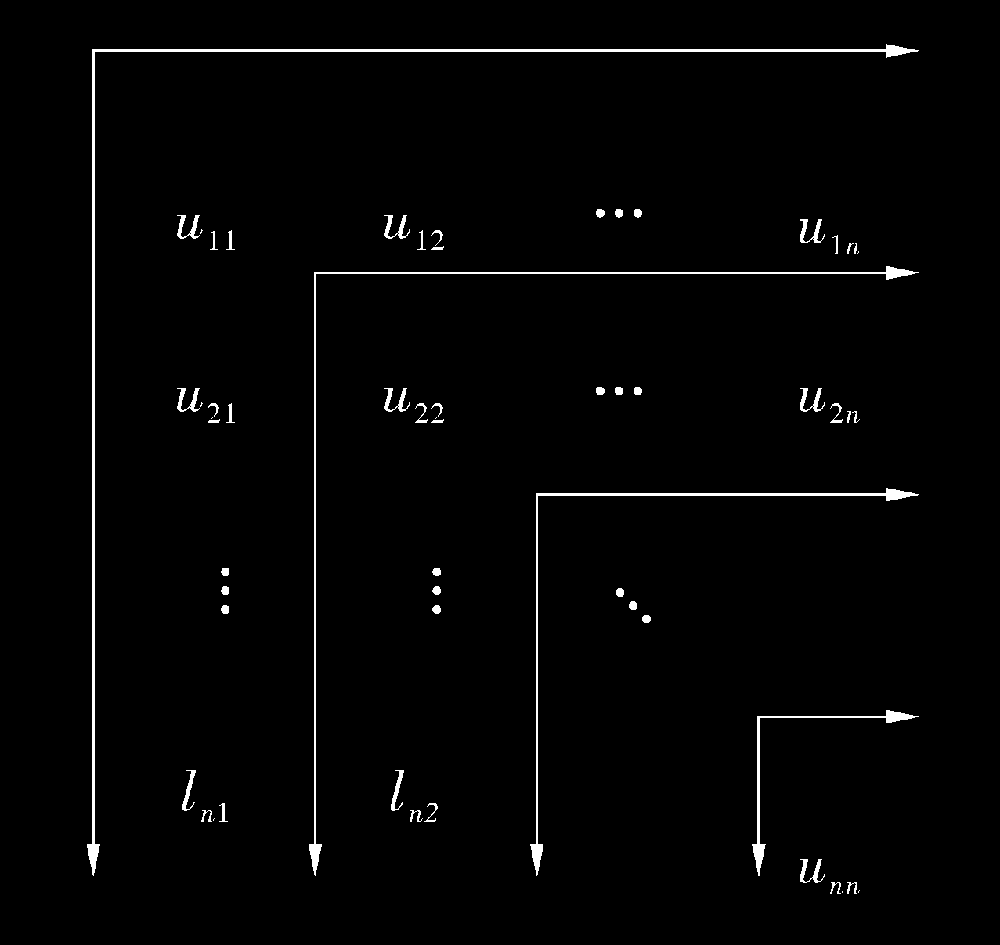

<!-- page: 123 -->

６
１
１
数值分析

５畅２畅１畅２　直接ＬＵ分解法的计算量（乘除次数）

ＬＵ分解计算U 的计算量：

３－n

n

i ＝１（n －i）· i ＝n

∑

６

计算L 的计算量：

n －１

３－n

i ＝１（n －i）· i ＝n

∑

６

求解LY ＝b 的计算量：

n －１

i ＝１i ＝n（n －１）

∑

２

求解UX ＝Y 的计算量：

i ＝１i ＝n（n ＋１）

n

∑

２

总的计算量为：

３＋３n

２－n
３

n

例5 －4　用ＬＵ分解法求解方程组

１
２
１

０

x１

２
２
３

＝

３

x２

－１
－３
０

２

x３

解　先把系数矩阵进行ＬＵ分解得

１

１
２
１

L ＝

２
１

　　U ＝

－２
１

－１
０畅５
１

０畅５

求解LY ＝b：

y１

１

０

２
１

＝

３

y２

－１
０畅５
１

２

y３

得y１＝０，y２＝３，y３＝０畅５．

求解UX ＝Y：

x１

１
２
１

０

－２
１

＝

３

x２

０畅５

０畅５

x３

解得x１＝１，x２＝－１，x３＝１．故AX ＝b 的解为X ＝（１，－１，１）

Ｔ．

３＋３n

２－n
３
，和高斯消去法

用直接ＬＵ分解法求解方程组所需要的计算量仍为n

<!-- page: 124 -->

７
１
１
５　解线性代数方程组的直接法

乘除法次数相同．但ＬＵ分解法把对系数矩阵的计算和对右端项的计算分开了，这

就使得求解系数矩阵相同而右端项不同的一系列方程组变得特别方便．

５畅２畅２　列主元ＬＵ分解法

直接进行ＬＵ分解时，ukk可能为零，或者绝对值接近零，这样会出现溢出，或者

因以一个小的数作除数，引起舍入误差的积累，最后引起解的失真．为了避免这些

问题，如果A 非奇异，可以采用列主元的方法，叫做列主元ＬＵ分解．

假若第k －１步的分解已完成，在进行第k 步分解时，为避免出现小的ukk 作除

数，计算

k －１

Si ＝aik －∑

m ＝１lim umk

选取行号ik，使

Sik
＝ｍａｘ

k≤i≤n Si

若ik≠k，则对调A 的第k 行与第ik 行，再求ukj（j ＝k，…，n）和lik（i ＝k ＋１，…，n），

从而完成了U 的第k 行和L 的第k 列的计算．算法如下．

　　列主元ＬＵ分解算法

　　①输入A，b 及ε

②对k ＝１，２，…，n 循环

k－１

　　计算Si ＝aik －∑

m ＝１limumk　（i ＝k，k ＋１，…，n）

　　选主元Sik
＝ｍａｘ

k≤i≤n Si ，并记录ik

　　若Sik
＜ε，则打印″求解失败″，停机；否则

　　　　交换A 的第k 行与第ik 行元素

　　　　计算U 的第k 行元素和L 的第k 列元素

k－１

ukj ＝akj －∑

m ＝１lkmumj
（j ＝k，k ＋１，…，n）

k－１

aik －∑

m ＝１limumk

lik ＝

ukk
（i ＝k ＋１，…，n）

③将b 向量的第k 个元素与第ik 个元素交换，k ＝１，２，…，n －１．

④求解LY ＝b，UX ＝Y（过程与直接ＬＵ分解法相同）

<!-- page: 125 -->

８
１
１
数值分析

５畅３　对称正定矩阵的平方根法和ＬＤＬ

Ｔ分解法

当A 是对称正定矩阵时，存在一个实的非奇异下三角矩阵L１，使

A ＝L１L

Ｔ
１
且当限定L１的对角线为正时，这种分解惟一．这种分解称为矩阵的Ｃｈｏｌｅｓｋｙ分解．

定理5畅2　设A 是对称正定矩阵，则A 有如下分解：

A ＝LDL

Ｔ

其中，L 是单位下三角阵；D 为对角阵，且这种分解是惟一的．

证明　因为A 对称正定，从而A 有惟一的ＬＵ分解

u１１
u１２
…
u１n

１

l２１
１

u２２
…
u２n

A ＝



筹

筹


ln１
ln２
…
１

unn

因为　Δk ＝u１１…ukk≠０（k ＝１，２，…，n），故上式可化为

１

１
u１２／u１１
…
u１n ／u１１

u１１

l２１
１

１
…
u２n ／u２２

u２２

A ＝



筹

筹

筹


ln１
ln２
…
１

１

unn

将右端三角矩阵分别记为L，D 和R，因A 对称，有

A ＝LDR ＝R

ＴDL

Ｔ

或者
A ＝LDR ＝R

Ｔ（DL

Ｔ）

因为A 的ＬＵ分解惟一，故L ＝R

Ｔ，L

Ｔ＝R，A ＝LDL

Ｔ，此分解显然是惟一的．

定理5畅3　n 阶对称正定矩阵A 一定有Ｃｈｏｌｅｓｋｙ分解A ＝L１L

Ｔ
１，当限定L１的

对角线为正时，矩阵的Ｃｈｏｌｅｓｋｙ分解惟一．

证明　由定理５畅２知，存在惟一的单位下三角矩阵L，对角元全为正的对角阵

D ＝ｄｉａｇ（d１，d２，…，dn）

１
２（LD

１
２）

使
A ＝LD

Ｔ

１
２，它是一个非奇异下三角阵，一对角线元素为正，故A 有Ｃｈｏｌｅｓｋｙ分

又记L１＝LD

解

A ＝L１L

Ｔ
１
分解的惟一性显而易见。

下边推导Ｃｈｏｌｅｓｋｙ分解的计算公式

设A ＝LL

Ｔ，即

<!-- page: 126 -->

９
１
１
５　解线性代数方程组的直接法

a１１
a１２
…
a１n

l１１
l２１
…
ln１

l１１

a２１
a２２
…
a２n

l２２
…
ln２

l２１
l２２

＝







筹

筹


an１
a n２
…
ann

ln１
ln２
…
lnn

lnn

其中aij ＝a ji（i，j ＝１，２，…，n），lii ＞０（i ＝１，２，…，n）．

第１步：由矩阵乘法有a１１＝l

２
１１，且ai１＝li１l１１，故求得

l１１＝
a１１　　li１＝ai１

l１１　（i ＝２，３，…，n）

一般地，设L 矩阵的前k －１列元素已求出，则

第k 步：由矩阵乘法得

k －１

k －１

∑

２
kk ＝akk　　∑

２
km ＋l

m ＝１lim lkm ＋liklkk ＝aik

m ＝１l

于是

k －１

lkk ＝
akk －∑

２
im

m ＝１l

（i ＝k ＋１，…，n；k ＝２，３，…，n）
（５畅１８）

k －１

lik ＝aik －∑

m ＝１lim lkm
lkk

由于分解公式（５畅１８）中的每一步都有开方运算，故又称Ｃｈｏｌｅｓｋｙ方法为平方根

法．

k －１

注意到akk ＝∑

２
km ，所以l

２
km ≤a kk≤ｍａｘ

１≤k≤nakk．

m ＝１l

这说明在分解过程中元素lkm 的平方不会超过A 的最大对角元，因而舍入误差

的放大受到限制．所以，平方根法求解对称正定方程组时可以不考虑选主元的问

题．

可以证明，若用顺序高斯消去法求解对称正定方程组AX ＝b，则有

（k）
ij
≤ｍａｘ

１≤i≤n aii　（k ＝１，２，…，n）

ｍａｘ
１≤i，j≤n a

（k）
ij 是第k 步顺序高斯消去法过程所得到的元素．这说明高斯消去法求解对

其中a

称正定方程组也可以不用选主元．

从运算的角度看，平方根法是有利的，用平方根法求解AX ＝b 所需的乘除次

数为１

６（n

３＋９n

２＋２n），另外还有n 次开平方运算，乘除次数只是高斯消去法的一

半左右。

例5 －5　用平方根法解方程组

<!-- page: 127 -->

０
２
１
数值分析

x１

３
２
３

５

２
２
０

＝

３

x２

３
０
１２

７

x３

解　由平方根分解法可得

３
２

３

３

３

３
２
３

２

２

２
２
０

＝

２
３

－６

３

３

３
０
１２

３
－６
３

３

３

y１

５

２

２

＝

３

y２

求解

３

３

７

y３

３
－６
３

得Y ＝（５／３，－１／６，１／３）

Ｔ．

３
２

３

３

x１

y１

２

＝

x２

y２

求解

－６

３

x３

y３

３

得X ＝（１，１／２，１／３）

Ｔ．

　　平方根求解算法

　　①输入A，b 及ε．

②对k ＝１，２，…，n，循环

k －１

　　计算Sk ＝akk －∑

２
km

m ＝１l

　　若Sk ＜ε，则打印″求解失败″，停机；否则

　　　计算

k －１

　　　　lkk ＝
akk －∑

２
im

m ＝１l

k－１

　　　　lik ＝aik －∑

m ＝１limlkm ／lkk　（i ＝k ＋１，…，n）

③求解LY ＝b

　　y１＝b１／l１１

<!-- page: 128 -->

１
２
１
５　解线性代数方程组的直接法

　　　　对i ＝２，３，…，n，计算

i－１

　　　yi ＝bi －∑

j ＝１lijyj
lii

④求解L

ＴX ＝Y

　　xn ＝yn ／lnn

　　对i ＝n －１，n －２，…，１，计算

n

　　　xi ＝yi －∑

j ＝i＋１ljixj
lii

⑤打印xi（i ＝１，２，…，n）

为避免平方根法的开方运算，利用定理５畅２，也可以对A 作ＬＤＬ

Ｔ分解，其分解

方法可借助于ＬＵ分解法．

从定理５畅１可以看到，当A 的所有顺序主子式不为零且对称时，A 的ＬＵ分解

存在且惟一，并且

U ＝DL

Ｔ

其中，D ＝ｄｉａｇ（u１１，u２２，…，unn），lij ＝uji ／uii．

利用ＬＵ分解法先计算出U 的第k 行，由U 的第k 行得到D 的第k 个对角元

素及L 的第k 列．

di ＝uii　　lik ＝uki ／ukk

因此ＬＤＬ

Ｔ分解的乘除法计算次数为

２－n

２
＝１

３＋１

２－２

３

n

６－n

６＋n

６n

２n

３n

大约只是高斯消去法的一半，与平方根法大致相同，但避免了开方运算．

例5 －6　用ＬＤＬ

Ｔ分解法求方程组

５
－４
１

x１

２

－４
６
－４

＝

－１

x２

１
－４
６

１

x３

解　由ＬＤＬ

Ｔ分解法得

１

５

１
－４

１
５

５
－４
１

５

－４

１４

５
１

－４
６
－４

＝

５

１
－７

８

１
－４
６

１
５
－８

１５

７
１

７

１

这样就得到

<!-- page: 129 -->

２
２
１
数值分析

１

５

－４

１４

５
１

L ＝

　　D ＝

５

１
５
－８

１５

７
１

７

解LY ＝b 得

Y ＝２，３

５，－５

Ｔ

．

７

解DZ ＝Y 得Z ＝２

５，３

１４，－１

Ｔ

．

３

ＴX ＝Z 得
X ＝１

３，－１

６，－１

Ｔ

．

最后解L

３

　　ＬＤＬ

Ｔ分解算法

　　①输入A，b 及ε

②对k ＝１，２，…，n，循环

　　ａ）对j ＝k，k ＋１，…，n，计算

k－１

　　　　ukj ＝akj －∑

m ＝１lkmumj

　　若ukk
＜ε，则打印″求解失败″，停机；否则

　　ｂ）dk ＝ukk

　　ｃ）对　i ＝k ＋１，…，n，计算

lik ＝uki

ukk

③求解LY ＝b

④求解DZ ＝Y

⑤求解L

ＴX ＝Z

⑥打印xi（i ＝１，２，…，n）

为了更好地理解算法，引入lik和ukj．实际上，lik和ukj仍将存放在矩阵A 的相应

元素aik和akj所占的单元内，不必占用新的单元．要做到这一点，只要将上述算法中

出现的lik和ukj相应变为aik和akj即可．

５畅４　向量与矩阵范数

用直接法求解线性方程组AX ＝b 时，由于有舍入误差，只能得到近似解．为了

进行解的误差分析和迭代法的收敛性分析（后面介绍），首先介绍向量范数和矩阵

<!-- page: 130 -->

３
２
１
５　解线性代数方程组的直接法

范数的概念．

５畅４畅１　向量范数

向量范数是n 维欧几里德空间中长度概念的推广．

定义5畅1　设向量X∈R

n，若与X 对应的非负实数‖X‖满足下面三个条件：

①非负数：橙X∈R

n，有‖X‖≥０，且‖X‖ ＝０当且仅当X ＝０；

②齐次性：橙X∈R

n，α∈R 有‖αX‖≤｜α｜· ‖X‖；

③三角不等式橙X，Y∈R

n，有‖X ＋Y‖≤‖X‖ ＋‖Y‖．

则称‖X‖为向量X 的范数．

常用范数有：

（１）向量的１范数

n

‖X‖１＝∑

i ＝１｜xi ｜

（２）向量的２范数

n

１
２

‖X‖２＝∑

i ＝１｜xi ｜

２

（３）向量的∞范数

‖X‖∞＝ｍａｘ

１≤i≤n ｜xi ｜

（４）更一般的p 范数为

n

１
p

‖X‖p ＝∑

i ＝１｜xi ｜

p

容易验证，上面几种范数的定义满足范数的三个条件．

n 上两种范数，如果存在与X 无关的两

定义5畅2　设‖· ‖α 和‖· ‖β 是R

个正常数C１和C２，使不等式

C１‖X‖α≤‖X‖β≤C２‖X‖α　（橙X∈R

n）

成立，则称范数‖· ‖α 和‖· ‖β等价．

定理5畅4　有限维空间上任何两种范数均等价．

n 中的向量序列，若有向量X

定义5畅3　设｛X

（k）｝是R

倡∈R

n，使

（k）－X

倡
＝０

ｌｉｍ
k→∞X

则称｛X

（k）｝收敛于X

倡，记为ｌｉｍ

（k）＝X

倡．

k→∞X

n 中范数等价，因此｛X

该定义形式上依赖于所选择的向量范数，但由于R

（k）｝

的收敛性实际上与所选择的范数无关．

n 中的向量序列，则ｌｉｍ

定理5畅5　设｛X

（k）｝是R

（k）－X

倡
＝０当且仅当

k→∞X

（k）
j
＝x

ｌｉｍx

倡
j

<!-- page: 131 -->

４
２
１
数值分析

其中，x

倡的第j 个分量．

（k）
j
和x

倡
j
分别表示X

（k）和X

５畅４畅２　矩阵范数

定义　设矩阵A∈R

n ×n，若A 的非负实数‖A‖满足下列四个条件：

①非负数：橙X∈R

n ×n，‖A‖≥０，且‖A‖ ＝０当且仅当A ＝０；

②齐次性：橙A∈R

n ×n，橙α∈R，‖αA‖ ＝｜α｜· ‖A‖；

③三角不等式橙A，B∈R

n ×n，‖A ＋B‖≤‖A‖ ＋‖B‖；

④乘法不等式：橙A，B∈R

n ×n，‖AB‖≤‖A‖· ‖B‖．

则称‖A‖为矩阵A 的范数．

同向量范数一样，矩阵范数也有下面定理．

n ×n 中矩阵序列，A 是R

n ×n 中矩阵，则

定理5畅6 　设｛A

（k）｝是R

（k）－A
＝０当且仅当ｌｉｍ

（k）
ij
＝aij，其中a

（k）和A 的分量．

ｌｉｍ
k→∞A

（k）
ij 和aij分别表示A

k→∞a

定义5畅4　对于给定的向量范数‖· ‖与矩阵范数‖· ‖，如果橙A∈R

n ×n和

橙X∈R

n，并满足

‖AX‖≤‖A‖· ‖X‖

则称此矩阵范数与向量范数是相容的．

n 中的向量范数，则

定理5畅7　设A 为n ×n 阶矩阵，‖· ‖是R

‖A‖ ＝ｍａｘ

‖ X‖ ＝１‖AX‖

是一种矩阵范数，称其为由向量‖· ‖诱导出的矩阵范数．

现在考察由向量范数‖· ‖１，‖· ‖２，‖· ‖∞产生的矩阵范数．

定理5畅8　设A ＝（aij）∈R

n ×n，则

n

１≤j≤n∑

‖A‖１＝ｍａｘ

i ＝１｜aij ｜

n

１≤i≤n∑

‖A‖∞＝ｍａｘ

j ＝１｜aij ｜

１
２

‖A‖２＝［λｍａｘ（A

ＨA）］

Ｈ是A 的共轭．

其中A

证明　下面只就１范数给出证明．对橙X∈R

n，X≠０，有

n

n

n

n

‖AX‖１＝∑

i ＝１
∑

j ＝１a ijxj ≤∑

i ＝１∑

j ＝１
aij ·
xj

n

n

n

１≤j≤n∑

i ＝１
aij
∑

１≤j≤n∑

≤ｍａｘ

j ＝１
xj ≤ｍａｘ

i ＝１
aij ·
X
１

故有

‖AX‖１

n

１≤j≤n∑

‖A‖１＝ｍａｘ

‖X‖１≤ｍａｘ

i ＝１
aij
（５畅１９）

X≠０

<!-- page: 132 -->

５
２
１
５　解线性代数方程组的直接法

另一方面，设

n

n

∑

１≤j≤n∑

i ＝１
aij０
＝ｍａｘ

i ＝１
aij

倡＝ｅj０＝（０，…，０，１，０，…，０）

Ｔ，则

取X

倡＝（a１j０，a２j０，…，anj０）

Ｔ

AX

n

n

１＝∑

１≤j≤n∑

i ＝１
aij０
＝ｍａｘ

倡

AX

i ＝１
a ij

１＝１，

倡

注意到X

倡

A
１≥AX

n

１≤j≤n∑

＝ｍａｘ

i ＝１
aij
（５畅２０）

１
X

倡

１

综合（５畅１９）式、（５畅２０）式得

n

１≤j≤n∑

A
１＝ｍａｘ

i ＝１
aij

在这３种范数中，１范数与∞范数的计算比较简单，２范数要计算矩阵的特征

值，比较复杂．但２范数有一些好的性质，常用于理论分析．

此外，在R

n ×n上的一个常用且易于计算的矩阵范数为

n

１
２

A
Ｆ＝∑

２

i，j ＝１
aij

n２上的２范数的自然推广．

通常称作Ｆｒｏｂｅｎｉｕｓ范数，它是R

５畅４畅３　谱半径

定义5畅5 　A ∈R

n ×n，A 的特征值为λi （i ＝１，２，…，n ），称ρ （A ）＝

ｍａｘ
１≤i≤n λi 为A 的谱半径．

定理5畅9　A 的谱半径不超过A 的任何一个矩阵范数，即

ρ（A）≤A

证明　设λ是A 的任一特征值，X 是相应的特征向量，则有

AX ＝λX

于是有
｜λ｜·
X
＝AX ≤A ·
X

从而｜λ｜≤A ．于是

ρ（A）≤A

定理5畅10　设A 是任意n ×n 阶矩阵，由A 的各次幂所组成的矩阵序列

I，A，A

２，…，A

k，…

k ＝０的充要条件是ρ（A）＜１．

收敛于零，即ｌｉｍ

k→∞A

证明从略．读者可参阅冯康等编的枟数值计算方法枠．

<!-- page: 133 -->

６
２
１
数值分析

５畅４畅４　方程右端误差对解的影响

考虑线性代数方程组

AX ＝b

设右端项有误差δb 时，相应的方程组的解为X ＋δX，即

A（X ＋δX）＝b ＋δb

将AX ＝b 代入得

AδX ＝δb　或　δX ＝A

－１δb

这里假定A 非奇异，从而有不等式

δX
＝A

－１δb ≤A

－１·
δb

而
AX
＝b ≤A ·
X

所以
δX

－１·
δb

X
≤A ·
A

b

在这种情形下，数A ·
A

－１就是误差的放大率，即解的相对误差不超过右端项

相对误差的A ·
A

－１倍，称A ·
A

－１为矩阵A 的条件数，记作

Ｃｏｎｄ（A）＝A ·
A

－１

５畅４畅５　系数矩阵误差对解的影响

设系数矩阵A 有误差δA，X ＋δX 是系数矩阵为A ＋δA 时的准确解，即

（A ＋δA）（X ＋δX）＝b
（５畅２１）

首先一个问题是，即使矩阵A 非奇异，其元素有扰动δA 后，矩阵A ＋δA 有可能变

为奇异．但是可以想像，若δA 很小，矩阵A ＋δA 仍然可以保持它的非奇异性．为了

准确给出保持这种非奇异的条件，先证明下述引理．

引理　设矩阵F 的范数小于１，即F
＜１，则矩阵（I ＋F）非奇异，且

－１≤
１
１－F

（I ＋F）

证明　橙X∈R

n，恒有

（I ＋F）X
＝X ＋FX ≤X
－FX ≥（１－F ）·
X

因为１－F
＞０，所以，对X≠０，（I ＋F）X
＞０．

从而可知，方程组（I ＋F）X ＝０只有零解，因此矩阵（I ＋F）非奇异．

又
１＝I
＝（I ＋F）（I ＋F）

－１

＝（I ＋F）

－１＋F（I ＋F）

－１

≥（I ＋F）

－１
－（I ＋F）

－１·
F

＝（I ＋F）

－１（１－F ）＞０

从而必有

<!-- page: 134 -->

７
２
１
５　解线性代数方程组的直接法

－１≤
１
１－F

（I ＋F）

再来考虑矩阵A ＋δA 的非奇异性条件．由于

A ＋δA ＝A（I ＋A

－１δA）

据前述引理即可知，若

－１δA
＜１
（５畅２２）

A

则矩阵A ＋δA 非奇异，且

－１≤
１
１－A

（I ＋A

－１δA）

－１δA

在条件（５畅２１）式成立时，据（５畅２１）式得

δX ＝（A ＋δA）

－１－A

－１b ＝（A ＋δA）

－１［A －（A ＋δA）］A

－１b

＝（A ＋δA）

－１（－δA）A

－１b ＝（A ＋δA）

－１（－δA）X

所以
δX

X
≤（A ＋δA）

－１δA
＝（I ＋A

－１δA）

－１δA

－１A

－１δA
１－A

－１δA ≤
A

≤（I ＋A

－１δA）

－１·
A

－１δA

－１δA
１－A

－１·
δA
１－A

由于
A

－１δA ≤
A

－１·
δA

＝
A ·
A

·
δA

－１

－１
δA

A

１－A ·
A

A

从而得到不等式

δX

X
≤
Ｃｏｎｄ（A）

· ‖δA‖
‖A‖

１－Ｃｏｎｄ（A）‖δA‖

‖A‖

若Ｃｏｎｄ（A）δA

A
很小，则Ｃｏｎｄ（A）仍表示相对误差的近似放大率．

根据以上讨论可以看出，Ｃｏｎｄ（A）反映线性方程组AX ＝b 的解对初始数据误

差的灵敏度，其值愈大，这种灵敏度愈高．即对很小的初始误差δb 或δA，解的相对

误差就有可能很大，从而大大破坏了解的精确度．

练习与思考

１畅分别用顺序高斯消去法、列主元高斯消去法、全主元高斯消去法求解下列

方程组

<!-- page: 135 -->

８
２
１
数值分析

x１

２
３
５

５

３
４
７

＝

６

x２

１
３
３

５

x３

２畅用ＬＵ分解法求解下列方程组

x１

２
－３
２

５

－４
２
－６

＝

１４

x２

２
２
４

８

x３

３畅用平方根法求解下列方程组

x１

３
２
１

５

２
２
０

＝

３

x２

１
０
３

４

x３

４畅设A ＝（a

（１）
ij
）n ×n，经顺序高斯消去法一步后A 变为

（１）
１２
…
a

（１）
１１
a

（１）
１n

a

（１）
１１
α

０
a

（２）
２２
…
a

（２）
２n

a

（２）＝

＝

A

０
A２





０
a

（２）
n２
…
a

（２）
nn

其中α＝［a

（１）
１２…a

（１）
１n ］，A２为（n －１）×（n －１）方阵．证明：

（１）若A 按行强对角占优，则矩阵A２按行强对角占优；

（２）若A 对称正定，则矩阵A２对称正定．

５畅比较下面两个方程组的解

１
１
２

１
３

x１

x１

１

１畅００
０畅５０
０畅３３

１

１
２

１
３

１
４

＝

０

０畅５０
０畅３３
０畅２５

＝

０

x２

x２

０

０畅３３
０畅２５
０畅２０

０

x３

x３

１
３

１
４

１
５

６畅设有

b１
c１

x１

d１

a２
b２
c２

x２

d２

筹
筹
筹



＝



an －１
bn －１
cn －１

xn －１

dn －１

an
bn

xn

dn

其系数矩阵强对角占优．试写出用ＬＵ分解法求其解的计算公式．

７畅对矩阵

<!-- page: 136 -->

９
２
１
５　解线性代数方程组的直接法

－２
１
０
０

１
－２
１
０

A ＝

０
１
－２
１

０
０
１
－２

求A
∞，A
２，A
１，A
Ｆ和Ｃｏｎｄ（A）２．

８畅试证明A
２≤A
１·
A
∞．

９畅画出R

２中满足下列不等式的集合

（１）X
１≤１；

（２）X
２≤１；

（３）X
∞≤１．

１０畅设A，B∈R

n ×n均非奇异，·
是任何矩阵范数．证明：

－１≥１

（１）A

A ；

（２）A

－１－B

－１≤A

－１·
B

－１·
A －B ．

１１畅设有方程组AX ＝b，其中

１
２

１
０
－１

１
３

A ＝

２
２
１

　　b ＝

０
２
２

－１

３

如果右端b 有小扰动δb
∞＝５×１０

－７，试估计由此引起的解的相对误差．

１２畅设有方程组AX ＝b．

x１

２４０
－３１９

＝３

－１７９
２４０

４

x２

及扰动方程组（A ＋δA）（X ＋δA）＝b：

x１

２４０
－３１９畅５

＝３

－１７９畅５
２４０

４

x２

（１）试分别解出X 和X ＋δX；

（２）利用扰动误差分析理论估计δX
∞
X
∞，并将理论结果与实际求解结果比较．

<!-- page: 137 -->

６　解线性代数方程组的迭代法

前一章已经介绍了解线性代数方程组

AX ＝b
（６畅１）

的一些直接法．这里A 是n ×n 矩阵；X，b 都是n 维向量．而大多数计算过程均需

对系数矩阵进行分解，因而一般不能保持A 的稀疏性．而在实际问题中，特别是偏

微分方程数值求解，常会遇到大型稀疏矩阵．另外，从上一章分析可以看到，高斯消

去法、ＬＵ分解法的乘除次数为１

Ｔ分解法的乘除次数为１

３＋O（n

２），ＬＤＬ

３＋O

３n

６n

（n

２），当n 较大时，计算量相当大．迭代法的基本思想是构造一个向量序列｛X

（n）｝，

倡，而X

倡就是要求的方程组AX ＝b 的准确解．迭代法

使其收敛至某个极限向量X

能充分利用系数矩阵的稀疏性，当n 较大时，能有效控制计算量．

迭代法要解决的主要问题如下：

（１）如何构造迭代格式？

（２）构造的格式所产生的序列在什么情况下收敛？

（３）如果收敛，收敛的速率如何？

（４）近似解的误差估计．

６畅１　几种常用的迭代格式

６畅１畅１　简单迭代法（Ｊａｃｏｂｉ迭代）

设有方程组

a１１x１＋a１２x２＋… ＋a１nxn ＝b１

a２１x１＋a２２x２＋… ＋a２nxn ＝b２

（６畅２）

　　　　　　　　　　　

an１x１＋an２x２＋… ＋annxn ＝bn

用矩阵表示为

AX ＝b

其中A 是系数矩阵，非奇异；b，X 为n 维向量．

假设aii≠０，将方程组（６畅２）中第一个方程的a１１x１项保留在左端，其余项移到

右端，然后两边再除以a１１．同理将第k 个方程的akk xk 项保留在左端，其余项移到

<!-- page: 138 -->

１
３
１
６　解线性代数方程组的迭代法

右端，然后两边再除以a kk（k ＝２，３，…，n）．这样，方程组（６畅２）变成下列等价方程

组

x１＝
b１２x２＋b１２x３＋…
＋b１nxn ＋g１

x２＝
b２１x１
＋b２３x３＋…
＋b２nxn ＋g２

（６畅３）

　　

xn ＝bn１x１＋bn２x２
＋… ＋bn，n －１xn －１
＋gn

－aij

bij ＝

（i≠j）

aii

bii ＝０
（i ＝１，２，…，n）

其中

gi ＝bi

aii
（i ＝１，２，…，n）

若令

０
b１２
b１３
…
b１n

a１１

g１

b２１
０
b２３
…
b２n

a２２

g２

B ＝

　　D ＝

　　g ＝






筹



bn１
bn２
bn３
…
０

ann

gn

容易看出

B ＝D

－１（D －A）＝I －D

－１A

g ＝D

－１b

方程（６畅３）用矩阵可表示为

X ＝BX ＋g
（６畅４）

由此便可构造一个迭代格式（Ｊａｃｏｂｉ迭代）

（k ＋１）＝BX

（k）＋g
（６畅５）

X

n 后，上式便产生一个向量序列

（０）∈R

当取定初始向量X

（０），X

（１），…，X

（k），…

X

倡，则X

倡一定是方程（６畅４）的解，当然也是原方程AX ＝b 的解．此

若它收敛于X

时，称Ｊａｃｏｂｉ迭代关于初始向量X

（０）收敛．

　　Ｊａｃｏｂｉ迭代算法

　　①输入A，b，初始向量Y，容许误差ε，容许最大迭代次数M．

②置k ＝１．

③形成迭代矩阵B（存放在A 中）．

　对i ＝１，２，…，n，循环

　　若aii
＜ε，则打印″求解失败″，停机；否则

<!-- page: 139 -->

２
３
１
数值分析

　　　　　T ＝aii

　　　对j ＝１，２，…，n，计算

aij

　　　　aij ＝－

T

　　　　aii ＝０，gi ＝bi

T

④迭代：

　对i ＝１，２，…，n，计算

　　xi ＝gi ＋∑

j≠i aijyj

⑤若‖X －Y‖ ＜ε，输出X，k，停机；否则

⑥若k ＜M，则k ＝k ＋１，将X 赋值给Y，转④；否则，输出求解失败信息，停机．

６畅１畅２　Ｓｅｉｄｅｌ迭代法

设有简单迭代法

（k ＋１）＝BX

（k）＋g

X

将迭代矩阵B ＝（bij）n ×n分解为B ＝L ＋U，其中

０

０
b１２
…
b１n

b２１
０

０
…
b２n

L ＝

　　U ＝



筹

筹


bn１
bn２
…
０

０

（k ＋１）＝LX

（k）＋UX

（k）＋g　（k ＝０，１，２，…）

则
X

将其修改为

（k ＋１）＝LX

（k ＋１）＋UX

（k）＋g　（k ＝０，１，２，…）
（６畅６）

X

上式称为Ｓｅｉｄｅｌ迭代，其分量形式为

i －１

n

（k ＋１）
i
＝∑

（k ＋１）
j
＋∑

（k）
j
＋gi　（i ＝１，２，…，n）
（６畅７）

x

j ＝１bijx

j ＝i ＋１bijx

它的特点在于，计算第i 个分量x

（k ＋１）
i
时，前边的i －１个分量用的是最新算出的

（k ＋１）
１
，…，x

（k ＋１）
i －１
，而不是旧值x

（k）
１
，…，x

（k）
n
，这样有可能提高收敛速度．

x

因（I －L）

－１存在，迭代格式（６畅６）可以改写成

（k ＋１）＝（I －L）

（k）＋（I －L）

－１g
（６畅８）

－１UX

X

称B１＝（I －L）

－１U 为Ｓｅｉｄｅｌ迭代法的迭代矩阵．

<!-- page: 140 -->

３
３
１
６　解线性代数方程组的迭代法

　　Ｓｅｉｄｅｌ迭代算法

　　①输入A，b，初始向量Y，容许误差ε，容许最大迭代次数M

②置k ＝１，对i ＝１，２，…，n，xi ＝yi

③形成迭代矩阵B（存放在A 中）

　对i ＝１，２，…，n，循环

　　若aii
＜ε，则打印″求解失败″，停机；否则

　　　T ＝aii

　　　对j ＝１，２，…，n，计算

－aij

　　　　aij ＝

T

　　　　aii ＝０　　gi ＝bi

T

④迭代：

　对i ＝１，２，…，n，计算

　　xi ＝gi ＋∑

j≠i aijxj

⑤若‖X －Y‖ ＜ε，输出X，k，停机；否则

⑥若k ＜M，则k ＝k ＋１，将X 赋值给Y，转④；否则，输出求解失败信息，停机

６畅１畅３　松弛法（ＳＯＲ迭代）

松弛法可以看作是Ｓｅｉｄｅｌ迭代法的加速，Ｓｅｉｄｅｌ迭代法是松弛法的特例．Ｓｅｉｄｅｌ

迭代格式为

（k ＋１）＝LX

（k ＋１）＋UX

（k）＋g

X

现令
ΔX ＝X

（k ＋１）－X

（k）＝LX

（k ＋１）＋UX

（k）＋g －X

（k）

（k ＋１）＝X

（k）＋ΔX．

于是X

对于Ｓｅｉｄｅｌ迭代法，X

（k）加上修正项ΔX 得到．现在，若在

（k ＋１）可以看成向量X

修正项的前面加上一个参数ω，便得到松弛法的计算格式

（k）＋g）　（k ＝０，１，…）
（６畅９）

（k ＋１）＝X

（k）＋ωΔX ＝（１－ω）X

（k）＋ω（LX

（k ＋１）＋UX

X

用分量形式即为

k
i ＋ω ∑

i －１

n

（k ＋１）
j
＋∑

（k ＋１）
i
＝（１－ω）x

（k）
j
＋gi

x

j ＝１bij x

j ＝i ＋１bij x

（i ＝１，２，…，n；k ＝０，１，２，…）
（６畅１０）

其中，ω称为松弛因子，当ω＞１时叫超松弛；ω＜１时称低松弛；ω＝１时就是

Ｓｅｉｄｅｌ迭代法．

迭代格式（６畅９）还可改写成

<!-- page: 141 -->

４
３
１
数值分析

（k ＋１）＝（I －ωL）

－１［（１－ω）I ＋ωU］X

（k）＋ω（I －ωL）

－１g

X

Bω ＝（I －ωL）

－１（１－ω）I ＋ωU

称为松弛法的迭代矩阵．

　　松弛迭代法算法

　　①输入A，b，初始向量Y，松弛因子ω，容许误差ε，容许最大迭代次数M．

②置k ＝１，对i ＝１，２，…，n，xi ＝yi．

③形成迭代矩阵B（仍存放在A 中）：

　对i ＝１，２，…，n，循环

　　若aii
＜ε，则打印″求解失败″，停机；否则

　　　T ＝aii

　　　对j ＝１，２，…，n，计算

aij

　　　　aij ＝－ω倡

T

　　　　aii ＝１－ω，gi ＝ω倡bi

T

④迭代：

　对i ＝１，２，…，n，计算

n

　　xi ＝gi ＋∑

i ＝１aijxj

⑤若‖X －Y‖ ＜ε，输出X，k；停机；否则

⑥若k ＜M，则k ＝k ＋１，将X 赋值给Y，转④；否则，输出求解失败信息，停机

６畅２　迭代法收敛性理论

任意选取初始向量，利用迭代格式（６畅５）构造向量序列｛X

（k）｝，向量序列是否

一定收敛呢？先看两个例子．

例6 －1　用Ｊａｃｏｂｉ迭代法解方程组

１０x１－
x２－２x３＝７畅２

－x１＋１０x２－２x３＝８畅３

－x１－
x２＋５x３＝４畅２

解　上述方程组的准确解是x１＝１畅１，x２＝１畅２，x３＝１畅３．

先把方程改写成

<!-- page: 142 -->

５
３
１
６　解线性代数方程组的迭代法

x１＝
０畅１x２＋０畅２x３＋０畅７２

x２＝０畅１x１＋
０畅２x３＋０畅８３

x３＝０畅２x１＋０畅２x２＋
０畅８４

（０）＝（０，０，０）

Ｔ，利用Ｊａｃｏｂｉ迭代，计算结果如表６－１所示．

取X

表６－１　计算结果

（k）
１
x

（k）
２
x

（k）
３
k
x

（k）
１
x

（k）
２
x

（k）
３

k
x

０
０
０
０
５
１畅０９５１
１畅１９５１
１畅２９４１

１
０畅７２
０畅８３
０畅８４
６
１畅０９８３
１畅１９８３
１畅２９８０

２
０畅９７１
１畅０７０
１畅１５０
７
１畅０９９４
１畅１９９８
１畅２９９３

３
１畅０５７
１畅１５７１
１畅２４８２
８
１畅０９９８
１畅１９９８
１畅２９９７

４
１畅０８５３
１畅１８５３
１畅２８２８
９
１畅０９９９
１畅１９９９
１畅２９９９

从表６－１中可以看到，近似解向量序列收敛，且收敛到准确解．

例6 －2　用Ｊａｃｏｂｉ迭代法解方程组

x１－１０x２＋２０x３＝１１

－１０x１
＋x２
－５x３＝－１４

５x１
－x２
－x３＝３

上述方程的准确解是x１＝x２＝x３＝１．

表６－２　计算结果

（０）＝（０，０，０）

Ｔ，利用Ｊａｃｏｂｉ迭

同样取X

（k）
１
x

（k）
２
x

（k）
３

k
x

代，计算结果如表６－２所示．

０
０
０
０

从表６－２中可以看到，此迭代发散．可

１
１１
－１４
－３

以证明，除X

（０）＝（１，１，１）

Ｔ外，无论选什么

初值都不会收敛．

２
－６９
８１
６６

从上面两个例子可以看出，迭代序列收

３
－４９９
－３７４
－４２９

敛是有条件的．下面给出迭代法收敛性基本

理论．

定理6畅1　对任何初始向量X

（０）和常数项f，由迭代格式

（k ＋１）＝MX

（k）＋f　（k ＝０，１，２，…）

X

产生的向量序列｛X

（k）｝收敛的充要条件是迭代矩阵的谱半径

ρ（M）＜１

证明　先证必要性．假设｛X

（k）｝收敛到X

倡，即ｌｉｍX

（k）＝X

倡，则有

倡＝MX

倡＋f

X

令εk ＝X

（k）－X

倡，则

<!-- page: 143 -->

６
３
１
数值分析

ε k ＋１＝X

（k ＋１）－X

倡＝MX

（k）－MX

倡＝M（X

（k）－X

倡）

所以有

ε k ＋１＝Mεk ＝M

２εk －１＝… ＝M

k ＋１ε０
（６畅１１）

对任意初始向量ε０，要使向量序列｛M

kε０｝收敛于零向量，必须

k ＝０
（６畅１２）

ｌｉｍM

由定理５畅１０可知
ρ（M）＜１

再证充分性．假设ρ（M）＜１，则I －M 非奇异，从而方程组（I －M）X ＝f 有惟

一解，并记为X

倡，于是（６畅１１）式仍成立．由（６畅１２）推出ｌｉｍ

（k）＝X

倡．证毕．

k→∞X

在具体问题中，谱半径ρ（M）往往很难计算，但由于ρ（M）≤‖M‖，所以有时

可以用‖M‖作为ρ（M）的一种估计．当‖M‖ ＜１时迭代一定收敛，不过这只是

充分条件．

定理6畅2　若迭代矩阵M 的范数‖M‖ ＝q ＜１，则迭代格式X

（k ＋１）＝MX

（k）＋

（０）一定收敛，且

f 对任何初始向量X

k

倡≤
q

（k）≤q

（k）－X

（k －１）－X

（１）－X

（０）

X

X

X

１－q

１－q

证　由迭代格式得

（k ＋１）－X

（k）＝M（X

（k）－X

（k －１））＝… ＝M

k（X

（１）－X

（０））

X

k X

（k ＋１）－X

（k）≤q X

（k）－X

（k －１）≤q

（１）－X

（０）

X

注意到

（k）－X

倡＝X

（k）－X

（k ＋１）＋X

（k ＋１）－X

倡＝X

（k）－X

（k ＋１）＋M（X

（k）－X

倡）

X

（k）－X

倡≤X

（k）－X

（k ＋１）
＋q X

（k）－X

倡

从而
X

（k）≤
q

倡≤１

（k）－X

（k ＋１）－X

（k）－X

（k －１）

故
X

１－q X

X

１－q

k

≤q

（１）－X

（０）

X

１－q

６畅２畅１　三种迭代法迭代矩阵的谱半径与系数矩阵A 的关系

６畅２畅１畅１　Ｊａｃｏｂｉ迭代

Ｊａｃｏｂｉ迭代的迭代矩阵B ＝D

－１（D －A）．由

｜λI －B ｜＝０

得
｜λI －D

－１（D －A）｜＝０

即
｜D

－１｜· ｜λD －（D －A）｜＝０

所以
｜λD －（D －A）｜＝０

上式写成分量形式为

<!-- page: 144 -->

７
３
１
６　解线性代数方程组的迭代法

λa１１
a１２
…
a１n

a２１
λa２２
…
a２n

＝０
（６畅１３）





an１
an２
…
λann

由定理６畅１可知：

定理6畅3　Ｊａｃｏｂｉ迭代收敛的充要条件是行列式（６畅１３）的所有根λi （i ＝１，２，

…，n）的绝对值（复数理解为模）小于１．

６畅２畅１畅２　Ｓｅｉｄｅｌ迭代

对于Ｓｅｉｄｅｌ迭代，B ＝（I －L）

－１U．由

｜λI －B ｜＝０

得
｜λI －（I －L）

－１U ｜＝０

即
｜λ（I －L）

－１（I －L）－（I －L）

－１U ｜＝０

所以
｜λ（I －L）－U ｜＝０　　｜λD －λDL －DU ｜＝０

写成分量的形式为

λa１１
a１２
…
a１n

λa２１
λa２２
…
a２n

＝０
（６畅１４）





λan１
λan２
…
λa nn

定理6畅4　Ｓｅｉｄｅｌ迭代收敛的充要条件是行列式（６畅１４）的所有根λi （i ＝１，２，

…，n）的绝对值小于１．

６畅２畅１畅３　松弛迭代（ＳＯＲ迭代）

对于松弛迭代，

Bω ＝（I －ωL）

－１［（１－ω）I ＋ωU］

由｜λI －Bω｜＝０得

λI －（I －ωL）

－１［（１－ω）I ＋ωU）］
＝０

化简即得

｜λ（I －ωL）－［（１－ω）I ＋ωU］｜＝０

注意到｜D ｜≠０，得

｜λD －ωλDL －［（１－ω）D ＋ωDU］｜＝０

写成分量形式为

（λ＋ω－１）a１１
ωa１２
…
ωa１n

ωλa２１
（λ＋ω－１）a２２
…
ωa２n

＝０
（６畅１５）





ωλan１
ωλan２
…
（λ＋ω－１）ann

<!-- page: 145 -->

８
３
１
数值分析

定理6畅5　松弛迭代收敛的充要条件是行列式（６畅１５）的所有根λi （i ＝１，２，

…，n）的绝对值小于１．

对于一些特定的系数矩阵A，有一些特定的判别方法．为了说明方便起见，在

此先引进一些概念．

定义6畅1　如果矩阵A 不能通过行交换和相应的列交换变成

A１１
A１２

０
A２２

其中A１１，A２２为方阵，则称A 为不可约．

定义6畅2　若矩阵A ＝（aij）n ×n满足

aii ≥∑

i≠j
aij 　（i ＝１，２，…，n）

且至少有一个i 值使上式中不等式严格成立，则称矩阵A 具有对角优势（又称为弱

对角占优）．特别地，若所有的i 值对上式中不等式都严格成立，则称矩阵A 具有强

对角占优．

定理6畅6　若A 是强对角占优，或者A 弱对角占优且不可约，则ｄｅｔA≠０．

矩阵的不可约与矩阵对应的邻接图有一个必然的联系．

定理6畅7　A 矩阵不可约的充要条件是A 矩阵对应的邻接图是一个强连通图．

定理6畅8　若A 是强对角占优，或者A 弱对角占优且不可约，则

（１）Ｊａｃｏｂｉ迭代、Ｓｅｉｄｅｌ迭代一定收敛．

（２）若松弛因子ω满足０＜ω≤１，则松弛迭代一定收敛．

证明　现以Ｊａｃｏｂｉ迭代为例予以证明，Ｓｅｉｄｅｌ迭代同样适用．

采用反证法．若Ｊａｃｏｂｉ迭代不收敛，即存在一个λ０，｜λ０｜≥１，使

λ０a１１
a１２
…
a１n

a２１
λ０a２２
…
a２n

＝０
（６畅１６）





an１
an２
…
λ０ann

注意到
λ０·
aii ≥aii ≥∑

j≠i
aij 　（i ＝１，２，…，n）

因此（６畅１６）式构成的矩阵的对角占优性与A 矩阵相同，因此（６畅１６）式不可能成

立．说明Ｊａｃｏｂｉ迭代收敛．

定理6畅9　松弛法收敛的必要条件是０＜ω＜２．

证明　因为松弛法收敛，故有ρ（Bω）＜１．由矩阵Bω 的特征值的性质可知

｜ｄｅｔBω｜＝｜λ１λ２…λn ｜＜１

其中λ１，λ２，…，λn 是矩阵Bω 的n 个特征值．而

Bω ＝（I －ωL）

－１［（１－ω）I ＋ωU］

<!-- page: 146 -->

９
３
１
６　解线性代数方程组的迭代法

n ｜＝｜λ１λ２…λn ｜＜１

所以
｜ｄｅｔBω｜＝｜（１－ω）

即
｜１－ω｜＜１，０＜ω＜２．

上述定理说明，对于任何系数矩阵A，若要松弛法收敛，其松弛因子ω∈

（０，２）．然而，当松弛因子满足条件０＜ω＜２时，并不是对所有系数矩阵A 松弛法

均收敛．

定理6畅10　若矩阵A 对称且对角线元素均为正实数，则当０＜ω＜２时，松弛

法收敛的充要条件是A 正定．

证明　松弛法的迭代矩阵

Bω ＝（I －ωL）

－１［（１－ω）I ＋ωU］

设其特征值为λ１，λ２，…，λn，相应的特征向量为Y１，Y２，…，Yn，则

［（１－ω）I ＋ωU］Yk ＝λk（I －ωL）Yk
两边用Yk 作内积得

λk ＝（１－ω）（Yk，Yk）＋ω（UYk，Yk）

（Yk，Yk）－ω（LYk，Yk）
（６畅１７）

设（LYk，Yk）＝αk ＋β
ki，（Yk，Yk）＝a．则

（UYk，Yk）＝（L

ＴYk，Yk）＝（Yk，LYk）＝αk －β
ki

将上面结果代入（６畅１７）式得

λk ＝（１－ω）a ＋ωαk －ωβ
ki
（a －ωαk）－iωβ
k

２＝［（１－ω）a ＋ωαk］

２＋ω

２β

２
k
（a －ωαk）

｜λk ｜

（６畅１８）

２＋ω

２β

２
k

由于A 正定，则A１＝D

－１A 对称正定．

（A１Yk，Yk）＝（（I －L －U）Yk，Yk）＝a －２αk ＞０

所以
［（１－ω）a ＋ωαk］

２－（a －ωαk）

２＝（２－ω）ωa（２αk －a）＜０

即（６畅１８）式中的分子［（１－ω）a ＋ωαk ］

２＋ω

２β

２
k 小于分母（a －ωαk ）

２＋ω

２β

２
k ，于是

｜λk ｜

２＜１，ρ（Bω）＜１，松弛迭代法收敛．

松弛迭代法的收敛速度与松弛因子ω有关．下面举一个例子．

例6 －3　取初始向量X

（０）＝（１，１，１）

Ｔ，用ＳＯＲ法求解方程组

x１

４
３
０

２４

３
４
－１

＝

３０

x２

０
－１
４

－２４

x３

（k ＋１）－X

（k）
＜１０

－５．该方程组的精确解为X

倡＝（３，４，－５）．

使X

解　ＳＯＲ法的迭代公式为

<!-- page: 147 -->

０
４
１
数值分析

（k）
１
＋ω

（k ＋１）
１
＝（１－ω）x

４［２４－３x

（k）
２
］

x

（k）
２
＋ω

（k ＋１）
２
＝（１－ω）x

４［３０－３x

（k ＋１）
１
＋x

（k）
３
］

x

（k）
３
＋ω

（k ＋１）
３
＝（１－ω）x

４［－２４＋x

（k ＋１）
２
］

x

分别取ω＝１畅８，ω＝１畅２２，迭代结果如表６－３和表６－４所示．

表６－３　ω＝１畅８时的迭代结果

（k）
１
x

（k）
２
x

（k）
３

k
x

０
１
１
１

１
８畅６５
１畅４７２４
－１０畅９３７３７

２
１畅８９２１２６
４畅８４５８１１
０畅１３０５１３５

３
２畅７４４４５４
５畅９７７０６４
－８畅２１４２９

４
０畅５３５３９３２
４畅２９８９３５
－２畅２９３６９６






６４
３畅０００００１
３畅９９９９９９
－４畅９９９９９６

６５
３畅０００００１
４畅０００００１
－５畅０００００２

表６－４　ω＝１畅２２时的迭代结果

（k）
１
x

（k）
２
x

（k）
３

k
x

０
１
１
１

１
６畅１８５
３畅５７５７３２
－６畅４４９４０４

２
２畅６８７５１２
３畅９３７１９９
－４畅７００２８５

３
３畅１２６２１０
３畅９８９７４７
－５畅０６９０６４

４
２畅９８１６１５
３畅９９８０１３
－４畅９８５４１２






１０
３畅００００００
３畅９９９９９８
－４畅９９９９９９

１１
３畅０００００２
４畅００００００
－５畅００００００

从表６－３、表６－４可以看到，在相同的初始条件下，ω＝１畅８时ＳＯＲ法迭代了

６５步，而ω＝１畅２２时ＳＯＲ法仅迭代了１１次．

使松弛法收敛最快的松弛因子叫最优松弛因子，记为ωｏｐｔ．对于某些特殊类型

<!-- page: 148 -->

１
４
１
６　解线性代数方程组的迭代法

的矩阵，可以证明最优松弛因子为：

ωｏｐｔ＝
２

１＋１－ρ

２（B）

其中ρ（B）是迭代矩阵的谱半径．对一般的矩阵（即使是正定对称矩阵），目前尚无

法确定ωｏｐｔ的理论值．实际计算时，大部分由经验或通过试算来确定ωｏｐｔ的一个近

似值．

定理6畅11　设

①A 为分块三对角阵，且aii≠０；

②Ｊａｃｏｂｉ迭代的迭代矩阵B 的特征值为实值，且０＜ρ（B）＜１．

则

（１）当０＜ω＜２时，ＳＯＲ法迭代收敛；

（２）ＳＯＲ法最优松弛因子

ωｏｐｔ＝
２

１＋１－ρ

２（B）

练习与思考

１畅用简单迭代法，Ｓｅｉｄｅｌ迭代法和取ω＝１畅４６的超松弛迭代法解方程组

x１

２
－１
０
０

１

－１
２
－１
０

０

x２

＝

０
－１
２
－１

１

x３

０
０
－１
２

０

x４

并写出相应的迭代矩阵．

２畅已知方程组

x１

１０
－２
－２

１

－２
１０
－１

＝

０畅５

x２

－１
－２
３

１

x３

（１）构造简单迭代法和Ｓｅｉｄｅｌ迭代法的迭代格式：

（２）讨论这些迭代格式的收敛性．

３畅设有系数矩阵

１
２
－２

２
－１
１

A ＝

１
１
１

　　B ＝

１
１
１

２
２
１

１
１
－２

证明：

<!-- page: 149 -->

２
４
１
数值分析

（１）对系数矩阵A，简单迭代法收敛，而Ｓｅｉｄｅｌ迭代法不收敛；

（２）对系数矩阵B，简单迭代法收敛，而Ｓｅｉｄｅｌ迭代法收敛．

４畅设常数a≠０，试求a 的取值范围，使得方程组

x１

b１

a
１
３

１
a
２

＝

x２

b２

－３
２
a

b３
的简单迭代法关于任何初始向量均收敛．

x３

５．设B∈R

n ×n，ρ（B）＞１，但B 有一个特征值满足｜λ｜＜１．试证明存在初始向

（０），使得简单迭代

量x

（k ＋１）＝BX

（k）＋f　（k ＝０，１，２，…）

X

关于此初始向量收敛．

６畅设A∈R

n ×n，且对称正定，其最小特征值和最大特征值分别是λ１，λn．试证

迭代法

（k ＋１）＝X

（k）＋α（b －AX

（k））

X

收敛的充要条件是０＜α＜２／λn．又问参数取何值时迭代矩阵的谱半径最小？

７畅对方程组

１
２

＝１

x１

０畅３
１

２

x２

拟用迭代法

（k ＋１）＝X

（k）＋α（AX

（k）－b）

X

求解．试确定一个α的取值范围，使得上述迭代公式收敛．

<!-- page: 150 -->

７　非线性方程和非线性方程组的数值解

求方程f（x）＝０的根是最常见的数学问题之一．当f（x）是一次多项式时，称f

（x）＝０为线性方程，否则称之为非线性方程．

当f（x）＝０是非线性方程时，由于f（x）的多样性，求方程f（x）＝０的根尚无一

般的解析解法可用．如果在满足一定的精度要求下，能求出方程的近似根，则可以

认为求根的计算问题已经解决．

本章介绍求非线性方程实根近似值的对分法、迭代法、牛顿法和割线法．使用

这些方法要先确定求根区间［a，b］，或给出某根的近似值x０．x０可以根据物理背景

确定，也可根据y ＝f（x）的草图等方法确定，还可用对分法大致确定根的分布情

况．本章最后简单介绍解非线性方程组的迭代法和牛顿法．

７畅１　对分法

对分法适用于求有根区间内的单实根或奇重实根，其理论根据是连续函数的

性质．

设f（x）在［a，b］上连续，f（a）· f（b）＜０，即f（a）＞０，f（b）＜０或f（a）＜０，f

（b）＞０，则根据连续函数的介值定理，在（a，b）内至少存在一点ξ，使f（ξ）＝０．

对分法首先取区间［a，b］的中点x１＝a ＋b

２
，把

区间［a，b］分为两个小区间［a，x１］、［x１，b］，如果f

（a）· f（x１）＜０，令a１＝a，b１＝x１；否则令a１＝x１，

b１＝b，得到有根区间［a１，b１］．用同样的方法把区

间［a１，b１］对分，得到有根区间［a２，b２］……这样一

直下去，可得到长度每次减半的有根区间序列［ak，

bk］．当k 足够大时，有根区间［ak，bk］长度趋于零，

图７－１

区间任一点都可作为根的近似值，如图７－１所示．

<!-- page: 151 -->

４
４
１
数值分析

７畅１畅０畅１　对分法算法

　　①给出精度δ，ε，令a０＝a，b０＝b，k ＝０．

②令xk ＝（ak ＋bk）／２，计算f（xk）．

③若｜f（xk）｜＜δ，则xk 是f（x）＝０的根，停止计算，输出结果ξ＝xk；

若f（ak）· f（xk）＜０，则令ak ＋１＝ak，bk ＋１＝xk；

否则令ak ＋１＝xk，bk ＋１＝bk．

④若bk ＋１－ak ＋１≤ε（ε 为预先给定的精度要求），退出计算，输出结果ξ≈（ak ＋１＋

bk ＋１）／２；反之，令k ＝k ＋１，返回②．

上面方法可得到区间长度每次缩小一半的区间序列｛［ak，bk ］｝，（ak，bk ）中总

含有方程的根．当区间长bk －ak 很小时，取其中点xk ＝ak ＋bk

２
为根的近似值．

７畅１畅０畅２　收敛性分析

因为

｜xk －ξ｜≤１

２（bk －ak）＝１

２（bk －１－ak －１）＝… ＝１

k ＋１（b －a）
（７畅１）

２

２

所以，当k→∞时，xk 收敛于ξ．

公式（７畅１）还可用于估计对分次数k．

对分法的收敛速度与公比为１／２的等比级数相同．由于２

１０＝１０２４，可知大约

每对分１０次，近似根的精度就可提高三位小数位．对分法的收敛速度较慢，常用来

试探实根的分布区间，或求根的初始近似值．

例7 －1　求x

３－３x ＋１＝０的实根分布情况，并求［０，１］中的实根近似值．要

求实根近似值精确到三位小数．

解　从区间［－４，４］以步长为１计算f（x）＝x

３－３x ＋１＝０的函数值，结果如

表７－１所示．

表７－１　函数值表

x
－４
－３
－２
－１
０
１
２
３
４

f（x）
－５１－１７－１
３
１
－１
３
１９
５３

可见，在区间［－２，－１］、［０，１］、［１，２］各

有一实根，如图７－２所示．下面求［０，１］区间

上的实根，计算列表如表７－２所示．

图７－２

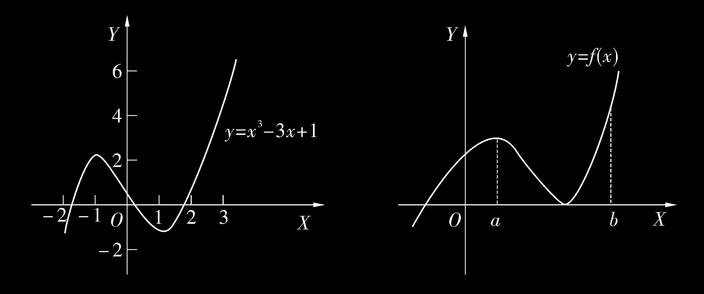

<!-- page: 152 -->

５
４
１
７　非线性方程和非线性方程组的数值解

表７－２　对分法试算表

k
ak
bk
xk
f（xk）

１
０
１
０畅５
－３３畅７５

２
０
０畅５
０畅２５
０畅２６５６２５

３
０畅２５
０畅５
０畅３７５
－０畅０７２２７

４
０畅２５
０畅３７５
０畅３１２５
０畅０９３０２

５
０畅３１２５
０畅３７５
０畅３４３７５
０畅００９３６９

６
０畅３４３７５
０畅３７５
０畅３５９３７５
－０畅０３１７１

７
０畅３４３７５
０畅３５９３７５
０畅３５１５６２５
－０畅０１１２４

８
０畅３４３７５
０畅３５１５６２５
０畅３４７６５６２５
－０畅０００９４９

９
０畅３４３７５
０畅３４７６５６２５
０畅３４５７０３１２５
０畅００４２０６

１０
０畅３４５７０３１２５
０畅３４７６５６２５
０畅３４６６７９６８７
０畅００１６２７

１１
０畅３４６６７９６８７
０畅３４７６５６２５
０畅３４７１６７９６８
０畅０００３３８７

１２
０畅３４７１６７９６８
０畅３４７６５６２５
０畅３４７４１２１０９
－０畅０００３０５４

１３
０畅３４７１６７９６８
０畅３４７４１２１０９
０畅３４７２９００３８
０畅００００１６６６

由于x∈［０畅３４７１６７９６８，０畅３４７４１２１０９］，可取x≈０畅３４７２９００３３作近似解．

７畅１畅０畅３　对分法的特点

对分法的优点是对函数的要求低（只要求

f（x）连续），方法简单、可靠，程序设计容易，可

事先估计计算次数．缺点是收敛速度较慢，不能

求出偶重根．如图７－３所示，因为f（x）在根x

的两边附近函数值同号，不能用对分法求之．

７畅２　迭代法

图７－３

７畅２畅１　迭代法

给定方程f（x）＝０，可用多种方法构造它的等价方程x ＝φ（x），取定根的一个

近似值x０，构造序列

xk ＋１＝φ（xk）　（k ＝０，１，２，…）
（７畅２）

若｛xk｝收敛，即ｌｉｍ

k→∞xk ＝x

倡，并且φ（x）连续，则有

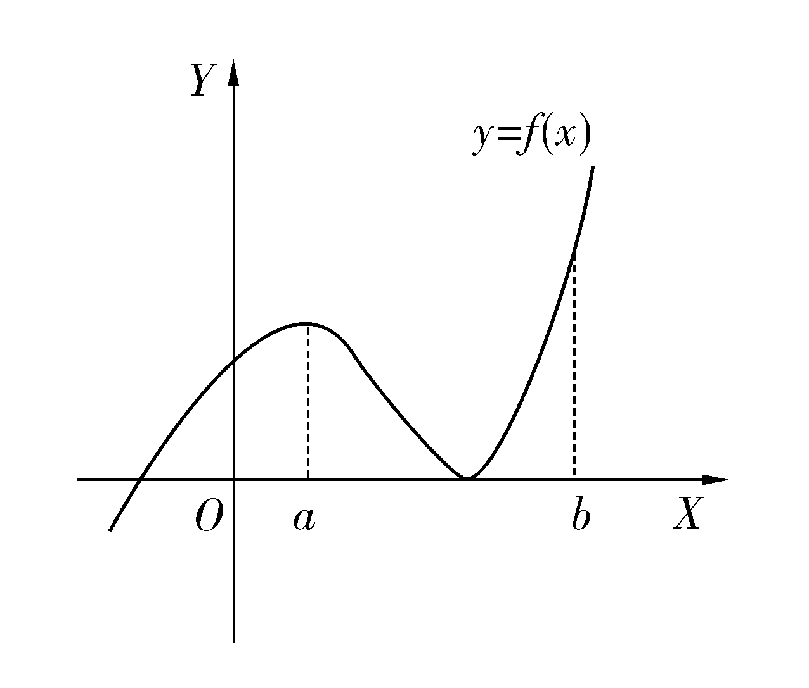

<!-- page: 153 -->

６
４
１
数值分析

ｌｉｍ
k→∞xk ＋１＝ｌｉｍ

k→∞φ（xk）＝φ（ｌｉｍ

k→∞xk）

倡＝φ（x

倡）

即
x

故，｛xk｝的极限x

倡是方程x ＝φ（x）的根，也就是方程f（x）＝０的根．

当然，若｛xk｝发散，迭代法就失败．

７畅２畅１畅１　迭代法算法

　　①给定初值x０，精度ε，k ＝０．

②计算xk ＋１＝φ（xk）．

③若｜xk ＋１－xk ｜＜ε，输出xk ＋１；否则取k ＝k ＋１，返回②

例7 －2　求x

３－３x ＋１＝０在０畅５附近的根．要求精确到第四位小数．

３
k ＋１

３
，格式xk ＋１＝x

３＋１

解　构造等价方程x ＝φ１（x）＝x

３
，k ＝０，１，２，…，取x０＝

０畅５．计算结果如表７－３所示．

表７－３　计算结果

k
０
１
２
３
４
５
６

xk
０畅５００００
０畅３７５００
０畅３５０９１
０畅３４７７４
０畅３４７３５
０畅３４７３０
０畅３４７３０

由表７－３可知，x５＝x６＝０畅３４７３０为根的近似值．

３
k ＋１

注意：格式xk ＋１＝x

３
不能求出方程在１畅５和－２附近的根，请读者自己验证．

此外，方程还可以有另外的格式，如

xk ＋１＝φ２（xk）＝１

　（k ＝０，１，２，…）
（７畅３）

３－x

２
k

３３xk －１　（k ＝０，１，２，…）
（７畅４）

xk ＋１＝φ３（xk）＝

７畅２畅２　迭代法的几何意义

从上例可看到，由f（x）＝０构造出的等价方程x ＝φ（x）可以有多种，有的可能

收敛，有的可能不收敛，这取决于φ（x）的性态．这里先叙述迭代法的几何意义，关

于迭代法的收敛性，后面再讨论．

将x ＝φ（x）写成

y ＝x

y ＝φ（x）

则求解方程x ＝φ（x）等价于求直线y ＝x 和曲线y ＝φ（x）的交点的横坐标x

倡，如

图７－４、图７－５、图７－６和图７－７所示．

<!-- page: 154 -->

７
４
１
７　非线性方程和非线性方程组的数值解

图７－４
图７－５

图７－６
图７－７

　　图７－４、图７－５是收敛情况，而图７－６、图７－７是发散情况．可以大致看出，

如φ（x）在x

倡附近形状比较陡峭（不管是上升或是下降），则发散；若φ（x）比较平

坦，则收敛．

７畅２畅３　迭代法收敛条件

定义7畅1　如果在根x

倡的某个邻域R：x －x

倡≤δ 中，对任意的x０∈R，格式

xk ＋１＝φ（xk），k ＝０，１，２，…收敛，则称格式在x

倡附近局部收敛．

定理7畅1　设x

倡＝φ（x

倡），φ′（x）在x

倡的某个领域R 内连续，并且φ′（x）≤

q，q ＜１是常量，则

（１）对任意x０∈R，由格式xk ＋１＝φ（xk）决定的序列｛xk｝收敛于x

倡．

k

倡≤q

（２）xk －x

x１－x０
（７畅５）

１－q

倡≤１

　xk －x

１－q xk ＋１－xk
（７畅６）

证明　（１）由拉格朗日中值定理，存在ξ∈R，使

xk －x

倡＝φ（xk －１）－φ（x

倡）＝φ′（ξ）（xk －１－x

倡）

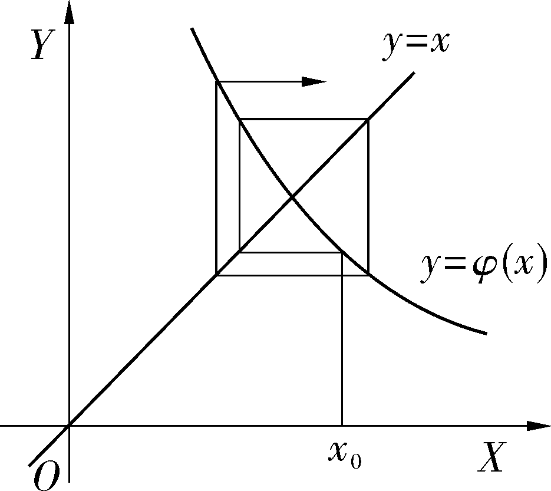

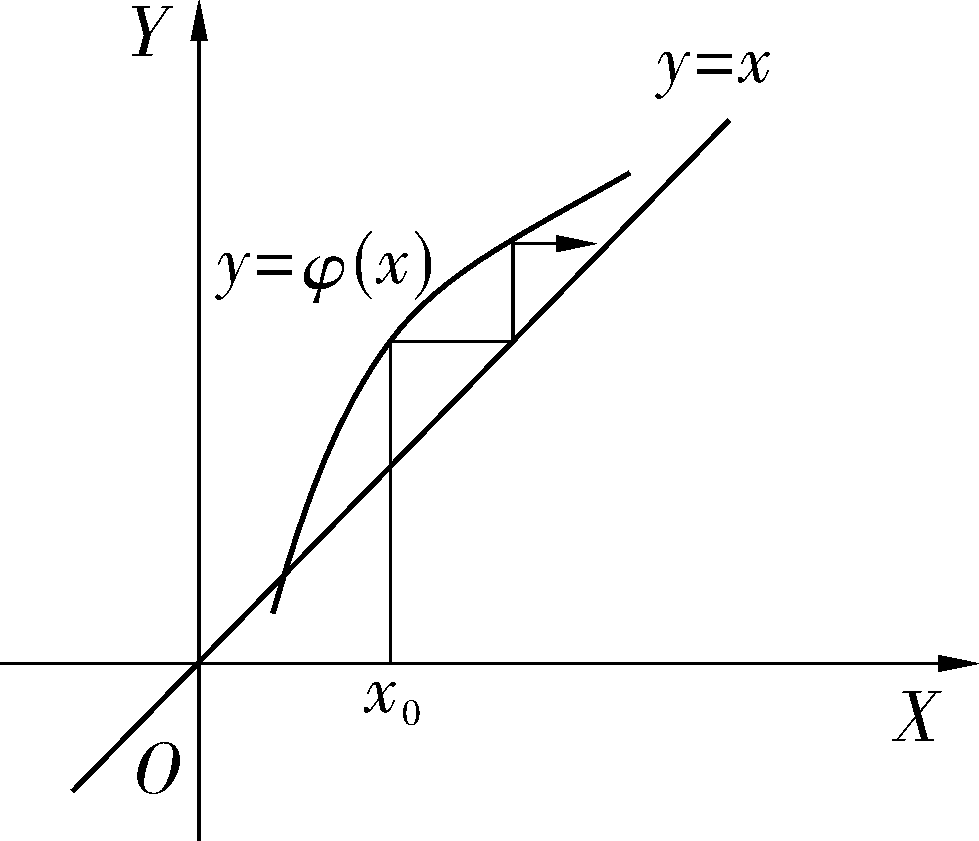

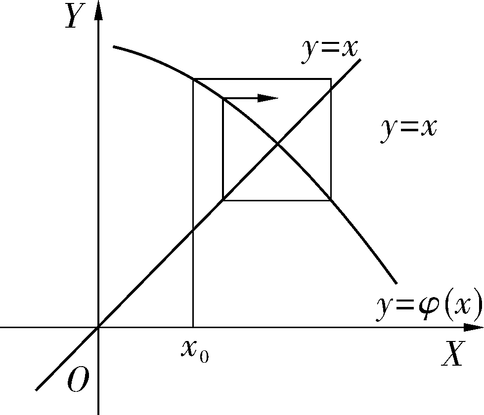

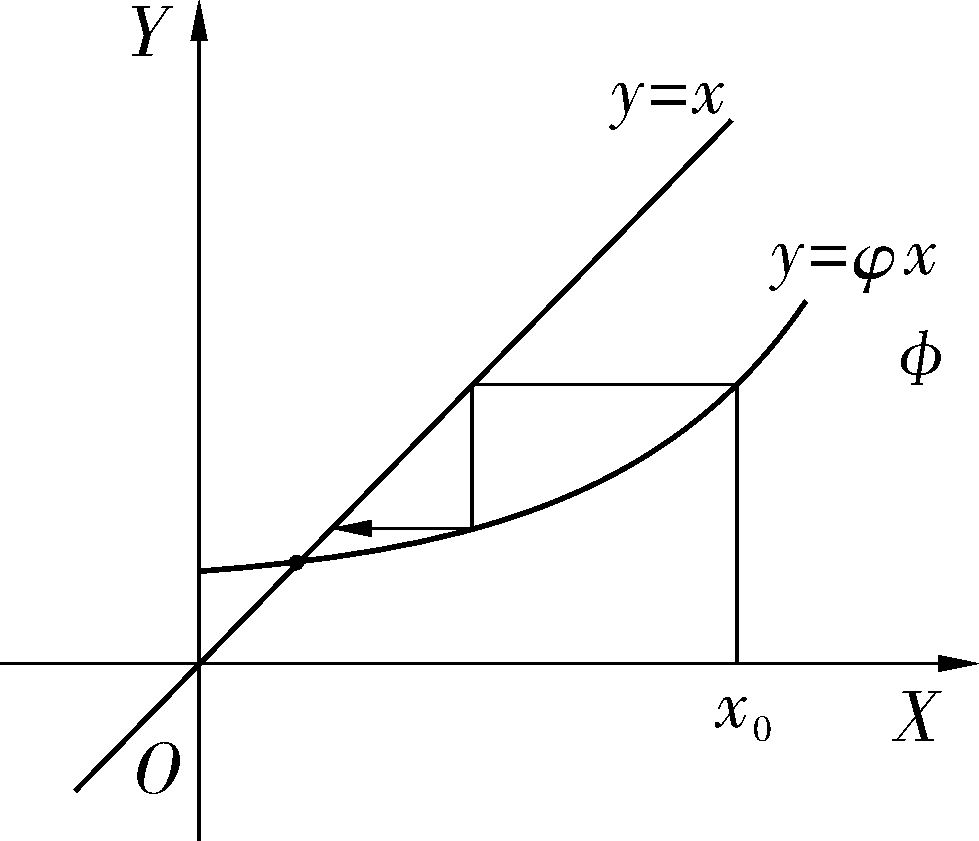

<!-- page: 155 -->

８
４
１
数值分析

k x０－x

有
xk －x

倡≤q xk －１－x

倡≤…≤q

倡

k→∞xk ＝x

倡．

所以ｌｉｍ

（２）由拉格朗日中值定理，有

xk ＋１－xk ＝φ（xk）－φ（xk －１）＝φ′（ξ）（xk －xk －１）

k x１－x０
因为
xk ＋p －xk ＝xk ＋p －xk ＋p －１＋xk ＋p －１－… －xk ＋１＋xk ＋１－xk
所以

xk ＋１－xk ≤q xk －xk －１≤…≤q

xk ＋p －xk ≤xk ＋p －xk ＋p －１
＋xk ＋p －１－xk ＋p －２
＋… ＋xk ＋１－xk

p ＋q

p ＋１－１

p －１＋… ＋１）xk ＋１－xk
＝q

≤（q

q －１
xk ＋１－xk

令p→∞，有

k

１－q xk ＋１－xk ≤
q

xk －xk －１≤…≤q

倡－xk ≤１

x１－x０

x

１－q

１－q

说明：（７畅５）式常用来估计次数，但结果偏保守，次数偏大；（７畅６）式常用来作

为程序退出的条件，即当xk －xk －１
＜ε 时退出．

定理7畅2　给定方程x ＝φ（x），若φ（x）满足：

①对任意的x∈［a，b］，有φ（x）∈Ｃ［a，b］；

②对任意的x，y∈［a，b］，有│φ（x）－φ（y）│≤q│x －y│，０≤q ＜１为常数．

则对任意的x０∈［a，b］，格式xk ＋１＝φ（xk ）生成的序列｛xk ｝收敛于x ＝φ（x）的根

倡．

x

证明与定理７畅１类似，不再重复．

注意：满足条件①和②的函数φ（x）称为区间的压缩映射．

定理７畅１可用来粗略估计格式在根的附近的收敛情况．

例7 －3　讨论例７－２的三种格式在三个根附近的收敛情况，这三个根近似

地取x１＝０畅３４７，x２＝１畅５３，x３＝－１畅８８．

３
k ＋１

解　格式一　xk ＋１＝x

３
，φ′
１（x）＝x

２

φ′
１（x１）
＝０畅１２４０９＜１
收敛

φ′
１（x２）
＝２畅３４０９＞１
不收敛

φ′
１（x３）
＝３畅５３４４＞１
不收敛

格式二　xk ＋１＝１

，φ′
２（x）＝
２x
（３－x

３－x

２）

２
k

２

φ′
１（x１）
＝０畅０８＜１
收敛

φ′
２（x２）
＝７畅０４＞１
不收敛

φ′
３（x３）
＝１３畅１６＞１
不收敛

<!-- page: 156 -->

９
４
１
７　非线性方程和非线性方程组的数值解

３３xk －１，φ′
３（x）＝１

－２

格式三　xk ＋１＝

３（３x －１）

３

φ′
３（x１）
＝８畅４１＞１
不收敛

φ′
３（x２）
＝０畅４２６＜１
收敛

φ′
３（x３）
＝０畅２８３＜１
收敛

７畅２畅４　迭代法的加速

由定理７畅１可知，若由f（x）＝０构造出的格式x ＝φ（x）收敛时，收敛速度取决

于φ′（x）的大小，当φ′（x）接近于１时，收敛可能很慢．能否从x ＝φ（x）出发构

造出新的格式，使收敛速度加快呢？下面讨论两种常用的加速方法．

７畅２畅４畅１　松弛法

已知φ（xk）与xk 同是x

倡的近似值．那么xk ＋１＝（１－ωk）xk ＋ωkφ（xk）是两个近

似值的加权平均，其中ωk 称为权重．现通过确定ωk 看能否得到加速．

因为
x ＝（１－ω）x ＋ωφ（x）＝矱（x）

令矱′（x）＝１－ω＋ωφ′（x）＝０，当φ′（x）≠１时，解得ω＝
１
１－φ′（x）．即取

ωk ＝
１
１－φ′（xk），１－ωk ＝－φ′（xk）

１－φ′（xk）时，可望获得较好的加速效果．

松弛法格式如下：

ωk ＝
１
１－φ′（xk）

（７畅７）

xk ＋１＝（１－ωk）xk ＋ωkφ（xk）

松弛法算法

　　①给定初值x０，精度ε，k ＝０．

②计算：

　　ωk ＝
１
１－φ′（xk）

　　xk ＋１＝（１－ωk）xk ＋ωkφ（xk）

③若∣｜xk ＋１－xk ｜＜ε，输出xk ＋１；否则，取k ＝k ＋１，返回②．

松弛法的加速效果是明显的．

７畅２畅４畅２　埃特金（Ａｉｔｋｅｎ）方法

松弛法要计算导数φ′（xk），使用中有时不方便，为此引入埃特金方法．

设方程x ＝φ（x），x

倡是它的准确根，x０是其近似根．取x１＝φ（x０），x２＝φ（x１）．

因为

<!-- page: 157 -->

０
５
１
数值分析

倡＝x２＋x

倡－x２＝x２＋φ′（ξ）（x

倡－x１）

x

用差商

x２－x１
x１－x０＝φ（x１）－φ（x０）

x１－x０
近似代替φ′（ξ），有

倡≈x２＋x２－x１

x１－x０（x

倡－x１）

x

倡得

解出x

倡≈x２－（x２－x１）

２

x

x２－２x１＋x０
由此得到公式

（１）
k
＝φ（xk）

x

（２）
k
＝φ（x

（１）
k
）

x

（７畅８）

（２）
k
－（x

（２）
k
－x

（１）
k
）

２

xk ＋１＝x

　（k ＝０，１，２，…）

（２）
k
－２x

（１）
k
＋xk

x

这就是埃特金公式，它的加速效果也十分明显（见例７－４）．

埃特金算法

　　①给定初值x０，精度ε，k ＝０．

②计算：

　　x

（１）
k
＝φ（xk）

　　x

（２）
k
＝φ（x

（１）
k
）

（２）
k
－（x

（２）
k
－x

（１）
k
）

２

　　xk ＋１＝x

（２）
k
－２x

（１）
k
＋xk

x

③若｜xk ＋１－xk ｜＜ε，输出xk ＋１；否则取k ＝k ＋１，返回②．

下面给出埃特金迭代算法的几何解释．

如图７－８，设x０为方程x ＝φ（x）的一个近似

根，由x

（１）
１
＝φ（x０）和x

（２）
１
＝φ（x

（１）
１
）在曲线y ＝φ

（x）上可以定出两点p０（x０，x

（１）
１
），p１（x

（１）
１
，x

（２）
１
），作

弦p０p１与直线y ＝x 交于p，则p 点的坐标x１满足

（２）
１
－x

（１）
１
x

（１）
１
－x

x１＝x

（x１－x

（１）
１
）

（１）
１
－x０

解出x１即得埃特金公式．

图７－８

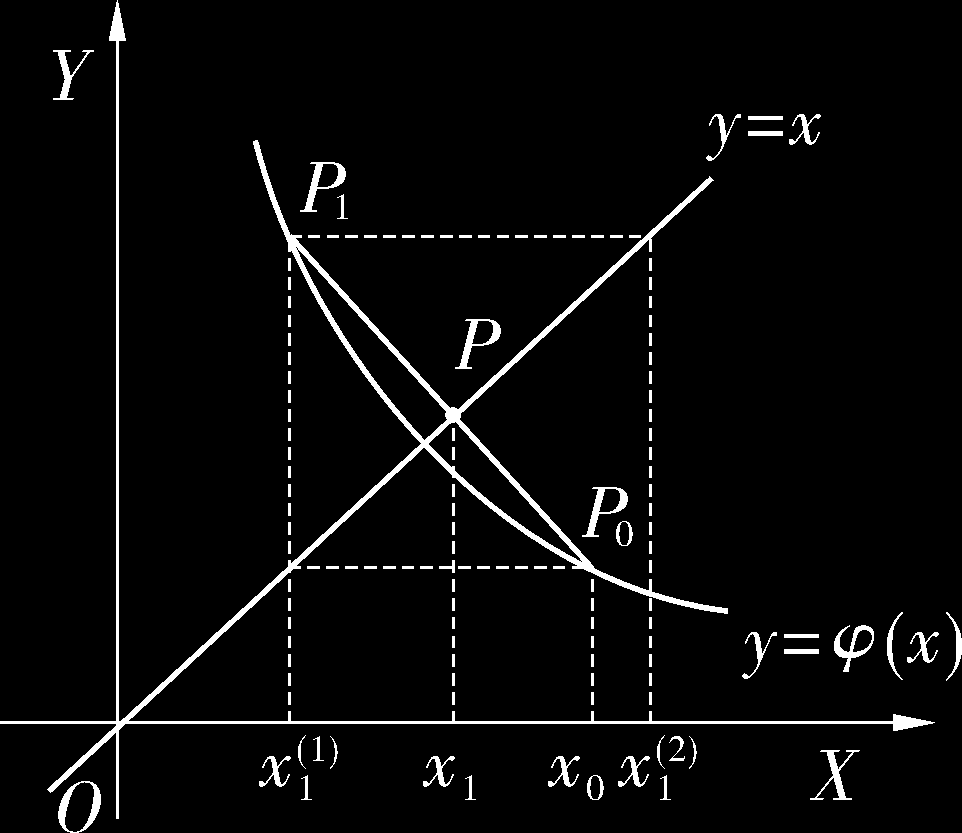

<!-- page: 158 -->

１
５
１
７　非线性方程和非线性方程组的数值解

３
k ＋１

３－３x ＋１＝０，格式xk ＋１＝x

例7 －4　解方程x

３
，用松弛法和埃特金法，取x０

＝０畅５，精确到６位小数．

３＋１

２，ωk ＝１

解　松弛法　φ（x）＝x

３
，φ′（x）＝x

．公式为

１－x

２
k

３
k ＋１

x

xk ＋１＝（１－ωk）xk ＋ωk

３

计算结果如表７－４所示．

表７－４　松弛法计算结果

k
０
１
２
３
４

xk
０畅５
０畅３３３３３３
０畅３４７２２２
０畅３４７２９６
０畅３４７２９６

ωk
１畅３３３３３３
１畅１２５０００
１畅１３７０９１
１畅１３７１５８

可见确有明显的加速效果．

３
k ＋１

（１）
k
＝x

埃特金法　x

３

（２）
k
＝（x

（１）
k
）

３＋１
３

x

（２）
k
－（x

（２）
k
－x

（１）
k
）

２

xk ＋１＝x

　（k ＝０，１，２，…）

（２）
k
－２x

（１）
k
＋xk

x

计算结果如表７－５所示．

表７－５　埃特金法计算结果

（１）
k
x

（２）
k

k
xk
x

０
０畅５
０畅３７５
０畅３５０９１１

１
０畅３４５１６１
０畅３４７０４０
０畅３４７２６５

２
０畅３４７２９６

例7 －5　对上题，取x０＝１畅５，用埃特金算法计算．

解　计算结果如表７－６所示．

<!-- page: 159 -->

２
５
１
数值分析

表７－６　埃特金法计算结果（x０＝１畅５）

（１）
k
x

（２）
k

k
xk
x

０
１畅５
１畅４５８３３３
１畅３６７１６３

１
１畅５３５０７１
１畅５３９１０２
１畅５４８６２６

２
１畅５３２１１３
１畅５３２１４５
１畅５３２２２２

３
１畅５３２０９０
１畅５３２０９２
１畅５３２０９６

４
１畅５３２０８８
１畅５３２０８７
１畅５３２０８４

５
１畅５３２０８８

７畅３　牛顿（Ｎｅｗｔｏｎ）法

７畅３畅１　牛顿公式

由于f（x）＝０是非线性方程，一般解决非线性问题较困难，而解决线性问题较

容易，故可以考虑将非线性问题线性化，采取线性化方法进行求解．把f（x）在x０作

泰勒展开，有

f（x）＝f（x０）＋f′（x０）（x －x０）＋f″（ξ）

（x －x０）＝p（x）＋f″（ξ）

（x －x０）

２！

２！

其中
p（x）＝f（x０）＋f′（x０）（x －x０）＝０

是线性方程．用p（x）＝０作为f（x）＝０的近似方程，即把求曲线f（x）＝０与X 轴交

点的横坐标近似为求直线p（x）＝０与X 轴交点的横坐标．

p（x）＝f（x０）＋f′（x０）（x －x０）＝０

的解为

f（x０）

x ＝x０－

　（设f′（x０）≠０）

f′（x０）

记　　　　　　　　x１＝x０－f（x０）

f′（x０）



xk ＋１＝xk －f（xk）

f′（xk）　（k ＝０，１，２，…）
（７畅９）

这就是牛顿法公式．

例7 －6　用牛顿法计算x

３－３x ＋１＝０在０畅５和－２附近的两个根．

解　因为f（x）＝x

３－３x ＋１，f′（x）＝３x

２－３，所以

<!-- page: 160 -->

３
５
１
７　非线性方程和非线性方程组的数值解

３
k －３xk ＋１

xk ＋１＝xk －x

３x

２
k －３

计算结果如表７－７所示．

表７－７　牛顿法计算结果

k
０
１
２
３
４

（１）
k
０畅５
０畅３３３３３３
０畅３４７２２２
０畅３４７２９６
０畅３４７２９６

x

（２）
k
－２
－１畅８８８８８９
－１畅８７９４５２
－１畅８７９３８５
－１畅８７９３８５

x

　　牛顿法实质上是一般迭代法用松弛法加速，把f（x）＝０化为等价方程x ＝

x ＋f（x）＝φ（x），对此使用松弛法：

φ′（x）＝１＋f′（x）

ωk ＝
１
１－φ′（xk）＝－
１
f′（xk）

可得牛顿法公式：

xk ＋１＝xk －f（xk）

f′（xk）

由此可知牛顿法的收敛速度应当较快，例７－６也印证了这一点．

牛顿算法

　　①给定初值x０，精度ε，k ＝０．

②计算xk ＋１＝xk －f（xk）

f′（xk）．

③若｜xk ＋１－xk ｜＜ε，输出xk ＋１；否则取k ＝k ＋１，返回②．

下面给出牛顿法的几何意义．

f（x）＝０的解就是y ＝f（x）与X 轴的交点的横

坐标．若xk 是近似解，过（xk，f（xk））作y ＝f（x）的切

线，则切线方程为

y －f（xk）＝f′（xk）（x －xk）

它与X 轴的交点横坐标是xk －f（xk）

f′（xk），如图

７－９所示．

图７－９

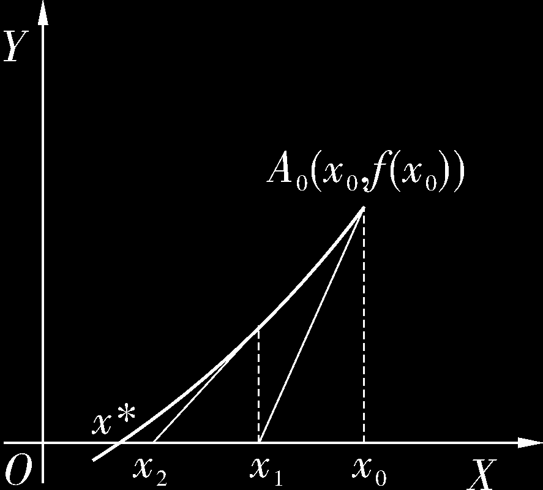

<!-- page: 161 -->

４
５
１
数值分析

７畅３畅２　牛顿法的收敛速度

迭代法的基本要求是能收敛，而迭代法的优劣取决于收敛的快慢．为了衡量收

敛序列的收敛速度，先给出收敛序列收敛阶定义．

定义7畅2　设序列｛xk｝收敛于x

倡，令ε k ＝x

倡－xk，设k→∞时，有

εk ＋１

p →c　（c ＞０为常数）

ε k

则称序列｛xk｝是p 阶收敛．当p ＝１时称线性收敛；当p ＝２时称二阶收敛（几何收

敛）；１＜p ＜２时称超线性收敛．

下面是迭代法阶收敛定理．

定理7畅3　设x

倡＝φ（x

倡），在x

倡的某个邻域R 内φ

（p）（x）连续，p ＞１是常量，

并且满足

φ

（l）（x

倡）＝０　（l ＝１，２，…，p －１）

（７畅１０）

（７畅１１）

φ

（p）（x

倡）≠０

则由xk ＋１＝φ（xk）生成的序列｛xk｝收敛于x

倡，并且序列｛xk｝是p 阶收敛．

证明　由φ′（x

倡）＝０和定理７畅１可知，xk ＋１＝φ（xk ）生成的序列｛xk ｝收敛于

倡．再由泰勒展开

x

xk ＋１＝φ（xk）＝φ（x

倡）＋φ′（x

倡）（x －x

倡）＋… ＋

φ

（p －１）（x

倡）

p －１＋φ

（p）（ξ
k）
p！
（xk －x

（xk －x

倡）

倡）

p

（p －１）！

其中ξ在xk 和x

倡之间．代入x

倡＝φ（x

倡）和条件（７畅１０）得

＝φ

（p）（ξ
k）
p！

ek ＋１

p
k

e

注意到当k→∞，xk→x

倡，从而ξ
k→x

倡，又φ

（p）（x

倡）≠０，定理得证．

下面讨论牛顿法的收敛速度．

因为牛顿法的格式为

x ＝x －f（x）

＝φ（x）

f′（x）

有
φ′（x）＝１－［f′（x）］

２－f（x）f″（x）

２
＝f（x）f″（x）

［f′（x）］

［f′（x）］

２

当f′（x

倡）≠０时，由于分子上的f（x

倡）＝０，所以φ′（x

倡）＝０．因此，牛顿法至少是

二阶收敛，即牛顿法在单根附近至少是二阶收敛的，而在重根附近，牛顿法是线性

收敛．

牛顿法的优点是收敛很快，算法简单，是常用的快速收敛法；缺点是对重根收

<!-- page: 162 -->

５
５
１
７　非线性方程和非线性方程组的数值解

敛较慢，对初值x０要求较严，要求x０相当接近真解x

倡．实际应用中，它常与其他方

法联用，先用其他方法确定初值x０，再用牛顿法提高精度．

７畅４　割线法

已知f（x）＝０的两个近似根xk，xk －１，过点（xk －１，f（xk －１））、（xk，f（xk））连一条

直线，据两点式可写出直线方程：

y －f（xk）

x －xk
＝f（xk）－f（xk －１）

xk －xk －１
把求曲线f（x）＝０与X 轴交点的横坐标近似为求直线（割线）与X 轴交点的横坐

标．即把该直线与X 轴的交点的横坐标作x

倡的新的近似值xk ＋１：

xk ＋１＝xk －
f（xk）
f（xk）－f（xk －１）（xk －xk －１）　（k ＝１，２，…）
（７畅１２）

此种方法称为割线法．

很明显，也可由牛顿法用差商f（xk）－f（xk －１）

xk －xk －１
近似代替微商f′（xk ）得到．它是

牛顿法的一种近似方法．

割线法算法

　　①给定初值x０，x１，精度ε，k ＝１．

②计算xk ＋１＝xk －
f（xk）
f（xk）－f（xk －１）（xk －xk －１）．

③若｜xk ＋１－xk ｜＜ε，输出xk ＋１；否则取k ＝k ＋１，返回②．

割线法需要两个初值x０，x１，在单根附近是超线性收敛，通过较复杂的推导可

知收敛阶p 在单根附近为１畅６１８…，收敛也相当快，而且不用计算导数值．

它的几何意义如图７－１０所示．它的收敛定

理下面直接给出．

定理7畅4　如f（x）在零点x

倡附近有连续的

２阶导数．f′（x

倡）≠０，且初值x０，x１充分接近x

倡，

则割线法收敛，收敛速度为

f″（x

倡）

０畅６１８

xk ＋１－x

倡≈

xk －x

倡
１畅６１８

２f′（x

倡）

割线法需要两个初值x０，x１，故也称为双点

图７－１０

割线法．有时为了简单起见，可只用一个初值x０，

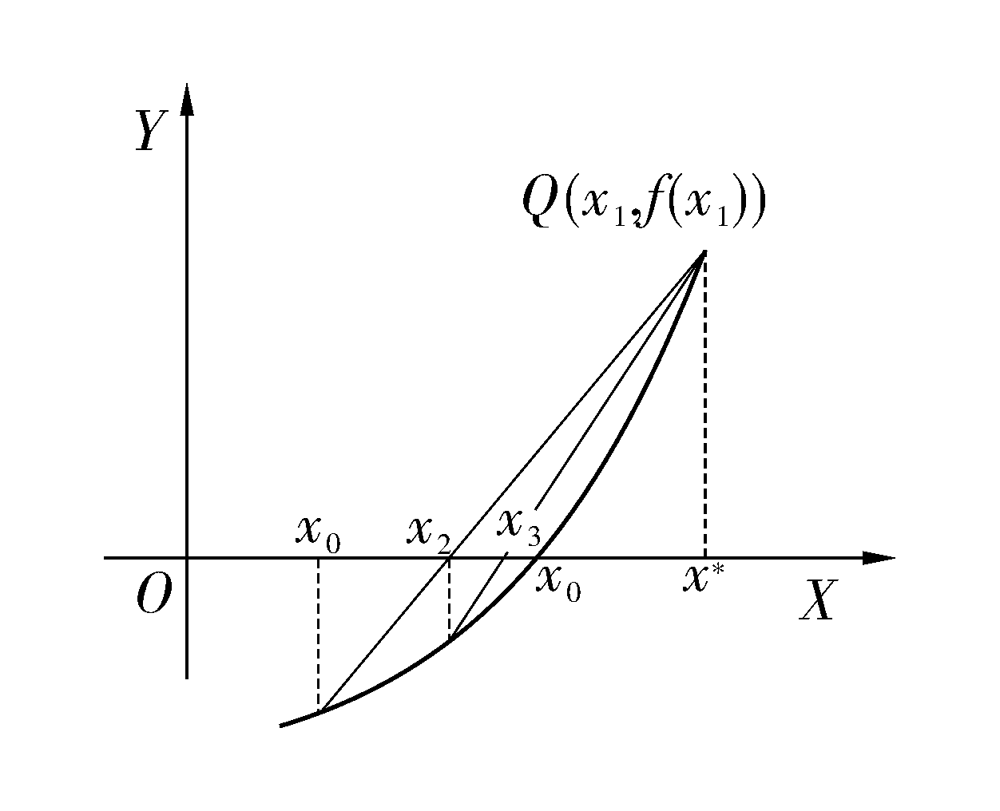

<!-- page: 163 -->

６
５
１
数值分析

称为单点割线法．单点割线法如下：

xk ＋１＝xk －
f（xk）
f（xk）－f（x０）（xk －x０）　（k ＝１，２，…）

例7 －7　用双点割线法求x

３－３x ＋１＝０在０畅５附近的根，精确到小数点后第

六位．

３－３x ＋１＝０，xk ＋１＝xk －
f（xk）
f（xk）－f（xk －１）（xk －xk －１）（k ＝１，２，…）．

解　f（x）＝x

取x０＝０畅５，x１＝０畅２，计算结果如表７－８所示．

表７－８　割线法计算表

k
１
２
３
４
５

xk －１
０畅５
０畅２
０畅３５６３２２
０畅３４７７３１
０畅３４７２９５

xk
０畅２
０畅３５６３２２
０畅３４７７３１
０畅３４７２９５
０畅３４７２９６

７畅５　解非线性方程组的迭代法和牛顿法

解一元非线性方程的迭代法和牛顿法可以推广到多元．本节简单介绍解非线

性方程组的迭代法和牛顿法．

n 个未知数n 个方程的非线性方程组可表示为

f１（x１，x２，…，xn）＝０

f２（x１，x２，…，xn）＝０

（７畅１３）

　　　　　　　

fn（x１，x２，…，xn）＝０

其中X ＝（x１，x２，…，xn）

Ｔ为n 维列向量；fi（X）（i ＝１，２，…，n）中至少有一个是X 的

非线性函数，并假设自变量和函数值都是实数．

７畅５畅１　迭代法

记

F（X）＝［f１（X），f２（X），…，fn（X）］

Ｔ

则方程组（７畅１３）可简写为

F（X）＝０
（７畅１４）

显然，函数F（X）的值也是n 维列向量．多元非线性方程组（７畅１４）与一元非线

性方程f（x）＝０具有相同的形式，可以与一元函数一样讨论它的解法，例如迭代法

和牛顿法．

下面叙述迭代法．首先把方程组（７畅１４）转换成等价方程组

<!-- page: 164 -->

７
５
１
７　非线性方程和非线性方程组的数值解

X ＝Φ（X）
（７畅１５）

其中
Φ（X）＝［φ１（X），φ２（X），…，φn（X）］

Ｔ

并构造格式

（k ＋１）＝Φ（X

（k））　（k ＝０，１，２，…）
（７畅１６）

X

（０），若由此生成的序列收敛，如ｌｉｍ

（k）＝X

倡，则X

倡满足X

倡

对于给定的初始点X

k→∞X

＝Φ（X

倡），即X

倡是方程组（７畅１４）的解．

非线性方程组的算法

　　①给定初值X

（０），精度ε，k ＝１．

②计算X

（k ＋１）＝Φ（X

（k））．

③X

（k）
＜ε，输出X

（k ＋１）；否则取k ＝k ＋１，返回②．

（k ＋１）－X

n 中集合M 称为闭集，是指M 中的任一个向量序列｛X

定义7畅3　R

（k）｝，若

（k）→X

倡（即‖x

（k）－x

倡‖→０），则x

倡∈R

n．

X

定义7畅4　设Φ（X）＝［φ１（X），φ２（X），…，φn（X）］

Ｔ是一个n 维列向量函数，

n 中的子集合，若满足：

M 是R

①X∈M痴Φ（X）∈M；

②存在常数q，０≤q ＜１，使M 中任意X，Y，满足

‖Φ（X）－Φ（Y）‖≤q‖X －Y‖

则称Φ（X）为M上的压缩映射．

类似于一元函数，有下面压缩映射定理．

定理7畅5　若Φ（X）为闭集M 上的压缩映射，则X ＝Φ（X）在M 上有惟一解．

（０）∈M，由格式X

（k ＋１）＝Φ（X

（k））产生的向量序列｛X

（k）｝收敛于这个解．

且对任意X

例7 －8　设有非线性方程组

２
１－１０x１＋x

２
２＋８＝０

x

（７畅１７）

２
２＋x１－１０x２＋８＝０

x１x

把它写成等价形式

x１＝φ１（x１，x２）＝１

１０（x

２
１＋x

２
２＋８）

x２＝φ２（x１，x２）＝１

１０（x１x

２
２＋x１＋８）

并由此构造格式

（k）
２
）＝１

（k ＋１）
１
＝φ１（x

（k）
１
，x

１０［（x

（k）
１
）

２＋（x

（k）
２
）

２＋８］

x

（k ＝０，１，２，…）
（７畅１８）

（k）
２
）＝１

（k ＋１）
２
＝φ２（x

（k）
１
，x

１０［x

（k）
１
（x

（k）
２
）

２＋x

（k）
１
＋８］

x

<!-- page: 165 -->

８
５
１
数值分析

（０）＝（０，０）

Ｔ，计算结果如表７－９所示．可见迭代收敛到方程组（７畅１７）

取初始点X

倡＝（１，１）

Ｔ．

的解X

表７－９　计算结果

k
０
１
２
…
１８
１９

（k）
１
０畅０
０畅８
０畅９２８０
…
０畅９９９９９９９７２
０畅９９９９９９９８９

x

（k）
２
０畅０
０畅８
０畅９３１２
…
０畅９９９９９９９７２
０畅９９９９９９９８９

x

７畅５畅２　牛顿法

对于非线性方程组，也可以构造类似于一元方程的牛顿法，而且同样具有二次

局部收敛性．首先介绍多元收敛阶的定义．

n 收敛到X

定义7畅5　设序列｛X

（k）｝

∞
k ＝０炒R

倡，若有常数p≥１和c ＞０，使得

‖X

倡‖
‖X

（k ＋１）－X

p ＝c

ｌｉｍ
k→∞

（k）－X

倡‖

则称p 为该序列的收敛阶．当p ＝１时称为线性收敛；当p ＞１时称为超线性收敛；

当p ＝２时称为二次收敛或平方收敛．

倡是方程组（７畅１３）的解，X

（k）是某个值．用点X

（k）处的一阶泰勒展开近似

设X

每一个分量函数值fi（X

倡）＝０，有

抄fi（X

（k））
抄xj
（x

n

（k））＋∑

０＝fi（X

倡）≈fi（X

倡
j
－x

（k）
j
）　（i ＝１，２，…，n）

j ＝１

或按方程组（７畅１４）用矩阵和向量表示为

０＝F（X

倡）≈F（X

（k））＋F′（X

（k））（X

倡－X

（k））
（７畅１９）

其中函数F（X）的导数

抄f１（X）

抄f１（X）

抄x２
…
抄f１（X）

抄x１

抄xn

磹f１（X）

Ｔ

抄f２（X）

抄f２（X）

抄x２
…
抄f２（X）

磹f２（X）

Ｔ

抄x１

抄xn

F′（X）＝

＝

　　





磹fn（X）

Ｔ

抄fn（X）

抄fn（X）

抄x２
…
抄fn（X）

抄x１

抄xn

F′（X）称为函数F（X）的Ｊａｃｏｂｉ矩阵．若矩阵F′（X

（k））非奇异，则可从（７畅１９）中解

出近似值，并把它作为下一次值．于是得到牛顿格式：

（k ＋１）＝X

（k）－F′（X

（k））

－１F（X

（k））　（k ＝０，１，２，…）
（７畅２０）

X

其中，X

（０）是给定的初始值．

<!-- page: 166 -->

９
５
１
７　非线性方程和非线性方程组的数值解

非线性方程组的牛顿算法

　　①给定初值X

（０），精度ε，k ＝１．

②计算X

（k ＋１）＝X

（k）－F′（X

（k））

－１F（X

（k））．

③X

（k）
＜ε，输出X

（k ＋１）；否则，取k ＝k ＋１，返回②．

（k ＋１）－X

牛顿法的收敛性，可归为迭代法来讨论．它的迭代函数是：

Φ（X）＝X －F′（X）

－１F（X）

定理7畅6　对于函数F∶D炒R

n→R

n．设X

倡∈D 满足F（X

倡）＝０．若有X

倡的

开邻域S０炒D，F′（X）在其上存在并连续，而且F′（X

倡）非奇异，则存在X

倡的闭球

S ＝S（X

倡，δ）炒S０（其中δ ＞０）

（１）牛顿函数Φ（X）对所有X∈S 有定义，并且Φ（X）∈S．

（２）对于任何初值X

（０）∈S，牛顿序列｛X

（k）｝超线性收敛于X

倡．

（３）若有常数q ＞０，使得

F′（X）－F′（X

倡）≤q X －X

倡

橙X∈S，则牛顿序列｛X

（k）｝至少二阶收敛于X

倡．

例7 －9　用牛顿法求解例７－８中的方程组（７畅１７）．

解　此例的函数F（X）和它的导数F′（X）分别为

２x１－１０
２x２

２
１－１０x１＋x

２
２＋８

x

F（X）＝

　　F′（X）＝

２
２＋１
２x１x２－１０

２
２＋x１－１０x２＋８

x

x１x

（０）＝（０，０）

Ｔ，用牛顿法公式（７畅２０），计算结果如表７－１０．

取初值X

表７－１０　计算结果

k
０
１
２
３
４

（k）
１
０畅０
０畅８０
０畅９９１７８７２２
０畅９９９９７５２２９
１畅０００００００００

x

（k）
２
０畅０
０畅８８
０畅９９１７１１７３７
０畅９９９９６８５２４
１畅０００００００００

x

可见，牛顿法的收敛速度比例７－８中的迭代法（７畅１８）式要快．

练习与思考

１．用对分法求下列方程的根，要求绝对误差限０畅００５．

（１）x

３－x ＋４＝０，求根区间为（－２，－１）；

（２）２x ＝ｅ

－x，求根区间为（０，１）．

２．举出对分法不能求偶数重根的例子．

３．用对分法搜索方程６x

３－４x －１＝０的实根分布情况，初始搜索区间为

<!-- page: 167 -->

０
６
１
数值分析

（－２，２），并求出（０，１）中的根，精确到０畅０１．

４．证明方程f（x）＝５x

２－１２０x ＋３０＝０在区间［０，１］中有惟一实根．并验证下

面两种格式的收敛性：

（１）x ＝φ１（x）＝５x

２－１１９x ＋３；

（２）x ＝φ２（x）＝５x

３＋３
１２０．

５．若φ（x）∈c［a，b］，且a≤φ（x）≤b，证明方程x ＝φ（x）在［a，b］上有惟一解．

６．用迭代法求x

３－２x －５＝０的正根．下面有三种格式：

３－５

（１）x ＝x

２
；

（２）x ＝５

２－２；

x

３２x ＋５．

（３）x ＝

判别它们的收敛情况．

７．证明方程x ＝φ（x）＝１

x ＋４在（－∞，＋∞）上有惟一解．且对任意x０∈

（－∞，＋∞），迭代法收敛．

８．用迭代法求x ＝ｃｏｓx 的正根，收敛较慢．试用埃特金方法加速收敛，求此根

到４位小数，并与迭代法的速度比较．

９．写出牛顿法的格式，并用牛顿法计算：

（１）不开平方计算
１０，精确到５位小数；

（２）方程x

３－x －１＝０在１畅３附近的根，精确到５位小数．

１０．用割线法解方程６x

３－４x －１＝０，取初值x０＝１，x１＝１畅３，精确到５位小数．

１１．给定方程f（x）＝０，取格式为x ＝x ＋cf（x），其中c 为非零常数．若f（a）＝

０，f′（a）≠０，求使f（x）收敛于a，c 的取值范围是多少？

１２．用迭代法解方程组

２
１－１０x１＋x

２
２＋２３＝０

x

２
２＋x１－１０x２＋２＝０

x１x

取x０＝３畅８，y０＝０畅９，迭代两次．

１３．用牛顿法解方程组

２＋y

２－１＝０

x

２－y ＝０

x

取x０＝０畅８，y０＝０畅６，迭代两次．

<!-- page: 168 -->

８　矩阵特征值和特征向量的数值解法

设A 是n ×n 矩阵，如果存在数λ和n 维非零向量x，满足Ax ＝λx，则称λ为

矩阵A 的一个特征值，x 称为与λ对应的特征向量．

本章讨论几种常用的计算矩阵特征值及特征向量的数值方法，包括幂法、反幂

法、Ｊａｃｏｂｉ法和ＱＲ法，这里假设A 是实矩阵．

８畅１　幂法

８畅１畅１　幂法概述

幂法主要用于求矩阵按模最大的特征值和对应的特征向量．

设A 具有n 个线性无关的特征向量x１，x２，…，xn，其相应的特征值λ１，λ２，…，

λn 满足

｜λ１｜＞｜λ２｜≥｜λ３｜≥…≥｜λn ｜
（８畅１）

现任取一个非零向量μ０，令

μk ＝Aμk －１　（k ＝１，２，…）
（８畅２）

得向量序列｛μk｝，k ＝０，１，２，…．因为x１，x２，…，xn 线性无关，故n 维向量μ０可由

它们线性表示为

μ０＝a１x１＋a２x２＋… ＋anxn

所以
μk ＝Aμk －１＝A

２μk －２＝… ＝A

kμ０

＝a１A

kx１＋a２A

kx２＋… ＋anA

kxn

＝a１λ

k
１x１＋a２λ

k
２x２＋… ＋anλ

k
nxn

λ２
λ１

λn
λ１

k

k

＝λ

k
１a１x１＋a２

x２＋… ＋an

xn
（８畅３）

设a１≠０，因为λ２

＜１，…，λn

＜１，当k 充分大时，有μk ≈λ

k
１a１x１，且为非零

λ１

λ１

向量，所以μk 可近似地作为λ１对应的特征向量．

实际计算时，为防止μk 的模过大或过小产生的计算机运算的上下溢出，通常

每次迭代都对μk 进行归一化，使‖μk‖
∞＝１．因此，幂法公式改进为

yk －１＝
μk －１
‖μk －１‖
∞

<!-- page: 169 -->

２
６
１
数值分析

μk ＝Ayk －１　（k ＝１，２，…）
（８畅４）

由迭代公式知

２μk －２
‖μk －２‖
∞
Aμk －２
‖μk －２‖
∞
∞

A

μk ＝Aμk －１

‖μk －１‖
∞＝

２μk －２
‖Aμk －２‖
∞＝… ＝
A

kμ０
‖A

＝A

（８畅５）

k －１μ０‖
∞

对比（８畅３）式和（８畅５）式，可知（８畅５）式中的μk 仍收敛于A 的对应于λ１的特

征向量．

当k 相当大时，μk 和μk －１都可视为λ１对应的特征向量．由

μk ＝A
μk －１
‖μk －１‖
∞
（８畅６）

有

μk －１
‖μk －１‖
∞
（８畅７）

μk ＝λ１

‖μk‖
∞＝｜λ１｜‖μk －１‖
∞
‖μk －１‖
∞＝｜λ１｜

故｜λ１｜就是‖μk‖
∞，剩下的问题是确定λ１的符号．‖μk‖
∞是μk的各分量中绝对值

最大者．设μk和μk －１的绝对值最大的分量为ak 和ak －１，由（８畅７）式可得

ak －１
‖μk －１‖
∞

a k ＝λ１

解得
λ１＝a k

ak －１‖μk －１‖
∞

ｓｇｎ（λ１）＝ｓｇｎ
ak
ak －１

（８畅８）

即当按（８畅４）式迭代时，发现‖μk‖
∞稳定后，取｜λ１｜＝‖μk‖
∞，而λ１的符号由

如下原则确定：当相邻两次的μk和μk －１对应分量符号相同，λ１的符号为正；否则为

负．

<!-- page: 170 -->

３
６
１
８　矩阵特征值和特征向量的数值解法

幂法算法：

　　给定n ×n 矩阵A，精度ε，任取非零向量μ０，对k ＝１，２，…，执行以下各步骤：

①设｜ar ｜＝ｍａｘ

１≤i≤n｜ai ｜，其中ai 是μk －１＝（a１，a２，…，an）

Ｔ的各分量．

②yk －１＝μk －１／｜ar ｜．

③μk ＝Ayk －１．

④tk ＝ｓｇｎ（ar）×（μk）r．

⑤若｜tk －tk －１｜＜ε，令λ１＝tk，x１＝yk －１，退出运算；否则返回①．

例8 －1　求矩阵A 按模最大的特征值λ１和相应的特征向量．

１
－１
２

A ＝

－２
０
５

６
－３
６

解　计算结果见表８－１所示．

表８－１　计算结果

k
μ

Ｔ
k
y

Ｔ
k
tk

０
１畅０００
１畅０００
１畅０００
１畅０００
１畅０００
１畅０００

１
２畅０００
３畅０００
９畅０００
０畅２２２２
０畅３３３３
１畅０００
９

２
１畅８８９
４畅５５６
６畅３３３
０畅２９８２
０畅７１９３
１畅０００
６畅３３３

３
１畅５７９
４畅４０４
５畅６３２
０畅２８０４
０畅７８１９
１畅０００
５畅６３２

４
１畅４９８
４畅４３９
５畅３３６
０畅２８０８
０畅８３１９
１畅０００
５畅３３６










１０
１畅３９３
４畅４４４
５畅０１３
０畅２７７９
０畅８８６５
１畅０００
５畅０１３

１１
１畅３９１
４畅４４４
５畅００８
５畅００８

所以λ１≈５畅００８，x１≈（０畅２７７９，０畅８８６５，１）

Ｔ．故精确解为λ１＝５，x１＝（０畅２７７８，

０畅８８８９，１）

Ｔ．

８畅１畅２　幂法的几点说明

以上推导过程中做了一些假设，当这些假设不成立时，幂法会出现一些复杂情

况，以下简单说明之．

（１）假设A 具有完全的特征向量系，即A 具有n 个线性无关的特征向量．当A

不具有n 个线性无关的特征向量时，幂法不适用．但事先往往无法判断这一点，因

<!-- page: 171 -->

４
６
１
数值分析

此在运用幂法时，如发现不收敛情况，要考虑此种可能．

（２）在（８畅３）式中假设a１≠０，这在选择μ０时也无法判断，但这往往不影响幂

法的成功使用．因为若选μ０，使a１＝０，由于舍入误差的影响，在迭代某一步会产生

μk，它在x１方向上的分量不为零，以后的迭代仍会收敛．

（３）假设了｜λ１｜＞｜λ２｜≥｜λ３｜≥…≥｜λn ｜．若不具备此条件，可能出现的情况

有：

①λ１＝λ２＝… ＝λｒ，｜λ１｜＞｜λｒ＋１｜≥｜λｒ＋２｜≥…≥｜λn ｜；

②λ１＝－λ２；

③λ１和λ２为共轭复数λ１＝λ２．

对情况①，归一化幂法（８畅４）式仍适用，但选择不同的μ０得到的特征向量μk
是不同的；对情况②和③较复杂，（８畅４）式得到的序列不收敛．

８畅２　反幂法

８畅２畅１　反幂法概述

反幂法用于求A 的按模最小的特征值．由于Axi ＝λixi，推得

－１xi ＝１

A

λi xi

若有｜λ１｜≥｜λ２｜≥…≥｜λn －１｜＞｜λn ｜，则１

－１的按模最大的特征值，因此只要

λn是A

－１的按模最大的特征值，也就求出了A 的按模最小的特征值．这就是

用幂法求出A

反幂法．

这样，反幂法的迭代公式变为μk ＝A

－１yk －１．但要先求逆阵A

－１，计算麻烦．为

了避免求逆阵，由于Aμk ＝yk －１，可知每迭代一次，要解一次方程组，即对任意初始

向量μ０≠０，计算

yk －１＝
μk －１
‖μk －１‖
∞

（８畅９）

Aμk ＝yk －１　（k ＝１，２，…）

解出μk．为解方程组，先把A 作ＬＵ分解．下面是反幂法算法．

<!-- page: 172 -->

５
６
１
８　矩阵特征值和特征向量的数值解法

反幂法算法

　　①对A 进行ＬＵ分解，求出L，U．

②对任意非零向量μ０，k ＝１，２，…，执行

ａ）｜aｒ｜＝ｍａｘ

１≤i≤n｜ai ｜，ai 是μk －１＝（a１，a２，…，an）

Ｔ的分量；

ｂ）yk －１＝μk －１

｜aｒ｜；

Lxk －１＝yk －１

ｃ）解

得到uk；

Uμk ＝xk －１

ｄ）tk ＝ｓｇｎ（aｒ）

（μk）ｒ；

ｅ）当｜tk －tk －１｜＜ε，令λn ＝tk，xn ＝yk －１，退出运算；否则返回ａ）．

例8 －2　求例８－１中矩阵A 的按模最小特征值及相应的特征向量．

解　把A 作ＬＵ分解得

１
０
０

１
－１
２

L ＝

－２
１
０

　　U ＝

０
－２
９

６
－１畅５
１

０
０
７畅５

计算结果如表８－２所示．

表８－２　计算结果

Ｔ
k －１
tk

k
y

１
１畅０００
１畅０００
１畅０００
－０畅５５５６

２
－０畅３７０４
－１畅０００
－０畅３７００６
－１畅６２６

３
０畅５８２２
１
－０畅０９２３４
－０畅７７７６







８
－０畅４９９２
－１
－０畅００１２８３
－１畅００３

９
０畅５００３
１
－０畅０００４９２４
－０畅９９９０

１０
－０畅５０００
－１
－０畅０００１８５４
－１畅０００

取λ３≈t１０＝－１畅０００，得x３≈y９＝（－０畅５００３，１，－０畅０００４９２４）

Ｔ．其精确解为

λ３＝－１，x ＝（－０畅５，－１，０）

Ｔ．

８畅２畅２　原点平移加速

由于幂法的收敛速度主要由比值λ２

确定，当这个比值接近１，即｜λ１｜和｜λ２｜

λ１

<!-- page: 173 -->

６
６
１
数值分析

很接近时，收敛将极慢．针对这一情况，一个加速的方法是原点平移．

设矩阵B ＝A －tI，t 为选择的平移量，I 为单位阵．

设A 的特征值为λ１，λ２，…，λn，则B 的特征值为λ１－t，λ２－t，…，λn －t，且A，

B 的特征向量相同．

适当选择t，使λ１－t 仍是B 的按模最大特征值，且

λ２－t
λ１－t
＜λ２

λ１

这时对B 用幂法求λ１－t，比直接对A 求λ１要快．而求出λ１－t 自然也就求出了

λ１．

问题的关键在于如何选择合适的t，以便既能较明显提高收敛速度，又不至于

求出的是另一个特征值．不妨设A 的特征值都是实数，且λ１＞λ２≥…≥λn －１＞λn．

显然，不论如何选t，B 的按模最大特征值要么是λ１－t，要么是λn －t．这时，选择t

应满足

｜λ１－t ｜≥｜λn －t ｜；

ｍａｘ
｜λ２－t ｜
｜λ１－t ｜，｜λn －t ｜

｜λ１－t ｜＝ｍｉｎ．

显然，当λ２－t ＝－（λn －t），即t ＝λ２＋λn

２
时，收敛速度最快．但是，λ２与λn 事

先是未知的，故以上结论只有理论上的意义．实际上，若λ１是正值，取t 是一个小

的正数，若λ１是负值，取t 为一绝对值较小的负数，常能达到加速的目的，但不排

除求得的是另一特征值的可能．若A 的特征值全为实数时，适当调整选择，用幂法

可以求出特征值的上下界．

在反幂法中也可结合原点平移，除可能得到加速效果外，耐心反复调整t，可能

求得A 的全部实特征值．

８畅２畅３　求已知特征值的特征向量

反幂法可求出实矩阵按模最小的特征值，但反幂法的主要用途是已知某近似

特征值后，求对应的特征向量，并改进此特征值的精度．

若已知A 的某一特征值λm 的近似值λ′
m ，一般说总有

｜λm －λ′
m ｜＝ｍｉｎ｜λi －λ′
m ｜

按原点平移法的思想，取t ＝λ′
m ，作B ＝A －λ′
m I，则B 的按模最小的特征值

是λm －λ′
m ，对应的特征向量则与A 的对应λm 的特征向量相同．

对B 作反幂法：

取初始向量z０，作迭代

<!-- page: 174 -->

７
６
１
８　矩阵特征值和特征向量的数值解法

Byk ＝zk －１

mk ＝ｍａｘ（yk）

（８畅１０）

zk ＝yk ／mk　（k ＝１，２，…）

其中ｍａｘ（yk）表示yk 的绝对值最大的分量．

当Byk ＝zk －１时，也可先对B 作ＬＵ分解，以免重复分解工作．于是有

ｌｉｍ
k→∞mk ＝
１
λm －λ′
m

ｌｉｍ
k→∞zk ＝
xm
ｍａｘ（xm ）

xm 是λm 对应的特征向量．收敛速度为λm －λ′
m
λp －λ′
m

，下标p 的选取原则是使

｜λp －λ′
m ｜＝ｍｉｎ

i≠m ｜λi －λ′
m ｜，这个比值一般很小，所以迭代收敛很快．当k 较大时，取

xm≈zk，λm ≈λ′
m ＋１

mk
反幂法收敛快，精度高，是已知特征值的近似值时，求特征向量的最有效的方

法，常作其他求特征值方法的一个补充方法．

例8 －3　已知

－１
２
１

A ＝

２
－４
１

１
１
－６

其中一个近似的特征值为－６畅４２（精确值为－６畅４２１０７），求其特征向量并改进此

特征值解．

５畅４２
２
１

解　B ＝A －（－６畅４２）I ＝

２
２畅４２
１

１
１
０畅４２

１
０
０

５畅４２
２
１

＝

０畅３６９００３
１
０

０
１畅６８１９９３
０畅６３０９９３

０畅１８４５０２
０畅３７５１４８
１

０
０
－０畅００１２１８８５

１
０
０

５畅４２
２
１

所以　L ＝

０畅３６９００３
１
０

　U ＝

０
１畅６８１９９３
０畅６３０９９３

０畅１８４５０２
０畅３７４１４８
１

０
０
－０畅００１２１８８５

取任一个初始向量y１＝（１，１，１）

Ｔ：

第一次迭代：Lx１＝z１，得x１＝（１，０畅６３０９９７，０畅５７８７８１）

Ｔ．

Uy２＝x１，得y２＝（２０畅７４１１，１６８畅８９０，－４４９畅１９７）

Ｔ．

<!-- page: 175 -->

８
６
１
数值分析

m２＝－４４９畅１９７，z２＝y２

m２＝（－０畅０４６１７３７，－０畅３７５９８２，１）

Ｔ．

第二次迭代：Lx２＝z２，得x２＝（－０畅０４６１７３７，－０畅３５８９４４，１畅１４１５１４）

Ｔ．

Uy３＝x２，得y３＝（４３畅２１８８，３５１畅１３０，－９３６畅５５２）

Ｔ．

m３＝９３６畅５５２，z３＝（－０畅０４６１４６７，－０畅３７４９１８，１）

Ｔ．

于是特征值

λ≈λ′＋１

m３＝－６畅４２＋（－０畅００１０６７）＝－６畅４２１０７

特征向量是z３，精度很高，所有有效数字都是准确的．可见，反幂法是求已知特征值

的特征向量和改进此特征值的有力工具．

８畅３　雅可比（Ｊａｃｏｂｉ）方法

雅可比方法用于求实对称矩阵的全部特征值和对应的特征向量．要用到线性

代数的如下结论：

（１）An ×n实对称，则A 的特征值全为实数，它们对应的特征向量线性无关且两

两正交．

（２）相似矩阵具有相同的特征值．

（３）An ×n实对称，则存在正交阵U，使U

ＴAU ＝D，D 是一个对角阵．这时，D 的

对角元λ１，…，λn 就是A 的特征值，U 的第i 列向量就是λi 对应的特征向量．

雅可比方法就是基于以上原理，用一系列的正交变换逐步消去A 的非对角

元，使A 对角化，从而求得A 的全部特征值．

８畅３畅１　平面旋转矩阵

在平面解析几何中二次曲线的标准化和线性代数的二次型标准化中，已接触

过旋转矩阵：

U ＝ｃｏｓθ
－ｓｉｎθ

ｓｉｎθ
ｃｏｓθ

不难验证它是正交矩阵．

对二阶对称矩阵

a１１
a１２

A ＝

a１２
a２２

a１１
a１２

ＴAU ＝
ｃｏｓθ
ｓｉｎθ

ｃｏｓθ
－ｓｉｎθ

U

－ｓｉｎθ
ｃｏｓθ

ｓｉｎθ
ｃｏｓθ

a１２
a２２

<!-- page: 176 -->

９
６
１
８　矩阵特征值和特征向量的数值解法

２θ ＋a１２ｓｉｎ２θ
（a２２－a１１）ｓｉｎ２θ

２θ ＋a２２ｓｉｎ

２
＋a１２ｃｏｓ２θ

a１１ｃｏｓ

＝

（a２２－a１１）ｓｉｎ２θ

２
＋a１２ｃｏｓ２θ
a１１ｓｉｎ

２θ ＋a２２ｃｏｓ

２θ －a１２ｓｉｎ２θ

只要选取θ 满足（a２２－a１１）ｓｉｎ２θ

２
＋a１２ｃｏｓ２θ ＝０，就能使上述矩阵变成对角阵，

从而求得A 的特征值．

从上式解出θ 应满足：

ｔａｎ２θ ＝－２a１２

a２２－a１１＝２a１２

a１１－a２２
A 的特征值为

λ１＝a１１ｃｏｓ

２θ ＋a２２ｓｉｎ

２θ ＋a１２ｓｉｎ２θ

λ２＝a１１ｓｉｎ

２θ ＋a２２ｃｏｓ

２θ －a１２ｓｉｎ２θ

对应的特征向量为

U１＝（ｃｏｓθ，ｓｉｎθ）

Ｔ

U２＝（－ｓｉｎθ，ｃｏｓθ）

Ｔ

对二阶对称矩阵，只有一对非对角元素，所以只需一次旋转就能求得特征值．

当n≥３时，情况要复杂一些，但仍可作如下类似的讨论．

设A 是n 阶对称矩阵，其中非对角元apq≠０（p≠q）．现把它变为零元素，做变

换

xp ＝ypｃｏｓθ －yqｓｉｎθ

xq ＝ypｓｉｎθ ＋yqｃｏｓθ

xk ＝yk　（k ＝１，２，…，n；k≠p，q）

写成矩阵形式为

x１

y１

y１

１







筹

ｃｏｓθ
…
－ｓｉｎθ

xp

yp

yp

＝


筹


＝Upq（θ）







ｓｉｎθ
…
ｃｏｓθ

xq

yq

yq

筹







１

xn

yn

yn

记其中的变换矩阵为Upq（θ）．容易验证：

Ｔ
pq（θ）Upq（θ）＝In

U

记
B ＝U

Ｔ
pq（θ）AUpq（θ）＝（bij）n ×n

<!-- page: 177 -->

０
７
１
数值分析

与二阶情况类似，只要适当选择θ，可将A 中的apq化为零元素，此时有

bpj ＝apjｃｏｓθ ＋aqjｓｉｎθ
（j≠p，q）

bqj ＝－apjｓｉｎθ ＋aqjｃｏｓθ
（j≠p，q）

bip ＝aipｃｏｓθ ＋aiqｓｉｎθ
（i≠p，q）

（８畅１１）

biq ＝－aipｓｉｎθ ＋aiqｃｏｓθ
（i≠p，q）

bij ＝aij
（i，j≠p，q）

bpp ＝appｃｏｓ

２θ ＋a qqｓｉｎ

２θ ＋２apqｓｉｎθｃｏｓθ

bqq ＝appｓｉｎ

２θ ＋aqqｃｏｓ

２θ ＋２apqｓｉｎθｃｏｓθ

（８畅１２）

（aqq －app）ｓｉｎ２θ

bpq ＝

＋apqｃｏｓ２θ

２

选择θ，使bpq ＝０，即

（aqq －app）ｓｉｎ２θ

＋apqｃｏｓ２θ ＝０

２

得

２apq

ｔａｎ２θ ＝

（８畅１３）

a pp －aqq

为避免分母为零，同时避开求反三角函数及求ｓｉｎθ 和ｃｏｓθ 产生的误差，常采

用如下公式直接确定ｓｉｎθ 和ｃｏｓθ：

λ＝－a pq

a pp －aqq

μ＝

２

（８畅１４）

ω＝ｓｇｎ（μ）· λ

２　（μ≠０）

λ

２＋μ

ω＝１　（μ＝０）

ｓｉｎθ ＝
ω

２（１＋１－ω

２）

（８畅１５）

ｃｏｓθ ＝１－ｓｉｎ

２θ

这样进行一次旋转变换，可将某一对非对角元a ij 化为零．但在进行某次旋转

变换时，以往被化为零的非对角元又可能非零．因此，把三阶以上的矩阵A 化为对

角阵一般不能通过有限次旋转变换实现，而是一个反反复复的过程．下面讨论这个

过程的收敛性．

由于B ＝U

ＴAU，可以证明

<!-- page: 178 -->

１
７
１
８　矩阵特征值和特征向量的数值解法

n

n

∑

２
ij ＝∑

２
ij

i，j ＝１b

i，j ＝１a

直接从（８畅１１）式、（８畅１２）式计算可得

n

n

∑

２
ii ＝∑

i ＝１aii ＋２a

２
pq

i ＝１b

因此

n

n

∑

２
ij ＝∑

２
ij －２a

２
pq
（８畅１６）

b

a

i，j ＝１

i，j ＝１

i≠j

i≠j

（８畅１６）式说明，每次旋转变换使非对角元的平方和减少２a

２
pq．因此，为了提高

收敛速度，每次旋转中apq的确定原则为：选p，q，使｜apq ｜＝ｍａｘ

i≠j ｜aij ｜．这种方法就是

雅可比方法．

８畅３畅２　雅可比方法

根据上面分析可得到下面雅可比方法．

雅可比算法

　　①在A 中找出绝对值最大的非对角元apq，若｜apq ｜＜ε，ε 为已给出的误差限，则A 已

近似于对角阵，退出计算；反之则进行②．

②用下面公式确定ｓｉｎθ 和ｃｏｓθ．

λ＝－apq

μ＝app －aqq

２

ω＝ｓｇｎ（μ）· λ

２　（μ≠０）

λ

２＋μ

ω＝１　（μ＝０）

ｓｉｎθ ＝
ω

２（１＋１－ω

２）

ｃｏｓθ ＝１－ｓｉｎ

２θ

③用下面公式计算bi，j（i，j ＝１，２，…，n），确定矩阵B．

bpj ＝apjｃｏｓθ ＋aqjｓｉｎθ
（j≠p，q）

bqj ＝－apjｓｉｎθ ＋aqjｃｏｓθ
（j≠p，q）

bip ＝aipｃｏｓθ ＋aiqｓｉｎθ
（i≠p，q）

biq ＝－aipｓｉｎθ ＋aiqｃｏｓθ
（i≠p，q）

bij ＝aij
（i，j≠p，q）

<!-- page: 179 -->

２
７
１
数值分析

bpp ＝appｃｏｓ

２θ ＋aqqｓｉｎ

２θ ＋２apqｓｉｎθｃｏｓθ

bqq ＝appｓｉｎ

２θ ＋aqqｃｏｓ

２θ －２apqｓｉｎθｃｏｓθ

（aqq －app）ｓｉｎ２θ

bpq ＝

２
＋apqｃｏｓ２θ

④令A ＝B，返回①．

这样通过若干次旋转变换，就能将A 化为相似的对角阵，求得足够精度的特

征值λi（i，＝１，２，…，n）．

定理8畅1　雅可比方法是收敛的．

证明　设B ＝U

ＴAU，由（８畅１６）式知

n

n

∑

２
ij ＝∑

２
ij －２a

２
pq

b

a

i，j ＝１

i，j ＝１

i≠j

i≠j

因为｜apq ｜＝ｍａｘ

i≠j ｜aij ｜，所以有

２
pq ≥
１
n（n －１）∑

n

n

∑

２
ij ≤n（n －１）a

２
pq　即　a

２
ij

a

a

i，j ＝１

i，j ＝１

i≠j

i≠j

n

n

２
ij ≤
１－
２
n（n －１）∑

所以
∑

２
ij

b

a

i，j ＝１

i，j ＝１

i≠j

i≠j

即每做一次旋转变换，非对角元平方和减少１－
２
n（n －１）倍．做k 次变换，则减少

１－
２
n（n －１）

k

倍．当k→∞时，必有非对角元平方和趋近于０．

８畅３畅３　过关雅可比方法

雅可比方法每次选取矩阵中绝对值最大的非对角元素作为消去对象，需在所

有非对角元中进行比较选取．这种比较选取的工作量大，过关雅可比方法则是一种

改进．

取一串正数，比如常取：

１
２

Vk ＝

２
ij

n

　∑

k　（k ＝１，２，…，r）

a

n

i，j ＝１

i≠j

作为每次比较的阈值，也称为“关”．再按顺序检查矩阵的非对角元，凡绝对值小于

Vk 的就让其过“关”，不作处理；凡绝对值大于等于Vk 的就利用旋转变换使之为

零．当所有非对角元绝对值都小于Vk 时，将Vk 除以n 作为新的“关”，重复以上计

算直到需要的精度，即所有非对角元绝对值小于Vr．这时，也得到一个近似对角

阵，其主对角元素就是所求特征值的近似值．

<!-- page: 180 -->

３
７
１
８　矩阵特征值和特征向量的数值解法

雅可比方法收敛较慢，尤其是对高阶矩阵收敛更慢．它常用于求阶数不高的实

对称矩阵的特征值和对应的特征向量．

例8 －4　用雅可比方法求矩阵A 的全部特征值．

１
０畅５
０畅５

A ＝

０畅５
２
０畅５

０畅５
０畅５
３

解　只列出计算中每步的结果，第五步得到所有对角元的绝对值都小于

０畅０００１．

１
０畅５
０畅５

０畅７９２９
０
０畅２７０６

化a１２为０

０畅５
２
０畅５

０
２畅２０７１
０畅６５３３

第一步

０畅５
０畅５
３

０畅２７０６
０畅６５３３
３畅００００

０畅７９２９
－０畅１３２７
０畅２３５８

化a２３为０

－０畅１３２７
１畅８３９４
０

第二步

０畅２３５８
０
３畅３６７７

０畅７７１５
－０畅１３２２
０

化a１３为０

－０畅１３２２
１畅８３９４
－０畅０１２０

第三步

０
－０畅０１２０
３畅３８９１

０畅７５５４
０
－０畅０１５０

化a１２为０

０
１畅８５５５
－０畅０１１９

第四步

－０畅０１５０
－０畅０１１９
３畅３８９１

０畅７５５４
０
０

化a１３为０

０
１畅８５５４
０

第五步

０
０
３畅３８９２

结果是：

λ１＝０畅７５５４

λ２＝１畅８５５４

λ３＝３畅３８９２

雅可比方法可同时求得矩阵的特征向量．由

Ｔ
１AU１U２…Uk
其中k 是进行旋转的总次数．记

Ak ＝U

Ｔ
k －１…U

Ｔ
k U

Pk ＝U１U２…Uk ＝（Pij）n ×n

则
Ak ＝P

Ｔ
k APk≈Λ

Λ是近似对角阵，它的对角元即特征值近似值．

令P０＝I，Pm ＝Pm －１Um （m ＝１，２，…，k），每步的算式为：

<!-- page: 181 -->

４
７
１
数值分析

（m）
ip
＝P

（m －１）
ip
ｃｏｓθ ＋P

（m －１）
iq
ｓｉｎθ

P

（m）
iq
＝－P

（m －１）
ip
ｓｉｎθ ＋P

（m －１）
iq
ｃｏｓθ　（i ＝１，２，…，n）

P

（m）
ij
＝P

（m －１）
ij
　（j≠p，q）

P

只要将以上算式加入算法的循环中，就可以在求出特征值的同时求出Pm，Pm
的第j 列就是λj 的特征向量．当然，也可以在求出特征值后用反幂法求特征向量．

８畅４　ＱＲ算法

ＱＲ算法可用来求任意实的非奇异矩阵的全部特征值，是目前计算这类问题

最有效的方法之一．

ＱＲ算法及其理论比较复杂，要用到镜面反射矩阵（Ｈｏｕｓｅｈｏｌｄｅｒ）、矩阵的正交

三角分解（A ＝QR）、矩阵的Ｈｅｓｓｅｎｂｅｒｇ型以及任何实方阵可通过正交相似变换化

为Ｈｅｓｓｅｎｂｅｒｇ型等．下面作简单介绍．

８畅４畅１　豪斯豪德尔（Ｈｏｕｓｅｈｏｌｄｅｒ）矩阵

定义8畅1　设v 是n 维向量，而且v

Ｔv ＝I，称H ＝I －２vv

Ｔ为Ｈｏｕｓｅｈｏｌｄｅｒ矩阵．

Ｔ＝（I －２vv

Ｔ）

Ｔ＝I －２vv

因为
H

Ｔ

Ｔ＝HH ＝（I －２vv

Ｔ）（I －２vv

Ｔ）＝I －４v

Ｔ＋４v（vv

Ｔ）v

Ｔ＝I

HH

所以，H 是对称正交阵．

定理8畅2　设x ＝w ＋u，其中u ＝cv，w

Ｔv ＝０，H ＝I －２vv

Ｔ，则Hx ＝w －u．

这里只给出定理８畅２的几何意义：将

任一非零向量x 分解为u 和w，w 和u 垂

直．在u 上取单位向量v，用Q 表示与v

垂直的所有向量的集合，Q 是n －１维子

空间，用v 构造Ｈｏｕｓｅｈｏｌｄｅｒ矩阵H，Hx

恰好是x 关于“镜面”Q 的像．当n ＝３时，

如图８－１所示．

图８－１

实际上，线性变换H 是一种镜像变

换，它不改变x 的长度，只要适当选择“镜面”Q，就可以把x 调整到任一方向．

如x 是任一n 维非零向量，y 为任一n 维单位向量，要使Hx 平行于y，可按下

列方式选择Q 的法向量v（‖v‖２＝１），从而构造出H 矩阵：

令
｜a ｜＝‖x‖２
（８畅１７）

ρ ＝‖x －ay‖２
（８畅１８）

v ＝（x －av）

ρ
（８畅１９）

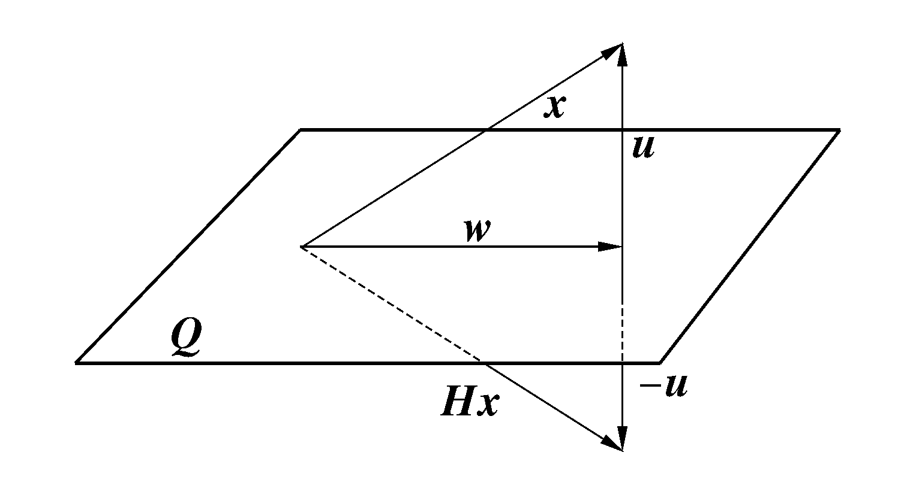

<!-- page: 182 -->

５
７
１
８　矩阵特征值和特征向量的数值解法

显然v 是n 维单位向量．取

H ＝I －２vv

Ｔ
（８畅２０）

Ｔ）x ＝x －２

Ｔx ＝x －２

这时
Hx ＝（I －２vv

ρ v（x －ay）

ρ v（a

２－ay

Ｔx）

注意到

Ｔx）
（８畅２１）
所以Hx ＝x －ρv ＝ay．达到了目的．

ρ

２＝（x

Ｔ－ay

Ｔ）（x －ay）＝２（a

２－ay

计算过程中有a 的符号确定问题．（８畅２１）式中，为避免减法运算（防止有效数
位损失），当y

Ｔx≠０时，取a ＝－ｓｇｎ（y

Ｔx）‖x‖２；当y

Ｔx ＝０时，取a ＝‖x‖２．

用ＱＲ算法求矩阵特征值时，Ｈｏｕｓｅｈｏｌｄｅｒ矩阵有两个重要作用：一是对A 作

正交相似变换，把A 化为拟上三角矩阵（Ｈｅｓｓｅｎｂｅｒｇ）；二是对矩阵作正交三角分解．

８畅４畅２　化一般矩阵为拟上三角矩阵

拟上三角矩阵也称为Ｈｅｓｓｅｎｂｅｒｇ矩阵，其形式为

倡
倡
…
倡

倡
倡
…
倡

筹
筹


倡
倡
设A ＝（a

Ｔ，
记a１＝a，按公式（８畅１７）～（８畅２０）形成Ｈｏｕｓｅｈｏｌｄｅｒ矩阵H１

（１）
ij
）是n ×n 实矩阵，取x ＝（０，a

（１）
２１，…，a

（１）
n１）

Ｔ，y ＝（０，１，０，…，０）

１
０
…
０

０
倡
…
倡

H１＝





０
倡
…
倡
H１A 的第一列为

（１）
１１

a

（１）
１１

（１）
１１

（１）
１１

a

a

a

（１）
２１

０

０

a

a１

＝H１x ＋H１

＝a１y ＋

＝

H１









０

０

０

（１）
n１

a

又因为用H１右乘一个矩阵不改变后者的第一列，于是

（２）
１２
…
a

（１）
１１
a

（２）
１n

a

（２）
２２
…
a

（２）
２n

a１
a

A２＝H１AH１＝

０
a

（２）
３２
…
a

（２）
３n





０
a

（２）
n２
…
a

（２）
nn

<!-- page: 183 -->

６
７
１
数值分析

又取x ＝（０，０，a

（２）
３２，…，a

（２）
n２）

Ｔ，y ＝（０，０，１，０，…，０）

Ｔ，记a２＝a，形成H２：

１
０
０
…
０

０
１
０
…
０

H２＝

０
０
倡
…
倡






０
０
倡
…
倡

H２A２的第一列同A２第一列，而H２A２第二列变为

（２）
１２

（２）
１２

（２）
１２

a

a

a

（２）
２２

（２）
２２

（２）
２２

a

a

a

H２x ＋H２

＝a２y ＋

＝

０

０

a２







０

０

０

而用H２右乘一个矩阵不改变它的第一、第二列．所以

倡
倡
倡
…
倡

a１
倡
倡
…
倡

A３＝H２AH２＝

０
a２
倡
…
倡






０
０
倡
…
倡

如此下去，作n －２次变换后，A 变化为拟上三角矩阵An －１：

An －１＝Hn －２Hn －３…H２H１AH１H２…Hn －３Hn －２

倡
倡
倡
倡
…
倡

a１
倡
倡
倡
…
倡

a２
倡
倡
…
倡

＝

a３
倡
…
倡

筹
筹


an －１
倡

如果A 是对称阵，则An －１仍是对称矩阵．因此，An －１将是对称三对角矩阵

倡
a１

a１
倡
a２

a２
倡
a３

An －１＝

筹
筹
筹

an －１

an －１
倡

<!-- page: 184 -->

７
７
１
８　矩阵特征值和特征向量的数值解法

A 和An －１相似，具有相同特征值．

因此，任何实矩阵都可以通过正交相似变换化为Ｈｅｓｓｅｎｂｅｒｇ形．ＱＲ算法前，

经常先把矩阵A 化成Ｈｅｓｓｅｎｂｅｒｇ矩阵，然后再用ＱＲ算法可加速收敛．

８畅４畅３　矩阵的正交三角分解

（１）＝A ＝（a

（１）
ij
）是n ×n 实矩阵，取x ＝（a

（１）
１１，a

（１）
２１，…，a

（１）
n１）

Ｔ，y ＝（１，０，…，

设A

０）

Ｔ，并记a１＝a，按公式（８畅１７）～（８畅２０）形成Ｈｏｕｓｅｈｏｌｄｅｒ矩阵H１．则

（２）
１２
…
a

（２）
１n

a１
a

０
a

（２）
２２
…
a

（２）
２n

（２）＝H１A

（１）＝

A





０
a

（２）
n２
…
a

（２）
nn

又取x ＝（０，a

（２）
２２，…，a

（２）
n２）

Ｔ，y ＝（０，１，…，０）

Ｔ，记a２＝a，构造H２．则

（２）
１３
…
a

（２）
１２
a

（２）
１n

a１
a

０
a２
a

（３）
２３
…
a

（３）
２n

（３）＝H２A

（２）＝

A

０
０
a

（３）
３３
…
a

（３）
３n






０
０
a

（３）
n３
…
a

（３）
nn

作n －１次变换后，A 被化为上三角阵A

（n）

a１
倡
倡
…
倡

a２
倡
…
倡

（n）＝Hn －１Hn －２…H１A ＝

A

筹
筹


倡

０
an

令Q ＝H１H２…Hn －１，记R ＝A

（n），有A ＝QR．因Q 是正交阵的乘积，它也是正

交阵，R 是上三角矩阵，这种分解称为A 的正交三角分解，简称ＱＲ分解．对任何实

的非奇异矩阵都可以分解为正交矩阵Q 和上三角矩阵R 的乘积，而且当R 的对角

线元素符号取定时，分解是惟一的．

８畅４畅４　ＱＲ算法

令A ＝A１，对A１进行三角正交分解，分解为正交矩阵Q１和上三角矩阵R１的

乘积

A１＝Q１R１
然后将得到的因式矩阵Q１与R１逆序相乘，

<!-- page: 185 -->

８
７
１
数值分析

A２＝R１Q１
这就完成了ＱＲ算法的第一步，以A２代替A１，重复上述步骤即可得出A３，……如

此类推，则ＱＲ算法的计算公式为

ＱＲ算法

Ak ＝QkRk

　（k ＝１，２，…）
（８畅２２）

Ak ＋１＝RkQk ＝Qk ＋１Rk ＋１

ＱＲ算法产生一个矩阵序列｛Ak｝，这个矩阵序列有两个基本性质：

（１）矩阵序列｛Ak｝中的每一个矩阵Ak 都与矩阵A 相似，因为

Ak ＋１＝RkQk ＝Q

－１
k AkQk

－１
１A１Q１Q２…Qk 若令Ek ＝Q１Q２
…Qk，则上式可写成

＝Q

－１
k －１Ak －１Qk －１Qk ＝… ＝Q

－１
k －１…Q

－１
k Q

－１
k Q

Ak ＋１＝E

－１
k A１Ek
（８畅２３）

因此，Ak 与A 相似，Ak 与A 有完全相同的特征值．

（２）若令Hk ＝RkRk －１…R１，则有

EkHk ＝Q１Q２…Qk　RkRk －１…R１＝Ek －１AkHk －１

＝A１Ek －１Hk －１＝A

２
１Ek －２Hk －２… ＝A

k
１
（８畅２４）

k
１的ＱＲ分解，因为Q１Q２…Qk 是正交矩阵，所以Ek 也是正交

这样就得到了A

矩阵，同样Hk 也是上三角矩阵．从分解的惟一性可知，Ek 与Hk 必定就是A

k
１的分

解因子．

８畅４畅５　ＱＲ算法的收敛性

为了求A 的特征值，要求序列｛Ak ｝能收敛于一种简单形式的矩阵，例如三角

型矩阵（或分块三角型矩阵），其对角线元素（或块）有确定的极限即可．因此约定，

只要｛Ak｝收敛于三角型矩阵（或分块三角型矩阵），且对角线元素（或子块）有确

定极限，无论其对角线以外的元素是否有确定极限，都称为方法是收敛的（或本质

收敛）．下面对最简单的情况给出定理．

定理8畅3　假设

①A１＝A ＝XDX

－１，D ＝ｄｉａｇ（λ１，λ２，…，λn）；

②矩阵A 的n 个特征值满足条件｜λ１｜＞｜λ２｜＞… ＞｜λn ｜＞０；

③矩阵Y ＝X

－１有三角分解式，即Y ＝LyUy，其中Ly 是单位下三角矩阵，Uy 是

上三角矩阵．

则阵列序列｛Ak｝本质收敛．

<!-- page: 186 -->

９
７
１
８　矩阵特征值和特征向量的数值解法

关于定理的证明和更一般的情况，请参考相关文献．

例8 －5　求矩阵A 的特征值．

５
－２
－５
－１

１
０
－３
２

A ＝

０
２
２
－３

０
０
１
－２

解　A 的特征方程为

λ

４－５λ

３＋７λ

２－７λ－２０＝０

其特征值为－１，４，１±２ｉ．

现在用ＱＲ算法来求其特征值．令A ＝A１并进行正交分解得

A ＝A１＝Q１R１

０畅９８０６
－０畅０３７７
０畅１９２３
－０畅１０３８

０畅１９６１
０畅１８８７
－０畅８８０４
－０畅４１９２

＝

０
０畅９８１３
０畅１７６１
０畅０７４０

０
０
０畅３９６２
－０畅８９８９

５畅０９９２
－１畅９６１２
－５畅４９１２
－０畅３９２２

０
２畅０３８１
１畅５８５２
－２畅５２８８

０
０
２畅５２４２
－３畅２７３６

０
０
０
０畅７８２２

然后，将求得的Q１和R１逆序相乘，求出A２：

４畅６１５７
５畅９５０８
１畅５９２２
０畅２３９０

０畅３９９７
１畅９４０１
－２畅５１７１
１畅５３６１

A２＝

０
２畅４７７０
－０畅８５２５
３畅１２９４

０
０
０畅３０９９
－０畅７０３１

把A２代替A１重复上面过程，计算１１次后得

４畅００００
倡
倡
倡

１畅８７８９
－３畅５９１０
倡

A１２＝

１畅３２９０
０畅１２１１
倡

－１畅００００

至此，不难看出A 的一个特征值是４，另一个特征值是－１，其他两个特征值是

方程

１畅８７８９－λ
－３畅５９１０

１畅３２９０
０畅１２１１－λ ＝０

的根，求得λ为１±２ｉ．

最后说明一下，ＱＲ算法的收敛速度是线性的，这在实际计算时很不理想，而

<!-- page: 187 -->

０
８
１
数值分析

且ＱＲ算法的工作量较大．因此，使用时经常先把矩阵A 化成Ｈｅｓｓｅｎｂｅｒｇ矩阵，然

后再用ＱＲ算法加速收敛．关于这些问题的讨论这里不再详述，请参考相关文献．

练习与思考

１．用幂法求矩阵

６
２
１

１
－３
２

A ＝

２
３
１

　　B ＝

４
４
－１

１
１
１

６
３
５

按模最大的特征值和对应的特征向量，精确到小数点后三位．

２．已知A（取t ＝０畅６），B（取t ＝１５），作原点平移的幂法，求按模最大的特征值．

－１１
１１
１

A ＝３
１

１
１　　B ＝

１１
９
－２

１
－２
１３

３．已知A，用反幂法求最接近１２的特征值与相应的特征向量，迭代两次．

４
１
４

A ＝

１
１０
１

４
１
１０

４．若A 的特征值为λ１，λ２，…，λn，t 是一实数．证明：λi －t 是A －tI 的特征值，

且特征向量不变．

５．已知y ＝（３，２，２，１）

Ｔ，求平面反射阵H 使Hy ＝（倡，倡，０，０）

Ｔ，即把y 的后

两个元素化为零．

６．已知A，试用雅可比旋转法作一次旋转，消去最大的非对角元，写出旋转矩

阵，求出θ 角和结果．

１
３
２

A ＝

３
３
１

２
１
６

（３×３）
１
０

（３×２）

T

７．设T ＝

，已知λ是T１的特征值，相应的特征向量为

０

（２×３）
T

（２×２）
２

（a１，a２，a３）

Ｔ．证明λ也是T 的特征值，相应的特征向量为（a１，a２，a３，０，０）

Ｔ．

８．证明（８畅２２）式中的Ak 和Ak ＋１相似．

９．求矩阵A，B 的ＱＲ分解．

A ＝２
３

１
２　　B ＝２
１

１
３

<!-- page: 188 -->

９　常微分方程初值问题的数值解法

科学研究和工程技术中的问题往往归结为求某个常微分方程的定解问题．

常微分方程的理论指出，很多方程的定解虽然存在，但可能十分复杂，难于计

算，也可能不能用简单的初等函数表示．因此，更常碰到的是要求满足一定精度的

近似解．

常微分方程数值解法的特点是：对求解区间进行剖分，然后把微分方程离散成

在节点上的近似公式或近似方程，最后结合定解条件求出近似解．因此，数值解法

得到的近似解是一个离散的函数表．

一阶常微分方程的初值问题是：

y′＝f（x，y）　（a≤x≤b）

y（a）＝y０
其中f（x，y）是已知函数；y（a）＝y０是定解条件．

由常微分方程的理论，我们知当f（x，y）定义在区域G ＝（a≤x≤b，｜y ｜＜∞），

若存在正的常数L，使

｜f（x，y１）－f（x，y２）｜≤L ｜y１－y２｜
对任意的x ∈［a，b］和任意的y１，y２成立，则称f （x，y）对y 满足李普希兹

（Ｌｉｐｓｃｈｉｔｚ）条件．L 称李普希兹常数．

若f（x，y）在区域G 连续，关于y 满足李普希兹条件，则上述一阶常微分方程

的初值问题的解存在且惟一．

９畅１　欧拉（Ｅｕｌｅｒ）法

解一阶常微分方程的初值问题

y′＝f（x，y）　（a≤x≤b）

（９畅１）

y（a）＝y０

（９畅２）

最简单而直观的方法是欧拉法．欧拉法在精度要求不高时，是一个实用的方法，而

且通过欧拉法的讨论，容易弄清常微分方程初值问题数值解法的一些基本概念和

构造方法的思路．

９畅１畅１　欧拉法的导出

把区间［a，b］分为n 个小区间，取步长h ＝b －a

n
，节点xi ＝x０＋ih（i ＝０，１，２，

<!-- page: 189 -->

２
８
１
数值分析

…，n），其中x０＝a．又设y（x）为上述问题的解．

把（９畅１）式两端积分，积分区间取［xi，xi ＋１］，得

∫

y′ｄx ＝∫

xi＋１

xi＋１

f（x，y）ｄx

x i

x i

y（xi ＋１）－y（xi）＝∫

xi＋１

f（x，y）ｄx
（９畅３）

x i

对（９畅３）式右端积分用左矩形积分公式得

∫

２

f（x，y）ｄx ＝hf（xi，y（xi））＋h

xi＋１

２y″（ξ）　ξ∈（xi，xi ＋１）

x i

代入（９畅３）式得

２

y（xi ＋１）－y（xi）＝hf（xi，y（xi））＋h

２y″（ξ）

２

舍去h

２y″（ξ），并令yi ＝y（xi），得到

yi ＋１＝yi ＋hf（xi，yi）　（i ＝０，１，…，n －１）
（９畅４）

这就是欧拉公式．

欧拉公式还可由泰勒展开得到．假定y（x）二阶连续可导，把y（xi ＋１）在xi 点展

开，得

y（xi ＋１）＝y（xi）＋y′（xi）h ＋y″（ξ）

２

h

２！

２项，并令yi ＝y（xi），注意到y′（xi）＝f（xi，yi），得

舍去h

yi ＋１＝yi ＋hf（xi，yi）　（i ＝０，１，…，n －１）

９畅１畅２　欧拉隐式公式和欧拉中点公式

对（９畅３）式的右端积分用右矩形积分公式代替，即

２

y（xi ＋１）－y（xi）＝hf（xi ＋１，y（xi ＋１））－h

２y″（ξ）　ξ∈（xi，xi ＋１）

i ＝０，１，２，…，n －１．可得欧拉隐式公式：

yi ＋１＝yi ＋hf（xi ＋１，yi ＋１）
（９畅５）

不难看出，（９畅５）式两端都含有yi ＋１，一般情况下不能由yi 的值直接计算yi ＋１，而需

要解非线性方程，故称为欧拉隐式公式．

把（９畅３）式积分区间改为［xi －１，xi ＋１］，并对（９畅３）式右端积分，用矩形积分公

式代替，即

３

y（xi ＋１）－y（xi －１）＝２hf（xi，y（xi））＋h

３y碶（ξ）　ξ∈［xi －１，xi ＋１］

可得到欧拉中点公式：

<!-- page: 190 -->

３
８
１
９　常微分方程初值问题的数值解法

yi ＋１＝yi －１＋２hf（xi，yi）
（９畅６）

容易看出，用中点公式计算yi ＋１时，不仅需要yi 的值，还需要yi －１的值．

凡是能从已知（或已算出）的y０，y１，…，yi 直接算出yi ＋１的公式称显式公式，如

（９畅４）式、（９畅６）式；否则称隐式公式，如（９畅５）式．

在计算yi ＋１时，只需要yi 的值，则称公式为单步法；若除yi 之外还需要以前的

yi －１等多个值，则称多步法．公式（９畅４）、（９畅５）是单步法；公式（９畅６）是多步法，确

切地说是二步法．

９畅１畅３　局部截断误差和方法的阶

假定yi，yi －１的值没有误差，计算yi ＋１时产生的误差称为局部截断误差，也称为

单步截断误差．局部截断误差表示为

R ＝｜y（xi ＋１）－yi ＋１｜
（９畅７）

对欧拉公式：

R１＝｜y（xi ＋１）－y（xi）－hf（xi，y（xi））｜

注意到用泰勒展开式推导欧拉公式的过程，可知

R１＝y″（ξ）

２
＝O（h

２）

h

２

同样可以推出，欧拉隐式公式的局部截断误差为

R２＝y″（ξ）

２
＝O（h

２）

h

２

中点公式的局部截断误差为：

y碶（ξ）

R３＝

３
＝O（h

３）

h

３

凡是局部截断误差为O（h

p ＋１）的方法称为p 阶方法．这样欧拉方法和欧拉隐

式方法称为一阶方法，而欧拉中点方法称为二阶方法．一般来说，高阶方法比低阶

方法精确．

９畅１畅４　梯形公式及其预报校正法

对公式（９畅３）的右端积分用梯形积分公式近似代替，得

３y碶（ξ）

２［f（xi，y（xi））＋f（xi ＋１，y（xi ＋１））］－h

y（xi ＋１）－y（xi）＝h

１２
　ξ∈［xi，xi ＋１］

３y碶（ξ）

i ＝０，１，…，n －１．把y（xi ＋１）记为yi ＋１，并略去余项－h

，得到梯形公式：

１２

yi ＋１＝yi ＋h

２［f（xi，yi）＋f（xi ＋１，yi ＋１）］
（９畅８）

<!-- page: 191 -->

４
８
１
数值分析

显然它是单步隐式方法，它的局部截断误差为O（h

３），因此它也是一个二阶方

法．

用隐式方法求yi ＋１需要解方程，可用迭代法解此方程．初值y

（０）
i ＋１由显式的欧拉

公式给出．计算公式为

（０）
i ＋１＝yi ＋hf（xi，yi）

y

（k ＋１）
i ＋１
＝yi ＋h

２［f（xi，yi）＋f（xi ＋１，y

（k）
i ＋１）］　（k ＝０，１，２，…）
（９畅９）

y

迭代的收敛与否与步长h 有关，这里迭代函数是

φ（y）＝yi ＋h

２［f（xi，yi）＋f（xi ＋１，yi ＋１）］

φ′（y）＝h

２fy（x，y）

２M ＜１，h ＜２

a≤x≤b ｜fy（x，y）｜，则｜φ′（y）｜≤h

若M ＝ｍａｘ

M ．所以，要得到收敛的迭代

（０）
i ＋１，y

（１）
i ＋１，…，y

（k）
i ＋１，…，h 要适当地小．如迭代不收敛，则应减小步长h 重新计

序列y

算．

实际上，常采用预报校正技术，即用显式欧拉公式预报出yi ＋１的初值y

（０）
i ＋１，再

用梯形公式进行校正得到yi ＋１．梯形公式的预报校正法如下：

（０）
i ＋１＝yi ＋hf（xi，yi）

y

yi ＋１＝yi ＋h

２［f（xi，yi）＋f（xi ＋１，y

（０）
i ＋１）］

上述预报校正公式等价于显式公式：

yi ＋１＝yi ＋h

２［f（xi，yi）＋f（xi ＋１，yi ＋hf（xi，yi））］
（９畅１０）

梯形公式的预报校正法通常也称为改进的欧拉法．

例9 －1　用欧拉方法、隐式欧拉方法和欧拉中点公式计算

y′＝－y　（０≤x≤１）

y（０）＝１

的近似解，取步长h ＝０畅１，并与精确值比较．

解　欧拉方法的算式为

yi ＋１＝yi（１－h）

y０＝１

i ＝０，１，…，９．欧拉隐式方法在本题可解出方程，不必迭代，公式为

yi ＋１＝
yi
（１＋h）

y０＝１

<!-- page: 192 -->

５
８
１
９　常微分方程初值问题的数值解法

欧拉中点公式是两步法，第一步y１用欧拉公式的结果，以后用公式

yi ＋１＝yi －１－２hyi

y０＝１

本题精确解为y ＝ｅ

－x．计算结果如表９－１所示．

表９－１　计算结果

xi
y（xi）＝ｅ

－xi
欧拉方法
欧拉隐式法
欧拉中点公式

０畅１
０畅９０４８３７
０畅９０００００
０畅９０９０９１
０畅９０００００

０畅２
０畅８１８７３１
０畅８１００００
０畅８２６４４６
０畅８２００００

０畅３
０畅７４０８１８
０畅７２９０００
０畅７５１３１５
０畅７３６０００

０畅４
０畅６７０３２０
０畅６５６１００
０畅６８３０１３
０畅６７２８００

０畅５
０畅６０６５３１
０畅５９０４９０
０畅６２０９２１
０畅６０１４４０

０畅６
０畅５４８８１２
０畅５３１４４１
０畅５６４４７４
０畅５５２５１２

０畅７
０畅４９６５８５
０畅４７８２９７
０畅５１３１５８
０畅４９０９３８

０畅８
０畅４４９３２９
０畅４３０４６７
０畅４６６５０７
０畅４５４３２４

０畅９
０畅４０６５７０
０畅３８７４２０
０畅４２４０９８
０畅４０００７３

１畅０
０畅３６７８７９
０畅３４８６７８
０畅３８５５４３
０畅３７４３１０

例9 －2　用欧拉公式和梯形公式的预报校正法计算

y′＝y －２x

y 　（０≤x≤１）

y（０）＝１

的数值解，取h ＝０畅１，并与精确值比较．方程的解析解为y ＝１＋２x．

＝１畅１yi －０畅２xi

解　由于
yi ＋１＝yi ＋０畅１× yi －２xi

yi

yi

故欧拉公式为

yi ＋１＝１畅１yi －０畅２xi

yi
（i ＝０，１，２，…，９）

y０＝１

梯形公式的预报校正公式为

（０）
i ＋１＝１畅１yi －０畅２xi

y

yi

yi ＋１＝yi ＋０畅０５× yi －２xi

（０）
i ＋１－２xi ＋１

yi ＋y

　（i ＝０，１，２，…，９）

（０）
i ＋１

y

y０＝１　（x０＝０）

计算结果如表９唱２所示．

<!-- page: 193 -->

６
８
１
数值分析

表９唱２　计算结果

xi
欧拉方法
梯形法
精确值

０畅１
１畅１０００００
１畅０９５９０９
１畅０９５４４５

０畅２
１畅１９１８１８
１畅１８４０９７
１畅１８３２１６

０畅３
１畅２７７４３８
１畅２６６２０１
１畅２６４９１１

０畅４
１畅３５８２１３
１畅３４３３６０
１畅３４１６４１

０畅５
１畅４３５１３３
１畅４１６４０２
１畅４１４２１４

０畅６
１畅５０８９６６
１畅４８５９５６
１畅４８３２４０

０畅７
１畅５８０３３８
１畅５５２５１５
１畅５４９１９３

０畅８
１畅６４９７８３
１畅６１６４７５
１畅６１２４５２

０畅９
１畅７１７７７９
１畅６７８１６７
１畅６７３３２０

１畅０
１畅７８４７７１
１畅７３７８６８
１畅７３２０５１

９畅２　龙格－库塔（Ｒｕｎｇｅ－Ｋｕｔｔａ）法

欧拉方法是显式的一步法，使用方便，但精度较低．本节将构造出高精度的显

式一步法：龙格－库塔法，简称Ｒ－Ｋ法．

９畅２畅１　二阶Ｒ－Ｋ法

欧拉法的公式为

yi ＋１＝yi ＋hf（xi，yi）　（i ＝０，１，２，…，n －１）

决定其精度的是函数f（xi，yi），如能改进这个函数，就可能提高公式的精度．

为此，把公式改写成

yi ＋１＝yi ＋hφ（xi，yi，h）　（i ＝０，１，２，…，n －１）
（９畅１１）

选择函数φ（xi，yi，h），其中一种方法是用若干个点的函数值的线性组合代替

φ（xi，yi，h），如

<!-- page: 194 -->

７
８
１
９　常微分方程初值问题的数值解法

p

φ（xi，yi，h）＝∑

j ＝１cjKj

K１＝f（xi，yi）

　

j －１

Kj ＝f（xi ＋ajh，yi ＋h∑

l ＝１bjlKl）　（j ＝２，３，…，p）

j －１

aj ＝∑

l ＝１bjl　（j ＝２，３，…，p）

j －１

其中cj，aj，bjl是待定参数．aj 和bjl满足aj ＝∑

l ＝１bjl．

以上方法称为p 级Ｒ－Ｋ法．适当选择cj，aj 和bjl可使以上方法为p 阶方法．

显然，欧拉法就是一阶Ｒ－Ｋ法．

二级Ｒ－Ｋ法的形式是

yi ＋１＝yi ＋h（c１K１＋c２K２）

K１＝f（xi，yi）

K２＝f（xi ＋a２h，yi ＋a２hK１）

此时，

φ（xi，yi，h）＝c１f（xi，y（xi））＋c２f（xi ＋a２h，y（xi）＋a２hf（xi，y（xi）））

＝c１y′（xi）＋c２f（xi ＋a２h，y（xi）＋a２hy′（xi））
（９畅１２）

由二元函数的泰勒展开：

f（xi ＋a２h，y（xi）＋a２hy′（xi））＝f（xi，y（xi））＋a２hf′
x ＋a２hy′（xi）f′
y ＋O（h

２）

其中，所有的偏导数都是它们在点（xi，y（xi））的值，下同．

又由于
y′（x）＝f（x，y（x））

y″（x）＝f′
x ＋f′
y y′（x）

所以
f（xi ＋a２h，y（xi）＋a２hy′（xi））＝y′（xi）＋a２hy″（xi）＋O（h

２）

代入（９畅１２）式，得

φ（xi，yi，h）＝（c１＋c２）y′（xi）＋a２c２hy″（xi）＋O（h

２）

代入（９畅１１）式，得

yi ＋１＝y（xi）＋（c１＋c２）hy′（xi）＋a２c２h

２y″（xi）＋O（h

３）

而由Ｔａｙｌｏｒ展开式

２

y（xi ＋１）＝y（xi）＋hy′（xi）＋h

２y″（xi）＋O（h

３）

二式相减，得局部截断误差

　　　　Ri ＋１＝y（xi ＋１）－yi ＋１

<!-- page: 195 -->

８
８
１
数值分析

＝（１－c１－c２）hy′（xi）＋１

２－a２c２h

２y″（xi）＋O（h

３）

１－c１－c２＝０

１
２－a２c２＝０

令

c１＋c２＝１

a２c２＝１

可得

２
只要c１，c２，a２满足以上方程，就得到一个二阶的Ｒ－Ｋ法．

这是一个不定方程，有无穷多解．如

（１）取c１＝c２＝１

２，a２＝１，得

yi ＋１＝yi ＋h

２（K１＋K２）

（９畅１３）

K１＝f（xi，yi）

K２＝f（xi ＋h，yi ＋hK１）

这实际上是公式（９畅１０），即梯形公式的预报校正公式．

（２）取c１＝０，c２＝１，a２＝１

２，得

yi ＋１＝yi ＋hK２

K１＝f（xi，yi）

（９畅１４）

K２＝f（xi ＋h

２，yi ＋h

２K１）

该公式又称为中点公式．

９畅２畅２　四阶Ｒ－Ｋ法

用类似的方法可以确定三级和四级Ｒ－Ｋ法的参数，构造出三阶和四阶的

Ｒ－Ｋ法．常用的是四阶Ｒ－Ｋ法．四阶Ｒ－Ｋ法也不只一个，下面给出的是最常用

的四阶经典的Ｒ－Ｋ公式：

yi ＋１＝yi ＋h

６（K１＋２K２＋２K３＋K４）

K１＝f（xi，yi）

K２＝f（xi ＋h

２，yi ＋h

（９畅１５）

２K１）　（i ＝０，１，２，…，n －１）

K３＝f（xi ＋h

２，yi ＋h

２K２）

K４＝f（xi ＋h，yi ＋hK３）

<!-- page: 196 -->

９
８
１
９　常微分方程初值问题的数值解法

例9 －3　用经典的四阶Ｒ－Ｋ法计算

y′＝y －２x

y 　（０≤x≤１）

y０＝１

取步长为０畅２，且与准确值比较．

解　由（９畅１５）式得

yi ＋１＝yi ＋０畅２

６（K１＋２K２＋２K３＋K４）

K１＝yi －２xi

yi

K２＝yi ＋０畅１K１－２
xi ＋０畅１
yi ＋０畅１K１

　（i ＝０，１，２，…，n －１）

K３＝yi ＋０畅１K２－２
xi ＋０畅１
yi ＋０畅１K２

K４＝yi ＋０畅２K３－２
xi ＋０畅２
yi ＋０畅２K３

计算结果如表９－３所示．

表９唱３　计算结果

xi
yi
y（xi）

０
１
１

０畅２
１畅１８３２２９
１畅１８３２１６

０畅４
１畅３４１６６７
１畅３４１６４１

０畅６
１畅４８３２８１
１畅４８３２４０

０畅８
１畅６１２５１４
１畅６１２４５２

１畅０
１畅７３２１４２
１畅７３２０５１

可见，使用h ＝０畅２计算，也比一阶和二阶方法精度高得多．

９畅３　线性多步法

单步法只利用前一步的结果，只要给出初值，就能开始计算．但也因为它只利

用前一步的值，为了提高精度就要计算一些非节点处的函数值，增加了计算量．

Ｒ－Ｋ法就是通过这一途径提高精度的．下面介绍的线性多步法，在求yi ＋１时，不仅

用到yi 的值，还用到前若干步的yi －１，…，yi －k 的值．这些值都是已知的，因此可在

计算量增加不多的情况下提高精度．

<!-- page: 197 -->

０
９
１
数值分析

９畅３畅１　用待定系数法构造线性多步法

线性多步法的一般形式是：

α０yi ＋α
１yi ＋１＋… ＋αkyi ＋k ＝h（β
０fi ＋β
１fi ＋１＋… ＋β
kfi ＋k）

或写为

k

k

∑

j ＝０αjyi ＋j ＝h∑

j ＝０β
jfi ＋j　（i ＝０，１，２，…，n －k）
（９畅１６）

其中αj，β
j（j ＝０，１，…，k）都是实常数，且αk≠０，｜α
０｜＋｜β
０｜≠０，fi ＋j ＝f（xi ＋j，yi ＋j），j

＝０，１，…，k．由（９畅１６）式可看出，要计算yi ＋k，就要利用它前面的k 个值yi，yi ＋１，

…，yi ＋k －１．又因为（９畅１６）式关于yi ＋j 和fi ＋j 都是线性组合，所以这一类方法都称为

线性k 步法．欧拉法、隐式欧拉法和梯形法都是线性一步法，欧拉中点公式是线性

二步法．

k

令
L（y（x），h）＝∑

j ＝０［αjy（x ＋jh）－hβ
jy′（x ＋jh）］

把y（x ＋jh）和y′（x ＋jh）作Ｔａｙｌｏｒ展开：

y（x ＋jh）＝y（x）＋jhy′（x）＋（jh）

y″（x）＋… ＋（jh）

２

p

（p）（x）＋…

y

２！

p！

y′（x ＋jh）＝y′（x）＋jhy″（x）＋… ＋（jh）

p －１

（p）（x）＋…

y

（p －１）！

于是，

L（y（x），h）＝

pαj

p －１β
j

j ＝０
αjy（x）＋（jαi －β
j）hy′（x）＋… ＋j

j

k

∑

（p）（x）＋…

py

h

－

p！

（p －１）！

＝C０y（x）＋C１hy′（x）＋… ＋Cph

（p）（x）＋…

py

其中

C０＝α
０＋α１＋… ＋αk
C１＝（α
１＋２α
２＋… ＋kαk）－（β
０＋β
１＋… ＋β
k）

C２＝１

２

２α
１＋２α２＋… ＋k

２αk
－（β
１＋２β
２＋… ＋kβ
k）

C３＝１

６α
１＋４

６αk
－１

３

２

３α
２＋… ＋k

２β
１＋２β
２＋… ＋k

２β
k

　

Cp ＝α
１＋２

pα
２＋… ＋k

pαk
p！
－β
１＋２

p －１β
２＋… ＋k

p －１β
k
（p －１）！
（９畅１７）

若选择αj，β
j，使C０＝C１＝… ＝Cp ＝０，Cp ＋１≠０，则

<!-- page: 198 -->

１
９
１
９　常微分方程初值问题的数值解法

k

L（y（x），h）＝∑

j ＝０［αjy（x ＋jh）－hβ
jy′（x ＋jh）］

＝Cp ＋１h

（p ＋１）（x）＋O（h

p ＋２）

p ＋１y

将x ＝xi 代入上式，设αk ＝１，并注意到y′（xi ＋jh）＝f（xi ＋jh，y（xi ＋jh）），可推

出

k －１

k

y（xi ＋k）＝－∑

j ＝０αjy（xi ＋jh）＋h∑

j ＝０β
jf（xi ＋jh，y（xi ＋jh））＋

（p ＋１）（xi）＋O（h

p ＋２）

p ＋１y

Cp ＋１h

即

k －１

k

y（xi ＋k）＝－∑

j ＝０αjy（xi ＋j）＋h∑

j ＝０β
jf（xi ＋j，y（xi ＋j））＋

（p ＋１）（xi）＋O（h

p ＋２）
（９畅１８）

p ＋１y

Cp ＋１h

设yi ＝y（xi），yi ＋１＝y（xi ＋１），…，yi ＋k －１＝y（xi ＋k －１），记左端为yi ＋k，并舍去最后两

项，（９畅１８）式变为

k －１

k

yi ＋k ＝－∑

j ＝０αjyi ＋j ＋h∑

j ＝０β
jf（xi ＋j，yi ＋j）
（９畅１９）

这就是一种p 阶的线性k 步方法，Cp ＋１h

（p ＋１）（xi）称为局部截断误差的主项．当

p ＋１y

β
k ＝０时，是显式方法；当β
k≠０时，是隐式方法．

下面通过例子构造几个实用的线性多步法公式．

例9 －4　形如

yi ＋４＝－α
０yi ＋h（β
１fi ＋１＋β
２fi ＋２＋β
３fi ＋３）

的线性４步法公式，试确定α０，β
１，β
２，β
３，并求其局部截断误差主项．

解　由（９畅１６）式知，α
１＝α
２＝α
３＝０，α
４＝１，β
０＝β
４＝０，因为有４个待定系数，

由（９畅１７）式写出前４个方程：

C０＝α
０＋１＝０

C１＝４－（β
１＋β
２＋β
３）＝０

C２＝４

２

２！－（β
１＋２β
２＋３β
３）＝０

３！－β
１＋２

２β
２＋３

２β
３
２！
＝０

C３＝４

３

解之，得α
０＝－１，β
１＝β
３＝８

３，β
２＝－４

３．故所求的公式为

yi ＋４＝yi ＋４h

３（２fi ＋１－fi ＋２＋fi ＋３）
（９畅２０）

将α
０，β
１，β
２，β
３代入C４：

<!-- page: 199 -->

２
９
１
数值分析

４！－β
１＋２

３β
２＋３

３β
３
３！
＝０

C４＝４

４

再求C５：

５！－β
１＋２

４β
２＋３

４β
３
４！
＝１４

C５＝４

５

４５

公式（９畅２０）称为米尔尼（Ｍｉｌｎｅ）公式，它的局部截断误差为：

R ＝１４

（５）（xi）＋O（h

６）

５y

４５h

它也可以写成

yi ＋１＝yi －３＋４h

３（２fi －２－fi －１＋２fi）　（i ＝３，４，…，n －１）
（９畅２１）

局部截断误差可写为

R ＝１４

（５）（ξ）　ξ∈（xi －３，xi ＋１）
（９畅２２）

５y

４５h

例9 －5　试确定下列公式的系数和局部截断误差．

yi ＋１＝ayi ＋byi －２＋h（cfi ＋１＋dfi ＋efi －１）

解　按（９畅１６）式和（９畅１７）式可知，k ＝３，α
０＝－b，α
１＝０，α
２＝－a，α３＝１，β
０＝

０，β
１＝e，β
２＝d，β
３＝c，有５个未知参数，写出前５个方程：

C０＝１－a －b ＝０

C１＝－２a ＋３－（e ＋d ＋c）＝０

C２＝３

２－２

２a
２
－（e ＋２d ＋３c）＝０

C３＝３

３－２

３a
３！
－e ＋２

２d ＋３

２c
２！
＝０

C４＝３

４－２

４a
４！
－e ＋２

３d ＋３

３c
３！
＝０

解之得a ＝９

８，b ＝－１

８，c ＝３

８，d ＝６

８，e ＝－３

８，代入C５，得

C５＝３

５－２

５a
５！
－e ＋２

４d ＋３

４c
４！
＝－１

４０

此公式称为哈明（Ｈａｍｍｉｎｇ）公式，写为

　　yi ＋１＝１

８（９yi －yi －２）＋３

８h（fi ＋１＋２fi －fi －１），i ＝２，３，…，n －１
（９畅２３）

局部截断误差记为

R ＝－１

（５）（ξ）　ξ∈（xi －２，xi ＋１）
（９畅２４）

５y

４０h

它是一个四阶隐式三步法．

<!-- page: 200 -->

３
９
１
９　常微分方程初值问题的数值解法

在（９畅１６）式中，若α０＝α
１＝… ＝αk －２＝０，αk ＝１，则称此类方法为阿达姆斯

（Ａｄａｍｓ）类方法．当β
k ＝０时，称显式，否则为隐式．这类方法也可以用以上待定系

数法求出．这类方法的通式为

k

yi ＋１＝yi ＋h∑

j ＝０β
jfi ＋１－k ＋j
（９畅２５）

例9 －6　求（９畅２５）式中的隐式三步法．

解　k ＝３，α
０＝α
１＝０，α
２＝－１，α３＝１，

C０＝α
２＋α
３＝０

C１＝２α
２＋３α３－（β
０＋β
１＋β
２＋β
３）＝０

C２＝２

２α
２＋３

２α３
２
－（β
１＋２β
２＋３β
３）＝０

C３＝２

３α
２＋３

３α３
６
－β
１＋２

２β
２＋３

２β
３
２
＝０

C４＝２

４α
２＋３

４α３
２４
－β
１＋２

３β
２＋３

３β
３
６
＝０

α２＝－１，α
３＝１．

β
０＋β
１＋β
２＋β
３＝１

β
１＋２β
２＋３β
３＝５

２

β
１＋４β
２＋９β
３＝１９

３

β
１＋８β
２＋２７β
３＝６５

４

解之，得β
０＝１

２４，β
１＝－５

２４，β
２＝１９

２４，β
３＝９

２４．

公式为：

yi ＋１＝y１＋h

２４（fi －２－５fi －１＋１９fi ＋９fi ＋１）
（９畅２６）

C５＝１

５α３）－１

４β
３）＝－１９

１２０（２

５α
２＋３

２４（β
１＋２

４β
２＋３

７２０

局部截断误差为

R ＝－１９

（５）（ξ）　ξ∈（xi －２，xi ＋１）
（９畅２７）

５y

７２０h

它是一个线性三步四阶隐式公式，称为四阶阿达姆斯内插公式，应用十分普遍．

此外，常用的还有线性四步四阶显式阿达姆斯公式，常称为阿达姆斯外推公

式：

<!-- page: 201 -->

４
９
１
数值分析

　yi ＋１＝yi ＋h

２４（５５fi －５９fi －１＋３７fi －２－９fi －３）　（i ＝３，４，…，n －１）
（９畅２８）

R ＝２５１

（５）（ξ）　ξ∈（xi －３，xi ＋１）
（９畅２９）

５y

７２０h

９畅３畅２　用数值积分法构造线性多步法公式

在（９畅１６）式中，若令αk ＝１，α
０，α
１，…，αk －１中只有一个不为零，这样的线性多

步法公式也可用数值积分方法构造，如阿达姆斯外推公式．对方程

y′＝f（x，y（x））

　（a≤x≤b）

y（x０）＝y０

第一式两端在［xi，xi ＋１］上积分，得

y（xi ＋１）－y（xi）＝∫

xi＋１

f（x，y（x））ｄx
（９畅３０）

x i

选择节点xi －３，xi －２，xi －１，xi 作插值节点，作函数f（x，y（x））的三次插值多项

式：

P３（x）＝（x －xi －１）（x －xi －２）（x －xi －３）

h（２h）（３h）
fi ＋（x －xi）（x －xi －２）（x －xi －３）

（－h）（h）（２h）
fi －１＋

（x －xi）（x －xi －１）（x －xi －３）

（－２h）（－h）（h）
fi －２＋（x －xi）（x －xi －１）（x －xi －２）

（－３h）（－２h）（－h）
fi －３

且插值余项

（４）（ξ）

R３（x）＝f

（x －xi）（x －xi －１）（x －xi －２）（x －xi －３）

４！

把f（x，y（x））＝P３（x）＋R３（x）代入（９畅３０）式得

y（xi ＋１）－y（xi）＝∫

P３（x）ｄx ＋∫

xi＋１

xi＋１

R３（x）ｄx

x i

x i

略去右边第二项：

y（xi ＋１）≈y（xi）＋∫

xi ＋１

P３（x）ｄx　（i ＝３，４，…，n －１）
（９畅３１）

x i

计算积分得

∫

P３（x）ｄx ＝h

xi＋１

２４（５５fi －５９fi －１＋３７fi －２－９fi －３）

x i

把（９畅３１）式左边记为yi ＋１，并把约等于号改为等号，得

　yi ＋１＝yi ＋h

２４（５５fi －５９fi －１＋３７fi －２－９fi －３）　（i ＝３，４，…，n －１）
（９畅３２）

这就是阿达姆斯外推公式．

其局部截断误差为

<!-- page: 202 -->

５
９
１
９　常微分方程初值问题的数值解法

R ＝∫

R３（x）ｄx ＝∫

（４）（ξ）

f

xi＋１

xi＋１

（x －xi）（x －xi －１）（x －xi －２）（x －xi －３）ｄx

４！

x i

x i

因为（x －xi）（x －xi －１）（x －xi －２）（x －xi －３）在［xi，xi ＋１］上不变号，设f

（４）（ξ）在［xi，

xi ＋１］上连续，则有

４！∫

（４）（η）

R ＝f

xi＋１

（x －xi）（x －xi －１）（x －xi －２）（x －xi －３）ｄx

x i

＝２５１

（４）（η）＝２５１

（５）（η）　（xi －３＜η＜xi ＋１）

５f

５y

７２０h

７２０h

这与用待定系数法推导的结果完全一致．

用类似的方法还可以构造二步四阶的辛普生（Ｓｉｍｐｓｏｎ）公式：

yi ＋１＝yi －１＋h

３（fi ＋１＋４fi ＋fi －１）　（i ＝２，３，…，n －１）
（９畅３３）

它的局部截断误差为

R ＝－１

（５）（ξ）　（xi －１＜ξ＜xi ＋１）
（９畅３４）

５y

９０h

线性多步法要用到二个以上的初始值才能开始计算，不能“ 自启动”．一般应

选择同阶或高阶的单步法算出前几个值，再使用线性多步法．由于线性多步法每一

步实际上只计算一次函数值，又能获得较高的精度，所以应用比较广泛．

练习与思考
１．对初值问题

y′＝１

２－２y

２

１＋x

　（０≤x≤１）

y（０）＝０

试用欧拉法，取步长为０畅１和０畅２分别计算y（１），并与准确解y（x）＝
x
１＋x

２相比

较．近似值和准确解都取四位有效数字．

２．用预报校正法（改进的欧拉法）和四阶经典Ｒ－Ｋ法，取步长h ＝０畅１，计算

下列初值问题的近似解，并与精确值比较．均保留四位小数：

y′＝x ＋y

y（０）＝１　（０≤x≤１）

此问题的精确解是y（x）＝－x －１＋２ｅ

x．

３．证明二阶Ｒ－Ｋ法能精确地解微分方程y′＝ax ＋b．

４．用待定系数法推导二步法公式

yn ＋１＝yn ＋h

１２（５fn ＋１＋８fn －fn －１）

并证明它是三阶公式，求出它的局部截断误差．

<!-- page: 203 -->

参考文献

１　李岳生，黄友谦．数值逼近（第２版）．北京：高等教育出版社，１９８７

２　冯康等编．数值计算方法．北京：国防工业出版社，１９７８

３　李庆杨，王能超，易大义．数值分析（第３版）．武汉：华中理工大学出版社，１９８６

４　徐萃薇，孙绳武编著．计算方法引论（第２版）．北京：高等教育出版社，２００２

５　吴勃英等编．数值分析原理．北京：科学出版社，２００３

６　孙志中等编．数值分析（第２版）．南京：东南大学出版社，２００２

７　［美］ＪｏｈｎＨ．Ｍａｔｈｅｗｓ，ＫｕｒｔｉｓＤ．Ｆｉｎｋ著，陈愉等译．数值方法（第３版）．北京：电

子工业出版社，２００２

８　ＲｉｃｈａｒｄＬ．Ｂｕｒｄｅｎ，Ｊ．ＤｏｕｇｌａｓＦａｉｒｅｓ著．ＮＵＭＥＲＩＣＡＬＡＮＡＬＹＳＩＳ（ＳｅｖｅｎｔｈＥｄｉ唱

ｔｉｏｎ）．北京：高等教育出版社，２００１
