# Review2026

<!-- page: 1 -->

Review

何军辉
hejh@scut.edu.cn

<!-- page: 2 -->

2
考试题型、范围

o 题型：

1. 填空题 10

2. 计算题 84

3. 证明题 6

o 范围：

n 第1章~第7章

计算机科学与工程学院
School of Computer Science & Engineering

<!-- page: 3 -->

3
基本概念

o 误差的来源

n 模型误差、观测误差、方法误差、舍入误差

o 误差（也称绝对误差）

n 近似值-准确值：𝑒∗= 𝑒∗(𝑥∗) = 𝑒∗= 𝑥∗−𝑥

o 误差限

n 误差的绝对值不超过的正数：𝑒∗= 𝑥∗−𝑥≤𝜖∗= 𝜖𝑥∗

n 四舍五入之后所得到的近似值，误差限是末位的半个单位

o 相对误差

n 𝑒"∗= #∗$#

#
, 𝑒"∗= %∗

#∗

#∗

o 相对误差限：𝜖!∗=

$∗

计算机科学与工程学院
School of Computer Science & Engineering

<!-- page: 4 -->

4
基本概念

o 有效数字

n 若近似值 𝑥∗ 的误差限为该值的某一位的半个单位，且从

该位开始往左数到 𝑥∗ 的第一位非 ０ 数字共有 𝑛位, 则称
近似值 𝑥∗具有 𝑛位有效数字．

o 四舍五入的近似值，它的有效数字位等于从该近似值的末

位开始往左数起到第一位非0数字的位数
n 与误差限的关系

o 𝑥∗= ±0. 𝛼'𝛼( ⋯𝛼)×10* （𝛼' ≠0）

o 若有𝑥∗−𝑥≤'

( ×10*$+，则想𝑥∗ 具有𝑛位有效数字.

o 已知近似值的误差限求有效数字位数
o 已知有效数字位数求近似值的误差限

计算机科学与工程学院
School of Computer Science & Engineering

<!-- page: 5 -->

5
基本概念

o 有效数字

n 与相对误差限的关系

n 若近似数𝑥∗= ±0. 𝛼"𝛼# ⋯𝛼$×10%具有𝑛位有效数字（𝑛

≤𝑚），则其相对误差限为

𝜖"∗= 𝜖∗

𝑥∗≤
1
2𝛼'
×10$ +$'

n 若相对误差限满足关系式

𝜖!∗= 𝜖∗

|𝑥∗| ≤
1
2 𝛼# + 1 ×10$ %$#

则𝑥∗具有𝑛位有效数字

计算机科学与工程学院
School of Computer Science & Engineering

<!-- page: 6 -->

6
基本概念

o 数值计算应注意的5种问题

n 避免两个相近的数相减

o 有效数字位减少；变换计算公式
n 要防止小数被大数“ 吃掉” 而使有效数字位损失

o 指数对齐
n 要注意减少运算的次数

o 误差累积
o 秦九韶算法
n 避免做除数绝对值远远小于被除数绝对值的除法

o 溢出/舍入误差增大
n 要选择数值稳定的计算公式

o 误差可控

计算机科学与工程学院
School of Computer Science & Engineering

<!-- page: 7 -->

7
基本概念

o 插值存在唯一性：方程组有解（系数矩阵行列式不为零）

o 插值节点、被插值函数、插值基函数、插值函数

n
𝑥,, 𝑦, , 𝑥', 𝑦' , ⋯𝑥+, 𝑦+
n
𝑓(𝑥)

n 𝑙- 𝑥=
#$#" ⋯#$##$%
#$##&% ⋯(#$#')

##$#" ⋯##$##$%
#$##&% ⋯(##$#'）

n 𝑝+ 𝑥= 𝑙, 𝑥𝑦, + 𝑙' 𝑥𝑦' + ⋯+ 𝑙+ 𝑥𝑦+
o n阶差商

n 𝑓𝑥,, 𝑥', ⋯, 𝑥+ = 1 #",#%,⋯,#'$% $1(#%,#(,⋯,#')

#"$#'

3
1 ##
5)
* ##
其中𝜔3

n 𝑓𝑥,, 𝑥', ⋯, 𝑥3 = ∑-4,

6 𝑥- = 𝑥- −𝑥, ⋯𝑥- −𝑥-$'
𝑥- −𝑥-7' ⋯(𝑥- −𝑥3)

计算机科学与工程学院
School of Computer Science & Engineering

<!-- page: 8 -->

8
基本概念

o Runge（龙格）现象

n 高次插值多项式并不一定很好近似被插函数

o 红色：𝑓(𝑥)；蓝色：𝑝8 𝑥；绿色：𝑝9(𝑥)

𝑓𝑥=
1
1 + 25𝑥(
−1 ≤𝑥≤1

o 分段插值

n 把插值区间分为若干段，然后在每个分段上使用低次插

值多项式来近似代替𝑓(𝑥)

计算机科学与工程学院
School of Computer Science & Engineering

<!-- page: 9 -->

9
基本概念

o 插值比较

n 拉格朗日/牛顿高阶插值：龙格现象

n 分段线性：插值节点函数值连续，但导数不连续

n Hermite插值：插值节点函数值连续，导数也连续，但分

段Hermite插值不够光滑（二阶导数不连续）

n 三次样条插值：

o 插值函数在节点处连续
o 其一阶导数节点处连续
o 其二阶导数节点处连续
o 插值边界条件

计算机科学与工程学院
School of Computer Science & Engineering

<!-- page: 10 -->

10
基本概念

o 最小二乘数据拟合

n 以“偏差的平方和最小”为原则选择近似函数的方法称为最小

二乘法.

( = ∑-4'

+
𝛿-

+
𝑓𝑥- −𝐹𝑥-
(

n 𝑚𝑖𝑛∑-4'

(')

o Newton-Cotes系数𝑐%

; 𝑓𝑥𝑑𝑥≈∫:

; 𝑝+ 𝑥𝑑𝑥= ∑-4,

+ 𝑓(𝑥-)

+
𝑏−𝑎𝑐-

n ∫:

+ 𝑡𝑡−1 ⋯(𝑡−𝑛)

(+) =
−1 +$-

𝑐-

𝑛⋅𝑖! 𝑛−𝑖! I

𝑡−𝑖
𝑑𝑡

,

(+)仅依赖于𝑛和 𝑖，不依赖于被积函数𝑓(𝑥)和积分区间𝑎, 𝑏

n 𝑐-

n 可预先计算Newton-Cotes系数表，系数存在规律

计算机科学与工程学院
School of Computer Science & Engineering

<!-- page: 11 -->

11
基本概念

o 求积公式的代数精度

n 对一般求积公式，如果当𝑓(𝑥)为 任意一个次数不高于𝑛次

的代数多项式时，积分近似公式

)

;

I

𝑓𝑥𝑑𝑥≈K

𝐴3𝑓(𝑥3)

:

34,

精确成立，而当𝑓(𝑥)为𝑛+ 1次代数多项式时不精确成立，则
称该积分近似公式具有𝑛次代数精度

n 梯形求积公式具有1次代数精度.
n Simpson求积公式的代数精度为3.

n Newton-Cotes求积公式至少具有𝑛次代数精度，当𝑛为偶

数时，积分代数精度至少为𝑛+ 1次

计算机科学与工程学院
School of Computer Science & Engineering

<!-- page: 12 -->

12
基本概念

o 向量范数

n 非负数、齐次性、三角不等式

n 1范数、2范数、∞范数、p 范数

o 矩阵范数

n 非负数、齐次性、三角不等式、乘法不等式

n 1范数、∞范数、F 范数、2范数

o 矩阵范数与向量范数是相容

n
𝑨𝑿
≤
𝑨⋅𝑿

o 谱半径

n 𝑨的特征值为𝜆& 𝑖= 1,2, ⋯, 𝑛，谱半径𝜌𝑨= max

𝟏(𝒊(𝒏𝜆&

计算机科学与工程学院
School of Computer Science & Engineering

<!-- page: 13 -->

13
基本概念

o 迭代法收敛阶

设序列𝑥+ 收敛于𝑥∗，令𝜖+ = 𝑥∗−𝑥+，设𝑘→∞时，有

𝜖+,"

𝜖+ % →𝑐(𝑐> 0为常数)

则称序列𝑥+ 是𝑝阶收敛.

o 当𝑝= 1时，称为线性收敛
o 当𝑝= 2时，称为二阶收敛（几何收敛）
o 当1< 𝑝< 2时，称为超线性收敛

计算机科学与工程学院
School of Computer Science & Engineering

<!-- page: 14 -->

14
定理证明或应用

o 插值公式及其误差估计

n 插值公式

o 线性插值及其误差
o 二次插值及其误差
o 𝒏次插值及其误差
1. 根据基函数通过插值节点推导基函数
2. 插值基函数函数值（导数值）加权求和
n 插值误差估计

1. 根据误差余项定义辅助函数
2. Rolle（洛尔）定理

计算机科学与工程学院
School of Computer Science & Engineering

<!-- page: 15 -->

15
定理证明或应用

o 线性拟合正规方程组

1. 偏差平方和

+

𝑦) −𝑎, −𝑎'𝑥)' −𝑎(𝑥)( −⋯−𝑎3𝑥)3 (

𝜑𝑎,, 𝑎', ⋯, 𝑎3 = K

)4'

2. 根据多元函数求极小值方法，对𝜑(𝑎,, 𝑎', ⋯, 𝑎3)分别求关
于𝑎,, 𝑎', ⋯, 𝑎3的偏导数并令其等于0

𝜕𝜑
𝜕𝑎&

= 0 (𝑖= 0,1, ⋯, 𝑘)

3. 解方程组得到𝑎,, 𝑎', ⋯, 𝑎3

计算机科学与工程学院
School of Computer Science & Engineering

<!-- page: 16 -->

16
定理证明或应用

o 求积公式及其误差估计

n 求积公式

o 梯形求积公式（线性插值近似被积函数）
o Simpson求积公式（二次插值近似被积函数）
o Newton-Cotes求积公式（n次插值近似被积函数）
o 复化梯形求积公式（积分区间n等分，每个子区间梯形求积）
o 复化Simpson求积公式（积分区间n=2m等分，每两个子区间

应用Simpson求积公式）
n 误差估计

o 梯形求积公式（插值余项+积分中值定理）
o Simpson求积公式（构造三次插值多项式，再利用插值余项+

积分中值定理）
o 复化求积公式（求积公式区误差+连续函数性质）

计算机科学与工程学院
School of Computer Science & Engineering

<!-- page: 17 -->

17
定理证明或应用

o 方程右端误差对解的影响

o 系数矩阵误差对解的影响

n 条件数𝐶𝑜𝑛𝑑𝑨=
𝑨⋅𝑨-"

o 线性方程组迭代法

n 一般收敛性理论（迭代矩阵的谱半径𝜌𝑴< 1）

.!

n 误差估计：𝑿+ −𝑿∗
≤

"-. 𝑿+-" −𝑿+
≤

.

𝑿"

"-. L

−𝑿/

L

n 强对角占优或者弱对角占优且不可约矩阵收敛性

o Jacobi迭代、Seidel迭代一定收敛
o 若松弛因子𝜔满足0<𝜔≤1，则松弛迭代一定收敛.

计算机科学与工程学院
School of Computer Science & Engineering

<!-- page: 18 -->

18
定理证明或应用

o 线性方程组迭代法

n Jacobi、Seidel和SOR迭代收敛充要条件

o 非线性方程迭代法

n 收敛性条件

o 𝜑6 𝑥
≤𝑞< 1
o 𝜑𝑥−𝜑𝑦
≤𝑞𝑥−𝑦，0 ≤𝑞< 1
n 误差估计

o
𝑥3 −𝑥∗≤<!

'$< 𝑥' −𝑥,

o
𝑥3 −𝑥∗≤
'
'$< 𝑥37' −𝑥3

n 迭代法收敛阶定理

o P阶收敛

计算机科学与工程学院
School of Computer Science & Engineering

<!-- page: 19 -->

19
计算：重要方法

o 数值运算中的误差估计

n 一元泰勒展开取线性项估计误差

n 多元泰勒展开取线性项估计误差

n 误差绝对值à误差限，由误差/误差限计算相对误差/相对误差限

o 代数插值及误差估计

n Lagrange插值

n Newton插值

o 数据拟合

n 单变量线性拟合

n
多变量线性拟合（最小二乘解超定方程组 𝐴#𝑥= 𝐴"𝑏）
n 多项式拟合：非线性线性化拟合

计算机科学与工程学院
School of Computer Science & Engineering

<!-- page: 20 -->

20
计算：重要方法

o 数值求积公式

n 梯形求积公式

n Simpson求积公式

n 复化梯形求积公式

n 复化Simpson求积公式

n 高斯求积公式

n 积分代数精度

o 线性方程组高斯消去法

n 顺序高斯消去法

n 列主元高斯消去法

n 全主元高斯消去法

计算机科学与工程学院
School of Computer Science & Engineering

<!-- page: 21 -->

21
计算：重要方法

o 线性方程组分解法

n 直接LU分解

n 平方根法

n LDL0分解法

o 线性方程组迭代法

n Jacobi迭代

n Seidel迭代

n SOR迭代

计算机科学与工程学院
School of Computer Science & Engineering

<!-- page: 22 -->

22
计算：重要方法

o 非线性方程求根

n 对分法

n 迭代法

o 一般迭代法
o 松弛迭代法
o 埃特金迭代法
n 牛顿法
n 割线法

计算机科学与工程学院
School of Computer Science & Engineering

<!-- page: 23 -->

23
作业

计算机科学与工程学院
School of Computer Science & Engineering

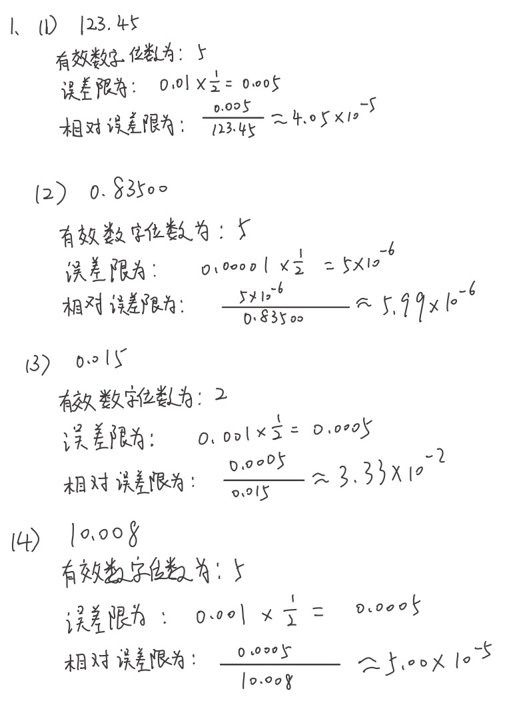

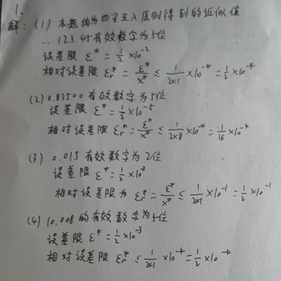

<!-- page: 24 -->

24
作业

计算机科学与工程学院
School of Computer Science & Engineering

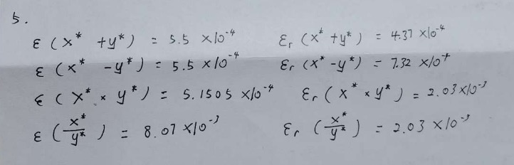

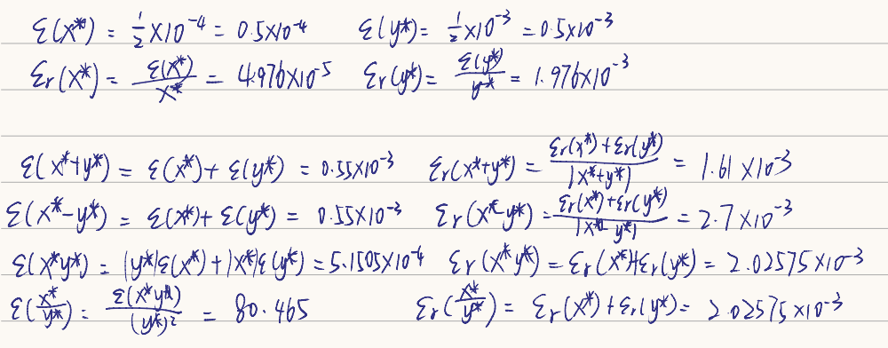

<!-- page: 25 -->

25
作业

计算机科学与工程学院
School of Computer Science & Engineering

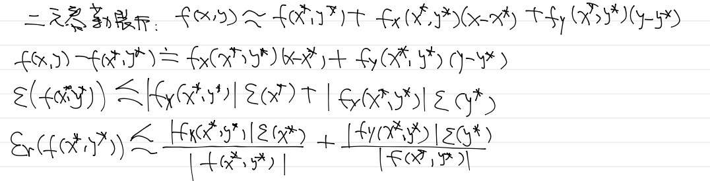

<!-- page: 26 -->

26
作业

计算机科学与工程学院
School of Computer Science & Engineering

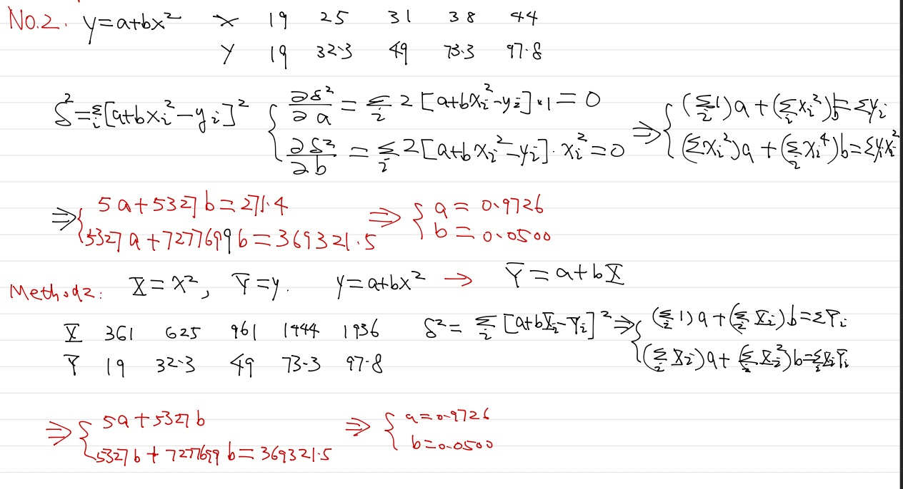

<!-- page: 27 -->

27
作业

计算机科学与工程学院
School of Computer Science & Engineering

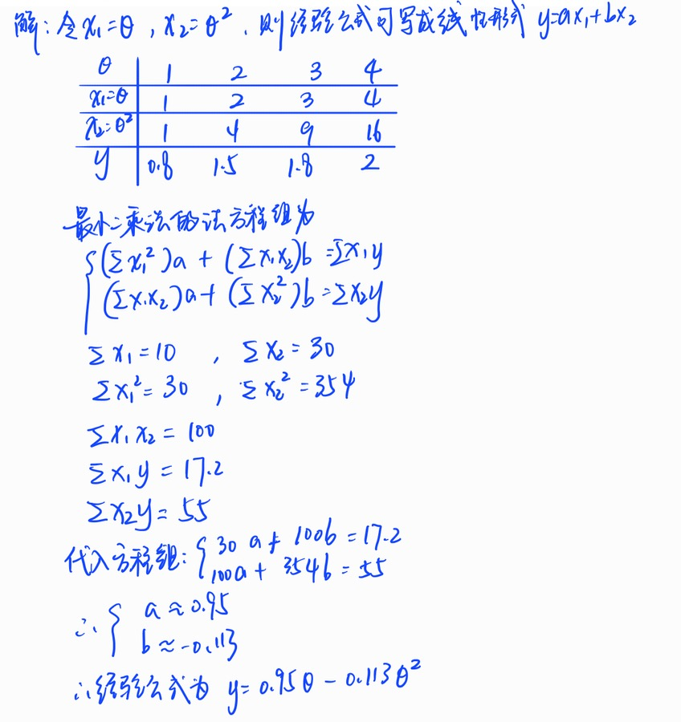

<!-- page: 28 -->

28
作业

计算机科学与工程学院
School of Computer Science & Engineering

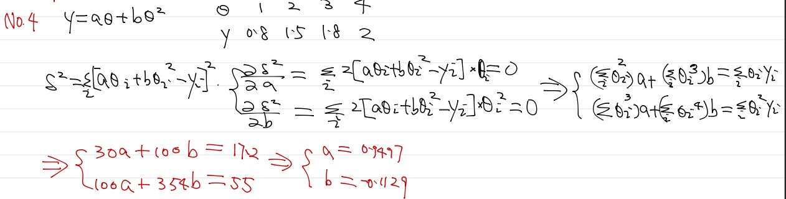

<!-- page: 29 -->

29
作业

计算机科学与工程学院
School of Computer Science & Engineering

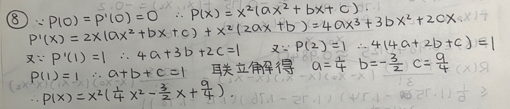

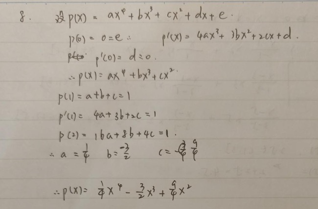

<!-- page: 30 -->

30
作业

计算机科学与工程学院
School of Computer Science & Engineering

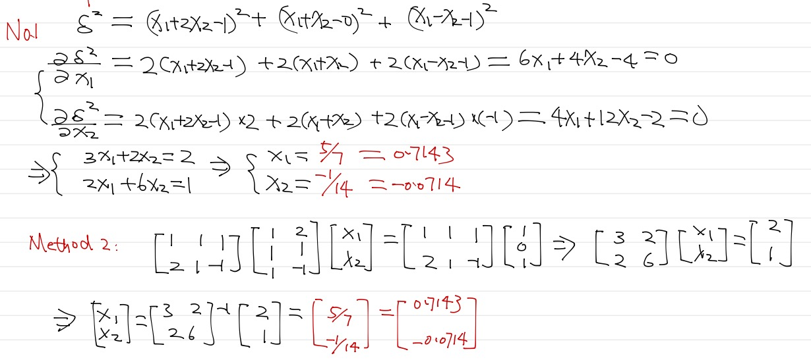

<!-- page: 31 -->

31
作业

计算机科学与工程学院
School of Computer Science & Engineering

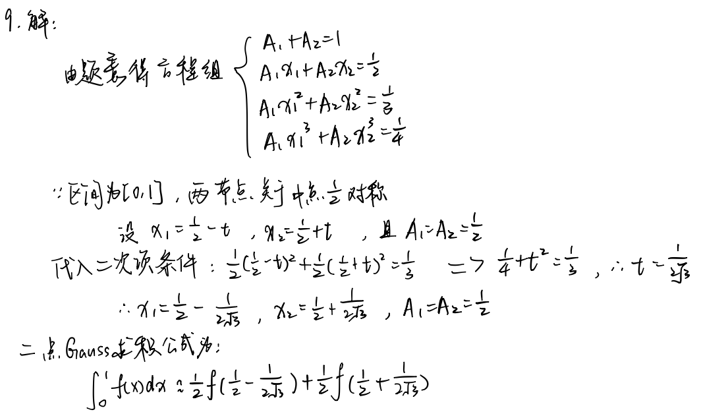

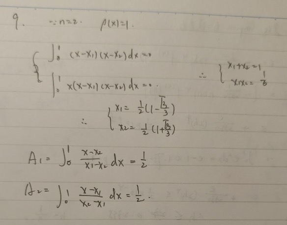

<!-- page: 32 -->

32
作业

计算机科学与工程学院
School of Computer Science & Engineering

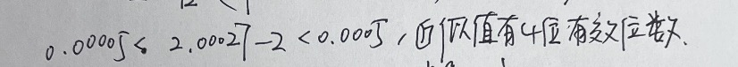

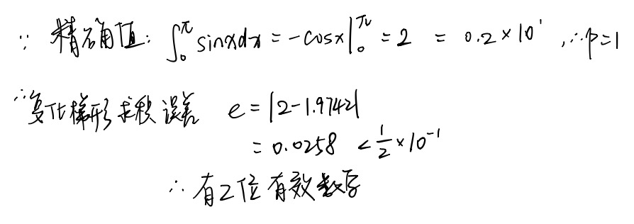

<!-- page: 33 -->

33
作业

计算机科学与工程学院
School of Computer Science & Engineering

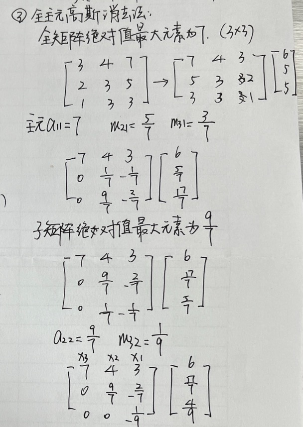

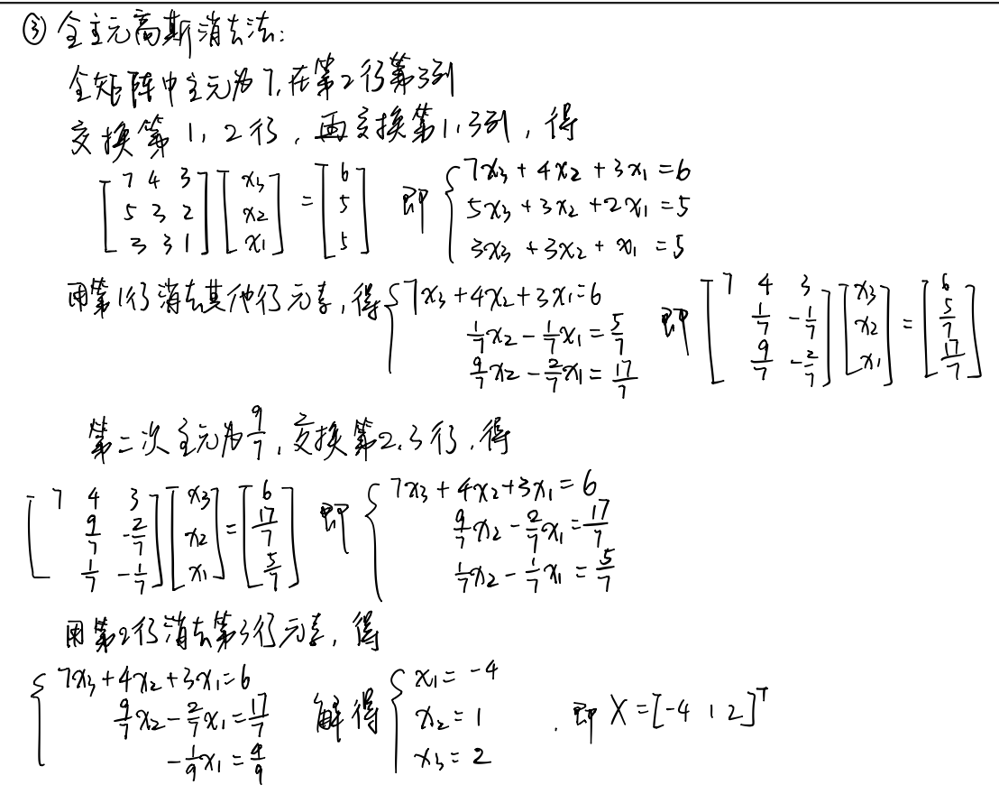

<!-- page: 34 -->

34

计算机科学与工程学院
School of Computer Science & Engineering

