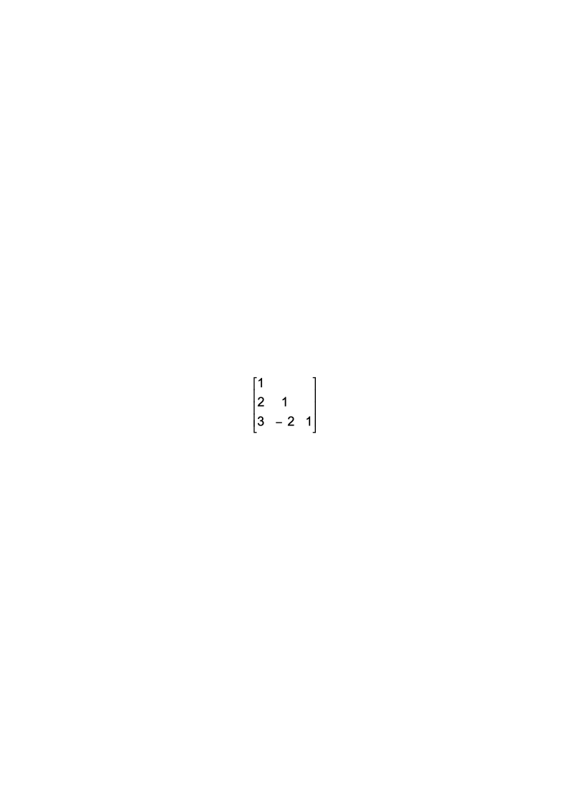
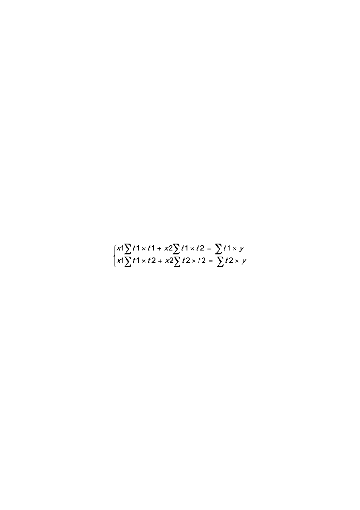

# 2016华工计算机计算方法(数值分析)考试试卷

考完试了，顺便把记得的题目背下来，应该都齐全了。我印象中也就只有这些题，题目中的数字应该是对的，我也验证过，不过也不一定保证是对的，也有可能我也算错了。还有就是试卷上面的题目可能没有我说的这么短，但是我也不能全把文字背下来，大概意思就是这样吧。每个部分的题目的顺序可能不是这样，但总体就是这四大块。至于每道题目的分值，我记得的就写出来了，有些题目没注意。我题目后面写的结果都是我考试时算出来的，考完了也懒得验证了，可能不一定对，自己把握吧，仅供参考。

华南理工大学2016计算机计算方法（数值分析）考试试卷

一 填空题（16分）
1. （6分）X*  = 3.14，准确值x = 3.141592，求绝对误差e(x*) =      ，相对误差er(x*) =     ，有效数位是     。
1. （4分）当插值函数的n越大时，会出现龙格现象，为解决这个问题，分段函数不一个不错的办法，请写出分段线性插值、分段三次Hermite插值和三次样条插值各自的特点。

<!-- question: computing-methods-006-Q1 -->

1. （3分）已知x和y相近，将lgx  –  lgy变换成      可以使其计算结果更准确。

<!-- question: computing-methods-006-Q2 -->

1. （3分）已知2x3  – 3x2  +2 = 0，求牛顿迭代法的迭代式子       。

解题思路：1.  这里的绝对误差和相对误差是没有加绝对值的，而且要注意是用哪个数减去哪个数得到的值，正负号会不一样；2.  可以从它们函数的连续性方面来说明；3.  只要满足课本所说的那几个要求就可以；这个记得迭代公式就可以直接写，记不住可以自己推导，就是用泰勒展开式来近似求值得到的迭代公式。

我最终的结果是：

<!-- question: computing-methods-006-Q3 -->

1. -0.001592 -0.000507 3

<!-- question: computing-methods-006-Q4 -->

1. 分段线性插值保证了插值函数的连续性，但是插值函数的一次导数不一定连续；

分段三次Hermite既保证了插值函数的连续性，也保证了其一次导数的连续性；

三次样条插值保证了插值函数及其一次导数和二次导数的连续性

<!-- question: computing-methods-006-Q5 -->

1. lg(x/y)

<!-- question: computing-methods-006-Q6 -->

1. xk+1  = xk  – (2x3  – 3x2  +2)/(6x2  -6x)

二 计算题（64分）
1. 已知f(x) = x3 –x  -1，用对分法求其在[0 , 2]区间内的根，误差要满小于0.2，需要对分多少次？请写出最后的根结果。

解题思路：每次求区间的中值并计算其对应的函数值，然后再计算下一个区间中值及函数值，一直到两次区间中值的绝对值小于0.2为止。

我最终算得的对分次数是4，根的结果为11/8.

<!-- question: computing-methods-006-Q7 -->

1. 根据以下数据回答相应问题：

| x | -2 | 0 | 4 | 5 |
|---|---|---|---|---|
| y | 5 | 1 | -3 | 1 |

<!-- question: computing-methods-006-Q8 -->

1. 请根据以上数据构造Lagrange三次插值函数；

<!-- question: computing-methods-006-Q9 -->

1. 请列出差商表并写出Newton三次插值函数。

解题思路：(1)  直接按照书本的定义把公式列出来就可以了，这个要把公式记住了才行，不然也写不了；(2)差商表就是计算Newton三次插值函数过程中计算到的中间值及结果值，可以先在草稿上按照Newton公式的计算过程把公式写出来，然后把中间用到的值整理成一个表格，这个表格就是差商表了，最后再把公式和表格都写到试卷上就行了。当然也可以先把表格写出来，再用表格的数据写出公式都可以。

因为我考试的时候也是先写表格，但是我感觉算的时候容易错，特别是除数的位置，很容易搞错相减的两个x的值。所以我想如果直接按照Newton公式用到的值来算，可能没那么容易混乱，因为需要哪个就算哪个，x的值比较明确，最后再把中间算出来的值填到表格里就可以了。当然这要看个人喜好了。

这里的结果有点长，不好写在这里，自己搞定吧，不难，只是直接套公式就可以了。

<!-- question: computing-methods-006-Q10 -->

1. 请用LU分解法求解以下方程组的解

$$
\begin{cases}2x_1+x_2-x_3=-1\\4x_1-x_2+3x_3=7\\6x_1+9x_2-x_3=-3\end{cases}
$$

解题思路：这个直接套公式算就好了，只要数没有算错，基本都是对的。有时候要注意看是列主元还是直接法，我当时好像没注意，这里应该没有要求用列主元LU。

我最终算得的结果是x1=1/2, x2=-1/2, x3=3/2，其中算出来的LU矩阵分别是：

L=    U=$\left[\begin{array}{ccc}2&1&-1\\-3&5&12\end{array}\right]$

<!-- question: computing-methods-006-Q11 -->

1. （12分）已知下列矩阵方程，根据以下要求回答问题：

$\begin{bmatrix}2&1&0\\1&3&1\\0&1&2\end{bmatrix}$$\left[\begin{array}{c}x_1\\x_2\\x_3\end{array}\right]$=$\left[\begin{array}{c}1\\-1\\1\end{array}\right]$

<!-- question: computing-methods-006-Q12 -->

1. 求该矩阵方程的高斯-赛达尔(Seidel)迭代法的收敛性；

<!-- question: computing-methods-006-Q13 -->

1. 求该矩阵方程的高斯-赛达尔(Seidel)迭代法的迭代公式；

<!-- question: computing-methods-006-Q14 -->

1. 已知X(0)  = (0,0,0)T，求X(1)?

解题思路：(1)  这个证明可以有两种方法，第一种用课本的定义来算，就是将系数矩阵的下三角系数全都乘上一个λ值，然后计算行列式，把所有的λ求出来，只要所有的|λ|都小于1，那么就收敛；第二种方法就是用课本的定理证明，如果系数矩阵是强对角占优的，那么简单迭代法（Jacobi）和Seidel迭代法都收敛，这道题刚好满足条件；(2)  这个迭代公式只要把L矩阵和U矩阵求出来就可以写出迭代公式了；(3)  把X(0)代入(2)中的迭代公式就可以求出来。

我的最终结果是：
1. 我直接用强对角占优证明，只写了两句话，不知道老师是不是要求我们用算的。。。至于强对角占优的判定，书上有，大概意思就是每一行中在主对角线上的那个数的绝对值比旁边所有数的绝对值加起来都要大就是强对角占优了。弱对角就是可以等于。详细定义翻书吧。

<!-- question: computing-methods-006-Q15 -->

1. 我算出来的L和U矩阵如下：

L=$\left[\begin{array}{ccc}0&0&0\\-\frac{1}{3}&0&-\frac{1}{2}&0\end{array}\right]$，U=$\left[\begin{array}{ccc}0&-\frac{1}{2}&0\\0&-\frac{1}{3}&0\\\end{array}\right]$，g=$\left[\begin{array}{c}1/2\\-1/3\\1/2\\\end{array}\right]$

迭代公式就是X(k+1)  = LX(x+1)  + UX(k)  + g

<!-- question: computing-methods-006-Q16 -->

1. X(1)  = (1/2, 1/6, 5/12)T

<!-- question: computing-methods-006-Q17 -->

1. 已知以下方程，请利用最小二乘法求解：

$$
\begin{cases}x_1+2x_2=5\\-x_1+5x_2=2\\3x_1+6x_2=13\\-2x_1+7x_2=0\end{cases}
$$

解题思路：首先构造一个多变量拟合函数f(t1,t2) = x1t1 + x2t2，可以把x1，x2看成是系数来求解，按照多变量拟合函数求解方法就可以得到结果。

我最终算得的结果是：

方程组为：

计算值并代入：$\begin{cases}15x_1+x_2=42\\x_1+114x_2=98\end{cases}$

计算的结果为：x1=2.744, x2=0.836
1. 请用复化梯形求积公式求出积分$\int_0^1e^{-x}dx$（注：里面的函数是e-x）的近似值，要求误差限满足5x10-5，请问需要将区间[0,1]分成多少份？

解题思路：首先是先把复化梯形求积公式的误差公式写出来，这个要记得，利用误差公式计算出满足精度要求的n即可。

我最终算得的结果是：

误差公式为|-f’’(ŋ)/12n2|=|-e-ŋ/12n2|= e-ŋ/12n2≤1/12n2≤5x10-5，

n≥100√6≈40.8，也就是n=41满足条件。

三 证明题（10分）

已知函数y=f(x)，其在区间[a,b]内的三个插值点为a,（a+b）/2,b.  请证明函数f(x)在[a,b]区间内满足下列关系：

$$
\int_{a}^{b}f(x)dx=(b-a)[f(a)+4f((a+b)/2)+f(b)]/6
$$

解题思路：利用这三个插值点写出插值函数，原函数约等于插值函数，所以原函数的积分也约等于插值函数的积分，然后算出插值函数的积分结果就是证明的公式，其实这个就是课本的Simpson公式的证明。

这个证明过程看课本吧。

四 程序题（10分）

前面有一段介绍列主元高斯消元法的步骤的说明（没背下来，都是文字，参考课本吧）

请按照列主元高斯消元法的思路将代码中的空格填写完整：

<!-- question: computing-methods-006-Q18 -->

1. 输入系数矩阵A，右端项b及ε；

<!-- question: computing-methods-006-Q19 -->

1. 选主元及消元：

for  k=1 to n-1 do

选主元：T =  |aik,k| = max k≤i≤n|aik|

若T <ε，则打印“求解失败”，停机；否则

若ik≠k，则交换A的第ik行和k行，交换bik行和bk行；

消元：for i=k+1  to n  do

T =    aik/akk

bi  = bi  – T x   bk

for  j=k+1  to n  do

aij  = aij  –T x    akj

<!-- question: computing-methods-006-Q20 -->

1. 回代

若|ann|≤ε，则打印“求解失败”，停机，否则

xn  =    bn  / ann

for i  = n-1  downto  1 do

xi  =     (bi  -$\sum_{j=1+1}^{n}aijxj$) / aii

<!-- question: computing-methods-006-Q21 -->

1. 打印xi(i=1,2,3…,n)

解题思路：这个直接按照列主元高斯消去法的计算过程去写就好了。

结果我写在代码里面了，是按照课本写的，我考试的时候写的应该也是这样。
