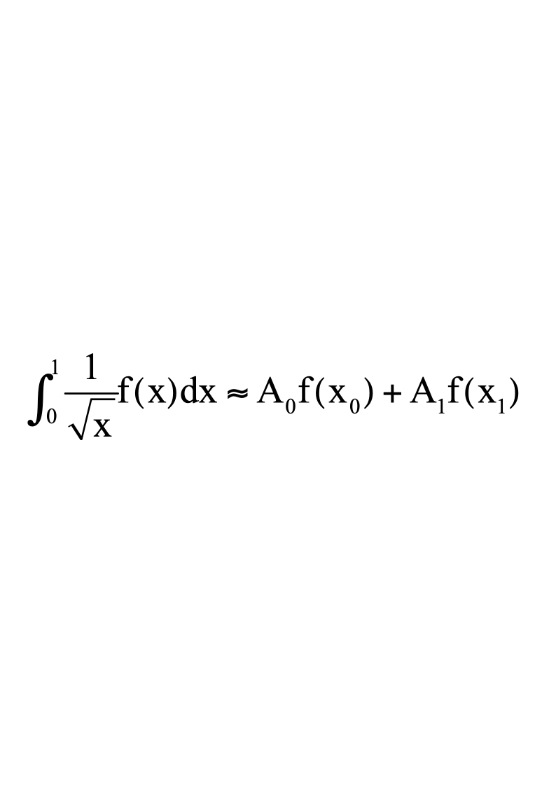

# 华南理工大学数值分析A

**诚信应考,考试作弊将带来严重后果！**

**华南理工大学期末考试**

**《数值分析》试卷A卷**

**注意事项：1.** **考前请将密封线内各项信息填写清楚；**

**2.** **可使用计算器，解答就答在试卷上；**

**3．考试形式：闭卷；**

**4.** **本试卷共 八大题，满分100分。考试时间120分钟**。

| **题 号** | **一** | **二** | **三** | **四** | **五** | **六** | **七** | **八** | **总分** |
|---|---|---|---|---|---|---|---|---|---|
| **得 分** |  |  |  |  |  |  |  |  |  |
| **评卷人** |  |  |  |  |  |  |  |  |  |

**一．填空题（每小题2分,** **共20分）**
1. **已知自然数e＝2.718281828459045…，取e≈2.71828，那么e具有的有效数字是____________.**
1. $\sqrt [3] {{x}^{}}$**的相对误差约是**${x}^{}$**的相对误差的_____** **倍.**
1. **为了减少舍入误差的影响,** **数值计算时应将$10-\sqrt{99}$改为___________.**
1. **求方程$x^{2}-2x+1=0$根的牛顿迭代格式为______________** **,收敛阶为_____________.**
1. **设$b=\begin{pmatrix}0,-4,3\end{pmatrix}^T$，则**${\left ‖ {b}\right ‖}_{\infty }$**= ________,$\|b\|_2$_______.**
1. **对于方程组**$\left \{ {\begin {matrix} 2{x}_{1}-5{x}_{2}=1 \\ 10{x}_{1}-4{x}_{2}=3 \end {matrix}}\right$**,** **Guass-seidel迭代法的迭代矩阵是**${B}_{G}$**=______________.**
1. **2个节点的Guass** **型求积公式代数精度为_________.**
1. **设**$f(x)={x}^{3}+3x-1$**，则差商**$f\left [ {0,1,2,3}\right ]$**=__________.**
1. **求解常微分方程初值问题的隐式欧拉方法的绝对稳定区间为_____________.**
1. **设$\{q_k(x)\}_{k=0}^{\infty}$为区间[0,1]上带权$\rho=x$且首项系数为1的k次正交多项式序列,** **其中$q_0(x)=1$,** **则$q_1(x)=$_________.**

**二.(10分)** **用直接三角分解方法解下列线形方程组**

**$\begin{pmatrix}2&1&5\\4&1&12\\-2&-4&5\end{pmatrix}\begin{pmatrix}x_1\\x_2\\x_3\end{pmatrix}=\begin{pmatrix}11\\27\\12\end{pmatrix}$**

**三. (12分)** **对于线性方程组**

**$\begin{pmatrix}-1&4&2\\2&3&10\\5&2&1\end{pmatrix}\begin{pmatrix}x_1\\x_2\\x_3\end{pmatrix}=\begin{pmatrix}20\\3\\12\end{pmatrix}$**

**写出其Jacobi迭代法及其Guass-Seidel迭代法的分量形式,** **并判断它们的收敛性.**

**四. (12分)** **对于求$\sqrt{3}$的近似值,** **若将其视为$(x^2-3)^2=0$的根,**

**(1).** **写出相应的Newton迭代公式.**

**(2).** **指出其收敛阶(需说明依据).**

**五.** **(12分)** **依据如下函数值表**

<table>
<tr><td>x</td><td>**0**</td><td>**1**</td></tr>
<tr><td>f(x)</td><td>**1**</td><td>**2**</td></tr>
<tr><td>f'(x)</td><td>**0**</td><td></td></tr>
</table>

**(1).** **构造插值多项式满足以上插值条件**

**(2).** **推导出插值余项.**

**六.(10分)** **已知离散数据表**

| **x** | **1** | **2** | **3** | **4** |
|---|---|---|---|---|
| **y=f(x)** | **0.8** | **1.5** | **1.8** | **2.0** |

**若用形如$y=ax+bx^{2}$进行曲线拟合,** **求出该拟合曲线.**

**七. (12分)** **构造带权$\rho(x)=\frac{1}{\sqrt{x}}$的Guass型求积公式.**

****

**八. (12分)** **对于常微分方程的初值问题**

**$\frac{dy}{dx}=-2y,y(0)=2$**

**(1).** **若用改进的欧拉方法求解,** **证明该方法的收敛性.**

**(2).** **讨论改进欧拉方法的稳定条件.**
