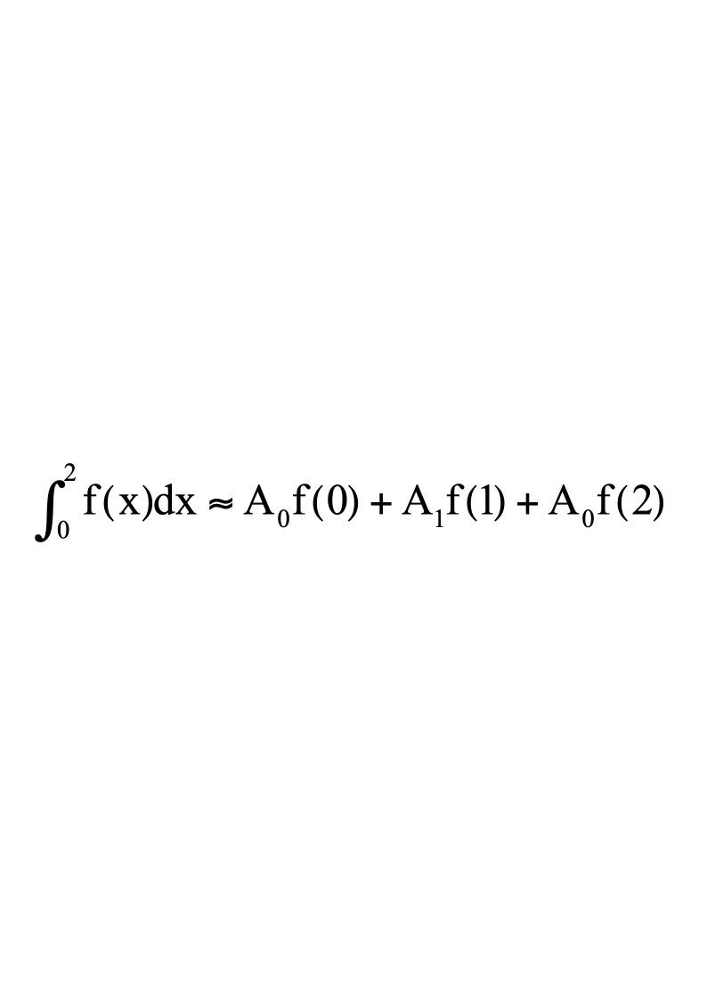
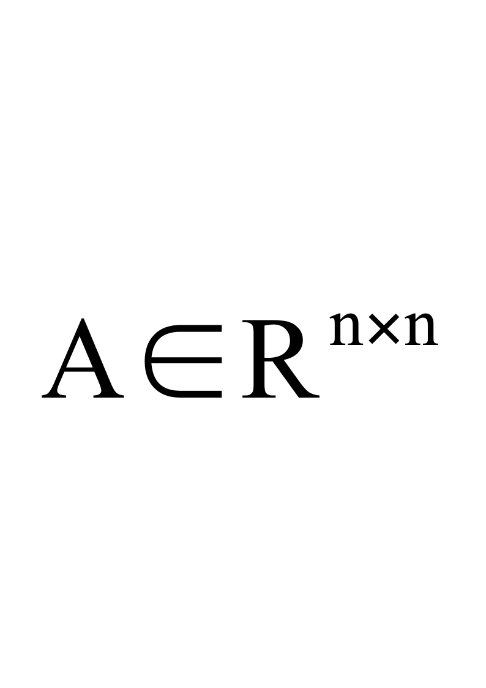
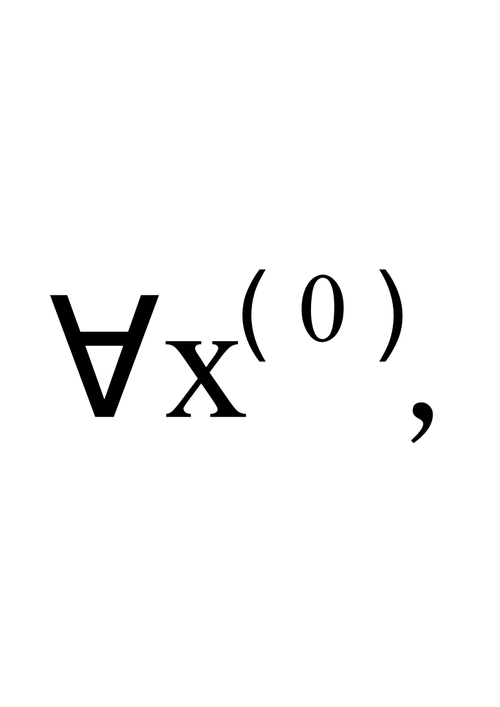
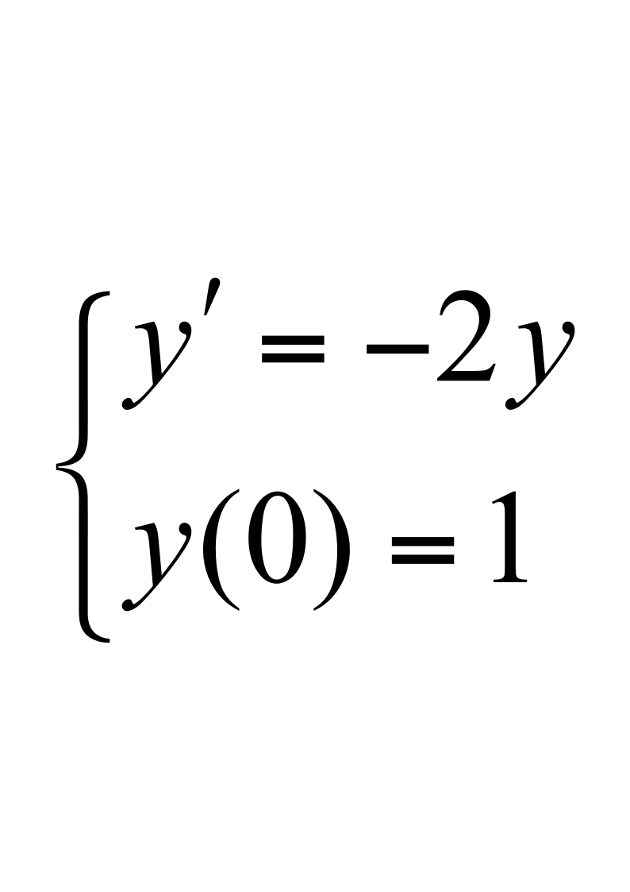

# 华南理工大学数值分析试题C

**华南理工大学研究生课程考试**

**《数值分析》试卷C**

**注意事项：1.** **考前请将密封线内各项信息填写清楚；**

**2.** **所有答案请按要求填写在本试卷上；**

**3.** **课程代码：S0003004**

**4.** **考试形式：闭卷**

**5.** **考生类别：硕士研究生**

**6.** **本试卷共八大题，满分100分，考试时间为150分钟。**

一．选择、判断、填空题(10小题,每小题2分,共20分):

*********  ***第******1******--2******小题******:*** ***选择******A******、******B******、******C******、******D******四个答案之一******,*** ***填在括号内******,*** ***使命题成立***  *********

<!-- question: computing-methods-014-Q1 -->

1．若近似数0.012300的绝对误差限为0.5×10－5，则该近似数有(       )位有效数字。

A) 3            B) 4           C) 5           D) 6

<!-- question: computing-methods-014-Q2 -->

2．在下列求解常微分方程初值问题的数值方法中，(     )的局部截断误差为*O* (*h* 3  )。

A)  隐式Euler公式      B)  梯形公式		C) 3阶Runge－Kutta法    D) 4阶Runge－Kutta法

*********  ***第******3-******-******6******小题******:*** ***判断正误******,*** ***正确写******"******√*** ***",*** ***错误写******"******×*** ***",*** ***填在括号内***  *********

3．设有递推公式  $\left.\begin{matrix}y_{0}=\sqrt{3}\\y_{n}=2y_{n-1}-1,\quadn=1,2,\cdots\end{matrix}\right.$  ，如果取$y_0=\sqrt{3}\approx1.73$进行计算，则该计算过程是数值不稳定的。（     ）

4．解方程组 Ax=b  时，Jacobi迭代和Gauss-Seidel迭代对任意的x(0)收敛的充分必要条件是A严格对角占优。（     ）

<!-- question: computing-methods-014-Q3 -->

5．方程  $10x-2+e^x=0$  不存在有根区间。（     ）

<!-- question: computing-methods-014-Q4 -->

6． 4个节点的Gauss型求积公式具有9次代数精度。（     ）

*********  ***第******7--10******小题******:***  ***填空题，将答案填在横线上***   *********

7．设$A=\begin{bmatrix}0&2\\8&0\end{bmatrix}$，则$\|A\|_\infty$           ，$Cond\left(A\right)_{1}=$            。

8．已知方程组 Ax=b ，其中$A=\begin{bmatrix}2&3\\10&6\end{bmatrix}$，则求解此方程组的的J迭代法的迭代矩阵是

。

9．设$f(x)={x}^{3}+3x-1$，则均差$f\left [ {0,1,2,3}\right ]$=                    。

10．设数值求积公式$\int_{a}^{b}f(x)dx\approx\sum_{k=1}^{n}A_kf(x_k)$为Newton-Cotes  公式， 则当  n为奇数时代数精度为             次，  n为偶数时代数精度为              次。

二．(  12分)设给定y=f(x)（设f(x)四阶连续可微）的数值表

| xi | 0 | 1 | 2 |
|---|---|---|---|
| yi=f(xi) | 1 | 3 | 4 |

<!-- question: computing-methods-014-Q5 -->

（1）求上表的二次插值多项式p(x),并写出余项 f(x)-p(x)的表达式(不必证明)  ；

（2）求一个三次多项式q(x),使它取上表中各值且满足q*'*(1)= f*'*(1) = 1 。并写出余项f(x)-q(x)的表达式(不必证明)。

三．(  11  分) 若用最小二乘法寻找形如  $y=a+bx^{2}$  的多项式,使之与一组已知数据: $({x}_{i},{y}_{i}),i=1,2,\cdots ,N$ 相拟合,  试从最小二乘法概念出发（不是直接从法方程出发）导出*a*和*b*满足的法方程（不必解出*a*和*b*）。

四．(11分) 已知某求积公式的形式如下

<!-- question: computing-methods-014-Q6 -->

(1)  试求出其中待定的常数$A_0,A_1,A_2$，使得求积公式代数精度尽量高。

<!-- question: computing-methods-014-Q7 -->

(2)  该积分公式是Guass型的吗？请说明理由。

五．(  11  分) 用列主元Gauss消去法解方程组（用增广矩阵表示过程）：

$$
\left [ {\begin {matrix} 1 & 2 & 3 \\ 5 & 4 & 10 \\ 3 & -0.1 & 1 \end {matrix}}\right ] \left [ {\begin {matrix} {x}_{1} \\ {x}_{2} \\ {x}_{3} \end {matrix}}\right ]=\left [ {\begin {matrix} 1 \\ 0 \\ 2 \end {matrix}}\right ]
$$

六．(11  分) 设非奇异,  $b\in\mathbb{R}^{n}$,  证明:  对于  迭代公式

$$
X^{(k+1)}=X^{(k)}+\frac{1}{\alpha^2}A^T(b-Ax^{(k)})
$$

产生的近似解序列收敛于方程组Ax=b  的解，其中  $alpha=||A||_2$

七．(  12分) 试导出求$\frac{1}{\sqrt{3}}$的Newton迭代公式，使公式既无开方又无除法运算，并根据收敛阶的判据求其收敛阶。

八．(12分) 若用Euler公式（ *y**n* +1 =*y**n*  +*hf*(*x**n*  ,*y**n*)  ）解初值问题

(1)试推导出其数值解的表达式：$y_n=(1-2h)^n$，并证明它收敛于准确解 $y(x_n)=e^{-2x_n}$。

<!-- question: computing-methods-014-Q8 -->

（2）讨论该数值方法的绝对稳定条件。
