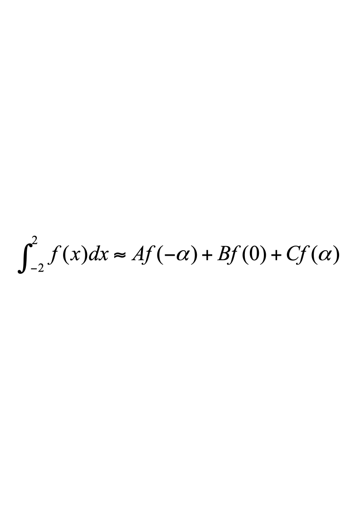

# 数学系09级数值分析A

**诚信应考,考试作弊将带来严重后果！**

**华南理工大学2012-2013年度**

**第二学期期末考试**

**《数值分析》试卷A卷**

**注意事项：1.** **考前请将密封线内各项信息填写清楚；**

**2.** **可使用计算器，解答就写在试卷上；**

**3．考试形式：闭卷；**

**4.** **本试卷共 八大题，满分100分。考试时间120分钟**。

| **题 号** | **一** | **二** | **三** | **四** | **五** | **六** | **七** | **八** | **总分** |
|---|---|---|---|---|---|---|---|---|---|
| **得 分** |  |  |  |  |  |  |  |  |  |
| **评卷人** |  |  |  |  |  |  |  |  |  |

**一．单项选择题（每小题2分,** **共10分）**

**1．若近似数0.034560的绝对误差限为0.5×10－6，则该近似数有(       )位有效数字。**

**A)  3           B)  4           C)  5            D)  6**

**2．下面（     ）不是数值计算应注意的问题**

**（A）注意简化计算步骤，减少运算次数      （B）要避免相近两数相减**

**（C）要选择数值稳定的算法                （D）要设法消灭误差**

**3.** **下列说法错误的是（     ）**

**（A）非奇异矩阵必有LU分解**

**（B）正定矩阵必有LU分解**

**（C）如果对称矩阵的各阶顺序主子式不等于零，则必有LU分解**

**（D）非奇异矩阵未必有LU分解。**

**4.** **用列主元高斯消去法解方程组**

$\begin {gathered} \left \{ {3{x}_{1}-{x}_{2}+4{x}_{3}=1\middle | }\right \left \{ {-{x}_{1}+2{x}_{2}-9{x}_{3}=0\middle | }\right \end {gathered}$ **，第一步消元，选择的主元为（    ）**

**（A）3**      **（B）4**      **（C）-4**       **（D）-9**

**5.** **用高斯—赛德尔迭代法解方程组**$\begin {gathered} \left \{ {{x}_{1}+{ax}_{2}=4\middle | }\right \end {gathered}$**收敛的充分必要条件是（   ）**

**（A）**$\left | {a}\right |<\sqrt {\frac {1} {2}}$  **（B）**$\left | {a}\right |\le \sqrt {\frac {1} {2}}$  **（C）**$\left | {a}\right |<1$  **（D）**$\left | {a}\right |\le 1$

**二.** **填空题（每小题3分,** **共15分）**

**1.** **设有递推公式** **$\left.\begin{matrix}y_{0}=\sqrt{3}\\y_{n}=2y_{n-1}-1,\quadn=1,2,\cdots\end{matrix}\right.$** **，如果取$y_0=\sqrt{3}\approx1.73$进行**

**计算，则该计算过程是数值**          **（填:稳定或不稳定）的.**

**2.** **计算** **$P=(\frac{1}{x-1})^5+3(\frac{1}{x-1})^4-6(\frac{1}{x-1})^3+2(\frac{1}{x-1})^2+8(\frac{1}{x-1})+1$** **时，**

**为了减少乘除运算次数，应把它改写成:**

**.**

**3.** **设$b=\begin{pmatrix}4,-3,0\end{pmatrix}^T$，则** **$\|\mathbf{b}\|_1$=**          **,** **$\|b\|_2$**          **.**

**4.** **对迭代函数$\varphi=x+\lambda(x^2-5)$，使迭代公式** **$x_{k+1}=\varphi(x_k)$** **（$k=0,1,\cdots$）**

**局部收敛于$x^{*}=\sqrt{5}$的$a$取值范围是**                      **.**

**5.** **设$f(x)=x^{2}+3x-5$，则均差** $f\left [ {0,1,2,3}\right ]$**=**                 **.**

**三.  (12分)** **用直接三角分解法解下列线性方程组:**

$$
\begin{bmatrix}1&0&2&0\\0&1&0&1\\1&2&4&3\\0&1&0&3\end{bmatrix}\begin{bmatrix}x_1\\x_2\\x_3\\x_4\end{bmatrix}=\begin{bmatrix}5\\3\\17\\7\end{bmatrix}
$$

**四. (12分)**  **试导出求$\frac{1}{\sqrt{3}}$的Newton迭代公式,** **使公式既无开方又无除法**

**运算;** **并确定其收敛阶(需说明依据)。**

**五.**  **(14分)** **设给定y=f(x)（设f(x)四阶连续可微）的数值表**

| **x****i** | **0** | **1** | **2** |
|---|---|---|---|
| **y****i****=f(x****i****)** | **1** | **3** | **4** |

**（1）求上表的二次插值多项式p(x),并写出误差** **f(x)-p(x)的表达式(不必证明)** **；**

**（2）求一个三次多项式q(x),它取上表中各值且满足q’(1)= f’(1) = 1;**

**并写出误差f(x)-q(x)的表达式(不必证明)。**

**六. (12分)** 设有试验数据如下：

| **x** | **1** | **2** | **3** | **4** |
|---|---|---|---|---|
| **y=f(x)** | **4** | **10** | **18** | **26** |

**若用形如$y=a+bx^{2}$的曲线进行最小二乘拟合,** **求出该拟合曲线。**

**七.  (12分)** **试确定常数*****A*****,*****B*****,*****C*****及$alpha$，使求积公式：**

****

**有尽可能高的代数精度，并指出代数精度是多少，该公式是Gauss型求积公式吗？**

**八. (13分)** **用欧拉方法求解初值问题** **$y'=ax+b,y(0)=0$；**

**（1）试导出近似解$y_n$的显式表达式；**

**（2）证明整体截断误差为**

**$y(x_n)-y_n=\frac{1}{2}anh^2$**    **.**
