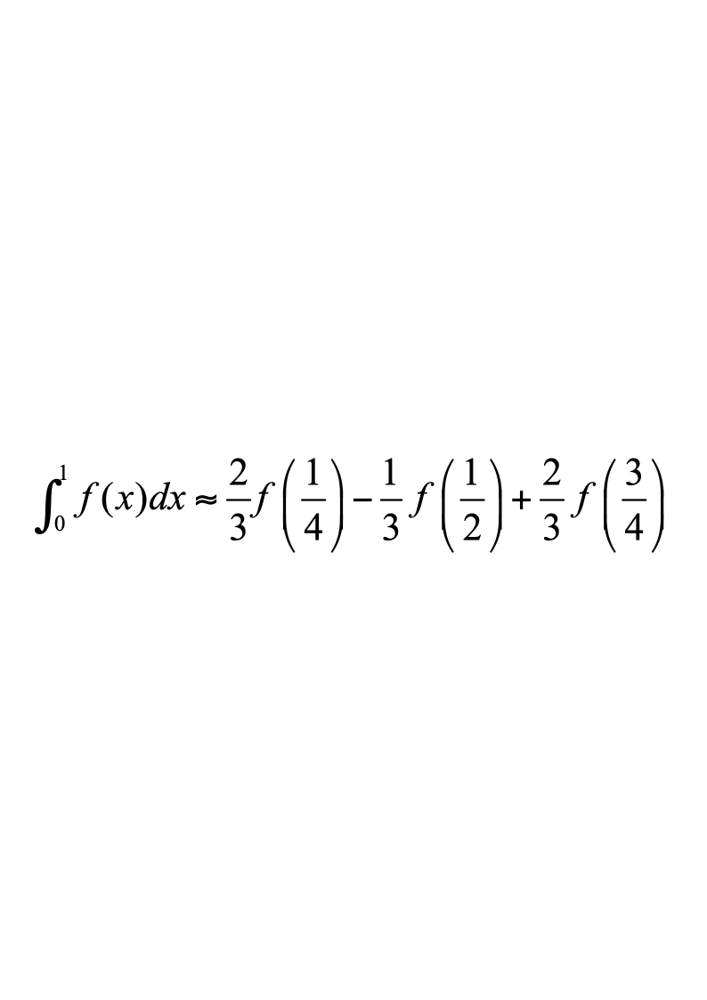
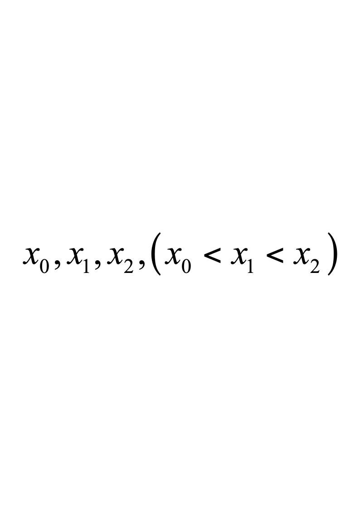
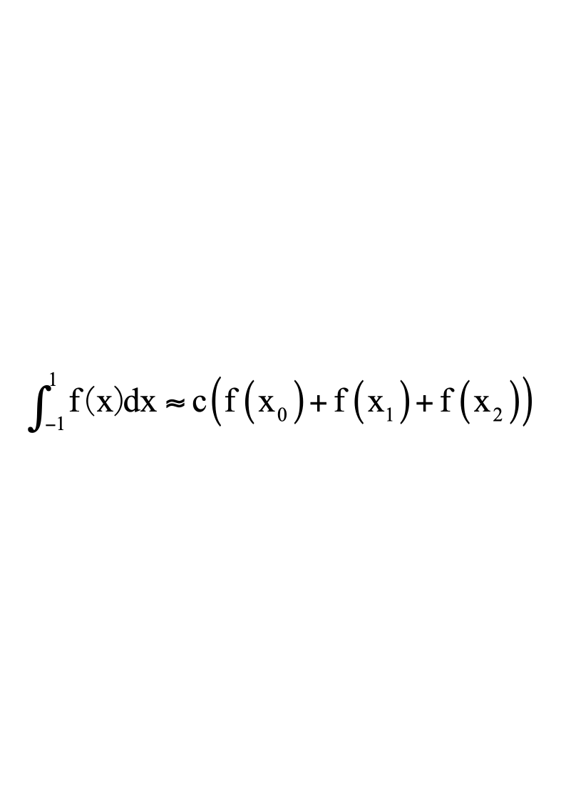
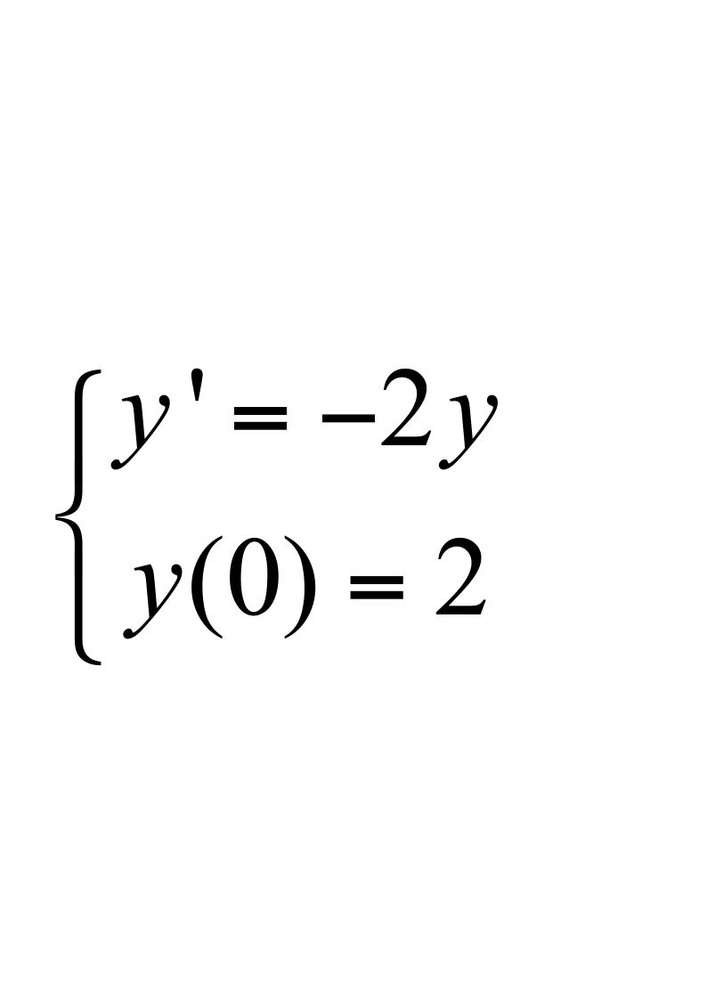

# 数学系11级数值分析A

**诚信应考,考试作弊将带来严重后果！**

**华南理工大学2012-2013学年**

**第二学期期末考试**

**《数值分析》A卷**

**注意事项：1.** **考前请将密封线内各项信息填写清楚；**

**2.** **可使用计算器，答案写在试卷上；**

**3．考试形式：闭卷；**

**4.** **本试卷共 四大题，满分100分。考试时间120分钟**。

| **题 号** | **一** | **二** | **三** | **四** | **总分** |
|---|---|---|---|---|---|
| **得 分** |  |  |  |  |  |
| **评卷人** |  |  |  |  |  |

**一．单项选择题（每小题2分,** **共10分）**

**1．若近似数0.003400的绝对误差限为0.5×10－5，则该近似数有有效数字为（  ）**

**A) 2           B)  3           C)  4            D)  6**

**2．选择数值稳定的算法是为了(      )。**

**（A）** **简化计算步骤**                 **（B）控制舍入误差的积累**

**（C）** **节省存储空间**                 **（D）减小截断误差**

**3.** **下列说法错误的是（     ）**

**（A）正定矩阵必有LU分解**

**（B）Guass消去过程中引入主元技巧目的是为了提高计算公式的数值稳定性（C）对于求线性方程组的迭代法$x^{(k+1)}=Bx^{(k)}+f$，若B严格对角占优，则收敛**

**（D）若方程组$Ax=b$中A对称正定，则解此方程组的Jacobi方法收敛。**

**4.** **对于Newton-Cotes求积公式$\int_a^bf(x)dx\approx(b-a)\sum_{k=1}^{n}C_kf(x_k)$，若n为偶数时，其代数精度为 （     ）**

**（A）n**         **（B）n+1**        **（C）n-1**          **（D）n+2**

**5.** **在下列解常微分方程初值问题的数值方法中，局部截断误差为** ***O*** **(*****h*** **3** **)为 （ ）**

**(A)**  **隐式Euler公式**                **(B)**  **梯形公式**

**(C)  3阶Runge－Kutta法**           **(D)  4阶Runge－Kutta法**

**二.** **填空题（每小题3分,** **共15分）**

**6.** **为了减少舍入误差的影响,** **数值计算时应将$10-3\sqrt{11}$改写成____________**

**7.** **设$b=\begin{pmatrix}2\\-3\\1\end{pmatrix}$，则** **$\|\mathbf{b}\|_1$=**          **,** **$\|b\|_2$**          **.**

**8** **对迭代函数$\varphi=x+\lambda(x^2-5)$，使迭代公式** **$x_{k+1}=\varphi(x_k)$** **（$k=0,1,\cdots$）**

**局部收敛于$x^{*}=\sqrt{5}$的$a$取值范围是**                      **.**

**9.** **若$f(x)=x^3+2x^2+3x-5$，则均差** $f\left [ {0,1,2,3}\right ]$**=**             **.**

**10.数值求积公式代数精度为______**

**三.** **计算题(每小题10分，共30分)**

**11.** **用列主元Guass消去法求解下列线性方程组（可用增广矩阵表示过程）**

$$
\begin{bmatrix}3&-2&-6\\10&-7&0\\5&-1&5\end{bmatrix}\begin{bmatrix}x_1\\x_2\\x_3\end{bmatrix}=\begin{bmatrix}-4\\7\\6\end{bmatrix}
$$

**12.** 设有试验数据如下：

| **x** | **2** | **2.5** | **3** | **4** | **5** | **5.5** |
|---|---|---|---|---|---|---|
| **y=f(x)** | **4** | **4.5** | **6** | **8** | **8.5** | **9** |

**试用直线拟合这组数据。（结果保留5位有效数字）**

**13.** **已知$e^{-x^{2}}$在7个等距节点上的函数值如下表。利用现成的函数表，分别用复化梯形公式和复化Simpson公式计算$\int_{0}^{1}e^{-x^2}dx$的近似值。**

| **x** | **0** | **1/6** | **2/6** | **3/6** | **4/6** | **5/6** | **1** |
|---|---|---|---|---|---|---|---|
| **$e^{-x^{2}}$** | **1** | **0.972604** | **0.894839** | **0.778800** | **0.641180** | **0.499351** | **0.367879** |

**四． 综合解答题（共45分）。**

**14.**  **(12分)** **设给定y=f(x)（设f(x)四阶连续可微）的数值表**

| **x** | **0** | **1** | **2** |
|---|---|---|---|
| **y=f(x)** | **1** | **3** | **4** |

**（1）求上表的二次插值多项式p(x),并写出误差** **f(x)-p(x)的表达式**

**（2）求一个三次多项式q(x),它取上表中各值且满足$q'(1)=f'(1)=1$;**

**并写出误差f(x)-q(x)的表达式**

**15. (8分)若利用迭代法$x_{k+1}=x_k+c(x_k^2-3)$计算$\sqrt{3}$的近似值时，（其中C为参数）(1).** **当C为何值时，此迭代法收敛？**

**(2).  C取何值时，收敛最快。**

**16.  (12分)** **求三个不同的节点以及常数c,使得数值求积公式**

****

**代数精度尽量高.该积分公式是否是Guass型的,** **并说明理由.**

**17. (13分)** **若用改进欧拉公式解初值问题**

**(1)** **证明它收敛于准确解** **$y(x_n)=2e^{-2x_n}$。**

**(2)** **试推导出该数值方法的绝对稳定条件。**    **.**
