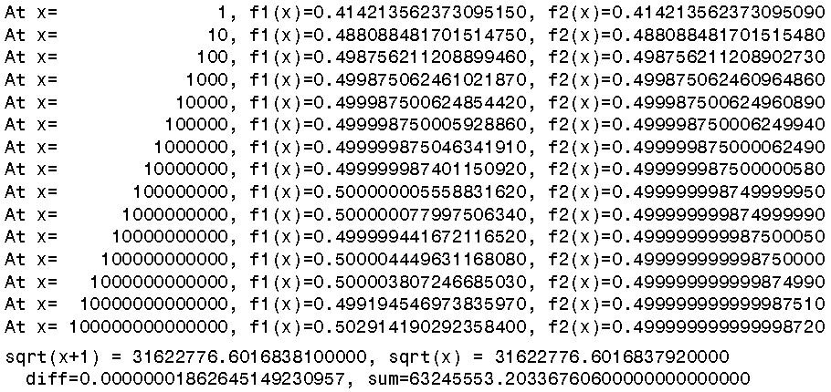
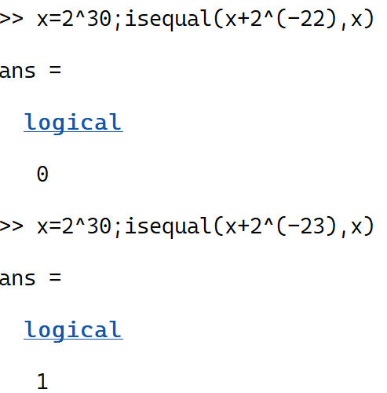
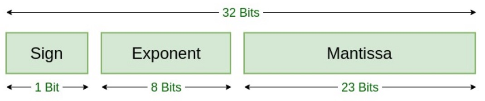
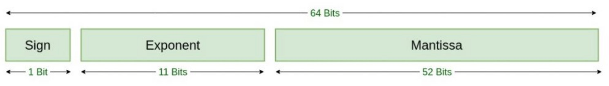

# 1 误差

<!-- page: 1 -->

计算方法
Computational Methods

何军辉
hejh@scut.edu.cn

<!-- page: 2 -->

2
课程概览

o 教师信息

o
电话：18925082886

o
邮件：hejh@scut.edu.cn

o
办公室：大学城校区 B7-509
o 课程安排

1. 理论教学：

o
第1-12周星期一第5-7节
o
第 13  周星期一第5-8节
o
课室：A1-101
2. 实验教学：

o
2次（具体待定）
o 讲义发布

n QQ群：674025962

计算机科学与工程学院
School of Computer Science & Engineering

<!-- page: 3 -->

3
课程概览

o 教材信息

n 数值分析

n 韩国强，林伟健编

n 华南理工大学出版社

n
电子版-QQ群

o 参考书籍

n J.H. Mathews and K.D. Fink. Numerical Methods Using

MATLAB (4th Edition).

n
自行网络下载

计算机科学与工程学院
School of Computer Science & Engineering

<!-- page: 4 -->

4
课程考核

o 考试形式：闭卷考试

o 总评成绩

n 课堂出勤：    10%
n 实验/作业：   20%

n 期末考试：    70%

o 实验评定

n 实验出勤：    10%

n 操作及报告： 90%

计算机科学与工程学院
School of Computer Science & Engineering

<!-- page: 5 -->

1 误差

Error Type, Error Analysis, Error Avoiding

何军辉
hejh@scut.edu.cn

<!-- page: 6 -->

6
1.1 误差的来源

o 科学研究、科学试验和工程技术中的实际问题

经常要用数学工具解决。

o 用计算机解决科学计算问题的一般过程如下：

实际问题
计算方法
数学模型

程序设计
上机计算求得结果

1. 模型误差：

n 数学模型是对被描述的实际问题进行抽象、简

化而得到的，因而是近似的.

n 模型误差是数学模型与实际问题之间出现的误

差

计算机科学与工程学院
School of Computer Science & Engineering

<!-- page: 7 -->

7
1.1 误差的来源

2. 观测误差：

n 在数学模型中往往还有一些根据观测得到的物

理量，如温度、长度、电压等等，这些量显然
也包含误差.

n 由观测产生的误差称为观测误差

3. 方法误差：

n 当数学模型不能得到精确解时，通常要用数值

方法求它的近似解.

n 近似解与精确解之间的误差称为截断误差或方

法误差

计算机科学与工程学院
School of Computer Science & Engineering

<!-- page: 8 -->

8
1.1 误差的来源

4. 舍入误差：

n
有了计算公式后，在用计算机做数值计算时，
还要受计算机字长的限制.

n
原始数据在计算机上表示会产生误差.

n
计算过程又可能产生新的误差，这类误差称为
舍入误差.

计算机科学与工程学院
School of Computer Science & Engineering

<!-- page: 9 -->

9
1.2 误差、误差限和有效数字

o 误差

定义：设𝑥为准确值，𝑥∗为𝑥的一个近似值，则近
似值与准确值之间的差称为误差，记为𝑒∗

𝑒∗= 𝑥∗−𝑥

误差有时也称为绝对误差.

o 误差𝑒∗可正可负：

n 当误差为正时近似值偏大，叫强近似值

n 当误差为负时近似值偏小，叫弱近似值

计算机科学与工程学院
School of Computer Science & Engineering

<!-- page: 10 -->

10
1.2 误差、误差限和有效数字

o 误差限

n 一般情况下，准确值𝑥是未知的，因此误差𝑒∗的准确值也

未知.

n 但有时可以根据具体测量或计算估计出误差的绝对值不

可能超过某个正数（上界），这个正数通常称为误差限.

o 定义：若𝑒∗= 𝑥∗−𝑥≤𝜖∗，则𝜖∗称为近似值𝑥∗的误差

限，近似值𝑥∗的误差限也记为𝜖(𝑥∗).

n 由于𝑥∗−𝑥≤𝜖∗，所以𝑥∗−𝜖∗≤𝑥≤𝑥∗+ 𝜖∗，也可以

表示为𝑥= 𝑥∗± 𝜖∗.

计算机科学与工程学院
School of Computer Science & Engineering

<!-- page: 11 -->

11
1.2 误差、误差限和有效数字

o 例：用毫米刻度的米尺测量一长度𝑥，读出和该长度接

近的刻度𝑥∗𝑚𝑚，则𝑥∗是𝑥的近似值，试求长度𝑥的范围
.

o 答：由该米尺的精度可知𝜖𝑥∗= 0.5𝑚𝑚，即有𝑥∗−𝑥

≤𝜖∗= 0.5𝑚𝑚，所以𝑥∗−0.5 ≤𝑥≤𝑥∗+ 0.5，也可以表
示为𝑥= 𝑥∗± 0.5.

n 如读出的长度为765𝑚𝑚，则有764.5 ≤𝑥≤765.5

计算机科学与工程学院
School of Computer Science & Engineering

<!-- page: 12 -->

12
1.2 误差、误差限和有效数字

o 四舍五入

例：𝜋= 3.14159265 ⋯

o 取3位数字得：

∗= 3.14,
𝑒"

∗= 𝑥"

∗−𝜋≈−0.00159265

𝑥"

o 取5位数字得：

∗= 3.1416,
𝑒#

∗= 𝑥#

∗−𝜋≈0.00000735

𝑥#

o 取6位数字得：

∗= 3.14159,
𝑒$

∗= 𝑥$

∗−𝜋≈−0.00000265

𝑥$

计算机科学与工程学院
School of Computer Science & Engineering

<!-- page: 13 -->

13
1.2 误差、误差限和有效数字

o 观察误差：

∗= 3.14 −𝜋≈0.00159265 < 1

2 ×10%&

𝑒"

∗= 3.1416 −𝜋≈0.00000735 < 1

2 ×10%'

𝑒#

∗= 3.14159 −𝜋≈0.00000265 < 1

2 ×10%#

𝑒$

o 任何经过四舍五入后得到的近似值的误差限是它末位的

半个单位.

计算机科学与工程学院
School of Computer Science & Engineering

<!-- page: 14 -->

14
1.2 误差、误差限和有效数字

o 有效数字：

定义：若近似值𝑥∗的误差限为该值的某一位的半个单位，
且从该位开始往左数到𝑥∗的第一位非0数字共有𝑛位，则称
近似值𝑥∗具有𝑛位有效数字.

∗= 3.14作为𝜋的近似值，𝑥"

∗具有3位有效数字：

例：如取𝑥"

∗| = 3.14 −𝜋≈0.00159265 < 1

2 ×10%&

|𝑒"

计算机科学与工程学院
School of Computer Science & Engineering

<!-- page: 15 -->

15
1.2 误差、误差限和有效数字

o 一般地 ，凡是经过四舍五入得到的近似值，它的有效数

字位等于从该近似值的末位开始往左数起到第一位非0
数字的位数

例：对0.045678小数点后第5位进行四舍五入得到0.0457
，则0.0457具有3位有效数字.

例：按四舍五入原则写出下列各数据有5位有效数字的近似
数：

187.9325,  0.03785551, 8.000033

187.93， 0.037856，8.0000

o 通常认为准确值具有无穷多位有效数字.

计算机科学与工程学院
School of Computer Science & Engineering

<!-- page: 16 -->

16
1.2 误差、误差限和有效数字

o 有效数字与误差限的关系

定义：设𝑥∗是准确值𝑥的近似值，且将𝑥∗表示为

𝑥∗= ±0. 𝛼(𝛼& ⋯𝛼)×10*

𝑝为整数；𝛼(, 𝛼&, ⋯, 𝛼)为0~9之间的数字，且𝛼( ≠0，若
有

𝑥∗−𝑥≤1

2 ×10*%+

则近似值𝑥∗具有𝑛位有效数字.

1. 已知近似值的误差限求有效数字位数

2. 已知有效数字位数求近似值的误差限

计算机科学与工程学院
School of Computer Science & Engineering

<!-- page: 17 -->

17
1.2 误差、误差限和有效数字

例：假设𝑥∗= 0.0012345是准确值𝑥的具有5位有效数字的
近似值，则它的误差限为多少？

答：由题已知得𝑛= 5，又因为

𝑥∗= 0.0012345 = 0.12345×10%&

得到

𝑝= −2

所以

𝑥∗−𝑥≤1

2 ×10*%+ = 1
2 ×10%&%# = 1
2 ×10%,

计算机科学与工程学院
School of Computer Science & Engineering

<!-- page: 18 -->

18
1.2 误差、误差限和有效数字

例：假设𝜋的近似值为𝜋∗= 3.1415，则𝜋∗有多少位有效数
字？

答：由于

𝜋∗−𝜋= |3.1415 −3.14159265 ⋯= 0.00009265 ⋯

< 1

2 ×10%"

o 得到𝑝−𝑛= −3，而

3.1415 = 0.31415×10(

o 可知𝑝= 1 ，所以𝑛= 𝑝+ 3 = 4

o 思考：𝜋∗= 3.1416 有几位有效数字？

计算机科学与工程学院
School of Computer Science & Engineering

<!-- page: 19 -->

19
1.2 误差、误差限和有效数字

o 有时：误差限的大小并不能完全表示近似值的好坏，所

以除考虑误差的大小外，还应考虑准确值本身的大小.

例：有两个量𝑥= 10 ± 1, y = 1000 ± 5，则

𝑥∗= 10, 𝜖-∗= 1; 𝑦∗= 1000, 𝜖.∗= 5

      虽然𝜖.∗比𝜖-∗大4倍，但

/!∗

.∗=
#
(000 = 0.5%比/#∗

-∗= (

(0 = 10%

      要小得多，这说明𝑦∗近似𝑦的程度比𝑥∗近似𝑥的程度好.

计算机科学与工程学院
School of Computer Science & Engineering

<!-- page: 20 -->

20
1.3 相对误差和相对误差限

o 相对误差

定义：若记𝑒1∗= -∗%-

- ，则𝑒1∗称为𝑥∗的相对误差，近似值𝑥∗

的相对误差有时也记为𝑒1 𝑥∗

o 在实际计算中，准确值𝑥一般是不知道的，分母中的𝑥通

常用近似值𝑥∗代替，即用

𝑒1∗= 𝑥∗−𝑥

𝑥∗

作为𝑥∗的相对误差，条件是𝑒1∗= 2∗

-∗较小

计算机科学与工程学院
School of Computer Science & Engineering

<!-- page: 21 -->

21
1.3 相对误差和相对误差限

o 相对误差限

定义：若记𝜖1∗= /∗

-∗，则𝜖1∗称为𝑥∗的相对误差限. 近似值𝑥∗

的相对误差限有时也记为𝜖1 𝑥∗.

o 相对误差限与有效数字的关系

定理：若近似数𝑥∗= ±0. 𝛼(𝛼& ⋯𝛼)×10*具有𝑛位有效数字
（𝑛≤𝑚），则其相对误差限为

𝜖1∗= 𝜖∗

𝑥∗≤
1
2𝛼(
×10% +%(

(𝛼(, 𝛼&, ⋯, 𝛼)为0～9之间的数字，且𝛼( ≠0)

计算机科学与工程学院
School of Computer Science & Engineering

<!-- page: 22 -->

22
1.3 相对误差和相对误差限

o 相对误差限

1. 从上述定理可以看出，有效数字位数越多（𝑛越大），
相对误差限就会越小

⇒在计算过程中应该尽可能避免有效数字的损失.

2. 已知近似值的有效数字位数，根据上述定理可求近似值
的相对误差限.

例：已知用𝑒∗= 2.718来表示𝑒= 2.7182 ⋯具有4位有效数
字，求𝑒∗的相对误差限.

答：𝑛= 4，由𝑒∗= 2.718 = 0.2718×10(知𝛼( = 2，所以𝜖1∗

≤
(
&×& ×10% '%( = (

' ×10%"

计算机科学与工程学院
School of Computer Science & Engineering

<!-- page: 23 -->

23
1.3 相对误差和相对误差限

o 相对误差限与有效数字的关系

定理：若近似数𝑥∗= ±0. 𝛼(𝛼& ⋯𝛼)×10*（𝑎(, 𝛼&, ⋯, 𝛼)为
0~9之间的数字，且𝛼( ≠0），且相对误差限满足关系式

𝜖1∗= 𝜖∗

|𝑥∗| ≤
1
2 𝛼( + 1 ×10% +%(

o 则𝑥∗具有𝑛位有效数字.

计算机科学与工程学院
School of Computer Science & Engineering

<!-- page: 24 -->

24
1.4 数值运算中的误差估计

o 一般情况下，当函数自变量有误差时函数值也会差生误

差，其误差限可利用函数的泰勒展开式进行估计.

1. 设𝑓𝑥是一元函数，𝑥的近似值为𝑥∗，以𝑓𝑥∗近似𝑓𝑥
，其误差限记为𝜖𝑓𝑥∗
，利用泰勒展开得

𝑓𝑥−𝑓𝑥∗= 𝑓4 𝑥∗
𝑥−𝑥∗+ 𝑓44 𝜉

2
𝑥−𝑥∗&

其中𝜉介于𝑥和𝑥∗之间，上式取绝对值得

𝑓𝑥−𝑓𝑥∗
≤𝑓4 𝑥∗𝜖𝑥∗+ 𝑓44 𝜉

2
𝜖& 𝑥∗

计算机科学与工程学院
School of Computer Science & Engineering

<!-- page: 25 -->

25
1.4 数值运算中的误差估计

o 假定𝑓′(𝑥∗)与𝑓′′(𝑥∗)的比值不太大，可以忽略𝜖(𝑥∗)的高

阶项，于是可得函数的误差限：

𝜖𝑓𝑥∗
≈𝑓4 𝑥∗𝜖𝑥∗

则𝑓𝑥∗的相对误差限为：

𝜖1 𝑓𝑥∗
≈𝑓4 𝑥∗

𝑓𝑥∗
𝜖𝑥∗

例：在计算球体积时，为了使相对误差限为1%，问测量半
径𝑟允许的相对误差限为多少？

" 𝜋𝑟", 𝜖1 𝑉∗≈
5$ 1∗

答：𝑉= 𝑓𝑟= '

5 1∗
𝜖𝑟∗= 3𝜖1 𝑟∗

≤1%，从而𝜖1 𝑟∗≤
(
"00

计算机科学与工程学院
School of Computer Science & Engineering

<!-- page: 26 -->

26
1.4 数值运算中的误差估计

o 在计算二元函数𝑓(𝑥, 𝑦)的值时，如果用近似值𝑥∗代替准

确值𝑥，用近似值𝑦∗代替准确值𝑦进行计算，则𝑓𝑥, 𝑦的
值也必然存在误差.

o 两个数的和、差、积与商的误差估计式：

𝑒𝑥∗± 𝑦∗≈𝑒𝑥∗± 𝑒𝑦∗

𝑒𝑥∗⋅𝑦∗≈𝑦∗𝑒𝑥∗+ 𝑥∗𝑒𝑦∗

𝑒𝑥∗

𝑦∗𝑒𝑥∗−
𝑥∗

𝑦∗
≈1

𝑦∗& 𝑒𝑦∗
𝑦∗≠0

𝜖𝑥∗± 𝑦∗≤𝜖𝑥∗+ 𝜖𝑦∗

𝜖𝑥∗𝑦∗≤𝑦∗𝜖𝑥∗+ |𝑥∗|𝜖𝑦∗

𝜖𝑥∗

𝑦∗
≤𝑦∗𝜖𝑥∗+ 𝑥∗𝜖𝑦∗

𝑦∗&
𝑦∗≠0

计算机科学与工程学院
School of Computer Science & Engineering

<!-- page: 27 -->

27
1.4 数值运算中的误差估计

例：假定某长方形运动场的长为𝑥，宽为𝑦，并实
地测得其长𝑥∗= 100.30𝑚，宽𝑦∗= 80.50𝑚.若𝑥∗和
𝑦∗的误差限都是0.005𝑚，试求其面积𝑆的近似值𝑆∗

的误差限和相对误差限.

答：据题意，𝑆= 𝑥𝑦, 𝑥∗−𝑥∗≤0.005𝑚，|

𝑦
−𝑦∗≤0.005𝑚.由两个数的积的误差限估计式可
得

|

𝜖𝑆∗= 𝜖𝑥∗𝑦∗≤𝑦∗𝜖+ 𝑥∗𝜖𝑦∗

𝜖1 𝑆∗= 𝜖1 𝑥∗𝑦∗≤𝜖1 𝑥∗+ 𝜖1 𝑦∗

计算机科学与工程学院
School of Computer Science & Engineering

<!-- page: 28 -->

28
1.4 数值计算中应注意的一些问题

o 在利用计算机进行编程计算时，不要以为使用的计算公

式或算法对了，编写的程序没有语法错误，就一定得到
正确的计算结果.

o 在数值计算中几乎每一步计算都存在误差

n 有时由于某一步计算的误差很大，很可能造成计算结果

错误；

n 或者虽然每一步计算的误差不是很大，但由于误差会传

播、累积，也有可能造成计算结果严重不可靠

o 应注意下面常见的几个问题

计算机科学与工程学院
School of Computer Science & Engineering

<!-- page: 29 -->

29
1.4 数值计算中应注意的一些问题

o 避免两个相近的数相减

# $∗%# &∗

n 𝜖" 𝑥∗−𝑦∗≤

$∗'&∗

n 可以看出，如果两个相近的数相减，则|𝑥∗−𝑦∗|较小，相

对误差限就会较大，故有效数字位会大大减少.

n 当遇到两个相近的数相减时，参与运算的数应当多保留

几位有效数字，或者变换原理的公式以避免这种情况的
发生.

计算机科学与工程学院
School of Computer Science & Engineering

<!-- page: 30 -->

30
1.4 数值计算中应注意的一些问题

例：下面两个理论上等价的函数，当𝑥不断增大

𝑓( - =
𝑥
𝑥+ 1 −
𝑥, 𝑓& 𝑥=
𝑥

𝑥+ 1 +
𝑥

计算机科学与工程学院
School of Computer Science & Engineering

<!-- page: 31 -->

31
1.4 数值计算中应注意的一些问题

例：给定𝑓𝑥= 1 −cos 𝑥，若使用计算器取4位有效数字计
算𝑓2° ，应如何变换公式使有效数字位数增加？

答：

1.
使用计算器计算取4位有效数字得到𝑐𝑜𝑠2° ≈0.9994，𝑓2° = 1
−𝑐𝑜𝑠2° ≈0.0006

2.
由于𝑓𝑥= 1 −𝑐𝑜𝑠𝑥= 2 sin! "

!，使用计算器取4位有效数字得
𝑠𝑖𝑛1° ≈0.01745，𝑓2° = 2 sin! 1° ≈0.0006090

3.
计算机计算𝑓2° = 1 −𝑐𝑜𝑠2° ≈0.000609173

4.
思考：1.和2.两种方法有效数字位数各为多少？

计算机科学与工程学院
School of Computer Science & Engineering

<!-- page: 32 -->

32
1.4 数值计算中应注意的一些问题

2. 要防止小数被大数“吃掉”导致有效数字损失

n
在数值计算中，如果两个参与计算的数相差太大，则小
数有可能被大数吃掉，而使有效数字位丢失，从而影响
计算结果的可靠性.

例：𝑥= 2"0（MATLAB2022b测试）：

𝑥+ 2%&& ≠𝑥
𝑥+ 2%&" = 𝑥

例：求一元二次方程𝑎𝑥& + 𝑏𝑥+ 𝑐= 0的根.

𝑥( = −𝑏+
𝑏& −4𝑎𝑐
2𝑎
, 𝑥& = −𝑏−
𝑏& −4𝑎𝑐
2𝑎

计算机科学与工程学院
School of Computer Science & Engineering

<!-- page: 33 -->

33
1.4 数值计算中应注意的一些问题

如果𝑏& ≫|4𝑎𝑐|，则计算机上计算有可能有

𝑏& −4𝑎𝑐= |𝑏|

𝑏&吃掉4𝑎𝑐，使得𝑥(或者𝑥&其中之一出现两个相近的数相
减，造成有效数字位丢失，从而使计算出错

𝑥( = −𝑏−𝑠𝑖𝑔𝑛𝑏
𝑏& −4𝑎𝑐
2𝑎
𝑥& =
𝑐
𝑎𝑥(
例：𝑥& −106 + 1 𝑥+ 106 = 0

计算机科学与工程学院
School of Computer Science & Engineering

<!-- page: 34 -->

34
IEEE-754 Floating-Point

o
𝑥= −1 !×1. 𝑓×2"

o
单精度𝑚= 𝑐−127 ；双精度：𝑚= 𝑐−1023

o
𝑐= (11 𝑏𝑖𝑡𝑠𝑒𝑥𝑝𝑜𝑛𝑒𝑛𝑡) 全1全0除外

o
表示“0”：指数和尾数全0

o
表示“无穷”：指数全1和尾数全0

o
表示“NaN”：指数全1和尾数非0

计算机科学与工程学院
School of Computer Science & Engineering

<!-- page: 35 -->

35
1.4 数值计算中应注意的一些问题

3. 要注意减少运算的次数

①减少计算时间，提高运行速度

②可以减少误差的累积，提高计算结果的准确性

例：计算𝑛次多项式

𝑝+ 𝑥= 𝑎+𝑥+ + 𝑎+%(𝑥+%( + ⋯+ 𝑎(𝑥+ 𝑎0
I.
直接计算每一项𝑎7𝑥7再求和

乘法：𝑛+ 𝑛−1 + ⋯+ 2 + 1 = + +8(

&
加法：𝑛

计算机科学与工程学院
School of Computer Science & Engineering

<!-- page: 36 -->

36
1.4 数值计算中应注意的一些问题

II.
秦九韶算法

将原多项式改写为：

𝑝+ 𝑥= 𝑥𝑥⋯𝑥𝑎+𝑥+ 𝑎+%( + 𝑎+%& + ⋯+ 𝑎( + 𝑎0
则计算𝑛次多项式的算法

𝑚+ = 𝑎+
𝑚7 = 𝑥𝑚78( + 𝑎7
𝑘= 𝑛−1, 𝑛−2, ⋯, 1,0
𝑝+ 𝑥= 𝑚0
乘法：𝑛

加法：𝑛

计算机科学与工程学院
School of Computer Science & Engineering

<!-- page: 37 -->

37
1.4 数值计算中应注意的一些问题

4.
避免做除数绝对值远小于被除数绝对值的除法

n 用绝对值较小的数去除绝对值较大的数，得到的数较大

，有可能产生溢出错误

n 如果不溢出，也有可能使舍入误差严重增大，导致最后

结果不可靠

例：求解方程组

a0.0003𝑥( + 3𝑥& = 2.0001

𝑥( + 𝑥& = 1

在计算过程中，按四舍五入原则取小数点后4位进行计算

注：方程组的准确解𝑥( = (

" , 𝑥& = &

"

计算机科学与工程学院
School of Computer Science & Engineering

<!-- page: 38 -->

38
1.4 数值计算中应注意的一些问题

答：消元法求解

第一个方程乘以−
(
0.000"加到第二个方程得到
−9999𝑥& = −6666

从而解得

𝑥& = 0.6666 ⋯≈0.6667

𝑥( = 0

计算机科学与工程学院
School of Computer Science & Engineering

<!-- page: 39 -->

39
1.4 数值计算中应注意的一些问题

5. 选择数值稳定的计算公式

定义：数值方法稳定性

①不稳定：若原始数据有误差，在计算过程中由于舍入误

差的传播，使得近似计算结果与准确值相差很大

②稳定：若原始数据有误差，在计算过程中舍入误差得到

控制，近似计算结果能逼近准确值

( 𝑥+𝑒-%(𝑑𝑥，试问用递推公式𝐼+ = 1
−𝑛𝐼+%((𝑛= 1,2, ⋯)采用正向递推和逆向递推求𝐼+的值是否
稳定？

例：给定𝐼+ = ∫0

计算机科学与工程学院
School of Computer Science & Engineering

<!-- page: 40 -->

40

计算机科学与工程学院
School of Computer Science & Engineering

