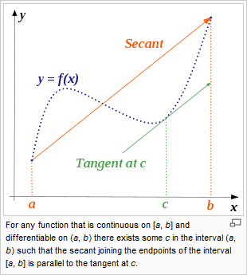
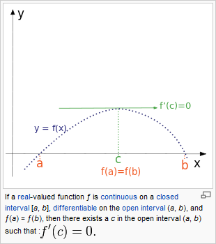
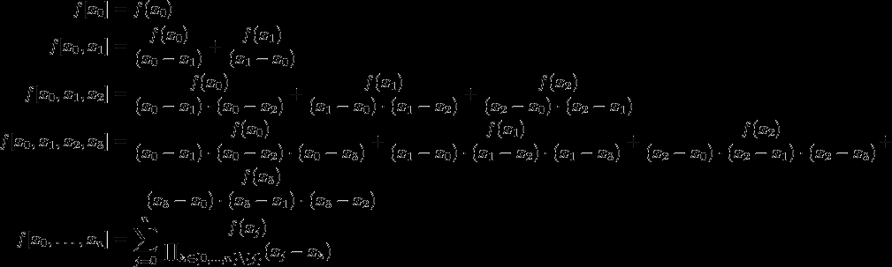
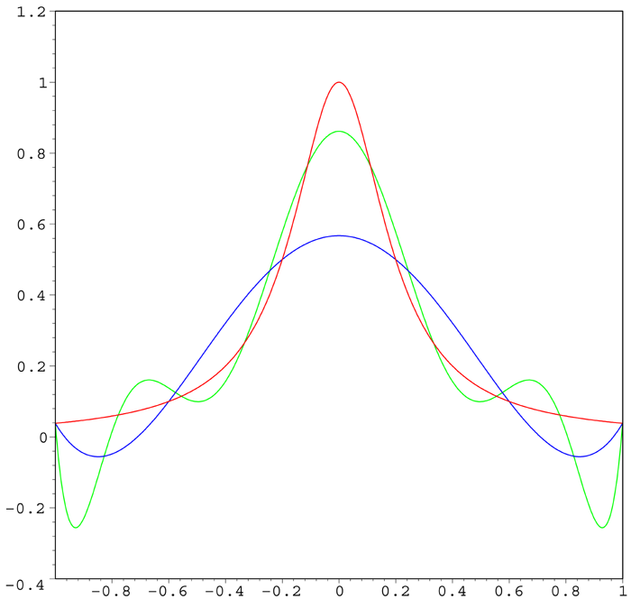

# 2 代数插值与数值微分

<!-- page: 1 -->

2 插值与数值微分
Interpolation, Numerical Differentiation

何军辉
hejh@scut.edu.cn

<!-- page: 2 -->

2
背景

o 在工程技术中，经常会遇到只给定一个函数表，要求根

据该函数表求出某点函数值的问题

𝑥
𝑥!
𝑥"
⋯
𝑥#
𝑦= 𝑓(𝑥)
𝑦!
𝑦"
⋯
𝑦#

1. 根据上述表构造函数𝜑𝑥来近似代替𝑓(𝑥)

2. 给出任意点𝑥∗，可计算𝜑(𝑥∗)来代替𝑓𝑥∗

3. 为了方便计算，构造代数多项式𝑝"(𝑥)

计算机科学与工程学院
School of Computer Science & Engineering

<!-- page: 3 -->

3
2.1 线性插值与二次插值

o 线性插值

n 给定𝑦= 𝑓(𝑥)的函数表，构造函数𝑝!(𝑥)满足下面条件：

①𝑝!(𝑥)是一个不超过1次的代数多项式

②𝑝! 𝑥" = 𝑦", 𝑝! 𝑥! = 𝑦!

𝑥
𝑥!
𝑥"
𝑦= 𝑓(𝑥)
𝑦!
𝑦"

o 𝑥#和𝑥$称为插值节点，𝑓(𝑥)被插值函数，𝑝$ 𝑥称为线

性插值函数，条件①②称为插值条件

计算机科学与工程学院
School of Computer Science & Engineering

<!-- page: 4 -->

4
2.1 线性插值与二次插值

o 线性插值的Lagrange形式

n 线性插值的几何意义是用通过(𝑥", 𝑦")和(𝑥!, 𝑦!)两点的直

线𝑦= 𝑝! 𝑥来近似曲线𝑦= 𝑓(𝑥)

n 直线方程的两点公式：

𝑝! 𝑥= 𝑥−𝑥!

𝑦" + 𝑥−𝑥"

𝑦! = 𝑙" 𝑥𝑦" + 𝑙! 𝑥𝑦!

𝑥" −𝑥!

𝑥! −𝑥"

o 𝑝!(𝑥)称为Lagrange型线性插值函数
o 𝑝!(𝑥)是两个线性函数𝑙"(𝑥)和𝑙!(𝑥)的线性组合，𝑙# 𝑥被称为

一次插值基函数

#$#!
#"$#!
𝑙! # =

𝑙" # =

𝑥!
𝑥"
𝑙!(𝑥)
1
0

#$#"
#!$#"

𝑙"(𝑥)
0
1

计算机科学与工程学院
School of Computer Science & Engineering

<!-- page: 5 -->

5
2.1 线性插值与二次插值

o 线性插值函数的Newton形式

' (! )'((")

定义：若记𝑓𝑥%, 𝑥&
=

(!)("
，则称𝑓𝑥%, 𝑥& 为函数𝑓(𝑥)

在节点𝑥%和𝑥&处的一阶差商，𝑥%和𝑥&互异.

o 一阶差商对称性：

' (! )'((")

' (" )'((!)

𝑓𝑥%, 𝑥&
=

(!)("
=

(")(!
= 𝑓𝑥&, 𝑥%

例：当i = 0和𝑗= 1时，有

𝑓𝑥#, 𝑥$ = 𝑓(𝑥$, 𝑥#)

计算机科学与工程学院
School of Computer Science & Engineering

<!-- page: 6 -->

6
2.1 线性插值与二次插值

o 直线方程的点斜式：

𝑝$ 𝑥= 𝑦# + 𝑦$ −𝑦#

𝑥−𝑥#

𝑥$ −𝑥#

= 𝑓𝑥# + 𝑓𝑥$ −𝑓𝑥#

𝑥−𝑥#

𝑥$ −𝑥#

= 𝑓𝑥# + 𝑓𝑥#, 𝑥$
𝑥−𝑥#
称为Newton型线性插值公式，对应的𝑝$(𝑥)称为Newton型
线性插值函数.

o Lagrange型和Newton型式线性插值函数𝑝$ 𝑥的两种形

式，尽管形式不同，但实质都一样，代表同一条直线.

计算机科学与工程学院
School of Computer Science & Engineering

<!-- page: 7 -->

7
2.1 线性插值与二次插值

o 线性插值误差

定理：设𝑝$(𝑥)是经过(𝑥#, 𝑦#)和(𝑥$, 𝑦$)两点的线性插值函数
，[𝑎, 𝑏]是包含[𝑥#, 𝑥$]的任一区间，并设𝑓𝑥∈𝐶$ 𝑎, 𝑏
，𝑓′′(𝑥)在[𝑎, 𝑏]上存在，则对任意给定的𝑥∈𝑎, 𝑏，总存在
一点𝜉∈(𝑎, 𝑏)，使得

𝑅𝑥= 𝑓𝑥−𝑝$ 𝑥= 𝑓,, 𝜉

2!
(𝑥−𝑥#)(𝑥−𝑥$)

其中𝜉依赖于𝑥.

n 𝜑𝑡= 𝑓𝑡−𝑝! 𝑡−𝑘𝑡−𝑥"
𝑡−𝑥!
n Rolle（洛尔）定理

计算机科学与工程学院
School of Computer Science & Engineering

<!-- page: 8 -->

8
相关定理

Rolle’s Theorem
Mean Value Theorem

计算机科学与工程学院
School of Computer Science & Engineering

<!-- page: 9 -->

9
2.1 线性插值与二次插值

例：给定下面函数表，用Lagrange型线性插值公式求
ln(11.75)的近似值，并估计误差.

𝑥
11
12
𝑦= ln(𝑥)
2.3979
2.4849

计算机科学与工程学院
School of Computer Science & Engineering

<!-- page: 10 -->

10
2.1 线性插值与二次插值

o 二次插值

n 给定函数表，构造函数𝑝%(𝑥)满足条件：

𝑥
𝑥!
𝑥"
𝑥#
𝑦= 𝑓(𝑥)
𝑦!
𝑦"
𝑦#

①𝑝%(𝑥)是一个不超过2次的代数多项式
②𝑝% 𝑥" = 𝑦", 𝑝% 𝑥! = 𝑦!, 𝑝% 𝑥% = 𝑦%
其中：

n 𝑥", 𝑥!, 𝑥%称为插值节点

n 𝑓(𝑥)称为被插值函数

n 𝑝%(𝑥)称为二次插值函数
n 条件①②称为插值条件

计算机科学与工程学院
School of Computer Science & Engineering

<!-- page: 11 -->

11
2.1 线性插值与二次插值

o 二次插值的目的是构造𝑝-(𝑥)来近似代替𝑓(𝑥).

n 不妨假设

𝑝- 𝑥= 𝑎# + 𝑎$𝑥+ 𝑎-𝑥-

其中𝑎", 𝑎!和𝑎(为待定常数

n 利用插值条件②得到方程组

( = 𝑦"
𝑝( 𝑥! = 𝑎" + 𝑎!𝑥! + 𝑎(𝑥!

𝑝( 𝑥" = 𝑎" + 𝑎!𝑥" + 𝑎(𝑥"

( = 𝑦!
𝑝( 𝑥( = 𝑎" + 𝑎!𝑥( + 𝑎(𝑥(

(

( = 𝑦(
n 系数行列式为

(

1
𝑥"
𝑥"

(

= (𝑥! −𝑥")(𝑥( −𝑥")(𝑥( −𝑥!)

1
𝑥!
𝑥!

(

1
𝑥(
𝑥(

计算机科学与工程学院
School of Computer Science & Engineering

<!-- page: 12 -->

12
2.1 线性插值与二次插值

o 二次插值函数的Lagrange形式

n 设𝑝% 𝑥= 𝑙" 𝑥𝑦" + 𝑙! 𝑥𝑦! + 𝑙% 𝑥𝑦%，其中𝑙" 𝑥, 𝑙! 𝑥,

𝑙%(𝑥)为不超过2次的代数多项式，满足：

𝑥"
𝑥!
𝑥(
𝑙"(𝑥)
1
0
0

𝑙!(𝑥)
0
1
0

𝑙((𝑥)
0
0
1

n 易验证𝑝%(𝑥)满足插值条件.

n 如何构造𝑙" 𝑥, 𝑙! 𝑥, 𝑙% 𝑥？

计算机科学与工程学院
School of Computer Science & Engineering

<!-- page: 13 -->

13
2.1 线性插值与二次插值

o 二次插值函数的Lagrange形式

𝑝- 𝑥

= (𝑥−𝑥$)(𝑥−𝑥-)

(𝑥# −𝑥$)(𝑥# −𝑥-) 𝑦# + (𝑥−𝑥#)(𝑥−𝑥-)

𝑦$

𝑥$ −𝑥#
𝑥$ −𝑥-

+
𝑥−𝑥#
𝑥−𝑥$
(𝑥- −𝑥#)(𝑥- −𝑥$) 𝑦-

其中

1. 𝑙# 𝑥, 𝑙$ 𝑥, 𝑙- 𝑥称为二次插值基函数

2. 𝑝-(𝑥)称为Lagrange型二次插值函数

计算机科学与工程学院
School of Computer Science & Engineering

<!-- page: 14 -->

14
2.1 线性插值与二次插值

o 二次插值函数的Newton形式

' (!,(" )' (",(#

定义：若记𝑓𝑥%, 𝑥&, 𝑥. =

(!)(#
，则称𝑓𝑥%, 𝑥&, 𝑥.
为函数𝑓(𝑥)在节点𝑥%, 𝑥&, 𝑥.处的二阶差商，其中𝑥%, 𝑥&, 𝑥.互
异.

二阶差商对称性：在求二阶差商时，无论𝑥%, 𝑥&, 𝑥.如何排列
，它们的值是一样的.

𝑝- 𝑥
= 𝑓𝑥# + 𝑓𝑥#, 𝑥$
𝑥−𝑥# + 𝑓(𝑥#, 𝑥$, 𝑥-)(𝑥−𝑥#)(𝑥−𝑥$)

称为Newton型二次插值函数.

计算机科学与工程学院
School of Computer Science & Engineering

<!-- page: 15 -->

15
2.1 线性插值与二次插值

o 二次插值误差

定理：设𝑝- 𝑥是经过𝑥#, 𝑦# , 𝑥$, 𝑦$ , (𝑥-, 𝑦-)三点的二次插
值函数，[𝑎, 𝑏]是包含𝑥#, 𝑥$, 𝑥-的任一区间，并设𝑓𝑥∈
𝐶- 𝑎, 𝑏, 𝑓′′′(𝑥)在[𝑎, 𝑏]上存在，则对任意给定的𝑥∈[𝑎, 𝑏]，
总存在一点𝜉∈(𝑎, 𝑏)，使得

𝑅𝑥= 𝑓𝑥−𝑝- 𝑥= 𝑓,,, 𝜉

3!
(𝑥−𝑥#)(𝑥−𝑥$)(𝑥−𝑥-)

其中𝜉依赖于𝑥.

计算机科学与工程学院
School of Computer Science & Engineering

<!-- page: 16 -->

16
2.1 线性插值与二次插值

例：给定函数表，试用Newton型二次插值公式求ln(11.75)
的近似值，并估计误差.

𝑥
11
12
13
𝑦= ln(𝑥)
2.3979
2.4849
2.5649

计算机科学与工程学院
School of Computer Science & Engineering

<!-- page: 17 -->

17
2.2 𝒏次插值的Lagrange形式和Newton形式

o 𝑛次插值

n 给定函数表，构造函数𝑝&(𝑥)满足条件：

𝑥
𝑥!
𝑥"
⋯
𝑥#
𝑦= 𝑓(𝑥)
𝑦!
𝑦"
⋯
𝑦#

①𝑝&(𝑥)是一个不超过𝑛次的代数多项式

②𝑝& 𝑥' = 𝑦' 𝑖= 0,1, ⋯, 𝑛

o 𝑥%称为插值节点，𝑓(𝑥)称为被插值函数，𝑝"(𝑥)称为𝑛次

插值函数.

计算机科学与工程学院
School of Computer Science & Engineering

<!-- page: 18 -->

18
2.2 𝒏次插值的Lagrange形式和Newton形式

o 𝑛次插值的目的是构造𝑝"(𝑥)来近似代替𝑓(𝑥).

n 不妨假设

𝑝) 𝑥= 𝑎" + 𝑎!𝑥+ 𝑎(𝑥( + ⋯+ 𝑎)𝑥)

其中𝑎", 𝑎!, ⋯, 𝑎)为待定常数

n 利用插值条件②得到方程组

! = 𝑦"
𝑝! 𝑥# = 𝑎" + 𝑎#𝑥# + 𝑎$𝑥#

$ + ⋯+ 𝑎!𝑥"

𝑝! 𝑥" = 𝑎" + 𝑎#𝑥" + 𝑎$𝑥"

! = 𝑦#
⋮
𝑝! 𝑥! = 𝑎" + 𝑎#𝑥! + 𝑎$𝑥!$ + ⋯+ 𝑎!𝑥!! = 𝑦!
n 系数行列式为Vandermonde范德蒙行列式

$ + ⋯+ 𝑎!𝑥#

(
⋯
𝑥"

)

1
𝑥"
𝑥"

(
⋯
𝑥!

)

1
𝑥!
𝑥!

=
1

(𝑥# −𝑥+)

⋮
1
⋮
𝑥)

⋮
⋮
𝑥)(
⋯
𝑥))

"*+,#*)

计算机科学与工程学院
School of Computer Science & Engineering

<!-- page: 19 -->

19
2.2 𝒏次插值的Lagrange形式和Newton形式

o 𝑛次插值函数的Lagrange形式

n 设𝑝& 𝑥= 𝑙" 𝑥𝑦" + 𝑙! 𝑥𝑦! + ⋯+ 𝑙& 𝑥𝑦&，其中𝑙'(𝑥)为

不超过𝑛次的代数多项式，且满足表

𝑥!
𝑥"
⋯
𝑥#
𝑙!(𝑥)
1
0
⋯
0

𝑙"(𝑥)
0
1
⋯
0

⋮
⋮
⋮
⋮

𝑙#(𝑥)
0
0
⋯
1

n 容易验证𝑝&(𝑥)满足插值条件.

n 如何构造𝑙' 𝑥？

计算机科学与工程学院
School of Computer Science & Engineering

<!-- page: 20 -->

20
2.2 𝒏次插值的Lagrange形式和Newton形式

o 𝑛次插值函数的Lagrange形式

𝑙# 𝑥=
𝑥−𝑥" ⋯𝑥−𝑥#/!
𝑥−𝑥#0! ⋯(𝑥−𝑥))
𝑥# −𝑥" ⋯𝑥# −𝑥#/!
𝑥−𝑥#0! ⋯(𝑥# −𝑥)）
其中𝑖= 0,1,2, ⋯, 𝑛
n 𝑙'(𝑥)称为𝑛次插值基函数

n 满足插值条件的Lagrange型𝑛次插值函数

&
)(#)

&
𝑙' 𝑥𝑦',   𝑝& 𝑥= ∑'("

𝑝& 𝑥= ∑'("

#$## )$ ## 𝑦'

其中

𝜔𝑥= 𝑥−𝑥"
𝑥−𝑥! ⋯𝑥−𝑥)
𝜔1 𝑥# = 𝑥# −𝑥" ⋯𝑥# −𝑥#/!
𝑥# −𝑥#0! ⋯(𝑥# −𝑥))

计算机科学与工程学院
School of Computer Science & Engineering

<!-- page: 21 -->

21
2.2 𝒏次插值的Lagrange形式和Newton形式

o Lagrange型𝑛次插值算法

①读入插值节点𝑥', 𝑦'(𝑖= 0,1, ⋯, 𝑛)和点𝑥𝑥

②𝑦𝑦= 0

③对𝑖= 0,1, ⋯, 𝑛做如下工作

o
𝑡= 1
o
对𝑘= 0,1, ⋯, 𝑖−1, 𝑖+ 1, ⋯, 𝑛做

o
𝑡= 𝑡× 22/2%

2&/2%
o
𝑦𝑦= 𝑦𝑦+ 𝑡×𝑦#
④输出点𝑥𝑥相应的函数近似值𝑦𝑦

计算机科学与工程学院
School of Computer Science & Engineering

<!-- page: 22 -->

22
2.2 𝒏次插值的Lagrange形式和Newton形式

o 𝑛次插值函数的Newton形式

定义：一般地，𝑛阶差商的定义为

𝑓𝑥#', 𝑥#(, ⋯, 𝑥#)*( −𝑓(𝑥#(, 𝑥#+, ⋯, 𝑥#))

𝑓𝑥3', 𝑥#(, ⋯, 𝑥#) =

𝑥#' −𝑥#)
特别地，当𝑖" = 0, 𝑖! = 1, ⋯, 𝑖) = 𝑛时有

𝑓𝑥", 𝑥!, ⋯, 𝑥) = 𝑓𝑥", 𝑥!, ⋯, 𝑥)/! −𝑓(𝑥!, 𝑥(, ⋯, 𝑥))

𝑥" −𝑥)
n 由归纳法可证

4
𝑓𝑥#
𝜔4

𝑓𝑥", 𝑥!, ⋯, 𝑥4 = :

1 𝑥#

#5"

1 𝑥# = 𝑥# −𝑥" ⋯𝑥# −𝑥#/!
𝑥# −𝑥#0! ⋯(𝑥# −𝑥4)

其中𝜔4

计算机科学与工程学院
School of Computer Science & Engineering

<!-- page: 23 -->

23
2.2 𝒏次插值的Lagrange形式和Newton形式

o 差商直接计算公式：

计算机科学与工程学院
School of Computer Science & Engineering

<!-- page: 24 -->

24
2.2 𝒏次插值的Lagrange形式和Newton形式

o 𝑛次插值函数的Newton形式

𝑓𝑥= 𝑁" 𝑥+ 𝑅" 𝑥

其中
𝑁) 𝑥
= 𝑓𝑥" + 𝑓𝑥", 𝑥!
𝑥−𝑥" + 𝑓𝑥", 𝑥!, 𝑥(
𝑥−𝑥"
𝑥−𝑥! + ⋯
+ 𝑓𝑥", 𝑥!, ⋯, 𝑥)
𝑥−𝑥"
𝑥−𝑥! ⋯(𝑥−𝑥)/!)
𝑅) 𝑥= 𝑓𝑥", 𝑥!, ⋯, 𝑥), 𝑥
𝑥−𝑥"
𝑥−𝑥! ⋯𝑥−𝑥)
𝑁) 𝑥# = 𝑓𝑥# = 𝑦# (𝑖= 0,1, ⋯, 𝑛)

o 𝑁)(𝑥)称为满足插值条件的Newton型𝑛次插值函数

o 在实际问题中，为了得到Newton型𝑛次插值函数，通常需要构造

一个差商表.

计算机科学与工程学院
School of Computer Science & Engineering

<!-- page: 25 -->

25
2.2 𝒏次插值的Lagrange形式和Newton形式

定理：设𝑝"(𝑥)是过𝑥%, 𝑦% (𝑖= 0,1, ⋯, 𝑛)的𝑛次插值函数，
[𝑎, 𝑏]是包含𝑥#, 𝑥$, ⋯, 𝑥"的任一区间，并设𝑓𝑥∈𝐶" 𝑎, 𝑏
，𝑓"0$ 𝑥在[𝑎, 𝑏]上存在，则对任意给定的𝑥∈[𝑎, 𝑏]，总
存在一点𝜉∈𝑎, 𝑏，使得

𝑅𝑥= 𝑓𝑥−𝑝" 𝑥

= 𝑝"0$ 𝜉

𝑛+ 1 !
𝑥−𝑥#
𝑥−𝑥$ ⋯𝑥−𝑥"

其中𝜉依赖于𝑥.

计算机科学与工程学院
School of Computer Science & Engineering

<!-- page: 26 -->

26
2.2 𝒏次插值的Lagrange形式和Newton形式

例：已知函数表如下所示，求Newton型𝑛次插值函数𝑁)(𝑥)，并计算
𝑓(0.6)的近似值.

𝑥
0.4
0.55
0.65
0.8
0.9

𝑦= 𝑓(𝑥)
0.41075
0.57815
0.69675
0.88811
1.02652

例：已知函数𝑓𝑥= 𝑥6 −4𝑥，插值节点为𝑥" = 1, 𝑥! = 2, 𝑥( = 3，求
Newton型2次插值.

计算机科学与工程学院
School of Computer Science & Engineering

<!-- page: 27 -->

27
2.2 𝒏次插值的Lagrange形式和Newton形式

o Newton型𝑛次插值算法

①读入插值节点𝑥', 𝑦'(𝑖= 0,1, ⋯, 𝑛)和点𝑥𝑥

②𝜔= 1, 𝑉" = 𝑦", 𝑦𝑦= 𝑦"
③对𝑘= 1,2, ⋯, 𝑛做如下工作

o 𝑉4 = 𝑦4
o 对𝑖= 0,1, ⋯, 𝑘−1做

o 𝑉4 = 7&/7%

2&/2%
o 𝜔= 𝜔× 𝑥𝑥−𝑥4/!
o 𝑦𝑦= 𝑦𝑦+ 𝜔×𝑉4
④输出插值点𝑥𝑥相应的函数近似值𝑦𝑦

计算机科学与工程学院
School of Computer Science & Engineering

<!-- page: 28 -->

28
2.3 分段线性插值

o 对于𝑛次插值，随着插值节点的增加，插值多项式的次

数也会增加

o 但是当𝑛→∞时，𝑝"(𝑥)不一定收敛到𝑓(𝑥)，也就是

𝑝"(𝑥)与𝑓(𝑥)的误差不一定越来越小

例：给定函数

𝑓𝑥=
1
1 + 25𝑥-
−1 ≤𝑥≤1

取等距插值节点𝑥% = −1 + $

1 𝑖(𝑖= 0,1, ⋯, 𝑛)，试建立插值
多项式𝑝"(𝑥)，并考察𝑝"(𝑥)与𝑓(𝑥)的误差情况.

计算机科学与工程学院
School of Computer Science & Engineering

<!-- page: 29 -->

29
2.3 分段线性插值

o Runge（龙格）现象

n 红色：𝑓(𝑥)

n 蓝色：𝑝, 𝑥

n 绿色：𝑝-(𝑥)

高次插值多项式并

不一定很好近似被

插函数

1. 区间分段

2. 每分段低次插值

计算机科学与工程学院
School of Computer Science & Engineering

<!-- page: 30 -->

30
2.3 分段线性插值

定义：给定函数表，构造函数𝑝(𝑥)满足条件：

①𝑝(𝑥)在[𝑥%, 𝑥%0$](𝑖= 0,1, ⋯, 𝑛−1)上为不超过一次的代

数多项式

②𝑝𝑥% = 𝑦%(𝑖= 0,1, ⋯, 𝑛).

其中𝑝(𝑥)称为分段线性插值函数.

𝑥−𝑥!
𝑥" −𝑥!

𝑦" + 𝑥−𝑥"

𝑦!(𝑥" ≤𝑥≤𝑥!)

𝑥! −𝑥"

𝑥−𝑥(
𝑥! −𝑥(

𝑦! + 𝑥−𝑥!

𝑦((𝑥! < 𝑥≤𝑥()

𝑝𝑥=

𝑥( −𝑥!

⋮
𝑥−𝑥)
𝑥)/! −𝑥)

𝑦)/! + 𝑥−𝑥)/!

𝑦)(𝑥)/! < 𝑥≤𝑥))

𝑥) −𝑥)/!

计算机科学与工程学院
School of Computer Science & Engineering

<!-- page: 31 -->

31
2.3 分段线性插值

o 分段线性插值函数表示为插值基函数的组合

n 设𝑙" 𝑥, 𝑙! 𝑥, ⋯, 𝑙&(𝑥)为不超过1次的代数多项式，且满

足表：

𝑥!
𝑥"
⋯
𝑥#
𝑙!(𝑥)
1
0
⋯
0

𝑙"(𝑥)
0
1
⋯
0

⋮
⋮
⋮
⋮

𝑙#(𝑥)
0
0
⋯
1

"

𝑝𝑥= I

𝑙% 𝑥𝑦%;
𝑙% 𝑥. = 𝛿%.

%2#

计算机科学与工程学院
School of Computer Science & Engineering

<!-- page: 32 -->

32
2.3 分段线性插值

𝑥−𝑥$
𝑥# −𝑥$

(𝑥# ≤𝑥≤𝑥$)

𝑙# 𝑥= L

0 (𝑥$ < 𝑥≤𝑥")

𝑥−𝑥%)$
𝑥% −𝑥%)$

(𝑥%)$ ≤𝑥≤𝑥%)

𝑥−𝑥%0$
𝑥% −𝑥%0$

𝑙% 𝑥=

(𝑥% < 𝑥≤𝑥%0$)

0 𝑥∈𝑎, 𝑏, 𝑥∉[𝑥%)$, 𝑥%0$]
⋮

𝑥−𝑥")$
𝑥" −𝑥")$

(𝑥")$ ≤𝑥≤𝑥")

𝑙" 𝑥= L

0 (𝑥# ≤𝑥< 𝑥")$)

计算机科学与工程学院
School of Computer Science & Engineering

<!-- page: 33 -->

33
2.3 分段线性插值

例：给定函数𝑦= 𝑓(𝑥)的函数表，试用分段线性插值法求
𝑦= 𝑓(𝑥)在𝑥= −0.9处的近似值.

𝑥
−1
−0.8
−0.6
−0.4
0
𝑦= 𝑓(𝑥)
0.03846 0.05882
0.1
0.2
0.5

计算机科学与工程学院
School of Computer Science & Engineering

<!-- page: 34 -->

34
2.3 分段线性插值

o 分段线性插值算法

①读入插值节点𝑥', 𝑦'(𝑖= 0,1, ⋯, 𝑛)和点𝑥𝑥

②对𝑖= 1,2, ⋯, 𝑛做：

o 如果𝑥𝑥< 𝑥#则

22/2&
2&*(/2& 𝑦#/! +
22/2&*(
2&/2&*( 𝑦#

o 𝑦𝑦=

o 输出点𝑥𝑥相应的函数近似值𝑦𝑦
o 转到③
③结束

计算机科学与工程学院
School of Computer Science & Engineering

<!-- page: 35 -->

35
2.3 分段线性插值

o 分段线性插值误差

定理：设给定𝑦= 𝑓(𝑥)函数表，令𝑎= 𝑥#, 𝑏= 𝑥", 𝑓𝑥∈
𝐶$ 𝑎, 𝑏，𝑓′′(𝑥)在[𝑎, 𝑏]上存在，𝑝(𝑥)是𝑓(𝑥)的分段线性插
值函数，则有

𝑅𝑥
= 𝑓𝑥−𝑝𝑥
≤ℎ-

8 𝑀

43(35 |𝑓,, 𝑥|

其中ℎ=
max
#3%3")$ 𝑥%0$ −𝑥% ; 𝑀= max

计算机科学与工程学院
School of Computer Science & Engineering

<!-- page: 36 -->

36
2.4 Hermite插值

o 背景：

o 分段线性插值函数的导数是不连续的.

o 在某些实际问题中，为了保证插值函数更好地逼近被插

值函数𝑓(𝑥)

①插值函数在插值节点上的值与被插值函数𝑓(𝑥)在插值节

点上的值相等

②插值函数在插值节点上导数值与被插值函数𝑓(𝑥)在插值

节点上的导数值相等

计算机科学与工程学院
School of Computer Science & Engineering

<!-- page: 37 -->

37
2.4 Hermite插值

o 三次Hermite插值

定义：根据给定的𝑓(𝑥)的函数表，构造函数𝐻(𝑥)满足条件
：

𝑥
𝑥"
𝑥#
𝑦= 𝑓(𝑥)
𝑦"
𝑦#
𝑦, = 𝑓,(𝑥)
𝑚"
𝑚#

①𝐻(𝑥)为不超过3次的代数多项式

②𝐻𝑥" = 𝑦", 𝐻𝑥! = 𝑦!, 𝐻1 𝑥" = 𝑚", 𝐻1 𝑥! = 𝑚!
其中𝐻(𝑥)称为三次Hermite插值函数.

计算机科学与工程学院
School of Computer Science & Engineering

<!-- page: 38 -->

38
2.4 Hermite插值

o 设𝐻𝑥= 𝑦#ℎ# 𝑥+ 𝑦$ℎ$ 𝑥+ 𝑚#𝐻# 𝑥+ 𝑚$𝐻$(𝑥)，其

中ℎ# 𝑥, ℎ$ 𝑥, 𝐻# 𝑥, 𝐻$(𝑥)为不超过3次的代数多项式
，且满足：

函数值
导数值

𝑥!
𝑥"
𝑥!
𝑥"
ℎ!(𝑥)
1
0
0
0

ℎ"(𝑥)
0
1
0
0

𝐻!(𝑥)
0
0
1
0

𝐻"(𝑥)
0
0
0
1

o 如何构造ℎ# 𝑥, ℎ$ 𝑥, 𝐻# 𝑥, 𝐻$(𝑥)？

计算机科学与工程学院
School of Computer Science & Engineering

<!-- page: 39 -->

39
2.4 Hermite插值

-

ℎ# 𝑥= 1 + 2 𝑥−𝑥#

𝑥−𝑥$
𝑥# −𝑥$

𝑥$ −𝑥#

-

ℎ$ 𝑥= 1 + 2 𝑥−𝑥$

𝑥−𝑥#
𝑥$ −𝑥#

𝑥# −𝑥$

-

𝑥−𝑥$
𝑥# −𝑥$

𝐻# 𝑥= 𝑥−𝑥#

-

𝑥−𝑥#
𝑥$ −𝑥#

𝐻$ 𝑥= 𝑥−𝑥$

𝐻𝑥= 𝑦#ℎ# 𝑥+ 𝑦$ℎ$ 𝑥+ 𝑚#𝐻# 𝑥+ 𝑚$𝐻$(𝑥)

计算机科学与工程学院
School of Computer Science & Engineering

<!-- page: 40 -->

40
2.4 Hermite插值

例：给定函数𝑦= 𝑓(𝑥)的函数表，构造一个三次Hermite插

值函数，并求出𝑓
$
- 的近似值.

𝑥
0
1

𝑦= 𝑓(𝑥)
0
1

𝑦1 = 𝑓′(𝑥)
3
9

计算机科学与工程学院
School of Computer Science & Engineering

<!-- page: 41 -->

41
2.4 Hermite插值

o Hermite插值误差

定理：设𝐻(𝑥)是𝑓(𝑥)的三次Hermite插值函数，[𝑎, 𝑏]是包
含𝑥#, 𝑥$的任一区间，并设𝑓𝑥∈𝐶6[𝑎, 𝑏]，𝑓7 (𝑥)在[𝑎, 𝑏]
上存在，则对任意给定的𝑥∈[𝑎, 𝑏]，总存在一点𝜉∈(𝑎, 𝑏)
，使得

𝑅𝑥= 𝑓𝑥−𝐻𝑥= 𝑓7 𝜉

4!
𝑥−𝑥# - 𝑥−𝑥$ -

其中𝜉依赖于𝑥.

计算机科学与工程学院
School of Computer Science & Engineering

<!-- page: 42 -->

42
2.4 Hermite插值

o 2𝑛+ 1次Hermite插值

n 给定𝑦= 𝑓(𝑥)函数表，构造函数𝐻(𝑥)满足条件：

𝑥
𝑥"
𝑥!
⋯
𝑥)
𝑦= 𝑓𝑥
𝑦"
𝑦!
⋯
𝑦)
𝑦1 = 𝑓′(𝑥)
𝑚"
𝑚!
⋯
𝑚)

①𝐻(𝑥)为不超过2𝑛+ 1次的代数多项式

②𝐻𝑥' = 𝑦', 𝐻. 𝑥' = 𝑚' (𝑖= 0,1, ⋯, 𝑛)

𝐻(𝑥)称为2𝑛+ 1次Hermite插值函数.

"

𝐻𝑥= I

[𝑦%ℎ% 𝑥+ 𝑚%𝐻% 𝑥]

%2#

计算机科学与工程学院
School of Computer Science & Engineering

<!-- page: 43 -->

43
2.4 Hermite插值

o ℎ% 𝑥和𝐻%(𝑥)取值

函数值
导数值

𝑥!
𝑥"
⋯
𝑥#
𝑥!
𝑥"
⋯
𝑥#
ℎ!(𝑥)
1
0
⋯
0
0
0
⋯
0

ℎ" 𝑥
0
1
⋯
0
0
0
⋯
0

⋮
⋮
⋮
⋮
⋮
⋮
⋮

ℎ#(𝑥)
0
0
⋯
1
0
0
⋯
0

𝐻!(𝑥)
0
0
⋯
0
1
0
⋯
0

𝐻"(𝑥)
0
0
⋯
0
0
1
⋯
0

⋮
⋮
⋮
⋮
⋮
⋮
⋮

𝐻#(𝑥)
0
0
⋯
0
0
0
⋯
1

计算机科学与工程学院
School of Computer Science & Engineering

<!-- page: 44 -->

44
2.5 分段三次Hermite插值

o 分段线性插值函数在节点处的导数不连续

o 分段三次Hermite插值

定义：给定函数𝑦= 𝑓(𝑥)的函数表，构造函数𝑞(𝑥)满足条
件：

①𝑞𝑥在[𝑥#, 𝑥#0!](𝑖= 0,1, ⋯, 𝑛−1)上为3次代数多项式

②𝑞𝑥# = 𝑦# , 𝒒1 𝒙𝒊= 𝒎𝒊𝑖= 0,1, ⋯, 𝑛

③𝑞𝑥∈𝐶![𝑎, 𝑏]，其中𝑎= 𝑥", 𝑏= 𝑥)
其中𝑞(𝑥)称为分段三次Hermite插值函数.

𝑥
𝑥"
𝑥#
⋯
𝑥!
𝑦= 𝑓(𝑥)
𝑦"
𝑦#
⋯
𝑦!
𝑦, = 𝑓,(𝑥)
𝑚"
𝑚#
⋯
𝑚!

计算机科学与工程学院
School of Computer Science & Engineering

<!-- page: 45 -->

45
2.5 分段三次Hermite插值

o 根据分段三次Hermite插值条件和三次Hermite插值公式

，区间[𝑥%, 𝑥%0]上的𝑞𝑥为：
𝑞𝑥

-

= 1 + 2
𝑥−𝑥%
𝑥%0$ −𝑥%

𝑥−𝑥%0$
𝑥% −𝑥%0$

𝑦%

-

+ 1 + 2 𝑥−𝑥%0$

𝑥−𝑥%
𝑥%0$ −𝑥%

𝑦%0$

𝑥% −𝑥%0$

-

-

𝑥−𝑥%0$
𝑥% −𝑥%0$

𝑥−𝑥%
𝑥%0$ −𝑥%

+ 𝑥−𝑥%

𝑚% + 𝑥−𝑥%0$

𝑚%0$

计算机科学与工程学院
School of Computer Science & Engineering

<!-- page: 46 -->

46
2.5 分段三次Hermite插值

o 分段三次Hermite插值函数𝑞(𝑥)也可以写成插值基函数

加权和的形式.

n 在插值区间[𝑎, 𝑏]上定义一组分段三次Hermite插值基函数

ℎ'(𝑥)和𝐻' 𝑥(𝑖= 0,1, ⋯, 𝑛)，则

"

𝑞𝑥= I

𝑦%ℎ% 𝑥+ 𝑚%𝐻% 𝑥

%2#

n 其中ℎ'(𝑥)和𝐻' 𝑥形式见教材P.39

计算机科学与工程学院
School of Computer Science & Engineering

<!-- page: 47 -->

47
2.5 分段三次Hermite插值

定理：给定函数表如下，令𝑎= 𝑥#,𝑏= 𝑥",𝑓(𝑥) ∈
𝐶6[𝑎, 𝑏],𝑓7 (𝑥)在[𝑎, 𝑏]上存在，𝑞(𝑥)是𝑓(𝑥)的分段三次
Hermite插值函数，则有

𝑅𝑥
= 𝑓𝑥−𝑞(𝑥) ≤ℎ7

384 𝑀

其中

ℎ=
max
#3%3")$ 𝑥%0$ −𝑥%
𝑀= max

43(35 𝑓7 (𝑥)

计算机科学与工程学院
School of Computer Science & Engineering

<!-- page: 48 -->

48
2.6 三次样条插值

o 背景：

n 高次插值多项式：龙格现象

n 分段线性插值：节点处导数不连续

n 分段三次Hermite插值：节点处二阶导数不连续，并且实

际问题中有时很难给出导数条件

o 如何提高插值函数在节点处的光滑度？

n 插值函数在节点处连续

n 其一阶导数节点处连续

n 其二阶导数节点处连续

o 三次样条插值

计算机科学与工程学院
School of Computer Science & Engineering

<!-- page: 49 -->

49
2.6 三次样条插值

定义：给定𝑦= 𝑓(𝑥)的函数表如下所示，构造函数𝑠(𝑥)满足
条件：

①在[𝑥%, 𝑥%0$](𝑖= 0,1, ⋯, 𝑛−1)上为不超过3次的代数多项

式.

②𝑠𝑥% = 𝑦% 𝑖= 0,1, ⋯, 𝑛.

③𝑠𝑥∈𝐶-[𝑎, 𝑏]，其中𝑎= 𝑥#, 𝑏= 𝑥".

其中𝑠(𝑥)称为三次样条插值函数.

𝑥
𝑥!
𝑥"
⋯
𝑥#
𝑦= 𝑓(𝑥)
𝑦!
𝑦"
⋯
𝑦#

计算机科学与工程学院
School of Computer Science & Engineering

<!-- page: 50 -->

50
2.6 三次样条插值

o 设𝑠(𝑥)在点𝑥#(𝑖= 0,1, ⋯, 𝑛)处的微商为𝑚#(𝑖= 0,1, ⋯, 𝑛)，则𝑠(𝑥)

在每个小区间[𝑥#, 𝑥#0!]上有：

𝑠𝑥% = 𝑦%, 𝑠, 𝑥% = 𝑚%,
𝑠𝑥%0$ = 𝑦%0$, 𝑠′ 𝑥%0$ = 𝑚%0$

o 满足三次Hermite插值的两个条件,根据三次Hermite插值公式，

在区间[𝑥#, 𝑥#0!]上有：

𝑠𝑥

$

$

= 1 + 2 𝑥−𝑥-

𝑥−𝑥-.#
𝑥- −𝑥-.#

𝑦- + 1 + 2 𝑥−𝑥-.#

𝑥−𝑥-
𝑥-.# −𝑥-

𝑦-.#

𝑥-.# −𝑥-

𝑥- −𝑥-.#

$

$

𝑥−𝑥-.#
𝑥- −𝑥-.#

𝑥−𝑥-
𝑥-.# −𝑥-

+ 𝑥−𝑥-

𝑚- + 𝑥−𝑥-.#

𝑚-.#

计算机科学与工程学院
School of Computer Science & Engineering

<!-- page: 51 -->

51
2.6 三次样条插值

o 为了求𝑚%，利用插值条件③，即利用𝑠(𝑥)在𝑥%(𝑖=

0,1, ⋯, 𝑛)上具有连续的二阶微商的性质

o 令ℎ% = 𝑥%0$ −𝑥%

𝑠𝑥

(

(

= 1 + 2 𝑥−𝑥#

𝑥−𝑥#0!

𝑦# + 1 −2 𝑥−𝑥#0!

𝑥−𝑥#

𝑦#0!

ℎ#

ℎ#

ℎ#

ℎ#

(

(

𝑥−𝑥#0!

𝑥−𝑥#

+ 𝑥−𝑥#

𝑚# + 𝑥−𝑥#0!

𝑚#0!

ℎ#

ℎ#

计算机科学与工程学院
School of Computer Science & Engineering

<!-- page: 52 -->

52
2.6 三次样条插值

o 对𝑠(𝑥)求二阶导数，从而得到在[𝑥%, 𝑥%0$]上有：

𝑠11 𝑥

=
6
ℎ#

( −12

6 𝑥#0! −𝑥
𝑦# +
6
ℎ#

( −12

6 (𝑥−𝑥#) 𝑦#0!

ℎ#

ℎ#

+ 2

−6

( (𝑥#0! −𝑥) 𝑚# −2

−6

( (𝑥−𝑥#) 𝑚#0!

ℎ#

ℎ#

ℎ#

ℎ#

o 将下标𝑖换成𝑖−1，则在区间[𝑥%)$, 𝑥%]上有：

𝑠%% 𝑥

=
6
ℎ&'(

)
−12

*
𝑥& −𝑥
𝑦&'( +
6
ℎ&'(

)
−12

*
(𝑥−𝑥&'() 𝑦&

ℎ&'(

ℎ&'(

+
2
ℎ&'(

−
6
ℎ&'(

)
(𝑥& −𝑥) 𝑚&'( −
2
ℎ&'(

−
6
ℎ&'(

)
(𝑥−𝑥&'() 𝑚&

计算机科学与工程学院
School of Computer Science & Engineering

<!-- page: 53 -->

53
2.6 三次样条插值

o 由𝑥% ∈𝑥%, 𝑥%0$ 可得

0 = −6
ℎ%

- 𝑦% + 6

- 𝑦%0$ −4

𝑚% −2

𝑠,, 𝑥%

𝑚%0$

ℎ%

ℎ%

ℎ%

o 由𝑥% ∈𝑥%)$, 𝑥% 可得

) =
6
ℎ%)$

-
𝑦%)$ −
6
ℎ%)$

-
𝑦% +
2
ℎ%)$

𝑚%)$ +
4
ℎ%)$

𝑠,, 𝑥%

𝑚%

o 由𝑠(𝑥)在𝑥%上具有连续的二阶微商，则有

) = 𝑠′′(𝑥%

𝑠,, 𝑥%

0)
𝑚#/!

+ 2 ℎ#/! + ℎ#

𝑚# + 𝑚#0!

= 3 𝑦# −𝑦#/!

(
+ 𝑦#0! −𝑦#

(

ℎ#/!

ℎ#/!ℎ#

ℎ#

ℎ#/!

ℎ#

计算机科学与工程学院
School of Computer Science & Engineering

<!-- page: 54 -->

54
2.6 三次样条插值

8!$%8!
8!$%08!，令𝛼% =
8!$%
8!$%08!可得

o 两边乘以

1 −𝛼# 𝑚#/! + 2𝑚# + 𝛼#𝑚#0! = 3 1 −𝛼#
ℎ#/!

𝑦# −𝑦#/! + 𝛼#

(𝑦#0! −𝑦#)

ℎ#

o 令𝛽% = 3 $)9!

8!$% 𝑦% −𝑦%)$ + 9!
8! (𝑦%0$ −𝑦%) ,可得

1 −𝛼X 𝑚XYZ + 2𝑚X + 𝛼X𝑚X[Z = 𝛽X

其中𝑖= 1,2, ⋯, 𝑛−1

计算机科学与工程学院
School of Computer Science & Engineering

<!-- page: 55 -->

55
2.6 三次样条插值

o 三次样条关于𝑚%的方程组

1 −𝛼$ 𝑚# + 2𝑚$ + 𝛼$𝑚- = 𝛽$
1 −𝛼- 𝑚$ + 2𝑚- + 𝛼-𝑚6 = 𝛽-
1 −𝛼6 𝑚- + 2𝑚6 + 𝛼6𝑚7 = 𝛽6
⋮
1 −𝛼")- 𝑚")6 + 2𝑚")- + 𝛼")-𝑚")$ = 𝛽")-
1 −𝛼")$ 𝑚")- + 2𝑚")$ + 𝛼")$𝑚" = 𝛽")$

o 共有𝑛+ 1个未知数，𝑛−1个方程

计算机科学与工程学院
School of Computer Science & Engineering

<!-- page: 56 -->

56
2.6 三次样条插值

o 边界条件：

1. 已知两个端点𝑥"和𝑥&处的一阶导数值，即给定
𝑓. 𝑥" = 𝑚" = 𝑠. 𝑥"
𝑓. 𝑥& = 𝑚& = 𝑠. 𝑥&
2. 已知两个端点𝑥"和𝑥&处的二阶导数值为0，即
𝑓.. 𝑥" = 0 = 𝑠.. 𝑥"
𝑓.. 𝑥& = 0 = 𝑠′′(𝑥&)
n 由𝑠.. 𝑥"

/ = 0可得

2𝑚" + 𝑚! = 3
ℎ"

𝑦! −𝑦"

n 由𝑠.. 𝑥&$ = 0可得

𝑚&$! + 2𝑚& = 3 𝑦& −𝑦&$!

ℎ&$!

计算机科学与工程学院
School of Computer Science & Engineering

<!-- page: 57 -->

57
2.6 三次样条插值

o 统一三次样条关于𝑚%的方程组形式

2𝑚# + 𝛼#𝑚$ = 𝛽#
1 −𝛼$ 𝑚# + 2𝑚$ + 𝛼$𝑚- = 𝛽$
1 −𝛼- 𝑚$ + 2𝑚- + 𝛼-𝑚6 = 𝛽-
⋮
1 −𝛼")$ 𝑚")- + 2𝑚" + 𝛼")$𝑚" = 𝛽")$
1 −𝛼" 𝑚")$ + 2𝑚" = 𝛽"
n 边界条件1：

𝛼" = 0, 𝛽" = 2𝑚", 𝛼& = 1, 𝛽& = 2𝑚&
n 边界条件2：

𝛼" = 1, 𝛽" = 3

𝑦! −𝑦" , 𝛼& = 0, 𝛽& = 3 𝑦& −𝑦&$!

ℎ"

ℎ&$!

计算机科学与工程学院
School of Computer Science & Engineering

<!-- page: 58 -->

58
2.6 三次样条插值

o 追赶法求解三对角方程组

n 由第一个方程得

𝑚" = −𝛼"

2 𝑚! + 𝛽"
2

;'

<'

o 令𝑎" = −

( , 𝑏" =

(
𝑚" = 𝑎"𝑚! + 𝑏"
n 代入第二个方程得

𝑚! = −
𝛼!
2 + 1 −𝛼! 𝑎"
𝑚% + 𝛽! −1 −𝛼! 𝑏"

2 + 1 −𝛼! 𝑎"

o 令𝑎! = −
;(
(0 !/;( =' , b! = <(/ !/;( >'

(0 !/;( ='
𝑚! = 𝑎!𝑚% + 𝑏!

计算机科学与工程学院
School of Computer Science & Engineering

<!-- page: 59 -->

59
2.6 三次样条插值

o 递推关系式

𝑚% = 𝑎%𝑚%0$ + 𝑏% 𝑖= 0,1, ⋯, 𝑛−1

其中

𝑎# = −𝛼#

2 , 𝑏# = 𝛽#
2 ,

𝑎% = −
𝛼%
2 + 1 −𝛼% 𝑎%)$
, 𝑏% = 𝛽% −1 −𝛼% 𝑏%)$

2 + 1 −𝛼% 𝑎%)$
o 将𝑚")$ = 𝑎")$𝑚" + 𝑏"代入最后一个方程

𝑚" = 𝑏"
𝑚% = 𝑎%𝑚%0$ + 𝑏% 𝑖= 𝑛−1, ⋯, 1,0

计算机科学与工程学院
School of Computer Science & Engineering

<!-- page: 60 -->

60
2.6 三次样条插值

o 三次样条插值算法

①读入插值节点𝑥', 𝑦'(𝑖= 0,1, ⋯, 𝑛)和点𝑥𝑥

②对𝑖= 0,1, ⋯, 𝑛−1计算ℎ' = 𝑥'/! −𝑥'
③计算𝛼'和𝛽' 𝑖= 0,1, ⋯, 𝑛

o
对第一种边界条件：

𝛼+ = 0, 𝛽+ = 2𝑚+;

𝛼, = 1, 𝛽, = 2𝑚,
o 对第二种边界条件：

𝛼+ = 1, 𝛽+ = 3

𝑦( −𝑦+ ;

ℎ+

𝛼, = 0, 𝛽, =
3
ℎ,'(

(𝑦, −𝑦,'()

计算机科学与工程学院
School of Computer Science & Engineering

<!-- page: 61 -->

61
2.6 三次样条插值

o 三次样条插值算法

o 对𝑖= 1,2, ⋯, 𝑛−1做

𝛼# =
?&*(
?&*(0?& ; 𝛽# = 3 !/;&

?&*( 𝑦# −𝑦#/! + ;&

?& (𝑦#0! −𝑦#)

④计算𝑎'和𝑏'(𝑖= 0,1, ⋯, 𝑛)

2 ; 𝑏" = 𝛽"
2
o 对𝑖= 1,2, ⋯, 𝑛做

𝑎" = −𝛼"

𝑎# = −
𝛼#
2 + 1 −𝛼# 𝑎#/!
; 𝑏# = 𝛽# −1 −𝛼# 𝑏#/!

2 + 1 −𝛼# 𝑎#/!

计算机科学与工程学院
School of Computer Science & Engineering

<!-- page: 62 -->

62
2.6 三次样条插值

o 三次样条插值算法

⑤计算𝑚'(𝑖= 0,1, ⋯, 𝑛)

𝑚& = 𝑏&
𝑚' = 𝑎'𝑚'/! + 𝑏' 𝑖= 𝑛−1, ⋯, 1,0

⑥判别点𝑥𝑥所在区间[𝑥', 𝑥'/!](𝑖= 0,1, ⋯, 𝑛−1)，然后求出

𝑠(𝑥)的值并输出
𝑦𝑦= 𝑠𝑥𝑥

𝑥𝑥−𝑥-

𝑥𝑥−𝑥-.#

𝑥𝑥−𝑥-.#

𝑥𝑥−𝑥-

$

$

= 1 + 2

𝑦- + 1 + 2

𝑦-.#

𝑥-.# −𝑥-

𝑥- −𝑥-.#

𝑥- −𝑥-.#

𝑥-.# −𝑥-

𝑥𝑥−𝑥-.#

𝑥𝑥−𝑥-

$

$

+ 𝑥𝑥−𝑥-

𝑚- + 𝑥𝑥−𝑥-.#

𝑚-.#

𝑥- −𝑥-.#

𝑥-.# −𝑥-

计算机科学与工程学院
School of Computer Science & Engineering

<!-- page: 63 -->

63
2.6 三次样条插值

例：给定函数表如下，边界条件𝑠,, 𝑥# = 0, 𝑠,, 𝑥" = 0，
求三次样条插值函数𝑠(𝑥)，并求𝑓(3)的近似值.

𝑥
1
2
4
5

𝑦= 𝑓(𝑥)
1
3
4
2

例：𝑠𝑥= `
𝑥6 + 𝑥-, 0 ≤𝑥≤1
2𝑥6 + 𝑎𝑥- + 𝑏𝑥−1, 1 ≤𝑥≤2

计算机科学与工程学院
School of Computer Science & Engineering

<!-- page: 64 -->

64
2.7 数值微分

o 背景：

o 对由表达式表示的函数求导数，大部分可直接使用函数

求导公式来求解.

o 对由函数表格表示的函数求导数，只能使用近似方法来

求𝑓(𝑥)的导数.

o 数值微分：近似方法求解函数的导数.

计算机科学与工程学院
School of Computer Science & Engineering

<!-- page: 65 -->

65
2.7 数值微分

o 使用𝑛次插值函数求导数

n 给定函数表的函数𝑓(𝑥)可用𝑛次插值函数𝑝&(𝑥)来近似，

则𝑓′(𝑥)可用𝑝&. (𝑥)来近似.

𝑓𝑥≈𝑝& 𝑥⟹𝑓. 𝑥≈𝑝&. (𝑥)
n 误差

𝑅𝑥= 𝑓𝑥−𝑝) 𝑥= 𝑓)0! 𝜉

𝑛+ 1 ! 𝜔(𝑥)

其中𝜉∈𝑎, 𝑏; 𝜔𝑥= 𝑥−𝑥"
𝑥−𝑥! ⋯(𝑥−𝑥&)

𝑅1 𝑥= 𝑓1 𝑥−𝑝)1 𝑥= 𝑓)0! 𝜉

𝑛+ 1 ! 𝜔1 𝑥+
𝜔𝑥
𝑛+ 1 !

𝑑
𝑑𝑥𝑓)0! (𝜉)

𝑅1 𝑥4 = 𝑓1 𝑥4 −𝑝)1 𝑥4 = 𝑓)0! 𝜉

𝑛+ 1 ! 𝜔1 𝑥4

计算机科学与工程学院
School of Computer Science & Engineering

<!-- page: 66 -->

66
2.7 数值微分

o 两点公式（等距节点）

n 给定两点𝑥", 𝑦" , (𝑥!, 𝑦!)可以构造线性插值函数

𝑝! 𝑥= 𝑥−𝑥!

𝑦" + 𝑥−𝑥"

𝑦! ≈𝑓(𝑥)

𝑥" −𝑥!

𝑥! −𝑥"

n 两边求导，ℎ= 𝑥! −𝑥"

. 𝑥= 1

𝑝!

ℎ(𝑦! −𝑦")

n 节点处导数估计

. 𝑥" =

0 𝑦! −𝑦" , 𝑝!
. 𝑥! =

!

!

𝑝!

0 𝑦! −𝑦"

计算机科学与工程学院
School of Computer Science & Engineering

<!-- page: 67 -->

67
2.7 数值微分

o 两点公式误差

, 𝑥# = 𝑓,, 𝜉#

𝑅, 𝑥# = 𝑓,(𝑥#) −𝑝$

2!
𝑥# −𝑥$

= −ℎ

2 𝑓,, 𝜉#
𝑥# < 𝜉# < 𝑥$

, 𝑥$ = 𝑓,, 𝜉$

2!
𝑥$ −𝑥# = ℎ

𝑅, 𝑥$ = 𝑓, 𝑥$ −𝑝$

2 𝑓,, 𝜉$ (𝑥#
< 𝑥< 𝑥$)

计算机科学与工程学院
School of Computer Science & Engineering

<!-- page: 68 -->

68
2.7 数值微分

o 三点公式（等距节点）

n 给定三点𝑥", 𝑦" , 𝑥!, 𝑦! , (𝑥%, 𝑦%)可构造二次插值函数

𝑝( 𝑥

= (𝑥−𝑥!)(𝑥−𝑥()

(𝑥" −𝑥!)(𝑥" −𝑥() 𝑦" + (𝑥−𝑥")(𝑥−𝑥()

𝑦!

𝑥! −𝑥"
𝑥! −𝑥(

+
𝑥−𝑥"
𝑥−𝑥!
(𝑥( −𝑥")(𝑥( −𝑥!) 𝑦(

n 两边求导，ℎ= 𝑥! −𝑥" = 𝑥% −𝑥!

. 𝑥" = 1

𝑝%

2ℎ−3𝑦" + 4𝑦! −𝑦%

. 𝑥! = 1

𝑝%

2ℎ−𝑦" + 𝑦%

. 𝑥% = 1

𝑝%

2 (𝑦" −4𝑦! + 3𝑦%)

计算机科学与工程学院
School of Computer Science & Engineering

<!-- page: 69 -->

69
2.7 数值微分

o 三点公式误差

, 𝑥# = 𝑓,,, 𝜉#

𝑅, 𝑥# = 𝑓, 𝑥# −𝑝-

3
ℎ- 𝑥# < 𝜉# < 𝑥-

, 𝑥$ = −𝑓,,, 𝜉$

𝑅, 𝑥$ = 𝑓, 𝑥$ −𝑝$

6
ℎ- 𝑥# < 𝑥< 𝑥-

, 𝑥- = 𝑓,,, 𝜉-

𝑅, 𝑥- = 𝑓, 𝑥- −𝑝-

3
ℎ- 𝑥# < 𝜉- < 𝑥-

o 从误差估计式来看，ℎ越小精度越高，但实际计算可能

并非如此

计算机科学与工程学院
School of Computer Science & Engineering

<!-- page: 70 -->

70
2.7 数值微分

o 使用三次样条插值函数求导数

n 𝑛次插值函数求导不便于计算非节点处的导数值，也不能

保证较小的误差.

n 构造三次样条插值函数𝑠(𝑥)来近似𝑓𝑥

n 用𝑠′(𝑥)来近似𝑓′(𝑥)

n 当ℎ=
max
"1'1&$! |𝑥'/! −𝑥'| →0时，𝑠𝑥, 𝑠. 𝑥, 𝑠′′(𝑥)分别收

敛于𝑓𝑥, 𝑓. 𝑥, 𝑓′′(𝑥)

n 缺点：当ℎ较小时，解方程组计算量大.

计算机科学与工程学院
School of Computer Science & Engineering

<!-- page: 71 -->

71

计算机科学与工程学院
School of Computer Science & Engineering

