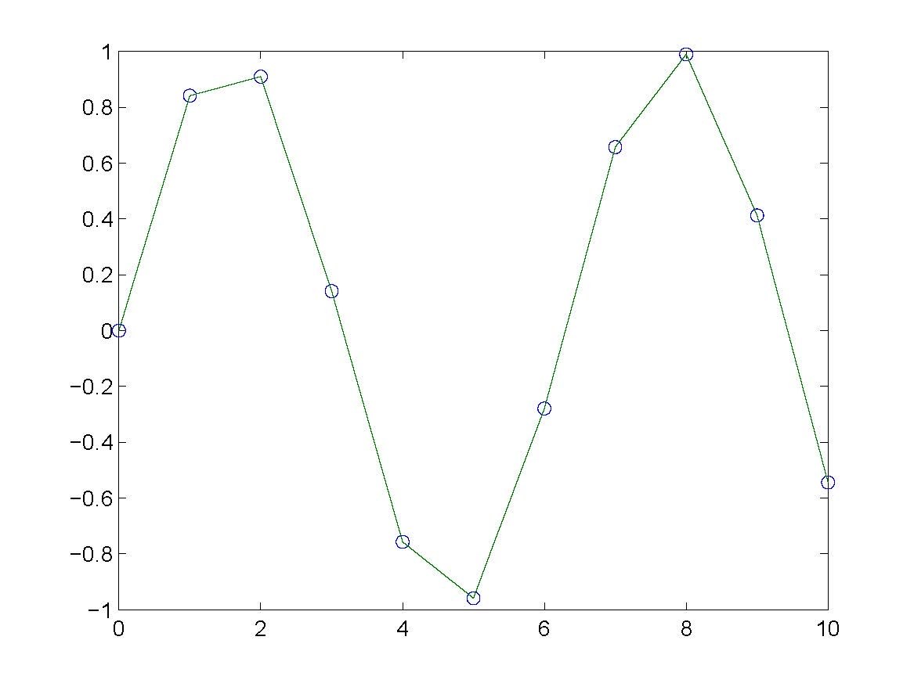
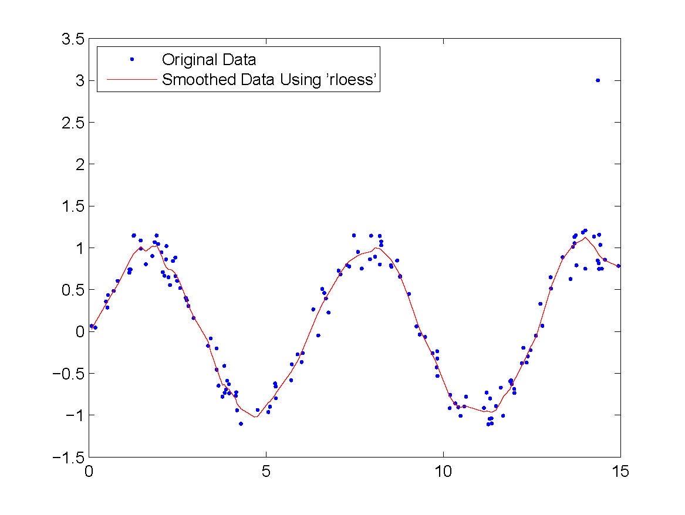
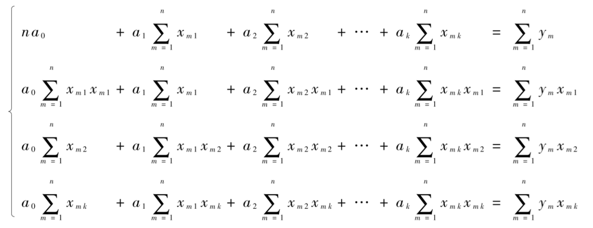

# 3 数据拟合

<!-- page: 1 -->

3 数据拟合
Curve Fitting

何军辉
hejh@scut.edu.cn

计算机科学与工程学院
School of Computer Science & Engineering

<!-- page: 2 -->

2
插值与拟合

计算机科学与工程学院
School of Computer Science & Engineering

<!-- page: 3 -->

3
3.1 单变量数据拟合及最小二乘法

o 若给定的数据表表示的是一个量与另一个量的

关系，则可以使用单变量数据拟合法寻找一个
近似函数来代替函数𝑓(𝑥)

o 通常𝐹(𝑥)称为拟合函数，𝑓(𝑥)称为被拟合函数

n
与插值法不同，数据拟合并不要求近似函数
𝐹(𝑥)通过已知数据点
n
希望能找到一个最好的函数来近似代替𝑓(𝑥)

n
好坏的标准？

计算机科学与工程学院
School of Computer Science & Engineering

<!-- page: 4 -->

4
3.1 单变量数据拟合及最小二乘法

定义：若记δ! = 𝑓𝑥! −𝐹𝑥! ，𝑖= 1,2, ⋯, 𝑛，则
称δ!为𝑓(𝑥)与𝐹(𝑥)在𝑥!的偏差.

定义：以“偏差的平方和最小”为原则选择近似函
数的方法称为最小二乘法.

$

$

% = 0

𝑓𝑥! −𝐹𝑥!
%

𝑚𝑖𝑛0

𝛿!

!"#

!"#

计算机科学与工程学院
School of Computer Science & Engineering

<!-- page: 5 -->

5
3.1 单变量数据拟合及最小二乘法

o 单变量数据拟合法的一般步骤：

①按给定数据表画出散点图
②分析散点图，确定近似函数𝐹(𝑥)的类型，以反

映给定数据的一般趋势
③用最小二乘法确定近似函数𝐹(𝑥)的未知参数，

从而得到最小二乘拟合函数𝐹(𝑥)

计算机科学与工程学院
School of Computer Science & Engineering

<!-- page: 6 -->

6
3.1 单变量数据拟合及最小二乘法

o 最小二乘直线

定理：给定𝑦= 𝑓𝑥的数据表(𝑥!, 𝑦!)(𝑖= 1,2, ⋯, 𝑛)
如下，若点(𝑥!, 𝑦!)大体上满足线性函数，即最小二
乘拟合函数为

𝐹𝑥= 𝑎+ 𝑏𝑥

则待定参数𝑎和𝑏是正规方程组方程组

$

$

𝑛𝑎+
$

𝑥!
𝑏= $

𝑦!

!"#

!"#

$

$

$

%
= $

$

𝑥!
𝑎+
$

𝑥!

𝑥!𝑦!

!"#

!"#

!"#

计算机科学与工程学院
School of Computer Science & Engineering

<!-- page: 7 -->

7
3.1 单变量数据拟合及最小二乘法

例 ：已知一组实验数据如表所示，试用单变量数
据拟合法求其拟合函数.

𝑥
-1
0
1
2
3
4
5
6

𝑦= 𝑓(𝑥)
10
9
7
5
4
3
0
-1

𝐹𝑥= 𝑎+ 𝑏𝑥

计算机科学与工程学院
School of Computer Science & Engineering

<!-- page: 8 -->

8
3.1 单变量数据拟合及最小二乘法

o 单变量线性拟合法算法

①读入数据𝑥!和𝑦! 𝑖= 1,2, ⋯, 𝑛
②计算

%

%

%

%

' , 𝑠"& = /

𝑠" = /

𝑥! , 𝑠& = /

𝑦! , 𝑠"" = /

𝑥!

𝑥!𝑦!

!#$

!#$

!#$

!#$

③解正规方程组

0 𝑛𝑎+ 𝑠"𝑏= 𝑠&
𝑠"𝑎+ 𝑠""𝑏= 𝑠"&

④输出𝑎和𝑏

𝑎= 𝑠""𝑠& −𝑠"𝑠"&

𝑛𝑠"" −𝑠"'
, 𝑏= 𝑛𝑠"& −𝑠"𝑠&

𝑛𝑠"" −𝑠"'

计算机科学与工程学院
School of Computer Science & Engineering

<!-- page: 9 -->

9
3.2 多变量数据拟合

o 在实际问题中，很多问题反映的不是一个量与

一个量的关系，而是一个量与若干个量的关系.
n 一个量由若干个量确定

n 其中：若干个量通常称为自变量，由这些自变量

确定的量通常称为因变量

n 记自变量为𝑥$, 𝑥', ⋯, 𝑥(，因变量为𝑦
n 𝑛次实验或测量得到𝑛组数据

次数
𝑥!
𝑥"
⋯
𝑥#
𝑦= 𝑓(𝑥!, 𝑥", ⋯, 𝑥#)

1
𝑥!!
𝑥!"
⋯
𝑥!#
𝑦!
2
𝑥"!
𝑥""
⋯
𝑥"#
𝑦"
⋮
⋮
⋮
⋮
⋮

𝑛
𝑥$!
𝑥$"
⋯
𝑥$#
𝑦$

计算机科学与工程学院
School of Computer Science & Engineering

<!-- page: 10 -->

10
3.2 多变量数据拟合

o 多变量线性拟合

𝐹𝑥#, 𝑥%, ⋯, 𝑥& = 𝑎' + 𝑎#𝑥# + 𝑎%𝑥% + ⋯+ 𝑎&𝑥&

n 使用最小二乘法确定待定参数𝑎), 𝑎$, ⋯, 𝑎(

o 偏差平方和
𝜑𝑎0, 𝑎#, ⋯, 𝑎1

$

𝑦2 −𝑎0 −𝑎#𝑥2# −𝑎%𝑥2% −⋯−𝑎1𝑥21 %

= $

2"#

o 根据多元函数求极小值方法，对𝜑(𝑎0, 𝑎#, ⋯, 𝑎1)

分别求关于𝑎0, 𝑎#, ⋯, 𝑎1的偏导数并令其等于0

𝜕𝜑
𝜕𝑎!

= 0 (𝑖= 0,1, ⋯, 𝑘)

o 解方程组得到𝑎0, 𝑎#, ⋯, 𝑎1

计算机科学与工程学院
School of Computer Science & Engineering

<!-- page: 11 -->

11
3.2 多变量数据拟合

o 多变量线性拟合

𝐹𝑥#, 𝑥%, ⋯, 𝑥& = 𝑎' + 𝑎#𝑥# + 𝑎%𝑥% + ⋯+ 𝑎&𝑥&

计算机科学与工程学院
School of Computer Science & Engineering

<!-- page: 12 -->

12
3.2 多变量数据拟合

例：已知一组测量数据，求其线性拟合函数.

测量次数
𝑥!
𝑥"
𝑦= 𝑓(𝑥!, 𝑥")

1
1
1
7

2
1
2
9

3
2
1
10

4
2
2
11

5
2
3
12

𝐹𝑥#, 𝑥% = 𝑎' + 𝑎#𝑥# + 𝑎%𝑥%

计算机科学与工程学院
School of Computer Science & Engineering

<!-- page: 13 -->

13
3.3 非线性数据线性化

o 原始数据之间并不呈现线性关系，无法直接应

用最小二乘线性拟合.

①直接应用最小二乘思想可能得到非线性方程组

，不便于求解.

②可以尝试将原始数据作一定的变换，使经过变

换后的数据呈现线性关系.

计算机科学与工程学院
School of Computer Science & Engineering

<!-- page: 14 -->

14
3.3 非线性数据线性化

例：钢包容量与使用次数之间关系的测试数据

𝑖
次数
容量
𝑖
次数
容量
𝑖
次数
容量

1
2
6.42
6
7
10.00
11
12
10.60

2
3
8.20
7
8
9.93
12
13
10.80

3
4
9.58
8
9
9.99
13
14
10.60

4
5
9.50
9
10
10.49
14
15
10.90

5
6
9.70
10
11
10.59
15
16
10.76

1
𝑦= 𝑎+ 𝑏1

𝑥
双曲线

𝑋= 1

𝑥, 𝑌= 1

𝑦
𝑌= 𝑎+ 𝑏𝑋直线

计算机科学与工程学院
School of Computer Science & Engineering

<!-- page: 15 -->

15
3.3 非线性数据线性化

例：已知一组数据如下，求一个经验函数，形如
𝑦= 𝑎𝑒()(𝑎, 𝑏为常数)，使之与数据相拟合.

𝑥
0
1
2
3
4

𝑦= 𝑓(𝑥) 1.5
2.5
3.5
5
7.5

𝑦= 𝑎𝑒()

ln 𝑦= ln 𝑎+ 𝑏𝑥
𝑌= ln 𝑦, 𝐴= ln 𝑎, 𝐵= 𝑏, 𝑋= 𝑥

𝑥
0
1
2
3
4

𝑌= 𝑙𝑛𝑦%
0.405465
0.916291
1.252763
1.609438
2.014903

𝑌= 𝐴+ 𝐵𝑋

计算机科学与工程学院
School of Computer Science & Engineering

<!-- page: 16 -->

16
3.3 非线性数据线性化

o 采用非线性数据线性化方法拟合多项式

n 设有两个量𝑧和𝑦基本满足𝑚次多项式，实验测量

数据如下表：

𝑧
𝑧!
𝑧"
⋯
𝑧#
𝑦= 𝑓(𝑧)
𝑦!
𝑦"
⋯
𝑦#

𝑦= 𝑎) + 𝑎$𝑧+ 𝑎'𝑧' + ⋯+ 𝑎*𝑧*

𝑥$ = 𝑧, 𝑥' = 𝑧', ⋯, 𝑥* = 𝑧*

𝑦= 𝑎) + 𝑎$𝑥$ + 𝑎'𝑥' + ⋯+ 𝑎*𝑥*

= 𝐹(𝑥$, 𝑥', ⋯, 𝑥*)

计算机科学与工程学院
School of Computer Science & Engineering

<!-- page: 17 -->

17
3.4 正交多项式拟合

o 多项式拟合

n 先把多项式拟合函数变成多变量拟合函数
n 利用多变量拟合法求出多项式系数𝑎!

o 需要求解一个正规方程组
o 当多项式次数较高时，正规方程组可能会病态

定义：如果方程组𝑨𝑥= 𝒃中的系数矩阵𝑨和常数项
𝒃有微小变化，就会引起方程组的解很大变化，则
方程组𝑨𝑥= 𝒃称为病态方程组

计算机科学与工程学院
School of Computer Science & Engineering

<!-- page: 18 -->

18
3.4 正交多项式拟合

o 𝑚次多项式函数：

𝑦∗= Ψ2 𝑥= 𝑎0𝑝0 𝑥+ 𝑎#𝑝# 𝑥+ ⋯+ 𝑎2𝑝2 𝑥

2
𝑎1𝑝1 𝑥

= $

1"0

其中𝑎!为待定参数，𝑝1(𝑥)(𝑘= 0,1, ⋯, 𝑚)是𝑘次多项式.

o 当𝑥= 𝑥!时，产生的偏差为：

3
𝑎&𝑝& 𝑥!

∗= 𝑦! −0

𝛿! = 𝑦! −𝑦!

&"'

n 最小二乘法：偏差平方和最小

计算机科学与工程学院
School of Computer Science & Engineering

<!-- page: 19 -->

19
3.4 正交多项式拟合

n 由于从实验或测量中得到的不同数据精度不同，

为了反映这种不同，通常在每一个𝛿!前面乘上一
个表示数据精度的权数𝛼!
n 使加权偏差平方和最小

%

%

%

' = /

𝛼!𝛿! ' = /

'𝛿!

'

/

𝛼!

𝜔!𝛿!

!#$

!#$

!#$

'称为权因子.
𝜑(𝑎), 𝑎$, ⋯, 𝑎*)

其中𝜔! = 𝛼!

'

%

%

*
𝑎(𝑝( 𝑥!

' = /

≝/

𝜔!𝛿!

𝜔! 𝑦! −/

!#$

!#$

(#)

计算机科学与工程学院
School of Computer Science & Engineering

<!-- page: 20 -->

20
3.4 正交多项式拟合

%最小的问题
转化为求函数𝜑(𝑎', 𝑎#, ⋯, 𝑎3)极小值的问题

$
𝜔!𝛿!

o 选择𝑎!使加权偏差平方和∑!"#

n 对函数𝜑(𝑎), 𝑎$, ⋯, 𝑎*)分别求关于𝑎), 𝑎$, ⋯, 𝑎*

的导数，令其等于0，联立得到方程组：

%

*
𝑎(𝑝( 𝑥!
𝑝+ 𝑥! = 0

𝜕𝜑
𝜕𝛼+

= −2 /

𝜔! 𝑦! −/

!#$

(#)

其中(𝑗= 0,1, ⋯, 𝑚)

%

*
𝑎(𝑝( 𝑥! 𝑝+ 𝑥!
= /

%

/

𝜔! /

𝜔!𝑦!𝑝+(𝑥!）

!#$

(#)

!#$

计算机科学与工程学院
School of Computer Science & Engineering

<!-- page: 21 -->

21
3.4 正交多项式拟合

n 交换求和顺序得到

2
𝑎1 $

$

$

$

𝜔!𝑝1 𝑥! 𝑝7(𝑥!) = $

𝜔!𝑦!𝑝7(𝑥!）

1"0

!"#

!"#

%
𝜔!𝑦!𝑝+ 𝑥!
n 正规方程组

%
𝜔!𝑝( 𝑥! 𝑝+(𝑥!)，𝑏+ = ∑!#$

令𝑐+( = ∑!#$

3
𝑐4&𝑎& = 𝑏4
定义：对数据𝑥!和加权因子𝜔!的正交多项式簇.

∑&"'

$

𝑐71 = $

𝜔!𝑝1 𝑥! 𝑝7(𝑥!) = 0
𝑗≠𝑘

!"#

$

𝜔!𝑝7 𝑥! % > 0 (𝑗, 𝑘= 0,1, ⋯, 𝑚)

𝑐77 = $

!"#

计算机科学与工程学院
School of Computer Science & Engineering

<!-- page: 22 -->

22
3.4 正交多项式拟合

(!
5!!
例：正交多项式簇

3
𝑐4&𝑎& = 𝑏4，𝑐&&𝑎& = 𝑏&，𝑎& =

∑&"'

o 假设给定一组𝑛+ 1个等距节点𝜉!(𝑖= 0,1, ⋯, 𝑛)，

间隔为ℎ，选取加权因子𝜔! = 1

o 引入变换 𝑥= 898!

: ，则 𝜉!变为𝑥! = 𝑖，𝑥!是𝑛+ 1
个整数等距节点
o 构造多项式

2
−1 1 𝑚

𝑥(1)

𝑚+ 𝑘

𝑝2,$ 𝑥= $

𝑘

𝑛(1)

𝑘

1"0

其中𝑥(1) = 𝑥𝑥−1 ⋯(𝑥−𝑘+ 1)且𝑥(0) = 1

计算机科学与工程学院
School of Computer Science & Engineering

<!-- page: 23 -->

23

计算机科学与工程学院
School of Computer Science & Engineering

