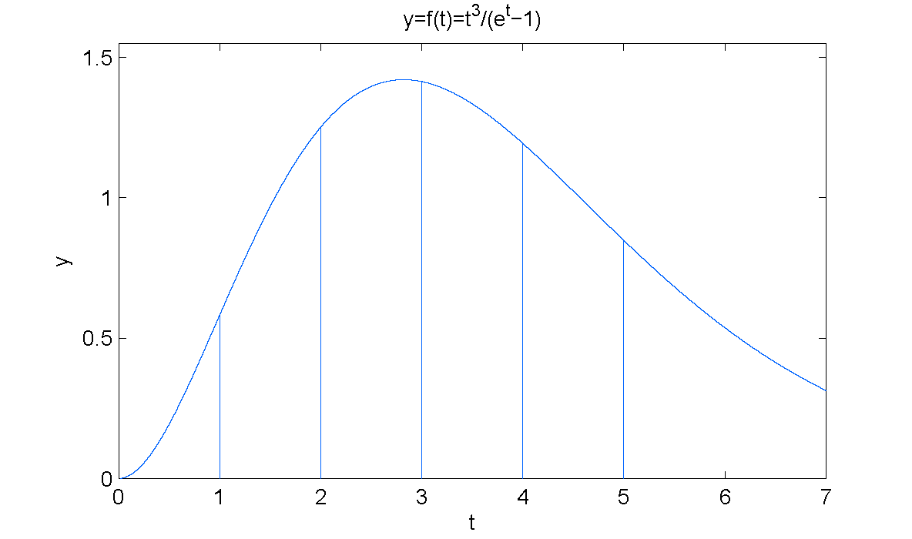

# 4 数值积分

<!-- page: 1 -->

4 数值积分
Numerical Integration

何军辉
hejh@scut.edu.cn

计算机科学与工程学院
School of Computer Science & Engineering

<!-- page: 2 -->

2
背景

o 计算积分的基本公式

"

!

𝑓𝑥𝑑𝑥= 𝐹𝑏−𝐹(𝑎)

!

其中𝐹(𝑥)为被积函数𝑓(𝑥)的原函数

n 问题：有些函数的原函数无法用初等函数来表示

，或者用函数表表示的函数积分也不能通过求原
函数的方法计算

"
#!

$"%& 𝑑𝑡=?

例：∫!

计算机科学与工程学院
School of Computer Science & Engineering

<!-- page: 3 -->

3
背景

o 数值积分基本思想：

1. 根据代数插值法，对于任一被积函数𝑓(𝑥)，都
可以构造一个插值多项式𝑝(𝑥)来近似代替，即

𝑓𝑥≈𝑝𝑥

2. 两边积分

"

"

(

𝑓𝑥𝑑𝑥≈(

𝑝𝑥𝑑𝑥

!

!

3. 多项式函数𝑝(𝑥)的定积分容易计算.

计算机科学与工程学院
School of Computer Science & Engineering

<!-- page: 4 -->

4
4.1 梯形求积公式

o 由代数插值法，用两点𝑎, 𝑓𝑎
, (𝑏, 𝑓𝑏)构造
线性函数𝑝#(𝑥)近似代替𝑓(𝑥)

𝑓𝑥≈𝑝# 𝑥= 𝑥−𝑏

𝑎−𝑏𝑓𝑎+ 𝑥−𝑎

𝑏−𝑎𝑓(𝑏)

"

"

"

𝑥−𝑏
𝑎−𝑏𝑓𝑎

(

𝑓𝑥𝑑𝑥≈(

𝑝# 𝑥𝑑𝑥= (

0

!

!

!

+ 𝑥−𝑎

𝑏−𝑎𝑓𝑏
𝑑𝑥= 𝑏−𝑎

1

2
𝑓𝑎+ 𝑓(𝑏)

o 梯形求积公式的几何意义是用梯形区域的面积

来代替曲边梯形区域面积.

计算机科学与工程学院
School of Computer Science & Engineering

<!-- page: 5 -->

5
4.1 Simpson求积公式

o 由代数插值法，用三点𝑎, 𝑓𝑎
,

!$"

!$"

% , 𝑓

%
,
𝑏, 𝑓𝑏
构造二次多项式𝑝%(𝑥)

近似代替𝑓(𝑥).
𝑓𝑥≈𝑝! 𝑥

𝑥−𝑎+ 𝑏

2
𝑥−𝑏

𝑓𝑎+
𝑥−𝑎
𝑎−𝑏
𝑎+ 𝑏

𝑓𝑎+ 𝑏

=

𝑎−𝑎+ 𝑏

2
−𝑎
𝑎+ 𝑏

2

2
𝑎−𝑏

2
−𝑏

𝑥−𝑎
𝑥−𝑎+ 𝑏

2

+

𝑓(𝑏)

𝑏−𝑎
𝑏−𝑎+ 𝑏

2

计算机科学与工程学院
School of Computer Science & Engineering

<!-- page: 6 -->

6
4.1 Simpson求积公式

"

"

𝑝% 𝑥𝑑𝑥= 𝑏−𝑎

(

𝑓𝑥𝑑𝑥≈(

6
0

𝑓𝑎

!

!

+ 4𝑓𝑎+ 𝑏

2
+ 𝑓(𝑏)

1

计算机科学与工程学院
School of Computer Science & Engineering

<!-- page: 7 -->

7
4.1 Newton-Cotes求积公式

o 把积分区间𝑎, 𝑏划分𝑛等分，得到𝑛+ 1个分点

"'!

𝑥& = 𝑎+ 𝑖ℎ(𝑖= 0,1, ⋯, 𝑛)，其中ℎ=

( .

o 由代数插值法，以𝑛+ 1个分点作为插值节点构

造𝑛阶多项式𝑝((𝑥)近似代替𝑓(𝑥).

(
𝜔𝑥
𝑥−𝑥& 𝜔+ 𝑥&

𝑓𝑥≈𝑝( 𝑥= ;

𝑓𝑥&

&)*

其中：

𝜔𝑥= 𝑥−𝑥#
𝑥−𝑥$ ⋯𝑥−𝑥%
𝜔& 𝑥'
= 𝑥' −𝑥#
𝑥' −𝑥$ ⋯𝑥' −𝑥'($
𝑥' −𝑥')$ ⋯(𝑥'
−𝑥%)

计算机科学与工程学院
School of Computer Science & Engineering

<!-- page: 8 -->

8
4.1 Newton-Cotes求积公式

+

+

*
*

𝑓𝑥𝑑𝑥≈*

𝑝% 𝑥𝑑𝑥

*

%
𝜔𝑥
𝑥−𝑥' 𝜔& 𝑥'

+

= *

-

𝑓𝑥' 𝑑𝑥

*

',#

%

%

+
𝜔𝑥
𝑥−𝑥' 𝜔& 𝑥'

*
*

= -

𝑑𝑥𝑓𝑥' = -

𝐴'𝑓𝑥'

',#

',#

"
, -

其中𝐴& = ∫!

-'-! ," -! 𝑑𝑥

计算机科学与工程学院
School of Computer Science & Engineering

<!-- page: 9 -->

9
4.1 Newton-Cotes求积公式

o 如何求𝐴&？

令𝑥= 𝑎+ 𝑡ℎ，则 𝑥−𝑥& = 𝑎+ 𝑡ℎ−𝑎+ 𝑖ℎ=

𝑡−𝑖ℎ

𝜔𝑥= 𝑥−𝑥*
𝑥−𝑥# ⋯𝑥−𝑥(
= 𝑡ℎ𝑡−1 ℎ⋯𝑡−𝑛ℎ
= ℎ($#𝑡𝑡−1 ⋯(𝑡−𝑛)
𝜔+ 𝑥&
= 𝑥& −𝑥*
𝑥& −𝑥# ⋯𝑥& −𝑥&'#
𝑥& −𝑥&$# ⋯(
)

𝑥&
−𝑥( = 𝑖ℎ𝑖−1 ℎ⋯ℎ−ℎ⋯−𝑛−𝑖ℎ
= −1 ('&ℎ(𝑖! 𝑛−𝑖!

计算机科学与工程学院
School of Computer Science & Engineering

<!-- page: 10 -->

10
4.1 Newton-Cotes求积公式

o 如何求𝐴&？

"
𝜔𝑥
𝑥−𝑥& 𝜔+ 𝑥&

-)!$./

𝐴& = (

𝑑𝑥

!

(
ℎ($#𝑡𝑡−1 ⋯(𝑡−𝑛)
𝑡−𝑖ℎ−1 ('&ℎ(𝑖! 𝑛−𝑖! ℎ𝑑𝑡

(

*

( 𝑡𝑡−1 ⋯(𝑡−𝑛)

= −1 ('&(𝑏−𝑎)

𝑛⋅𝑖! 𝑛−𝑖! (

𝑡−𝑖
𝑑𝑡

*

计算机科学与工程学院
School of Computer Science & Engineering

<!-- page: 11 -->

11
4.1 Newton-Cotes求积公式

(() =

'# #$!

( . .'# ⋯(.'()

o 记 𝑐&

.'&
𝑑𝑡，则有

(⋅&! ('& ! ∫*

(()

𝐴& = 𝑏−𝑎𝑐&

(

"

"

( 𝑓(𝑥&)

(

𝑓𝑥𝑑𝑥≈(

𝑝( 𝑥𝑑𝑥= ;

𝑏−𝑎𝑐&

!

!

&)*

称为Newton-Cotes（牛顿-科特斯）公式，其中
𝑐&

(()称为Newton-Cotes系数.

(()仅依赖于𝑛和 𝑖，不依赖于被积函数𝑓(𝑥)和
积分区间[𝑎, 𝑏]，可以预先计算构成Newton-
Cotes系数表.

o 𝑐&

计算机科学与工程学院
School of Computer Science & Engineering

<!-- page: 12 -->

12
4.1 梯形/Simpson/Newton-Cotes公式

例：用梯形公式、Simpson求积公式和Newton-
Cotes求积公式（取𝑛= 4）计算定积分

#

(

𝑥𝑑𝑥

*.6

计算机科学与工程学院
School of Computer Science & Engineering

<!-- page: 13 -->

13
4.2 求积公式的代数精度

定义：对一般求积公式，如果当𝑓(𝑥)为 任意一个
次数不高于𝑛次的代数多项式时，积分近似公式

8
𝐴7𝑓(𝑥7)

"

(

𝑓𝑥𝑑𝑥≈;

!

7)*

精确成立，而当𝑓(𝑥)为𝑛+ 1次代数多项式时不精
确成立，则称该积分近似公式具有𝑛次代数精度.

计算机科学与工程学院
School of Computer Science & Engineering

<!-- page: 14 -->

14
4.2 求积公式的代数精度

定理：梯形求积公式具有1次代数精度.

①当𝑓(𝑥)为任意一个不超过一次的代数多项式时

，梯形求积公式精确成立.

②当𝑓(𝑥)为二次代数多项式时，梯形求积公式不

精确成立.

𝑓𝑥−𝑝# 𝑥= 𝑓$$ 𝜉

2!
(𝑥−𝑎)(𝑥−𝑏)

定理：Newton-Cotes求积公式至少具有𝑛次代数
精度，当𝑛为偶数时，积分代数精度至少为𝑛+ 1次

𝑓𝑥−𝑝% 𝑥= 𝑓%&# 𝜉

𝑛+ 1 ! 𝜔(𝑥)

定理：Simpson求积公式的代数精度为3.

计算机科学与工程学院
School of Computer Science & Engineering

<!-- page: 15 -->

15
加权积分定理

o 如果𝑓在[𝑎, 𝑏]连续，𝑔在[𝑎, 𝑏]可积并且𝑔𝑥≥0

，∀𝑥∈[𝑎, 𝑏]，则

"

"

(

𝑓𝑥𝑔𝑥𝑑𝑥= 𝑓𝑐(

𝑔𝑥𝑑𝑥

!

!

这里𝑐是[𝑎, 𝑏]中适当的点.

o 参考：张筑生，《数学分析新讲》第二册，P89

计算机科学与工程学院
School of Computer Science & Engineering

<!-- page: 16 -->

16
4.3 梯形和Simpson求积公式误差估计

定理：若𝑓𝑥∈𝐶%[𝑎, 𝑏]，梯形公式误差估计为：

"

𝑓𝑥𝑑𝑥−𝑏−𝑎

(

2
𝑓𝑎+ 𝑓𝑏

!

= −𝑏−𝑎9

12
𝑓′′(𝜂)

其中𝑎≤𝜂≤𝑏

1. 𝑅𝑥=
:"" ;

%
(𝑥−𝑎)(𝑥−𝑏)

2. 加权积分中值定理

计算机科学与工程学院
School of Computer Science & Engineering

<!-- page: 17 -->

17
4.3 梯形和Simpson求积公式误差估计

思考：求满足𝑃𝑥& = 𝑓(𝑥&)(𝑖= 0,1,2)及𝑃+ 𝑥# =
𝑓′(𝑥#)的插值多项式及其余项表达式.

𝑃𝑥
= 𝑓𝑥* + 𝑓𝑥*, 𝑥#
𝑥−𝑥*
+ 𝑓𝑥*, 𝑥#, 𝑥%
𝑥−𝑥*
𝑥−𝑥# + 𝐴(𝑥−𝑥*)(𝑥
−𝑥#)(𝑥−𝑥%)

𝑅𝑥= 𝑓< 𝜉

4!
𝑥−𝑥*
𝑥−𝑥# %(𝑥−𝑥%)

计算机科学与工程学院
School of Computer Science & Engineering

<!-- page: 18 -->

18
4.3 梯形和Simpson求积公式误差估计

定理：若𝑓𝑥∈𝐶<[𝑎, 𝑏]，Simpson公式误差估计

"

𝑓𝑥𝑑𝑥−𝑏−𝑎

6
𝑓𝑎+ 4𝑓𝑎+ 𝑏

(

2
+ 𝑓𝑏

!

= −𝑏−𝑎6

2880
𝑓< (𝜂)

其中𝑎≤𝜂≤𝑏

1. 构造三次插值多项式𝑝9(𝑥)满足：𝑝9 𝑎=

!$"

𝑓𝑎, 𝑝9 𝑏= 𝑓𝑏, 𝑝9

%
=

!$"

+
!$"

%
= 𝑓+
!$"

𝑓

%
, 𝑝9

%
.

2. 加权积分中值定理

计算机科学与工程学院
School of Computer Science & Engineering

<!-- page: 19 -->

19
4.4 复合求积公式

o 梯形和Simpson求积公式会产生较大的误差：

从几何意义观察

o 对Newton-Cotes公式来说，当𝑛→∞时，并非

对所有𝑓(𝑥)都有：

(

"

( 𝑓𝑥& →0

(

𝑓𝑥𝑑𝑥−;

𝑏−𝑎𝑐&

!

&)*

n Newton-Cotes求积公式的收敛性对某些被积函

数𝑓(𝑥)得不到保证.

n 当𝑛≥8时，Newton-Cotes求积公式的稳定性得

不到保证.

计算机科学与工程学院
School of Computer Science & Engineering

<!-- page: 20 -->

20
4.4 复合求积公式

o 复合梯形求积公式

定义：把积分区间[𝑎, 𝑏]划分𝑛等分，记𝑛+ 1个分点
为𝑥#, 𝑥$, ⋯, 𝑥-, ⋯, 𝑥%，其中𝑥- = 𝑎+ 𝑘ℎ(𝑘=

0,1, ⋯, 𝑛; ℎ=
+(*

% ). 使用这些分点将[𝑎, 𝑏]分为𝑛个小
区间𝑥#, 𝑥$ , 𝑥$, 𝑥. , ⋯, [𝑥%($, 𝑥%].

"

#"

##

#$

=

𝑓𝑥𝑑𝑥= =

𝑓𝑥𝑑𝑥+ =

𝑓(𝑥) 𝑑𝑥+ ⋯+ =

𝑓𝑥𝑑𝑥

!

#!

#"

#$%"

'() 𝑥$*) −𝑥$

'()

#&'"

= C

=

𝑓𝑥𝑑𝑥≈C

2
𝑓𝑥$ + 𝑓𝑥$*)

#&

$%&

$%&

'()

'()

= ℎ

𝑓𝑥$ + 𝑓𝑥$*)
= ℎ

2 C

2 𝑓𝑎+ 𝑓𝑏+ 2 C

𝑓(𝑎+ 𝑘ℎ)

$%&

$%)

称为复合梯形求积公式，记为𝑇"

计算机科学与工程学院
School of Computer Science & Engineering

<!-- page: 21 -->

21
4.4 复合求积公式

o 复合梯形公式求积算法：

①输入𝑎, 𝑏和𝑛

+(*

②ℎ=

%
③𝑠𝑢𝑚= 0

o 对𝑘= 1,2, ⋯, 𝑛−1做

𝑠𝑢𝑚= 𝑠𝑢𝑚+ 𝑓(𝑎+ 𝑘ℎ)

/

④𝑇=

. 𝑓𝑎+ 𝑓𝑏+ 2 ∗𝑠𝑢𝑚

⑤输出𝑇

计算机科学与工程学院
School of Computer Science & Engineering

<!-- page: 22 -->

22
4.4 复合求积公式

o 复合梯形求积公式误差

定理：若𝑓𝑥∈𝐶%[𝑎, 𝑏]，则对复合梯形求积公式
𝑇(有：

"

𝑓𝑥𝑑𝑥−𝑇( = −𝑏−𝑎

12 ℎ%𝑓′′(𝜂)

(

!

"'!

其中ℎ=

( , 𝑎≤𝜂≤𝑏.

应用：使用误差估计式判断𝑛应该 取多大才能满足
所要求的精度要求.

计算机科学与工程学院
School of Computer Science & Engineering

<!-- page: 23 -->

23
4.4 复合求积公式

# 𝑒-𝑑𝑥的近似值，要求保证有5位有
效数字，若用复合梯形求积公式计算，𝑛应取多少.

例：计算积分∫*

1. ∫!
" 𝑓𝑥𝑑𝑥−𝑇( = −

#% ℎ%𝑓++ 𝜂.

"'!

2. 有效数字与 误差限的关系𝑥∗−𝑥≤
#

% ×10K'(

计算机科学与工程学院
School of Computer Science & Engineering

<!-- page: 24 -->

24
4.4 复合求积公式

定理：积分近似值𝑇(与𝑇%(有如下 关系：

(

𝑇%( = 1

𝑓(𝑎+ 2𝑘−1 𝑏−𝑎

2 𝑇( + ℎ;

2𝑛)

7)#

"'!

其中ℎ=

( .

计算机科学与工程学院
School of Computer Science & Engineering

<!-- page: 25 -->

25
4.4 复合求积公式

o 复合Simpson求积公式

n 把积分区间[𝑎, 𝑏]划分𝑛等分，𝑛为偶数，设𝑛=

2𝑚(𝑚= 1,2, ⋯)，则分点为𝑥#, 𝑥$, ⋯, 𝑥.0.其中

+(*

𝑥- = 𝑎+ 𝑘ℎ; 𝑘= 0,1, ⋯, 2𝑚; ℎ=

% .

n 使用这些分点把[𝑎, 𝑏]分为𝑚个小区间

𝑥#, 𝑥. , 𝑥., 𝑥1 , ⋯, [𝑥. 0($ , 𝑥.0].在每个小区间
[𝑥. -($ , 𝑥.-](𝑘= 1,2, ⋯, 𝑚)上使用Simpson求
积公式得

##&

𝑓𝑥𝑑𝑥≈𝑥+$ −𝑥+$(+

=

6
𝑓𝑥+$(+ + 4𝑓𝑥+$() + 𝑓𝑥+$

## &%"

= ℎ

3 𝑓𝑥+$(+ + 4𝑓𝑥+$() + 𝑓𝑥+$

计算机科学与工程学院
School of Computer Science & Engineering

<!-- page: 26 -->

26
4.4 复合求积公式

"

!

𝑓𝑥𝑑𝑥

!

'"

'#

'"$

= !

𝑓𝑥𝑑𝑥+ !

𝑓𝑥𝑑𝑥+ ⋯+ !

𝑓𝑥𝑑𝑥

'!

'"

'" $%&

*
!

'"'

= ;

𝑓𝑥𝑑𝑥

'" '%&

()#

* ℎ
3 𝑓𝑥+(,+ + 4𝑓𝑥+(,# + 𝑓𝑥+(

≈;

()#

*
𝑓(𝑥+(,#) + 2 ;

*,#
𝑓(𝑥+()

= ℎ

3 𝑓𝑎+ 𝑓𝑏+ 4 ;

()#

()#

称为复合Simpson求积公式，记为𝑆%.

计算机科学与工程学院
School of Computer Science & Engineering

<!-- page: 27 -->

27
4.4 复合求积公式

定理：若𝑓𝑥∈𝐶<[𝑎, 𝑏]，则对复合Simpson求积
公式𝑆(有

"

𝑓𝑥𝑑𝑥−𝑆( = −𝑏−𝑎

2880 2ℎ<𝑓< 𝜂

(

!

"'!

其中ℎ=

( ; 𝑎≤𝜂≤𝑏.

计算机科学与工程学院
School of Computer Science & Engineering

<!-- page: 28 -->

28
4.4 复合求积公式

o 复合Simpson公式求积算法：

①输入𝑎, 𝑏和𝑛

+(*

②计算ℎ=

%
③𝑆1 = 0, 𝑆2 = 0

o 对𝑘= 1,2, ⋯, 𝑚做

𝑆1 = 𝑆1 + 𝑓𝑎+ 2 ∗𝑘−1 ∗ℎ
o 对𝑘= 1,2, ⋯, 𝑚−1做

𝑆2 = 𝑆2 + 𝑓𝑎+ 2 ∗𝑘∗ℎ

④计算𝑆= /

2 𝑓𝑎+ 𝑓𝑏+ 4 ∗𝑆1 + 2 ∗𝑆2

⑤输出𝑆

计算机科学与工程学院
School of Computer Science & Engineering

<!-- page: 29 -->

29
4.5 自动选取步长梯形法

o 复合梯形公式在求积分之前必须选定𝑛

n 可通过误差估计来确定𝑛

+

𝑓𝑥𝑑𝑥−𝑇% = 𝑏−𝑎

12 ℎ. 𝑓′′(𝜂)

*
*

≤𝑏−𝑎

12 ℎ. max
*343+ 𝑓&& 𝑥

o 如果𝑛取得太大，虽然能使误差变小，但计算量

就会增加
o 如果𝑛取得太小，误差就会很大，积分精度难以

得到保证
n 使用自动选取步长梯形法

计算机科学与工程学院
School of Computer Science & Engineering

<!-- page: 30 -->

30
4.5 自动选取步长梯形法

o 积分近似值𝑇+%和𝑇%的关系：

'

𝑇+' = 1

𝑓𝑎+ 2𝑘−1 𝑏−𝑎

2𝑛
, (ℎ= 𝑏−𝑎

2 𝑇' + ℎC

𝑛
)

$%)

o 自动步长选取法

$

𝑓𝑥𝑑𝑥−𝑇" = −𝑏−𝑎

12 ℎ!𝑓%% 𝜂
𝑎≤𝜂" ≤𝑏

.

#

!

$

𝑓𝑥𝑑𝑥−𝑇!" = −𝑏−𝑎

12
ℎ
2

𝑓%% 𝜂!" (𝑎≤𝜂!" ≤𝑏)

.

#

!

𝑇!" −𝑇" = −𝑏−𝑎

12
ℎ
2

4𝑓%% 𝜂" −𝑓%% 𝜂!"
1
3 𝑇!" −𝑇" ≈.
#

$

𝑓𝑥𝑑𝑥−𝑇!"

" 𝑓𝑥𝑑𝑥−𝑇+' < 𝜖；可用𝑇+' −𝑇' < 3𝜖近似判断

精度要求：∫!

计算机科学与工程学院
School of Computer Science & Engineering

<!-- page: 31 -->

31
4.5 自动选取步长梯形法

o 自动选取步长梯形算法：

①输入𝑎, 𝑏和𝜖

+(*

②计算ℎ=

. ，𝑇1 = 𝑓𝑎+ 𝑓𝑏
∗ℎ, 𝑛= 1

③计算𝑇0 = 𝑇1，𝑆= 0（𝑇0表示前次积分近似值

，𝑇1表示后次积分近似值）

④对𝑘= 1,2, ⋯, 𝑛计算

𝑆= 𝑆+ 𝑓𝑎+ 2 ∗𝑘−1 ∗ℎ/𝑛

/
%
⑥若𝑇1 −𝑇0 < 3𝜖，则输出𝑇1的值，结束计算，

5#
. + 𝑆∗

⑤𝑇1 =

否则𝑛= 2𝑛，返回③

计算机科学与工程学院
School of Computer Science & Engineering

<!-- page: 32 -->

32
4.6 Richardson理查森外推法

o 假设有一个量𝐹∗（可以是函数/微分/积分等）

，现用一个以步长ℎ为变量的函数𝐹*(ℎ)近似代
替它，并设𝐹∗与ℎ无关.

o 𝐹∗与𝐹*(ℎ)的误差表示为

𝐹∗−𝐹* ℎ= 𝑎#ℎK% + 𝑎%ℎK& + ⋯+ 𝑎7ℎK' + ⋯

其中 0 < 𝑝# < 𝑝% < ⋯< 𝑝7 < ⋯; 𝑎7 ≠0(𝑘=
1,2, ⋯)是与ℎ无关的常数.
n 当ℎ适当小时，ℎ6&对误差影响最大.

n 称为𝐹∗与函数𝐹#(ℎ)的误差的阶

o 如何构造新的函数𝐹# ℎ, 𝐹% ℎ, ⋯，使得新函数

与𝐹∗之间误差的阶幂更高？

计算机科学与工程学院
School of Computer Science & Engineering

<!-- page: 33 -->

33
4.6 Richardson理查森外推法

1. 用𝑞ℎ代替ℎ.
𝐹∗−𝐹. ℎ= 𝑎#ℎ/& + 𝑎+ℎ/" + ⋯+ 𝑎(ℎ/' + ⋯
𝐹∗−𝐹. 𝑞ℎ= 𝑎# 𝑞ℎ/& + 𝑎+ 𝑞ℎ/" + ⋯+ 𝑎( 𝑞ℎ/' + ⋯

其中𝑞为常数，并满足1 −𝑞/& ≠0

2. 消去含有ℎK%的项.
𝑞/&𝐹∗−𝑞/&𝐹. ℎ
= 𝑎# 𝑞ℎ/& + 𝑎+𝑞/&ℎ/" + ⋯+ 𝑎(𝑞/&ℎ/' + ⋯

1 −𝑞/& 𝐹∗−𝐹. 𝑞ℎ−𝑞/&𝐹. ℎ
= 𝑎+ 𝑞/" −𝑞/& ℎ/" + 𝑎0 𝑞/( −𝑞/& ℎ/( + ⋯
+ 𝑎( 𝑞/' −𝑞/& ℎ/' + ⋯

1 −𝑞/&
= 𝑎+ 𝑞/" −𝑞/& ℎ/"

𝐹∗−𝐹. 𝑞ℎ−𝑞/&𝐹. ℎ

1 −𝑞/&
+ ⋯

计算机科学与工程学院
School of Computer Science & Engineering

<!-- page: 34 -->

34
4.6 Richardson理查森外推法

1 −𝑞/&
= 𝑎+ 𝑞/" −𝑞/& ℎ/"

𝐹∗−𝐹. 𝑞ℎ−𝑞/&𝐹. ℎ

1 −𝑞/&
+ ⋯

3. 取新函数如下

𝐹# ℎ= 𝐹. 𝑞ℎ−𝑞/&𝐹. ℎ

1 −𝑞/&

# = 𝑎((𝑞/' −𝑞/&)

𝑎(

1 −𝑞/&
𝑘= 2,3, ⋯

# ℎ/" + 𝑎0

# ℎ/( + ⋯+ 𝑎(

# ℎ/' + ⋯

𝐹∗−𝐹# ℎ= 𝑎+

# 是与ℎ无关的常数.

其中𝑎(

4. 以此类推，构造出𝐹% ℎ, 𝐹9 ℎ, ⋯

计算机科学与工程学院
School of Computer Science & Engineering

<!-- page: 35 -->

35
4.6 Richardson理查森外推法

o Richardson外推一般形式：

𝐹* ℎ= 𝐹*,# 𝑞ℎ−𝑞/$𝐹*,#(ℎ)

1 −𝑞/$
𝑚= 1,2, ⋯

其中𝑞为常数，并满足1 −𝑞/$ ≠0.

o 对应的误差阶幂

* ℎ/$)& + 𝑎*&+
* ℎ/$)" + ⋯

𝐹∗−𝐹* ℎ= 𝑎*&#

$%& (2*',2*$)

* =
!'

其中𝑎(

#,2*$
(𝑘= 𝑚+ 1, 𝑚+ 2, ⋯)，是与ℎ

无关的常数.

计算机科学与工程学院
School of Computer Science & Engineering

<!-- page: 36 -->

36
4.7 Romberg求积法

o Romberg序列的推导

n 复合梯形公式误差可以表示为

+

𝑓𝑥𝑑𝑥−𝑇% = 𝑎.ℎ. + 𝑎1ℎ1 + 𝑎8ℎ8 + ⋯

*
*

其中ℎ= +(*

% , 𝑎., 𝑎1, 𝑎8, ⋯都是与步长ℎ无关的常数.

n 复合梯形公式序列

'()

𝑇' = ℎ

2 𝑓𝑎+ +𝑓𝑏+ 2 C

𝑓(𝑎+ 𝑘ℎ) = 𝑇&(ℎ)

$%)

+'()

𝑇+' = ℎ

𝑓(𝑎+ 𝑘ℎ

2) = 𝑇&
ℎ
2

2+ 𝑓𝑎+ 𝑓𝑏+ 2 C

$%)

ℎ
2 , 𝑇.
ℎ
2+ , ⋯

𝑇. ℎ, 𝑇.

计算机科学与工程学院
School of Computer Science & Engineering

<!-- page: 37 -->

37
4.7 Romberg求积法

n 取𝑚= 1, 𝑞= $

.，应用Richardson外推算法

𝑇# ℎ

2 −1
2. 𝑇# ℎ

𝑇$ ℎ=

1 −1
2.

ℎ
2 =
𝑇#
ℎ
2. −1
2. 𝑇# ℎ
2

𝑇$

1 −1
2.

n 新的函数序列

ℎ
2 , 𝑇$
ℎ
2. , ⋯

𝑇$ ℎ, 𝑇$

计算机科学与工程学院
School of Computer Science & Engineering

<!-- page: 38 -->

38
4.7 Romberg求积法

n 不断应用Richardson外推得到一系列函数序列

ℎ
2 , 𝑇&
ℎ
2+ , ⋯

𝑇& ℎ, 𝑇&

ℎ
2 , 𝑇)
ℎ
2+ , ⋯

𝑇) ℎ, 𝑇)

ℎ
2 , 𝑇,
ℎ
2+ , ⋯

𝑇, ℎ, 𝑇,

n 统一公式

𝑇,()
ℎ
2$*) −
1
2+, 𝑇,()
ℎ
2$

ℎ
2$
=

𝑇,

1 −
1
2+,

4,𝑇,()
ℎ
2$*) −𝑇,()
ℎ
2$
4, −1

=

-
+ = 𝑇+', ⋯; 𝑚= 1,2, , ⋯; 𝑘= 0,1, ⋯

其中𝑇& ℎ= 𝑇', 𝑇&

计算机科学与工程学院
School of Computer Science & Engineering

<!-- page: 39 -->

39
4.7 Romberg求积法

o Romberg求积法的计算

𝑇% = 𝑇.(ℎ)

ℎ
2
𝑇#(ℎ)

𝑇+% = 𝑇.

ℎ
2+
𝑇#

ℎ
2
𝑇+(ℎ)

𝑇4% = 𝑇.

ℎ
20
𝑇#

ℎ
2+
𝑇+

ℎ
2
𝑇0(ℎ)

𝑇5% = 𝑇.

⋮
⋮
⋮
⋮
⋮

n 直到𝑇0 ℎ−𝑇0($(ℎ) < 𝜖

计算机科学与工程学院
School of Computer Science & Engineering

<!-- page: 40 -->

40
4.7 Romberg求积法

#
<

#$-& 𝑑𝑥的值
（给定𝜖= 0.01，且取𝑛= 1)

例：使用Romberg求积法计算积分∫*

计算机科学与工程学院
School of Computer Science & Engineering

<!-- page: 41 -->

41
4.7 Romberg求积法

o Romberg求积法算法

①输入𝑎, 𝑏和𝜖

# ：

②计算𝑇#

𝑇0,0 = 𝑏−𝑎

2
𝑓𝑎+ 𝑓𝑏

③𝑘= 1(其中𝑘用来记录把积分区间[𝑎, 𝑏]2等分的

次数)

- ：

④按复化梯形公式计算𝑇#

+&%"

𝑇0, 𝑘= 1

2 𝑇0, 𝑘−1 + 𝑏−𝑎
2$() C

𝑓𝑎+ 2𝑖−1 × 𝑏−𝑎

2$

.%)

计算机科学与工程学院
School of Computer Science & Engineering

<!-- page: 42 -->

42
4.7 Romberg求积法

7'8 ：

⑤计算第𝑘+ 1行元素𝑇8

𝑇𝑚, 𝑘−𝑚= 4,𝑇𝑚−1, 𝑘−𝑚+ 1 −𝑇(𝑚−1, 𝑘−𝑚)

4, −1
其中𝑚= 1,2, ⋯, 𝑘

⑥精度控制：

o 对指定的精度𝜖，若𝑇𝑘, 0 −𝑇(𝑘−1,0) < 𝜖，

. −𝑇(,#

.
< 𝜖，则终止计算，并取𝑇(𝑘, 0)即

即𝑇(

. 作为满足精度要求的积分近似值；否则𝑘=
𝑘+ 1，转回④继续计算.

𝑇(

计算机科学与工程学院
School of Computer Science & Engineering

<!-- page: 43 -->

43
4.8 Gauss 型求积公式

o 以𝑛个不等距的节点𝑥#, 𝑥%, ⋯, 𝑥(, 𝑥& ∈[𝑎, 𝑏]作为

插值节点，根据代数插值理论有

%

𝜔%(𝑥)
𝑥−𝑥( 𝜔%$ (𝑥() + 𝑓𝑥, 𝑥#, 𝑥+, ⋯, 𝑥% 𝜔%(𝑥)

𝑓𝑥= ;

𝑓𝑥(

()#

其中𝜔% 𝑥= 𝑥−𝑥#
𝑥−𝑥+ ⋯(𝑥−𝑥%).

o 乘以权函数𝜌(𝑥)并积分

"

=

𝜌𝑥𝑓𝑥𝑑𝑥

!

'

"

𝜔'(𝑥)
𝑥−𝑥$ 𝜔'/ (𝑥$) 𝑑𝑥

= =

𝜌𝑥
C

𝑓𝑥$

!

$%)

"

+ =

𝜌𝑥𝑓𝑥, 𝑥), 𝑥+, ⋯, 𝑥' 𝜔' 𝑥𝑑𝑥

!

计算机科学与工程学院
School of Computer Science & Engineering

<!-- page: 44 -->

44
4.8 Gauss 型求积公式

'

"

"
𝜌𝑥𝜔'(𝑥)
𝑥−𝑥$ 𝜔'/ (𝑥$) 𝑑𝑥

=

𝑓(𝑥$) =

𝜌𝑥𝑓𝑥𝑑𝑥= C

!

!

$%)

"

+ =

𝜌𝑥𝑓𝑥, 𝑥), 𝑥+, ⋯, 𝑥' 𝜔' 𝑥𝑑𝑥

!

" 𝜌𝑥𝑓𝑥, 𝑥), 𝑥+, ⋯, 𝑥' 𝜔' 𝑥𝑑𝑥，则

"
0 # 1$(#)
#(#& 1$( (#&) 𝑑𝑥，𝑅𝑓= ∫!

令𝐴$ = ∫!

有

'

"

=

𝜌𝑥𝑓𝑥𝑑𝑥= C

𝐴$𝑓(𝑥$) + 𝑅[𝑓]

!

$%)

o 当𝑓(𝑥)为不超过𝑛−1次多项式时，余项为0，即有：

'

"

=

𝜌𝑥𝑓𝑥𝑑𝑥= C

𝐴$𝑓(𝑥$) ，积分精度至少为𝑛−1

!

$%)

如何选择𝑥$和权函数使得积分精度从𝑛−1提高到2𝑛−1？

计算机科学与工程学院
School of Computer Science & Engineering

<!-- page: 45 -->

45
4.8 Gauss 型求积公式

定理：若对任何一个不超过𝑛−1次的代数多项式
𝑞(𝑥)满足

"

(

𝜌𝑥𝑞𝑥𝜔( 𝑥𝑑𝑥= 0

!

" 𝜌𝑥𝑓𝑥𝑑𝑥≈∑7)#

(
𝐴7𝑓(𝑥7)具有
2𝑛−1次代数精度.

则求积公式∫!

1.
𝑓(𝑥)次数不高于2𝑛−1：𝑓𝑥= 𝜔% 𝑥𝑞𝑥+ 𝑟𝑥

2.
𝑓(𝑥)为2𝑛次代数多项式：𝑓𝑥= 𝜔%+(𝑥)

计算机科学与工程学院
School of Computer Science & Engineering

<!-- page: 46 -->

46
4.8 Gauss 型求积公式

" 𝜌𝑥𝑞𝑥𝜔( 𝑥𝑑𝑥= 0，并取

o 选取𝑥7满足∫!

"
𝜌𝑥𝜔((𝑥)
𝑥−𝑥7 𝜔(

𝐴7 = (

+ (𝑥7) 𝑑𝑥

!

则求积公式

(

"

(

𝜌𝑥𝑓𝑥𝑑𝑥≈;

𝐴7𝑓(𝑥7)

!

7)#

具有2𝑛−1次积分精度.

n 𝑥-称为Gauss点，

+ 𝜌𝑥𝑓𝑥𝑑𝑥≈∑-,$

%
𝐴-𝑓(𝑥-) 称为Gauss型求
积公式.

n ∫*

计算机科学与工程学院
School of Computer Science & Engineering

<!-- page: 47 -->

47
4.8 Gauss 型求积公式

o Gauss-Legendre高斯勒让得求积公式

n Legendre多项式

:'

:4' 𝑥. −1 %，其中𝐿# 𝑥= 1.

𝐿% 𝑥=
$
.'%!

n 𝐿%(𝑥)是在区间[𝑎, 𝑏]上关于权函数𝜌𝑥= 1的正

交多项式簇

n 𝐿%(𝑥)的𝑛个零点就是积分节点.

%

+

*
*

𝑓𝑥𝑑𝑥≈-

𝐴-𝑓𝑥-

-,$

𝐴- =
2

.

1 −𝑥-
.
𝜔%& 𝑥-

计算机科学与工程学院
School of Computer Science & Engineering

<!-- page: 48 -->

48
4.8 Gauss 型求积公式

o Gauss-Leguerre高斯拉盖尔求积公式

n Leguerre多项式

𝐿% 𝑥= 𝑒4 𝑑%

𝑑𝑥% (𝑒(4𝑥%)

n 𝐿%(𝑥)是在区间[0, ∞)上关于权函数𝜌𝑥= 𝑒(4的

正交多项式簇

n 𝐿%(𝑥)的𝑛个零点就是积分节点.

%

;

𝑒(4𝑓𝑥𝑑𝑥≈-

*
#

𝐴-𝑓(𝑥-)

-,$

𝐴- =
𝑛! .

𝑥- 𝐿%& 𝑥-
.

计算机科学与工程学院
School of Computer Science & Engineering

<!-- page: 49 -->

49
4.8 Gauss 型求积公式

o Gauss-Hermite求积公式

n Hermite多项式

𝐻% 𝑥= −1 %𝑒4( 𝑑%

𝑑𝑥% (𝑒(4()

n 𝐻%(𝑥)是在区间(−∞, +∞)上关于权函数𝜌𝑥=

𝑒(4(的正交多项式簇.

n 𝐻%(𝑥)的𝑛个零点就是积分节点.

%

;

𝑒(4(𝑓(𝑥) 𝑑𝑥≈-

*
#

𝐴-𝑓𝑥-

-,$

𝐴- = 2%)$𝑛!
𝜋
𝐻%& 𝑥-
.

计算机科学与工程学院
School of Computer Science & Engineering

<!-- page: 50 -->

50

计算机科学与工程学院
School of Computer Science & Engineering

