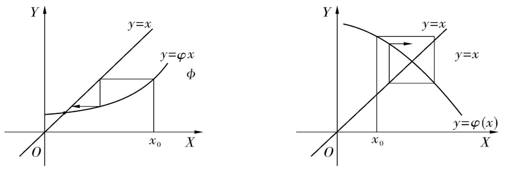
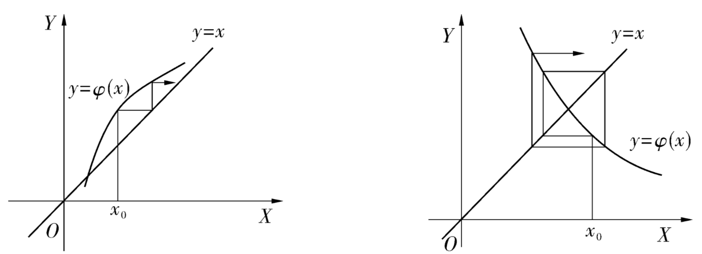
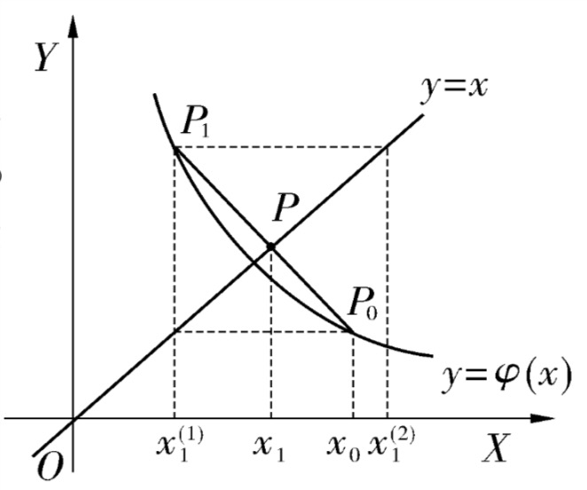
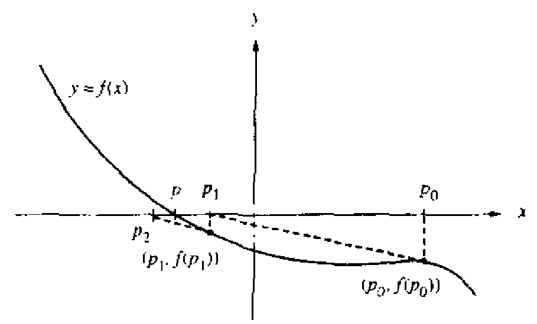

# 7 非线性方程和非线性方程组的数值解

<!-- page: 1 -->

7 非线性方程和非线性方程组
的数值解
Solutions of Nonlinear Equations and

System of Linear Equations

何军辉
hejh@scut.edu.cn

计算机科学与工程学院
School of Computer Science & Engineering

<!-- page: 2 -->

背景

o 求方程𝑓𝑥= 0的根是最常见的数学问题之一

n 当𝑓(𝑥)是一次多项式时，称𝑓𝑥= 0为线性方程
n 否则称之为非线性方程.

o 当𝑓𝑥= 0是非线性方程时，由于𝑓(𝑥)的多样

性，求方程𝑓𝑥= 0的根尚无一般的解析解法
可用

n 在满足一定的精度要求下，求出方程的近似根

o 可根据物理背景或者𝑦= 𝑓(𝑥)的草图等方法确

定求根区间[𝑎, 𝑏]或给出某根的近似值𝑥!

计算机科学与工程学院
School of Computer Science & Engineering

<!-- page: 3 -->

7.1 对分法

o 对分法适用于求有根区间的单实根或奇重实根

n 设𝑓(𝑥)在[𝑎, 𝑏]上连续，𝑓𝑎⋅𝑓𝑏< 0，即

𝑓𝑎> 0, 𝑓𝑏< 0或者𝑓𝑎< 0, 𝑓𝑏> 0，则
根据连续函数的介值定理，在(𝑎, 𝑏)内至少存在
一点𝜉，使𝑓𝜉= 0.

o 对分法：

"#$

n 首先取区间[𝑎, 𝑏]的中点𝑥! =

% ，把区间[𝑎, 𝑏]
分为两个小区间𝑎, 𝑥! , [𝑥!, 𝑏]
o 如果𝑓𝑎⋅𝑓𝑥! < 0，令𝑎! = 𝑎, 𝑏! = 𝑥!
o 如果𝑓𝑥! ⋅𝑓𝑏< 0，令𝑎! = 𝑥!, 𝑏! = 𝑏
n 重复此过程，得到长度每次减半的有根区间序列

[𝑎&, 𝑏&]

计算机科学与工程学院
School of Computer Science & Engineering

<!-- page: 4 -->

7.1 对分法

o 收敛性分析

n 当𝑘足够大时，有根区间[𝑎&, 𝑏&]长度趋于零，区

间任一点都可以作为根的近似值.

𝑥& −𝜉≤1

2 𝑏& −𝑎& = 1
2% 𝑏&'! −𝑑&'! = ⋯

=
1
2&#! (𝑏−𝑎)

o 当𝑘→∞时，𝑥"收敛于𝜉
n 对分法的收敛速度较慢，常用来试探实根的分布

区间或者求根的初始近似值.

o 对分法的收敛速度与公比为!

#的等比级数相同

o 大约每对分10次，近似根精度可提高三位小数位

计算机科学与工程学院
School of Computer Science & Engineering

<!-- page: 5 -->

7.1 对分法

例：求𝑥" −3𝑥+ 1 = 0的实根分布情况，并求[0,1]
中的实根近似值.  要求实根近似值精确到三位小数.

6

4

2

0

-2

-4

-4
-3
-2
-1
0
1
2
3
4
-6

计算机科学与工程学院
School of Computer Science & Engineering

<!-- page: 6 -->

7.1 对分法

o 对分法的优点

1. 对函数的要求低（只要求𝑓(𝑥)连续），方法简
单、可靠，程序设计容易

2. 可事先估计计算次数

𝑥& −𝜉≤
1
2&#! 𝑏−𝑎< 𝜖⟹𝑘>?

o 缺点是收敛速度较慢，不能求出偶重根

n 𝑓(𝑥)在偶重根两边附近函数值同号

计算机科学与工程学院
School of Computer Science & Engineering

<!-- page: 7 -->

7.1 对分法

o 对分法算法

①给出精度δ, 𝜖令𝑎( = 𝑎, 𝑏( = 𝑏, 𝑘= 0
②令𝑥& = (𝑎& + 𝑏&)/2,计算𝑓𝑥&
③若𝑓𝑥&
< 𝛿,则𝑥&是𝑓𝑥= 0的根，停止计算
，输出结果𝜉= 𝑥&
       若𝑓𝑎& ⋅𝑓𝑥& < 0,则令𝑎&#! = 𝑎&, 𝑏&#! = 𝑥&;
       否则令𝑎&#! = 𝑥&, 𝑏&#! = 𝑏&
④若𝑏&#! −𝑎&#! ≤𝜖,退出计算，输出结果𝜉=

(𝑎&#! + 𝑏&#!)/2;反之，令𝑘= 𝑘+ 1，返回②

计算机科学与工程学院
School of Computer Science & Engineering

<!-- page: 8 -->

7.2 迭代法

o 给定方程𝑓𝑥= 0，可用多种方法构造等价方

程𝑥= 𝜑(𝑥)，取定根的一个近似值𝑥!，构造序
列

𝑥&#! = 𝜑𝑥&
𝑘= 0,1,2, ⋯

1. 若𝑥# 收敛，即lim
#→% 𝑥# = 𝑥∗，并且𝜑(𝑥)连续，

则有：

lim
&→* 𝑥&#! = lim

&→* 𝜑𝑥& = 𝜑
lim
&→* 𝑥&

即𝑥& 的极限𝑥∗是方程𝑥= 𝜑𝑥的根，也就是方程
𝑓𝑥= 0的根.

2. 若𝑥# 发散，迭代法失败.

计算机科学与工程学院
School of Computer Science & Engineering

<!-- page: 9 -->

7.2 迭代法

例：求𝑥" −3𝑥+ 1 = 0在0.5附近的根.要求精确到
第四位小数.

1. 构造等价方程𝑥= 𝜑! 𝑥= ,!#!
- ，迭代公式𝑥&#! =

!#!

,"

-
, 𝑘= 0,1,2, ⋯，取𝑥( = 0.5

!#!

2. 迭代公式𝑥&#! =
,"

- 不能求出方程在1.5和−2附近
的根

3. 其他的等价方程构造的迭代公式

𝑥&#! = 𝜑% 𝑥& =
1
3 −𝑥&
% (𝑘= 0,1,2, ⋯)

𝑥&#! = 𝜑- 𝑥& = ! 3𝑥& −1 (𝑘= 0,1,2, ⋯

计算机科学与工程学院
School of Computer Science & Engineering

<!-- page: 10 -->

7.2 迭代法

o 迭代法的几何意义

n 将𝑥= 𝜑(𝑥)写成

F 𝑦= 𝑥

𝑦= 𝜑(𝑥)

则求解方程𝑥= 𝜑(𝑥)等价于求直线𝑦= 𝑥和曲线𝑦=
𝜑(𝑥)的交点的横坐标𝑥∗

计算机科学与工程学院
School of Computer Science & Engineering

<!-- page: 11 -->

7.2 迭代法

o 迭代法的几何意义

计算机科学与工程学院
School of Computer Science & Engineering

<!-- page: 12 -->

7.2 迭代法

o 迭代法收敛条件

定义：如果在根𝑥∗的某个邻域𝑹: 𝑥−𝑥∗≤𝛿中，
对任意的𝑥( ∈𝑹，迭代公式𝑥&#! = 𝜑𝑥& , 𝑘=
0,1,2 ⋯收敛，则称迭代在𝑥∗附近局部收敛.

定理：设𝑥∗= 𝜑(𝑥∗)，𝜑′(𝑥)在𝑥∗的某个邻域𝑹内连
续，并且𝜑. 𝑥
≤𝑞, 𝑞< 1是常量，则

1. 对任意𝑥( ∈𝑹，由迭代公式𝑥&#! = 𝜑𝑥& 决定的
序列𝑥& 收敛于𝑥∗

2.
𝑥& −𝑥∗≤/"

!'/ 𝑥! −𝑥(

!
!'/ 𝑥&#! −𝑥&

3.
𝑥& −𝑥∗≤

计算机科学与工程学院
School of Computer Science & Engineering

<!-- page: 13 -->

7.2 迭代法

定理：给定方程𝑥= 𝜑(𝑥)，若𝜑(𝑥)满足：

①对任意的𝑥∈[𝑎, 𝑏]，有𝜑𝑥∈𝐶[𝑎, 𝑏]

②对任意的𝑥, 𝑦∈[𝑎, 𝑏]，有𝜑𝑥−𝜑𝑦
≤
𝑞𝑥−𝑦，0 ≤𝑞< 1为常数，则对任意的𝑥! ∈
[𝑎, 𝑏]，迭代公式𝑥#'( = 𝜑𝑥# 生成的序列𝑥#
收敛于𝑥= 𝜑(𝑥)的根𝑥∗.

注：满足条件①②的函数𝜑(𝑥)称为区间的压缩映
射.

计算机科学与工程学院
School of Computer Science & Engineering

<!-- page: 14 -->

7.2 迭代法

例：方程𝑥" −3𝑥+ 1 = 0，三种迭代公式

- + 1

𝑥&#! = 𝜑! 𝑥& = 𝑥&

3

𝑥&#! = 𝜑% 𝑥& =
1
3 −𝑥&
%

𝑥&#! = 𝜑- 𝑥& = ! 3𝑥& −1

在三个根附近的收敛情况，三个根近似取𝑥! =
0.347, 𝑥% = 1.53, 𝑥- = −1.88

计算机科学与工程学院
School of Computer Science & Engineering

<!-- page: 15 -->

7.2 迭代法

o 迭代法的加速

n 由𝑓𝑥= 0构造出的迭代公式𝑥= 𝜑(𝑥)收敛时，

收敛速度取决于𝜑′(𝑥) 的大小，当|𝜑. 𝑥| 接近
与1时，收敛可能很慢.

n 松弛法：已知𝜑(𝑥&)与𝑥&同是𝑥∗的近似值，两个

近似值的加权平均

𝑥&#! = 1 −𝜔& 𝑥& + 𝜔&𝜑𝑥&
𝑥= 1 −𝜔𝑥+ 𝜔𝜑𝑥= 𝜙𝑥

n 令𝜙. 𝑥= 1 −𝜔+ 𝜔𝜑. 𝑥= 0，当𝜑. 𝑥≠1时,

得到

𝜔=
1
1 −𝜑. 𝑥

计算机科学与工程学院
School of Computer Science & Engineering

<!-- page: 16 -->

7.2 迭代法

)*! +"
()*! +" 可望获得较

(

o 取𝜔# =

()*! +" , 1 −𝜔# =

好的加速效果.

o 松弛法迭代公式

=
𝜔# =
1
1 −𝜑, 𝑥#
𝑥#'( = 1 −𝜔# 𝑥# + 𝜔#𝜑(𝑥#)

计算机科学与工程学院
School of Computer Science & Engineering

<!-- page: 17 -->

7.2 迭代法

o 埃特金Aitken方法

n 松弛法要计算导数𝜑. 𝑥& ，使用中有时不方便
n 设方程𝑥= 𝜑𝑥, 𝑥∗是它的准确解，𝑥(是近似根

，取𝑥! = 𝜑𝑥( , 𝑥% = 𝜑𝑥!
𝑥∗= 𝑥% + 𝑥∗−𝑥% = 𝑥% + 𝜑′(𝜉)((𝑥∗−𝑥!)

用差商

𝑥# −𝑥!
𝑥! −𝑥$

= 𝜑𝑥! −𝜑𝑥$

𝑥! −𝑥$
代替𝜑′(𝜉)，得到

𝑥∗≈𝑥# + 𝑥# −𝑥!

𝑥∗−𝑥!

𝑥! −𝑥$

计算机科学与工程学院
School of Computer Science & Engineering

<!-- page: 18 -->

7.2 迭代法

𝑥∗≈𝑥% −
𝑥% −𝑥! %

𝑥% −2𝑥! + 𝑥(
n 埃特金迭代公式

! = 𝜑(𝑥&)

𝑥&

% = 𝜑(𝑥&

! )

𝑥&

!
%

% −𝑥&

𝑥&

% −

𝑥&#! = 𝑥&

(𝑘= 0,1, ⋯)

% −2𝑥&

! + 𝑥&

𝑥&

计算机科学与工程学院
School of Computer Science & Engineering

<!-- page: 19 -->

7.2 迭代法

o 埃特金迭代的几何解释

计算机科学与工程学院
School of Computer Science & Engineering

<!-- page: 20 -->

7.2 迭代法

#'(

例：解方程𝑥" −3𝑥+ 1 = 0，迭代公式𝑥#'( =

+"

"
，用松弛法和埃特金法，取𝑥! = 0.5，精确到6位
小数.

+#'(

"
, 𝜑, 𝑥= 𝑥-, 𝜔# =

(

松弛法：𝜑𝑥=

$

()+"

" + 1

𝑥#

𝑥#'( = 1 −𝜔# 𝑥# + 𝜔#

3

计算机科学与工程学院
School of Computer Science & Engineering

<!-- page: 21 -->

7.2 迭代法

#'(

例：解方程𝑥" −3𝑥+ 1 = 0，迭代公式𝑥#'( =

+"

"
，用松弛法和埃特金法，取𝑥! = 0.5，精确到6位
小数.

埃特金迭代：

& + 1

! = 𝑥"

𝑥"

3

!
&

𝑥"

+ 1

# =

𝑥"

3

!
#

# −𝑥"

𝑥"

# −

𝑥"'! = 𝑥"

(𝑘= 0,1,2, ⋯)

# −2𝑥"

! + 𝑥"

𝑥"

计算机科学与工程学院
School of Computer Science & Engineering

<!-- page: 22 -->

7.3 牛顿法

o 牛顿公式

n 由于𝑓𝑥= 0是非线性方程，一般解决非线性问

题较困难，而解决线性问题较容易,可以考虑将
非线性问题线性化，采取线性化方法求解.

n 将𝑓(𝑥)在𝑥(处泰勒展开

𝑓𝑥= 𝑓𝑥( + 𝑓. 𝑥(
𝑥−𝑥( + 𝑓.. 𝜉

2!
𝑥−𝑥(

n 用𝑝𝑥= 𝑓𝑥( + 𝑓. 𝑥(
𝑥−𝑥( = 0来近似
𝑓𝑥= 0，即把求曲线𝑓𝑥= 0与𝑋轴交点的横
坐标近似为求直线𝑝𝑥= 0与𝑋轴交点的横坐标.

𝑝𝑥= 𝑓𝑥( + 𝑓. 𝑥(
𝑥−𝑥( = 0 ⟹

𝑥= 𝑥( −𝑓𝑥(

, (设𝑓. 𝑥( ≠0)

𝑓. 𝑥(

计算机科学与工程学院
School of Computer Science & Engineering

<!-- page: 23 -->

7.3 牛顿法

n 牛顿法实质是一般迭代法用松弛法加速

𝑓𝑥= 0 ⟺𝑥= 𝑥+ 𝑓𝑥= 𝜑(𝑥)

o 使用松弛法

𝜑. 𝑥= 1 + 𝑓. 𝑥

𝜔& =
1
1 −𝜑. 𝑥&
= −
1
𝑓. 𝑥&
o 即得牛顿法公式

𝑥"'! = 𝑥" −𝑓𝑥"

𝑓( 𝑥"
n 几何意义

计算机科学与工程学院
School of Computer Science & Engineering

<!-- page: 24 -->

7.3 牛顿法

n 牛顿法公式

𝑥! = 𝑥( −𝑓𝑥(

𝑓. 𝑥(
⋮

𝑥&#! = 𝑥& −𝑓𝑥&

, (𝑘= 0,1,2, ⋯)

𝑓. 𝑥&

例：用牛顿法计算𝑥" −3𝑥+ 1 = 0在0.5和−2附近
的两个根.

" −3𝑥# + 1

𝑥#'( = 𝑥# −𝑥#

3𝑥#
- −3

计算机科学与工程学院
School of Computer Science & Engineering

<!-- page: 25 -->

7.3 牛顿法

o 牛顿法的收敛速度

定义：设序列𝑥& 收敛于𝑥∗，令𝜖& = 𝑥∗−𝑥&，设
𝑘→∞时，有

𝜖&#!

𝜖& 0 →𝑐(𝑐> 0为常数)

则称序列𝑥& 是𝑝阶收敛.

o 当𝑝= 1时，称为线性收敛
o 当𝑝= 2时，称为二阶收敛（几何收敛）
o 当1< 𝑝< 2时，称为超线性收敛

计算机科学与工程学院
School of Computer Science & Engineering

<!-- page: 26 -->

7.3 牛顿法

定理：设𝑥∗= 𝜑𝑥∗，在𝑥∗的某个邻域𝑹内𝜑. (𝑥)
连续，𝑝> 1是常量，并且满足

𝜑/ 𝑥∗= 0
𝑙= 1,2, ⋯, 𝑝−1
𝜑. 𝑥∗≠0

则由𝑥#'( = 𝜑(𝑥#)生成的序列𝑥# 收敛于𝑥∗，并且
序列𝑥# 是𝑝阶收敛.

计算机科学与工程学院
School of Computer Science & Engineering

<!-- page: 27 -->

7.3 牛顿法

n 牛顿法的收敛速度

𝑓( 𝑥= 𝜑𝑥，𝜑( 𝑥= 𝑓𝑥𝑓(( 𝑥

𝑥= 𝑥−𝑓𝑥

𝑓( 𝑥
#

o 当𝑓( 𝑥∗≠0时，𝜑( 𝑥∗= 0，即牛顿法在单根附

近 至少二阶收敛，而在重根附近，牛顿法是线性
收敛.
n 牛顿法的优点：收敛快，算法简单，是常用的快

速收敛法

n 缺点：对重根收敛较慢，对初值𝑥(要求较严，要

求𝑥(相当接近真实解𝑥∗

n 在实际应用中，常与其他方法联用，现用其他方

法确定初值𝑥(，再用牛顿法提高精度.

计算机科学与工程学院
School of Computer Science & Engineering

<!-- page: 28 -->

7.4 割线法

o 已知𝑓𝑥= 0的两个近似根𝑥#, 𝑥#)(，过点

𝑥#)(, 𝑓𝑥#)(
, (𝑥#, 𝑓𝑥# )连一条直线，据两点
式可写出直线方程

𝑦−𝑓𝑥"

= 𝑓𝑥" −𝑓𝑥")!

𝑥" −𝑥")!
o 把求曲线𝑓𝑥= 0与𝑋轴交点的横坐标近似为求

𝑥−𝑥"

割线与𝑋轴交点的横坐标，即将割线与𝑋轴交点
的横坐标作为𝑥∗的近似值

𝑥"'! = 𝑥" −
𝑓𝑥"
𝑓𝑥" −𝑓𝑥")!

𝑥" −𝑥")! (𝑘= 1,2, ⋯)

称为割线法

计算机科学与工程学院
School of Computer Science & Engineering

<!-- page: 29 -->

7.4 割线法

o 割线法需要两个初值𝑥!, 𝑥(，在单根附近是超线

性收敛.
n 通过较复杂的推导可知收敛阶𝑝在单根附近为

1.618 ⋯
n 收敛较快，而且不用计算导数值

定理：如𝑓(𝑥)在零点𝑥∗附近有连续的2阶导数，
𝑓, 𝑥∗≠0，且初值𝑥!, 𝑥(充分接近𝑥∗，则割线法收
敛，收敛速度为

𝑥#'( −𝑥∗≈𝑓,, 𝑥∗

!.1(2

𝑥# −𝑥∗(.1(2

2𝑓, 𝑥∗

计算机科学与工程学院
School of Computer Science & Engineering

<!-- page: 30 -->

7.4 割线法

o 割线法需要两个初值𝑥!, 𝑥(，也称为双点割线法.

n 单点割线法.

𝑥&#! = 𝑥& −
𝑓𝑥&
𝑓𝑥& −𝑓𝑥(

𝑥& −𝑥( (𝑘= 1,2, ⋯)

o 例：用双点割线法求𝑥" −3𝑥+ 1 = 0在0.5附近

的根，精确到小数点后第六位.

计算机科学与工程学院
School of Computer Science & Engineering

<!-- page: 31 -->

7.5 解非线性方程组的迭代法和牛顿法

o 解一元非线性方程的迭代法和牛顿法可以推广

到多元 .

o 𝑛个未知数𝑛个方程的非线性方程组可表示为

𝑓! 𝑥!, 𝑥%, ⋯, 𝑥1 = 0
𝑓% 𝑥!, 𝑥%, ⋯, 𝑥1 = 0

⋮
𝑓1 𝑥!, 𝑥%, ⋯, 𝑥1 = 0

其中𝑿= 𝑥!, 𝑥%, ⋯, 𝑥1 2为𝑛维列向量；𝑓3 𝑿(𝑖=
1,2, ⋯, 𝑛)中至少有一个是𝑿的非线性函数，并假设
自变量和函数值都是实数.

计算机科学与工程学院
School of Computer Science & Engineering

<!-- page: 32 -->

7.5 解非线性方程组的迭代法和牛顿法

o 迭代法

n 记𝐹𝑿= 𝑓! 𝑿, 𝑓# 𝑿, ⋯, 𝑓* 𝑿
+，则方程组可以
简写为

𝐹𝑿= 𝟎

n 将𝐹𝑿= 𝟎转换成等价方程组

𝑿= Φ 𝑿

其中 Φ 𝑿= 𝜑! 𝑿, 𝜑# 𝑿, ⋯, 𝜑*(𝑿) +

n 构造迭代公式

𝑿"'! = Φ 𝑿"
𝑘= 0,1,2, ⋯

n 对于给定的初始点𝑿$ ，若由此生成的序列收敛，

"→-𝑿" = 𝑿∗，则𝑿∗是方程组𝐹𝑿= 𝟎的解

即lim

计算机科学与工程学院
School of Computer Science & Engineering

<!-- page: 33 -->

7.5 解非线性方程组的迭代法和牛顿法

例：设有非线性方程组

% + 8 = 0
𝑥!𝑥%

% −10𝑥! + 𝑥%

a 𝑥!

% + 𝑥! −10𝑥% + 8 = 0

迭代公式：

"
= 1

"
#

"
#

"'! = 𝜑! 𝑥!

" , 𝑥#

𝑥!

10
𝑥!

+ 𝑥#

+ 8

"
= 1

"
#

"'! = 𝜑# 𝑥!

" , 𝑥#

" + 8

20 𝑥!
"
𝑥#

𝑥#

+ 𝑥!

计算机科学与工程学院
School of Computer Science & Engineering

<!-- page: 34 -->

7.5 解非线性方程组的迭代法和牛顿法

o 牛顿法

*
⊂𝑹1收敛到𝑿∗，若有常数
𝑝≥1和𝑐> 0，使得

定义：设序列𝑿&

&4(

𝑿&#! −𝑿∗

lim
&→*

𝑿& −𝑿∗𝒑= 𝑐

则称𝑝为该序列的收敛阶.

o 当𝑝= 1时称为线性收敛
o 当𝑝> 1时称为超线性收敛
o 当𝑝= 2时称为二次收敛或平方收敛

计算机科学与工程学院
School of Computer Science & Engineering

<!-- page: 35 -->

7.5 解非线性方程组的迭代法和牛顿法

o 牛顿法

n 设𝑿∗是方程组𝐹𝑿= 𝟎的解，𝑿& 是某个值，用

点𝑿& 处的一阶泰勒展开近似每一个分量函数量
𝑓3 𝑿∗= 0，有

* 𝜕𝑓. 𝑿"

"
(𝑖

∗−𝑥/

0 = 𝑓. 𝑿∗≈𝑓. 𝑿"
+ D

𝑥/

𝜕𝑥/

/0!

= 1, ⋯, 𝑛)
n 矩阵和向量形式

0 = 𝐹𝑿∗≈𝐹𝑿"
+ 𝐹( 𝑿"
𝑿∗−𝑿"

计算机科学与工程学院
School of Computer Science & Engineering

<!-- page: 36 -->

7.5 解非线性方程组的迭代法和牛顿法

n 导数𝐹. 𝑿是函数𝐹𝑿的Jacobi矩阵

𝛻𝑓! 𝑿2

𝛻𝑓% 𝑿2

𝐹. 𝑿=

⋮
𝛻𝑓1 𝑿2

𝜕𝑓! 𝑿

𝜕𝑓! 𝑿

⋯
𝜕𝑓! 𝑿

𝜕𝑥1

𝜕𝑥%
𝜕𝑓% 𝑿

𝜕𝑥!

𝜕𝑓% 𝑿

⋯
𝜕𝑓% 𝑿

=

𝜕𝑥1
⋮
⋮
𝜕𝑓1 𝑿

𝜕𝑥!

𝜕𝑥%

⋮

𝜕𝑓1 𝑿

⋯
𝜕𝑓1 𝑿

𝜕𝑥!

𝜕𝑥%

𝜕𝑥1

计算机科学与工程学院
School of Computer Science & Engineering

<!-- page: 37 -->

7.5 解非线性方程组的迭代法和牛顿法

o 如果矩阵𝐹, 𝑿#
非奇异，则
0 = 𝐹𝑿∗≈𝐹𝑿#
+ 𝐹, 𝑿#
𝑿∗−𝑿#

𝑿#'( = 𝑿# −𝐹, 𝑿#
)𝟏𝐹𝑿#

其中𝑘= 0,1, ⋯, 𝑿! 是给定的初始值.

n 牛顿法的迭代函数

Φ 𝑿= 𝑿−𝐹. 𝑿'!𝐹𝑿

计算机科学与工程学院
School of Computer Science & Engineering

<!-- page: 38 -->

7.5 解非线性方程组的迭代法和牛顿法

例：牛顿法求解方程组

- + 8 = 0
𝑥(𝑥-

- −10𝑥( + 𝑥-

K 𝑥(

- + 𝑥( −10𝑥- + 8 = 0

- + 8
𝑥(𝑥-

- −10𝑥( + 𝑥-

1. 𝐹𝑿=
𝑥(

- + 𝑥( −10𝑥- + 8

2. 𝐹, 𝑿= 2𝑥( −10
2𝑥-
𝑥-

- + 1
2𝑥(𝑥- −10

3. 取初始值 𝑿! = 0,0,
4

计算机科学与工程学院
School of Computer Science & Engineering

<!-- page: 39 -->

计算机科学与工程学院
School of Computer Science & Engineering

