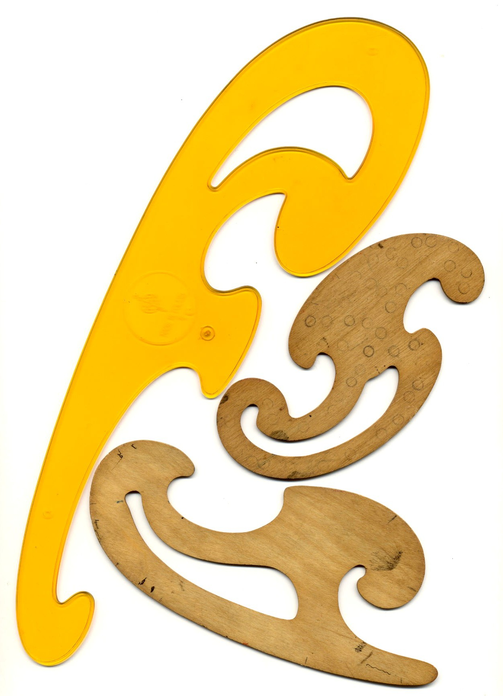

# Cubic Spline

<!-- page: 1 -->

.

Numerical Methods

Curve Fitting – Cubic Spline

.

何军辉

School of Computer Science and Engineering

South China University of Technology

....... ..... ................ ................ ................ ... .... . ... ........ .

<!-- page: 2 -->

Piecewise Cubic Splines

Numerical

Methods

It it is very important to ensure the smoothness up to
order 2 for interpolation needed in CAD/CAM, computer
graphic, and robot path/trajectory planning. 平滑

.

.

何军辉

Cubic Spline

Introduction

Definition

To constructing cubic functions S(x) 三次
函数on each interval [xk, xk+1] so that the
resulting piecewise curve y = S(x) and its
first and second derivatives are all
continuous on the larger interval [x0, xN].

Existence

Boundary
Conditions

Construction

Clamped Spline

Natural Spline

Extrapolated Spline

Parabolically
Terminated Spline

Endpoints
Curvature-Adjusted
Spline

.1 The continuity of S′(x) means that the

Examples

graph y = S(x) will not have sharp
corners. 无急弯
.2 The continuity of S′′(x) means that the

csfit.m

Suitability

radius of curvature is defined at each
point. 曲率不畸变

2

.

.

.

.

.

.

.

.

.

.

.

.

.

.

.

.

.

.

.

.

...

...

...

...

...

...

...

...

...

...

...

...

...

...

...

...

...

...

...

...

<!-- page: 3 -->

Cubic Spline Interpolation

Numerical

分段三次样条曲线：
.Definition
.

Methods

.

.

何军辉

Cubic Spline

Suppose that {(xk, yk)}N

k=0 are N + 1 points, where
a = x0 < x1 < · · · < xN = b. The function S(x) is called a
cubic spline if there exist N cubic polynomials Sk(x) with
coefficients sk,0, sk,1, sk,2 and sk,3 that satisfy the properties:

Introduction

Definition

Existence

Boundary
Conditions

Construction

.

Clamped Spline

Natural Spline

Extrapolated Spline

.1 S(x) = Sk(x) = sk,0+sk,1(x−xk)+sk,2(x−xk)2+sk,3(x−xk)3

Parabolically
Terminated Spline

Endpoints
Curvature-Adjusted
Spline

for x ∈[xk, xk+1] and k = 0, 1, · · · , N −1.
.2 S(xk) = yk 通过节点
for k = 0, 1, · · · · · · , N.
.3 Sk(xk+1) = sk+1(xk+1) 节点相连
for k = 0, 1, · · · , N −2
.4 S′k(xk+1) = s′k+1(xk+1)
for k = 0, 1, · · · , N −2
.5 S′′k(xk+1) = s′′k+1(xk+1)
for k = 0, 1, · · · , N −2

Examples

csfit.m

Suitability

3

.

.

.

.

.

.

.

.

.

.

.

.

.

.

.

.

.

.

.

.

...

...

...

...

...

...

...

...

...

...

...

...

...

...

...

...

...

...

...

...

<!-- page: 4 -->

Existence of Cubic Splines

Numerical

存在性：
Is it possible to construct a cubic spline that satisfies all
of the five properties?

Methods

.

.

何军辉

Cubic Spline

Introduction

Each cubic polynomial Sk(x) has four unknown constants
sk,0, sk,1, sk,2 and sk,3; hence there are 4N coefficients to be
determined.
.

Definition

Existence

Boundary
Conditions

Construction

Clamped Spline

Natural Spline

The data point supply (N + 1) conditions (Property 2).

Extrapolated Spline

Parabolically
Terminated Spline

Properties 3 ∼5 each supply (N −1) conditions.

Endpoints
Curvature-Adjusted
Spline

N + 1 + 3 × (N −1) = 4N −2 conditions are specified.

Examples

.

csfit.m

Suitability

Two additional conditions necessary for the cubic spline to be
solvable come from the boundary conditions for the first/second
order derivatives at the end points (x0, y0) and (xN, yN).

4

.

.

.

.

.

.

.

.

.

.

.

.

.

.

.

.

.

.

.

.

...

...

...

...

...

...

...

...

...

...

...

...

...

...

...

...

...

...

...

...

<!-- page: 5 -->

Boundary Conditions

Numerical

Five strategies 五种端点约束条件:
.

Methods

.

.

何军辉

.1 Clamped cubic spline 紧压样条: specify S′(x0),S′(xn) (the “best

Cubic Spline

choice” if the derivatives are known).

Introduction

Definition

.2 Natural cubic spline (a “relaxed curve”) 自然样条

Existence

Boundary
Conditions

.3 Extrapolate S′′(x) to the endpoints 外推样条

Construction

Clamped Spline

Natural Spline

.4 S′′(x) is constant near endpoints 抛物线终结样条

Extrapolated Spline

Parabolically
Terminated Spline

.5 Specify S′′(X) at each endpoint 端点曲率调整样条

.

Endpoints
Curvature-Adjusted
Spline

Examples

4N −2 property condtions and 2 endpoint constraints can
be used to construct a cubic spline with distinctive
properties at the endpoints.

csfit.m

Suitability

How to construct 怎样构建

5

.

.

.

.

.

.

.

.

.

.

.

.

.

.

.

.

.

.

.

.

...

...

...

...

...

...

...

...

...

...

...

...

...

...

...

...

...

...

...

...

<!-- page: 6 -->

Construction of Cubic Splines

Numerical

Methods

.

.

何军辉

Since S(x) is piecewise cubic, its second derivative S′′(x) is
piecewise linear on [x0, xN]. 二阶导数分段线性

Cubic Spline

Introduction

Definition

Existence

k(x) = S′′(xk) x −xk+1

+ S′′(xk+1)
x −xk
xk+1 −xk

Boundary
Conditions

S′′

xk −xk+1

Construction

Clamped Spline

Natural Spline

Extrapolated Spline

Let mk = S′′(xk), mk+1 = S′′(xk+1) and hk = xk+1 −xk

Parabolically
Terminated Spline

Endpoints
Curvature-Adjusted
Spline

k(x) = mk

(xk+1 −x) + mk+1

S′′

(x −xk)

Examples

hk

hk

csfit.m

Suitability

where xk ≤x ≤xk+1, k = 0, 1, · · · , N −1

6

.

.

.

.

.

.

.

.

.

.

.

.

.

.

.

.

.

.

.

.

...

...

...

...

...

...

...

...

...

...

...

...

...

...

...

...

...

...

...

...

<!-- page: 7 -->

Construction of Cubic Splines

Numerical

积分两次，引入两个积分常数：

Methods

.

.

何军辉

Sk(x) = mk

6hk
(xk+1 −x)3 + mk+1

6hk
(x −xk)3

Cubic Spline

Introduction

Definition

+ pk(xk+1 −x) + qk(x −xk)

Existence

Boundary
Conditions

{

{

yk
= mk

Construction

6 h2
k + pkhk
yk+1
= mk+1

yk
= Sk(xk)
yk+1
= Sk(xk+1) =⇒

Clamped Spline

Natural Spline

6
h2

k + qkhk

Extrapolated Spline

Parabolically
Terminated Spline

Endpoints
Curvature-Adjusted
Spline

Sk(x) = mk

6hk
(xk+1 −x)3 + mk+1

6hk
(x −xk)3

Examples

csfit.m

Suitability

+ (yk

−mkhk

6
)(xk+1 −x) + (yk+1

−mk+1hk

6
)(x −xk)

hk

hk

7

.

.

.

.

.

.

.

.

.

.

.

.

.

.

.

.

.

.

.

.

...

...

...

...

...

...

...

...

...

...

...

...

...

...

...

...

...

...

...

...

<!-- page: 8 -->

Construction of Cubic Splines

Numerical

求一阶导数：

Methods

.

.

k(x) = −mk

2hk
(xk+1 −x)2 + mk+1

何军辉

S′

2hk
(x −xk)2

Cubic Spline

−(yk

−mkhk

6
) + (yk+1

−mk+1hk

Introduction

6
)

Definition

hk

hk

Existence

Boundary
Conditions

Let dk = yk+1−yk

Construction

hk
, we obtain

Clamped Spline

Natural Spline

k(xk) = −mk

3 hk −mk+1
6
hk + dk

Extrapolated Spline

S′

Parabolically
Terminated Spline

Endpoints
Curvature-Adjusted
Spline

k−1(xk) = mk

3 hk−1 + mk−1
6
hk−1 + dk−1

S′

Examples

csfit.m

Suitability

hk−1mk−1 + 2(hk−1 + hk)mk + hkmk+1 = uk
where uk = 6(dk −dk−1) and k = 1, . . . , N −1

8

.

.

.

.

.

.

.

.

.

.

.

.

.

.

.

.

.

.

.

.

...

...

...

...

...

...

...

...

...

...

...

...

...

...

...

...

...

...

...

...

<!-- page: 9 -->

Construction of Cubic Splines

Numerical

二阶导数参数方程组：

Methods

.

.

.1 k = 1, if m0 is known, then

何军辉

Cubic Spline

2(h0 + h1)m1 + h1m2 = u1 −h0m0

Introduction

Definition

Existence

.2 k = N −1, if mN is known, then

Boundary
Conditions

Construction

Clamped Spline

hN−2mN−2 + 2(hN−2 + hN−1)mN−1 = uN−1 −hN−1mN

Natural Spline

Extrapolated Spline

Parabolically
Terminated Spline

.3 k = 2, 3, . . . , N −2, then

Endpoints
Curvature-Adjusted
Spline

Examples

hk−1mk−1 + 2(hk−1 + hk)mk + hkmk+1 = uk

csfit.m

Suitability













2(h0 + h1)
h1
0
h1
2(h1 + h2)
h2
...
0
hN−2
2(hN−2 + hN−1)

m1
m2

u1 −h0m0





































u2

=

...
mN−1

...
uN−1 −hN−1mN

9

.

.

.

.

.

.

.

.

.

.

.

.

.

.

.

.

.

.

.

.

...

...

...

...

...

...

...

...

...

...

...

...

...

...

...

...

...

...

...

...

<!-- page: 10 -->

Construction of Cubic Splines

Numerical

Methods

.

.

.

何军辉

hk = xk+1 −xk,
dk = yk+1 −yk

,
uk = 6(dk −dk−1)

Cubic Spline

hk

.

Introduction

Definition

Existence

Sk(x) = sk,0 + sk,1(x −xk) + sk,2(x −xk)2 + sk,3(x −xk)3

Boundary
Conditions

Construction

Clamped Spline

Natural Spline

sk,0 = Sk(xk) = yk

Extrapolated Spline

Parabolically
Terminated Spline

k(xk) = −mk

3 hk −mk+1
6
hk + dk

sk,1 = S′

Endpoints
Curvature-Adjusted
Spline

2S′′
k(xk) = mk

sk,2 = 1

Examples

csfit.m

2

Suitability

6S(3)
k (xk) = mk+1 −mk

sk,3 = 1

6hk

10

.

.

.

.

.

.

.

.

.

.

.

.

.

.

.

.

.

.

.

.

...

...

...

...

...

...

...

...

...

...

...

...

...

...

...

...

...

...

...

...

<!-- page: 11 -->

Clamped Spline

Numerical

Methods

Specify S′(x0) and S′(xN) 紧压样条
.

.

.

何军辉

(d0 −S′(x0)) −m1

m0 = 3

Cubic Spline

h0

2

Introduction

Definition

(S′(xN) −dN−1) −mN−1

mN =
3
hN−1

Existence

Boundary
Conditions

2

.

Construction

Clamped Spline

.

Natural Spline

Extrapolated Spline











3
2 h0 + 2h1
h1
0
h1
2(h1 + h2)
h2
...
0
hN−2
2hN−2 + 3
2 hN−1

u1 −3(d0 −S′(x

m1
m2

Parabolically
Terminated Spline































u2

Endpoints
Curvature-Adjusted
Spline

...
mN−1

=

...
uN−1 −3(S′(xN) −

Examples

.

csfit.m

Suitability

.

.
This spline would be useful to a draftsman for drawing a
smooth curve through several points.

11

.

.

.

.

.

.

.

.

.

.

.

.

.

.

.

.

.

.

.

.

...

...

...

...

...

...

...

...

...

...

...

...

...

...

...

...

...

...

...

...

<!-- page: 12 -->

Natural Spline

Numerical

Methods

Boundary conditions: S′′(x0) = 0 and S′′(xN) = 0 自然样条
.

.

.

何军辉

Cubic Spline

m0 = 0,
mN = 0

Introduction

Definition

.

Existence

Boundary
Conditions

.

Construction

Clamped Spline













2(h0 + h1)
h1
0
h1
2(h1 + h2)
h2
...
0
hN−2
2(hN−2 + hN−1)

m1
m2

u1
u2

Natural Spline





































Extrapolated Spline

...
mN−1

=

...
uN−1

Parabolically
Terminated Spline

Endpoints
Curvature-Adjusted
Spline

.

Examples

csfit.m

.

Suitability

.
It is useful for fitting curve to experimental data that are
significant to several significant digits.

12

.

.

.

.

.

.

.

.

.

.

.

.

.

.

.

.

.

.

.

.

...

...

...

...

...

...

...

...

...

...

...

...

...

...

...

...

...

...

...

...

<!-- page: 13 -->

Extrapolated Spline

Numerical

Use extrapolation from the interior nodes at x1 and x2 to
determine S′′(x0) and extrapolation from the nodes at
xN−1 and xN−2 to determine S′′(b). 外推样条
.

Methods

.

.

何军辉

Cubic Spline

Introduction

Definition

m0 = m1 −h0(m2 −m1)

Existence

Boundary
Conditions

h1

Construction

mN = mN−1 + hN−1(mN−1 −mN−2)

Clamped Spline

Natural Spline

hN−2

Extrapolated Spline

.

Parabolically
Terminated Spline

.

Endpoints
Curvature-Adjusted
Spline





3h0 + 2h1 +
h2

h2

Examples

0
h1
0
h1
2(h1 + h2)
h2
...

0
h1
h1 −

























m1
m2

csfit.m













Suitability

...
mN−1

=

h2

N−1
hN−2
2hN−2 + 3hN−1 +
h2

N−1
hN−2

0
hN−2 −

.

13

.

.

.

.

.

.

.

.

.

.

.

.

.

.

.

.

.

.

.

.

...

...

...

...

...

...

...

...

...

...

...

...

...

...

...

...

...

...

...

...

<!-- page: 14 -->

Parabolically Terminated Spline

Numerical

Methods

S′′(x) is constant near the endpoints – S(3)(x) ≡0 on the
interval [x0, x1] and S(3)(x) ≡0 on [xN−1, xN] 抛物线终结样条
.
.
m0 = m1,
mN = mN−1

.

.

何军辉

Cubic Spline

Introduction

Definition

Existence

Boundary
Conditions

.













Construction

3h0 + 2h1
h1
0
h1
2(h1 + h2)
h2
...
0
hN−2
2hN−2 + 3hN−1

m1
m2

u1
u2

Clamped Spline





































Natural Spline

...
mN−1

=

...
uN−1

Extrapolated Spline

Parabolically
Terminated Spline

.

Endpoints
Curvature-Adjusted
Spline

.

Examples

csfit.m

S(3)(x) ≡0 on the interval [x0, x1] forces the cubic to
degenerate to a quadratic over [x0, x1], and a similar situation
occurs over [xN−1, xN].

Suitability

.

14

.

.

.

.

.

.

.

.

.

.

.

.

.

.

.

.

.

.

.

.

...

...

...

...

...

...

...

...

...

...

...

...

...

...

...

...

...

...

...

...

<!-- page: 15 -->

Endpoint Curvature-Adjusted Spline

Numerical

Methods

The second derivative boundary conditions S′′(a) and S′′(b)
are specified. 端点曲率调整样条
.
.
m0 = S′′(x0),
mN = S′′(xN)

.

.

何军辉

Cubic Spline

Introduction

Definition

Existence

Boundary
Conditions

.

Construction

Clamped Spline











u1 −h0S′′(x0)

2(h0 + h1)
h1
0
h1
2(h1 + h2)
h2
...
0
hN−2
2(hN−2 + hN−1)

m1
m2

Natural Spline































u2

Extrapolated Spline

Parabolically
Terminated Spline

...
mN−1

=

...
uN−1 −hN−1S′′(xN

Endpoints
Curvature-Adjusted
Spline

.

Examples

csfit.m

.

Suitability

.
Imposing values for S′′(a) and S′′(b) permits the practitioner to
adjust the Curvature at each endpoint.

15

.

.

.

.

.

.

.

.

.

.

.

.

.

.

.

.

.

.

.

.

...

...

...

...

...

...

...

...

...

...

...

...

...

...

...

...

...

...

...

...

<!-- page: 16 -->

Examples for Cubic Splines

Numerical

.1 Find the clamped cubic spline that passes through

Methods

.

.

何军辉

(0, 0), (1, 0.5), (2, 2.0), and (3, 1.5) with the first derivative
boundary conditions S′(0) = 0.2 and S′(3) = −1.
.2 Find the natural cubic spline that passes through

Cubic Spline

Introduction

Definition

Existence

(0, 0.0), (I, 0.5), (2, 2.0), and (3, 1.5) with the free
boundary conditions S′′(x) = 0 and S′′(3) = 0.
.3 Find the extrapolated cubic spline through

Boundary
Conditions

Construction

Clamped Spline

Natural Spline

Extrapolated Spline

(0, 0.0), (1, 0.5), (2, 2.0), and (3, 1.5).
.4 Find the parabolically terminated cubic spline through

Parabolically
Terminated Spline

Endpoints
Curvature-Adjusted
Spline

(0, 0.0), (1, 0.5), (2, 2.0), and (3, 1.5).
.5 Find the curvature-adjusted cubic spline through

Examples

csfit.m

Suitability

(0, 0.0), (1, 0.5), (2, 2.0), and (3, 1.5) with the second
derivative boundary conditions S′′(O) = −0.3 and
S′′(3) = 3.3.

16

.

.

.

.

.

.

.

.

.

.

.

.

.

.

.

.

.

.

.

.

...

...

...

...

...

...

...

...

...

...

...

...

...

...

...

...

...

...

...

...

<!-- page: 17 -->

Construction of Cubic Splines

Numerical

Methods

Tridiagonal linear system HM = U
.

.

.

何军辉













b1
c1
0
a1
b2
c2
...
aN−3
bN−2
cN−2
0
aN−2
bN−1

Cubic Spline

m1
m2

u1
u2















Introduction









=











Definition

...
mN−1

...
uN−1

Existence

Boundary
Conditions

Construction

Clamped Spline

.

Natural Spline

Extrapolated Spline

.

Parabolically
Terminated Spline











3
2 h0 + 2h1
h1
0
h1
2(h1 + h2)
h2
...
0
hN−2
2hN−2 + 3
2 hN−1

u1 −3(d0 −S′(x

m1
m2

Endpoints
Curvature-Adjusted
Spline































u2

=

...
mN−1

...
uN−1 −3(S′(xN) −

Examples

csfit.m

Suitability

.

Strickly diagonally dominant and has a unique solution.

17

.

.

.

.

.

.

.

.

.

.

.

.

.

.

.

.

.

.

.

.

...

...

...

...

...

...

...

...

...

...

...

...

...

...

...

...

...

...

...

...

<!-- page: 18 -->

Clamped Cubic Spline

Numerical

Methods

function S=csfit (X , Y , dx0 , dxn )
N=length (X) −1;
H=diff (X ) ;
D=diff (Y ) . / H ;
A=H ( 2 : N−1);
B=2*(H ( 1 : N−1)+H ( 2 : N ) ) ;
C=H ( 2 : N ) ;
U=6*diff (D ) ;

.

.

何军辉

Cubic Spline

Introduction

Definition

Existence

Boundary
Conditions

Construction

Clamped Spline

Natural Spline

Extrapolated Spline

Parabolically
Terminated Spline

Endpoints
Curvature-Adjusted
Spline

% Clamped
s p l i n e
endpoint
c o n s t r a i n t s
B(1)=B(1)−H (1)/2;
U(1)=U(1) −3*(D(1)−dx0 ) ;
B(N−1)=B(N−1)−H(N )/2;
U(N−1)=U(N−1)−3*(dxn−D(N ) ) ;

Examples

csfit.m

Suitability

18

.

.

.

.

.

.

.

.

.

.

.

.

.

.

.

.

.

.

.

.

...

...

...

...

...

...

...

...

...

...

...

...

...

...

...

...

...

...

...

...

<!-- page: 19 -->

Clamped Cubic Spline

Numerical

Methods

for k=2:N−1

.

.

何军辉

temp=A(k−1)/B(k−1);
B(k)=B(k)−temp*C(k−1);
U(k)=U(k)−temp*U(k−1);
end

Cubic Spline

Introduction

Definition

Existence

Boundary
Conditions

Construction

Clamped Spline

M(N)=U(N−1)/B(N−1);
for k=N−2:−1:1

Natural Spline

Extrapolated Spline

Parabolically
Terminated Spline

M(k+1)=(U(k)−C(k)*M(k+2))/B(k ) ;
end

Endpoints
Curvature-Adjusted
Spline

Examples

csfit.m

Suitability

% Clamped
s p l i n e
endpoint
c o n s t r a i n t s
M(1)=3*(D(1)−dx0 )/H(1)−M (2)/2;
M(N+1)=3*(dxn−D(N ))/ H(N)−M(N )/2;

19

.

.

.

.

.

.

.

.

.

.

.

.

.

.

.

.

.

.

.

.

...

...

...

...

...

...

...

...

...

...

...

...

...

...

...

...

...

...

...

...

<!-- page: 20 -->

Clamped Cubic Spline

Numerical

Methods

for k=0:N−1

.

.

何军辉

S(k+1,1)=(M(k+2)−M(k+1))/(6*H(k+1));
S(k+1,2)=M(k+1)/2;
S(k+1,3)=D(k+1)−H(k+1)*(2*M(k+1)+M(k+2))/6;
S(k+1,4)=Y(k+1);
end

Cubic Spline

Introduction

Definition

Existence

Boundary
Conditions

Construction

Clamped Spline

Natural Spline

Extrapolated Spline

Example

Parabolically
Terminated Spline

Endpoints
Curvature-Adjusted
Spline

>> X = [0 1 2 3]; Y = [0 0.5 2.0 1.5]; dx0 = 0.2; dxn = −1;

>> S = csfit(X, Y, dx0, dxn)
>> x1 = 0 : .1 : 1;
yl = polyval(S(1, :), x1 −X(1));
>> x2 = 1 : .01 : 2; y2 = polyval(S(2, :), x2 −X(2));

Examples

csfit.m

Suitability

>> x3 = 2 : .01 : 3; y3 = polyval(S(3, :), x3 −X(3));
>> plot(x1, y1, x2, y2, x3, y3, X, Y,′ .′)

20

.

.

.

.

.

.

.

.

.

.

.

.

.

.

.

.

.

.

.

.

...

...

...

...

...

...

...

...

...

...

...

...

...

...

...

...

...

...

...

...

<!-- page: 21 -->

Suitability of Cubic Splines

Numerical

Methods

三次样条曲线的适合性：

.

.

何军辉

Among all functions f(x) that are twice continuously
diffferentiable on [a, b] and interpolate a given set of data
points {(xk, yk)}N

Cubic Spline

Introduction

Definition

k=0, the cubic spline has less wiggle.

Existence

Boundary
Conditions

Construction

Minimum Property of Cubic Splines 三次样条极小属性.
Assume that f ∈C2[a, b] and S(x) is the unique cubic
spline interpolant for f(x) that passes through the points
{(xk, yk)}N

Clamped Spline

Natural Spline

Extrapolated Spline

Parabolically
Terminated Spline

Endpoints
Curvature-Adjusted
Spline

k=0 and satisfies the clamped end conditions
S′(a) = f′(a) 紧压端点条件and S′(b) = f′(b). Then

Examples

csfit.m

Suitability

∫b

∫b

(s′′(x))2dx ≤

(f′′(x))2dx

a

a

21

.

.

.

.

.

.

.

.

.

.

.

.

.

.

.

.

.

.

.

.

...

...

...

...

...

...

...

...

...

...

...

...

...

...

...

...

...

...

...

...

<!-- page: 22 -->

Suitability of Cubic Splines

Minimum Property Proof. 极小属性证明

Numerical

Methods

∫b

.

.

何军辉

S′′(x)(f′′(x) −S′′(x))dx
应用分部积分

a

Cubic Spline

∫b

Introduction

= S′′(x)(f′(x) −S′(x))|x=b

S′′′(x)(f′(x) −S′(x))dx

x=a −

Definition

Existence

a

Boundary
Conditions

∫b

S′′′(x)(f′(x) −S′(x))dx.

Construction

= 0 −0 −

Clamped Spline

a

Natural Spline

Extrapolated Spline

Since S′′′(x) = 6sk,3 on the subinterval [xk, xk+1], it follows that

Parabolically
Terminated Spline

∫xk+1

Endpoints
Curvature-Adjusted
Spline

S′′′(x)(f′(x) −S′(x))dx = 6sk,3(f(x) −S(x))|x=xk+1
x=xk
= 0

Examples

xk

csfit.m

∫b

Suitability

a S′′′(x)(f′(x) −S′(x))dx = 0, and

for k = 0,1,. . .,N −1. Hence

∫b

∫b

S′′(x)f′′(x)dx =

(S′′(x))2dx .

a

a

22

.

.

.

.

.

.

.

.

.

.

.

.

.

.

.

.

.

.

.

.

...

...

...

...

...

...

...

...

...

...

...

...

...

...

...

...

...

...

...

...

<!-- page: 23 -->

Suitability of Cubic Splines

Numerical

Methods

Minimum Property Proof. 极小属性证明

.

.

何军辉

Since 0 ≤(f′′(x) −S′′(x))2, we get the integral relationship:

Cubic Spline

0 ≤
∫b

Introduction

Definition

(f′′(x) −S′′(x))2dx

Existence

Boundary
Conditions

a

∫b

∫b

∫b

Construction

Clamped Spline

(f′′(x))2dx −2

f′′(x)S′′(x)dx +

(s′′(x))2dx

=

Natural Spline

Extrapolated Spline

a

a

a

∫b

∫b

Parabolically
Terminated Spline

(f′′(x))2dx −

(s′′(x))2dx

Endpoints
Curvature-Adjusted
Spline

=

a

a

Examples

csfit.m

That is
∫b

Suitability

∫b

(s′′(x))2dx ≤

(f′′(x))2dx

a

a

23

.

.

.

.

.

.

.

.

.

.

.

.

.

.

.

.

.

.

.

.

...

...

...

...

...

...

...

...

...

...

...

...

...

...

...

...

...

...

...

...

