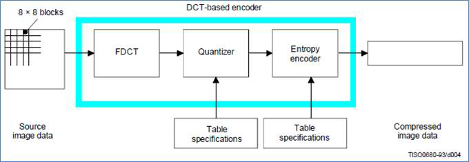
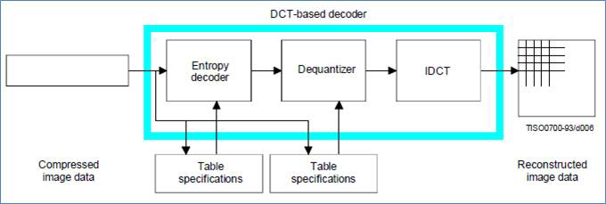
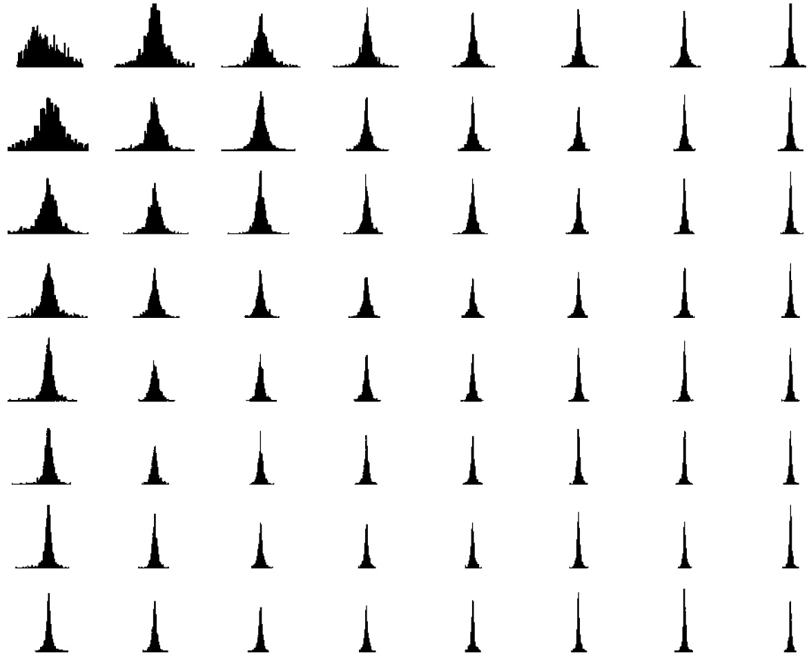
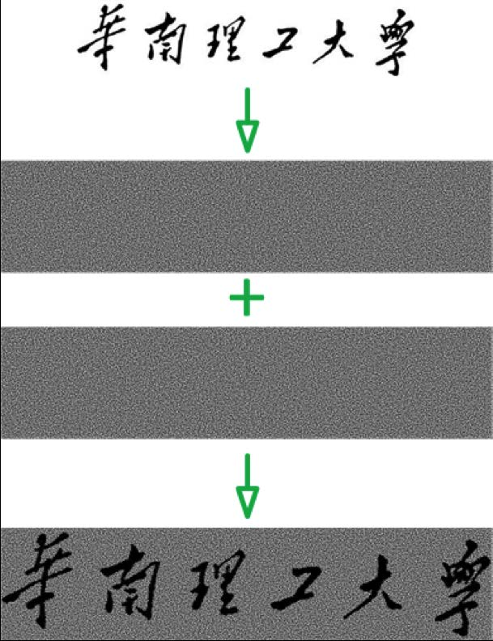
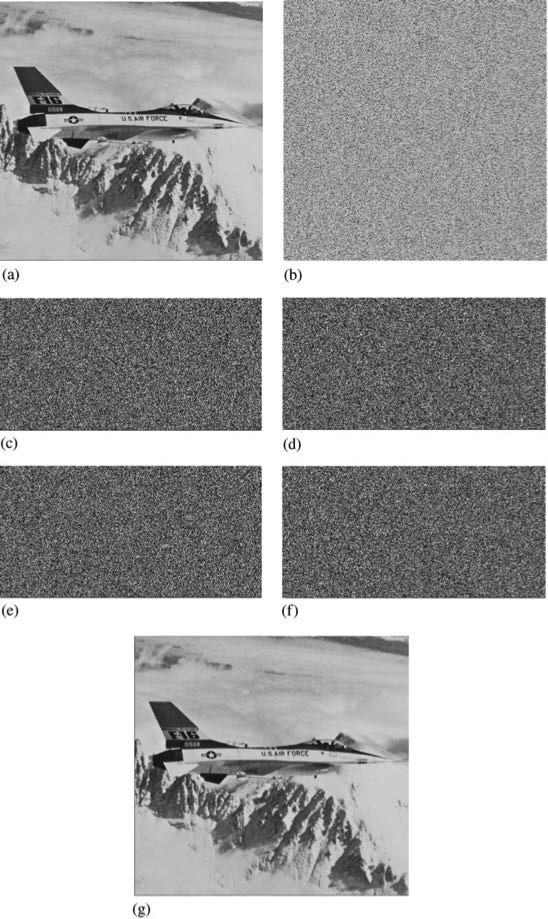

# Examples

<!-- page: 1 -->

.

Numerical Methods

Image Retrieval, Image Forensic, Secret Image Sharing

.

何军辉

School of Computer Science and Engineering

South China University of Technology

....... ..... ................ ................ ................ ... .... . ... ........ .

<!-- page: 2 -->

JPEG Encoder and Decoder

Numerical

Methods

.

.

何军辉

JPEG

GGD Model

Moment
Estimation

Max-Like
Estimation

Lena Results

Secret
Sharing

2

.

.

.

.

.

.

.

.

.

.

.

.

.

.

.

.

.

.

.

.

...

...

...

...

...

...

...

...

...

...

...

...

...

...

...

...

...

...

...

...

<!-- page: 3 -->

Statistical Models of DCT Coefficients

Numerical

Methods

.

.

何军辉

It is generally believed that the luminance DC coefficients
亮度直流系数may be modeled as Gaussian distribution
and the luminance AC coefficients 亮度交流系数as
generalized Gaussian distribution 广义高斯分布.

JPEG

GGD Model

Moment
Estimation

Max-Like
Estimation

It is demonstrated that the chrominance DCT coefficients
色度DCT 系数exhibit the same distributions as for the
luminance component in YCbCr color space 颜色空间.

Lena Results

Secret
Sharing

The widths of the DCT coefficient distributions shrink with
the frequency values increasing. That is, the distributions
of higher frequency coefficients have smaller variance,
indicating a stronger peak zeros or generally smaller values.

3

.

.

.

.

.

.

.

.

.

.

.

.

.

.

.

.

.

.

.

.

...

...

...

...

...

...

...

...

...

...

...

...

...

...

...

...

...

...

...

...

<!-- page: 4 -->

Histogram of DCT coefficients of Bridge

Numerical

Methods

.

.

何军辉

JPEG

GGD Model

Moment
Estimation

Max-Like
Estimation

Lena Results

Secret
Sharing

4

.

.

.

.

.

.

.

.

.

.

.

.

.

.

.

.

.

.

.

.

...

...

...

...

...

...

...

...

...

...

...

...

...

...

...

...

...

...

...

...

<!-- page: 5 -->

Generalized Gaussian Distribution

Numerical

The probability density function (PDF) 概率密度函数of
GGD model is defined as

Methods

.

.

何军辉

{

)β}

(|x|

JPEG

f (x; α, β) =
β
2αΓ (1/β) exp

GGD Model

−

α

Moment
Estimation

∫∞

Max-Like
Estimation

0 tx−1e−tdt is the Euler Gamma function.
This PDF is a two-sided symmetric density with two
distributional parameters β 形状因子and α 方差因子that
control the shape and standard deviation of the density,
respectively.

where Γ (x) =

Lena Results

Secret
Sharing

√

With β = 2, α =

2, it becomes a standard normal
distribution;
As β →∞, it approximates the uniform distribution;
By setting β = 1, α = 1/λ, the Laplacian distribution is
obtained.

5

.

.

.

.

.

.

.

.

.

.

.

.

.

.

.

.

.

.

.

.

...

...

...

...

...

...

...

...

...

...

...

...

...

...

...

...

...

...

...

...

<!-- page: 6 -->

Mallat’s Moment Estimatation

Numerical

The distributional parameters α and β may be computed
by measuring the first and second moment of the GGD
distribution.

Methods

.

.

何军辉

∫

JPEG

|x| f (x; α, β) dx = αΓ (2/β)

GGD Model

m1 =

Γ (1/β)

Moment
Estimation

∫

x2f (x; α, β) dx = α2Γ (3/β)

m2 =

Max-Like
Estimation

Γ (1/β)

Lena Results

From the above two equations, we can derive that

Secret
Sharing

=
Γ2 (2/β)
Γ (1/β) Γ (3/β)

m2

1
m2

Given the samples xi (N denotes the number of samples), m1
and m2 can be estimated by

∑

∑

ˆm1 = 1

|xi|,
ˆm2 = 1

x2

i

N

N

6

.

.

.

.

.

.

.

.

.

.

.

.

.

.

.

.

.

.

.

.

...

...

...

...

...

...

...

...

...

...

...

...

...

...

...

...

...

...

...

...

<!-- page: 7 -->

GGD Maximum-Likelihood Estimator

Numerical

Let us define the likelihood function 似然函数as

Methods

.

.

∏N

何军辉

L(x; α, β) = log

i=1 p (xi; α, β) .

JPEG

From the theory of parameter estimation, the ML estimates of α
and β are defined as

GGD Model

Moment
Estimation

(ˆα, ˆβ) = argmax

L(x; α, β)

Max-Like
Estimation

α,β

Lena Results

Then ˆα and ˆβ can be obtained by resolving the following two
likelihood equations 似然方程:

Secret
Sharing

N
∑

β|xi|βα−β

∂L(x; α, β)

∂α
= −N

α +

α
= 0

i=1

(|xi|

)β

(|xi|

)

N
∑

∂L(x; α, β)

∂β
= N

β + NΨ(1/β)

log

β2
−

= 0

α

α

i=1

7

.

.

.

.

.

.

.

.

.

.

.

.

.

.

.

.

.

.

.

.

...

...

...

...

...

...

...

...

...

...

...

...

...

...

...

...

...

...

...

...

<!-- page: 8 -->

GGD Maximum-Likelihood Estimator

Numerical

Methods

.

.

According to the first likelihood equation, we have

何军辉

(

)1/β

JPEG

N
∑

β
N

|xi|β

GGD Model

ˆα =

.

Moment
Estimation

i=1

Max-Like
Estimation

By inserting ˆα into the second likelihood equation, we get
the following equation about the shape parameter β.

Lena Results

( ˆβ

i=1|xi|ˆβ)

Secret
Sharing

∑N

∑N

i=1|xi|ˆβ log|xi|

log

1 + Ψ(1/ˆβ)
ˆβ

N

−

i=1|xi|ˆβ
+

= 0

∑N

ˆβ

where Ψ(·) is Digamma function defined by
Ψ(x) = Γ′(x)/Γ(x).

8

.

.

.

.

.

.

.

.

.

.

.

.

.

.

.

.

.

.

.

.

...

...

...

...

...

...

...

...

...

...

...

...

...

...

...

...

...

...

...

...

<!-- page: 9 -->

GGD Parameters of Lena 8 × 8 block-DCT
Coefficients

Numerical

Mallat’s Moments Estimation (UP); Maximum-Likelihood
Estimation (DOWN)

Methods

.

.

何军辉

JPEG

0
1
2
3
4
5
6
7
0
-
(11.0,0.54)
(2.29,0.46)
(1.18,0.45)
(0.79,0.45)
(0.80,0.49)
(1.17,0.58)
(1.80,0.73)
1
(3.02,0.45)
(2.05,0.45)
(0.98,0.43)
(0.74,0.43)
(0.93,0.50)
(0.93,0.53)
(1.22,0.61)
(2.10,0.82)
2
(0.92,0.43)
(0.80,0.42)
(0.58,0.41)
(0.72,0.45)
(0.70,0.48)
(0.80,0.53)
(2.03,0.78)
(2.38,0.92)
3
(0.72,0.46)
(0.78,0.47)
(0.79,0.48)
(0.81,0.50)
(0.85,0.53)
(1.24,0.63)
(1.62,0.74)
(2.53,1.03)
4
(1.34,0.60)
(1.43,0.62)
(1.59,0.64)
(1.18,0.59)
(1.23,0.63)
(1.58,0.74)
(2.25,0.96)
(2.20,1.00)
5
(2.29,0.83)
(1.93,0.78)
(1.85,0.76)
(1.96,0.79)
(1.97,0.84)
(2.14,0.94)
(2.31,1.04)
(2.25,1.07)
6
(2.40,0.99)
(2.50,1.02)
(2.39,1.03)
(2.14,0.95)
(2.20,0.98)
(2.59,1.17)
(2.78,1.33)
(2.54,1.27)
7
(2.78,1.20)
(2.73,1.21)
(2.72,1.27)
(2.57,1.22)
(2.44,1.17)
(2.56,1.25)
(2.56,1.32)
(2.62,1.41)

GGD Model

Moment
Estimation

Max-Like
Estimation

Lena Results

Secret
Sharing

0
1
2
3
4
5
6
7
0
-
(6.49,0.47)
(1.82,0.44)
(2.18,0.52)
(1.77,0.55)
(2.06,0.64)
(2.28,0.75)
(2.71,0.89)
1
(3.41,0.47)
(1.41,0.42)
(1.18,0.44)
(1.34,0.49)
(1.77,0.59)
(1.93,0.67)
(2.26,0.78)
(2.69,0.94)
2
(1.61,0.49)
(1.04,0.45)
(1.02,0.46)
(1.44,0.53)
(1.66,0.61)
(1.74,0.67)
(2.66,0.90)
(2.82,1.03)
3
(1.85,0.59)
(1.64,0.57)
(1.50,0.56)
(1.49,0.59)
(1.85,0.67)
(2.08,0.77)
(2.32,0.89)
(2.73,1.10)
4
(2.47,0.76)
(2.15,0.71)
(2.22,0.72)
(1.81,0.68)
(1.90,0.75)
(2.33,0.90)
(2.58,1.05)
(2.49,1.10)
5
(2.90,0.96)
(2.49,0.89)
(2.47,0.88)
(2.46,0.90)
(2.38,0.93)
(2.50,1.05)
(2.56,1.12)
(2.50,1.17)
6
(2.67,1.07)
(2.78,1.11)
(2.63,1.10)
(2.48,1.05)
(2.45,1.06)
(2.70,1.22)
(2.81,1.35)
(2.59,1.30)
7
(2.86,1.23)
(2.79,1.24)
(2.78,1.30)
(2.66,1.27)
(2.55,1.22)
(2.62,1.28)
(2.59,1.34)
(2.62,1.41)

9

.

.

.

.

.

.

.

.

.

.

.

.

.

.

.

.

.

.

.

.

...

...

...

...

...

...

...

...

...

...

...

...

...

...

...

...

...

...

...

...

<!-- page: 10 -->

A Simple (k, n) Threshold Scheme

Numerical

Methods

.

.

何军辉

JPEG

GGD Model

Moment
Estimation

Max-Like
Estimation

Lena Results

Secret
Sharing

10

.

.

.

.

.

.

.

.

.

.

.

.

.

.

.

.

.

.

.

.

...

...

...

...

...

...

...

...

...

...

...

...

...

...

...

...

...

...

...

...

<!-- page: 11 -->

A Simple (k, n) Threshold Scheme

Numerical

Methods

Given k points in the 2-dimensional plane
(x1, y1),(x2, y2),. . .,(xk, yk) with distinct xi’s, there is one
and only one polynomail q(x) of degree k −1 such that
q(xi) = yi for all i.

.

.

何军辉

JPEG

GGD Model

Moment
Estimation

Without loss of generality, we can assume that the data D
is (or can be made) a number. To divide it into pieces Di,
we pick a random k −1 degree polynomial
q(x) = a0 + a1x + · · · + ak−1xk−1 in which a0 = D.

Max-Like
Estimation

Lena Results

Secret
Sharing

Evaluate D1 = q(1), D2 = q(2), . . . , Dn = q(n).

Given any subset of k of these Di values (together with
their identifying indices), we can find the coefficients of
q(x) by interpolation, and then evaluate D = q(0).

Knowledge of just k −1 of these values, on the other hand,
does not suffice in order to calculate D.

11

.

.

.

.

.

.

.

.

.

.

.

.

.

.

.

.

.

.

.

.

...

...

...

...

...

...

...

...

...

...

...

...

...

...

...

...

...

...

...

...

