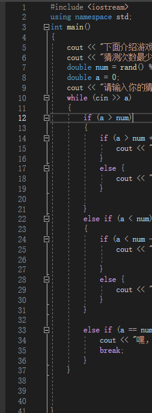

# 10.8测试

<!-- slide: 1 -->

## C++实验作业

- 1：调制程序技巧
- 2：设置断点技巧
- 3：OJ系统使用技巧
<!-- slide: 2 -->

- 调制程序是指对程序代码进行修改、优化或改进的过程。
- 对于像我一样的C++初学者，我认为调制程序具有三大技巧：提高代码可读性；内存管理；测试与调试
- 提高代码可读性
- 初学阶段，最重要的是养成良好的编码习惯，例如上课时候讲的合理命名变量及函数，以及如括号格式的安排，如下图所示，这是我业余时间写的一个猜数字游戏，含有多重条件语句。如果括号乱排，很容

- 易产生阅读上的障碍，进而造成程序失败。

<!-- slide: 3 -->

- 内存管理
- 例如int和double，这两个字节不同，但有时候其实可以表达同一个变量的数据类型，我们可以把整形数据用int表达，进而节省4字节的空间。
- 由于C++缺点就是效率较低，因此，会内存管理无疑是一个必备技能来提升效率。
- 测试与调试
- 这需要我们逐步测试和调试程序，查找和修复可能存在的错误和问题，并保证程序的正确性和稳定性。
- 于此，我们不得不谈断点的使用技巧。

<!-- slide: 4 -->

- 断点的使用，我认为现阶段只需要掌握七个即可。
  - 设置断点：在需要暂停程序执行的地方，通常是在代码的关键位置或者有问题的地方设置断点。可以在代码编辑器中点击行号旁边的空白区域或使用调试工具提供的命令来设置断点。
  - 条件断点：除了在特定的位置设置断点外，也可以设置条件断点。条件断点只有在满足特定条件时才会触发。这在需要观察特定条件下程序的行为时很有用。
  - 启用/禁用断点：当不需要某个断点时，可以暂时禁用它而不是删除。这样在下次运行程序时，该断点会保留，但不会触发。这对于在调试过程中进行有选择的断点调试很有帮助。
  - 单步执行：在断点位置暂停程序执行后，可以通过单步执行来逐步观察代码的执行过程，包括单步进入、单步跳过和单步返回。一步一步地执行代码有助于理清程序的逻辑和找出潜在的问题，我们作业就用到了这一点。
  - 查看变量值：在断点暂停时，可以查看程序中的变量值。这对于检查变量是否正确赋值或跟踪变量值的变化非常有用。
  - 异常断点：除了在特定位置设置断点外，还可以设置异常断点。异常断点会在捕获到指定类型的异常时触发断点，帮助我们追踪和调试异常情况。
  - 调试输出：在断点暂停时，可以通过调试输出打印一些信息。这些信息可以帮助你了解程序的状态和执行路径。

<!-- slide: 5 -->

- OJ平台，目前我们使用的方面是提交C++作业和C++上机测试，但二者操作技巧基本相同。
- 首先我们需要牢记一个必须，三个基准
- 一个必须是指必须记住网址！！！222.201.144.175！！
- 三个基准是：登录好自己的学生号，选择好自己的课程，点击对自己的项目
- 然后提交作业后发现错误，可以进入提交界面，直接开始编辑自己上次的代码
- 如是操作，OJ平台会变成有利于我们学习C++的制胜法宝！
- 家人们可以把网站保存在收藏夹！！

